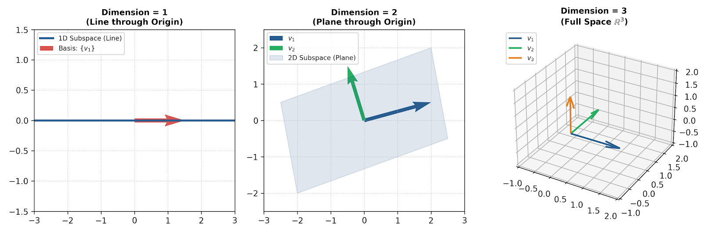
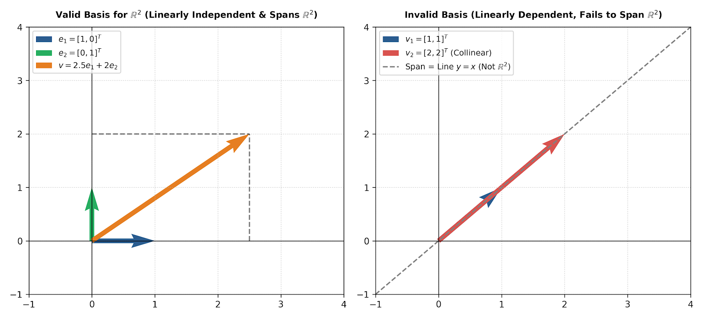

# Linear Algebra: Basis and Dimension

## 1. Introduction & Definitions

In linear algebra, the concepts of **Basis** and **Dimension** provide a systematic way to measure, represent, and analyze vector spaces.

### Linear Independence
A set of vectors $\{\mathbf{v}_1, \mathbf{v}_2, \dots, \mathbf{v}_k\}$ in a vector space $V$ is **linearly independent** if the only scalars $c_1, c_2, \dots, c_k$ satisfying:

$$c_1 \mathbf{v}_1 + c_2 \mathbf{v}_2 + \dots + c_k \mathbf{v}_k = \mathbf{0}$$

are $c_1 = c_2 = \dots = c_k = 0$. If any $c_i \neq 0$, the set is **linearly dependent**.

### Basis
A subset $\mathcal{B} = \{\mathbf{v}_1, \mathbf{v}_2, \dots, \mathbf{v}_n\}$ of a vector space $V$ is called a **basis** for $V$ if it satisfies two conditions:
1. **Linear Independence**: $\mathcal{B}$ is a linearly independent set.
2. **Spanning Property**: $\text{Span}(\mathcal{B}) = V$ (every vector in $V$ can be written as a linear combination of vectors in $\mathcal{B}$).

---

## 2. Geometric Interpretation

A basis defines a coordinate system for a space. Without linear independence, redundancy exists. Without spanning power, the set cannot reach all points in the space.



---

## 3. Dimension of a Vector Space

The **dimension** of a non-zero vector space $V$, denoted $\dim(V)$, is defined as the **number of vectors in any basis** for $V$.

* The zero space $\{\mathbf{0}\}$ has dimension $0$.
* If $V$ is spanned by a finite set of vectors, $V$ is finite-dimensional.

### Geometric Dimension Hierarchy
* **0D**: The origin $\{\mathbf{0}\}$
* **1D**: A line passing through the origin
* **2D**: A plane passing through the origin
* **3D**: Full space $\mathbb{R}^3$



---

## 4. Coordinates Relative to a Basis

Given a basis $\mathcal{B} = \{\mathbf{b}_1, \mathbf{b}_2, \dots, \mathbf{b}_n\}$ for $V$, every vector $\mathbf{x} \in V$ can be **uniquely** expressed as:

$$\mathbf{x} = c_1 \mathbf{b}_1 + c_2 \mathbf{b}_2 + \dots + c_n \mathbf{b}_n$$

The scalar vector $[\mathbf{x}]_{\mathcal{B}} = [c_1, c_2, \dots, c_n]^T \in \mathbb{R}^n$ is called the **coordinate vector of $\mathbf{x}$ relative to $\mathcal{B}$**.


---

## 5. Python Implementation

This Python code demonstrates how to check for linear independence, find basis vectors, compute dimension (rank), and perform coordinate conversion using `numpy` and `scipy`.

```python
import numpy as np

# Define a set of column vectors as a matrix A
A = np.array([
    [1,  2,  3],
    [0,  1,  2],
    [1,  0, -1]
], dtype=float)

print("Matrix A (Columns are vectors v1, v2, v3):")
print(A)

# 1. Determine Dimension (Rank)
rank = np.linalg.matrix_rank(A)
print(f"\nDimension of Span(v1, v2, v3) = Rank(A) = {rank}")

# 2. Check for Linear Independence
n_vectors = A.shape[1]
is_linearly_independent = (rank == n_vectors)
print(f"Are vectors linearly independent? {is_linearly_independent}")

# 3. Extract Basis vectors (Linearly Independent Columns)
basis_vectors = A[:, :rank]
print("\nBasis for the spanned space:")
print(basis_vectors)

# 4. Coordinate Conversion Relative to New Basis
# Target vector x = [1, 2, 3]^T
x = np.array([1, 2, 3], dtype=float)
B = A[:, :2] # Basis matrix B formed by 2 basis vectors
coords, _, _, _ = np.linalg.lstsq(B, x, rcond=None)
print(f"\nCoordinates of x relative to Basis B: {coords}")