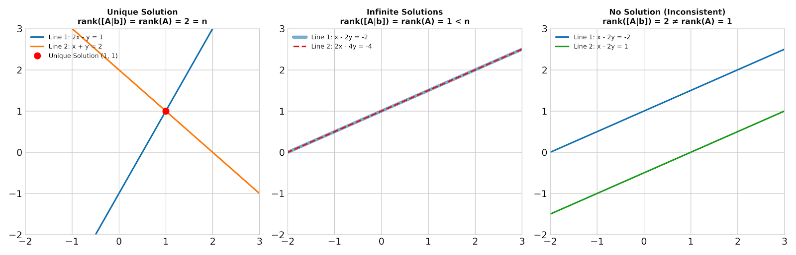
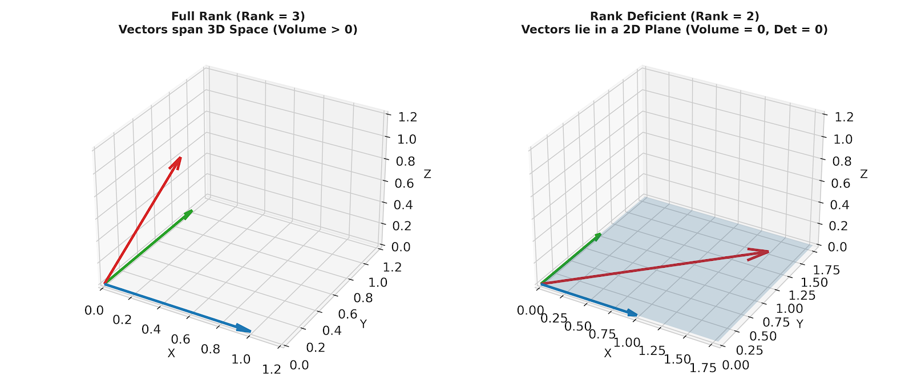
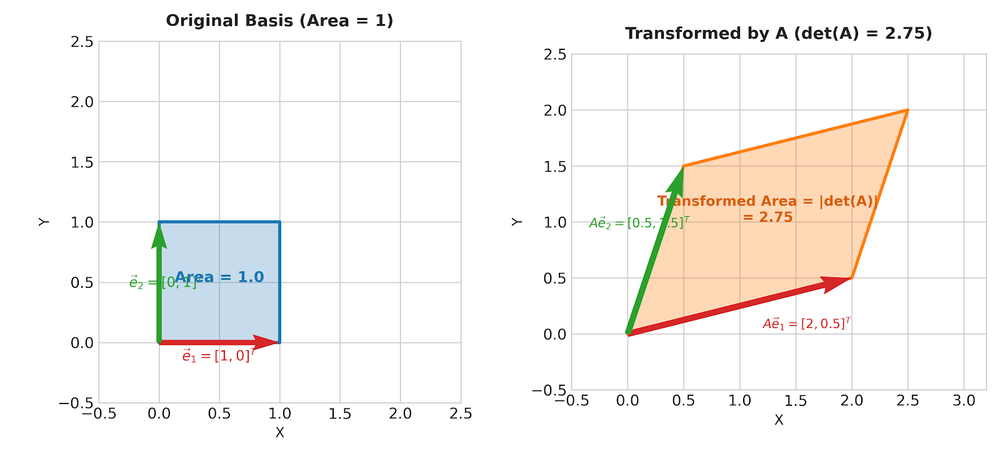

# :classical_building: Mathematics for IT Course - M.Tech. 1st Semester, IIIT Allahabad
## Unit 1: Linear Algebra and Matrix Theory
### Current Topic: Determinants, Matrix Rank, and Linear Systems - Basics, graphical interpretation, solved examples, and Python implementation
---
## 👥 Instructor Information
* **Edited by Instructor:** [Dr. Mohammed Javed](https://sites.google.com/site/mohammedjaved2016/)
* **Email:** javed@iiita.ac.in
* **Senior Teaching Assistants:** Mr. Apurba Chakraborty (rsi2024005@iiita.ac.in), Ms Aarthi Jha (rsi2025509@iiita.ac.in)
---
## 🎯 1. Learning Objectives


---

## 1. Introduction

Linear algebra provides the mathematical backbone for modern data science, quantum computing, computer graphics, optimization, and physics. Two of the most foundational concepts in linear algebra are the **Determinant** and the **Rank** of a matrix.

- The **Determinant** measures how a linear transformation scales volumes and flips orientation in space. It serves as a scalar test for matrix invertibility.
- The **Rank** measures the true dimensionality of the output space of a matrix transformation, indicating how much information is preserved or collapsed.

---

## 2. Determinants of Square Matrices

The determinant is a scalar value uniquely associated with any **square matrix** $A \in \mathbb{R}^{n \times n}$, denoted as $\det(A)$ or $\vert{}A\vert{}$.

### Geometric Intuition

Geometrically, a matrix transformation $A$ maps the unit hypercube in $\mathbb{R}^n$ into a parallelepiped. The **absolute value of the determinant**, $\vert{}\det(A)\vert{}$, represents the factor by which areas (in 2D), volumes (in 3D), or $n$-dimensional volumes are scaled under $A$.

- If $\det(A) > 0$, the transformation preserves spatial orientation (right-handed orientation stays right-handed).
- If $\det(A) < 0$, the transformation reverses orientation (a reflection occurs).
- If $\det(A) = 0$, the transformation collapses space into a lower dimension (area or volume becomes zero), making the matrix **singular** and non-invertible.



*Figure 1: Geometric interpretation of determinant as area scaling factor in 2D space.*

---

### Analytical Definitions & Computation

#### 1. $2 \times 2$ Matrix

For a matrix 

$$
A = \begin{pmatrix} a & b \\ 
c & d \end{pmatrix}
$$

$\det(A) = ad - bc$

#### 2. $3 \times 3$ Matrix (Sarrus' Rule / Laplace Expansion)

For 

$$
A = \begin{pmatrix} 
a & b & c \\ 
d & e & f \\
g & h & i \end{pmatrix}
$$:

$$\det(A) = a(ei - fh) - b(di - fg) + c(dh - eg)$$

#### 3. General $n \times n$ Matrix (Laplace Cofactor Expansion)
For any row $i$:

$$\det(A) = \sum_{j=1}^{n} (-1)^{i+j} a_{ij} M_{ij}$$

where $M_{ij}$ is the minor (determinant of the $(n-1) \times (n-1)$ submatrix obtained by deleting row $i$ and column $j$). The quantity $C_{ij} = (-1)^{i+j} M_{ij}$ is called the **cofactor**.

---

### Fundamental Properties of Determinants

1. **Identity Matrix:** $\det(I) = 1$.
2. **Transpose:** $\det(A^T) = \det(A)$.
3. **Multiplicativity:** $\det(AB) = \det(A) \cdot \det(B)$.
4. **Inverse:** If $A$ is invertible, $\det(A^{-1}) = \frac{1}{\det(A)}$.
5. **Scalar Multiplication:** For $A \in \mathbb{R}^{n \times n}$ and scalar $k \in \mathbb{R}$, $\det(kA) = k^n \det(A)$.
6. **Row Swaps:** Swapping any two rows (or columns) multiplies the determinant by $-1$.
7. **Identical Rows/Columns:** If a matrix has two identical rows or columns, $\det(A) = 0$.
8. **Row Addition:** Adding a scalar multiple of one row to another row leaves the determinant **unchanged**.
9. **Triangular Matrices:** The determinant of an upper or lower triangular matrix equals the product of its diagonal entries:
   $$\det(A) = \prod_{i=1}^n a_{ii}$$

---

## 3. Rank of a Matrix

The **rank** of a matrix $A \in \mathbb{R}^{m \times n}$, denoted as $\text{rank}(A)$ or $\text{rg}(A)$, is the maximum number of **linearly independent** row vectors (or column vectors) in $A$.

### Linearly Independent Vectors & Vector Spaces

A set of vectors $\{\mathbf{v}_1, \mathbf{v}_2, \dots, \mathbf{v}_k\}$ is **linearly independent** if:

$$c_1 \mathbf{v}_1 + c_2 \mathbf{v}_2 + \dots + c_k \mathbf{v}_k = \mathbf{0} \implies c_1 = c_2 = \dots = c_k = 0$$

- **Column Rank:** Maximum number of linearly independent columns.
- **Row Rank:** Maximum number of linearly independent rows.
- **Fundamental Theorem:** For any matrix $A$, $\text{Row Rank}(A) = \text{Column Rank}(A) = \text{rank}(A)$.



*Figure 2: Geometric illustration of Full Rank vs. Rank Deficient matrices in 3D space.*

---

### Row Echelon Form (REF) & Reduced Row Echelon Form (RREF)

By applying Elementary Row Operations (EROs):
1. Swapping two rows
2. Multiplying a row by a non-zero scalar
3. Adding a multiple of one row to another

We can reduce any matrix $A$ into its **Row Echelon Form (REF)** or **Reduced Row Echelon Form (RREF)**.

- **Rank Rule:** The rank of $A$ equals the number of non-zero rows (or pivot elements) in its REF/RREF form.

---

### Methods for Computing Matrix Rank

1. **Gaussian Elimination (REF Method):** Reduce $A$ using row operations and count the number of pivots.
2. **Determinant Minor Method:** $\text{rank}(A)$ is the order $r$ of the largest non-zero square minor of $A$.
3. **Singular Value Decomposition (SVD):** $\text{rank}(A)$ equals the number of non-zero singular values ($\sigma_i > 0$).

---

### The Rank-Nullity Theorem

For any linear transformation $A: \mathbb{R}^n \to \mathbb{R}^m$ represented by an $m \times n$ matrix $A$:

$$\text{rank}(A) + \text{nullity}(A) = n$$

Where:
- $\text{rank}(A) = \dim(\text{Col}(A))$ is the dimension of the Column Space (Image).
- $\text{nullity}(A) = \dim(\text{Null}(A))$ is the dimension of the Null Space (Kernel).
- $n$ is the total number of columns (dimension of the domain space).

---

### Properties of Matrix Rank

1. **Upper Bound:** $\text{rank}(A) \le \min(m, n)$ for an $m \times n$ matrix.
2. **Full Rank:** $A$ is full rank if $\text{rank}(A) = \min(m, n)$.
3. **Transpose Invariance:** $\text{rank}(A) = \text{rank}(A^T)$.
4. **Product Property:** $\text{rank}(AB) \le \min(\text{rank}(A), \text{rank}(B))$.
5. **Invertibility Criterion:** An $n \times n$ matrix $A$ is invertible if and only if $\text{rank}(A) = n$ (i.e., $\det(A) \neq 0$).

---

## 4. Applications to Systems of Linear Equations

A system of linear equations can be expressed as $A\mathbf{x} = \mathbf{b}$, where $A \in \mathbb{R}^{m \times n}$, $\mathbf{x} \in \mathbb{R}^n$, and $\mathbf{b} \in \mathbb{R}^m$. The augmented matrix is $[A \mid \mathbf{b}]$.

### Rouché–Capelli Theorem

1. **Consistent System (At least one solution):**
 
   $$\text{rank}(A) = \text{rank}([A \mid \mathbf{b}])$$

   - **Unique Solution:** If $\text{rank}(A) = \text{rank}([A \mid \mathbf{b}]) = n$ (number of variables).
   - **Infinitely Many Solutions:** If $\text{rank}(A) = \text{rank}([A \mid \mathbf{b}]) < n$. The solution space has $n - \text{rank}(A)$ free parameters.

3. **Inconsistent System (No solution):**

    $$\text{rank}(A) \neq \text{rank}([A \mid \mathbf{b}])$$



*Figure 3: Geometric representation of linear systems solutions categorized by matrix rank.*

---

## 5. Python Implementations

### Computing Determinants (NumPy & SymPy)

```python
import numpy as np
import sympy as sp

# --- Using NumPy (Numerical Computation) ---
A_num = np.array([[4, 2, 1],
                  [0, 5, 3],
                  [2, 1, 6]], dtype=float)

det_num = np.linalg.det(A_num)
print(f"Numerical Determinant (NumPy): {det_num:.4f}")

# --- Using SymPy (Symbolic Computation) ---
a, b, c, d = sp.symbols('a b c d')
A_sym = sp.Matrix([[a, b], [c, d]])
det_sym = A_sym.det()
print(f"Symbolic Determinant (SymPy): {det_sym}")

# Concrete matrix in SymPy
A_exact = sp.Matrix([[4, 2, 1], [0, 5, 3], [2, 1, 6]])
print(f"Exact Determinant (SymPy): {A_exact.det()}")
```
---
## ❓: CHALLENGING Questions - Check Your Understanding 
* ➡️ **[Q-01]**
* ➡️ 

---
## 📚 References 
* **[R-01]** Linear Algebra by Gilbert Strang, MIT Press
* **[R-02]** ChatGPT - for examples and codes
