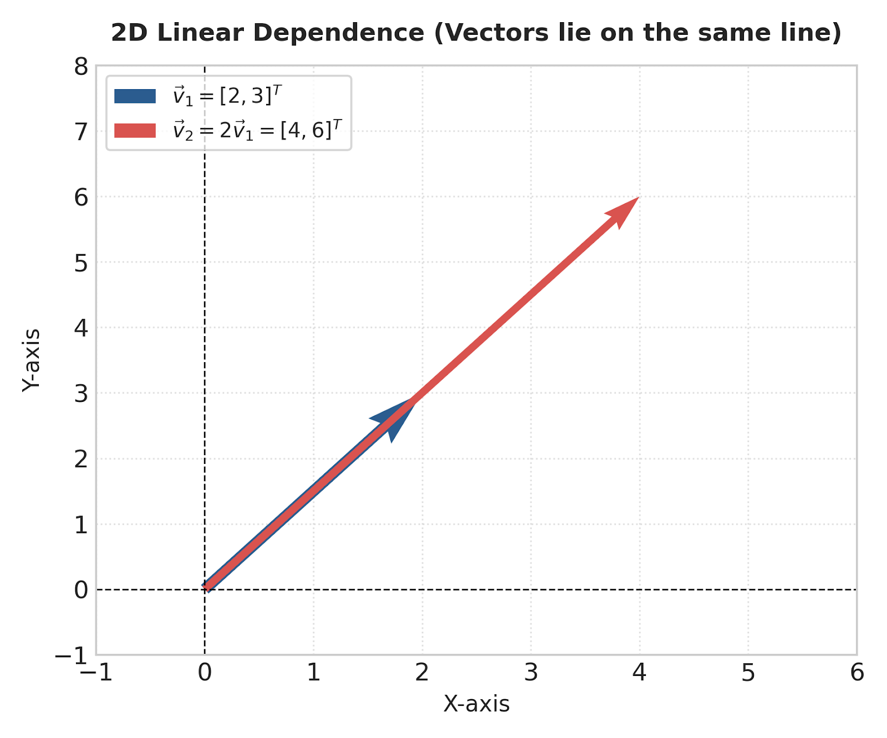
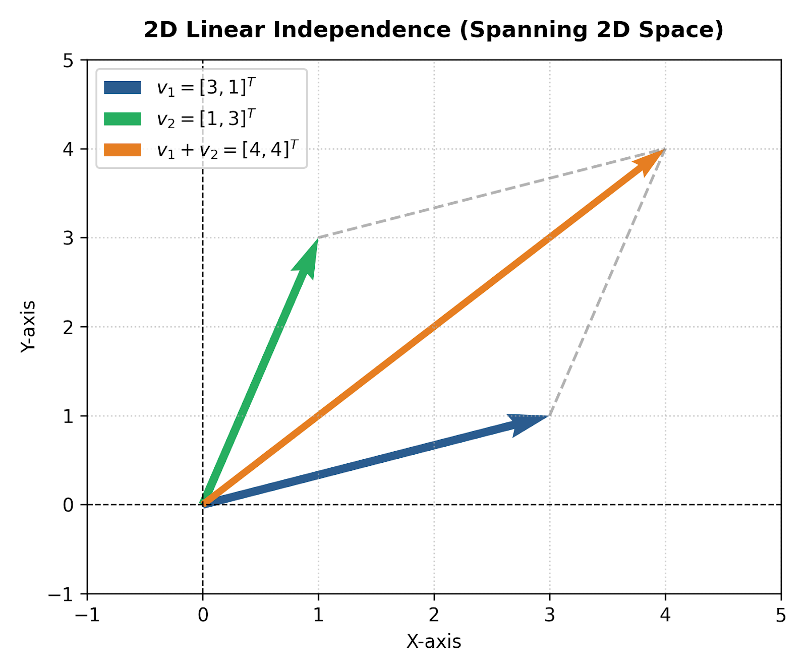
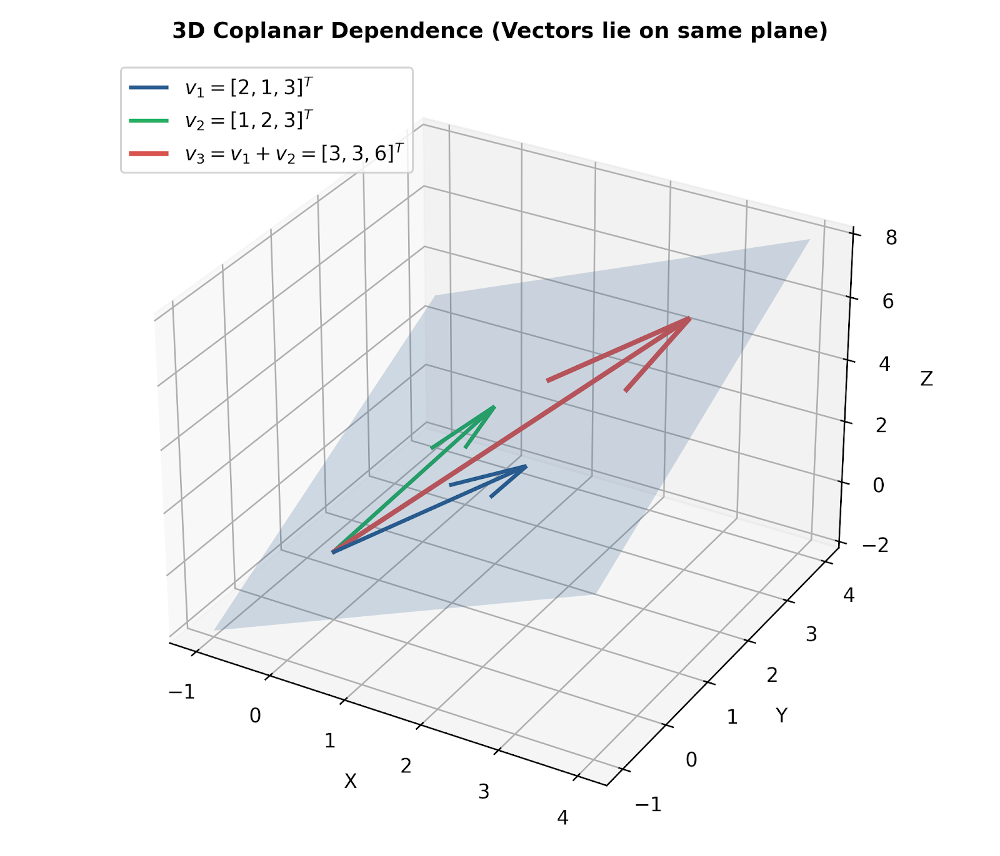
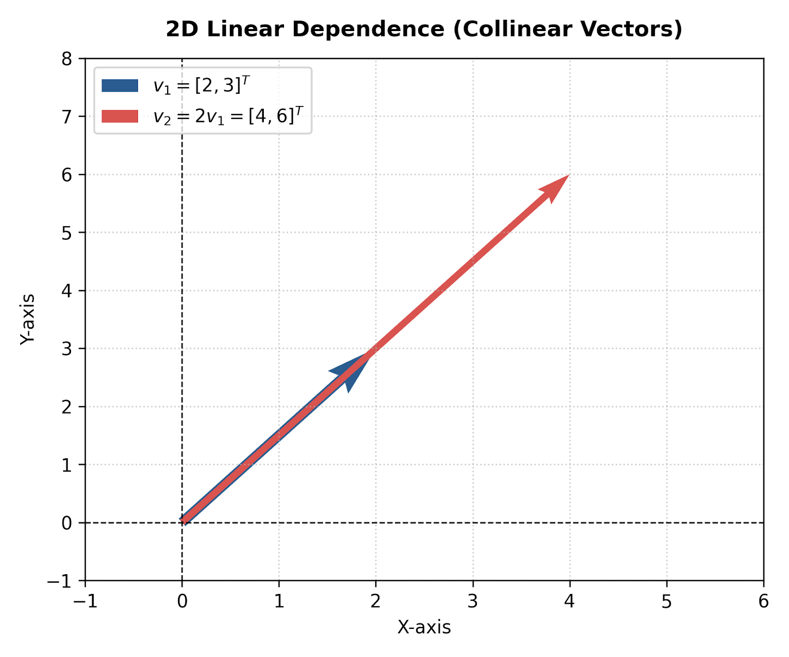

# Comprehensive Guide: Linear Dependence and Independence

## 1. Introduction & Core Concepts

In Linear Algebra, understanding whether a set of vectors contains redundant information is fundamental. This concept is categorized into **Linear Dependence** and **Linear Independence**.

### 1.1 Mathematical Definition

Given a set of $k$ vectors $S = \{\vec{v}_1, \vec{v}_2, \dots, \vec{v}_k\}$ in a vector space $V$, consider the vector equation:

$$c_1 \vec{v}_1 + c_2 \vec{v}_2 + \dots + c_k \vec{v}_k = \vec{0}$$

where $c_1, c_2, \dots, c_k$ are scalar coefficients.

* **Linearly Independent:** The set $S$ is **linearly independent** if and only if the only solution to the vector equation is the trivial solution:
  $$c_1 = c_2 = \dots = c_k = 0$$
  This implies that no vector in the set can be expressed as a linear combination of the others.

* **Linearly Dependent:** The set $S$ is **linearly dependent** if there exists at least one set of scalars $c_1, c_2, \dots, c_k$, **not all zero**, such that:
  $$c_1 \vec{v}_1 + c_2 \vec{v}_2 + \dots + c_k \vec{v}_k = \vec{0}$$
  This implies that at least one vector in the set is redundant and can be represented as a linear combination of the remaining vectors.

---

## 2. Visualizing Linear Dependence & Independence

### 2.1 Two-Dimensional Space ($R^2$)

In $R^2$, two vectors are linearly dependent if and only if they are **collinear** (lying on the exact same line through the origin).



* **Figure 1 Explanation:** The vector $\vec{v}_2 = [4, 6]^T$ is a direct scalar multiple of $\vec{v}_1 = [2, 3]^T$ (i.e., $\vec{v}_2 = 2\vec{v}_1$). Thus, $-2\vec{v}_1 + 1\vec{v}_2 = \vec{0}$, proving linear dependence.

Conversely, if two vectors point in different directions, they are linearly independent and span the entire 2D plane.



* **Figure 2 Explanation:** Vectors $\vec{v}_1 = [3, 1]^T$ and $\vec{v}_2 = [1, 3]^T$ point in non-parallel directions. No scalar multiplier can turn $\vec{v}_1$ into $\vec{v}_2$. Together, they span $R^2$.

### 2.2 Three-Dimensional Space ($R^3$)

In $R^3$, three vectors are linearly dependent if they are **coplanar** (all three lie on the same 2D flat plane passing through the origin).



* **Figure 3 Explanation:** Vector $\vec{v}_3 = [3, 3, 6]^T$ is the linear combination of $\vec{v}_1 = [2, 1, 3]^T$ and $\vec{v}_2 = [1, 2, 3]^T$ (i.e., $\vec{v}_1 + \vec{v}_2 = \vec{v}_3$). All three vectors lie flat on the rendered blue surface.

---

## 3. How to Test for Linear Independence

To test if a set of column vectors $\{\vec{v}_1, \vec{v}_2, \dots, \vec{v}_n\}$ in $R^m$ is linearly independent, construct a matrix $A$ where the columns are the vectors:

$$A = \begin{bmatrix} | & | & & | \\ \vec{v}_1 & \vec{v}_2 & \dots & \vec{v}_n \\ | & | & & | \end{bmatrix}$$

Then evaluate $A\vec{c} = \vec{0}$.



### Summary Criteria

| Property / Criterion | Linearly Independent | Linearly Dependent |
| :--- | :--- | :--- |
| **System Solution $A\vec{c} = \vec{0}$** | Trivial solution only ($\vec{c} = \vec{0}$) | Non-trivial solutions exist |
| **Matrix Rank ($	ext{Rank}(A)$)** | $	ext{Rank}(A) = n$ (Full column rank) | $	ext{Rank}(A) < n$ |
| **Determinant $\det(A)$** *(if $m=n$)* | $\det(A) \neq 0$ | $\det(A) = 0$ |
| **Null Space / Nullity** | $\text{Nullity}(A) = 0$ | $\text{Nullity}(A) > 0$ |
| **Row Echelon Form** | Pivot in every column | At least one free column (no pivot) |

---

## 4. Python Implementations

Below are complete Python code implementations using **NumPy**, **SciPy**, and **SymPy** to test for linear independence.

### 4.1 Numerical Approach with NumPy (Rank & Determinant)

```python
import numpy as np

def check_linear_independence_numpy(vectors):
    """
    Checks linear independence of a set of vectors using NumPy matrix rank.
    vectors: list of 1D arrays or 2D column array
    """
    # Column-stack vectors into a matrix A
    A = np.column_stack(vectors)
    num_vectors = A.shape[1]
    
    # Calculate matrix rank using SVD under the hood
    rank = np.linalg.matrix_rank(A)
    
    print(f"Matrix Shape: {A.shape}")
    print(f"Number of Vectors (n): {num_vectors}")
    print(f"Matrix Rank: {rank}")
    
    if rank == num_vectors:
        print("=> Result: Vectors are LINEARLY INDEPENDENT.\n")
        return True
    else:
        print("=> Result: Vectors are LINEARLY DEPENDENT.\n")
        return False

# Example 1: Linearly Independent Set
v1 = np.array([1, 0, 0])
v2 = np.array([0, 1, 0])
v3 = np.array([1, 1, 2])

print("--- Testing Set 1 ---")
check_linear_independence_numpy([v1, v2, v3])

# Example 2: Linearly Dependent Set (v3 = 2*v1 + v2)
v1 = np.array([2, 1, 3])
v2 = np.array([1, 2, 3])
v3 = np.array([5, 4, 9]) # 2*v1 + v2

print("--- Testing Set 2 ---")
check_linear_independence_numpy([v1, v2, v3])
```

### 4.2 Symbolic Approach with SymPy (Finding Dependent Coefficients)

```python
import sympy as sp

def find_dependence_relation(vectors):
    """
    Uses SymPy to find explicit scalar coefficients c_i such that sum(c_i * v_i) = 0
    """
    # Create SymPy Matrix
    A = sp.Matrix(vectors).T  # Stack as columns
    
    # Compute Nullspace
    nullspace = A.nullspace()
    
    if not nullspace:
        print("Nullspace is empty -> Vectors are LINEARLY INDEPENDENT.")
    else:
        print("Nullspace found -> Vectors are LINEARLY DEPENDENT.")
        print("Non-trivial linear combination coefficients (c1, c2, ...):")
        for idx, vec in enumerate(nullspace):
            print(f" Solution vector {idx+1}: {vec.T}")

# Example Vectors
v1 = [2, 1, 3]
v2 = [1, 2, 3]
v3 = [3, 3, 6]  # v3 = v1 + v2 => v1 + v2 - v3 = 0

print("--- SymPy Symbolic Nullspace Test ---")
find_dependence_relation([v1, v2, v3])
```

---

## 5. Figures and Download Links

All figures generated for this document are stored locally and available for download:

* [Download Figure 1: 2D Linear Dependence Plot](figures/fig1_2d_dependent.png)
* [Download Figure 2: 2D Linear Independence Plot](figures/fig2_2d_independent.png)
* [Download Figure 3: 3D Coplanar Dependence Plot](figures/fig3_3d_coplanar_dependent.png)
* [Download Figure 4: Concept Map / Decision Tree Flowchart](figures/fig4_decision_tree.png)

---
*Created as part of the Linear Algebra Educational Series.*
