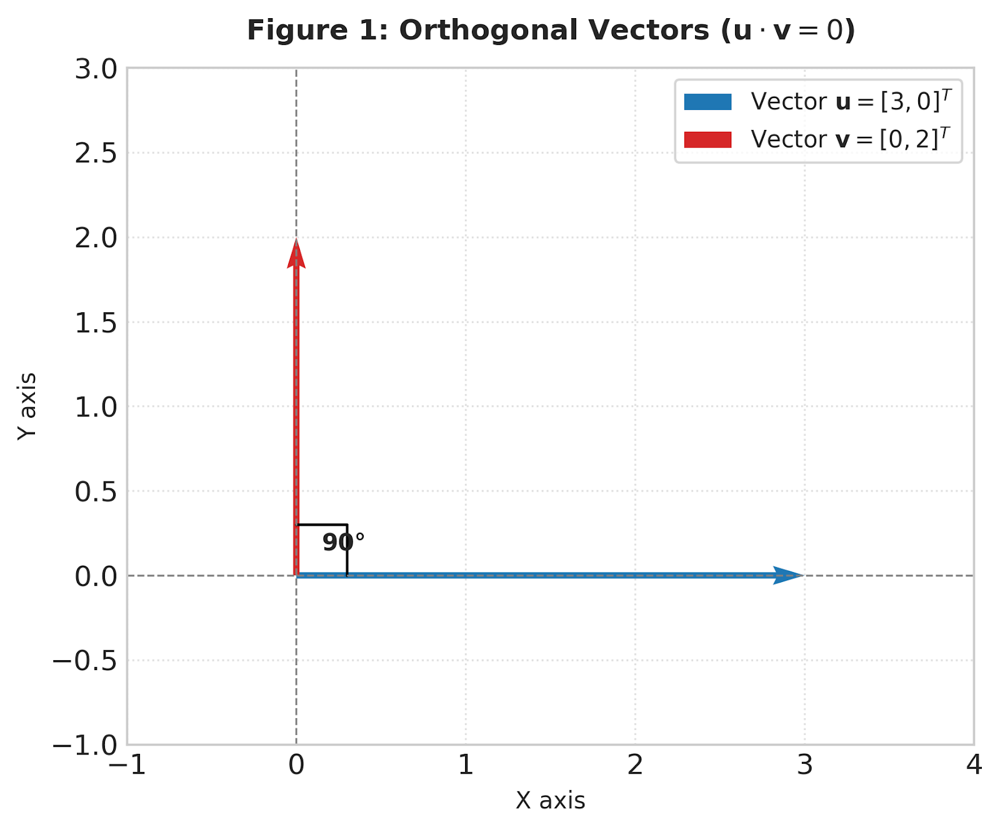
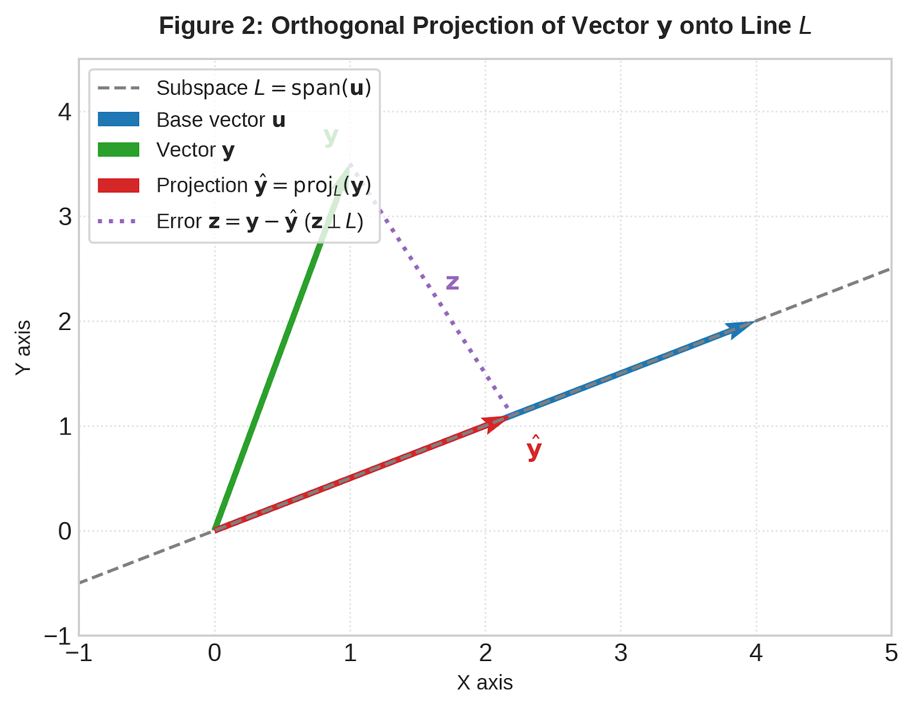
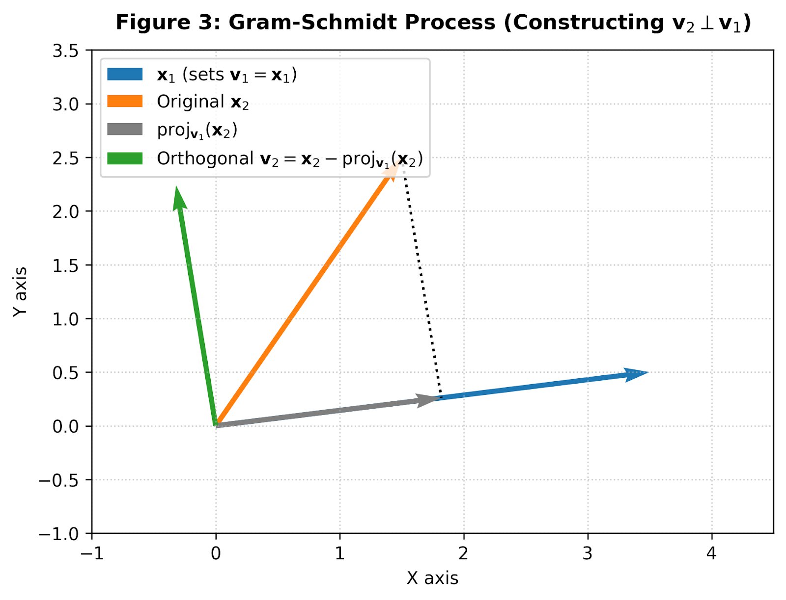

# :classical_building: Mathematics for IT Course - M.Tech. 1st Semester, IIIT Allahabad
## Unit 1: Linear Algebra and Matrix Theory
### Current Topic: Orthogonality and Projections - This study material covers essential concepts in linear algebra including Orthogonal Bases, Orthogonal Projections, and the Gram-Schmidt Orthogonalization process.
---
## 👥 Instructor Information
* **Edited by Instructor:** [Dr. Mohammed Javed](https://sites.google.com/site/mohammedjaved2016/)
* **Email:** javed@iiita.ac.in
* **Senior Teaching Assistants:** Mr. Apurba Chakraborty (rsi2024005@iiita.ac.in), Ms Aarthi Jha (rsi2025509@iiita.ac.in)
---
## 🎯 1. Learning Objectives


---

## 1. Fundamentals of Orthogonality

### 1.1 Definition of Inner Product and Orthogonality
In an $n$-dimensional Euclidean space $\mathbb{R}^n$, the inner product (dot product) of two vectors $\mathbf{u} = [u_1, u_2, \dots, u_n]^T$ and $\mathbf{v} = [v_1, v_2, \dots, v_n]^T$ is defined as:

$$\langle \mathbf{u}, \mathbf{v} \rangle = \mathbf{u}^T \mathbf{v} = \sum_{i=1}^{n} u_i v_i$$

Two vectors $\mathbf{u}$ and $\mathbf{v}$ are **orthogonal** (denoted $\mathbf{u} \perp \mathbf{v}$) if and only if their inner product is zero:

$$\mathbf{u} \cdot \mathbf{v} = 0$$

Geometrically, the inner product relates to the angle $\theta$ between vectors:

$$\mathbf{u} \cdot \mathbf{v} = \|\mathbf{u}\| \|\mathbf{v}\| \cos\theta$$

When $\mathbf{u} \cdot \mathbf{v} = 0$, $\cos\theta = 0$, which implies an angle of $90^\circ$ ( perpendicular ).



### 1.2 Orthogonal and Orthonormal Sets
A set of non-zero vectors $\{\mathbf{u}_1, \mathbf{u}_2, \dots, \mathbf{u}_k\}$ in $\mathbb{R}^n$ is an **orthogonal set** if:

$$\mathbf{u}_i \cdot \mathbf{u}_j = 0 \quad \text{for all } i \neq j$$

If every vector in an orthogonal set additionally has unit length ($\mathbf{u}_i \cdot \mathbf{u}_i = 1$), it is an **orthonormal set**:

$$\mathbf{u}_i \cdot \mathbf{u}_j = \delta_{ij} = \begin{cases} 1 & \text{if } i = j \\ 0 & \text{if } i \neq j \end{cases}$$

### 1.3 Orthogonal Bases
An **orthogonal basis** for a subspace $W \subseteq \mathbb{R}^n$ is a basis for $W$ that is also an orthogonal set.

**Coordinates relative to an orthogonal basis:**
If $\{\mathbf{u}_1, \mathbf{u}_2, \dots, \mathbf{u}_p\}$ is an orthogonal basis for $W$, then any vector $\mathbf{y} \in W$ can be uniquely written as:

$$\mathbf{y} = c_1 \mathbf{u}_1 + c_2 \mathbf{u}_2 + \dots + c_p \mathbf{u}_p$$

where the coefficients $c_i$ are computed independently via:

$$c_i = \frac{\mathbf{y} \cdot \mathbf{u}_i}{\mathbf{u}_i \cdot \mathbf{u}_i} = \frac{\mathbf{y} \cdot \mathbf{u}_i}{\|\mathbf{u}_i\|^2}$$

---

## 2. Orthogonal Projections

### 2.1 Projection onto a Line
The orthogonal projection of a vector $\mathbf{y}$ onto a non-zero vector $\mathbf{u}$ (or line $L = \mathrm{span}(\mathbf{u})$) is:

$$\mathrm{proj}_L(\mathbf{y}) = \hat{\mathbf{y}} = \left( \frac{\mathbf{y} \cdot \mathbf{u}}{\mathbf{u} \cdot \mathbf{u}} \right) \mathbf{u}$$

The component $\mathbf{z} = \mathbf{y} - \hat{\mathbf{y}}$ is perpendicular to $\mathbf{u}$.



### 2.2 Projection onto a General Subspace
Let $W$ be a subspace of $\mathbb{R}^n$ with orthogonal basis $\{\mathbf{u}_1, \mathbf{u}_2, \dots, \mathbf{u}_p\}$. The orthogonal projection of $\mathbf{y}$ onto $W$ is:

$$\mathrm{proj}_W(\mathbf{y}) = \hat{\mathbf{y}} = \sum_{i=1}^{p} \frac{\mathbf{y} \cdot \mathbf{u}_i}{\mathbf{u}_i \cdot \mathbf{u}_i} \mathbf{u}_i$$

### 2.3 Projection Matrix
If $A$ is a matrix whose columns form a basis for $W$, the matrix that projects any vector onto $W$ is:

$$P = A (A^T A)^{-1} A^T$$

Properties of $P$:
1. **Symmetric:** $P^T = P$
2. **Idempotent:** $P^2 = P$

---

## 3. Gram-Schmidt Orthogonalization

The Gram-Schmidt process is an algorithm for converting any set of linearly independent vectors $\{\mathbf{x}_1, \mathbf{x}_2, \dots, \mathbf{x}_p\}$ into an orthogonal basis $\{\mathbf{v}_1, \mathbf{v}_2, \dots, \mathbf{v}_p\}$ for the same subspace.



### Step-by-Step Algorithm:
1. $$\mathbf{v}_1 = \mathbf{x}_1$$
2. $$\mathbf{v}_2 = \mathbf{x}_2 - \mathrm{proj}_{\mathbf{v}_1}(\mathbf{x}_2) = \mathbf{x}_2 - \frac{\mathbf{x}_2 \cdot \mathbf{v}_1}{\|\mathbf{v}_1\|^2} \mathbf{v}_1$$
3. $$\mathbf{v}_3 = \mathbf{x}_3 - \mathrm{proj}_{\mathbf{v}_1}(\mathbf{x}_3) - \mathrm{proj}_{\mathbf{v}_2}(\mathbf{x}_3) = \mathbf{x}_3 - \frac{\mathbf{x}_3 \cdot \mathbf{v}_1}{\|\mathbf{v}_1\|^2} \mathbf{v}_1 - \frac{\mathbf{x}_3 \cdot \mathbf{v}_2}{\|\mathbf{v}_2\|^2} \mathbf{v}_2$$
4. In general for vector $k$:
   $$\mathbf{v}_k = \mathbf{x}_k - \sum_{j=1}^{k-1} \frac{\mathbf{x}_k \cdot \mathbf{v}_j}{\|\mathbf{v}_j\|^2} \mathbf{v}_j$$
5. To convert to an **orthonormal basis**, normalize each vector:
   $$\mathbf{e}_k = \frac{\mathbf{v}_k}{\|\mathbf{v}_k\|}$$

---

## 4. Complete Python Implementation

Below is the complete Python code implementation of these concepts using `numpy`.

```python
import numpy as np

def inner_product_and_orthogonality(u, v, tol=1e-10):
    """Calculates dot product and checks if vectors are orthogonal."""
    dot_val = np.dot(u, v)
    is_ortho = np.abs(dot_val) < tol
    return dot_val, is_ortho

def project_onto_line(y, u):
    """Projects vector y onto vector u (span(u))."""
    u = np.asarray(u, dtype=float)
    y = np.asarray(y, dtype=float)
    c = np.dot(y, u) / np.dot(u, u)
    proj_y = c * u
    error_z = y - proj_y
    return proj_y, error_z

def projection_matrix(A):
    """Computes projection matrix P = A(A^T A)^(-1) A^T for column space of A."""
    A = np.asarray(A, dtype=float)
    P = A @ np.linalg.inv(A.T @ A) @ A.T
    return P

def gram_schmidt(X, normalize=True):
    """
    Gram-Schmidt Orthogonalization.
    X: 2D numpy array where each column is an input vector.
    normalize: If True, returns orthonormal basis.
    """
    X = np.asarray(X, dtype=float)
    n, k = X.shape
    V = np.zeros((n, k), dtype=float)
    
    for i in range(k):
        v = X[:, i].copy()
        for j in range(i):
            proj_coeff = np.dot(X[:, i], V[:, j]) / np.dot(V[:, j], V[:, j])
            v -= proj_coeff * V[:, j]
        V[:, i] = v
        
    if normalize:
        Q = np.zeros_like(V)
        for i in range(k):
            norm = np.linalg.norm(V[:, i])
            if norm < 1e-12:
                raise ValueError("Linearly dependent columns passed.")
            Q[:, i] = V[:, i] / norm
        return Q
    return V

# --- Numerical Demonstrations ---
if __name__ == '__main__':
    # 1. Orthogonality test
    u = np.array([3, 0])
    v = np.array([0, 2])
    dot_val, is_ortho = inner_product_and_orthogonality(u, v)
    print(f"Dot product: {dot_val}, Orthogonal? {is_ortho}")

    # 2. Subspace Projection
    A = np.array([[1, 0], [1, 1], [0, 1]], dtype=float)
    y = np.array([2, 1, 3], dtype=float)
    P = projection_matrix(A)
    proj_y = P @ y
    print("\nProjection Matrix P:\n", P)
    print("Projected Vector proj_W(y):", proj_y)
    print("Is P symmetric?", np.allclose(P, P.T))
    print("Is P idempotent (P^2 = P)?", np.allclose(P @ P, P))

    # 3. Gram-Schmidt Process
    X = np.array([[1, 1, 1],
                  [1, 0, 2],
                  [0, 1, 1],
                  [1, 2, 0]], dtype=float)
    Q = gram_schmidt(X, normalize=True)
    print("\nOrthonormal basis Q:\n", Q)
    print("Q^T @ Q (Identity Check):\n", np.round(Q.T @ Q, 8))
```

---

## 5. Summary Table

| Concept | Mathematical Formula | Key Property |
| :--- | :--- | :--- |
| **Orthogonal Vectors** | $\mathbf{u} \cdot \mathbf{v} = 0$ | Angle $\theta = 90^\circ$ |
| **Projection on Line** | $\hat{\mathbf{y}} = \frac{\mathbf{y} \cdot \mathbf{u}}{\|\mathbf{u}\|^2}\mathbf{u}$ | Error $\mathbf{z} = \mathbf{y} - \hat{\mathbf{y}} \perp \mathbf{u}$ |
| **Projection Matrix** | $P = A(A^T A)^{-1}A^T$ | $P^T = P$ and $P^2 = P$ |
| **Gram-Schmidt Step** | $\mathbf{v}_k = \mathbf{x}_k - \sum_{j=1}^{k-1} \mathrm{proj}_{\mathbf{v}_j}(\mathbf{x}_k)$ | Constructs orthogonal vectors recursively |

---

## ❓: CHALLENGING Questions - Check Your Understanding 
* ➡️ **[Q-01]**
* ➡️ 

---
## 📚 References 
* **[R-01]** Linear Algebra by Gilbert Strang, MIT Press
* **[R-02]** ChatGPT - for examples and codes
