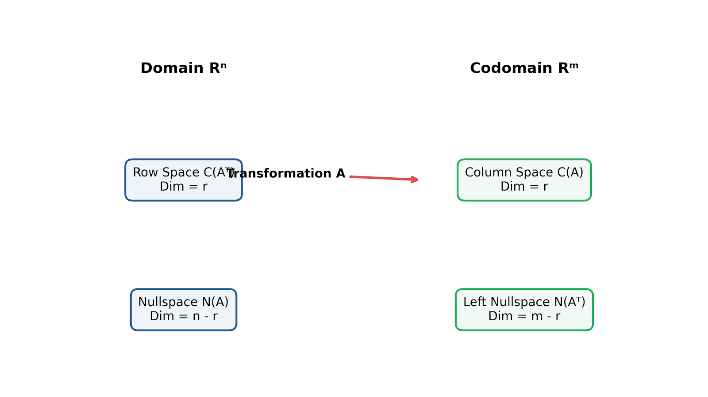
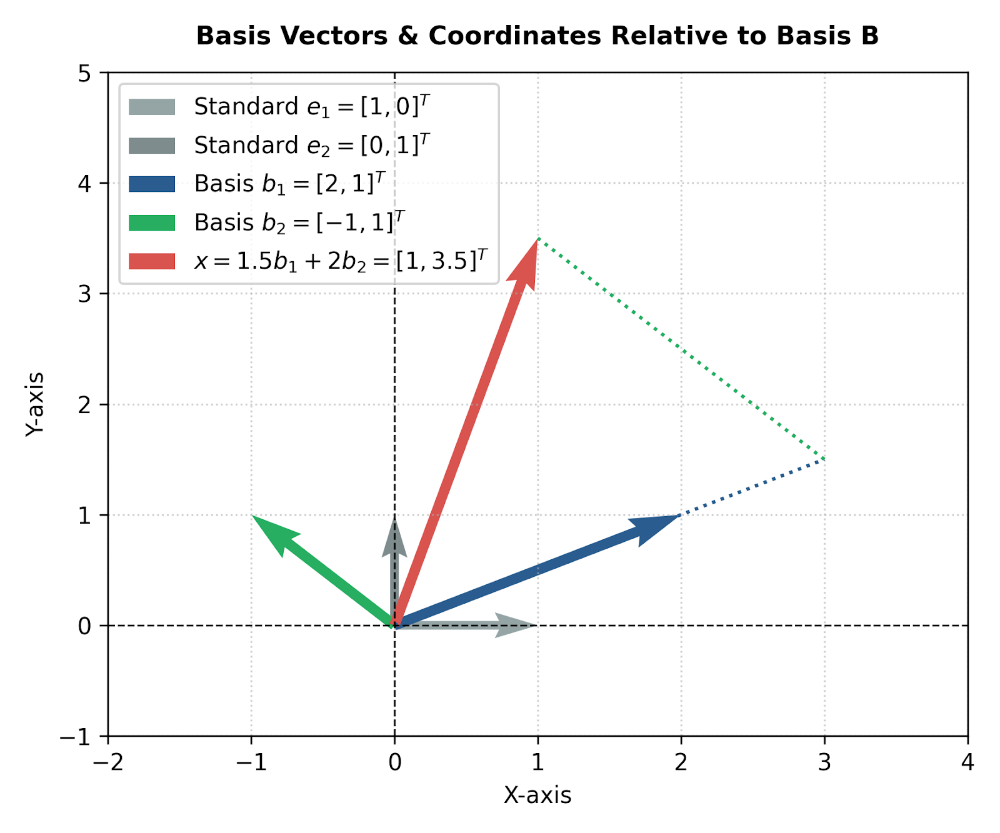
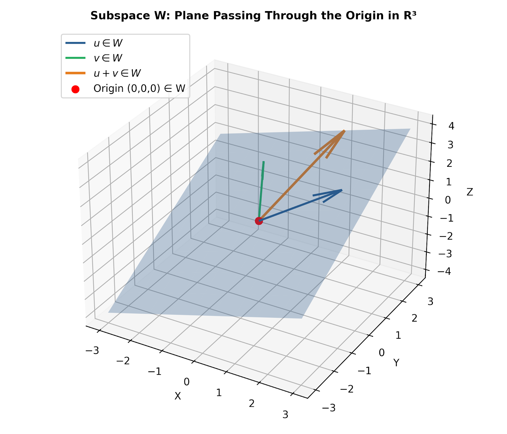
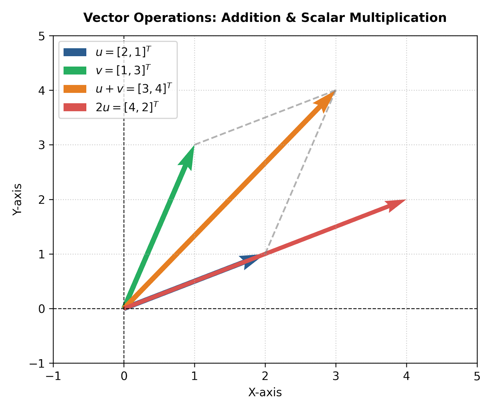

# Comprehensive Guide: Vector Spaces

## 1. Fundamental Definition & Axioms

A **Vector Space** (or linear space) $V$ over a field $F$ (typically real numbers $\mathbb{R}$ or complex numbers $\mathbb{C}$) is a set of objects, called **vectors**, equipped with two operations:
1. **Vector Addition:** $+ : V \times V \to V$
2. **Scalar Multiplication:** $\cdot : F \times V \to V$

For $V$ to be a valid vector space, these two operations must satisfy the **10 Vector Space Axioms** for all $\mathbf{u}, \mathbf{v}, \mathbf{w} \in V$ and all scalars $c, d \in F$:

### 1.1 Closure Axioms
1. **Closure under Addition:** $\mathbf{u} + \mathbf{v} \in V$
2. **Closure under Scalar Multiplication:** $c \mathbf{u} \in V$

### 1.2 Addition Axioms
3. **Commutativity:** $\mathbf{u} + \mathbf{v} = \mathbf{v} + \mathbf{u}$
4. **Associativity:** $(\mathbf{u} + \mathbf{v}) + \mathbf{w} = \mathbf{u} + (\mathbf{v} + \mathbf{w})$
5. **Additive Identity:** There exists a zero vector $\mathbf{0} \in V$ such that $\mathbf{u} + \mathbf{0} = \mathbf{u}$
6. **Additive Inverse:** For every $\mathbf{u} \in V$, there exists $-\mathbf{u} \in V$ such that $\mathbf{u} + (-\mathbf{u}) = \mathbf{0}$

### 1.3 Scalar Multiplication Axioms
7. **Distributivity over Vector Addition:** $c(\mathbf{u} + \mathbf{v}) = c\mathbf{u} + c\mathbf{v}$
8. **Distributivity over Scalar Addition:** $(c + d)\mathbf{u} = c\mathbf{u} + d\mathbf{u}$
9. **Compatibility of Multiplication:** $c(d\mathbf{u}) = (cd)\mathbf{u}$
10. **Scalar Identity:** $1\mathbf{u} = \mathbf{u}$, where $1$ is the multiplicative identity in $F$.

---

## 2. Visualizing Vector Space Concepts

### 2.1 Vector Addition and Scalar Scaling

Vectors in Euclidean space $\mathbb{R}^n$ obey standard parallelogram rules for vector addition and scaling along directional rays.



* **Figure 1 Explanation:** Vector addition $\mathbf{u} + \mathbf{v}$ forms the diagonal of the parallelogram bounded by $\mathbf{u}$ and $\mathbf{v}$. Scalar multiplication $2\mathbf{u}$ stretches the vector magnitude without changing its underlying span direction.

### 2.2 Subspaces

A non-empty subset $W \subseteq V$ is a **subspace** of $V$ if $W$ is itself a vector space under the same operations. 

To test if $W$ is a subspace, verify the **Three Subspace Properties**:
1. Zero Vector: $\mathbf{0} \in W$
2. Closed under Addition: If $\mathbf{u}, \mathbf{v} \in W$, then $\mathbf{u} + \mathbf{v} \in W$
3. Closed under Scalar Multiplication: If $\mathbf{u} \in W$ and $c \in F$, then $c\mathbf{u} \in W$



* **Figure 2 Explanation:** A plane passing through the origin $(0,0,0)$ in $\mathbb{R}^3$ represents a valid 2D subspace $W$. Any linear combination of vectors on this plane remains on the plane. Conversely, any plane *not* passing through the origin is **not** a subspace because it lacks the zero vector $\mathbf{0}$.

### 2.3 Basis and Dimension

* **Span:** $\text{Span}(\mathbf{v}_1, \dots, \mathbf{v}_k)$ is the set of all linear combinations $c_1\mathbf{v}_1 + \dots + c_k\mathbf{v}_k$.
* **Basis:** A set of vectors $B = \{\mathbf{b}_1, \dots, \mathbf{b}_n\}$ is a **basis** for $V$ if:
  1. $B$ is linearly independent.
  2. $B$ spans $V$ ($\text{Span}(B) = V$).
* **Dimension:** $\dim(V)$ is the unique number of vectors in any basis of $V$.



* **Figure 3 Explanation:** Any point $\mathbf{x}$ in a vector space can be uniquely identified by its coordinate vector $[\mathbf{x}]_B$ relative to a chosen basis $B$.

### 2.4 Fundamental Subspaces of a Matrix

For an $m \times n$ matrix $A$, there are four interconnected fundamental subspaces:



| Subspace | Symbol | Space | Dimension |
| :--- | :--- | :--- | :--- |
| **Column Space** | $C(A)$ | $\mathbb{R}^m$ | $r = \text{Rank}(A)$ |
| **Nullspace** | $N(A)$ | $\mathbb{R}^n$ | $n - r$ |
| **Row Space** | $C(A^T)$ | $\mathbb{R}^n$ | $r = \text{Rank}(A)$ |
| **Left Nullspace** | $N(A^T)$ | $\mathbb{R}^m$ | $m - r$ |

---

## 3. Python Implementations

Below are modular Python tools to test subspace membership, calculate basis vectors, perform coordinate transformations, and verify fundamental subspaces.

### 3.1 Checking Basis & Finding Coordinates Relative to Basis

```python
import numpy as np

def analyze_basis_and_coordinates(basis_vectors, vector_x):
    """
    Analyzes whether a set of vectors forms a basis for R^n 
    and computes coordinate vector [x]_B.
    """
    # Construct change-of-basis matrix P_B
    P_b = np.column_stack(basis_vectors)
    n, m = P_b.shape
    
    print(f"Matrix P_B shape: {n}x{m}")
    
    if n != m:
        print("Set is NOT a basis: Number of vectors does not match dimension.")
        return None
    
    det = np.linalg.det(P_b)
    if np.isclose(det, 0):
        print("Set is NOT a basis: Vectors are linearly dependent.")
        return None
        
    print("=> Set FORMS A VALID BASIS.")
    
    # Solve P_b * [x]_B = x
    coords = np.linalg.solve(P_b, vector_x)
    print(f"Coordinates relative to Basis B [x]_B: {coords}\n")
    return coords

# Define non-standard basis B = {b1, b2} for R^2
b1 = np.array([2, 1])
b2 = np.array([-1, 1])
target = np.array([1, 3.5])

print("--- Basis Analysis ---")
coords = analyze_basis_and_coordinates([b1, b2], target)
```

### 3.2 Finding Fundamental Subspaces (Nullspace & Column Space) using SymPy

```python
import sympy as sp

def compute_fundamental_subspaces(matrix_data):
    """
    Calculates the Column Space, Row Space, Nullspace, and Rank of a matrix.
    """
    A = sp.Matrix(matrix_data)
    
    print(f"Original Matrix A:\n{A}\n")
    
    # Rank
    rank = A.rank()
    print(f"Rank of Matrix: {rank}")
    
    # Column space basis
    col_space = A.columnspace()
    print(f"Column Space Basis C(A):")
    for vec in col_space:
        print(f" {vec.T}")
        
    # Nullspace basis
    null_space = A.nullspace()
    print(f"Nullspace Basis N(A):")
    for vec in null_space:
        print(f" {vec.T}")

# Test Matrix
A_matrix = [
    [1, 2, 0, 3],
    [2, 4, 1, 7],
    [3, 6, 1, 10]
]

print("--- Matrix Fundamental Subspaces ---")
compute_fundamental_subspaces(A_matrix)
```

---

## 4. Figures and Download Links

All diagrammatic figures created for this guide are available for direct download below:

* [Download Figure 1: Vector Addition & Scalar Multiplication Plot](vs_figures/fig1_vector_operations.png)
* [Download Figure 2: Subspace - Plane through Origin Plot](vs_figures/fig2_subspace_plane.png)
* [Download Figure 3: Basis Vectors & Coordinate Systems Plot](vs_figures/fig3_basis_coordinates.png)
* [Download Figure 4: Four Fundamental Subspaces Diagram](vs_figures/fig4_fundamental_subspaces.png)

---
*Created as part of the Linear Algebra Educational Series.*
