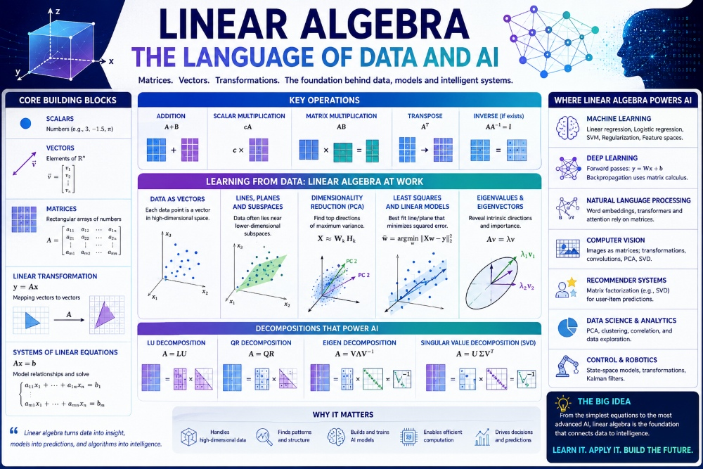
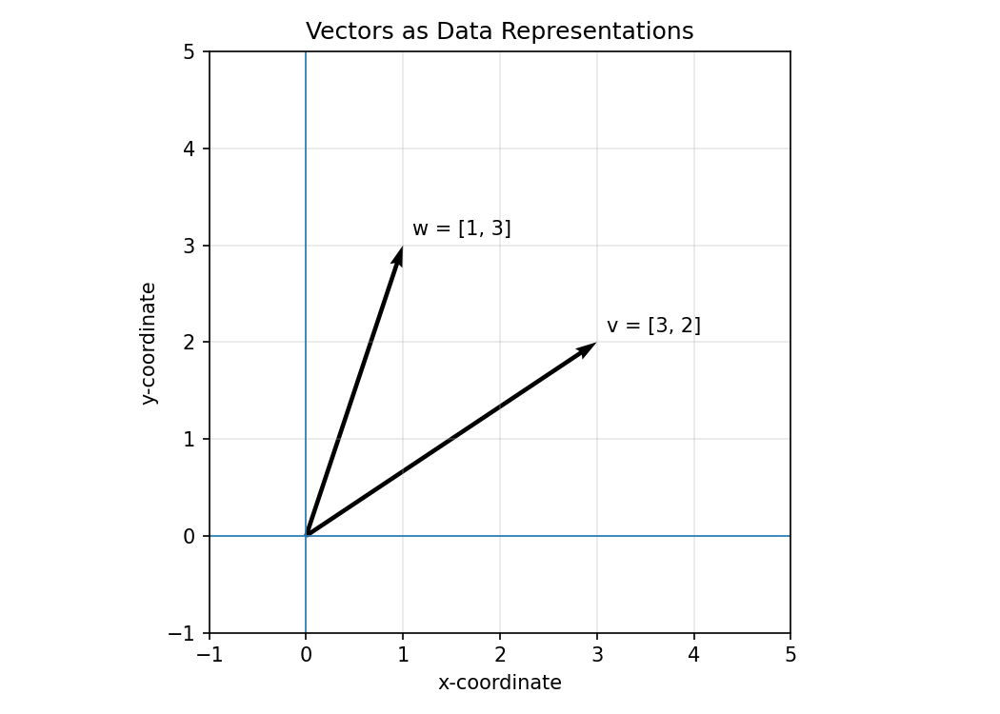
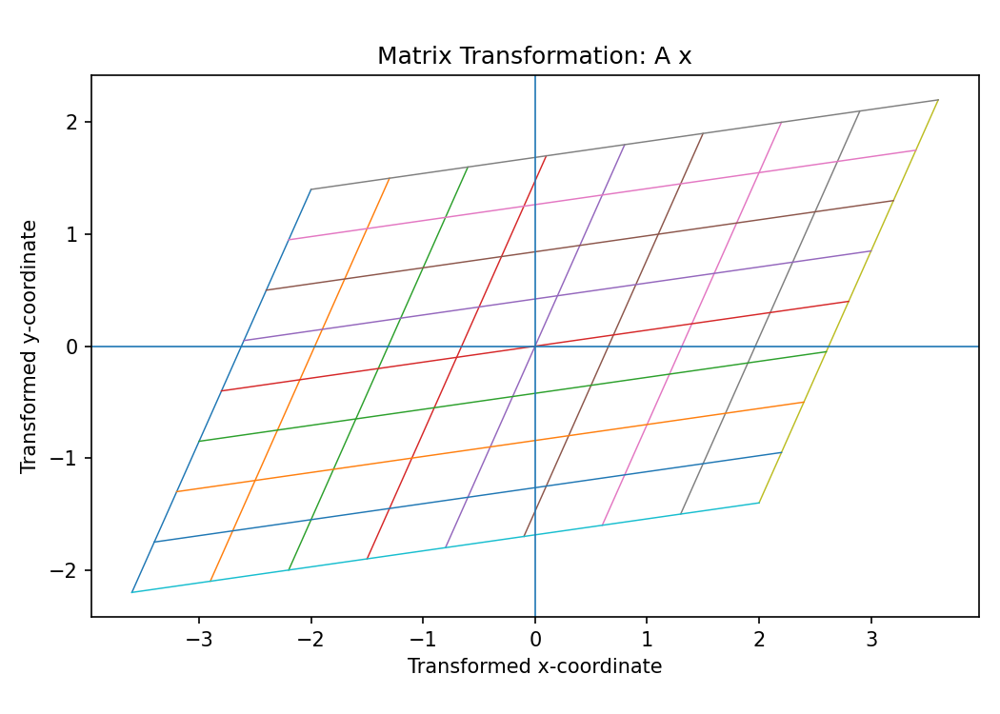
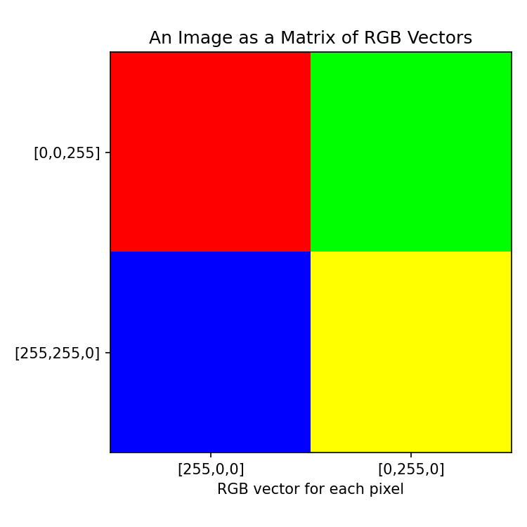
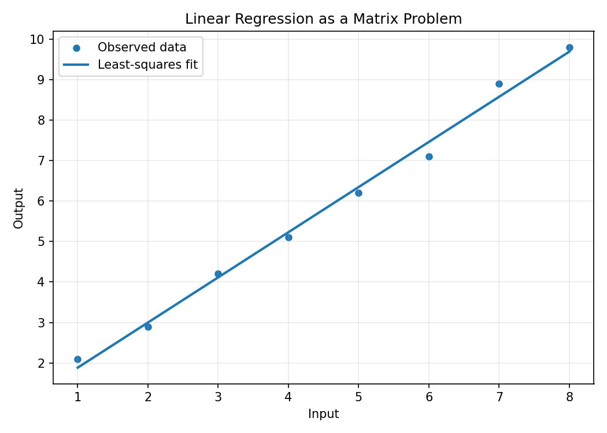
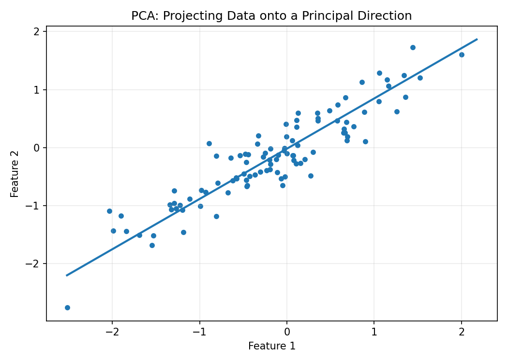

# :classical_building: Mathematics for IT Course - M.Tech. 1st Semester, IIIT Allahabad
## Unit 1: Linear Algebra and Matrix Theory
### Current Topic: Basic Linear Algebra Applications in IT and Data Representation
---
## 👥 Instructor Information
* **Edited by Instructor:** [Dr. Mohammed Javed](https://sites.google.com/site/mohammedjaved2016/)
* **Email:** javed@iiita.ac.in
* **Senior Teaching Assistants:** Mr. Apurba Chakraborty (rsi2024005@iiita.ac.in), Ms Aarthi Jha (rsi2025509@iiita.ac.in)
---
## 🎯 Learning Objectives

After studying this material, you should be able to:

- Explain how vectors and matrices represent digital information.
- Perform basic vector and matrix operations using Python.
- Understand matrices as transformations of data.
- Represent images using matrices and RGB vectors.
- Understand text and documents as numerical vectors.
- Apply linear algebra ideas to search, recommendation, compression, and machine learning.
- Use dot products, matrix multiplication, and least squares in simple IT applications.
- Understand why dimensionality reduction is useful for data representation.

---

## 1. Introduction

Linear algebra is the mathematics of **vectors, matrices, linear transformations, and systems of equations**.

Although linear algebra may initially appear theoretical, it is one of the foundations of modern information technology. Computers cannot directly perform most data-processing algorithms on raw concepts such as "image", "document", "user preference", or "web page". Instead, information is converted into **numbers**, and linear algebra provides efficient ways to store, transform, compare, and analyze those numbers.

### Major IT applications

| Application | Linear algebra concept |
|---|---|
| Image representation | Matrices, vectors, tensors |
| Computer graphics | Matrix transformations |
| Search engines | Vector representation and similarity |
| Recommendation systems | Matrix representation and factorization |
| Machine learning | Vectors, matrices, optimization |
| Data compression | Projection and dimensionality reduction |
| Natural language processing | Vector representations |
| Computer vision | Matrix/tensor operations |
| Network analysis | Adjacency matrices |
| Error correction | Vectors and matrices |

The central idea is:

> **Information can be represented as numbers, and linear algebra provides the language for manipulating those numerical representations.**

---

# 2. Scalars, Vectors, and Matrices

## 2.1 Scalars

A **scalar** is a single numerical value.

Examples:

$$
5,\quad -3,\quad 2.75
$$

In IT, a scalar might represent:

- temperature,
- age,
- price,
- brightness of a pixel,
- a model parameter.

---

## 2.2 Vectors

A vector is an ordered collection of numbers.

$$
\mathbf{x} =
\begin{bmatrix}
x_1\\
x_2\\
\vdots\\
x_n
\end{bmatrix}
$$

For example:

$$
\mathbf{x} =
\begin{bmatrix}
10\\
20\\
30
\end{bmatrix}
$$

can represent three features of an object.

A vector is often used to represent a **data record**.

For example, a student could be represented as:

$$
\mathbf{x} =
\begin{bmatrix}
20\\
85\\
90
\end{bmatrix}
$$

where the components represent age, mathematics score, and programming score.



---

## 2.3 Matrices

A matrix is a rectangular arrangement of numbers:

$$
A =
\begin{bmatrix}
1 & 2 & 3\\
4 & 5 & 6
\end{bmatrix}
$$

This matrix has 2 rows and 3 columns, so its shape is:

$$
2 \times 3
$$

Matrices are extremely useful in IT because they can represent many data records simultaneously.

For example:

$$
X =
\begin{bmatrix}
20 & 85 & 90\\
21 & 78 & 88\\
19 & 92 & 95
\end{bmatrix}
$$

can represent three students and three features.

---

# 3. Python Representation of Vectors and Matrices

The NumPy library is widely used for numerical computing.

```python
import numpy as np

# Vector
x = np.array([10, 20, 30])

# Matrix
A = np.array([
    [1, 2, 3],
    [4, 5, 6]
])

print("Vector:")
print(x)

print("\nMatrix:")
print(A)

print("\nMatrix shape:", A.shape)
```

### Expected idea

```text
Vector:
[10 20 30]

Matrix:
[[1 2 3]
 [4 5 6]]

Matrix shape: (2, 3)
```

---

# 4. Vector Operations in Data Processing

## 4.1 Vector Addition

Given:

$$
\mathbf{x} =
\begin{bmatrix}
1\\
2\\
3
\end{bmatrix},
\quad
\mathbf{y} =
\begin{bmatrix}
4\\
5\\
6
\end{bmatrix}
$$

then:

$$
\mathbf{x}+\mathbf{y}=
\begin{bmatrix}
5\\
7\\
9
\end{bmatrix}
$$

Python:

```python
import numpy as np

x = np.array([1, 2, 3])
y = np.array([4, 5, 6])

result = x + y

print(result)
```

---

## 4.2 Scalar Multiplication

A vector can be multiplied by a scalar:

$$
3
\begin{bmatrix}
1\\
2\\
3
\end{bmatrix}=
\begin{bmatrix}
3\\
6\\
9
\end{bmatrix}
$$

Python:

```python
x = np.array([1, 2, 3])

result = 3 * x

print(result)
```

This is useful for scaling numerical features.

---

# 5. Dot Product and Similarity

The **dot product** of two vectors is:

$$
\mathbf{x}\cdot\mathbf{y}=
x_1y_1+x_2y_2+\cdots+x_ny_n
$$

For:

$$
\mathbf{x}=[1,2,3]
$$

and

$$
\mathbf{y}=[4,5,6]
$$

we get:

$$
\mathbf{x}\cdot\mathbf{y}=
1(4)+2(5)+3(6)=32
$$

Python:

```python
import numpy as np

x = np.array([1, 2, 3])
y = np.array([4, 5, 6])

dot_product = np.dot(x, y)

print("Dot product:", dot_product)
```

## Application: Measuring Similarity

Suppose two users have preference vectors:

```python
user_a = np.array([5, 4, 1, 0])
user_b = np.array([4, 5, 1, 1])

similarity = np.dot(user_a, user_b)

print("Similarity score:", similarity)
```

A dot product is a basic building block for more sophisticated similarity measures such as **cosine similarity**.

### Cosine similarity

$$
\cos(\theta)=
\frac{\mathbf{x}\cdot\mathbf{y}}
{\|\mathbf{x}\|\|\mathbf{y}\|}
$$

Python:

```python
def cosine_similarity(x, y):
    return np.dot(x, y) / (np.linalg.norm(x) * np.linalg.norm(y))

x = np.array([5, 4, 1, 0])
y = np.array([4, 5, 1, 1])

print(cosine_similarity(x, y))
```

Cosine similarity is commonly useful for:

- document comparison,
- search,
- recommendation,
- text representation,
- information retrieval.

---

# 6. Matrices as Data Tables

A dataset can naturally be represented as a matrix.

Suppose we have:

| Student | Age | Math | Programming |
|---|---:|---:|---:|
| A | 20 | 85 | 90 |
| B | 21 | 78 | 88 |
| C | 19 | 92 | 95 |

The numerical portion can be written as:

$$
X =
\begin{bmatrix}
20 & 85 & 90\\
21 & 78 & 88\\
19 & 92 & 95
\end{bmatrix}
$$

Python:

```python
import numpy as np

X = np.array([
    [20, 85, 90],
    [21, 78, 88],
    [19, 92, 95]
])

print(X)
```

The rows represent **observations** and the columns represent **features**.

This representation is fundamental in:

- machine learning,
- statistics,
- data analytics,
- databases,
- scientific computing.

---

# 7. Matrix Multiplication

Matrix multiplication is one of the most important operations in data processing.

Suppose:

$$
A =
\begin{bmatrix}
1 & 2\\
3 & 4
\end{bmatrix}
$$

and

$$
B =
\begin{bmatrix}
5 & 6\\
7 & 8
\end{bmatrix}
$$

Then:

$$
AB =
\begin{bmatrix}
19 & 22\\
43 & 50
\end{bmatrix}
$$

Python:

```python
import numpy as np

A = np.array([
    [1, 2],
    [3, 4]
])

B = np.array([
    [5, 6],
    [7, 8]
])

C = A @ B

print(C)
```

The `@` operator performs matrix multiplication in Python.

---

# 8. Matrices as Transformations

Matrices can transform vectors.

If:

$$
A =
\begin{bmatrix}
2 & 0\\
0 & 2
\end{bmatrix}
$$

then:

$$
A
\begin{bmatrix}
1\\
2
\end{bmatrix}=
\begin{bmatrix}
2\\
4
\end{bmatrix}
$$

The matrix has scaled the vector by 2.

Matrices can be used for:

- scaling,
- rotation,
- reflection,
- translation using homogeneous coordinates,
- coordinate transformations,
- computer graphics.



### Python example

```python
import numpy as np

A = np.array([
    [2, 0],
    [0, 2]
])

x = np.array([1, 2])

transformed = A @ x

print("Original:", x)
print("Transformed:", transformed)
```

---

# 9. Linear Algebra in Computer Graphics

Computer graphics makes extensive use of matrices.

A 2D point can be represented as:

$$
\mathbf{p}=
\begin{bmatrix}
x\\
y
\end{bmatrix}
$$

A scaling matrix is:

$$
S=
\begin{bmatrix}
s_x & 0\\
0 & s_y
\end{bmatrix}
$$

Then:

$$
\mathbf{p}'=S\mathbf{p}
$$

## Rotation

A 2D rotation matrix is:

$$
R(\theta)=
\begin{bmatrix}
\cos\theta & -\sin\theta\\
\sin\theta & \cos\theta
\end{bmatrix}
$$

Python:

```python
import numpy as np

theta = np.radians(45)

R = np.array([
    [np.cos(theta), -np.sin(theta)],
    [np.sin(theta),  np.cos(theta)]
])

point = np.array([1, 0])

rotated = R @ point

print("Rotated point:", rotated)
```

This is the mathematical foundation of many operations in:

- games,
- animation,
- CAD,
- 3D modeling,
- computer vision,
- virtual reality.

---

# 10. Images as Matrices

A grayscale image can be represented as a matrix.

For example:

$$
I=
\begin{bmatrix}
0 & 50 & 100\\
150 & 200 & 255\\
255 & 100 & 0
\end{bmatrix}
$$

Each number represents the intensity of a pixel.

Typically:

- 0 = black
- 255 = white

Python:

```python
import numpy as np

image = np.array([
    [0, 50, 100],
    [150, 200, 255],
    [255, 100, 0]
])

print(image)
```

An actual image contains many more pixels, but the same principle applies.

---

# 11. RGB Images as Matrices of Vectors

A color pixel can be represented using three values:

$$
[R,G,B]
$$

For example:

$$
[255,0,0]
$$

represents red.

An RGB image can therefore be represented as a three-dimensional numerical array:

$$
H \times W \times 3
$$

where:

- $(H)$ = image height,
- $(W)$ = image width,
- 3 = red, green, blue channels.



Python:

```python
import numpy as np

# 2 x 2 RGB image
image = np.array([
    [[255, 0, 0], [0, 255, 0]],
    [[0, 0, 255], [255, 255, 0]]
])

print("Shape:", image.shape)
print(image)
```

This idea extends naturally to computer vision and deep learning.

---

# 12. Image Manipulation Using Matrix Operations

Brightness can be increased by adding a constant.

```python
import numpy as np

image = np.array([
    [50, 100],
    [150, 200]
])

brighter = np.clip(image + 30, 0, 255)

print("Original:")
print(image)

print("\nBrighter:")
print(brighter)
```

The `clip()` function prevents pixel values from exceeding the valid range.

---

# 13. Text as Numerical Vectors

Computers can represent text numerically.

A simple example is the **bag-of-words** representation.

Suppose our vocabulary is:

```text
["AI", "data", "linear", "matrix"]
```

The sentence:

```text
"AI uses data"
```

could be represented as:

$$
[1,1,0,0]
$$

The vector contains numerical information about which vocabulary terms occur.

Python:

```python
vocabulary = ["AI", "data", "linear", "matrix"]

document = "AI uses data"

vector = [
    int(word.lower() in document.lower())
    for word in vocabulary
]

print(vector)
```

More advanced natural language processing uses dense vectors called **embeddings**, where words, sentences, or documents are represented as points in a high-dimensional vector space.

---

# 14. Document Similarity

Suppose two documents are represented as vectors:

$$
d_1=[1,1,0,1]
$$

$$
d_2=[1,0,1,1]
$$

We can compare them using cosine similarity.

```python
import numpy as np

d1 = np.array([1, 1, 0, 1])
d2 = np.array([1, 0, 1, 1])

similarity = np.dot(d1, d2) / (
    np.linalg.norm(d1) * np.linalg.norm(d2)
)

print("Cosine similarity:", similarity)
```

This basic idea is useful in:

- document search,
- plagiarism detection,
- recommendation,
- information retrieval,
- clustering.

---

# 15. Recommendation Systems

A recommendation system can represent users and items using matrices.

Suppose:

$$
R =
\begin{bmatrix}
5 & 4 & 0\\
4 & 0 & 5\\
0 & 5 & 4
\end{bmatrix}
$$

Rows can represent users and columns can represent movies.

A value of 0 may mean that a user has not rated an item.

Example:

```python
import numpy as np

ratings = np.array([
    [5, 4, 0],
    [4, 0, 5],
    [0, 5, 4]
])

print(ratings)
```

Large recommendation systems use more advanced methods such as **matrix factorization**.

A common conceptual model is:

$$
R \approx UV^T
$$

where:

- $(U)$ represents user features,
- $(V)$ represents item features.

The system can use these latent representations to estimate missing ratings.

---

# 16. Linear Algebra in Machine Learning

Suppose a model has input features:

$$
\mathbf{x}=
\begin{bmatrix}
x_1\\
x_2\\
x_3
\end{bmatrix}
$$

and weights:

$$
\mathbf{w}=
\begin{bmatrix}
w_1\\
w_2\\
w_3
\end{bmatrix}
$$

A simple linear model is:

$$
y=\mathbf{w}^T\mathbf{x}+b
$$

Python:

```python
import numpy as np

x = np.array([10, 5, 2])
w = np.array([0.4, 0.7, 0.2])
b = 1.5

y = np.dot(w, x) + b

print("Prediction:", y)
```

This simple equation is a building block for:

- linear regression,
- neural networks,
- classification models,
- deep learning.

---

# 17. Linear Regression as a Matrix Problem

A linear regression model can be written as:

$$
\mathbf{y}=X\boldsymbol{\beta}+\boldsymbol{\epsilon}
$$

where:

- $(X)$ is the feature matrix,
- $(\boldsymbol{\beta})$ contains model parameters,
- $(\mathbf{y})$ contains target values,
- $(\boldsymbol{\epsilon})$ is the error.

For ordinary least squares:

$$
\hat{\boldsymbol{\beta}}=
(X^TX)^{-1}X^T\mathbf{y}
$$

when the inverse exists.

Python:

```python
import numpy as np

x = np.array([1, 2, 3, 4, 5])
y = np.array([2, 4, 5, 8, 10])

# Add a column of ones for the intercept
X = np.column_stack((np.ones(len(x)), x))

beta = np.linalg.inv(X.T @ X) @ X.T @ y

print("Intercept:", beta[0])
print("Slope:", beta[1])

predictions = X @ beta

print("Predictions:", predictions)
```

A numerically safer approach is to use `np.linalg.lstsq()`:

```python
beta, residuals, rank, singular_values = np.linalg.lstsq(
    X, y, rcond=None
)

print(beta)
```



---

# 18. Dimensionality Reduction

Real-world datasets can contain hundreds or thousands of features.

For example:

- an image can have thousands of pixels,
- a document collection can contain thousands of terms,
- a sensor system can have hundreds of measurements.

Working with all features may be expensive.

Linear algebra provides methods for reducing the number of dimensions while preserving important information.

One important technique is **Principal Component Analysis (PCA)**.

---

# 19. Principal Component Analysis

PCA finds directions in the data that capture large amounts of variation.

The first principal component is the direction of maximum variance.

The second principal component is orthogonal to the first and captures the next largest amount of variance.

Conceptually:

$$
X \rightarrow \text{PCA} \rightarrow Z
$$

where $(Z)$ has fewer dimensions than $(X)$.



Python example:

```python
import numpy as np
from sklearn.decomposition import PCA

X = np.array([
    [2, 4],
    [3, 6],
    [4, 8],
    [5, 10],
    [6, 12]
])

pca = PCA(n_components=1)

X_reduced = pca.fit_transform(X)

print("Original shape:", X.shape)
print("Reduced shape:", X_reduced.shape)
print(X_reduced)
```

PCA is useful for:

- visualization,
- compression,
- noise reduction,
- feature extraction,
- exploratory data analysis.

---

# 20. Data Compression

Suppose an image is represented by a matrix:

$$
A
$$

A large matrix may contain redundant information.

A matrix can sometimes be approximated by a lower-rank matrix:

$$
A \approx A_k
$$

where $(A_k)$ retains the most important information.

The **Singular Value Decomposition (SVD)** is:

$$
A=U\Sigma V^T
$$

A low-rank approximation keeps only the largest singular values:

$$
A_k=U_k\Sigma_kV_k^T
$$

Python example:

```python
import numpy as np

A = np.array([
    [5, 4, 3],
    [4, 3, 2],
    [3, 2, 1]
], dtype=float)

U, S, VT = np.linalg.svd(A)

k = 2

A_approx = U[:, :k] @ np.diag(S[:k]) @ VT[:k, :]

print("Original matrix:")
print(A)

print("\nApproximation:")
print(A_approx)
```

SVD is important in:

- data compression,
- recommendation systems,
- dimensionality reduction,
- noise filtering,
- information retrieval.

---

# 21. Network Representation Using Matrices

Networks can also be represented using matrices.

Consider a network with four nodes.

An **adjacency matrix** records whether nodes are connected.

$$
A =
\begin{bmatrix}
0&1&1&0\\
1&0&1&0\\
1&1&0&1\\
0&0&1&0
\end{bmatrix}
$$

A value of 1 indicates a connection.

Python:

```python
import numpy as np

A = np.array([
    [0, 1, 1, 0],
    [1, 0, 1, 0],
    [1, 1, 0, 1],
    [0, 0, 1, 0]
])

print(A)
```

Applications include:

- social networks,
- computer networks,
- web-page links,
- transportation networks,
- recommendation graphs.

---

# 22. Image, Text, and Network Representation

The same mathematical objects can represent very different types of information.

| Data | Possible representation |
|---|---|
| Numeric record | Vector |
| Dataset | Matrix |
| Grayscale image | Matrix |
| RGB image | 3D array/tensor |
| Text document | Vector |
| User-item ratings | Matrix |
| Network | Adjacency matrix |
| Model parameters | Vector/matrix |
| Neural network layer | Matrix |

This is one of the most important ideas in applied linear algebra:

> **Different types of information can be converted into numerical structures that the same mathematical operations can process.**

---

# 23. Matrix Operations in a Simple Data Pipeline

A simplified machine learning pipeline can be viewed as:

$$
\text{Raw Data}
\rightarrow
\text{Numerical Representation}
\rightarrow
\text{Matrix Operations}
\rightarrow
\text{Model}
\rightarrow
\text{Prediction}
$$

For example:

```python
import numpy as np

# Three observations, two features
X = np.array([
    [2, 3],
    [4, 5],
    [6, 7]
])

# Model parameters
w = np.array([0.5, 1.2])
b = 0.8

# Linear prediction
predictions = X @ w + b

print("Predictions:")
print(predictions)
```

The important operation is:

```python
X @ w
```

A single matrix multiplication can calculate predictions for many observations at once.

This is one reason linear algebra is so important for efficient computing.

---

# 24. Vector Norms

The Euclidean norm of a vector is:

$$
\|\mathbf{x}\|_2=
\sqrt{x_1^2+x_2^2+\cdots+x_n^2}
$$

Python:

```python
import numpy as np

x = np.array([3, 4])

print("Norm:", np.linalg.norm(x))
```

The result is:

$$
\sqrt{3^2+4^2}=5
$$

Norms are useful for:

- measuring distance,
- normalization,
- optimization,
- machine learning,
- comparing vectors.

---

# 25. Normalization

Features can have very different scales.

For example:

```text
Age:       18 - 70
Salary:    20000 - 200000
Experience: 0 - 30
```

A large numerical scale can dominate some algorithms.

A simple vector normalization is:

$$
\hat{x}=\frac{x}{\|x\|}
$$

Python:

```python
import numpy as np

x = np.array([3, 4], dtype=float)

normalized_x = x / np.linalg.norm(x)

print(normalized_x)
print("Norm:", np.linalg.norm(normalized_x))
```

The resulting vector has approximately unit length.

---

# 26. Solving Systems of Equations

Many IT and engineering problems can be expressed as:

$$
A\mathbf{x}=\mathbf{b}
$$

For example:

$$
2x+y=5
$$

$$
x+3y=6
$$

Matrix form:

$$
\begin{bmatrix}
2&1\\
1&3
\end{bmatrix}
\begin{bmatrix}
x\\
y
\end{bmatrix}=
\begin{bmatrix}
5\\
6
\end{bmatrix}
$$

Python:

```python
import numpy as np

A = np.array([
    [2, 1],
    [1, 3]
], dtype=float)

b = np.array([5, 6], dtype=float)

x = np.linalg.solve(A, b)

print("Solution:", x)
```

`np.linalg.solve()` is generally preferable to explicitly calculating an inverse.

---

# 27. Why Linear Algebra Matters in IT

Linear algebra provides a compact way to perform operations on large amounts of data.

Consider a dataset with one million observations and 100 features.

Instead of processing each observation individually, we can represent the dataset as:

$$
X\in\mathbb{R}^{1,000,000\times100}
$$

Many calculations can then be expressed using matrix operations.

For example:

$$
XW
$$

can process many observations simultaneously.

Modern numerical libraries and hardware are highly optimized for these operations.

---

# 28. Common Python Libraries

### NumPy

Used for:

- vectors,
- matrices,
- matrix multiplication,
- linear algebra,
- numerical computation.

```python
import numpy as np
```

### Matplotlib

Used for:

- plotting vectors,
- visualizing matrices,
- displaying data,
- plotting transformations.

```python
import matplotlib.pyplot as plt
```

### Scikit-learn

Used for:

- PCA,
- regression,
- classification,
- clustering,
- machine learning.

```python
from sklearn.decomposition import PCA
```

---

# 29. Integrated Example: Data Representation and Prediction

Consider a dataset:

```python
import numpy as np

# Features:
# [study_hours, assignments_completed]
X = np.array([
    [2, 3],
    [4, 5],
    [6, 7],
    [8, 9]
])

# Target: exam score
y = np.array([50, 60, 75, 90])

# Add intercept
X_design = np.column_stack([
    np.ones(X.shape[0]),
    X
])

# Least-squares solution
beta, residuals, rank, singular_values = np.linalg.lstsq(
    X_design, y, rcond=None
)

print("Model parameters:")
print(beta)

# Predictions
predictions = X_design @ beta

print("\nPredictions:")
print(predictions)
```

Here:

1. The observations are represented as a matrix.
2. The target values are represented as a vector.
3. Linear algebra estimates the model parameters.
4. Matrix multiplication produces predictions.

This is a simple example of how mathematical representation becomes a computational model.

---

# 30. Summary of Important Concepts

| Concept | Mathematical form | IT application |
|---|---|---|
| Vector | $(\mathbf{x})$ | Data record, embedding |
| Matrix | $(A)$ | Dataset, image, network |
| Dot product | $(\mathbf{x}^T\mathbf{y})$ | Similarity, prediction |
| Matrix multiplication | $(AB)$ | ML and graphics |
| Norm | $(\|\mathbf{x}\|)$ | Distance and normalization |
| Linear system | $(A\mathbf{x}=\mathbf{b})$ | Modeling |
| Linear transformation | $(A\mathbf{x})$ | Graphics and data transformation |
| PCA | Projection onto principal components | Dimensionality reduction |
| SVD | $(A=U\Sigma V^T)$ | Compression and factorization |
| Adjacency matrix | $(A_{ij})$ | Network representation |

---

# 31. Key Takeaways

1. **Vectors represent individual data objects or features.**
2. **Matrices represent collections of data and relationships.**
3. **Images are naturally represented using matrices and multidimensional arrays.**
4. **Text can be converted into numerical vectors.**
5. **Dot products provide a foundation for similarity and prediction.**
6. **Matrix multiplication is central to machine learning and computer graphics.**
7. **PCA reduces the dimensionality of data.**
8. **SVD can be used for compression and matrix factorization.**
9. **Adjacency matrices represent relationships in networks.**
10. **Linear algebra allows computers to process large amounts of numerical information efficiently.**

---

# 32. Practice Questions

## Conceptual Questions

1. What is the difference between a scalar, vector, and matrix?
2. Why are matrices useful for representing datasets?
3. How can a grayscale image be represented as a matrix?
4. How is an RGB image represented numerically?
5. What is the purpose of a dot product?
6. Explain cosine similarity.
7. Why is matrix multiplication important in machine learning?
8. What is a linear transformation?
9. What problem does PCA solve?
10. How can SVD be used for data compression?
11. What is an adjacency matrix?
12. Why is normalization useful in data processing?

## Programming Exercises

1. Create two vectors and calculate their:
   - sum,
   - difference,
   - dot product,
   - norms.

2. Create a 3 × 3 matrix and calculate:
   - transpose,
   - determinant,
   - inverse, if it exists.

3. Represent a small grayscale image using a NumPy matrix.

4. Create two document vectors and calculate cosine similarity.

5. Create a user-item rating matrix.

6. Use matrix multiplication to implement a simple linear model.

7. Use `np.linalg.solve()` to solve a system of equations.

8. Apply PCA to a dataset and reduce it from 3 dimensions to 2.

9. Perform SVD on a matrix and reconstruct it using only the largest singular values.

10. Create an adjacency matrix for a small computer network.

---

# 33. Mini Project: Representing a Dataset Using Linear Algebra

### Objective

Build a small Python program that:

1. Creates a dataset.
2. Represents it as a matrix.
3. Normalizes the features.
4. Calculates similarity between two observations.
5. Performs PCA.
6. Displays the reduced representation.

### Suggested implementation

```python
import numpy as np
from sklearn.preprocessing import StandardScaler
from sklearn.decomposition import PCA

# Dataset:
# [age, study_hours, programming_score]
X = np.array([
    [20, 4, 80],
    [21, 5, 85],
    [19, 3, 75],
    [22, 6, 90],
    [20, 5, 88]
], dtype=float)

# Standardize features
scaler = StandardScaler()
X_scaled = scaler.fit_transform(X)

# Compare first two observations
x1 = X_scaled[0]
x2 = X_scaled[1]

similarity = np.dot(x1, x2) / (
    np.linalg.norm(x1) * np.linalg.norm(x2)
)

print("Cosine similarity:", similarity)

# PCA
pca = PCA(n_components=2)
X_reduced = pca.fit_transform(X_scaled)

print("\nReduced representation:")
print(X_reduced)

print("\nExplained variance ratio:")
print(pca.explained_variance_ratio_)
```

This mini project combines several fundamental ideas:

$$
\boxed{
\text{Data}
\rightarrow
\text{Matrix}
\rightarrow
\text{Normalization}
\rightarrow
\text{Similarity}
\rightarrow
\text{PCA}
}
$$

---

# 34. Final Perspective

Linear algebra is not merely a collection of mathematical formulas. It provides a **representation system for information**.

A photograph becomes a matrix.

A document becomes a vector.

A collection of documents becomes a matrix.

A recommendation system becomes a user-item matrix.

A network becomes an adjacency matrix.

A machine-learning model uses vectors and matrices for its parameters and computations.

Therefore, understanding basic linear algebra gives students a mathematical foundation for understanding how modern IT systems represent and process information.

---

## Python Requirements

Install the required packages with:

```bash
pip install numpy matplotlib scikit-learn
```

The examples can then be run in:

- Jupyter Notebook,
- Google Colab,
- VS Code,
- PyCharm,
- or a standard Python environment.

---

## ❓: CHALLENGING Questions - Check Your Understanding 
* ➡️ **[Q-01]**
* ➡️ 

---
## 📚 References 
* **[R-01]** Linear Algebra by Gilbert Strang, MIT Press
* **[R-02]** AI Tools for examples and codes
