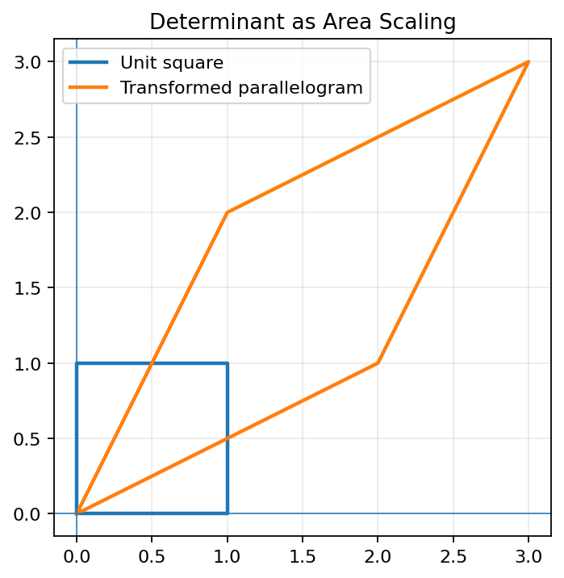
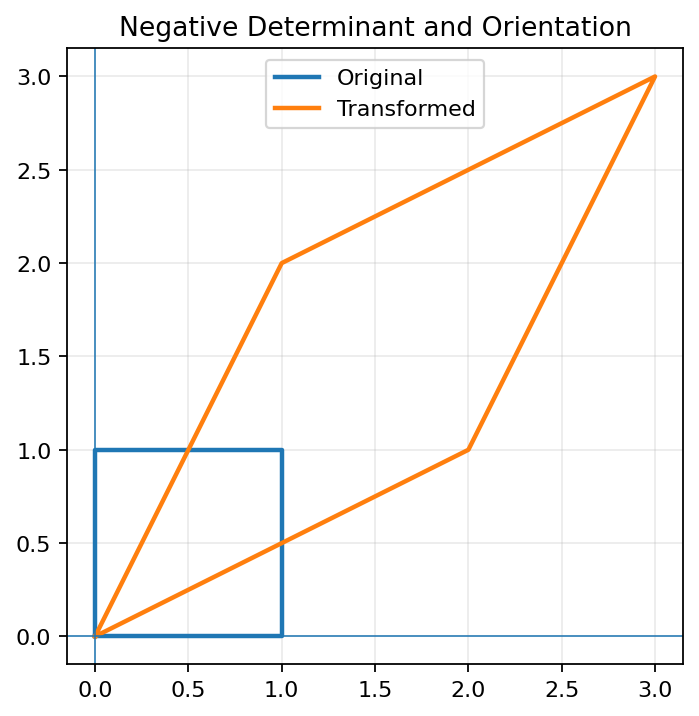
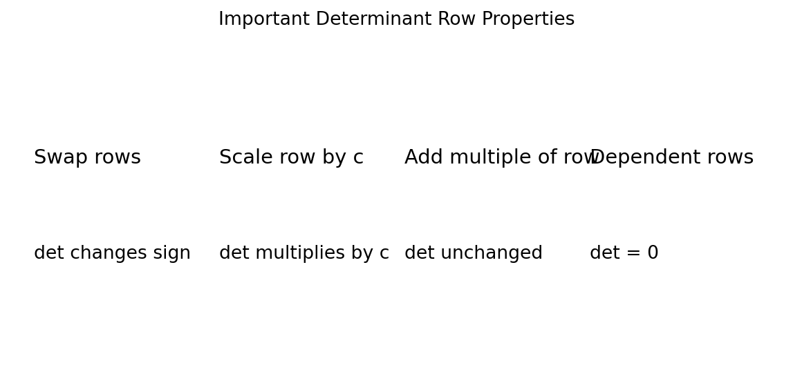
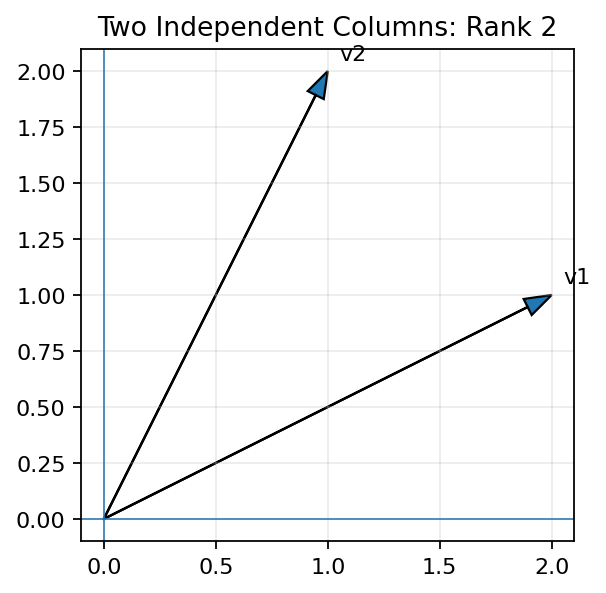
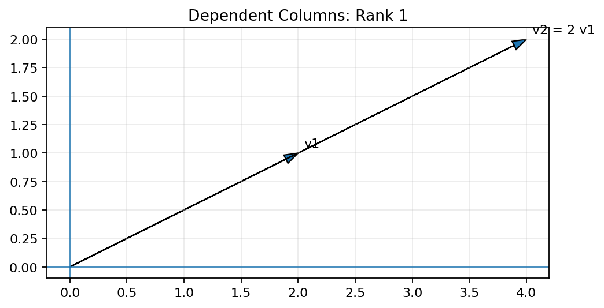
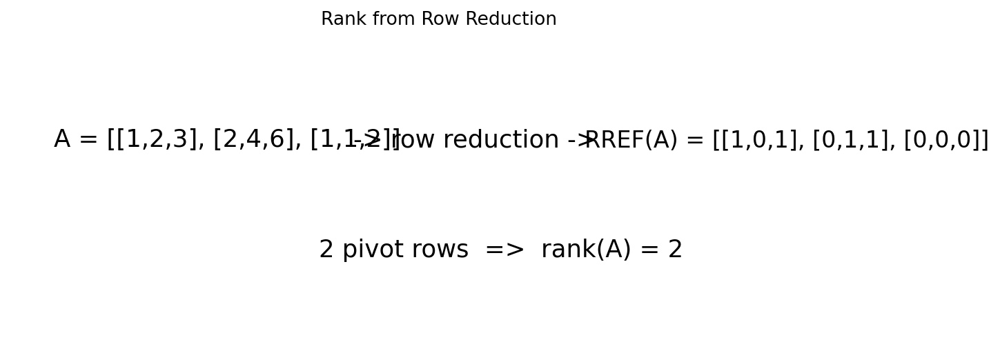
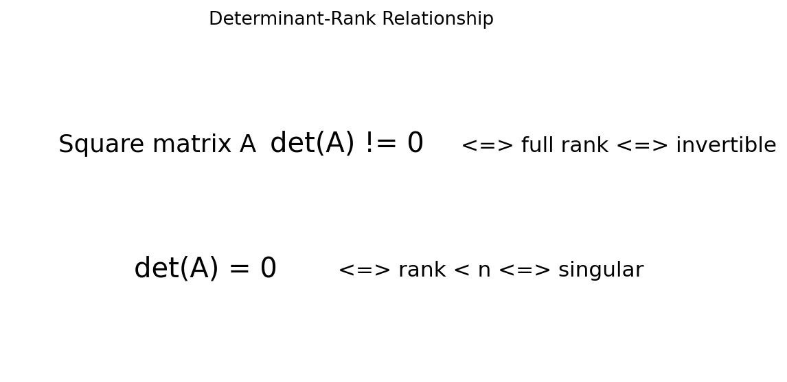

# Determinants and Their Properties, Rank of a Matrix

## Learning Objectives

After studying this material, you should be able to:

- Define and calculate determinants.
- Explain the geometric meaning of a determinant.
- Apply important determinant properties.
- Understand minors and cofactors.
- Determine whether a matrix is singular or invertible.
- Define and calculate matrix rank.
- Find rank using row reduction, pivots, and Python.
- Explain row rank, column rank, and linear independence.
- Understand the determinant-rank-invertibility relationship.
- Apply these ideas to linear systems, numerical computing, and IT.

---

## 1. Introduction

The **determinant** is a scalar associated with a square matrix. It provides information about invertibility, linear dependence, and geometric scaling.

The **rank** measures the number of independent rows or columns of a matrix.

For an n x n matrix A:

$$
\boxed{
\det(A)\neq0
\iff
\operatorname{rank}(A)=n
\iff
A\text{ is invertible}
}
$$

---

## 2. Determinant of a 2 x 2 Matrix

For

$$
A=
\begin{bmatrix}
a&b\\
c&d
\end{bmatrix},
$$

the determinant is

$$
\boxed{\det(A)=ad-bc}
$$

Example:

$$
A=
\begin{bmatrix}
3&2\\
1&4
\end{bmatrix}
$$

so

$$
\det(A)=3(4)-2(1)=10.
$$

### Python

```python
import numpy as np

A = np.array([[3, 2],
              [1, 4]])

print("Determinant:", np.linalg.det(A))
```

---

## 3. Geometric Meaning of the Determinant

For a 2D matrix, $|\det(A)|$ is the factor by which areas are scaled.

For example,

$$
A=
\begin{bmatrix}
2&1\\
1&2
\end{bmatrix}
$$

has determinant

$$
\det(A)=3.
$$

Thus a unit square is transformed into a parallelogram with area 3.



For a 3D transformation, $|\det(A)|$ gives the volume scaling factor.

---

## 4. Negative Determinants

The absolute value represents scaling, while the sign describes orientation.

For

$$
A=
\begin{bmatrix}
1&2\\
2&1
\end{bmatrix},
$$

$$
\det(A)=1-4=-3.
$$

Therefore the area scaling factor is 3 and orientation is reversed.



If the determinant is zero, the transformation collapses the area to zero.

---

## 5. Determinant of a 3 x 3 Matrix

For

$$
A=
\begin{bmatrix}
a&b&c\\
d&e&f\\
g&h&i
\end{bmatrix},
$$

cofactor expansion along the first row gives

$$
\boxed{
\det(A)=a(ei-fh)-b(di-fg)+c(dh-eg)
}
$$

Example:

$$
A=
\begin{bmatrix}
1&2&3\\
0&4&5\\
1&0&6
\end{bmatrix}
$$

Then

$$
\det(A)=1(24)-2(-5)+3(-4)=10.
$$

### Python

```python
import numpy as np

A = np.array([[1, 2, 3],
              [0, 4, 5],
              [1, 0, 6]])

print("Determinant:", np.linalg.det(A))
```

---

## 6. Minors and Cofactors

For element $a_{ij}$, its **minor** $M_{ij}$ is obtained by deleting row $i$ and column $j$ and taking the determinant of the remaining matrix.

The cofactor is

$$
\boxed{C_{ij}=(-1)^{i+j}M_{ij}}
$$

For a 3 x 3 matrix, the signs are

$$
\begin{bmatrix}
+&-&+\\
-&+&-\\
+&-&+
\end{bmatrix}.
$$

Cofactors are used in determinant expansion and the classical inverse formula.

---

## 7. Important Determinant Properties

### Identity

$$
\boxed{\det(I)=1}
$$

### Transpose

$$
\boxed{\det(A^T)=\det(A)}
$$

### Product

$$
\boxed{\det(AB)=\det(A)\det(B)}
$$

### Inverse

If $A$ is invertible:

$$
\boxed{\det(A^{-1})=\frac{1}{\det(A)}}
$$

### Scalar multiplication

For an n x n matrix:

$$
\boxed{\det(cA)=c^n\det(A)}
$$

---

## 8. Determinants and Row Operations

Elementary row operations have predictable effects.



### Row swap

Swapping two rows changes the sign:

$$
\det(B)=-\det(A).
$$

### Row scaling

Multiplying one row by c multiplies the determinant by c.

### Row replacement

The operation

$$
R_i\leftarrow R_i+cR_j
$$

does not change the determinant.

These facts make row reduction useful for determinant calculations.

---

## 9. Determinant of a Triangular Matrix

For an upper or lower triangular matrix,

$$
\boxed{
\det(A)=\prod_{i=1}^n a_{ii}
}
$$

Example:

$$
A=
\begin{bmatrix}
2&3&4\\
0&5&6\\
0&0&7
\end{bmatrix}
$$

has

$$
\det(A)=2(5)(7)=70.
$$

### Python

```python
import numpy as np

A = np.array([[2, 3, 4],
              [0, 5, 6],
              [0, 0, 7]])

print(np.linalg.det(A))
print(np.prod(np.diag(A)))
```

---

## 10. Singular and Nonsingular Matrices

A square matrix is **singular** if

$$
\boxed{\det(A)=0}.
$$

It is **nonsingular** if

$$
\boxed{\det(A)\neq0}.
$$

For a square matrix:

$$
\boxed{
\det(A)\neq0
\iff
A^{-1}\text{ exists}
}
$$

### Python

```python
import numpy as np

A = np.array([[1, 2],
              [2, 4]])

if np.isclose(np.linalg.det(A), 0):
    print("A is singular")
else:
    print("A is nonsingular")
```

---

## 11. Determinant and Linear Independence

If the columns of an n x n matrix A are viewed as vectors, then

$$
\det(A)\neq0
$$

means the columns are linearly independent.

Conversely,

$$
\det(A)=0
$$

means the columns are linearly dependent.

Therefore,

$$
\boxed{
\det(A)\neq0
\iff
\text{columns of A are linearly independent}
}
$$

---

# 12. Introduction to Rank

The **rank** of a matrix is the maximum number of linearly independent rows or columns.

Equivalently,

$$
\boxed{
\operatorname{rank}(A)=\dim(\operatorname{Col}(A))
}
$$

For example,

$$
A=
\begin{bmatrix}
1&0\\
0&1
\end{bmatrix}
$$

has two independent columns, so rank(A) = 2.



---

## 13. Rank 1 Example

Consider

$$
A=
\begin{bmatrix}
2&4\\
1&2
\end{bmatrix}.
$$

The second column is twice the first:

$$
v_2=2v_1.
$$

Thus the columns are dependent and

$$
\boxed{\operatorname{rank}(A)=1}.
$$



---

## 14. Rank Using Row Reduction

Consider

$$
A=
\begin{bmatrix}
1&2&3\\
2&4&6\\
1&1&2
\end{bmatrix}.
$$

Row reduction produces an RREF with two pivot rows:

$$
\operatorname{RREF}(A)=
\begin{bmatrix}
1&0&1\\
0&1&1\\
0&0&0
\end{bmatrix}.
$$

Therefore

$$
\boxed{\operatorname{rank}(A)=2}.
$$



The number of pivots equals the rank.

---

## 15. Rank Using NumPy

NumPy provides:

```python
np.linalg.matrix_rank(A)
```

Example:

```python
import numpy as np

A = np.array([[1, 2, 3],
              [2, 4, 6],
              [1, 1, 2]])

print("Rank:", np.linalg.matrix_rank(A))
```

Output:

```text
Rank: 2
```

---

## 16. Row Rank and Column Rank

A fundamental theorem states

$$
\boxed{
\text{row rank}=
\text{column rank}
}
$$

Hence,

$$
\boxed{
\operatorname{rank}(A)
=
\dim(\text{Row}(A))
=
\dim(\text{Col}(A))
}
$$

This applies to square and rectangular matrices.

---

## 17. Rank of Special Matrices

### Zero matrix

$$
\boxed{\operatorname{rank}(0)=0}
$$

### Identity matrix

For $I_n$:

$$
\boxed{\operatorname{rank}(I_n)=n}
$$

### Rectangular matrix

For an m x n matrix:

$$
\boxed{
\operatorname{rank}(A)\leq\min(m,n)
}
$$

---

## 18. Determinant-Rank Relationship

For an n x n matrix,

$$
\boxed{
\det(A)\neq0
\iff
\operatorname{rank}(A)=n
\iff
A^{-1}\text{ exists}
}
$$

And

$$
\boxed{
\det(A)=0
\iff
\operatorname{rank}(A)<n
}
$$



This is one of the most important connections in elementary linear algebra.

---

## 19. Rank and Linear Systems

Consider

$$
Ax=b.
$$

The ranks of A and the augmented matrix $[A|b]$ determine the type of solution.

### Unique solution

For n unknowns:

$$
\operatorname{rank}(A)
=
\operatorname{rank}([A|b])
=
n.
$$

### Infinitely many solutions

$$
\operatorname{rank}(A)
=
\operatorname{rank}([A|b])
<n.
$$

### No solution

$$
\operatorname{rank}(A)
<
\operatorname{rank}([A|b]).
$$

---

## 20. Singular Values and Rank

The SVD is

$$
A=U\Sigma V^T.
$$

The rank equals the number of nonzero singular values, subject to numerical tolerance.

### Python

```python
import numpy as np

A = np.array([[1, 2, 3],
              [2, 4, 6],
              [1, 1, 2]], dtype=float)

U, s, Vt = np.linalg.svd(A)

print("Singular values:", s)
print("Rank:", np.linalg.matrix_rank(A))
```

---

## 21. Rank-Nullity Theorem

For an m x n matrix:

$$
\boxed{
\operatorname{rank}(A)+\operatorname{nullity}(A)=n
}
$$

The nullity is the dimension of the null space.

For example, if a matrix has 5 columns and rank 3:

$$
\operatorname{nullity}(A)=5-3=2.
$$

---

## 22. Determinant and Matrix Inverse

For a nonsingular matrix,

$$
A^{-1}
=
\frac{1}{\det(A)}\operatorname{adj}(A).
$$

Thus the determinant directly determines whether the inverse exists.

### Python

```python
import numpy as np

A = np.array([[2, 1],
              [1, 1]], dtype=float)

if not np.isclose(np.linalg.det(A), 0):
    print(np.linalg.inv(A))
else:
    print("Matrix is singular.")
```

---

## 23. Verifying Determinant Properties in Python

### Product property

```python
import numpy as np

A = np.array([[2, 1],
              [1, 3]], dtype=float)

B = np.array([[1, 4],
              [2, 1]], dtype=float)

left = np.linalg.det(A @ B)
right = np.linalg.det(A) * np.linalg.det(B)

print(left)
print(right)
print(np.isclose(left, right))
```

### Transpose property

```python
print(np.linalg.det(A))
print(np.linalg.det(A.T))
```

---

## 24. Comparing Determinant and Rank

```python
import numpy as np

matrices = [
    np.array([[1, 2], [3, 4]], dtype=float),
    np.array([[1, 2], [2, 4]], dtype=float),
    np.eye(3)
]

for A in matrices:
    det_A = np.linalg.det(A)
    rank_A = np.linalg.matrix_rank(A)

    print("Matrix:")
    print(A)
    print("Determinant:", det_A)
    print("Rank:", rank_A)
    print("-" * 30)
```

For square matrices:

- nonzero determinant means full rank,
- zero determinant means rank is less than the matrix size.

---

## 25. Determinants in IT and Computer Science

### Computer Graphics

Determinants help analyze scaling and orientation in transformations.

### Computer Vision

They appear in geometric transformations and calibration.

### Machine Learning

Rank can identify redundant features and the effective dimensionality of data.

### Data Analytics

Rank helps identify independent dimensions in a data matrix.

### Numerical Computing

Rank is important for solving systems, pseudoinverses, and low-rank approximations.

### Engineering

Determinants and rank appear in system analysis, transformations, and parameter estimation.

---

## 26. Determinant as Area and Volume Scaling

For a square transformation matrix:

$$
|\det(A)|
$$

is the factor by which volume changes.

In 2D it is an area scaling factor.

In 3D it is a volume scaling factor.

If

$$
\det(A)=0,
$$

the transformation collapses the space into a lower-dimensional subspace.

For example, a 3D volume may collapse into a plane.

---

## 27. Why Does Zero Determinant Matter?

If

$$
\det(A)=0,
$$

then the columns of A are linearly dependent.

Therefore, there is a nonzero vector x such that

$$
Ax=0.
$$

Thus:

$$
\boxed{
\det(A)=0
\Rightarrow
\text{dependent columns}
\Rightarrow
\text{nontrivial null space}
\Rightarrow
A\text{ is not invertible}
}
$$

---

## 28. Efficient Python Practice

For determinants:

```python
np.linalg.det(A)
```

For rank:

```python
np.linalg.matrix_rank(A)
```

For solving square systems:

```python
np.linalg.solve(A, b)
```

Avoid computing an inverse just to solve a system.

Prefer:

```python
x = np.linalg.solve(A, b)
```

instead of:

```python
x = np.linalg.inv(A) @ b
```

---

## 29. Complete Python Demonstration

```python
import numpy as np

A = np.array([
    [2, 1, 3],
    [1, 0, 2],
    [3, 1, 5]
], dtype=float)

print("Matrix A:")
print(A)

det_A = np.linalg.det(A)
print("\nDeterminant:", det_A)

rank_A = np.linalg.matrix_rank(A)
print("Rank:", rank_A)

singular_values = np.linalg.svd(A, compute_uv=False)
print("Singular values:", singular_values)

if not np.isclose(det_A, 0):
    print("A is invertible.")
    print("Inverse:")
    print(np.linalg.inv(A))
else:
    print("A is singular.")

print("\ndet(A.T):", np.linalg.det(A.T))
```

---

## 30. Summary Table

| Concept | Key idea |
|---|---|
| Determinant | Scalar associated with a square matrix |
| det(A) = 0 | Matrix is singular |
| det(A) != 0 | Matrix is invertible |
| $|det(A)|$ | Area/volume scaling |
| Rank | Number of independent rows/columns |
| Pivot | Leading nonzero entry after row reduction |
| Full rank | Maximum possible rank |
| Nullity | Dimension of null space |
| Row rank | Dimension of row space |
| Column rank | Dimension of column space |
| Rank-nullity | Rank + nullity = number of columns |

---

## 31. Important Formulas

### 2 x 2 determinant

$$
\boxed{
\det
\begin{bmatrix}
a&b\\
c&d
\end{bmatrix}
=ad-bc
}
$$

### Product

$$
\boxed{\det(AB)=\det(A)\det(B)}
$$

### Transpose

$$
\boxed{\det(A^T)=\det(A)}
$$

### Inverse

$$
\boxed{\det(A^{-1})=\frac{1}{\det(A)}}
$$

### Scalar multiplication

For n x n A:

$$
\boxed{\det(cA)=c^n\det(A)}
$$

### Full-rank condition

$$
\boxed{
\det(A)\neq0
\iff
\operatorname{rank}(A)=n
}
$$

### Rank-nullity

$$
\boxed{
\operatorname{rank}(A)+\operatorname{nullity}(A)=n
}
$$

---

## 32. Practice Questions

### Conceptual

1. What is a determinant?
2. What does determinant zero mean?
3. Explain the geometric interpretation of a determinant.
4. State five determinant properties.
5. What is matrix rank?
6. How is rank found using row reduction?
7. Explain row rank and column rank.
8. What is full rank?
9. Explain the determinant-rank relationship.
10. State the rank-nullity theorem.

### Numerical

1. Calculate

$$
\det
\begin{bmatrix}
4&2\\
1&3
\end{bmatrix}.
$$

2. Calculate the determinant of

$$
\begin{bmatrix}
1&2&3\\
0&4&5\\
1&0&6
\end{bmatrix}.
$$

3. Find the rank of

$$
\begin{bmatrix}
1&2&3\\
2&4&6\\
1&1&2
\end{bmatrix}.
$$

4. Determine whether a matrix is invertible.
5. Verify $\det(AB)=\det(A)\det(B)$.
6. Verify $\det(A^T)=\det(A)$.
7. Use row reduction to determine rank.
8. Calculate nullity from rank-nullity.

### Programming

1. Implement a 2 x 2 determinant without NumPy.
2. Compute determinants using `np.linalg.det`.
3. Calculate rank using `np.linalg.matrix_rank`.
4. Use SVD to estimate rank.
5. Test whether a matrix is singular.
6. Verify determinant properties numerically.
7. Compare determinant and rank for several matrices.
8. Create matrices of different ranks.
9. Visualize how a 2D matrix transforms a unit square.
10. Explore how a zero determinant collapses area.

---

## 33. Key Takeaways

- Determinants are defined for square matrices.
- For a 2 x 2 matrix, $\det(A)=ad-bc$.
- $|\det(A)|$ gives an area/volume scaling factor.
- A negative determinant reverses orientation.
- A zero determinant means dimension is collapsed.
- A square matrix is invertible exactly when its determinant is nonzero.
- Rank measures the number of independent rows or columns.
- Rank equals the number of pivots after row reduction.
- Row rank equals column rank.
- For an n x n matrix:

$$
\det(A)\neq0
\iff
\operatorname{rank}(A)=n
\iff
A^{-1}\text{ exists}.
$$

- The rank-nullity theorem is

$$
\operatorname{rank}(A)+\operatorname{nullity}(A)=n.
$$

Determinants and rank are fundamental tools for linear systems, computer graphics, machine learning, data analytics, numerical computation, and many other IT applications.

---

## Figures Included

The `figures/` folder contains:

1. `01_determinant_area_scaling.png` — determinant as area scaling
2. `02_negative_determinant_orientation.png` — negative determinant and orientation
3. `03_rank_two_independent_vectors.png` — independent vectors and rank 2
4. `04_rank_one_dependent_vectors.png` — dependent vectors and rank 1
5. `05_rank_row_reduction.png` — rank using row reduction
6. `06_determinant_row_properties.png` — determinant row-operation properties
7. `07_determinant_rank_relationship.png` — determinant, rank, and invertibility relationship

The Markdown file uses relative paths such as:

```text
figures/01_determinant_area_scaling.png
```

so the figures render correctly when the complete package is uploaded to GitHub.
