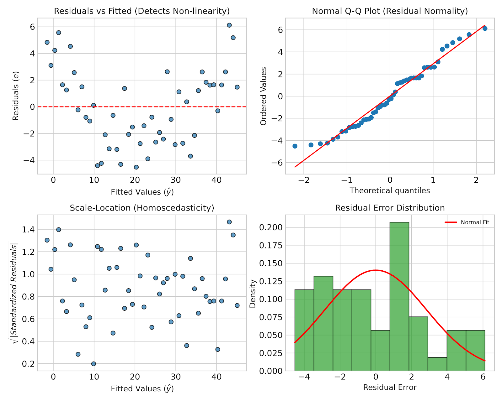
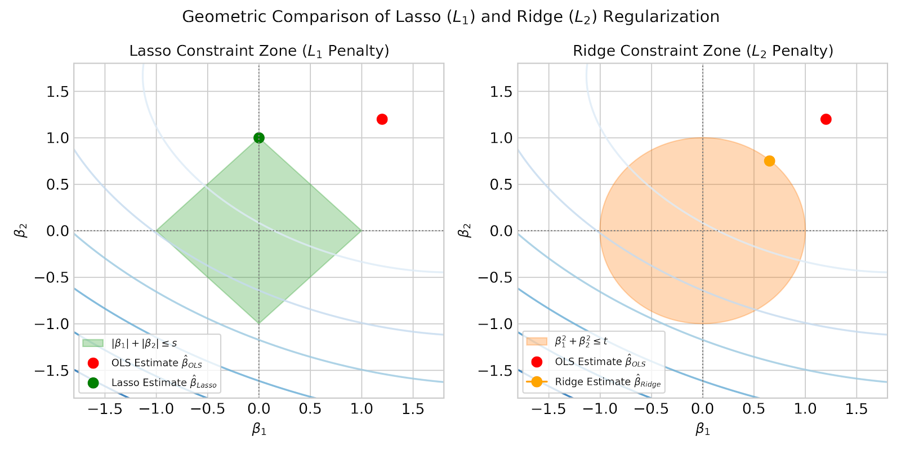
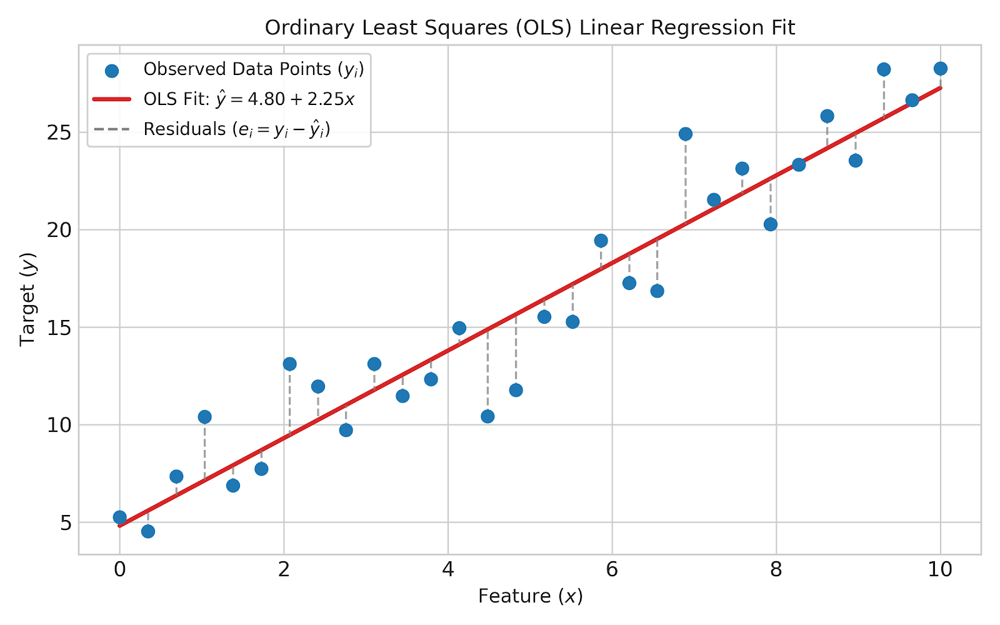
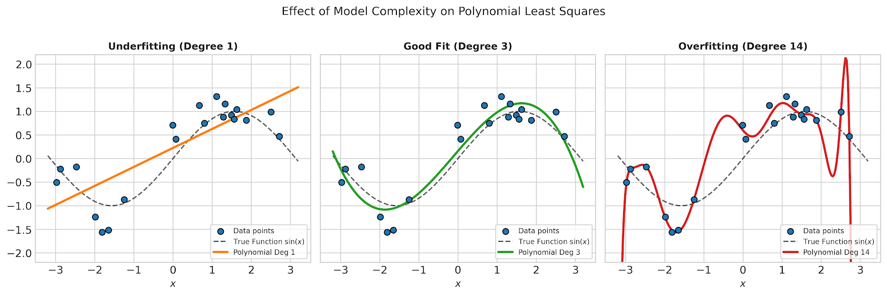
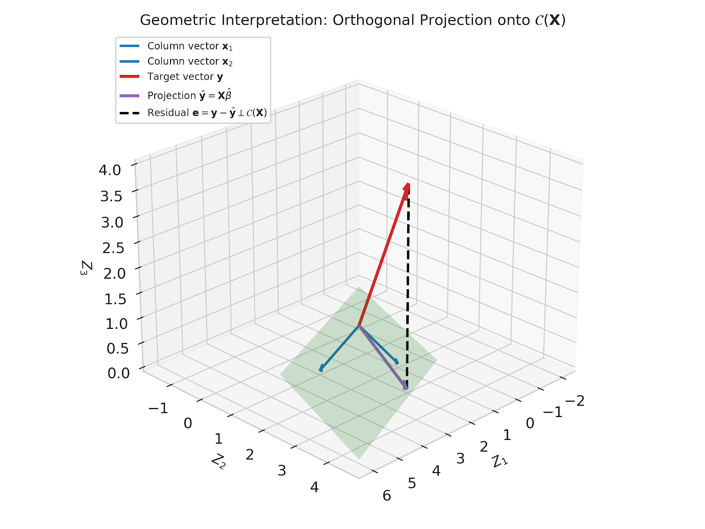

# Comprehensive Guide to Least Squares Problems and Linear Models

---

## Table of Contents
1. [Introduction to Linear Models](#1-introduction-to-linear-models)
2. [Ordinary Least Squares (OLS) Formulation](#2-ordinary-least-squares-ols-formulation)
3. [Geometric Interpretation of Least Squares](#3-geometric-interpretation-of-least-squares)
4. [Numerical Methods for Solving OLS](#4-numerical-methods-for-solving-ols)
   - [Normal Equations](#41-normal-equations)
   - [QR Decomposition](#42-qr-decomposition)
   - [Singular Value Decomposition (SVD)](#43-singular-value-decomposition-svd)
5. [Statistical Assumptions & Gauss-Markov Theorem](#5-statistical-assumptions--gauss-markov-theorem)
6. [Residual Analysis & Diagnostic Testing](#6-residual-analysis--diagnostic-testing)
7. [Polynomial Regression & Complexity Control](#7-polynomial-regression--complexity-control)
8. [Regularized Linear Models (Ridge, Lasso, ElasticNet)](#8-regularized-linear-models-ridge-lasso-elasticnet)
9. [Complete Python Reference Implementation](#9-complete-python-reference-implementation)
10. [Figures Download & Reference Links](#10-figures-download--reference-links)

---

## 1. Introduction to Linear Models

A **Linear Model** models the relationship between a dependent target variable $y \in \mathbb{R}$ and one or more independent predictor variables (features) $\mathbf{x} = [x_1, x_2, \dots, x_p]^T \in \mathbb{R}^p$.

The general equation for a linear model with $p$ predictor variables is:

$$y = \beta_0 + \beta_1 x_1 + \beta_2 x_2 + \dots + \beta_p x_p + \varepsilon$$

Where:
- $\beta_0$: Intercept term (bias).
- $\beta_j$: Slope parameter (coefficient) associated with feature $x_j$.
- $\varepsilon$: Unobserved random noise/error term representing measurement error or unmodeled variations.

For a dataset containing $n$ observations $\{(\mathbf{x}_i, y_i)\}_{i=1}^n$, the system of linear equations can be written in compact matrix notation:

$$\mathbf{y} = \mathbf{X} \boldsymbol{\beta} + \boldsymbol{\varepsilon}$$

Where:
- $\mathbf{y} \in \mathbb{R}^n$: Target vector, $\mathbf{y} = [y_1, y_2, \dots, y_n]^T$.
- $\mathbf{X} \in \mathbb{R}^{n \times (p+1)}$: Design matrix, where row $i$ contains $[1, x_{i1}, x_{i2}, \dots, x_{ip}]$.
- $\boldsymbol{\beta} \in \mathbb{R}^{p+1}$: Vector of unknown parameters, $\boldsymbol{\beta} = [\beta_0, \beta_1, \dots, \beta_p]^T$.
- $\boldsymbol{\varepsilon} \in \mathbb{R}^n$: Error vector, $\boldsymbol{\varepsilon} = [\varepsilon_1, \varepsilon_2, \dots, \varepsilon_n]^T$.

---

## 2. Ordinary Least Squares (OLS) Formulation

The goal of Ordinary Least Squares (OLS) is to find the coefficient vector $\hat{\boldsymbol{\beta}}$ that minimizes the **Sum of Squared Residuals (SSR)**:

$$S(\boldsymbol{\beta}) = \sum_{i=1}^n (y_i - \mathbf{x}_i^T \boldsymbol{\beta})^2 = \Vert{}\mathbf{y} - \mathbf{X} \boldsymbol{\beta}\Vert{}_2^2$$

Expanding the matrix norm:

$$S(\boldsymbol{\beta}) = (\mathbf{y} - \mathbf{X} \boldsymbol{\beta})^T (\mathbf{y} - \mathbf{X} \boldsymbol{\beta}) = \mathbf{y}^T \mathbf{y} - 2 \boldsymbol{\beta}^T \mathbf{X}^T \mathbf{y} + \boldsymbol{\beta}^T \mathbf{X}^T \mathbf{X} \boldsymbol{\beta}$$

To minimize $S(\boldsymbol{\beta})$, we compute the gradient with respect to $\boldsymbol{\beta}$ and set it to zero:

$$\nabla_{\boldsymbol{\beta}} S(\boldsymbol{\beta}) = -2 \mathbf{X}^T \mathbf{y} + 2 \mathbf{X}^T \mathbf{X} \boldsymbol{\beta} = \mathbf{0}$$

This yields the fundamental **Normal Equations**:

$$\mathbf{X}^T \mathbf{X} \hat{\boldsymbol{\beta}} = \mathbf{X}^T \mathbf{y}$$

Assuming $\mathbf{X}^T \mathbf{X}$ is invertible (i.e., $\mathbf{X}$ has full column rank $p+1$), the unique OLS estimator is:

$$\hat{\boldsymbol{\beta}} = (\mathbf{X}^T \mathbf{X})^{-1} \mathbf{X}^T \mathbf{y}$$

The predicted values $\hat{\mathbf{y}}$ are given by:

$$\hat{\mathbf{y}} = \mathbf{X} \hat{\boldsymbol{\beta}} = \mathbf{X} (\mathbf{X}^T \mathbf{X})^{-1} \mathbf{X}^T \mathbf{y} = \mathbf{H} \mathbf{y}$$

Where $\mathbf{H} = \mathbf{X}(\mathbf{X}^T \mathbf{X})^{-1}\mathbf{X}^T$ is known as the **Hat Matrix** (or projection matrix).



---

## 3. Geometric Interpretation of Least Squares

Geometrically, the column space (range) of $\mathbf{X}$, denoted as $\mathcal{C}(\mathbf{X})$, forms a subspace of $\mathbb{R}^n$. The predicted response vector $\hat{\mathbf{y}} = \mathbf{X}\hat{\boldsymbol{\beta}}$ must lie within $\mathcal{C}(\mathbf{X})$.

If $\mathbf{y}$ does not lie within $\mathcal{C}(\mathbf{X})$, the residual vector $\mathbf{e} = \mathbf{y} - \hat{\mathbf{y}}$ represents the vector connecting $\mathbf{y}$ to $\hat{\mathbf{y}}$. The length $\Vert{}\mathbf{e}\Vert{}_2$ is minimized when $\mathbf{e}$ is **orthogonal** to the subspace $\mathcal{C}(\mathbf{X})$.

$$\mathbf{X}^T \mathbf{e} = \mathbf{X}^T (\mathbf{y} - \mathbf{X}\hat{\boldsymbol{\beta}}) = \mathbf{0}$$

This orthogonality condition directly generates the Normal Equations. The hat matrix $\mathbf{H}$ acts as an orthogonal projection operator that projects any vector $\mathbf{y} \in \mathbb{R}^n$ onto $\mathcal{C}(\mathbf{X})$.



---

## 4. Numerical Methods for Solving OLS

In computational practice, explicitly computing $(\mathbf{X}^T \mathbf{X})^{-1}$ is discouraged due to numerical instability and high condition numbers. Three main numerical solvers are used:

### 4.1 Normal Equations
* **Method**: Solve $(\mathbf{X}^T \mathbf{X}) \boldsymbol{\beta} = \mathbf{X}^T \mathbf{y}$ using Cholesky Decomposition on $\mathbf{X}^T \mathbf{X}$.
* **Complexity**: $\mathcal{O}(n p^2 + p^3/3)$.
* **Pros/Cons**: Fast when $n \gg p$, but squares the condition number $\kappa(\mathbf{X}^T \mathbf{X}) = \kappa(\mathbf{X})^2$, leading to precision loss.

### 4.2 QR Decomposition
* **Method**: Decompose $\mathbf{X} = \mathbf{Q} \mathbf{R}$, where $\mathbf{Q} \in \mathbb{R}^{n \times p}$ has orthonormal columns and $\mathbf{R} \in \mathbb{R}^{p \times p}$ is upper triangular.
* **Formulation**:
  $$\mathbf{X}^T \mathbf{X} \boldsymbol{\beta} = \mathbf{X}^T \mathbf{y} \implies \mathbf{R}^T \mathbf{Q}^T \mathbf{Q} \mathbf{R} \boldsymbol{\beta} = \mathbf{R}^T \mathbf{Q}^T \mathbf{y} \implies \mathbf{R} \boldsymbol{\beta} = \mathbf{Q}^T \mathbf{y}$$
* **Solving**: Use back-substitution to solve $\mathbf{R} \boldsymbol{\beta} = \mathbf{Q}^T \mathbf{y}$.
* **Pros**: Numerically stable; condition number is $\kappa(\mathbf{X})$. Recommended default method.

### 4.3 Singular Value Decomposition (SVD)
* **Method**: Factorize $\mathbf{X} = \mathbf{U} \boldsymbol{\Sigma} \mathbf{V}^T$, where $\mathbf{U}$ and $\mathbf{V}$ are orthogonal matrices, and $\boldsymbol{\Sigma}$ contains singular values $\sigma_i$.
* **Formulation**:
  $$\hat{\boldsymbol{\beta}} = \mathbf{X}^+ \mathbf{y} = \mathbf{V} \boldsymbol{\Sigma}^+ \mathbf{U}^T \mathbf{y}$$
* **Pros**: Handles rank-deficient or singular matrices (collinearity) by setting small singular values ($1/\sigma_i$) to 0.

---

## 5. Statistical Assumptions & Gauss-Markov Theorem

For OLS estimators to possess optimal statistical properties, the model must satisfy the classical linear regression assumptions:

1. **Linearity in Parameters**: $\mathbf{y} = \mathbf{X} \boldsymbol{\beta} + \boldsymbol{\varepsilon}$.
2. **Exogeneity**: $\mathbb{E}[\boldsymbol{\varepsilon} \mid \mathbf{X}] = \mathbf{0}$.
3. **Spherical Errors (Homoscedasticity & No Autocorrelation)**: $\text{Var}(\boldsymbol{\varepsilon} \mid \mathbf{X}) = \sigma^2 \mathbf{I}_n$.
4. **Full Rank**: $\text{rank}(\mathbf{X}) = p+1 < n$ (No exact multicollinearity).
5. **Normality (Optional for finite sample inference)**: $\boldsymbol{\varepsilon} \sim \mathcal{N}(\mathbf{0}, \sigma^2 \mathbf{I}_n)$.

### The Gauss-Markov Theorem
Under assumptions 1 to 4, the OLS estimator $\hat{\boldsymbol{\beta}}$ is the **BLUE** (**B**est **L**inear **U**nbiased **E**stimator).
* **Unbiased**: $\mathbb{E}[\hat{\boldsymbol{\beta}}] = \boldsymbol{\beta}$.
* **Best (Minimum Variance)**: $\text{Var}(\hat{\boldsymbol{\beta}}) \le \text{Var}(\tilde{\boldsymbol{\beta}})$ for any other linear unbiased estimator $\tilde{\boldsymbol{\beta}}$.

---

## 6. Residual Analysis & Diagnostic Testing

To verify whether model assumptions hold, diagnostic plots are evaluated:

* **Residuals vs Fitted**: Checks for non-linearity (curvature) and non-constant error variance.
* **Normal Q-Q Plot**: Compares residual quantiles against standard normal quantiles to assess normality.
* **Scale-Location Plot**: Standardized square-root residuals vs fitted values to test homoscedasticity.
* **Histogram & Density**: Verifies symmetry and Gaussian tail distribution.



---

## 7. Polynomial Regression & Complexity Control

When data exhibits non-linear relationships, linear models can be extended using polynomial basis expansion:

$$y = \beta_0 + \beta_1 x + \beta_2 x^2 + \dots + \beta_d x^d + \varepsilon$$

Although non-linear with respect to $x$, this remains a **linear model** because it is linear with respect to the parameters $\boldsymbol{\beta}$.

* **Low Degree (Underfitting)**: High bias, fails to capture trend.
* **High Degree (Overfitting)**: High variance, fits noise in training data and oscillates wildly.



---

## 8. Regularized Linear Models

When multicollinearity is present or $p > n$, OLS produces high-variance estimates. Regularization imposes a penalty on coefficient magnitude to trade a small bias for significant variance reduction.

$$\hat{\boldsymbol{\beta}}_{\text{reg}} = \arg\min_{\boldsymbol{\beta}} \left( \Vert{}\mathbf{y} - \mathbf{X} \boldsymbol{\beta}\Vert{}_2^2 + \lambda \mathcal{P}(\boldsymbol{\beta}) \right)$$

### 8.1 Ridge Regression ($L_2$ Regularization)
* **Penalty**: $\mathcal{P}(\boldsymbol{\beta}) = \Vert{}\boldsymbol{\beta}\Vert{}_2^2 = \sum_{j=1}^p \beta_j^2$.
* **Closed-form Solution**: $\hat{\boldsymbol{\beta}}_{\text{Ridge}} = (\mathbf{X}^T \mathbf{X} + \lambda \mathbf{I})^{-1} \mathbf{X}^T \mathbf{y}$.
* **Effect**: Shrinks coefficients toward zero, never sets them strictly to zero. Solves singularity when $\mathbf{X}^T\mathbf{X}$ is not invertible.

### 8.2 Lasso Regression ($L_1$ Regularization)
* **Penalty**: $\mathcal{P}(\boldsymbol{\beta}) = \Vert{}\boldsymbol{\beta}\Vert{}_1 = \sum_{j=1}^p \vert{}\beta_j\vert{}$.
* **Effect**: Performs sparse feature selection by driving irrelevant coefficients exactly to zero.

### 8.3 ElasticNet
* **Penalty**: Combines $L_1$ and $L_2$ penalties: $\lambda_1 \Vert{}\boldsymbol{\beta}\Vert{}_1 + \lambda_2 \Vert{}\boldsymbol{\beta}\Vert{}_2^2$.



---

## 9. Complete Python Reference Implementation

Below is a self-contained Python script implementing custom OLS solvers, evaluation metrics, and regularized regression.

```python
import numpy as np
import scipy.linalg as la

class LinearRegressionOLS:
    """
    Custom Implementation of Ordinary Least Squares Regression
    using Normal Equations, QR Decomposition, and SVD.
    """
    def __init__(self, solver='qr'):
        self.solver = solver
        self.beta = None
        
    def fit(self, X, y):
        # Prepend column of ones for intercept term
        n_samples = X.shape[0]
        X_design = np.column_stack([np.ones(n_samples), X])
        
        if self.solver == 'normal_equations':
            # beta = (X^T X)^(-1) X^T y
            XtX = X_design.T @ X_design
            Xty = X_design.T @ y
            self.beta = la.solve(XtX, Xty, assume_a='pos')
            
        elif self.solver == 'qr':
            # X = Q R  =>  R beta = Q^T y
            Q, R = la.qr(X_design, mode='economic')
            Qty = Q.T @ y
            self.beta = la.solve_triangular(R, Qty)
            
        elif self.solver == 'svd':
            # X = U S V^T => beta = V S^+ U^T y
            U, S, Vt = la.svd(X_design, full_matrices=False)
            S_inv = np.where(S > 1e-10, 1.0 / S, 0.0)
            self.beta = Vt.T @ (S_inv * (U.T @ y))
        else:
            raise ValueError(f"Unknown solver: {self.solver}")
            
        return self

    def predict(self, X):
        n_samples = X.shape[0]
        X_design = np.column_stack([np.ones(n_samples), X])
        return X_design @ self.beta


class RidgeRegression:
    """Custom Implementation of Ridge (L2) Regression."""
    def __init__(self, alpha=1.0):
        self.alpha = alpha
        self.beta = None
        
    def fit(self, X, y):
        n_samples, n_features = X.shape
        X_design = np.column_stack([np.ones(n_samples), X])
        
        # Do not penalize intercept term
        I = np.eye(n_features + 1)
        I[0, 0] = 0.0
        
        XtX = X_design.T @ X_design
        Xty = X_design.T @ y
        
        self.beta = la.solve(XtX + self.alpha * I, Xty, assume_a='pos')
        return self

    def predict(self, X):
        n_samples = X.shape[0]
        X_design = np.column_stack([np.ones(n_samples), X])
        return X_design @ self.beta


def evaluate_regression(y_true, y_pred, p):
    """
    Computes key performance metrics: MSE, RMSE, MAE, R^2, and Adjusted R^2.
    """
    n = len(y_true)
    residuals = y_true - y_pred
    
    ss_res = np.sum(residuals**2)
    ss_tot = np.sum((y_true - np.mean(y_true))**2)
    
    mse = ss_res / n
    rmse = np.sqrt(mse)
    mae = np.mean(np.abs(residuals))
    r2 = 1.0 - (ss_res / ss_tot)
    adj_r2 = 1.0 - ((1.0 - r2) * (n - 1) / (n - p - 1))
    
    return {
        'MSE': mse,
        'RMSE': rmse,
        'MAE': mae,
        'R2': r2,
        'Adj_R2': adj_r2
    }

# --- Demonstration & Verification ---
if __name__ == '__main__':
    np.random.seed(42)
    X_raw = np.random.uniform(1, 10, size=(100, 3))
    true_beta = np.array([3.5, 1.8, -2.2, 0.5])
    y_raw = true_beta[0] + X_raw @ true_beta[1:] + np.random.normal(0, 1.2, size=100)
    
    # Fit OLS via QR
    model = LinearRegressionOLS(solver='qr')
    model.fit(X_raw, y_raw)
    preds = model.predict(X_raw)
    
    print("Estimated Parameters (Intercept + Coeffs):", model.beta)
    print("Evaluation Metrics:", evaluate_regression(y_raw, preds, p=3))