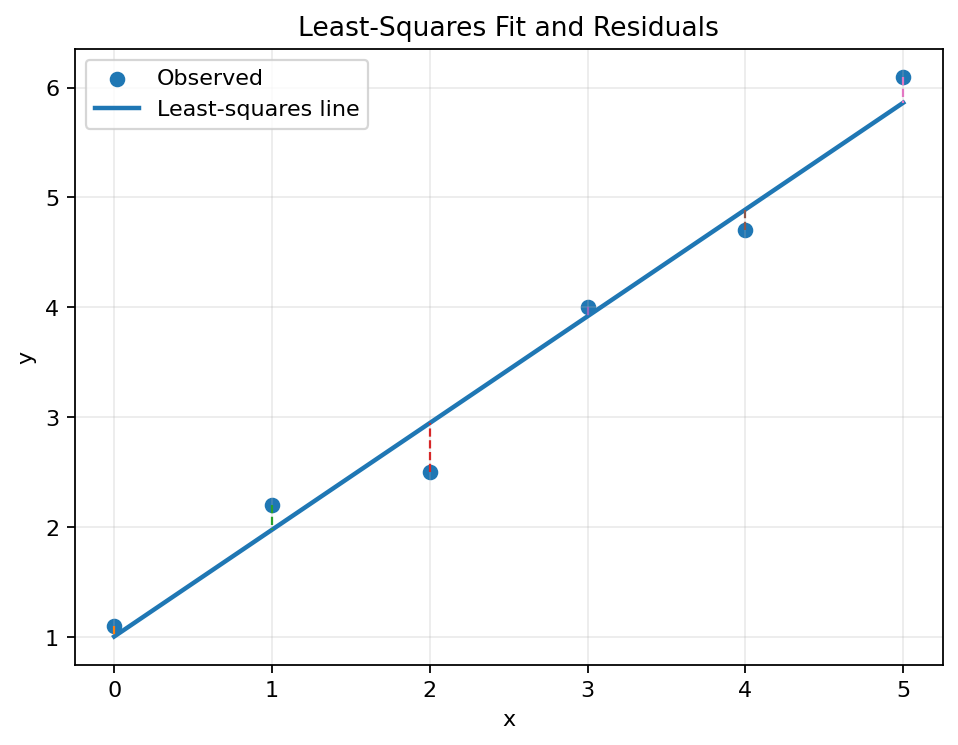
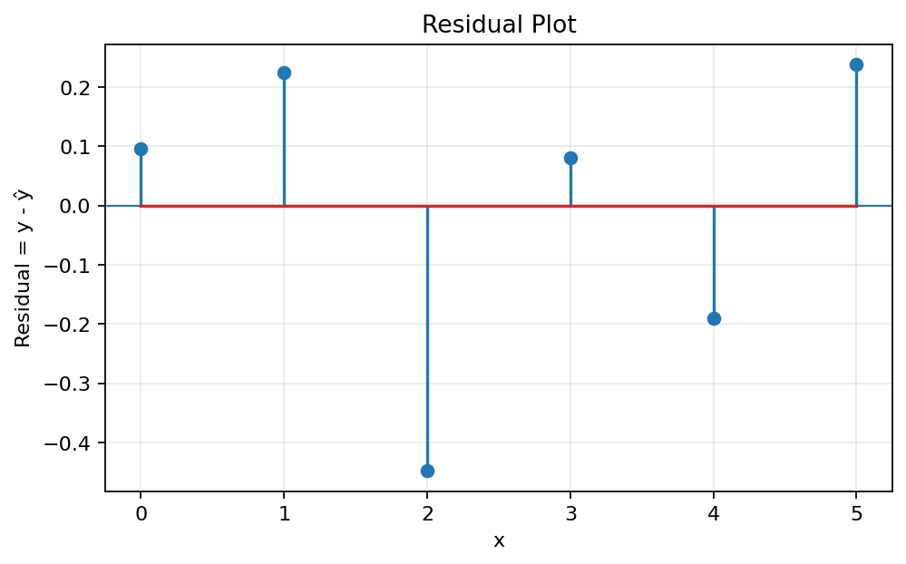
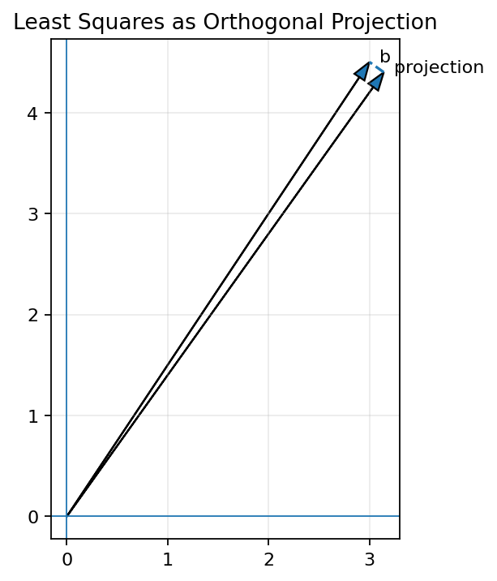
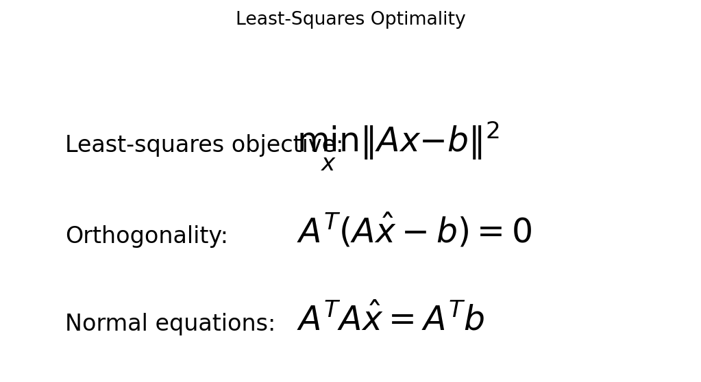
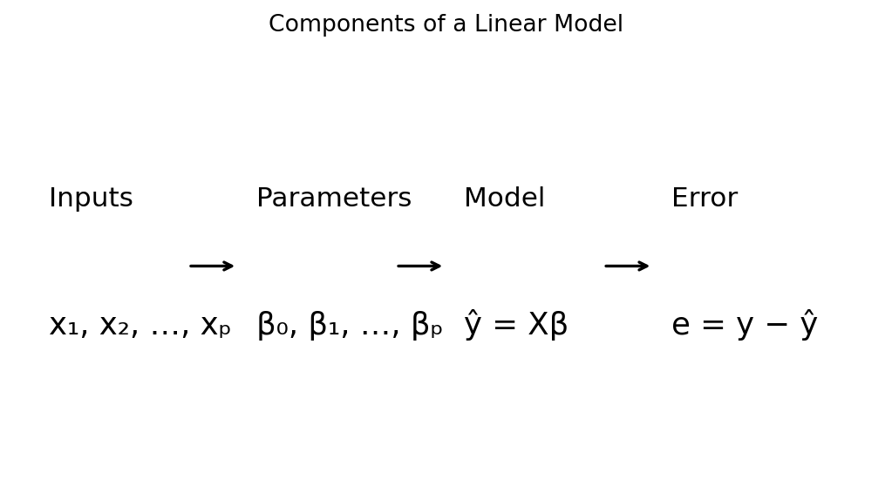
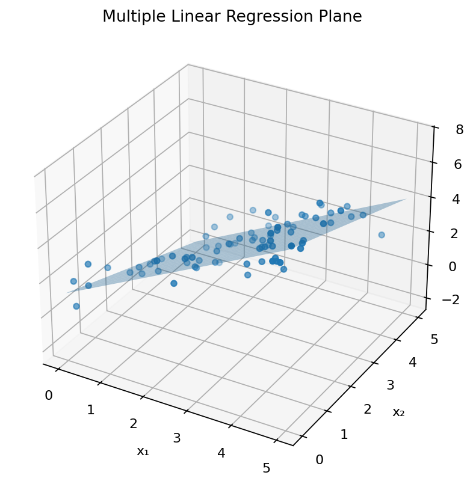
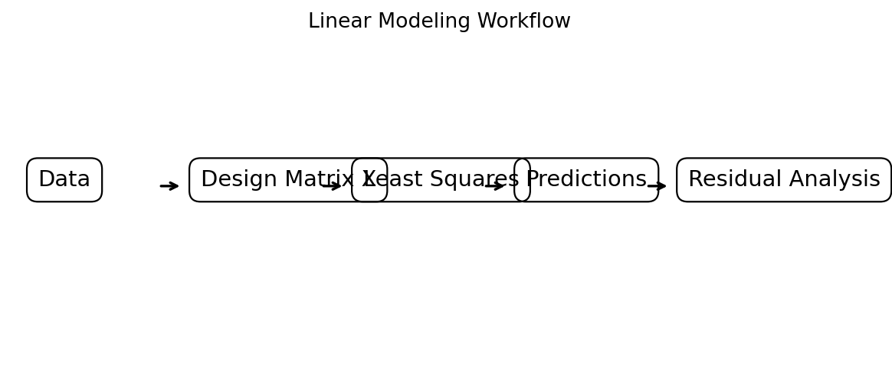

# Least Squares Problems and Linear Models

## Learning Objectives

After studying this material, you should be able to:

- Explain why least-squares methods are needed for approximate linear systems.
- Identify overdetermined systems.
- Define residuals, SSE, MSE, and RMSE.
- Formulate least-squares problems using matrix notation.
- Derive and interpret the normal equations.
- Interpret least squares as orthogonal projection.
- Construct design matrices for linear models.
- Fit simple, multiple, polynomial, and basis-function models in Python.
- Explain the role of QR and SVD in numerical least squares.
- Connect least squares with statistics, machine learning, and data analytics.

## 1. Introduction

Real-world measurements usually contain noise and variation. Consequently, a system built from observations may not have an exact solution.

For a linear model,

$$y \approx \beta_0+\beta_1x,$$

we usually cannot find one line passing exactly through every measured point. Instead, we choose parameters that minimize the total squared error.

The central least-squares problem is

$$\boxed{\min_x\|Ax-b\|^2}.$$



## 2. Overdetermined Systems

If $A$ has more rows than columns, $Ax=b$ is called an **overdetermined system**. It has more equations than unknowns and may be inconsistent.

Instead of requiring $Ax=b$, least squares finds

$$Ax\approx b$$

by minimizing

$$\boxed{\|Ax-b\|^2}.$$

This makes least squares especially useful for fitting models to experimental and observational data.

## 3. Residual Vector

For an approximate solution $\hat{x}$, the residual is

$$\boxed{r=b-A\hat{x}}.$$

For scalar observations,

$$e_i=y_i-\hat y_i.$$

The residual sum of squares (RSS), also called SSE, is

$$\boxed{SSE=\sum_i(y_i-\hat y_i)^2}.$$



### Python

```python
import numpy as np

A = np.array([[1., 1.],
              [1., 2.],
              [1., 3.]])
b = np.array([2., 2.8, 4.2])

x_hat = np.linalg.lstsq(A, b, rcond=None)[0]
r = b - A @ x_hat

print("Solution:", x_hat)
print("Residual:", r)
print("SSE:", np.sum(r**2))
```

## 4. Geometric Interpretation

The columns of $A$ span $\operatorname{Col}(A)$. Every vector $Ax$ lies in that subspace.

If $b$ is not in $\operatorname{Col}(A)$, the exact equation $Ax=b$ has no solution. Least squares finds the point in the column space closest to $b$:

$$\boxed{A\hat{x}=\operatorname{proj}_{\operatorname{Col}(A)}(b)}.$$



The residual is orthogonal to the column space:

$$A^T(b-A\hat{x})=0.$$

## 5. Normal Equations

From

$$A^T(b-A\hat{x})=0,$$

we obtain

$$\boxed{A^TA\hat{x}=A^Tb}.$$

These are the **normal equations**.

If $A$ has linearly independent columns,

$$\boxed{\hat{x}=(A^TA)^{-1}A^Tb}.$$



For numerical computation, avoid explicitly forming the inverse when possible.

```python
x_hat = np.linalg.solve(A.T @ A, A.T @ b)
```

Usually, prefer:

```python
x_hat = np.linalg.lstsq(A, b, rcond=None)[0]
```

## 6. Linear Models

A simple linear model is

$$\boxed{y=\beta_0+\beta_1x+\epsilon}.$$

Here $\beta_0$ is the intercept, $\beta_1$ is the slope, and $\epsilon$ represents error.



The fitted model is

$$\hat y=\hat\beta_0+\hat\beta_1x.$$

The model is linear in the unknown parameters even though the observed data may be noisy.

## 7. Design Matrix

For a simple linear model,

$$y=\beta_0+\beta_1x+\epsilon,$$

the design matrix is

$$X=
\begin{bmatrix}
1&x_1\\
1&x_2\\
\vdots&\vdots\\
1&x_m
\end{bmatrix}.$$

Thus

$$\boxed{y=X\beta+\epsilon}.$$

The fitted values are

$$\boxed{\hat y=X\hat\beta}.$$

The column of ones represents the intercept.

## 8. Simple Linear Regression in Python

```python
import numpy as np

x = np.array([0, 1, 2, 3, 4, 5], dtype=float)
y = np.array([1.1, 2.2, 2.5, 4.0, 4.7, 6.1], dtype=float)

X = np.column_stack([np.ones(len(x)), x])

beta = np.linalg.lstsq(X, y, rcond=None)[0]
y_hat = X @ beta
residuals = y - y_hat

print("Intercept:", beta[0])
print("Slope:", beta[1])
print("Predictions:", y_hat)
print("Residuals:", residuals)
```

## 9. Plotting a Least-Squares Line

```python
import matplotlib.pyplot as plt

plt.scatter(x, y, label="Observed")
plt.plot(x, y_hat, linewidth=2, label="Fitted")
plt.xlabel("x")
plt.ylabel("y")
plt.title("Least-Squares Linear Model")
plt.grid()
plt.legend()
plt.show()
```

The fitted line is the line that minimizes the sum of squared vertical residuals.

## 10. Multiple Linear Models

A model with several predictors is

$$\boxed{y=\beta_0+\beta_1x_1+\cdots+\beta_px_p+\epsilon}.$$

In matrix form,

$$\boxed{y=X\beta+\epsilon}.$$

For two predictors,

$$X=
\begin{bmatrix}
1&x_{11}&x_{12}\\
1&x_{21}&x_{22}\\
\vdots&\vdots&\vdots\\
1&x_{m1}&x_{m2}
\end{bmatrix}.$$



### Python

```python
import numpy as np

study_hours = np.array([1,2,3,4,5,6], dtype=float)
attendance = np.array([60,65,70,75,85,90], dtype=float)
score = np.array([50,55,61,67,78,84], dtype=float)

X = np.column_stack([
    np.ones(len(score)),
    study_hours,
    attendance
])

beta = np.linalg.lstsq(X, score, rcond=None)[0]
predicted = X @ beta

print("Coefficients:", beta)
print("Predicted:", predicted)
```

## 11. Least-Squares Objective and Derivation

For

$$y=X\beta+\epsilon,$$

least squares minimizes

$$J(\beta)=\|y-X\beta\|^2.$$

Expanding,

$$J(\beta)=(y-X\beta)^T(y-X\beta).$$

Differentiation gives

$$\nabla_\beta J=-2X^T(y-X\beta).$$

Setting the gradient to zero:

$$X^T(y-X\hat\beta)=0.$$

Hence

$$\boxed{X^TX\hat\beta=X^Ty}.$$

This is the normal-equation form of linear regression.

## 12. Projection Matrix

If $X$ has full column rank, the orthogonal projection matrix onto $\operatorname{Col}(X)$ is

$$\boxed{P=X(X^TX)^{-1}X^T}.$$

Then

$$\hat y=Py.$$

The residual is

$$e=(I-P)y.$$

An orthogonal projection satisfies

$$P^2=P,\qquad P^T=P.$$

### Python

```python
P = X @ np.linalg.inv(X.T @ X) @ X.T
y_hat = P @ y

print("Projection matrix:")
print(P)
print("P^2 = P:", np.allclose(P @ P, P))
print("P^T = P:", np.allclose(P.T, P))
```

## 13. Error Measures

### SSE

$$\boxed{SSE=\sum_i(y_i-\hat y_i)^2}$$

```python
SSE = np.sum((y - y_hat)**2)
```

### MSE

$$\boxed{MSE=\frac{1}{m}\sum_i(y_i-\hat y_i)^2}$$

```python
MSE = np.mean((y - y_hat)**2)
```

### RMSE

$$\boxed{RMSE=\sqrt{MSE}}$$

```python
RMSE = np.sqrt(MSE)
```

RMSE has the same units as the response variable.

## 14. Coefficient of Determination

A common fit measure is

$$\boxed{R^2=1-\frac{SSE}{SST}}$$

where

$$SST=\sum_i(y_i-\bar y)^2.$$

```python
SSE = np.sum((y - y_hat)**2)
SST = np.sum((y - np.mean(y))**2)
R2 = 1 - SSE / SST

print("R^2:", R2)
```

A high $R^2$ indicates a strong in-sample fit according to this measure, but it does not prove causation or guarantee good performance on new data.

## 15. Polynomial Models

A quadratic model is

$$y=\beta_0+\beta_1x+\beta_2x^2+\epsilon.$$

Its design matrix is

$$X=
\begin{bmatrix}
1&x_1&x_1^2\\
1&x_2&x_2^2\\
\vdots&\vdots&\vdots\\
1&x_m&x_m^2
\end{bmatrix}.$$

It is nonlinear in $x$ but linear in its parameters.

```python
x = np.array([0,1,2,3,4,5], dtype=float)
y = np.array([1.0,1.7,4.2,8.8,15.8,25.0])

X = np.column_stack([np.ones(len(x)), x, x**2])
beta = np.linalg.lstsq(X, y, rcond=None)[0]

print(beta)
```

## 16. Basis-Function Models

More generally,

$$y\approx\beta_1\phi_1(x)+\cdots+\beta_p\phi_p(x).$$

Examples of basis functions include:

$$1,x,x^2$$

and

$$1,x,\sin x,\cos x.$$

```python
x = np.linspace(0, 2*np.pi, 50)
rng = np.random.default_rng(2)

y = 2 + 1.5*np.sin(x) + 0.7*np.cos(x) + rng.normal(0, .2, len(x))

X = np.column_stack([
    np.ones(len(x)),
    np.sin(x),
    np.cos(x)
])

beta = np.linalg.lstsq(X, y, rcond=None)[0]
print(beta)
```

## 17. QR Decomposition

For numerical stability, QR decomposition is often preferable to forming normal equations.

If

$$X=QR,$$

then

$$X\beta\approx y$$

leads to

$$\boxed{R\hat\beta=Q^Ty}.$$

```python
Q, R = np.linalg.qr(X)
beta = np.linalg.solve(R, Q.T @ y)
print(beta)
```

## 18. SVD and the Pseudoinverse

The singular value decomposition is

$$X=U\Sigma V^T.$$

The pseudoinverse is

$$X^+=V\Sigma^+U^T.$$

A least-squares/minimum-norm solution can be written as

$$\boxed{\hat\beta=X^+y}.$$

```python
X_pinv = np.linalg.pinv(X)
beta = X_pinv @ y
print(beta)
```

SVD is especially useful for rank-deficient or nearly rank-deficient matrices.

## 19. Rank and Multicollinearity

If $X$ has full column rank, its columns are independent and the coefficient vector is unique.

If predictors are nearly linearly dependent, the problem can become ill-conditioned. This is called **multicollinearity**.

For example,

$$x_2\approx2x_1.$$

Possible consequences include unstable coefficients and sensitivity to small changes in the data.

## 20. Weighted Least Squares

When observations have different reliability, weighted least squares minimizes

$$\boxed{\sum_iw_i(y_i-\hat y_i)^2}.$$

In matrix form,

$$\boxed{(y-X\beta)^TW(y-X\beta)}.$$

The weighted normal equations are

$$\boxed{X^TWX\hat\beta=X^TWy}.$$

## 21. Applications

Least squares is used in:

- **Machine learning:** linear regression and parameter estimation.
- **Data analytics:** trend and relationship modeling.
- **Computer vision:** geometric fitting and camera calibration.
- **Signal processing:** estimation from noisy observations.
- **Image processing:** fitting models to image measurements.
- **Engineering:** system identification and experimental modeling.
- **Forecasting:** estimation of trends from historical observations.

## 22. Linear Modeling Workflow



A typical workflow is:

1. Collect data.
2. Select response and predictor variables.
3. Construct the design matrix.
4. Fit the model.
5. Generate predictions.
6. Calculate residuals.
7. Evaluate error measures.
8. Inspect residual patterns.
9. Validate the model on new data when appropriate.

## 23. Complete Python Example

```python
import numpy as np
import matplotlib.pyplot as plt

x = np.array([0,1,2,3,4,5], dtype=float)
y = np.array([1.1,2.2,2.5,4.0,4.7,6.1], dtype=float)

# Design matrix
X = np.column_stack([np.ones(len(x)), x])

# Fit
beta = np.linalg.lstsq(X, y, rcond=None)[0]

# Predict
y_hat = X @ beta

# Residuals
e = y - y_hat

# Metrics
SSE = np.sum(e**2)
MSE = np.mean(e**2)
RMSE = np.sqrt(MSE)

SST = np.sum((y - np.mean(y))**2)
R2 = 1 - SSE/SST

print("Intercept:", beta[0])
print("Slope:", beta[1])
print("SSE:", SSE)
print("MSE:", MSE)
print("RMSE:", RMSE)
print("R^2:", R2)

plt.scatter(x, y, label="Observed")
plt.plot(x, y_hat, linewidth=2, label="Fitted")
plt.xlabel("x")
plt.ylabel("y")
plt.title("Least-Squares Linear Model")
plt.grid()
plt.legend()
plt.show()
```

## 24. Common Mistakes

1. Assuming an overdetermined system must have an exact solution.
2. Forgetting the intercept column of ones.
3. Confusing residuals with predictions.
4. Explicitly computing matrix inverses unnecessarily.
5. Interpreting $R^2$ as proof of causation.
6. Ignoring patterns in residual plots.
7. Assuming a high training fit guarantees good generalization.

## 25. Important Formula Summary

$$\boxed{\min_x\|Ax-b\|^2}$$

$$\boxed{r=b-A\hat{x}}$$

$$\boxed{A^TA\hat{x}=A^Tb}$$

$$\boxed{\hat{x}=(A^TA)^{-1}A^Tb}$$

$$\boxed{y=X\beta+\epsilon}$$

$$\boxed{\hat y=X\hat\beta}$$

$$\boxed{SSE=\|y-X\hat\beta\|^2}$$

$$\boxed{RMSE=\sqrt{\frac{SSE}{m}}}$$

$$\boxed{R^2=1-\frac{SSE}{SST}}$$

$$\boxed{P=X(X^TX)^{-1}X^T}$$

## 26. Conceptual Connection

A useful chain to remember is:

$$
\boxed{
\text{Linear Model}
\rightarrow
\text{Least Squares}
\rightarrow
\text{Projection}
\rightarrow
\text{Orthogonality}
\rightarrow
\text{Normal Equations}
}
$$

Least squares finds the combination of model directions that comes closest to the observations. Geometrically, this is an orthogonal projection, and the orthogonality of the residual produces the normal equations.

## 27. Practice Questions

### Conceptual

1. What is an overdetermined system?
2. Why might $Ax=b$ have no exact solution?
3. Define the residual vector.
4. What does least squares minimize?
5. Explain least squares geometrically.
6. Derive the normal equations.
7. Why is the residual orthogonal to the column space?
8. What is a design matrix?
9. Explain SSE, MSE, and RMSE.
10. Why can QR/SVD be preferable to normal equations?
11. What is multicollinearity?
12. Why is polynomial regression linear in its parameters?

### Numerical

1. Solve the least-squares problem

$$A=\begin{bmatrix}1&1\\1&2\\1&3\end{bmatrix},\quad
b=\begin{bmatrix}2\\3\\5\end{bmatrix}.$$

2. Find the residual vector.
3. Verify $A^Tr=0$.
4. Fit a line to $(1,2),(2,4),(3,5),(4,8)$.
5. Calculate SSE and RMSE.
6. Construct a quadratic design matrix.
7. Fit a multiple linear model with two predictors.

### Programming

1. Implement least squares using normal equations.
2. Implement it using `np.linalg.lstsq`.
3. Plot observed data and the fitted line.
4. Plot residuals.
5. Calculate SSE, MSE, RMSE, and $R^2$.
6. Fit a multiple linear model.
7. Fit a quadratic model.
8. Implement least squares using QR.
9. Compare normal-equation and QR solutions.
10. Verify numerically that the residual is orthogonal to the column space.

## 28. Key Takeaways

- Least squares solves approximate systems of linear equations.
- It is especially useful for overdetermined systems.
- It minimizes the squared residual norm.
- The residual is orthogonal to the column space at the optimum.
- The normal equations are $A^TA\hat{x}=A^Tb$.
- Linear models have the matrix form $y=X\beta+\epsilon$.
- The design matrix encodes predictors and basis functions.
- Linear regression is a major application of least squares.
- QR and SVD provide useful numerically robust methods.
- Least squares connects linear algebra with statistics, machine learning, data analytics, signal processing, computer vision, and engineering.

## Figures

The accompanying `figures/` folder contains:

1. `01_least_squares_fit.png` — least-squares fit and residuals
2. `02_residual_plot.png` — residual plot
3. `03_projection_geometry.png` — geometric projection
4. `04_normal_equations.png` — normal equations
5. `05_linear_model_components.png` — model components
6. `06_multiple_regression_plane.png` — multiple regression plane
7. `07_linear_model_workflow.png` — modeling workflow
