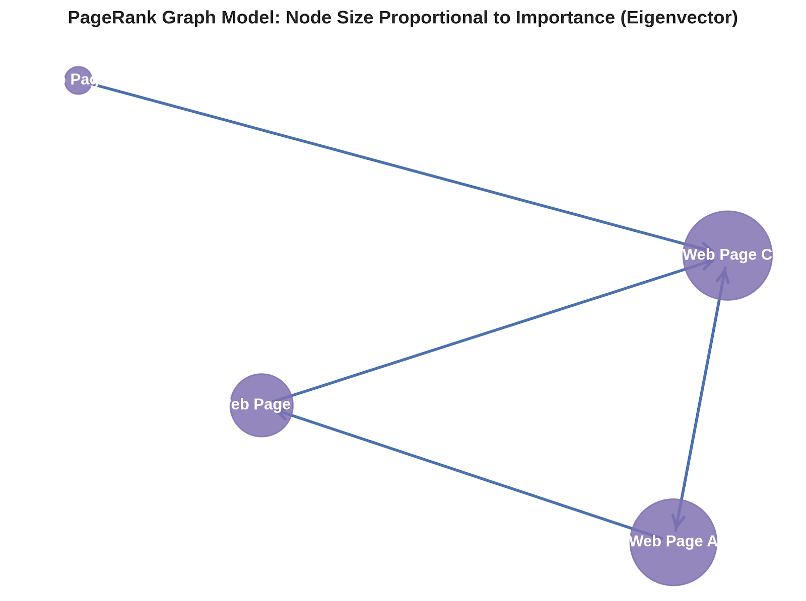
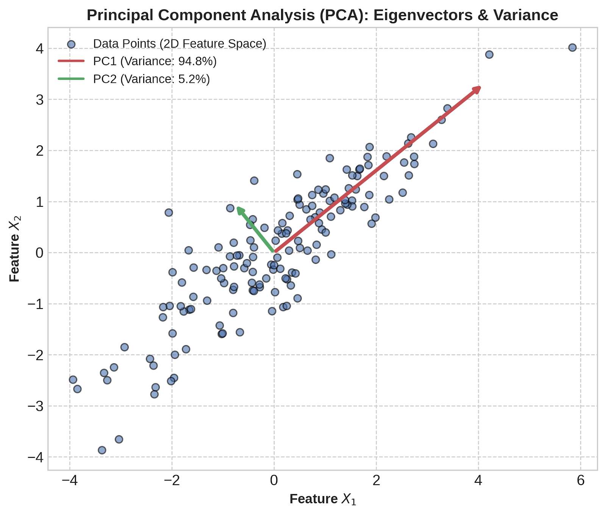
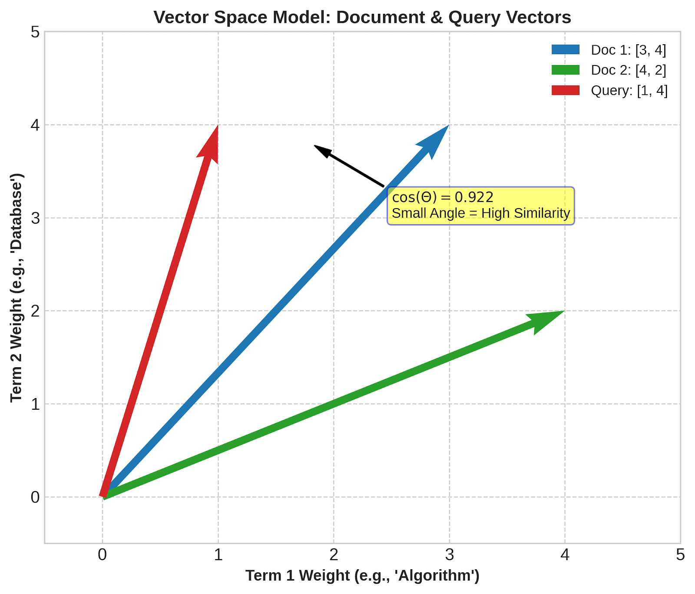
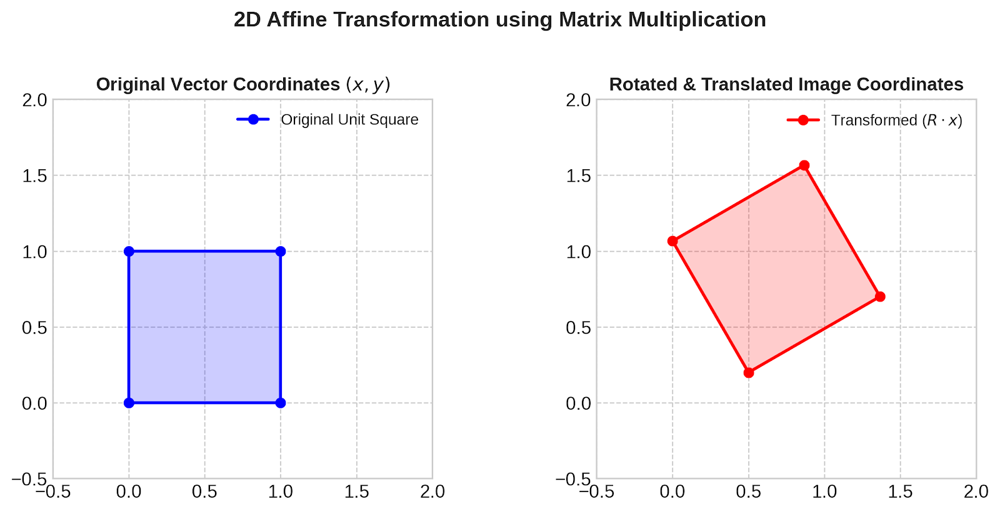

# Applications of Linear Algebra in Information Technology and Data Representation

## Course Reading Material & Technical Guide

---

## Table of Contents
1. [Introduction to Linear Algebra in Modern IT](#1-introduction-to-linear-algebra-in-modern-it)
2. [Data Representation: Vectors, Matrices, and Tensors](#2-data-representation-vectors-matrices-and-tensors)
3. [Digital Image Processing & Computer Graphics](#3-digital-image-processing--computer-graphics)
4. [Text Representation & Natural Language Processing (NLP)](#4-text-representation--natural-language-processing-nlp)
5. [Dimensionality Reduction & Feature Extraction (PCA & SVD)](#5-dimensionality-reduction--feature-extraction-pca--svd)
6. [Recommender Systems & Matrix Factorization](#6-recommender-systems--matrix-factorization)
7. [Graph Theory, Networks, and Google's PageRank](#7-graph-theory-networks-and-googles-pagerank)
8. [Summary & Further Reading](#8-summary--further-reading)
9. [Figure Downloads](#9-figure-downloads)

---

## 1. Introduction to Linear Algebra in Modern IT

Linear algebra is the foundational mathematical language of modern Information Technology (IT), Data Science, and Artificial Intelligence. Virtually every digital dataset—whether it consists of images, textual documents, network traffic, user preferences, or sensor readings—is mapped into multi-dimensional vector spaces. 

By framing data as vectors and linear transformations as matrices, computer systems can leverage high-performance hardware (such as GPUs and TPUs) designed specifically for fast parallel matrix arithmetic.

---

## 2. Data Representation: Vectors, Matrices, and Tensors

Data objects are mathematically formalized into linear algebraic structures:

- **Vector ($\mathbf{v} \in \mathbb{R}^n$):** A 1D array representing a single data instance with $n$ feature dimensions.
- **Matrix ($\mathbf{A} \in \mathbb{R}^{m 	imes n}$):** A 2D array representing $m$ samples each having $n$ features, or a transformation mapping $n$-dimensional input vectors to $m$-dimensional output vectors.
- **Tensor ($\mathcal{T} \in \mathbb{R}^{n_1 	imes n_2 	imes \dots 	imes n_k}$):** A multi-dimensional generalization (e.g., RGB video data with dimensions `Height × Width × Channels × Time`).

$$\text{Data Matrix } \mathbf{X} = \begin{bmatrix} x_{11} & x_{12} & \dots & x_{1n} \\ x_{21} & x_{22} & \dots & x_{2n} \\ \dots & \dots & \ddots & \dots \\ x_{m1} & x_{m2} & \dots & x_{mn} \end{bmatrix}$$

---

## 3. Digital Image Processing & Computer Graphics

### Theoretical Overview
A digital grayscale image is represented as a matrix $\mathbf{I} \in \mathbb{R}^{H 	imes W}$, where each entry $I_{i,j} \in [0, 255]$ corresponds to pixel intensity. For color images, three matrices (Red, Green, Blue) form a 3D tensor.

Geometric operations such as rotation, scaling, translation, and shearing in computer graphics are modeled using **Affine Transformations** via matrix-vector multiplication. To perform translation linear-algebraically, **Homogeneous Coordinates** are used:

$$\begin{bmatrix} x' \\ y' \\ 1 \end{bmatrix} = \begin{bmatrix} s_x \cos\theta & -s_y \sin\theta & t_x \\ s_x \sin\theta & s_y \cos\theta & t_y \\ 0 & 0 & 1 \end{bmatrix} \begin{bmatrix} x \\ y \\ 1 \end{bmatrix}$$

### Visual Explanation
The plot below demonstrates how a 2D vector representation of a unit square undergoes rotation and translation via matrix multiplication.



### Python Implementation: Image Transformation
```python
import numpy as np
import matplotlib.pyplot as plt

def apply_affine_transformation(coords, angle_degrees, tx, ty, sx=1.0, sy=1.0):
    theta = np.radians(angle_degrees)
    cos_t, sin_t = np.cos(theta), np.sin(theta)
    
    # 3x3 Homogeneous Affine Transformation Matrix
    T = np.array([
        [sx * cos_t, -sy * sin_t, tx],
        [sx * sin_t,  sy * cos_t, ty],
        [0,           0,          1 ]
    ])
    
    # Apply transformation T * x
    transformed_coords = T @ coords
    return transformed_coords

# Original square vertices in homogeneous coordinates (3 x N)
square = np.array([
    [0, 1, 1, 0, 0],
    [0, 0, 1, 1, 0],
    [1, 1, 1, 1, 1]
])

# Rotate 30 degrees, scale 1.2x, translate by (0.5, 0.2)
transformed_square = apply_affine_transformation(square, angle_degrees=30, tx=0.5, ty=0.2, sx=1.2, sy=1.2)
print("Transformed Coordinates (Top-Left):", transformed_square[:, 2])
```

---

## 4. Text Representation & Natural Language Processing (NLP)

### Theoretical Overview
In Information Retrieval and Natural Language Processing (NLP), unstructured text is converted into quantitative form using the **Vector Space Model (VSM)**.

1. **Term-Document Matrix ($\mathbf{A}$):** Rows correspond to unique terms in the vocabulary, and columns correspond to documents.
2. **TF-IDF Weighting:** $	ext{TF-IDF}(t, d, D) = 	ext{TF}(t, d) 	imes \log\left(rac{|D|}{|\{d \in D : t \in d\}|}
ight)$
3. **Cosine Similarity:** To measure the semantic similarity between two documents $\mathbf{u}$ and $\mathbf{v}$, we compute the normalized dot product:

$$	ext{Cosine Similarity}(\mathbf{u}, \mathbf{v}) = rac{\mathbf{u} \cdot \mathbf{v}}{\|\mathbf{u}\|_2 \|\mathbf{v}\|_2} = rac{\sum_{i=1}^n u_i v_i}{\sqrt{\sum_{i=1}^n u_i^2} \sqrt{\sum_{i=1}^n v_i^2}}$$

### Visual Explanation
The vector space geometry illustrates how document vectors with smaller angular separation (larger cosine value) share higher thematic similarity.



### Python Implementation: Document Similarity
```python
import numpy as np

def cosine_similarity(vec_a, vec_b):
    dot_product = np.dot(vec_a, vec_b)
    norm_a = np.linalg.norm(vec_a)
    norm_b = np.linalg.norm(vec_b)
    if norm_a == 0 or norm_b == 0:
        return 0.0
    return dot_product / (norm_a * norm_b)

# Term frequency vectors for 3 documents across 4 vocabulary words
# Vocab: ["algorithm", "database", "network", "security"]
doc_a = np.array([4, 1, 0, 0])
doc_b = np.array([3, 2, 0, 1])
doc_c = np.array([0, 0, 5, 4])

sim_ab = cosine_similarity(doc_a, doc_b)
sim_ac = cosine_similarity(doc_a, doc_c)

print(f"Similarity (Doc A, Doc B): {sim_ab:.4f}")
print(f"Similarity (Doc A, Doc C): {sim_ac:.4f}")
```

---

## 5. Dimensionality Reduction & Feature Extraction (PCA & SVD)

### Theoretical Overview
High-dimensional datasets suffer from the *curse of dimensionality*. **Principal Component Analysis (PCA)** projects high-dimensional data $\mathbf{X} \in \mathbb{R}^{m 	imes n}$ onto a lower-dimensional subspace while maximizing explained variance.

1. Center data: $\mathbf{X}_c = \mathbf{X} - \boldsymbol{\mu}$
2. Compute Covariance Matrix: $\mathbf{\Sigma} = \frac{1}{m-1} \mathbf{X}_c^T \mathbf{X}_c$
3. Compute Eigenvalues ($\lambda$) and Eigenvectors ($\mathbf{v}$):

$$\mathbf{\Sigma} \mathbf{v} = \lambda \mathbf{v}$$

Alternatively, **Singular Value Decomposition (SVD)** factorizes $\mathbf{X}$:

$$\mathbf{X} = \mathbf{U} \mathbf{\Sigma} \mathbf{V}^T$$

where $\mathbf{U}$ contains left-singular vectors, $\mathbf{\Sigma}$ contains singular values, and $\mathbf{V}^T$ contains right-singular vectors (principal components).

### Visual Explanation
The figure below illustrates how PCA identifies orthogonal directions of maximum variance ($	ext{PC1}$ and $	ext{PC2}$).



### Python Implementation: PCA from Scratch
```python
import numpy as np

def perform_pca(X, n_components=2):
    # Step 1: Mean centering
    X_centered = X - np.mean(X, axis=0)
    
    # Step 2: Covariance matrix computation
    cov_matrix = np.cov(X_centered, rowvar=False)
    
    # Step 3: Eigen-decomposition
    eigenvalues, eigenvectors = np.linalg.eigh(cov_matrix)
    
    # Step 4: Sort eigenvectors by descending eigenvalues
    sorted_idx = np.argsort(eigenvalues)[::-1]
    sorted_eigenvalues = eigenvalues[sorted_idx]
    sorted_eigenvectors = eigenvectors[:, sorted_idx]
    
    # Step 5: Select top k components & project data
    top_vectors = sorted_eigenvectors[:, :n_components]
    X_reduced = np.dot(X_centered, top_vectors)
    
    explained_variance_ratio = sorted_eigenvalues[:n_components] / np.sum(eigenvalues)
    return X_reduced, explained_variance_ratio

# Example: 100 samples with 5 features
np.random.seed(42)
X_data = np.random.randn(100, 5)
X_2d, exp_var = perform_pca(X_data, n_components=2)

print("Reduced Shape:", X_2d.shape)
print("Explained Variance Ratios:", exp_var)
```

---

## 6. Recommender Systems & Matrix Factorization

### Theoretical Overview
Modern recommendation engines (e.g., Netflix, Spotify) model user-item ratings using sparse matrices $\mathbf{R} \in \mathbb{R}^{u 	imes i}$. Matrix Factorization decomposes $\mathbf{R}$ into low-rank matrices representing latent features:

$$\mathbf{R} \approx \mathbf{P} \mathbf{Q}^T$$

Where $\mathbf{P} \in \mathbb{R}^{u 	imes k}$ captures user preferences, and $\mathbf{Q} \in \mathbb{R}^{i 	imes k}$ captures item attributes across $k$ latent dimensions.

$$\min_{\mathbf{P}, \mathbf{Q}} \sum_{(u,i) \in R_{	ext{known}}} (R_{ui} - \mathbf{p}_u \mathbf{q}_i^T)^2 + \lambda (\|\mathbf{p}_u\|_2^2 + \|\mathbf{q}_i\|_2^2)$$

### Python Implementation: Truncated SVD for Recommendations
```python
import numpy as np

# User-Item rating matrix (0 indicates unrated/missing)
# Rows: Users, Columns: Movies
R = np.array([
    [5, 3, 0, 1],
    [4, 0, 0, 1],
    [1, 1, 0, 5],
    [1, 0, 0, 4],
    [0, 1, 5, 4]
], dtype=float)

# Matrix Factorization via SVD
U, sigma, Vt = np.linalg.svd(R, full_matrices=False)

# Reconstruct low-rank approximation with k=2 components
k = 2
R_hat = np.dot(U[:, :k] * sigma[:k], Vt[:k, :])

print("Reconstructed User-Item Matrix (Predicted Ratings):")
print(np.round(R_hat, 2))
```

---

## 7. Graph Theory, Networks, and Google's PageRank

### Theoretical Overview
Web graphs, social networks, and routing topologies are modeled as directed graphs $G = (V, E)$ represented by an Adjacency Matrix $\mathbf{A}$.

Google's **PageRank** algorithm measures the relative importance of web pages by finding the stationary probability distribution of a random web surfer. 

1. Form Transition Probability Matrix $\mathbf{M}$ where $M_{ij} = \frac{1}{L(p_j)}$ if a link exists from $p_j$ to $p_i$.
2. Add damping factor $d \approx 0.85$ to ensure irreducibility:

$$\mathbf{G} = d \mathbf{M} + \frac{1 - d}{N} \mathbf{E}$$

3. Solve for stationary eigenvector $\mathbf{v}$:

$$\mathbf{G} \mathbf{v} = \mathbf{v}$$

### Visual Explanation
Nodes in the network below are sized according to their eigenvector centrality score (PageRank value).



### Python Implementation: Power Iteration for PageRank
```python
import numpy as np

def compute_pagerank(M, d=0.85, tol=1e-6, max_iter=100):
    n = M.shape[0]
    # Google Matrix G
    G = d * M + (1 - d) / n * np.ones((n, n))
    
    # Initialize uniform rank vector
    v = np.ones(n) / n
    
    for iteration in range(max_iter):
        v_next = np.dot(G, v)
        if np.linalg.norm(v_next - v, 1) < tol:
            print(f"PageRank converged in {iteration + 1} iterations.")
            break
        v = v_next
        
    return v

# Transition matrix M for 4 pages (Columns sum to 1)
M = np.array([
    [0.0, 0.0, 1.0, 0.0],
    [0.5, 0.0, 0.0, 0.0],
    [0.5, 1.0, 0.0, 1.0],
    [0.0, 0.0, 0.0, 0.0]
])

pr_scores = compute_pagerank(M)
for i, score in enumerate(pr_scores):
    print(f"Page {chr(65+i)} Rank: {score:.4f}")
```

---

## 8. Summary & Further Reading

| Application Domain | Core Linear Algebra Concept | IT / Industry Use Case |
| :--- | :--- | :--- |
| **Computer Graphics & Vision** | Matrix Multiplication, Homogeneous Coordinates | 3D Rendering, Image Warping, Object Tracking |
| **Natural Language Processing** | Vector Space Model, Inner Products | Search Engines, Document Clustering, Embeddings |
| **Data Mining & Compression** | Eigenvalues, Eigenvectors, SVD | Feature Extraction, Noise Reduction, PCA |
| **Recommender Systems** | Low-Rank Matrix Factorization | Collaborative Filtering (Netflix, Amazon) |
| **Network Analysis** | Markov Chains, Eigenvector Centrality | Google PageRank, Social Network Analysis |

---

## 9. Figure Downloads

You can view and download the high-resolution figures generated for this material directly from the repository links below:

1. **Figure 1: 2D Affine Image Transformation**  
   File: [`figures/fig1_image_transformation.png`](figures/fig1_image_transformation.png)
2. **Figure 2: Vector Space Model & Cosine Similarity**  
   File: [`figures/fig2_cosine_similarity.png`](figures/fig2_cosine_similarity.png)
3. **Figure 3: Principal Component Analysis (PCA) Variance**  
   File: [`figures/fig3_pca_variance.png`](figures/fig3_pca_variance.png)
4. **Figure 4: PageRank Graph Network & Centrality**  
   File: [`figures/fig4_pagerank_network.png`](figures/fig4_pagerank_network.png)
