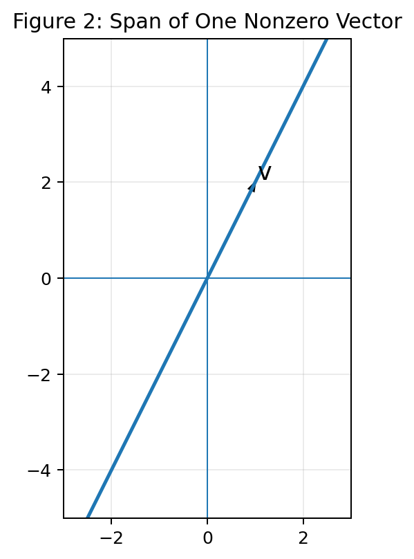
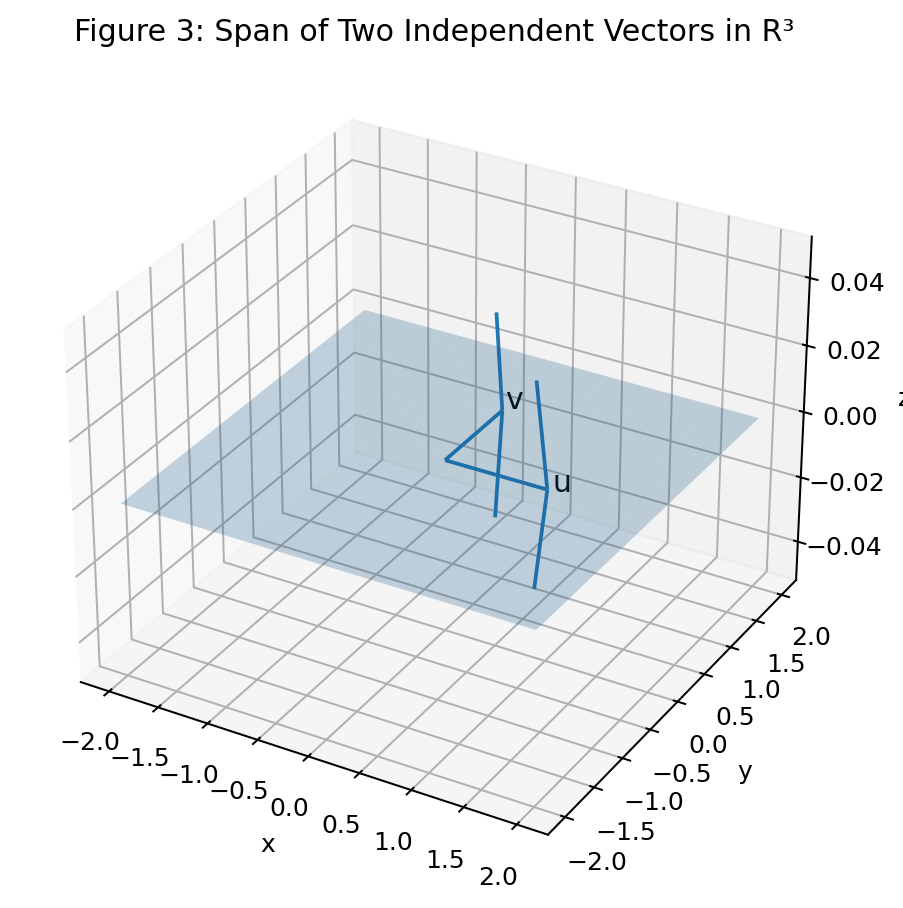
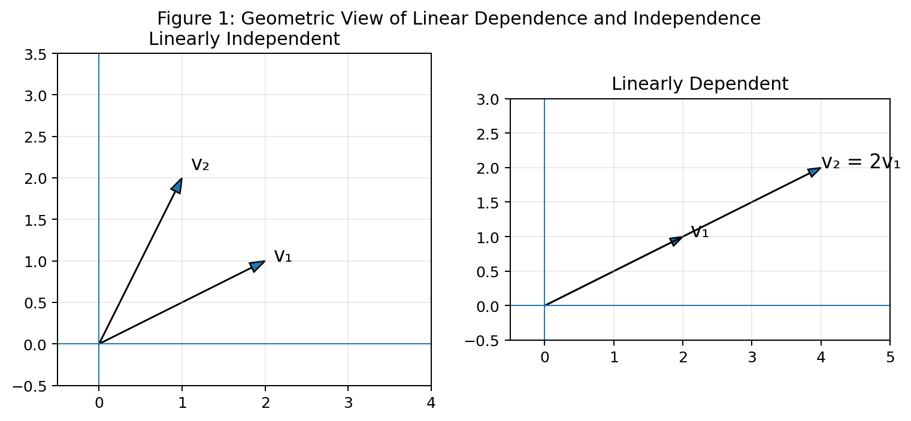
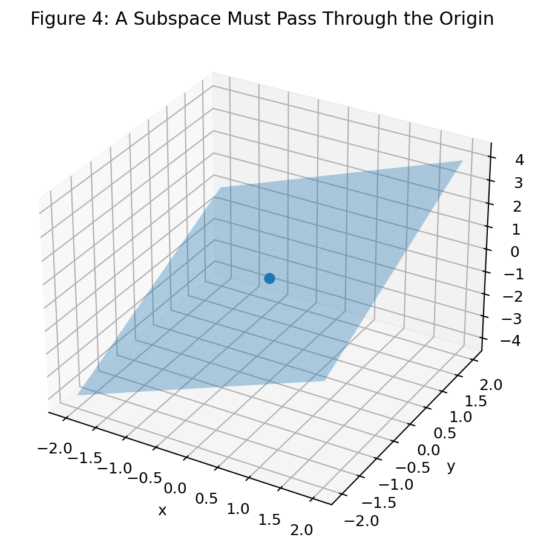
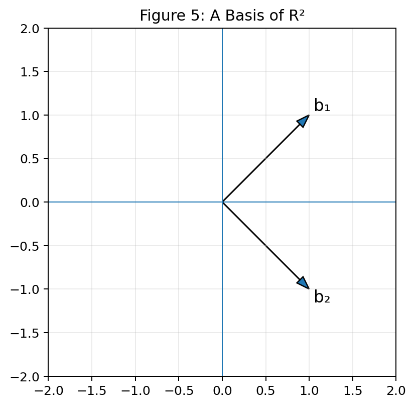
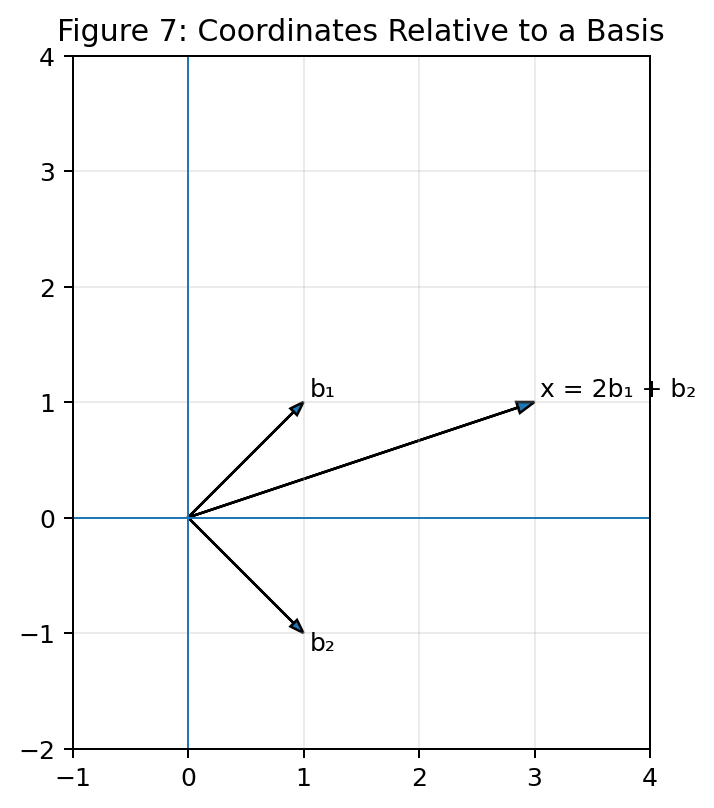
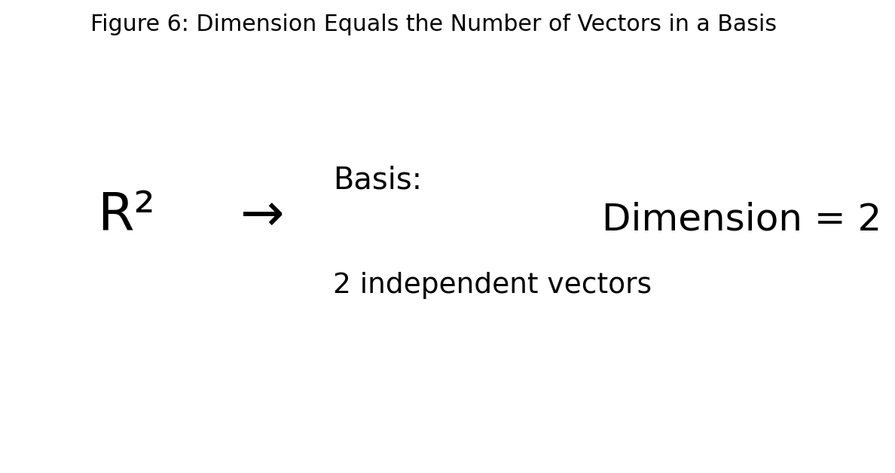

# :classical_building: Mathematics for IT Course - M.Tech. 1st Semester, IIIT Allahabad
## Unit 1: Linear Algebra and Matrix Theory
* ### Current Topic: Linear Dependence and Independence, Vector Spaces, Subspaces, Basis and Dimension
---
## 👥 Instructor Information
* **Edited by Instructor:** [Dr. Mohammed Javed](https://sites.google.com/site/mohammedjaved2016/)
* **Email:** javed@iiita.ac.in
* **Senior Teaching Assistants:** Mr. Apurba Chakraborty (rsi2024005@iiita.ac.in), Ms Aarthi Jha (rsi2025509@iiita.ac.in)
---
## 🎯 1. Learning Objectives

After studying this material, you should be able to:

- Explain linear combinations and spans.
- Distinguish linearly dependent and linearly independent vectors.
- Test linear independence using matrices and Python.
- Understand the definition and examples of vector spaces.
- Identify subspaces and test the subspace conditions.
- Explain basis and determine whether a set is a basis.
- Understand dimension as the number of vectors in a basis.
- Find bases and dimensions using row reduction and rank.
- Represent vectors using coordinates relative to a basis.
- Apply these ideas to data science, machine learning, computer graphics, and other IT applications.

---

# 1. Introduction

Linear algebra studies vectors, matrices, linear equations, and the structures formed from them.

Some of the most important ideas in linear algebra are:

- **linear combination**
- **span**
- **linear dependence**
- **linear independence**
- **vector space**
- **subspace**
- **basis**
- **dimension**

These concepts are closely related.

A useful way to think about them is:

> **Linear combinations generate a space; independence tells us whether vectors are redundant; a basis is a minimal independent generating set; dimension tells us how many basis vectors are needed.**

These concepts are fundamental in:

- machine learning,
- data representation,
- computer graphics,
- image processing,
- statistics,
- signal processing,
- optimization,
- numerical computing.

---

# 2. Vectors

A vector is an ordered list of numbers.

For example,

$$
v=
\begin{bmatrix}
2\\
3
\end{bmatrix}
$$

is a vector in $\mathbb{R}^2$.

Similarly,

$$
w=
\begin{bmatrix}
1\\
4\\
2
\end{bmatrix}
$$

is a vector in $\mathbb{R}^3$.

A vector can be interpreted as:

- a point,
- a direction,
- a displacement,
- a data record,
- a feature vector.

### Python

```python
import numpy as np

v = np.array([2, 3])
w = np.array([1, 4, 2])

print(v)
print(w)
```

---

# 3. Linear Combinations

A **linear combination** of vectors is obtained by multiplying vectors by scalars and adding the results.

For vectors $v_1,v_2,\ldots,v_k$,

$$
c_1v_1+c_2v_2+\cdots+c_kv_k
$$

is a linear combination, where $c_1,c_2,\ldots,c_k$ are scalars.

## Example

Let

$$
v_1=
\begin{bmatrix}
1\\
2
\end{bmatrix},
\qquad
v_2=
\begin{bmatrix}
3\\
1
\end{bmatrix}.
$$

Consider:

$$
2v_1+3v_2.
$$

Then

$$
2
\begin{bmatrix}
1\\
2
\end{bmatrix}
+
3
\begin{bmatrix}
3\\
1
\end{bmatrix}=
\begin{bmatrix}
2\\
4
\end{bmatrix}
+
\begin{bmatrix}
9\\
3
\end{bmatrix}=
\begin{bmatrix}
11\\
7
\end{bmatrix}.
$$

### Python

```python
import numpy as np

v1 = np.array([1, 2])
v2 = np.array([3, 1])

result = 2*v1 + 3*v2

print(result)
```

---

# 4. Span

The **span** of a set of vectors is the collection of all possible linear combinations of those vectors.

For vectors $v_1,v_2,\ldots,v_k$,

$$
\text{span}\{v_1,\ldots,v_k\}=
\left\{
c_1v_1+\cdots+c_kv_k:
c_i\in\mathbb{R}
\right\}.
$$

In simple terms:

> The span is everything that can be reached using linear combinations of the given vectors.

---

## 4.1 Span of One Vector

Let

$$
v=
\begin{bmatrix}
1\\
2
\end{bmatrix}.
$$

Its span is

$$
\text{span}\{v\}=
\left\{
cv:c\in\mathbb{R}
\right\}.
$$

This forms a line through the origin.



---

## 4.2 Span of Two Independent Vectors

In $\mathbb{R}^2$, two linearly independent vectors can span the entire plane.

For example,

$$
e_1=
\begin{bmatrix}
1\\
0
\end{bmatrix},
\qquad
e_2=
\begin{bmatrix}
0\\
1
\end{bmatrix}.
$$

Every vector

$$
\begin{bmatrix}
x\\y
\end{bmatrix}
$$

can be written as

$$
x e_1+y e_2.
$$

Thus,

$$
\text{span}\{e_1,e_2\}=\mathbb{R}^2.
$$

In $\mathbb{R}^3$, two independent vectors span a plane through the origin.



---

# 5. Linear Dependence

A set of vectors

$$
\{v_1,v_2,\ldots,v_k\}
$$

is **linearly dependent** if there exist scalars, not all zero, such that

$$
c_1v_1+c_2v_2+\cdots+c_kv_k=0.
$$

The important phrase is:

> **not all coefficients are zero.**

This means at least one vector can be expressed as a linear combination of the others.

Therefore, a dependent set contains **redundant information**.

---

## Example of Dependence

Let

$$
v_1=
\begin{bmatrix}
1\\
2
\end{bmatrix},
\qquad
v_2=
\begin{bmatrix}
2\\
4
\end{bmatrix}.
$$

Notice:

$$
v_2=2v_1.
$$

Therefore,

$$
2v_1-v_2=0.
$$

The coefficients $2$ and $-1$ are not both zero.

Hence,

$$
\{v_1,v_2\}
$$

is linearly dependent.



---

# 6. Linear Independence

A set of vectors is **linearly independent** if the only solution to

$$
c_1v_1+c_2v_2+\cdots+c_kv_k=0
$$

is

$$
c_1=c_2=\cdots=c_k=0.
$$

In simple terms:

> No vector in the set can be written as a linear combination of the others.

Independent vectors contain no linear redundancy.

---

## Example

Consider

$$
v_1=
\begin{bmatrix}
1\\
0
\end{bmatrix},
\qquad
v_2=
\begin{bmatrix}
0\\
1
\end{bmatrix}.
$$

Suppose

$$
c_1v_1+c_2v_2=0.
$$

Then:

$$
c_1
\begin{bmatrix}
1\\0
\end{bmatrix}
+
c_2
\begin{bmatrix}
0\\1
\end{bmatrix}=
\begin{bmatrix}
0\\0
\end{bmatrix}.
$$

Therefore:

$$
c_1=0,\qquad c_2=0.
$$

So the vectors are linearly independent.

---

# 7. Geometric Interpretation

For vectors in $\mathbb{R}^2$:

- Two vectors pointing in different directions are generally independent.
- Two vectors lying on the same line through the origin are dependent.

For vectors in $\mathbb{R}^3$:

- Three vectors that do not lie in a common plane through the origin can be independent.
- Three vectors lying in a plane can be dependent.
- Two nonzero vectors are dependent if they are scalar multiples of each other.

The geometric view is shown in Figure 1.

---

# 8. Testing Linear Independence Using a Matrix

Put the vectors into the columns of a matrix:

$$
A=
\begin{bmatrix}
|&|& &|\\
v_1&v_2&\cdots&v_k\\
|&|& &|
\end{bmatrix}.
$$

Then test:

$$
Ax=0.
$$

The vectors are linearly independent if and only if the homogeneous system has only the trivial solution:

$$
x=0.
$$

For a square matrix, independence of the columns is equivalent to:

$$
\det(A)\ne0.
$$

For a general matrix, rank is a more useful criterion.

---

# 9. Python Test for Linear Independence

A convenient method is to compare the rank of the matrix with the number of vectors.

```python
import numpy as np

v1 = np.array([1, 2])
v2 = np.array([2, 4])

A = np.column_stack([v1, v2])

rank = np.linalg.matrix_rank(A)

if rank == A.shape[1]:
    print("Vectors are linearly independent.")
else:
    print("Vectors are linearly dependent.")
```

Output:

```text
Vectors are linearly dependent.
```

For independent vectors:

```python
v1 = np.array([1, 0])
v2 = np.array([0, 1])

A = np.column_stack([v1, v2])

print(np.linalg.matrix_rank(A))
```

The rank is 2, which equals the number of vectors.

Therefore they are independent.

---

# 10. A Useful Rank Criterion

Suppose a matrix $A$ has $n$ columns.

Then its columns are linearly independent exactly when:

$$
\text{rank}(A)=n.
$$

If

$$
\text{rank}(A)<n,
$$

the columns are linearly dependent.

### Python function

```python
def is_linearly_independent(vectors):
    A = np.column_stack(vectors)
    return np.linalg.matrix_rank(A) == len(vectors)


v1 = np.array([1, 0])
v2 = np.array([0, 1])

print(is_linearly_independent([v1, v2]))
```

Output:

```text
True
```

---

# 11. Important Facts About Linear Independence

### Fact 1

Any set containing the zero vector is linearly dependent.

Why?

Because:

$$
1(0)=0
$$

uses a nonzero coefficient.

### Fact 2

A set containing more than $n$ vectors in $\mathbb{R}^n$ must be linearly dependent.

For example, four vectors in $\mathbb{R}^3$ cannot all be independent.

### Fact 3

A set of two vectors in $\mathbb{R}^2$ is independent if they are not scalar multiples.

### Fact 4

Removing a vector from an independent set preserves independence.

### Fact 5

Adding a vector to an independent set may make it dependent.

---

# 12. Vector Spaces

A **vector space** is a set of objects called vectors together with operations of:

1. vector addition,
2. scalar multiplication,

that satisfy a collection of algebraic rules.

The most familiar example is:

$$
\mathbb{R}^n.
$$

For example:

$$
\mathbb{R}^2=
\left\{
\begin{bmatrix}
x\\y
\end{bmatrix}
:x,y\in\mathbb{R}
\right\}.
$$

---

# 13. Vector Space Properties

For vectors $u,v,w$ and scalars $a,b$, the operations satisfy properties such as:

### Closure under addition

$$
u+v
$$

must belong to the vector space.

### Closure under scalar multiplication

$$
av
$$

must belong to the vector space.

### Commutativity

$$
u+v=v+u.
$$

### Associativity

$$
(u+v)+w=u+(v+w).
$$

### Zero vector

There is a vector $0$ such that:

$$
v+0=v.
$$

### Additive inverse

For every $v$, there is $-v$ such that:

$$
v+(-v)=0.
$$

### Scalar identity

$$
1v=v.
$$

### Distributive properties

$$
a(u+v)=au+av
$$

and

$$
(a+b)v=av+bv.
$$

---

# 14. Examples of Vector Spaces

Vector spaces include more than ordinary geometric vectors.

## 14.1 $\mathbb{R}^n$

$$
\mathbb{R}^2,\mathbb{R}^3,\ldots
$$

are vector spaces.

## 14.2 Polynomials

The set of polynomials of degree at most 2,

$$
P_2=
\{a+bx+cx^2:a,b,c\in\mathbb{R}\},
$$

is a vector space.

## 14.3 Matrices

The set of all $2\times2$ real matrices is a vector space:

$$
M_{2\times2}(\mathbb{R}).
$$

## 14.4 Functions

Suitable sets of real-valued functions also form vector spaces.

This general viewpoint is important in advanced mathematics, statistics, signal processing, and machine learning.

---

# 15. Subspaces

A **subspace** is a subset of a vector space that is itself a vector space under the same operations.

For example, a line through the origin is a subspace of $\mathbb{R}^2$.

A plane through the origin is a subspace of $\mathbb{R}^3$.



---

# 16. Subspace Test

A nonempty subset $W$ of a vector space $V$ is a subspace if:

### Condition 1: Closed under addition

For every $u,v\in W$,

$$
u+v\in W.
$$

### Condition 2: Closed under scalar multiplication

For every $u\in W$ and scalar $c$,

$$
cu\in W.
$$

A useful combined test is:

For all $u,v\in W$ and scalars $a,b$,

$$
au+bv\in W.
$$

This is called **closure under linear combinations**.

---

# 17. Example of a Subspace

Consider:

$$
W=
\left\{
\begin{bmatrix}
x\\y\\z
\end{bmatrix}
:x+y+z=0
\right\}.
$$

This is a subspace of $\mathbb{R}^3$.

The equation can be written as:

$$
z=-x-y.
$$

Thus,

$$
\begin{bmatrix}
x\\y\\z
\end{bmatrix}=
x
\begin{bmatrix}
1\\0\\-1
\end{bmatrix}
+
y
\begin{bmatrix}
0\\1\\-1
\end{bmatrix}.
$$

Therefore,

$$
W=
\text{span}
\left\{
\begin{bmatrix}
1\\0\\-1
\end{bmatrix},
\begin{bmatrix}
0\\1\\-1
\end{bmatrix}
\right\}.
$$

This immediately shows that $W$ is a subspace.

---

# 18. A Set That Is Not a Subspace

Consider:

$$
S=
\left\{
\begin{bmatrix}
x\\y
\end{bmatrix}
:x+y=1
\right\}.
$$

The zero vector

$$
\begin{bmatrix}
0\\0
\end{bmatrix}
$$

is not in $S$, because:

$$
0+0\ne1.
$$

Therefore $S$ cannot be a subspace.

Geometrically, the line $x+y=1$ does not pass through the origin.

This gives a useful quick test:

> A subspace must always contain the zero vector.

---

# 19. Null Space as a Subspace

For a matrix $A$, the **null space** is:

$$
N(A)=\{x:Ax=0\}.
$$

The null space is always a subspace of the appropriate vector space.

### Python example

```python
import sympy as sp

A = sp.Matrix([
    [1, 2, 3],
    [2, 4, 6]
])

null_space = A.nullspace()

print("Basis vectors for the null space:")
for v in null_space:
    print(v)
```

The output gives basis vectors for the null space.

---

# 20. Column Space

The **column space** of a matrix is the span of its columns.

If

$$
A=
\begin{bmatrix}
1&2\\
2&4\\
3&6
\end{bmatrix},
$$

then:

$$
\text{Col}(A)=
\text{span}
\left\{
\begin{bmatrix}
1\\2\\3
\end{bmatrix},
\begin{bmatrix}
2\\4\\6
\end{bmatrix}
\right\}.
$$

Since the second column is twice the first, the column space has dimension 1.

---

# 21. Row Space

The **row space** of a matrix is the span of its rows.

The row space is also a vector space.

A fundamental result is:

$$
\dim(\text{Row}(A))=
\dim(\text{Col}(A))=
\text{rank}(A).
$$

---

# 22. Basis

A **basis** of a vector space $V$ is a set of vectors that satisfies two conditions:

1. The vectors are **linearly independent**.
2. The vectors **span the entire vector space**.

Thus:

$$
\boxed{\text{Basis}=\text{Spanning}+\text{Linear Independence}}
$$

---

# 23. Standard Basis of R²

The standard basis of $\mathbb{R}^2$ is:

$$
e_1=
\begin{bmatrix}
1\\0
\end{bmatrix},
\qquad
e_2=
\begin{bmatrix}
0\\1
\end{bmatrix}.
$$

Every vector in $\mathbb{R}^2$ can be written as:

$$
\begin{bmatrix}
x\\y
\end{bmatrix}
=
x e_1+y e_2.
$$

Another valid basis is:

$$
b_1=
\begin{bmatrix}
1\\1
\end{bmatrix},
\qquad
b_2=
\begin{bmatrix}
1\\-1
\end{bmatrix}.
$$

These vectors are independent and span $\mathbb{R}^2$.



---

# 24. Basis of R³

The standard basis of $\mathbb{R}^3$ is:

$$
e_1=
\begin{bmatrix}
1\\0\\0
\end{bmatrix},
\quad
e_2=
\begin{bmatrix}
0\\1\\0
\end{bmatrix},
\quad
e_3=
\begin{bmatrix}
0\\0\\1
\end{bmatrix}.
$$

Every vector

$$
v=
\begin{bmatrix}
x\\y\\z
\end{bmatrix}
$$

can be represented as:

$$
v=xe_1+ye_2+ze_3.
$$

---

# 25. Coordinates Relative to a Basis

A basis allows us to describe vectors using coordinates relative to that basis.

Suppose:

$$
b_1=
\begin{bmatrix}
1\\1
\end{bmatrix},
\qquad
b_2=
\begin{bmatrix}
1\\-1
\end{bmatrix}.
$$

Let:

$$
v=
\begin{bmatrix}
3\\1
\end{bmatrix}.
$$

We want:

$$
v=c_1b_1+c_2b_2.
$$

Therefore:

$$
\begin{bmatrix}
3\\1
\end{bmatrix}=
c_1
\begin{bmatrix}
1\\1
\end{bmatrix}
+
c_2
\begin{bmatrix}
1\\-1
\end{bmatrix}.
$$

This gives:

$$
c_1+c_2=3,
$$

$$
c_1-c_2=1.
$$

Solving:

$$
c_1=2,\qquad c_2=1.
$$

Hence:

$$
[v]_B=
\begin{bmatrix}
2\\1
\end{bmatrix}.
$$



---

# 26. Python: Coordinates Relative to a Basis

```python
import numpy as np

B = np.array([
    [1, 1],
    [1, -1]
], dtype=float)

v = np.array([3, 1], dtype=float)

coordinates = np.linalg.solve(B, v)

print("Coordinates relative to the basis:")
print(coordinates)

print("Verification:")
print(B @ coordinates)
```

Output:

```text
[2. 1.]
```

---

# 27. Dimension

The **dimension** of a vector space is the number of vectors in any basis of that space.

Examples:

$$
\dim(\mathbb{R}^2)=2
$$

and

$$
\dim(\mathbb{R}^3)=3.
$$

A plane through the origin in $\mathbb{R}^3$ has dimension 2.

A line through the origin has dimension 1.

The zero vector space has dimension 0.



---

# 28. Why Every Basis Has the Same Number of Vectors

One of the fundamental results of linear algebra is:

> Every basis of a finite-dimensional vector space contains the same number of vectors.

Therefore, dimension is well-defined.

For example, $\mathbb{R}^2$ has many possible bases, but every basis contains exactly two vectors.

---

# 29. Rank and Dimension

For a matrix $A$:

$$
\text{rank}(A)=
\dim(\text{Col}(A)).
$$

The rank is also the dimension of the row space:

$$
\text{rank}(A)=
\dim(\text{Row}(A)).
$$

Thus, rank tells us how many independent directions are present in the matrix.

### Python

```python
import numpy as np

A = np.array([
    [1, 2, 3],
    [2, 4, 6],
    [1, 1, 2]
])

rank = np.linalg.matrix_rank(A)

print("Rank =", rank)
```

---

# 30. Finding a Basis from a Set of Vectors

Suppose:

$$
v_1=
\begin{bmatrix}
1\\2\\3
\end{bmatrix},
\quad
v_2=
\begin{bmatrix}
2\\4\\6
\end{bmatrix},
\quad
v_3=
\begin{bmatrix}
1\\0\\1
\end{bmatrix}.
$$

Since

$$
v_2=2v_1,
$$

$v_2$ is redundant.

A basis for the span can be formed using:

$$
\{v_1,v_3\}.
$$

---

# 31. Python: Extracting Independent Columns

A practical method is to use the pivot columns of the row-reduced matrix.

With SymPy:

```python
import sympy as sp

A = sp.Matrix([
    [1, 2, 1],
    [2, 4, 0],
    [3, 6, 1]
])

rref_matrix, pivot_columns = A.rref()

print("RREF:")
print(rref_matrix)

print("Pivot columns:")
print(pivot_columns)

basis = [A[:, i] for i in pivot_columns]

print("Basis vectors:")
for v in basis:
    print(v)
```

The original columns corresponding to pivot positions form a basis for the column space.

---

# 32. Basis for the Column Space with NumPy

For larger numerical problems, NumPy can be combined with QR decomposition.

```python
import numpy as np

A = np.array([
    [1., 2., 1.],
    [2., 4., 0.],
    [3., 6., 1.]
])

Q, R = np.linalg.qr(A)

rank = np.linalg.matrix_rank(A)

print("Rank:", rank)
print("Independent directions can be represented by the first",
      rank, "columns of Q.")
```

For exact symbolic pivot-column extraction, SymPy is often more convenient.

---

# 33. Basis of a Null Space with SymPy

```python
import sympy as sp

A = sp.Matrix([
    [1, 2, 3],
    [2, 4, 6]
])

basis_null = A.nullspace()

print("Null-space basis:")

for v in basis_null:
    print(v)
```

The vectors returned by `nullspace()` form a basis of $N(A)$.

---

# 34. Rank-Nullity Theorem

For an $m\times n$ matrix $A$:

$$
\boxed{
\text{rank}(A)+\text{nullity}(A)=n
}
$$

where:

- rank = dimension of the column space,
- nullity = dimension of the null space,
- $n$ = number of columns.

### Example

If $A$ has 5 columns and rank 3, then:

$$
3+\text{nullity}(A)=5.
$$

Therefore:

$$
\text{nullity}(A)=2.
$$

---

# 35. Complete Python Demonstration

The following program demonstrates dependence, rank, basis-related ideas, and null space.

```python
import numpy as np
import sympy as sp

# ------------------------------------
# 1. Linear dependence
# ------------------------------------

v1 = np.array([1, 2])
v2 = np.array([2, 4])

A = np.column_stack([v1, v2])

print("Matrix of vectors:")
print(A)

print("Rank:", np.linalg.matrix_rank(A))

if np.linalg.matrix_rank(A) == A.shape[1]:
    print("Independent")
else:
    print("Dependent")


# ------------------------------------
# 2. Independent vectors
# ------------------------------------

u1 = np.array([1, 0])
u2 = np.array([0, 1])

B = np.column_stack([u1, u2])

print("\nIndependent set:")
print(B)

print("Rank:", np.linalg.matrix_rank(B))


# ------------------------------------
# 3. Vector-space coordinates
# ------------------------------------

basis = np.array([
    [1, 1],
    [1, -1]
], dtype=float)

v = np.array([3, 1], dtype=float)

coordinates = np.linalg.solve(basis, v)

print("\nCoordinates of v relative to basis:")
print(coordinates)


# ------------------------------------
# 4. Null space
# ------------------------------------

S = sp.Matrix([
    [1, 2, 3],
    [2, 4, 6]
])

print("\nNull-space basis:")

for vector in S.nullspace():
    print(vector)
```

---

# 36. Applications in IT and Data Science

## 36.1 Feature Redundancy

Suppose a dataset has features:

- height in centimeters,
- height in meters.

These features contain essentially the same information.

For example:

$$
\text{height}_{cm}=100\text{height}_{m}.
$$

The corresponding feature vectors are linearly dependent.

Detecting dependence can help identify redundant features.

---

## 36.2 Dimensionality Reduction

High-dimensional datasets may contain many redundant directions.

Basis and dimension concepts help us understand techniques such as:

- Principal Component Analysis (PCA),
- low-rank approximation,
- feature selection,
- dimensionality reduction.

---

## 36.3 Machine Learning

A dataset can be represented by:

$$
X\in\mathbb{R}^{m\times n}.
$$

If some columns of $X$ are linearly dependent, the features contain redundancy.

This can cause problems in some models, including the standard inverse-based expression in linear regression:

$$
(X^TX)^{-1}X^Ty.
$$

If $X^TX$ is singular, the ordinary inverse does not exist.

This is one reason regularization and pseudoinverse-based methods are important.

---

## 36.4 Computer Graphics

Vectors represent:

- points,
- directions,
- surface normals,
- transformations.

A basis defines a coordinate system.

Changing the basis allows a computer graphics program to represent an object relative to:

- world coordinates,
- camera coordinates,
- object coordinates.

---

## 36.5 Image Processing

An image can be interpreted as a collection of vectors.

A grayscale image with dimensions $m\times n$ can be represented as a vector in:

$$
\mathbb{R}^{mn}.
$$

Basis concepts help explain image compression and dimensionality reduction.

---

## 36.6 Signal Processing

Signals can be represented using basis functions.

For example, Fourier analysis represents signals using sinusoidal basis functions.

The general idea is:

$$
x=c_1b_1+c_2b_2+\cdots+c_kb_k.
$$

The coefficients tell us how much of each basis component is present.

---

# 37. Relationship Between the Main Concepts

These concepts form a logical chain:

$$
\boxed{\text{Linear Combination}}
$$

↓

$$
\boxed{\text{Span}}
$$

↓

$$
\boxed{\text{Linear Independence}}
$$

↓

$$
\boxed{\text{Basis}}
$$

↓

$$
\boxed{\text{Dimension}}
$$

A basis is a set that:

- spans the space,
- contains no redundant vectors.

The dimension is the number of vectors in the basis.

---

# 38. Comparison Table

| Concept | Meaning |
|---|---|
| Linear combination | Weighted sum of vectors |
| Span | All linear combinations of a set |
| Linearly dependent | At least one vector is redundant |
| Linearly independent | No vector is redundant |
| Vector space | Set closed under vector addition and scalar multiplication |
| Subspace | A subset that is itself a vector space |
| Basis | Independent set that spans a vector space |
| Dimension | Number of vectors in a basis |
| Rank | Dimension of the column/row space |
| Nullity | Dimension of the null space |

---

# 39. Common Mistakes

### Mistake 1: Thinking any spanning set is a basis

A basis must both:

1. span the space, and
2. be linearly independent.

### Mistake 2: Thinking every set of vectors is independent

Vectors may contain redundant information.

### Mistake 3: Forgetting the zero vector

Any set containing the zero vector is dependent.

### Mistake 4: Confusing a plane with a subspace

A plane in $\mathbb{R}^3$ is a subspace only if it passes through the origin.

### Mistake 5: Assuming dimension depends on the chosen basis

Different bases can contain different vectors, but they always contain the same number of vectors.

### Mistake 6: Using only determinant for rectangular matrices

The determinant applies only to square matrices.

For rectangular matrices, rank is a more general tool.

---

# 40. Practice Questions

## Conceptual Questions

1. Define a linear combination.
2. What is the span of a set of vectors?
3. Define linear dependence.
4. Define linear independence.
5. Why is a set containing the zero vector dependent?
6. What is a vector space?
7. What is a subspace?
8. State the subspace test.
9. What is a basis?
10. Define dimension.
11. Explain the relationship between rank and dimension.
12. State the rank-nullity theorem.

## Numerical Questions

1. Determine whether

$$
\begin{bmatrix}1\\2\end{bmatrix},
\begin{bmatrix}2\\4\end{bmatrix}
$$

are linearly independent.

2. Determine whether

$$
\begin{bmatrix}1\\0\end{bmatrix},
\begin{bmatrix}0\\1\end{bmatrix}
$$

form a basis of $\mathbb{R}^2$.

3. Find a basis for:

$$
W=\left\{
(x,y,z):x+y+z=0
\right\}.
$$

4. Determine the dimension of:

$$
\text{span}
\left\{
\begin{bmatrix}1\\2\\3\end{bmatrix},
\begin{bmatrix}2\\4\\6\end{bmatrix},
\begin{bmatrix}1\\0\\1\end{bmatrix}
\right\}.
$$

5. If a matrix has 7 columns and rank 4, find its nullity.

## Programming Questions

1. Write a Python function to test linear independence.
2. Calculate the rank of a matrix using NumPy.
3. Find the null space using SymPy.
4. Find pivot columns using row reduction.
5. Find coordinates of a vector relative to a given basis.
6. Construct a basis for the column space.
7. Verify the rank-nullity theorem for a matrix.
8. Create a visualization showing dependent and independent vectors.

---

# 41. Key Takeaways

- A **linear combination** is a weighted sum of vectors.
- The **span** is the set of all possible linear combinations.
- A set is **linearly independent** when the zero-vector equation has only the trivial solution.
- A set is **linearly dependent** when a nontrivial linear combination produces the zero vector.
- A **vector space** is a set closed under vector addition and scalar multiplication and satisfying the vector-space axioms.
- A **subspace** is a subset that is itself a vector space.
- A **basis** is a linearly independent spanning set.
- The **dimension** is the number of vectors in a basis.
- **Rank** measures the number of independent directions represented by a matrix.
- **Nullity** is the dimension of the null space.
- The **rank-nullity theorem** is:

$$
\text{rank}(A)+\text{nullity}(A)=n.
$$

- In Python, `numpy.linalg.matrix_rank()` is useful for numerical independence and rank tests.
- SymPy is useful for exact symbolic computations such as null spaces and row reduction.
- These concepts provide the mathematical foundation for dimensionality reduction, feature analysis, coordinate systems, machine learning, image processing, and signal processing.

---

---
## ❓: CHALLENGING Questions - Check Your Understanding 
* ➡️ **[Q-01]**
* ➡️ 

---
## 📚 References 
* **[R-01]** Linear Algebra by Gilbert Strang, MIT Press
* **[R-02]** ChatGPT - for examples and codes
