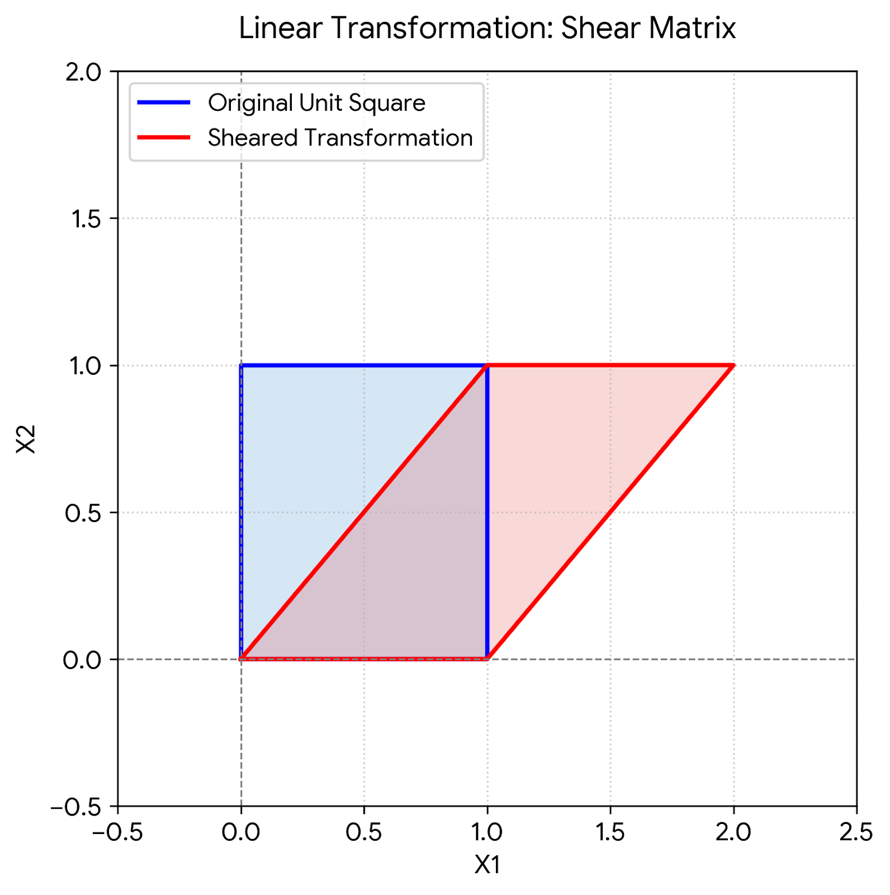
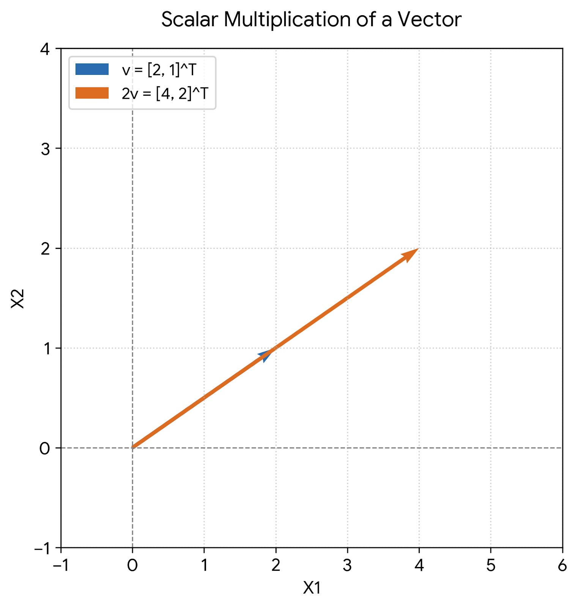
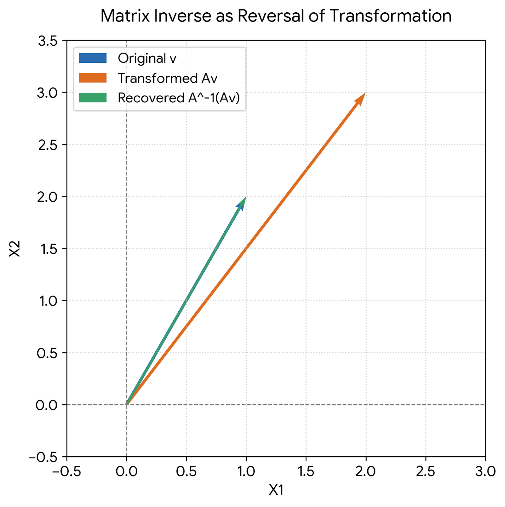

# :classical_building: Mathematics for IT Course - M.Tech. 1st Semester, IIIT Allahabad
## Unit 1: Linear Algebra and Matrix Theory
### Current Topic: Matrix Operations and Matrix Inverses
---
## 👥 Instructor Information
* **Edited by Instructor:** [Dr. Mohammed Javed](https://sites.google.com/site/mohammedjaved2016/)
* **Email:** javed@iiita.ac.in
* **Senior Teaching Assistants:** Mr. Apurba Chakraborty (rsi2024005@iiita.ac.in), Ms Aarthi Jha (rsi2025509@iiita.ac.in)
---
## 🎯 Learning Objectives


--
## 1. Introduction to Matrices
A **matrix** is a rectangular array or table of numbers, symbols, or expressions arranged in rows and columns. Matrices are fundamental tools in linear algebra, widely used in computer graphics, machine learning, physics simulations, and optimization problems.

An $m \times n$ matrix $A$ has $m$ rows and $n$ columns:
$$
A = \begin{bmatrix} 
a_{11} & a_{12} & \cdots & a_{1n} \\
a_{21} & a_{22} & \cdots & a_{2n} \\
\vdots & \vdots & \ddots & \vdots \\
a_{m1} & a_{m2} & \cdots & a_{mn} 
\end{bmatrix}
$$

---

## 2. Core Matrix Operations

### 2.1 Matrix Addition and Subtraction
Two matrices of the **same dimensions** can be added or subtracted element-by-element. If $A$ and $B$ are both $m \times n$ matrices:
$$
C = A + B \implies c_{ij} = a_{ij} + b_{ij}
$$

### 2.2 Scalar Multiplication
Multiplying a matrix by a scalar $c$ scales every individual element of the matrix:
$$
D = cA \implies d_{ij} = c \cdot a_{ij}
$$


*Figure 1: Scalar multiplication scales the length of a vector while preserving its directional axis.*

### 2.3 Matrix Multiplication (Dot Product)
To multiply an $m \times n$ matrix $A$ by an $n \times p$ matrix $B$, the inner dimensions must match ($n$). The resulting matrix $C = AB$ has dimensions $m \times p$, where each element is computed as the dot product of row $i$ of $A$ and column $j$ of $B$:
$$
c_{ij} = \sum_{k=1}^{n} a_{ik} b_{kj}
$$

> **Important Note:** Matrix multiplication is **not commutative** (i.e., $AB \neq BA$ in general).


*Figure 2: Geometric interpretation of matrix multiplication as a linear transformation (Shear mapping).*

---

## 3. Matrix Inverses

### 3.1 Definition of the Inverse
For a square matrix $A$ of size $n \times n$, its **matrix inverse** (denoted as $A^{-1}$) is a matrix such that:
$$
A A^{-1} = A^{-1} A = I_n
$$
where $I_n$ is the $n \times n$ **identity matrix** (a diagonal matrix with ones on the main diagonal and zeros elsewhere).

### 3.2 Conditions for Invertibility
- A matrix must be **square** ($m = n$) to have an inverse.
- A matrix is **invertible** (or **nonsingular**) if and only if its **determinant is non-zero** ($\det(A) \neq 0$).
- If $\det(A) = 0$, the matrix is **singular** (non-invertible), meaning it collapses dimensional space (e.g., mapping a 2D plane onto a 1D line).


*Figure 3: Matrix inverse reversing a linear transformation to restore the original vector.*

---

## 4. Python Implementation

Below is a complete, executable Python script using `numpy` demonstrating matrix operations, multiplications, determinants, and matrix inversion.

```python
import numpy as np

# 1. Defining Matrices
A = np.array([[2, 1], 
              [1, 3]])

B = np.array([[1, 2], 
              [3, 4]])

print("Matrix A:\n", A)
print("Matrix B:\n", B)

# 2. Matrix Addition
add_result = A + B
print("\nAddition (A + B):\n", add_result)

# 3. Scalar Multiplication
scalar_result = 3 * A
print("\nScalar Multiplication (3 * A):\n", scalar_result)

# 4. Matrix Multiplication
matmul_result = np.dot(A, B)  # or A @ B
print("\nMatrix Multiplication (A @ B):\n", matmul_result)

# 5. Determinant and Matrix Inverse
det_A = np.linalg.det(A)
print(f"\nDeterminant of A: {{det_A:.4f}}")

if det_A != 0:
    A_inv = np.linalg.inv(A)
    print("Inverse of A (A^-1):\n", A_inv)
    
    # Verification: A @ A_inv should yield Identity matrix
    identity_check = A @ A_inv
    print("\nVerification (A @ A_inv ≈ I):\n", np.round(identity_check))
else:
    print("Matrix A is singular and cannot be inverted.")
```

---

## ❓: CHALLENGING Questions - Check Your Understanding 
* ➡️ **[Q-01]**
* ➡️ 

---
## 📚 References 
* **[R-01]** Linear Algebra by Gilbert Strang, MIT Press
* **[R-02]** ChatGPT - for examples and codes
