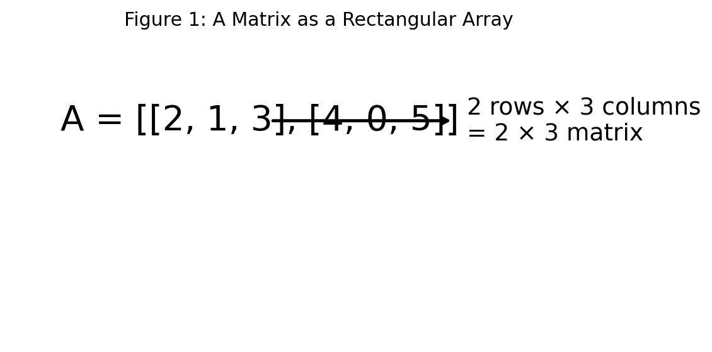
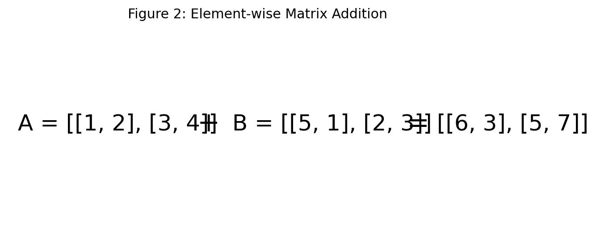
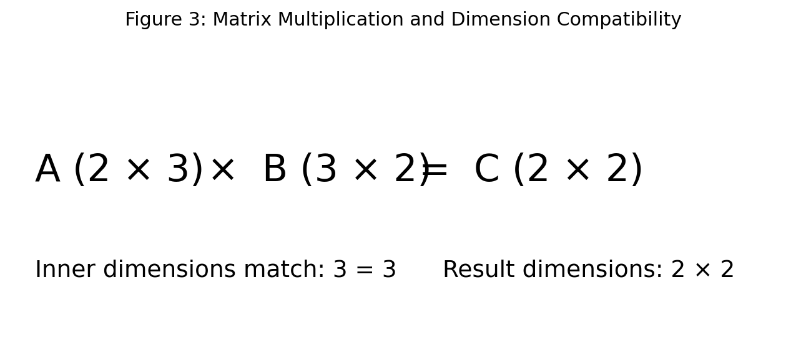
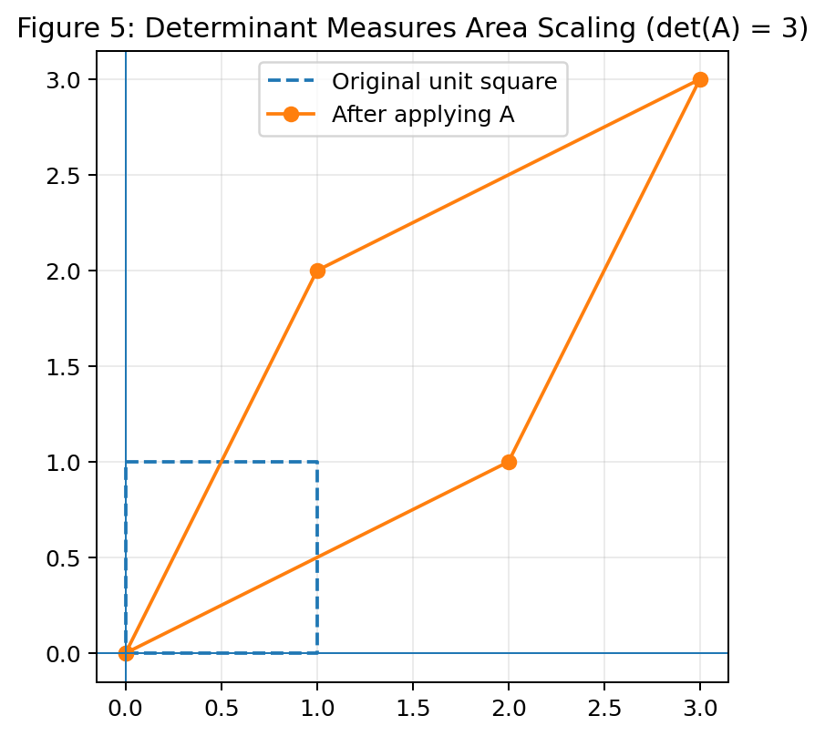
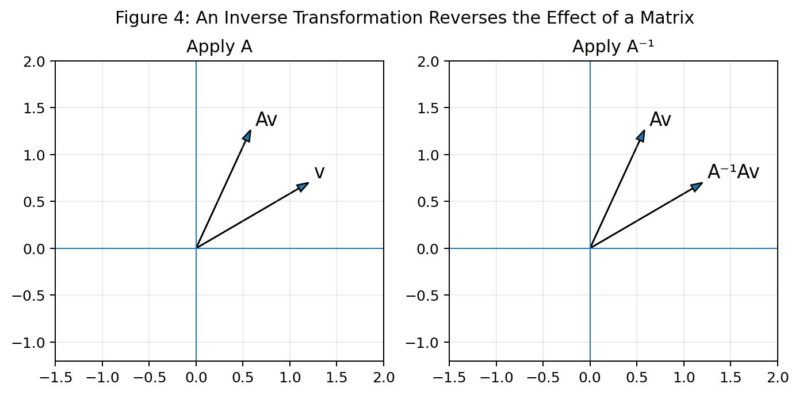
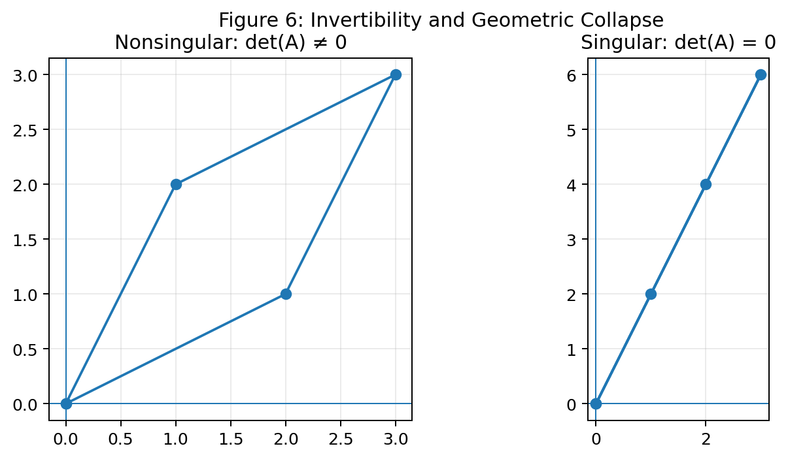

# :classical_building: Mathematics for IT Course - M.Tech. 1st Semester, IIIT Allahabad
## Unit 1: Linear Algebra and Matrix Theory
* ### Current Topic: Matrix Operations and Matrix Inverses - Types, graphical interpretation, solved examples, and Python implementation
---
## 👥 Instructor Information
* **Edited by Instructor:** [Dr. Mohammed Javed](https://sites.google.com/site/mohammedjaved2016/)
* **Email:** javed@iiita.ac.in
* **Senior Teaching Assistants:** Mr. Apurba Chakraborty (rsi2024005@iiita.ac.in), Ms Aarthi Jha (rsi2025509@iiita.ac.in)
---
## 🎯 1. Learning Objectives

After studying this material, you should be able to:

- Explain matrices and their dimensions.
- Perform matrix addition, subtraction, and scalar multiplication.
- Understand matrix multiplication and its dimension rule.
- Compute transpose, trace, and determinant.
- Explain the identity matrix.
- Understand what a matrix inverse means.
- Determine whether a square matrix is invertible.
- Compute a matrix inverse using Python.
- Use matrix inverses to solve systems of linear equations.
- Connect matrix operations and inverses with applications in IT, data science, and machine learning.

---

## 1. Introduction

A **matrix** is a rectangular arrangement of numbers organized into rows and columns.

For example,

$$
A =
\begin{bmatrix}
2 & 1 & 3\\
4 & 0 & 5
\end{bmatrix}
$$

has **2 rows** and **3 columns**, so its dimension is $2\times3$.

The individual numbers are called **entries** or **elements** of the matrix.

<!--  -->

Matrices are important in IT because they provide compact representations of:

- images and pixels,
- datasets,
- computer graphics transformations,
- systems of equations,
- network connections,
- machine-learning parameters,
- recommendation-system data.

---

# 2. Types of Matrices

### Row Matrix

A matrix containing one row:

$$
A=\begin{bmatrix}2&4&6&8\end{bmatrix}
$$

### Column Matrix

A matrix containing one column:

$$
B=\begin{bmatrix}2\\
4\\
6\end{bmatrix}
$$

### Square Matrix

A matrix with equal numbers of rows and columns:

$$
A=\begin{bmatrix}2&1\\ 
3&4\end{bmatrix}
$$

### Zero Matrix

All elements are zero:

$$
O=\begin{bmatrix}0&0\\ 
0&0\end{bmatrix}
$$

### Identity Matrix

An identity matrix contains 1s on the main diagonal and 0s elsewhere:

$$
I_3=
\begin{bmatrix}
1&0&0\\
0&1&0\\
0&0&1
\end{bmatrix}
$$

For a compatible matrix $A$,

$$
AI=IA=A.
$$

---

# 3. Matrix Addition

Two matrices can be added only when they have the **same dimensions**.

Let

$$
A=\begin{bmatrix}1&2\\
3&4\end{bmatrix},
\qquad
$$

$$
B=\begin{bmatrix}5&1\\
2&3\end{bmatrix}.
$$

Then

$$
A+B=\begin{bmatrix}
1+5&2+1\\
3+2&4+3
\end{bmatrix}=
\begin{bmatrix}
6&3\\
5&7
\end{bmatrix}.
$$

<!--  -->

### Python

```python
import numpy as np

A = np.array([[1, 2], [3, 4]])
B = np.array([[5, 1], [2, 3]])

print(A + B)
```

---

# 4. Matrix Subtraction

Matrix subtraction is also element-wise:

$$
A-B=
\begin{bmatrix}
1-5&2-1\\
3-2&4-3
\end{bmatrix}=
\begin{bmatrix}
-4&1\\
1&1
\end{bmatrix}.
$$

```python
print(A - B)
```

---

# 5. Scalar Multiplication

A scalar multiplies every element:

$$
3
\begin{bmatrix}
1&2\\3&4
\end{bmatrix}=
\begin{bmatrix}
3&6\\9&12
\end{bmatrix}.
$$

```python
print(3 * A)
```

---

# 6. Matrix Multiplication

For

$$
A_{m\times n}B_{p\times q},
$$

the product exists only when

$$
n=p.
$$

The result has dimensions

$$
m\times q.
$$

Thus,

$$
(2\times3)(3\times2)=(2\times2).
$$



For

$$
A=
\begin{bmatrix}
1&2&3\\
4&5&6
\end{bmatrix},
\quad
B=
\begin{bmatrix}
1&2\\
0&1\\
1&0
\end{bmatrix},
$$

we get

$$
AB=
\begin{bmatrix}
4&4\\
10&13
\end{bmatrix}.
$$

### Python

```python
A = np.array([[1, 2, 3], [4, 5, 6]])
B = np.array([[1, 2], [0, 1], [1, 0]])

C = A @ B
print(C)
```

Matrix multiplication is generally **not commutative**:

$$
AB\ne BA.
$$

But it is associative:

$$
(AB)C=A(BC),
$$

and distributive:

$$
A(B+C)=AB+AC.
$$

---

# 7. Element-wise vs Matrix Multiplication

In NumPy:

```python
A * B
```

means element-wise multiplication, while

```python
A @ B
```

means matrix multiplication.

For example:

```python
A = np.array([[1, 2], [3, 4]])
B = np.array([[5, 6], [7, 8]])

print(A * B)
print(A @ B)
```

The first produces:

```text
[[ 5 12]
 [21 32]]
```

while the second produces:

```text
[[19 22]
 [43 50]]
```

---

# 8. Transpose

The transpose exchanges rows and columns.

If

$$
A=
\begin{bmatrix}
1&2&3\\
4&5&6
\end{bmatrix},
$$

then

$$
A^T=
\begin{bmatrix}
1&4\\
2&5\\
3&6
\end{bmatrix}.
$$

```python
A = np.array([[1, 2, 3], [4, 5, 6]])
print(A.T)
```

Important property:

$$
(AB)^T=B^TA^T.
$$

---

# 9. Trace

For a square matrix, the **trace** is the sum of the main diagonal.

$$
\mathrm{tr}
\begin{bmatrix}
2&1&3\\
4&5&6\\
7&8&9
\end{bmatrix}
=2+5+9=16.
$$

```python
A = np.array([[2,1,3], [4,5,6], [7,8,9]])
print(np.trace(A))
```

---

# 10. Determinant

For

$$
A=
\begin{bmatrix}
a&b\\
c&d
\end{bmatrix},
$$

the determinant is

$$
\det(A)=ad-bc.
$$

For

$$
A=
\begin{bmatrix}
2&1\\
3&4
\end{bmatrix},
$$

$$
\det(A)=2(4)-1(3)=5.
$$

```python
A = np.array([[2, 1], [3, 4]], dtype=float)
print(np.linalg.det(A))
```

A square matrix is invertible exactly when:

$$
\boxed{\det(A)\ne0}.
$$

If

$$
\det(A)=0,
$$

the matrix is singular and has no inverse.

The determinant also measures signed area/volume scaling.



---

# 11. Matrix Inverse

The inverse of a square matrix $A$ is written as $A^{-1}$ and satisfies

$$
AA^{-1}=A^{-1}A=I.
$$

It is analogous to the reciprocal of a nonzero number:

$$
5\cdot\frac15=1.
$$

For matrices, the inverse effectively **undoes** the transformation represented by $A$.



---

# 12. When Does an Inverse Exist?

A square matrix $A$ is invertible if and only if

$$
\det(A)\ne0.
$$

For example,

$$
A=
\begin{bmatrix}
2&1\\3&4
\end{bmatrix}
$$

has determinant 5, so it is invertible.

But

$$
B=
\begin{bmatrix}
1&2\\2&4
\end{bmatrix}
$$

has determinant 0, so it has no inverse.



---

# 13. Inverse of a 2 × 2 Matrix

For

$$
A=
\begin{bmatrix}
a&b\\c&d
\end{bmatrix},
$$

if $ad-bc\ne0$,

$$
A^{-1}
=
\frac{1}{ad-bc}
\begin{bmatrix}
d&-b\\-c&a
\end{bmatrix}.
$$

Example:

$$
A=
\begin{bmatrix}
2&1\\3&4
\end{bmatrix}.
$$

Since $\det(A)=5$,

$$
A^{-1}
=
\frac15
\begin{bmatrix}
4&-1\\-3&2
\end{bmatrix}=
\begin{bmatrix}
0.8&-0.2\\-0.6&0.4
\end{bmatrix}.
$$

---

# 14. Computing the Inverse with NumPy

```python
import numpy as np

A = np.array([[2, 1], [3, 4]], dtype=float)

A_inv = np.linalg.inv(A)

print("A inverse:")
print(A_inv)

print("\nA @ A_inv:")
print(A @ A_inv)
```

The result should be approximately:

```text
[[1. 0.]
 [0. 1.]]
```

Very small values near zero can appear because of floating-point arithmetic.

---

# 15. Checking Invertibility in Python

```python
det_A = np.linalg.det(A)

if abs(det_A) > 1e-10:
    print("Matrix is invertible.")
else:
    print("Matrix is singular.")
```

A tolerance such as `1e-10` is useful because floating-point calculations are approximate.

---

# 16. Solving Linear Systems

A system can be represented as:

$$
Ax=b.
$$

If $A$ is invertible:

$$
x=A^{-1}b.
$$

For example,

$$
2x+y=5,
\qquad
x+3y=6.
$$

Write:

$$
A=
\begin{bmatrix}
2&1\\1&3
\end{bmatrix},
\quad
b=
\begin{bmatrix}
5\\6
\end{bmatrix}.
$$

### Preferred Python approach

```python
import numpy as np

A = np.array([[2, 1], [1, 3]], dtype=float)
b = np.array([5, 6], dtype=float)

x = np.linalg.solve(A, b)

print(x)
```

Output:

```text
[1.8 1.4]
```

Thus,

$$
x=1.8,\qquad y=1.4.
$$

Although the mathematical expression is $x=A^{-1}b$, in practical numerical computing it is generally better to use `np.linalg.solve()` rather than explicitly calculating the inverse.

---

# 17. Gauss-Jordan Method for Finding an Inverse

Start with the augmented matrix:

$$
[A\mid I].
$$

Use elementary row operations until:

$$
[A\mid I]\longrightarrow[I\mid A^{-1}].
$$

For example:

$$
\left[
\begin{array}{cc|cc}
2&1&1&0\\
3&4&0&1
\end{array}
\right]
\longrightarrow
\left[
\begin{array}{cc|cc}
1&0&0.8&-0.2\\
0&1&-0.6&0.4
\end{array}
\right].
$$

Therefore,

$$
A^{-1}=
\begin{bmatrix}
0.8&-0.2\\
-0.6&0.4
\end{bmatrix}.
$$

### Python implementation

```python
import numpy as np

def inverse_gauss_jordan(A):
    A = np.array(A, dtype=float)

    if A.ndim != 2 or A.shape[0] != A.shape[1]:
        raise ValueError("Matrix must be square.")

    n = A.shape[0]
    augmented = np.hstack((A, np.eye(n)))

    for col in range(n):
        pivot_row = col + np.argmax(
            np.abs(augmented[col:, col])
        )

        if abs(augmented[pivot_row, col]) < 1e-12:
            raise np.linalg.LinAlgError(
                "Matrix is singular and has no inverse."
            )

        augmented[[col, pivot_row]] = augmented[[pivot_row, col]]

        augmented[col] /= augmented[col, col]

        for row in range(n):
            if row != col:
                factor = augmented[row, col]
                augmented[row] -= factor * augmented[col]

    return augmented[:, n:]


A = np.array([[2, 1], [3, 4]], dtype=float)

A_inv = inverse_gauss_jordan(A)

print(A_inv)
print(A @ A_inv)
```

This is particularly useful for understanding the algorithm rather than relying only on a library function.

---

# 18. Important Properties of Inverses

If $A$ and $B$ are invertible:

### Inverse of an inverse

$$
(A^{-1})^{-1}=A.
$$

### Inverse of a product

$$
(AB)^{-1}=B^{-1}A^{-1}.
$$

The order is reversed.

### Inverse of a transpose

$$
(A^T)^{-1}=(A^{-1})^T.
$$

### Identity matrix

$$
I^{-1}=I.
$$

### Determinant

$$
\det(A^{-1})=\frac{1}{\det(A)}.
$$

---

# 19. Applications in IT

## Computer Graphics

Matrices can represent:

- scaling,
- rotation,
- reflection,
- shearing,
- coordinate transformations.

A transformation can be represented by

$$
v'=Av.
$$

A sequence of transformations can be combined using matrix multiplication.

## Image Processing

A grayscale image can be represented as a matrix:

$$
I=
\begin{bmatrix}
0&50&100\\
100&150&200\\
200&225&255
\end{bmatrix}.
$$

The entries represent pixel intensities.

Matrix operations are used for filtering, transformations, enhancement, and feature extraction.

## Machine Learning

A dataset can be represented as

$$
X\in\mathbb{R}^{m\times n}.
$$

A simple linear model can be expressed as

$$
Y=XW+b.
$$

Example:

```python
import numpy as np

X = np.array([
    [1, 2, 3],
    [2, 4, 1],
    [3, 1, 2],
    [4, 3, 5]
], dtype=float)

W = np.array([
    [0.5],
    [1.0],
    [-0.5]
])

b = 2

Y = X @ W + b
print(Y)
```

Matrix multiplication allows many observations to be processed efficiently.

## Network Analysis

An adjacency matrix can represent connections among nodes in a graph.

$$
A_{ij}=
\begin{cases}
1,&\text{if node }i\text{ is connected to node }j,\\
0,&\text{otherwise}.
\end{cases}
$$

---

# 20. Complete Python Demonstration

```python
import numpy as np

A = np.array([[2, 1], [3, 4]], dtype=float)
B = np.array([[5, 2], [1, 3]], dtype=float)

print("A =")
print(A)

print("\nB =")
print(B)

print("\nA + B =")
print(A + B)

print("\nA - B =")
print(A - B)

print("\n3A =")
print(3 * A)

print("\nAB =")
print(A @ B)

print("\nA transpose =")
print(A.T)

print("\ndet(A) =")
print(np.linalg.det(A))

if not np.isclose(np.linalg.det(A), 0):
    A_inv = np.linalg.inv(A)

    print("\nA inverse =")
    print(A_inv)

    print("\nA @ A inverse =")
    print(A @ A_inv)
else:
    print("\nA is singular.")
```

---

# 21. Common Errors

### Error 1: Adding incompatible matrices

A $2\times2$ matrix cannot be added to a $2\times3$ matrix.

### Error 2: Confusing `*` and `@`

```python
A * B
```

is element-wise multiplication.

```python
A @ B
```

is matrix multiplication.

### Error 3: Assuming $AB=BA$

Matrix multiplication is generally not commutative.

### Error 4: Trying to invert a singular matrix

If

$$
\det(A)=0,
$$

then $A^{-1}$ does not exist.

### Error 5: Explicitly computing an inverse unnecessarily

For solving $Ax=b$, prefer:

```python
np.linalg.solve(A, b)
```

rather than:

```python
np.linalg.inv(A) @ b
```

when the inverse itself is not required.

---

# 22. Summary

| Operation | Meaning |
|---|---|
| $A+B$ | Matrix addition |
| $A-B$ | Matrix subtraction |
| $kA$ | Scalar multiplication |
| $AB$ | Matrix multiplication |
| $A^T$ | Transpose |
| $\det(A)$ | Determinant |
| $A^{-1}$ | Matrix inverse |

The key relationship is:

$$
AA^{-1}=A^{-1}A=I.
$$

A square matrix is invertible exactly when:

$$
\det(A)\ne0.
$$

For a system:

$$
Ax=b,
$$

an invertible matrix gives:

$$
x=A^{-1}b.
$$

For practical numerical solving, use:

```python
np.linalg.solve(A, b)
```

---

# 23. Quick Reference: NumPy Commands

```python
import numpy as np

A = np.array([[1, 2], [3, 4]])

A + B                    # Addition
A - B                    # Subtraction
3 * A                    # Scalar multiplication
A * B                    # Element-wise multiplication
A @ B                    # Matrix multiplication
A.T                      # Transpose
np.trace(A)              # Trace
np.linalg.det(A)         # Determinant
np.linalg.inv(A)         # Inverse
np.linalg.solve(A, b)    # Solve Ax = b
np.eye(3)                # Identity matrix
np.allclose(
    A @ np.linalg.inv(A),
    np.eye(A.shape[0])
)
```

---

# 24. Practice Questions

## Conceptual

1. What is a matrix?
2. What is the dimension of a matrix?
3. When can two matrices be added?
4. Explain scalar multiplication.
5. Explain matrix multiplication.
6. What is a transpose?
7. What is the identity matrix?
8. What is a determinant?
9. What is a singular matrix?
10. When does a matrix inverse exist?

## Numerical

1. Calculate:

$$
\begin{bmatrix}1&2\\3&4\end{bmatrix}
+
\begin{bmatrix}5&6\\7&8\end{bmatrix}.
$$

2. Calculate:

$$
3\begin{bmatrix}2&1\\4&5\end{bmatrix}.
$$

3. Calculate:

$$
\begin{bmatrix}1&2\\3&4\end{bmatrix}
\begin{bmatrix}2&0\\1&3\end{bmatrix}.
$$

4. Find the determinant of:

$$
\begin{bmatrix}4&3\\2&5\end{bmatrix}.
$$

5. Find the inverse of:

$$
\begin{bmatrix}2&1\\1&1\end{bmatrix}.
$$

## Programming

1. Write Python code to add two matrices.
2. Write Python code to calculate $AB$.
3. Calculate a determinant using NumPy.
4. Determine whether a matrix is singular.
5. Implement Gauss-Jordan inversion.
6. Solve a system of three equations using `np.linalg.solve()`.
7. Verify numerically that $AA^{-1}=I$.
8. Demonstrate that matrix multiplication is generally non-commutative.

---

# 25. Key Takeaways

- Matrices represent structured data efficiently.
- Addition and subtraction are element-wise.
- Scalar multiplication multiplies every entry by a scalar.
- Matrix multiplication follows a row-by-column rule.
- Matrix dimensions determine whether multiplication is possible.
- Transpose exchanges rows and columns.
- The determinant helps determine invertibility.
- An inverse reverses the effect of an invertible matrix.
- $AA^{-1}=I$.
- A square matrix is invertible exactly when its determinant is nonzero.
- NumPy provides efficient matrix operations.
- `np.linalg.solve()` is generally preferred to explicitly computing an inverse when solving linear systems.
- Matrix operations are fundamental to computer graphics, image processing, data science, statistics, and machine learning.

---

---
## ❓: CHALLENGING Questions - Check Your Understanding 
* ➡️ **[Q-01]**
* ➡️ 

---
## 📚 References 
* **[R-01]** Linear Algebra by Gilbert Strang, MIT Press
* **[R-02]** ChatGPT - for examples and codes
