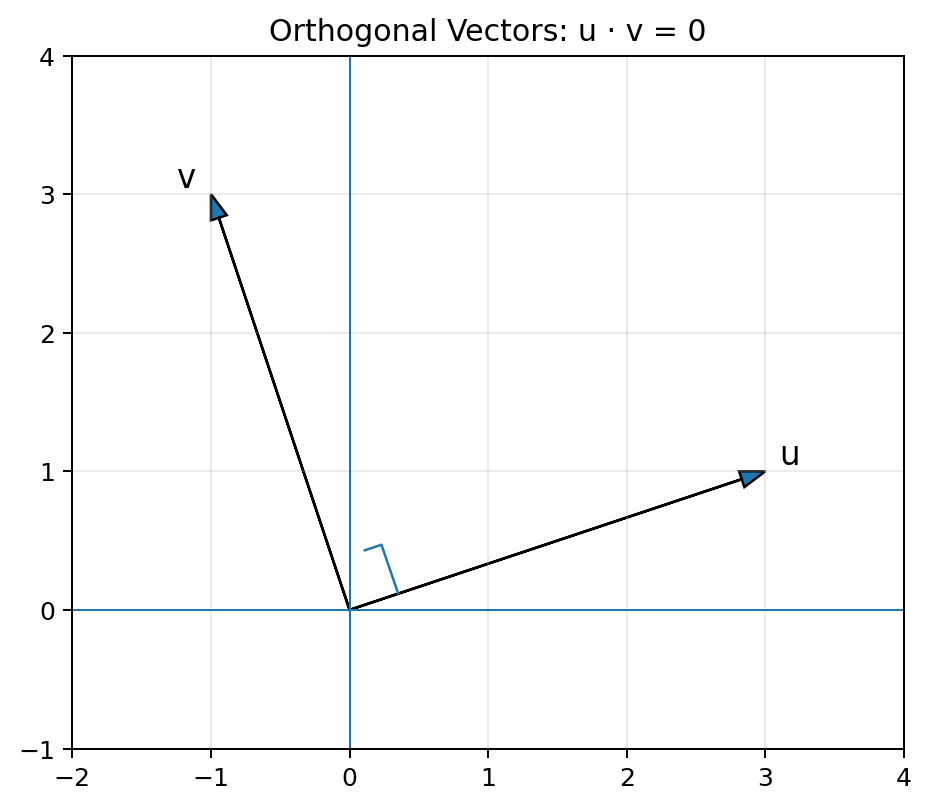
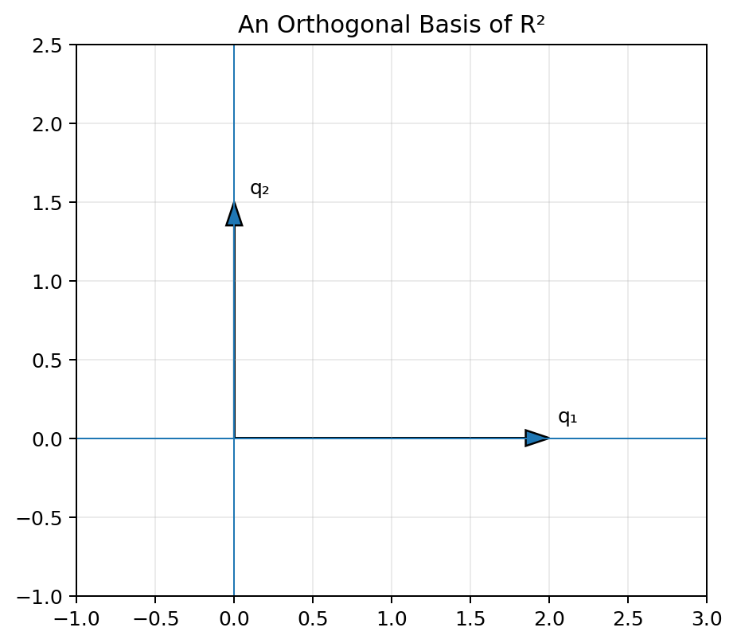
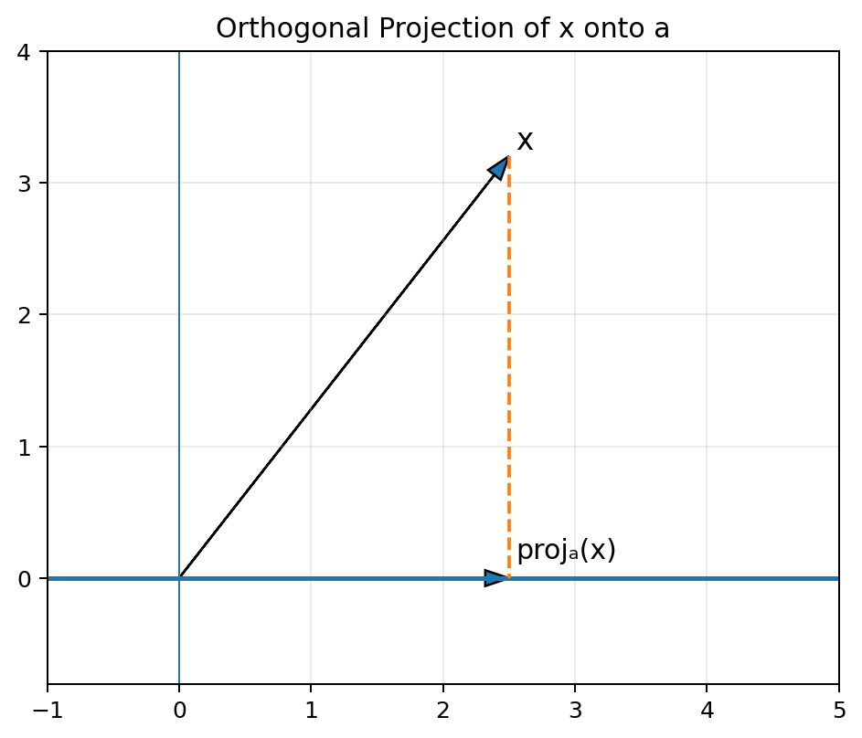
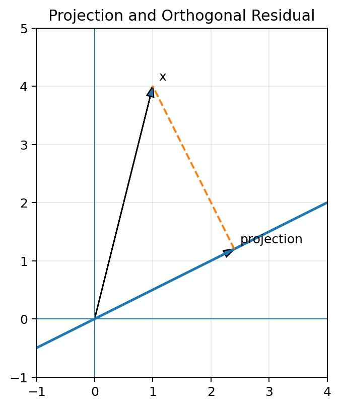
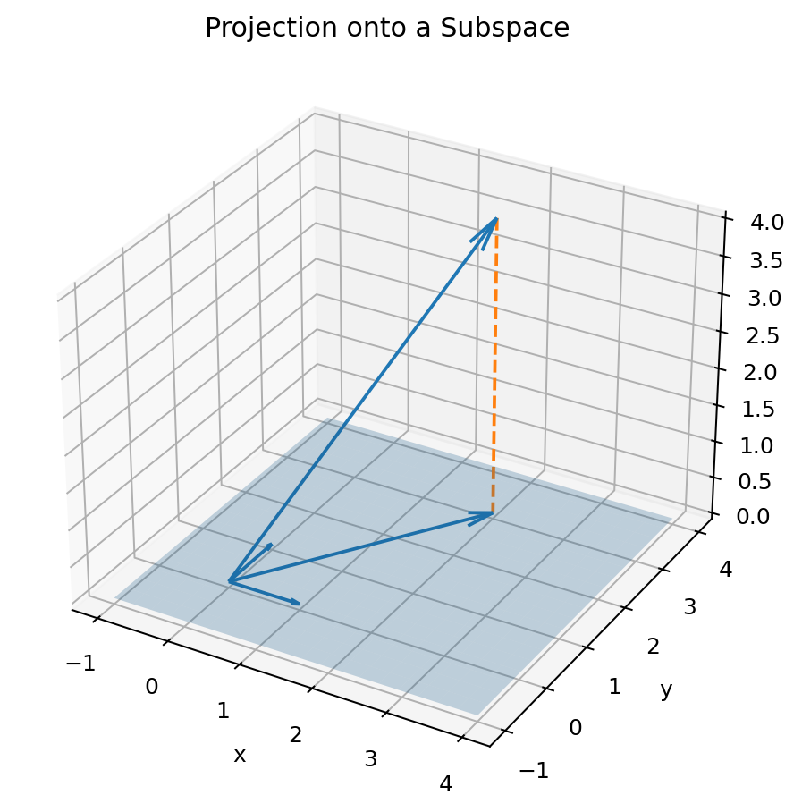
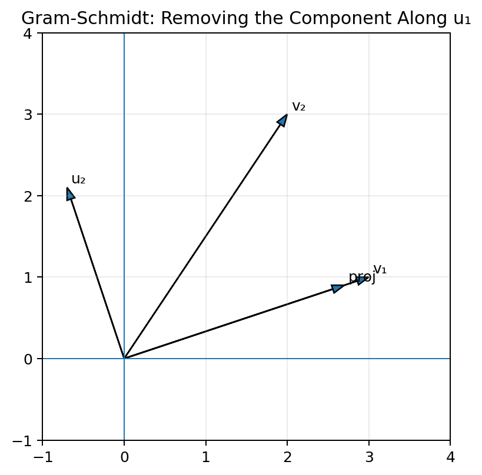
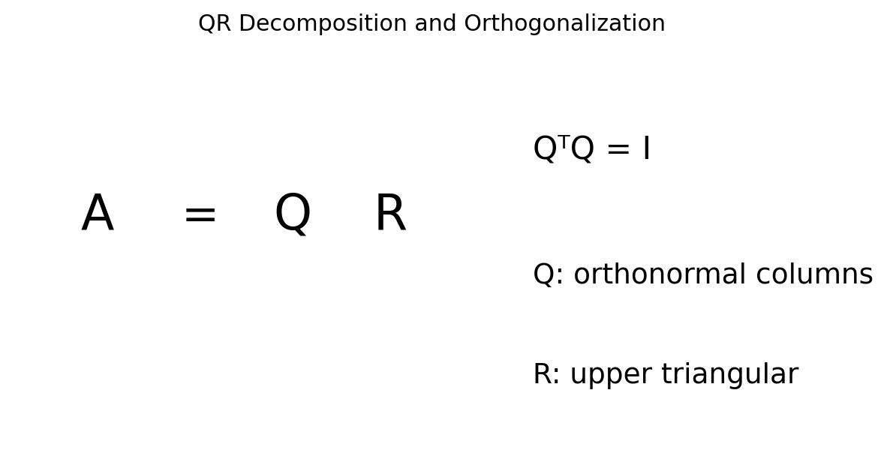

# :classical_building: Mathematics for IT Course - M.Tech. 1st Semester, IIIT Allahabad
## Unit 1: Linear Algebra and Matrix Theory
* ### Current Topic: Orthogonality and Projections: Orthogonal Bases, Orthogonal Projections, and Gram-Schmidt Orthogonalization
---
## 👥 Instructor Information
* **Edited by Instructor:** [Dr. Mohammed Javed](https://sites.google.com/site/mohammedjaved2016/)
* **Email:** javed@iiita.ac.in
* **Senior Teaching Assistants:** Mr. Apurba Chakraborty (rsi2024005@iiita.ac.in), Ms Aarthi Jha (rsi2025509@iiita.ac.in)
---
## 🎯 1. Learning Objectives

After studying this material, you should be able to:

- Define orthogonality using the dot product.
- Explain orthogonal and orthonormal sets of vectors.
- Construct and use orthogonal bases.
- Calculate orthogonal projections onto vectors and subspaces.
- Understand the geometric meaning of projection and residual error.
- Apply the Gram-Schmidt orthogonalization process.
- Construct orthonormal bases from linearly independent vectors.
- Implement these concepts using Python, NumPy, and SymPy.
- Understand applications in least squares, data science, signal processing, and machine learning.

---

# 1. Introduction

Orthogonality is one of the most useful ideas in linear algebra.

In elementary geometry, two lines are perpendicular when they meet at a right angle. In linear algebra, the idea of perpendicularity is generalized using the **dot product**.

Orthogonality is important because it makes many computations simpler:

- coordinates can be calculated using dot products,
- projections become straightforward,
- distances and errors can be separated into perpendicular components,
- least-squares problems become easier,
- numerical algorithms become more stable,
- orthonormal bases provide efficient coordinate systems.

The three major ideas in this chapter are:

1. **Orthogonal bases**
2. **Orthogonal projections**
3. **Gram-Schmidt orthogonalization**

---

# 2. Dot Product

For two vectors

$$
u=
\begin{bmatrix}
u_1\\u_2\\\vdots\\u_n
\end{bmatrix},
\qquad
v=
\begin{bmatrix}
v_1\\v_2\\\vdots\\v_n
\end{bmatrix},
$$

their dot product is

$$
u\cdot v
=
u_1v_1+u_2v_2+\cdots+u_nv_n.
$$

In matrix notation:

$$
u\cdot v=u^Tv.
$$

## Example

Let

$$
u=
\begin{bmatrix}
2\\3
\end{bmatrix},
\qquad
v=
\begin{bmatrix}
4\\-1
\end{bmatrix}.
$$

Then:

$$
u\cdot v
=
2(4)+3(-1)
=
8-3
=
5.
$$

### Python

```python
import numpy as np

u = np.array([2, 3])
v = np.array([4, -1])

dot_product = np.dot(u, v)

print(dot_product)
```

Output:

```text
5
```

---

# 3. Orthogonal Vectors

Two vectors are **orthogonal** if their dot product is zero.

Thus,

$$
u\perp v
\quad\Longleftrightarrow\quad
u^Tv=0.
$$

For example:

$$
u=
\begin{bmatrix}
3\\1
\end{bmatrix},
\qquad
v=
\begin{bmatrix}
-1\\3
\end{bmatrix}.
$$

Then:

$$
u^Tv
=
3(-1)+1(3)
=
-3+3
=
0.
$$

Therefore:

$$
u\perp v.
$$



### Python

```python
import numpy as np

u = np.array([3, 1])
v = np.array([-1, 3])

print("Dot product:", np.dot(u, v))

if np.isclose(np.dot(u, v), 0):
    print("The vectors are orthogonal.")
else:
    print("The vectors are not orthogonal.")
```

---

# 4. Orthogonality in $\mathbb{R}^n$

Orthogonality is not restricted to two-dimensional geometry.

For example:

$$
u=
\begin{bmatrix}
1\\2\\3
\end{bmatrix},
\qquad
v=
\begin{bmatrix}
2\\-1\\0
\end{bmatrix}.
$$

Then:

$$
u^Tv
=
1(2)+2(-1)+3(0)
=
2-2
=
0.
$$

Therefore $u$ and $v$ are orthogonal even though they belong to $\mathbb{R}^3$.

---

# 5. Norm or Length of a Vector

The Euclidean norm of a vector is:

$$
\|v\|
=
\sqrt{v^Tv}.
$$

For

$$
v=
\begin{bmatrix}
3\\4
\end{bmatrix},
$$

we have:

$$
\|v\|
=
\sqrt{3^2+4^2}
=
5.
$$

### Python

```python
import numpy as np

v = np.array([3, 4])

print(np.linalg.norm(v))
```

---

# 6. Unit Vectors

A vector with length 1 is called a **unit vector**.

Given a nonzero vector $v$, its normalized version is:

$$
\hat{v}
=
\frac{v}{\|v\|}.
$$

For:

$$
v=
\begin{bmatrix}
3\\4
\end{bmatrix},
$$

we have:

$$
\hat v=
\frac{1}{5}
\begin{bmatrix}
3\\4
\end{bmatrix}
=
\begin{bmatrix}
3/5\\4/5
\end{bmatrix}.
$$

### Python

```python
import numpy as np

v = np.array([3., 4.])

unit_v = v / np.linalg.norm(v)

print(unit_v)
print("Norm:", np.linalg.norm(unit_v))
```

---

# 7. Orthonormal Vectors

A collection of vectors is **orthonormal** if:

1. every vector has norm 1,
2. every pair of distinct vectors is orthogonal.

For vectors $q_1,\ldots,q_k$:

$$
q_i^Tq_j=
\begin{cases}
1,&i=j\\
0,&i\ne j.
\end{cases}
$$

If the vectors are placed into a matrix

$$
Q=
\begin{bmatrix}
|&|&&|\\
q_1&q_2&\cdots&q_k\\
|&|&&|
\end{bmatrix},
$$

then:

$$
\boxed{Q^TQ=I}.
$$

---

# 8. Orthogonal vs Orthonormal

| Property | Orthogonal | Orthonormal |
|---|---|---|
| Pairwise dot products are zero | Yes | Yes |
| Every vector has length 1 | Not necessarily | Yes |
| Easier coordinate calculations | Yes | Yes |
| Example | $(2,0),(0,3)$ | $(1,0),(0,1)$ |

For example:

$$
(2,0),\;(0,3)
$$

are orthogonal but not orthonormal.

After normalization:

$$
(1,0),\;(0,1)
$$

are orthonormal.

---

# 9. Orthogonal Bases

A **basis** is a set of linearly independent vectors that spans a vector space.

An **orthogonal basis** is a basis whose vectors are mutually orthogonal.

An **orthonormal basis** is an orthogonal basis whose vectors have unit length.

For $\mathbb{R}^2$, the standard basis is:

$$
e_1=
\begin{bmatrix}
1\\0
\end{bmatrix},
\qquad
e_2=
\begin{bmatrix}
0\\1
\end{bmatrix}.
$$

These vectors form an orthonormal basis.



---

# 10. Why Orthogonal Bases Are Useful

Suppose $\{q_1,\ldots,q_n\}$ is an orthogonal basis.

A vector $x$ can be written as:

$$
x=c_1q_1+c_2q_2+\cdots+c_nq_n.
$$

Taking the dot product with $q_j$:

$$
q_j^Tx
=
c_1q_j^Tq_1+\cdots+c_nq_j^Tq_n.
$$

Because the vectors are orthogonal, all terms disappear except one:

$$
q_j^Tx=c_jq_j^Tq_j.
$$

Therefore:

$$
\boxed{
c_j=\frac{q_j^Tx}{q_j^Tq_j}
}
$$

For an **orthonormal** basis:

$$
q_j^Tq_j=1,
$$

so:

$$
\boxed{c_j=q_j^Tx}.
$$

This is one of the main advantages of orthonormal bases.

---

# 11. Coordinates Using an Orthogonal Basis

Suppose:

$$
q_1=
\begin{bmatrix}
2\\0
\end{bmatrix},
\qquad
q_2=
\begin{bmatrix}
0\\3
\end{bmatrix}.
$$

Let:

$$
x=
\begin{bmatrix}
6\\9
\end{bmatrix}.
$$

The coefficients are:

$$
c_1=
\frac{q_1^Tx}{q_1^Tq_1}
=
\frac{12}{4}
=
3,
$$

and

$$
c_2=
\frac{q_2^Tx}{q_2^Tq_2}
=
\frac{27}{9}
=
3.
$$

Thus:

$$
x=3q_1+3q_2.
$$

---

# 12. Orthogonal Projection

The **orthogonal projection** of a vector $x$ onto a nonzero vector $a$ is:

$$
\boxed{
\operatorname{proj}_a(x)
=
\frac{x^Ta}{a^Ta}a
}
$$

Equivalently:

$$
\operatorname{proj}_a(x)
=
\frac{x\cdot a}{\|a\|^2}a.
$$

The projection is the point on the line spanned by $a$ that is closest to $x$.



---

# 13. Projection Example

Let:

$$
x=
\begin{bmatrix}
3\\4
\end{bmatrix},
\qquad
a=
\begin{bmatrix}
2\\0
\end{bmatrix}.
$$

Calculate:

$$
x^Ta=3(2)+4(0)=6,
$$

and:

$$
a^Ta=2^2+0^2=4.
$$

Therefore:

$$
\operatorname{proj}_a(x)
=
\frac{6}{4}
\begin{bmatrix}
2\\0
\end{bmatrix}
=
\begin{bmatrix}
3\\0
\end{bmatrix}.
$$

The projection is:

$$
\boxed{
\begin{bmatrix}
3\\0
\end{bmatrix}
}
$$

---

# 14. Python Implementation of Projection

```python
import numpy as np

def projection(x, a):
    x = np.asarray(x, dtype=float)
    a = np.asarray(a, dtype=float)

    denominator = np.dot(a, a)

    if np.isclose(denominator, 0):
        raise ValueError("Cannot project onto the zero vector.")

    return (np.dot(x, a) / denominator) * a


x = np.array([3, 4])
a = np.array([2, 0])

p = projection(x, a)

print("Projection:", p)
```

Output:

```text
Projection: [3. 0.]
```

---

# 15. Orthogonal Residual

The difference between the original vector and its projection is called the **residual**:

$$
r=x-\operatorname{proj}_a(x).
$$

The residual is orthogonal to $a$.

Therefore:

$$
a^Tr=0.
$$

This gives the decomposition:

$$
\boxed{
x=\operatorname{proj}_a(x)+r
}
$$

where:

$$
r\perp a.
$$



### Python

```python
x = np.array([1., 4.])
a = np.array([4., 2.])

p = projection(x, a)
r = x - p

print("Projection:", p)
print("Residual:", r)
print("a dot residual:", np.dot(a, r))
```

The final value should be approximately zero.

---

# 16. Projection onto a Subspace

Suppose a subspace $W$ has an orthonormal basis:

$$
Q=
\begin{bmatrix}
|&|&&|\\
q_1&q_2&\cdots&q_k\\
|&|&&|
\end{bmatrix}.
$$

The projection of $x$ onto $W$ is:

$$
\boxed{
\operatorname{proj}_W(x)=QQ^Tx
}
$$

This is extremely useful because it converts a geometric problem into a matrix computation.



---

# 17. Projection Matrix

If $Q$ has orthonormal columns, then:

$$
P=QQ^T
$$

is the projection matrix onto the column space of $Q$.

Therefore:

$$
\boxed{
\operatorname{proj}_W(x)=Px
}
$$

where:

$$
P^2=P.
$$

Such a matrix is called **idempotent**.

Also:

$$
P^T=P.
$$

So an orthogonal projection matrix is symmetric and idempotent.

---

# 18. Projection Using a General Basis

Suppose the columns of $A$ form a basis for a subspace but are not necessarily orthonormal.

The projection matrix is:

$$
\boxed{
P=A(A^TA)^{-1}A^T
}
$$

provided the columns of $A$ are linearly independent.

Then:

$$
\operatorname{proj}_{\operatorname{Col}(A)}(x)=Px.
$$

This formula is central to least-squares methods.

---

# 19. Python: Projection onto a Subspace

```python
import numpy as np

A = np.array([
    [1., 0.],
    [0., 1.],
    [0., 0.]
])

x = np.array([2., 3., 4.])

P = A @ np.linalg.inv(A.T @ A) @ A.T

projection_x = P @ x

print("Projection:", projection_x)
```

Output:

```text
Projection: [2. 3. 0.]
```

The component perpendicular to the subspace is:

```python
residual = x - projection_x

print("Residual:", residual)
print("A.T @ residual:", A.T @ residual)
```

The result is approximately zero.

---

# 20. Orthogonal Projection and Distance

The distance from $x$ to a subspace $W$ is:

$$
\boxed{
\|x-\operatorname{proj}_W(x)\|
}
$$

The closest point in $W$ to $x$ is its orthogonal projection.

This property makes projections extremely important in optimization.

---

# 21. Gram-Schmidt Orthogonalization

The **Gram-Schmidt process** converts a linearly independent set of vectors into an orthogonal or orthonormal set spanning the same subspace.

Suppose:

$$
v_1,v_2,\ldots,v_k
$$

are linearly independent.

Gram-Schmidt constructs:

$$
u_1,u_2,\ldots,u_k
$$

such that the $u_i$ are mutually orthogonal.

Then normalizing them gives:

$$
q_i=\frac{u_i}{\|u_i\|}.
$$

The $q_i$ form an orthonormal set.

---

# 22. Gram-Schmidt: Two Vectors

Given:

$$
v_1,v_2.
$$

Set:

$$
u_1=v_1.
$$

Next, remove the component of $v_2$ in the direction of $u_1$:

$$
u_2
=
v_2-\operatorname{proj}_{u_1}(v_2).
$$

Since:

$$
\operatorname{proj}_{u_1}(v_2)
=
\frac{v_2^Tu_1}{u_1^Tu_1}u_1,
$$

we have:

$$
\boxed{
u_2
=
v_2-
\frac{v_2^Tu_1}{u_1^Tu_1}u_1
}
$$

The resulting $u_1$ and $u_2$ are orthogonal.



---

# 23. Gram-Schmidt Example

Let:

$$
v_1=
\begin{bmatrix}
3\\1
\end{bmatrix},
\qquad
v_2=
\begin{bmatrix}
2\\3
\end{bmatrix}.
$$

First:

$$
u_1=v_1=
\begin{bmatrix}
3\\1
\end{bmatrix}.
$$

Calculate:

$$
v_2^Tu_1
=
2(3)+3(1)
=
9.
$$

Also:

$$
u_1^Tu_1=3^2+1^2=10.
$$

Therefore:

$$
\operatorname{proj}_{u_1}(v_2)
=
\frac{9}{10}
\begin{bmatrix}
3\\1
\end{bmatrix}
=
\begin{bmatrix}
27/10\\9/10
\end{bmatrix}.
$$

Then:

$$
u_2
=
\begin{bmatrix}
2\\3
\end{bmatrix}
-
\begin{bmatrix}
27/10\\9/10
\end{bmatrix}
=
\begin{bmatrix}
-7/10\\21/10
\end{bmatrix}.
$$

Check:

$$
u_1^Tu_2
=
3(-7/10)+1(21/10)
=
0.
$$

Thus the vectors are orthogonal.

---

# 24. Normalizing the Gram-Schmidt Vectors

To obtain an orthonormal basis:

$$
q_1=\frac{u_1}{\|u_1\|},
\qquad
q_2=\frac{u_2}{\|u_2\|}.
$$

In the example:

$$
\|u_1\|=\sqrt{10}.
$$

Therefore:

$$
q_1=
\frac{1}{\sqrt{10}}
\begin{bmatrix}
3\\1
\end{bmatrix}.
$$

The second vector is normalized similarly.

The resulting vectors are orthonormal.

---

# 25. Gram-Schmidt for Three or More Vectors

For vectors:

$$
v_1,v_2,\ldots,v_k,
$$

the procedure is:

### Step 1

$$
u_1=v_1.
$$

### Step 2

$$
u_2=v_2-\operatorname{proj}_{u_1}(v_2).
$$

### Step 3

$$
u_3
=
v_3
-\operatorname{proj}_{u_1}(v_3)
-\operatorname{proj}_{u_2}(v_3).
$$

### General Step

For $j\ge2$:

$$
\boxed{
u_j
=
v_j
-
\sum_{i=1}^{j-1}
\operatorname{proj}_{u_i}(v_j)
}
$$

Then normalize:

$$
q_j=\frac{u_j}{\|u_j\|}.
$$

---

# 26. Python Implementation of Gram-Schmidt

```python
import numpy as np

def gram_schmidt(vectors):
    """
    Return an orthonormal basis obtained using Gram-Schmidt.
    vectors: list of 1-D NumPy arrays
    """
    Q = []

    for v in vectors:
        v = np.asarray(v, dtype=float)
        u = v.copy()

        for q in Q:
            u = u - np.dot(v, q) * q

        norm = np.linalg.norm(u)

        if np.isclose(norm, 0):
            raise ValueError(
                "Input vectors are linearly dependent."
            )

        Q.append(u / norm)

    return np.array(Q)


vectors = [
    np.array([3., 1.]),
    np.array([2., 3.])
]

Q = gram_schmidt(vectors)

print("Orthonormal basis:")
print(Q)

print("\nQ Q^T:")
print(Q @ Q.T)
```

Depending on whether vectors are stored as rows or columns, the orthonormality check can be written as either:

```python
Q @ Q.T
```

or, for columns:

```python
Q.T @ Q
```

---

# 27. Gram-Schmidt Using Columns

A common matrix convention stores vectors as columns.

```python
import numpy as np

def gram_schmidt_columns(A):
    A = np.asarray(A, dtype=float)
    m, n = A.shape

    Q = np.zeros((m, n))

    for j in range(n):
        v = A[:, j].copy()

        for i in range(j):
            v -= np.dot(Q[:, i], A[:, j]) * Q[:, i]

        norm = np.linalg.norm(v)

        if np.isclose(norm, 0):
            raise ValueError("Columns are linearly dependent.")

        Q[:, j] = v / norm

    return Q


A = np.array([
    [3., 2.],
    [1., 3.]
])

Q = gram_schmidt_columns(A)

print("Q =")
print(Q)

print("\nQ^T Q =")
print(Q.T @ Q)
```

The result should be approximately the identity matrix:

$$
Q^TQ\approx I.
$$

---

# 28. Gram-Schmidt with SymPy

For exact symbolic arithmetic, SymPy can be useful.

```python
import sympy as sp

v1 = sp.Matrix([3, 1])
v2 = sp.Matrix([2, 3])

u1 = v1

projection = (v2.dot(u1) / u1.dot(u1)) * u1

u2 = v2 - projection

print("u1 =")
sp.pprint(u1)

print("\nu2 =")
sp.pprint(u2)

print("\nu1 dot u2 =", u1.dot(u2))
```

The final dot product is exactly zero.

---

# 29. QR Decomposition

Gram-Schmidt is closely related to **QR decomposition**.

A matrix $A$ with linearly independent columns can be written as:

$$
\boxed{
A=QR
}
$$

where:

- $Q$ has orthonormal columns,
- $R$ is upper triangular.



The matrix $Q$ can be generated using orthogonalization.

### Python

```python
import numpy as np

A = np.array([
    [3., 2.],
    [1., 3.]
])

Q, R = np.linalg.qr(A)

print("Q:")
print(Q)

print("\nR:")
print(R)

print("\nQ.T @ Q:")
print(Q.T @ Q)

print("\nReconstruction Q @ R:")
print(Q @ R)
```

---

# 30. Projection Using QR Decomposition

If:

$$
A=QR
$$

and $Q$ has orthonormal columns, then the projection onto the column space of $A$ is:

$$
\boxed{
P=QQ^T
}
$$

Therefore:

$$
\operatorname{proj}_{\operatorname{Col}(A)}(x)
=
QQ^Tx.
$$

### Python

```python
Q, R = np.linalg.qr(A)

x = np.array([5., 4.])

projection = Q @ Q.T @ x

print("Projection:", projection)
```

QR-based projection is often preferable numerically to explicitly computing:

$$
(A^TA)^{-1}.
$$

---

# 31. Orthogonal Projection and Least Squares

Suppose we want to solve:

$$
Ax=b.
$$

If the system has no exact solution, we can find the vector in the column space of $A$ that is closest to $b$.

That vector is:

$$
\hat b=\operatorname{proj}_{\operatorname{Col}(A)}(b).
$$

The error is:

$$
r=b-\hat b.
$$

The least-squares condition is:

$$
A^Tr=0.
$$

Therefore:

$$
A^T(b-A\hat x)=0.
$$

This gives the **normal equations**:

$$
\boxed{
A^TA\hat x=A^Tb
}
$$

---

# 32. Python Least-Squares Example

```python
import numpy as np

A = np.array([
    [1., 1.],
    [1., 2.],
    [1., 3.]
])

b = np.array([2., 2.8, 4.2])

x_hat, residuals, rank, singular_values = np.linalg.lstsq(
    A, b, rcond=None
)

b_hat = A @ x_hat
r = b - b_hat

print("Least-squares solution:")
print(x_hat)

print("\nProjection of b onto Col(A):")
print(b_hat)

print("\nResidual:")
print(r)

print("\nA.T @ residual:")
print(A.T @ r)
```

The final result should be close to zero.

---

# 33. Geometric Meaning of Least Squares

The least-squares estimate $\hat b$ is the point in the column space of $A$ closest to $b$.

Thus:

$$
b=\hat b+r
$$

where:

$$
\hat b\in\operatorname{Col}(A)
$$

and:

$$
r\perp\operatorname{Col}(A).
$$

This is why orthogonal projection is fundamental to regression.

---

# 34. Orthogonality in Data Science

Orthogonality is useful in:

- feature representation,
- dimensionality reduction,
- regression,
- principal component analysis,
- signal decomposition,
- numerical optimization.

Orthogonal directions reduce redundancy and often simplify calculations.

---

# 35. Application: Least-Squares Regression

Linear regression attempts to find parameters that minimize:

$$
\|Ax-b\|^2.
$$

The solution is the point where the residual is orthogonal to every column of $A$:

$$
A^T(b-Ax)=0.
$$

Therefore:

$$
A^TAx=A^Tb.
$$

Orthogonal projection provides the geometric interpretation of this optimization problem.

---

# 36. Application: Signal Processing

A signal can be decomposed into orthogonal components:

$$
x=c_1q_1+c_2q_2+\cdots+c_kq_k.
$$

If the $q_i$ are orthonormal, then:

$$
c_i=q_i^Tx.
$$

This makes it easy to measure the amount of each component present in a signal.

Fourier basis functions are a major example of this idea.

---

# 37. Application: Machine Learning

Many machine-learning algorithms involve:

- vector representations,
- distances,
- projections,
- least squares,
- orthogonal transformations,
- QR decomposition.

Orthogonalization can help create numerically stable representations.

For example, QR decomposition is commonly used in numerical algorithms instead of directly forming inverse matrices.

---

# 38. Application: Computer Graphics

Orthogonal and orthonormal bases are used to define coordinate frames.

A 3D coordinate frame can be represented using three mutually perpendicular unit vectors:

$$
q_1,\quad q_2,\quad q_3.
$$

Together:

$$
Q=
\begin{bmatrix}
|&|&|\\
q_1&q_2&q_3\\
|&|&|
\end{bmatrix}
$$

satisfies:

$$
Q^TQ=I.
$$

Such matrices represent rotations and coordinate transformations.

---

# 39. Application: Image Processing

An image can be treated as a vector in a high-dimensional space.

Projection onto a lower-dimensional subspace can be used for:

- compression,
- noise reduction,
- feature extraction,
- dimensionality reduction.

An orthogonal basis provides a convenient coordinate system for representing image information.

---

# 40. Important Properties

## Property 1: Orthogonality

$$
u^Tv=0
\quad\Longleftrightarrow\quad
u\perp v.
$$

## Property 2: Projection

$$
\operatorname{proj}_a(x)
=
\frac{x^Ta}{a^Ta}a.
$$

## Property 3: Orthonormal Projection

If $Q$ has orthonormal columns:

$$
\operatorname{proj}_{\operatorname{Col}(Q)}(x)
=
QQ^Tx.
$$

## Property 4: Projection Matrix

$$
P^2=P,
\qquad
P^T=P.
$$

## Property 5: Gram-Schmidt

Gram-Schmidt transforms linearly independent vectors into orthogonal vectors spanning the same subspace.

---

# 41. Common Mistakes

### Mistake 1: Confusing zero dot product with zero vectors

Orthogonal vectors need not be zero vectors.

### Mistake 2: Forgetting normalization

Orthogonal vectors are not necessarily orthonormal.

### Mistake 3: Projecting onto the zero vector

The expression

$$
\frac{x^Ta}{a^Ta}
$$

is undefined when $a=0$.

### Mistake 4: Using an ordinary inverse unnecessarily

For numerical projection problems, QR decomposition is often more stable than explicitly calculating:

$$
(A^TA)^{-1}.
$$

### Mistake 5: Ignoring linear dependence in Gram-Schmidt

If an input vector becomes zero after removing previous projections, the input vectors are linearly dependent.

---

# 42. Summary Table

| Concept | Formula / Meaning |
|---|---|
| Dot product | $u^Tv$ |
| Orthogonality | $u^Tv=0$ |
| Norm | $\|v\|=\sqrt{v^Tv}$ |
| Unit vector | $v/\|v\|$ |
| Orthonormality | $q_i^Tq_j=\delta_{ij}$ |
| Projection onto vector | $\frac{x^Ta}{a^Ta}a$ |
| Projection onto orthonormal subspace | $QQ^Tx$ |
| General projection matrix | $A(A^TA)^{-1}A^T$ |
| Orthogonal residual | $r=x-\operatorname{proj}(x)$ |
| Gram-Schmidt | Converts independent vectors to orthogonal vectors |
| QR decomposition | $A=QR$ |
| Orthonormal matrix property | $Q^TQ=I$ |

---

# 43. Practice Questions

## Conceptual Questions

1. Define the dot product.
2. What does it mean for two vectors to be orthogonal?
3. Distinguish between orthogonal and orthonormal vectors.
4. What is an orthogonal basis?
5. What is an orthonormal basis?
6. Explain the geometric meaning of projection.
7. Why is the residual perpendicular to the projection subspace?
8. What does Gram-Schmidt orthogonalization do?
9. What is QR decomposition?
10. Why are orthonormal bases useful in computation?

## Numerical Questions

1. Determine whether:

$$
u=
\begin{bmatrix}
2\\1
\end{bmatrix},
\quad
v=
\begin{bmatrix}
1\\-2
\end{bmatrix}
$$

are orthogonal.

2. Find the projection of:

$$
x=
\begin{bmatrix}
3\\4
\end{bmatrix}
$$

onto:

$$
a=
\begin{bmatrix}
2\\1
\end{bmatrix}.
$$

3. Find the residual and verify that it is orthogonal to $a$.

4. Apply Gram-Schmidt to:

$$
\begin{bmatrix}
1\\1
\end{bmatrix},
\quad
\begin{bmatrix}
1\\0
\end{bmatrix}.
$$

5. Normalize the resulting orthogonal vectors.

6. Construct the projection matrix onto the span of:

$$
\begin{bmatrix}
1\\0\\0
\end{bmatrix},
\quad
\begin{bmatrix}
0\\1\\0
\end{bmatrix}.
$$

## Programming Questions

1. Write a Python function to test whether two vectors are orthogonal.
2. Implement vector normalization.
3. Implement projection onto a vector.
4. Implement projection onto a subspace.
5. Implement Gram-Schmidt from scratch.
6. Verify $Q^TQ=I$ after Gram-Schmidt.
7. Compute QR decomposition using NumPy.
8. Solve a least-squares problem using `np.linalg.lstsq`.
9. Verify that the least-squares residual is orthogonal to the columns of $A$.
10. Visualize projection and residual vectors using Matplotlib.

---

# 44. Key Takeaways

- Two vectors are orthogonal when their dot product is zero.
- An orthonormal set is orthogonal and consists of unit vectors.
- Orthogonal bases simplify coordinate calculations.
- The projection of $x$ onto $a$ is:

$$
\boxed{
\operatorname{proj}_a(x)
=
\frac{x^Ta}{a^Ta}a
}
$$

- The residual after projection is perpendicular to the projection direction.
- For an orthonormal basis matrix $Q$:

$$
\boxed{
\operatorname{proj}_{\operatorname{Col}(Q)}(x)=QQ^Tx
}
$$

- Gram-Schmidt converts linearly independent vectors into orthogonal or orthonormal vectors.
- QR decomposition can be viewed as a matrix-level form of orthogonalization:

$$
A=QR.
$$

- Orthogonal projections provide the geometric foundation of least-squares regression.
- Orthogonality and orthonormal bases are widely used in machine learning, numerical computing, signal processing, image processing, and computer graphics.

---

## ❓: CHALLENGING Questions - Check Your Understanding 
* ➡️ **[Q-01]**
* ➡️ 

---
## 📚 References 
* **[R-01]** Linear Algebra by Gilbert Strang, MIT Press
* **[R-02]** ChatGPT - for examples and codes
