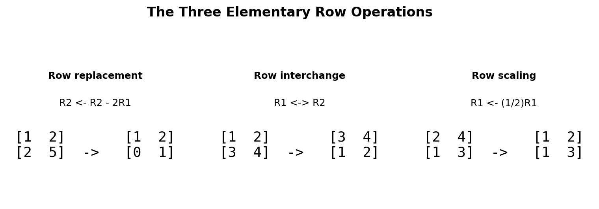
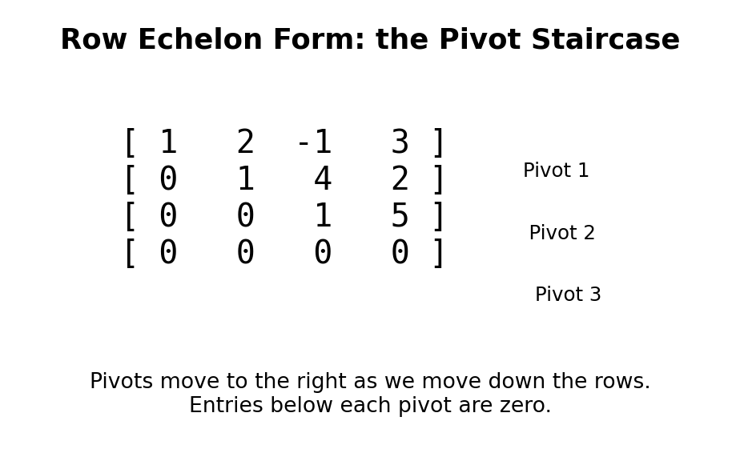
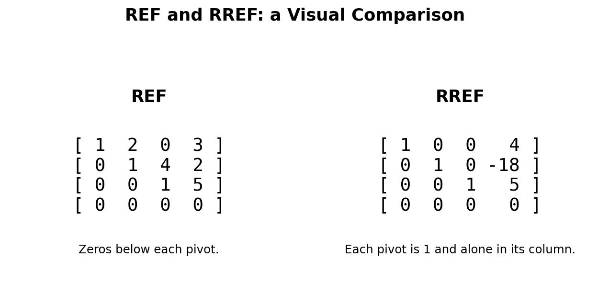
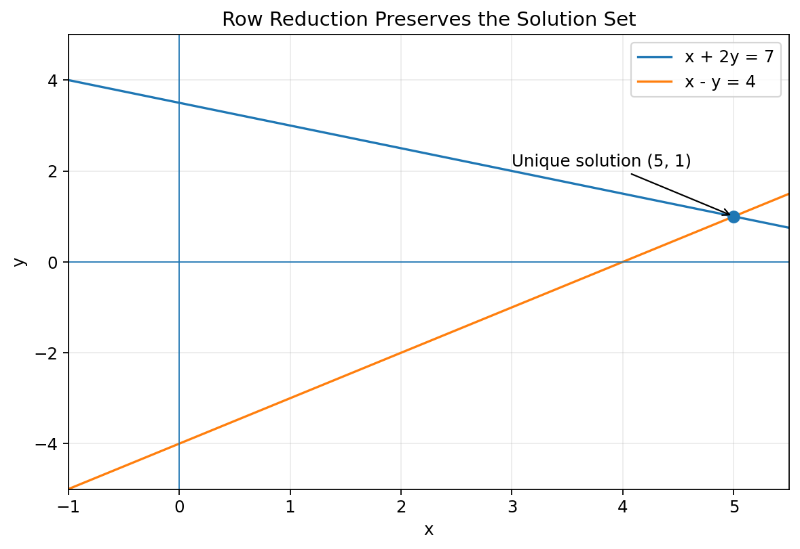
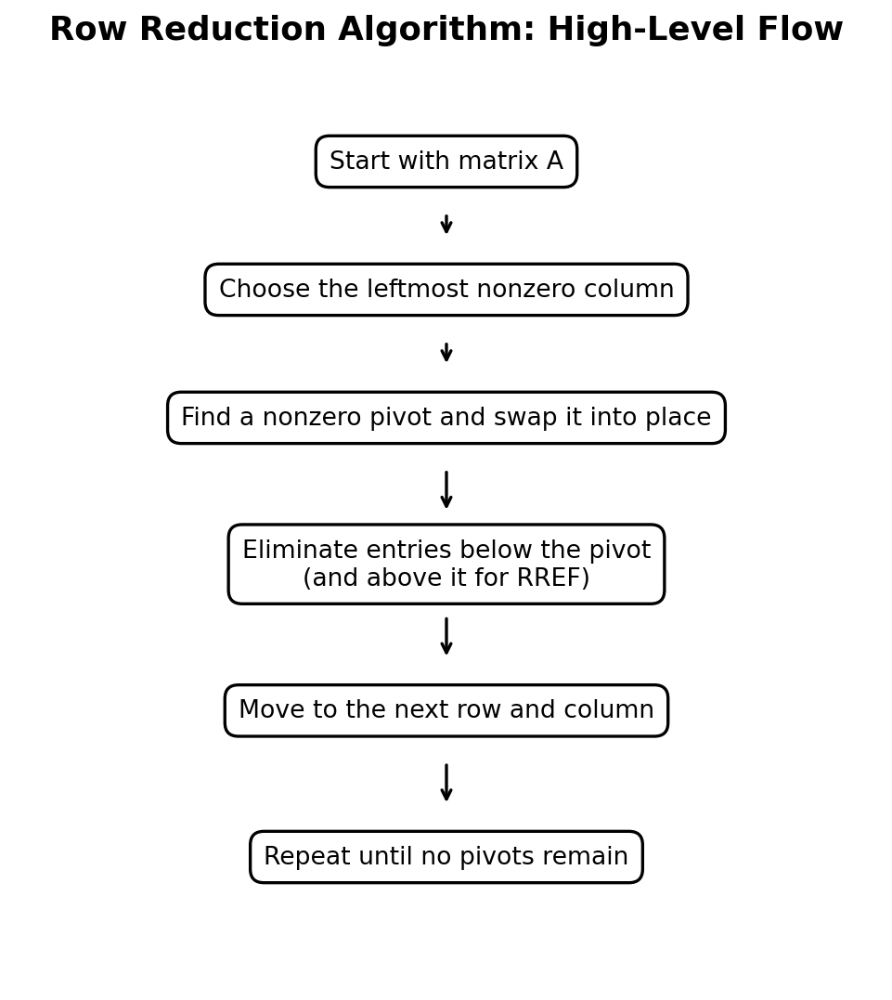
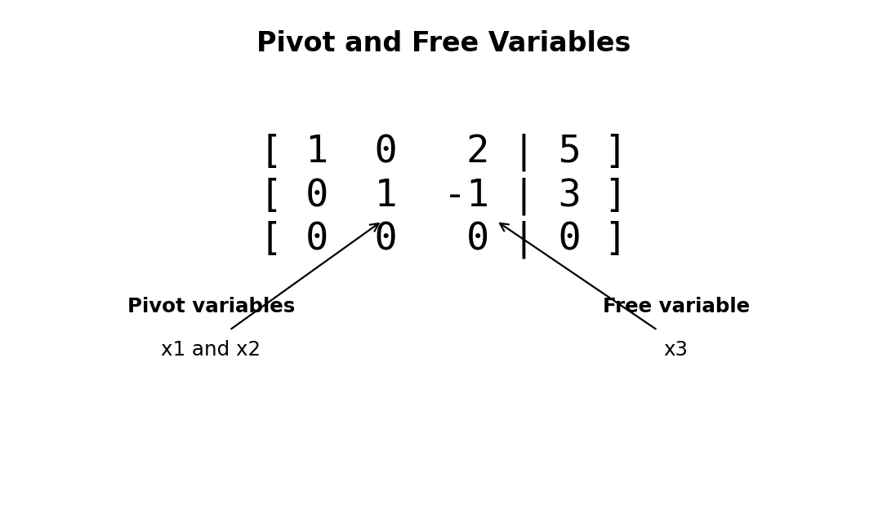

# :classical_building: Mathematics for IT Course - M.Tech. 1st Semester, IIIT Allahabad
## Unit 1: Linear Algebra and Matrix Theory
### Current Topic: Row Reduction and Echelon Forms - Basics, graphical interpretation, solved examples, and Python implementation
---
## 👥 Instructor Information
* **Edited by Instructor:** [Dr. Mohammed Javed](https://sites.google.com/site/mohammedjaved2016/)
* **Email:** javed@iiita.ac.in
* **Senior Teaching Assistants:** Mr. Apurba Chakraborty (rsi2024005@iiita.ac.in), Ms Aarthi Jha (rsi2025509@iiita.ac.in)
---
## 🎯 1. Learning Objectives

After studying this material, you should be able to:
- Explain row reduction and its purpose.
- Perform the three elementary row operations.
- Identify row echelon form (REF) and reduced row echelon form (RREF).
- Use pivots to determine rank, pivot variables, and free variables.
- Solve systems using Gaussian and Gauss–Jordan elimination.
- Implement row reduction in Python.

---

## 1. Introduction

A system such as

$$ x+2y-z=3, \quad 2x+5y+z=8, \quad -x+y+2z=1  $$

can be represented by the augmented matrix

$$
\left[\begin{array}{ccc|c}
1&2&-1&3\\ 
2&5&1&8\\ 
-1&1&2&1 
\end{array}\right]
$$

**Row reduction** transforms a matrix into a simpler equivalent matrix using elementary row operations. For a system of equations, these operations preserve the solution set.

> **Core idea:** simplify the matrix while preserving the information needed to solve the system.

---

## 2. Elementary Row Operations

There are exactly three elementary row operations.

### 2.1 Row replacement

$$
R_i \leftarrow R_i + cR_j
$$

### 2.2 Row interchange

$$
R_i \leftrightarrow R_j.
$$

### 2.3 Row scaling

$$
R_i\leftarrow cR_i,\qquad c\ne0.
$$



These operations preserve the solution set because they correspond to equivalent transformations of the equations.

---

## 3. Leading Entries and Pivots

A **leading entry** is the first nonzero entry in a nonzero row. During row reduction, a leading entry used for elimination is called a **pivot**.

For example,

$$
\begin{bmatrix} 
1 & 2 & -1 \\
0 & 3 & 4 \\
0 & 0 & 5
\end{bmatrix}
$$

has pivots in columns 1, 2, and 3.

Pivots help determine rank, variable types, and the number of solutions.

---

## 4. Row Echelon Form (REF)

A matrix is in **row echelon form** when:
1. All zero rows are at the bottom.
2. Each pivot is to the right of the pivot above it.
3. Every entry below a pivot is zero.

The pivots form a staircase.



Example:

$$
\begin{bmatrix}
1 & 2 & -1 & 3\\
0 & 1 & 4 & 2 \\
0 & 0 & 1 & 5\\
0 & 0 & 0 & 0
\end{bmatrix}
$$

---

## 5. Reduced Row Echelon Form (RREF)

A matrix is in **RREF** if it is in REF and also:
4. Every pivot equals 1.
5. Each pivot is the only nonzero entry in its column.

Example:

$$
\begin{bmatrix}
1&0&0&4\\
0&1&0&-18\\
0&0&1&5\\
0&0&0&0
\end{bmatrix}.
$$



| Feature | REF | RREF |
|---|---|---|
| Zero rows at bottom | Yes | Yes |
| Pivots move rightward | Yes | Yes |
| Zeros below pivots | Yes | Yes |
| Pivots equal 1 | Not required | Yes |
| Zeros above pivots | Not required | Yes |
| Unique form | No | Yes |

---

## 6. Gaussian Elimination

**Gaussian elimination** reduces a matrix to REF and then uses back-substitution.

Consider:

$$
\begin{aligned}
x+2y-z&=3\\
2x+5y+z&=8\\
-x+y+2z&=1.
\end{aligned}
$$

Start with

$$
\left[\begin{array}{ccc|c}
1&2&-1&3\\
2&5&1&8\\
-1&1&2&1
\end{array}\right].
$$

Apply

$$
R_2\leftarrow R_2-2R_1,\qquad
R_3\leftarrow R_3+R_1.
$$

Then

$$
\left[\begin{array}{ccc|c}
1&2&-1&3\\
0&1&3&2\\
0&3&1&4
\end{array}\right].
$$

Next,

$$
R_3\leftarrow R_3-3R_2
$$

gives

$$
\left[\begin{array}{ccc|c}
1&2&-1&3\\
0&1&3&2\\
0&0&-8&-2
\end{array}\right].
$$

Back-substitution gives

$$
z=\frac14,\qquad y=\frac54,\qquad x=\frac12.
$$

Therefore,

$$
\boxed{(x,y,z)=\left(\frac12,\frac54,\frac14\right)}.
$$



---

## 7. Gauss–Jordan Elimination

**Gauss–Jordan elimination** continues the process until RREF is reached.

From

$$
\left[\begin{array}{ccc|c}
1&2&-1&3\\
0&1&3&2\\
0&0&-8&-2
\end{array}\right],
$$

scale the third row and eliminate above the third pivot, then eliminate above the second pivot.

The final RREF is

$$
\boxed{
\left[\begin{array}{ccc|c}
1&0&0&\frac12\\
0&1&0&\frac54\\
0&0&1&\frac14
\end{array}\right]}.
$$

Thus the solution can be read directly.

**Gaussian elimination:** REF + back-substitution.

**Gauss–Jordan elimination:** RREF, so the solution is directly visible.



---

## 8. Pivot Variables and Free Variables

Consider

$$
\left[\begin{array}{ccc|c}
1&0&2&5\\
0&1&-1&3\\
0&0&0&0
\end{array}\right].
$$

The equations are

$$
x_1+2x_3=5,\qquad x_2-x_3=3.
$$

Columns 1 and 2 contain pivots, so $\(x_1,x_2\)$ are pivot variables. Column 3 is non-pivot, so $\(x_3\)$ is free.

Let $\(x_3=t\)$. Then

$$
x_1=5-2t,\qquad x_2=3+t.
$$

Hence

$$
\boxed{(x_1,x_2,x_3)=(5-2t,3+t,t)}.
$$



---

## 9. Rank

The **rank** of a matrix is the number of pivots in its REF or RREF.
For

$$
\begin{bmatrix}
1&2&3\\
0&1&4\\
0&0&0
\end{bmatrix},
$$

there are two pivots, so

$$
\boxed{\text{rank}(A)=2}.
$$

---

## 10. Consistency and Number of Solutions

A system is inconsistent if row reduction produces

$$
[0\quad0\quad\cdots\quad0\mid b],\qquad b\ne0.
$$

This represents the impossible equation \(0=b\).

| Row-reduction result | Conclusion |
|---|---|
| Pivot in every variable column, no contradiction | Unique solution |
| Free variable(s), no contradiction | Infinitely many solutions |
| Contradiction row | No solution |

---

# 11. Python Implementation

The following pure-Python function performs Gauss–Jordan elimination.

```python
def rref(matrix, tol=1e-12):
    """Compute the Reduced Row Echelon Form (RREF)."""
    A = [list(map(float, row)) for row in matrix]

    rows = len(A)
    cols = len(A[0])
    pivot_row = 0
    pivot_columns = []

    for col in range(cols):
        if pivot_row >= rows:
            break

        # Choose a nonzero pivot row (partial pivoting).
        best_row = max(
            range(pivot_row, rows),
            key=lambda r: abs(A[r][col])
        )

        if abs(A[best_row][col]) < tol:
            continue

        # Swap pivot row into position.
        A[pivot_row], A[best_row] = A[best_row], A[pivot_row]

        # Scale pivot to 1.
        pivot = A[pivot_row][col]
        A[pivot_row] = [x / pivot for x in A[pivot_row]]

        # Eliminate the pivot column in every other row.
        for r in range(rows):
            if r == pivot_row:
                continue

            factor = A[r][col]

            if abs(factor) > tol:
                A[r] = [
                    A[r][c] - factor * A[pivot_row][c]
                    for c in range(cols)
                ]

        pivot_columns.append(col)
        pivot_row += 1

    # Remove floating-point noise.
    for r in range(rows):
        for c in range(cols):
            if abs(A[r][c]) < tol:
                A[r][c] = 0.0

    return A, pivot_columns
```

### Example

```python
A = [
    [1, 2, -1, 3],
    [2, 5,  1, 8],
    [-1, 1, 2, 1]
]

R, pivots = rref(A)

print("RREF:")
for row in R:
    print(row)

print("Pivot columns:", pivots)
```

The result is approximately:

```text
RREF:
[1.0, 0.0, 0.0, 0.5]
[0.0, 1.0, 0.0, 1.25]
[0.0, 0.0, 1.0, 0.25]

Pivot columns: [0, 1, 2]
```

---

## 12. Detecting an Inconsistent System

```python
def is_inconsistent(rref_matrix, tol=1e-12):
    """Return True if an augmented RREF is inconsistent."""
    cols = len(rref_matrix[0])

    for row in rref_matrix:
        all_zero_coefficients = all(
            abs(row[c]) < tol for c in range(cols - 1)
        )

        if all_zero_coefficients and abs(row[-1]) >= tol:
            return True

    return False
```

Example:

```python
A = [
    [1, 1, 2],
    [2, 2, 5]
]

R, pivots = rref(A)

for row in R:
    print(row)

print("Inconsistent:", is_inconsistent(R))
```

The system has no solution because its equations contradict one another.

---

## 13. Finding Pivot and Free Columns

```python
def pivot_and_free_columns(matrix):
    R, pivot_columns = rref(matrix)

    all_columns = set(range(len(matrix[0])))
    pivot_set = set(pivot_columns)

    free_columns = sorted(all_columns - pivot_set)

    return pivot_columns, free_columns
```

Example:

```python
A = [
    [1, 2, 2],
    [2, 4, 4]
]

pivots, free = pivot_and_free_columns(A)

print("Pivot columns:", pivots)
print("Free columns:", free)
```

Expected output:

```text
Pivot columns: [0]
Free columns: [1, 2]
```

---

## 14. NumPy for Solving Systems

For numerical work, NumPy can solve square systems directly:

```python
import numpy as np

A = np.array([
    [1, 2],
    [3, 4]
], dtype=float)

b = np.array([5, 11], dtype=float)

x = np.linalg.solve(A, b)

print(x)
```

Output:

```text
[1. 2.]
```

For learning row reduction, implementing Gauss–Jordan elimination yourself is especially useful.

---

## 15. Row Reduction Algorithm

1. Start with the matrix.
2. Find a nonzero entry in the current column.
3. Swap it into the pivot position if necessary.
4. Scale the pivot if needed.
5. Eliminate entries below the pivot.
6. Move to the next row and column.
7. Continue until REF is reached.
8. For RREF, eliminate entries above each pivot as well.

**Partial pivoting**—choosing the largest absolute candidate pivot—helps reduce floating-point error in numerical computations.

---

## 16. Common Mistakes

- Dividing by a zero pivot.
- Forgetting to move pivots rightward.
- Assuming REF requires pivots to equal 1.
- Confusing pivot columns and free columns.
- Treating the augmented column as a variable column.
- Ignoring contradiction rows such as \([0\ 0\ 0\mid5]\).

---

## 17. Practice Problems

### Problem 1
Reduce to REF:

$$
\begin{bmatrix}
1&2&3\\
2&4&7\\
1&1&2
\end{bmatrix}.
$$

### Problem 2
Find the RREF:

$$
\begin{bmatrix}
1&2&1\\
2&4&2\\
3&6&3
\end{bmatrix}
$$

### Problem 3
Classify the system:

$$
x+y+z=3,\quad
2x+2y+2z=6,\quad
x+y+z=4.
$$

### Problem 4
Identify pivot and free variables:

$$
\begin{bmatrix}
1&0&2&0&5\\
0&1&-1&0&3\\
0&0&0&1&4
\end{bmatrix}.
$$

### Problem 5 — Python
Use the `rref()` function to reduce:

```python
A = [
    [1, 2, 3, 4],
    [2, 4, 7, 8],
    [1, 1, 2, 3]
]
```

Identify the pivot columns and determine the rank.

---

## 18. Summary

The key ideas are:

- Elementary row operations preserve the solution set.
- REF has a staircase of pivots and zeros below pivots.
- RREF additionally has pivot 1s and zeros above pivots.
- Gaussian elimination stops at REF and uses back-substitution.
- Gauss–Jordan elimination continues to RREF.
- The number of pivots equals the rank.
- Non-pivot variable columns correspond to free variables.
- A contradiction row means no solution.
- A consistent system with free variables has infinitely many solutions.
- A consistent system with a pivot in every variable column has a unique solution.

### Quick reference

$$
R_i\leftrightarrow R_j
$$

$$
R_i\leftarrow cR_i,\quad c\ne0
$$

$$
R_i\leftarrow R_i+cR_j
$$

$$
\boxed{
\begin{array}{ll}
\text{Unique} & \text{pivot in every variable column}\\
\text{Infinite} & \text{free variable(s), no contradiction}\\
\text{None} & [0\;0\;\cdots\;0\mid b],\ b\ne0
\end{array}}
$$

---

## ❓: CHALLENGING Questions - Check Your Understanding 
* ➡️ **[Q-01]**
* ➡️ 

---
## 📚 References 
* **[R-01]** Linear Algebra by Gilbert Strang, MIT Press
* **[R-02]** AI Tools for examples and codes
