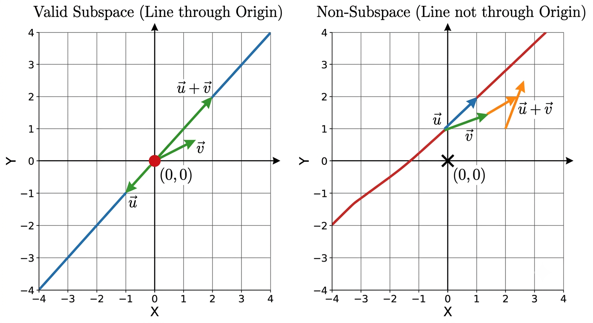
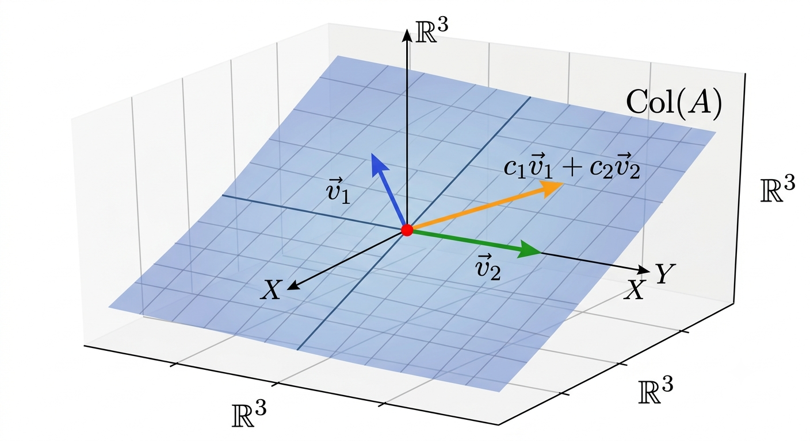
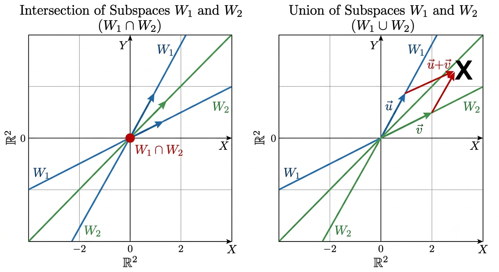

# Linear Algebra: A Comprehensive Guide to Subspaces

## 1. Introduction to Vector Subspaces

In linear algebra, a **vector subspace** (or simply **subspace**) is a subset of a vector space that is itself a vector space under the operations of addition and scalar multiplication inherited from the larger space.

### Formal Definition
Let $V$ be a vector space over a field $\mathbb{F}$ (typically $\mathbb{R}$ or $\mathbb{C}$). A non-empty subset $W \subseteq V$ is called a **subspace** of $V$ if $W$ satisfies the following three fundamental conditions:

1. **Contains the Zero Vector**: The zero vector $\mathbf{0}$ of $V$ is in $W$ ($\mathbf{0} \in W$).
2. **Closure Under Vector Addition**: For all $\mathbf{u}, \mathbf{v} \in W$, the sum $\mathbf{u} + \mathbf{v} \in W$.
3. **Closure Under Scalar Multiplication**: For all $\mathbf{u} \in W$ and all scalars $c \in \mathbb{F}$, the product $c\mathbf{u} \in W$.

---

## 2. Geometric Interpretation in $\mathbb{R}^2$ and $\mathbb{R}^3$

Understanding subspaces visually provides deep intuition into higher-dimensional linear algebra:

* **Subspaces in $\mathbb{R}^2$**:
  * The origin $\{(0,0)\}$ (0-dimensional subspace).
  * Any straight line passing through the origin (1-dimensional subspace).
  * The entire plane $\mathbb{R}^2$ (2-dimensional subspace).

* **Subspaces in $\mathbb{R}^3$**:
  * The origin $\{(0,0,0)\}$.
  * Any line passing through the origin.
  * Any plane passing through the origin.
  * The entire space $\mathbb{R}^3$.



> **Key Rule**: Any line or plane that does **not** pass through the origin fails the zero vector test and is **not** a subspace.

---

## 3. Fundamental Subspaces of a Matrix

For any $m \times n$ matrix $A$, there are four fundamental subspaces associated with it:

| Subspace | Symbol | Definition | Space |
| :--- | :--- | :--- | :--- |
| **Column Space** | $C(A)$ | $\text{Span}(\text{columns of } A)$ | Subspace of $\mathbb{R}^m$ |
| **Nullspace** | $N(A)$ | $\{\mathbf{x} \in \mathbb{R}^n \mid A\mathbf{x} = \mathbf{0}\}$ | Subspace of $\mathbb{R}^n$ |
| **Row Space** | $C(A^T)$ | $\text{Span}(\text{rows of } A)$ | Subspace of $\mathbb{R}^n$ |
| **Left Nullspace** | $N(A^T)$ | $\{\mathbf{y} \in \mathbb{R}^m \mid A^T\mathbf{y} = \mathbf{0}\}$ | Subspace of $\mathbb{R}^m$ |



### The Fundamental Theorem of Linear Algebra
* $\dim(C(A)) = \text{rank}(A) = r$
* $\dim(N(A)) = n - r$ (Rank-Nullity Theorem)
* $\dim(C(A^T)) = r$
* $\dim(N(A^T)) = m - r$

---

## 4. Subspace Operations: Intersections and Unions

* **Intersection ($W_1 \cap W_2$)**: The intersection of two subspaces $W_1$ and $W_2$ is **always** a subspace of $V$.
* **Union ($W_1 \cup W_2$)**: The union of two subspaces is **generally NOT** a subspace because it usually fails closure under vector addition.



---

## 5. Python Implementation

The following Python script demonstrates how to analyze matrix subspaces (Column Space, Nullspace, Rank, and Nullity) using `numpy` and `scipy`.

```python
import numpy as np
from scipy.linalg import null_space

# Define a matrix A (3x4)
A = np.array([
    [1,  2, 0,  1],
    [2,  4, 1,  4],
    [3,  6, 3,  9]
], dtype=float)

print("Matrix A:")
print(A)

# 1. Compute Rank and Nullity
rank = np.linalg.matrix_rank(A)
n_cols = A.shape[1]
nullity = n_cols - rank

print(f"\nRank of A: {rank}")
print(f"Nullity of A: {nullity}")

# 2. Compute Nullspace N(A)
null_basis = null_space(A)
print("\nBasis for Nullspace N(A):")
print(null_basis)

# Verify A * x = 0 for nullspace basis
verification = np.allclose(A @ null_basis, 0)
print(f"Verification (A * N(A) == 0): {verification}")

# 3. Compute Column Space Basis C(A) using SVD
U, S, Vt = np.linalg.svd(A)
col_basis = U[:, :rank]
print("\nBasis for Column Space C(A):")
print(col_basis)