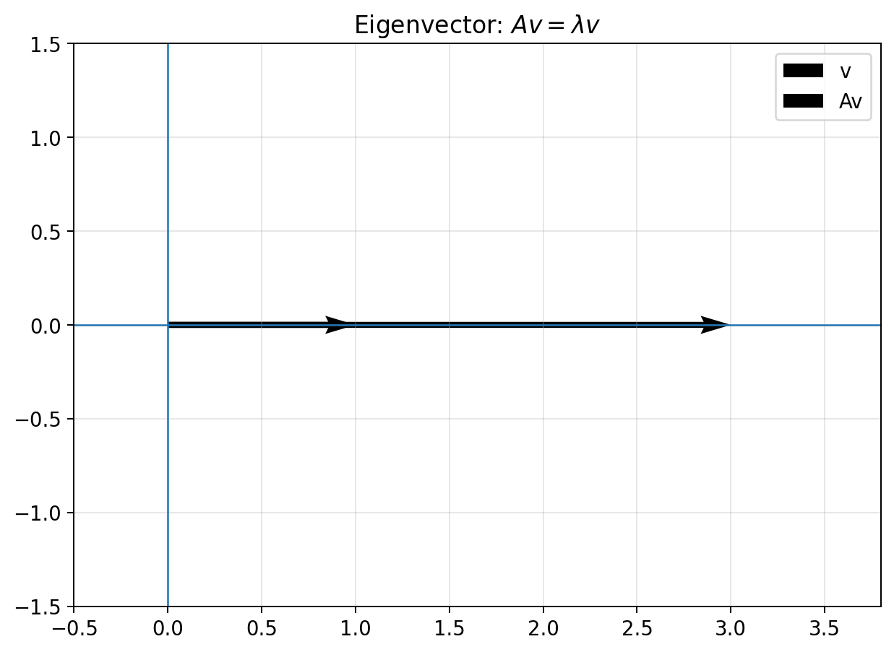
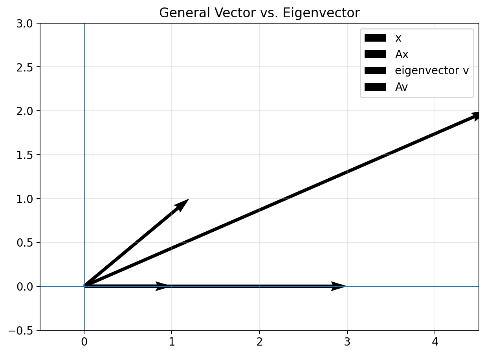
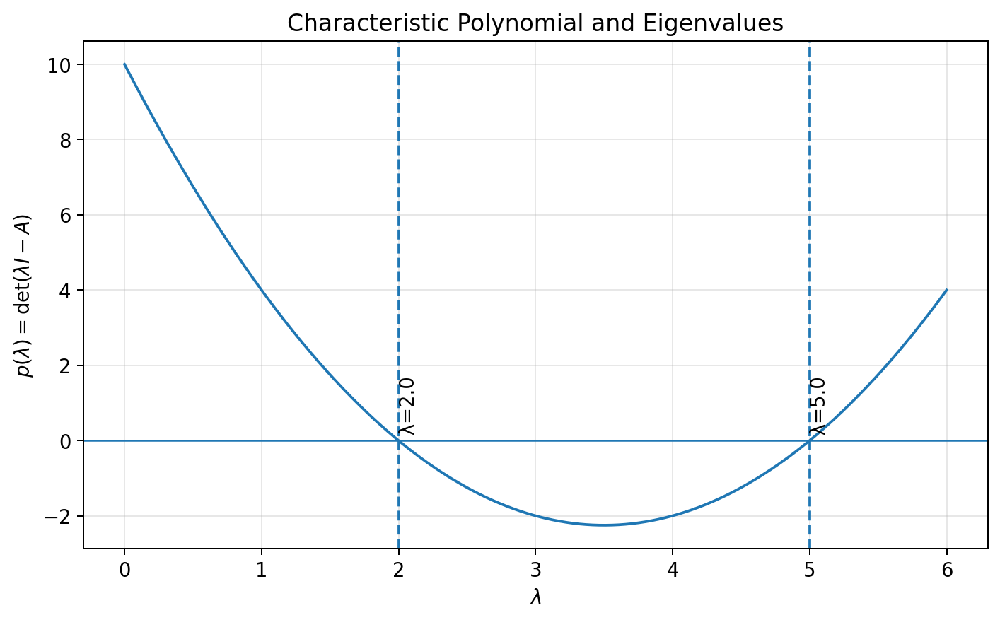
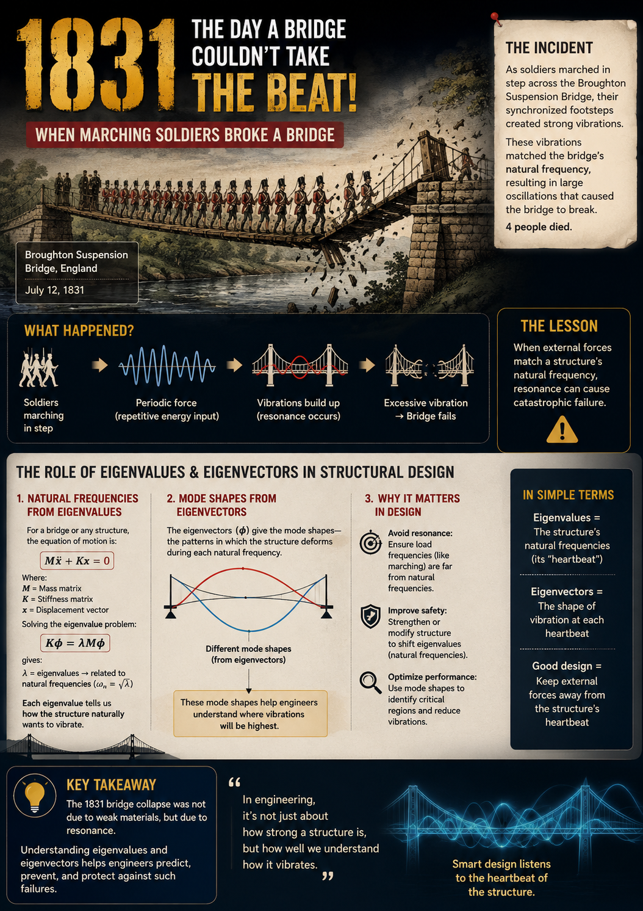
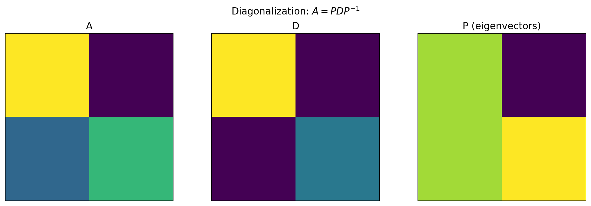
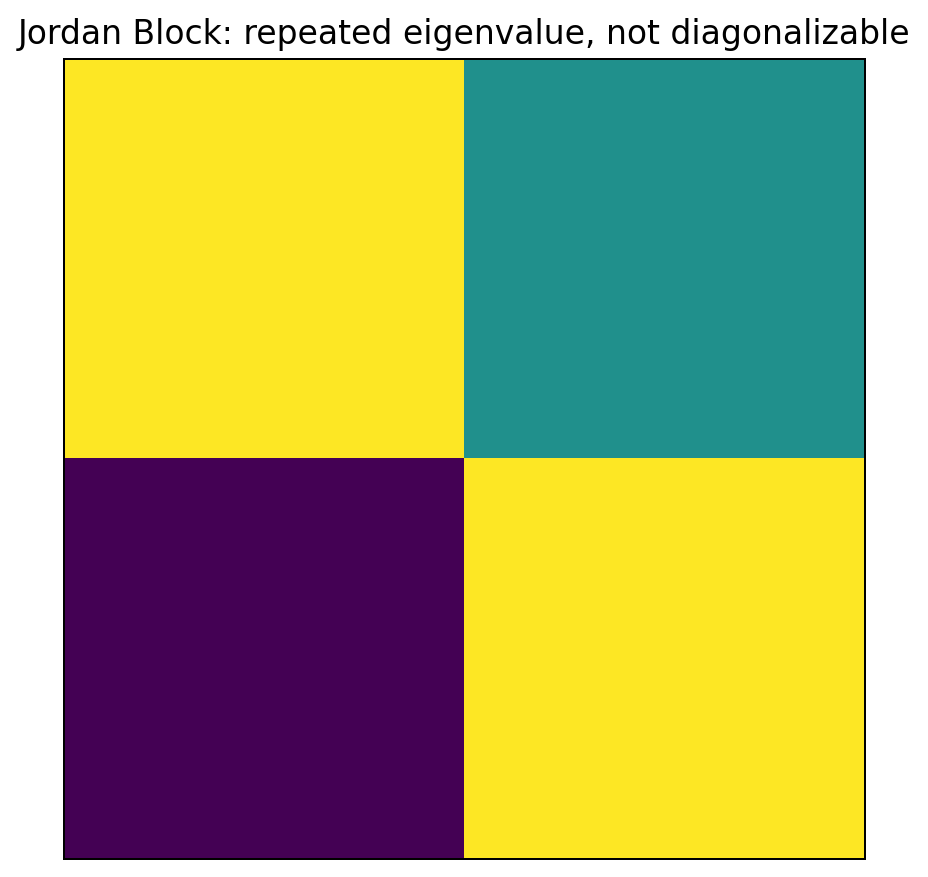
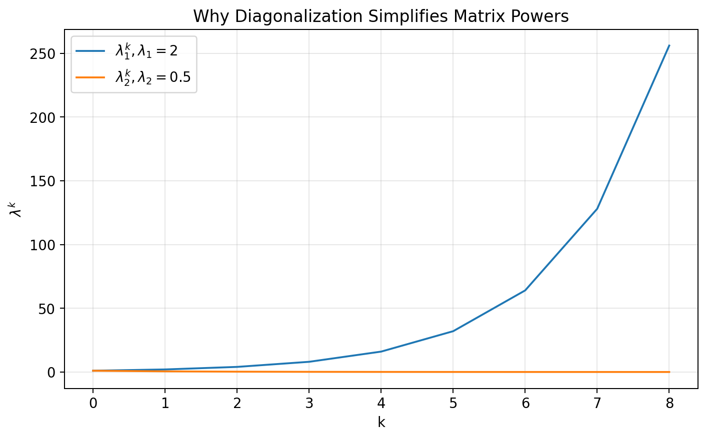
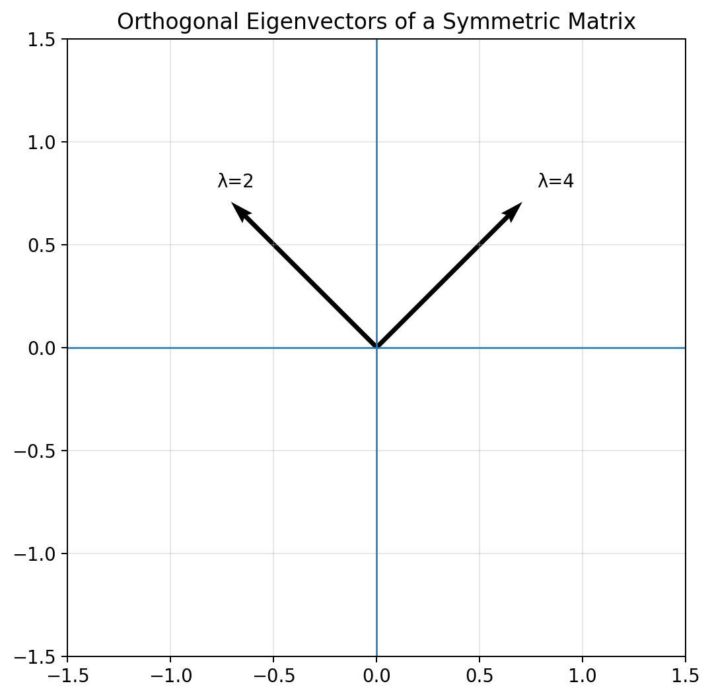

# :classical_building: Mathematics for IT Course - M.Tech. 1st Semester, IIIT Allahabad
## Unit 2: Eigen Analysis and Matrix Decomposition
* ### Current Topic: Eigenvalues and Eigenvectors, Characteristic Equations, and Diagonalization of Matrices
* #### Eigenvalues, eigenvectors, eigenspaces, characteristic equations, algebraic and geometric multiplicity, diagonalization, spectral decomposition, and Python implementation.


## 👥 Instructor Information
* **Edited by Instructor:** [Dr. Mohammed Javed](https://sites.google.com/site/mohammedjaved2016/)
* **Email:** javed@iiita.ac.in
* **Teaching Assistants:** Mr. Apurba Chakraborty (rsi2024005@iiita.ac.in)
---
## 🎯 1. Learning Objectives

After studying this material, you should be able to:

- define eigenvalues and eigenvectors;
- interpret the eigenvalue equation geometrically;
- compute eigenvalues using characteristic equations;
- find eigenvectors and eigenspaces;
- distinguish algebraic multiplicity from geometric multiplicity;
- determine whether a matrix is diagonalizable;
- construct a diagonalization $(A=PDP^{-1})$;
- use diagonalization to compute matrix powers;
- understand diagonalization of symmetric matrices;
- implement eigenvalue and eigenvector computations in Python;
- connect eigenvalue methods to differential equations, data science, PCA, dynamical systems, and machine learning.

---

# Part I — Eigenvalues and Eigenvectors

## 2. The Basic Idea

Let $(A)$ be an $(n\times n)$ matrix.

For a nonzero vector $(v)$, if

$$
\boxed{Av=\lambda v}
$$

for some scalar $(\lambda)$, then:

- $(v)$ is an **eigenvector** of $(A)$;
- $(\lambda)$ is the corresponding **eigenvalue**.

The vector must be nonzero:

$$
\boxed{v\neq0}.
$$

The equation says that applying $(A)$ to $(v)$ changes only its magnitude and possibly reverses its direction; it does not change the line through the origin containing $(v)$.



---

## 3. Why Eigenvectors Are Special

For a general vector $(x)$, $(Ax)$ will usually point in a different direction from $(x)$.

For an eigenvector $(v)$,

$$
Av=\lambda v.
$$

Thus $(Av)$ and $(v)$ are parallel.



If $(\lambda>1)$, the vector is stretched. If $(0<\lambda<1)$, it is contracted. If $(\lambda<0)$, its direction is reversed as well as scaled. If $(\lambda=0)$, it is mapped to the zero vector.

---

# Part II — Finding Eigenvalues

## 4. Deriving the Characteristic Equation

Start with

$$
Av=\lambda v.
$$

Then

$$
(A-\lambda I)v=0.
$$

For a nonzero solution $(v)$ to exist, $(A-\lambda I)$ must be singular. Hence,

$$
\boxed{\det(A-\lambda I)=0.}
$$

Equivalently, one may use

$$
\boxed{\det(\lambda I-A)=0.}
$$

This is the **characteristic equation**.

---

## 5. Characteristic Polynomial

The polynomial

$$
\boxed{p(\lambda)=\det(\lambda I-A)}
$$

is the **characteristic polynomial** of $(A)$.

Its roots are the eigenvalues.

For

$$
A=
\begin{bmatrix}
a&b\\
c&d
\end{bmatrix},
$$

$$
\boxed{
p(\lambda)=
\lambda^2-(a+d)\lambda+(ad-bc)
}
$$

or

$$
\boxed{
p(\lambda)=
\lambda^2-\text{tr}(A)\lambda+\det(A).
}
$$

---

## 6. Example: A $(2\times2)$ Matrix

Let

$$
A=
\begin{bmatrix}
4&1\\
2&3
\end{bmatrix}.
$$

Then

$$
\lambda I-A=
\begin{bmatrix}
\lambda-4&-1\\
-2&\lambda-3
\end{bmatrix}.
$$

Thus,

$$
p(\lambda)
=(\lambda-4)(\lambda-3)-2
=\lambda^2-7\lambda+10.
$$

So

$$
(\lambda-5)(\lambda-2)=0
$$

and therefore

$$
\boxed{\lambda_1=5,\qquad\lambda_2=2.}
$$



Note: if we take partial derivative at $\lambda_1$ and $\lambda_2$, the slope is positive (going up) and negative (coming down) respectively and to find minimum point put slope=0, we will get 7/2=3.5, which we can see clearly in the graph

---

# Part III — Finding Eigenvectors

## 7. Eigenvector Equation

Once an eigenvalue $(\lambda)$ is known, solve

$$
\boxed{(A-\lambda I)v=0.}
$$

The nonzero solutions form the **eigenspace** associated with $(\lambda)$.

For the example above:

### For $(\lambda=5)$

$$
A-5I=
\begin{bmatrix}
-1&1\\
2&-2
\end{bmatrix}.
$$

Hence

$$
-x+y=0,
$$

so $(y=x)$. One eigenvector is

$$
\boxed{
v_1=
\begin{bmatrix}
1\\
1
\end{bmatrix}.
}
$$

### For $(\lambda=2)$

$$
A-2I=
\begin{bmatrix}
2&1\\
2&1
\end{bmatrix}.
$$

Hence

$$
2x+y=0,
$$

so $(y=-2x)$. One eigenvector is

$$
\boxed{
v_2=
\begin{bmatrix}
1\\
-2
\end{bmatrix}.
}
$$

Importance of Eigenvalues and Eigenvectors in Structural Engineering, a real incident of breaking bridge with synchronized footsteps of soldiers took place in 1831, hence marching was banned on bridges.



---

# Part IV — Python Implementation

## 8. Eigenvalues with NumPy

```python
import numpy as np

A = np.array([
    [4, 1],
    [2, 3]
], dtype=float)

eigenvalues = np.linalg.eigvals(A)

print("Eigenvalues:")
print(eigenvalues)
```

---

## 9. Eigenvalues and Eigenvectors

```python
import numpy as np

A = np.array([
    [4, 1],
    [2, 3]
], dtype=float)

eigenvalues, eigenvectors = np.linalg.eig(A)

print("Eigenvalues:")
print(eigenvalues)

print("\nEigenvectors:")
print(eigenvectors)
```

The columns of `eigenvectors` correspond to the eigenvalues in the same order.

---

## 10. Verifying an Eigenpair

```python
import numpy as np

A = np.array([
    [4, 1],
    [2, 3]
], dtype=float)

eigenvalues, eigenvectors = np.linalg.eig(A)

for i in range(len(eigenvalues)):
    lam = eigenvalues[i]
    v = eigenvectors[:, i]

    print("Eigenvalue:", lam)
    print("Av:", A @ v)
    print("lambda*v:", lam * v)
    print("Verified:", np.allclose(A @ v, lam * v))
    print()
```

Use `np.allclose()` rather than exact equality because of floating-point arithmetic.

---

# Part V — Eigenspaces

## 11. Definition

For eigenvalue $(\lambda)$,

$$
\boxed{
E_\lambda=\ker(A-\lambda I).
}
$$

The eigenspace contains the zero vector and all eigenvectors associated with $(\lambda)$. The eigenvectors themselves are the nonzero members.

In two dimensions, an eigenspace may be a line through the origin or, in the special case $(A=\lambda I)$, the entire plane.

---

# Part VI — Algebraic and Geometric Multiplicity

## 12. Algebraic Multiplicity

The **algebraic multiplicity** is the multiplicity of an eigenvalue as a root of the characteristic polynomial.

For

$$
p(\lambda)=(\lambda-2)^3(\lambda+1),
$$

we have

$$
AM(2)=3,\qquad AM(-1)=1.
$$

---

## 13. Geometric Multiplicity

The **geometric multiplicity** is

$$
\boxed{
GM(\lambda)=\dim\ker(A-\lambda I).
}
$$

It is the dimension of the eigenspace.

For every eigenvalue,

$$
\boxed{
1\le GM(\lambda)\le AM(\lambda).
}
$$

---

# Part VII — Diagonalization

## 14. Definition

An $(n\times n)$ matrix $(A)$ is **diagonalizable** if there exists an invertible matrix $(P)$ and diagonal matrix $(D)$ such that

$$
\boxed{
A=PDP^{-1}.
}
$$

Equivalently,

$$
\boxed{
D=P^{-1}AP.
}
$$

The columns of $(P)$ are eigenvectors, and the diagonal entries of $(D)$ are their corresponding eigenvalues.

---

## 15. Why Diagonalization Is Useful

If

$$
A=PDP^{-1},
$$

then

$$
\boxed{A^k=PD^kP^{-1}}.
$$

Because $(D)$ is diagonal,

$$
D^k=
\begin{bmatrix}
\lambda_1^k&0&\cdots\\
0&\lambda_2^k&\cdots\\
\vdots&\vdots&\ddots
\end{bmatrix}.
$$

Therefore, matrix powers become much easier to compute.



---

# Part VIII — Example of Diagonalization

## 16. Diagonalize a $(2\times2)$ Matrix

For

$$
A=
\begin{bmatrix}
4&1\\
2&3
\end{bmatrix},
$$

the eigenvalues are

$$
5,\quad2
$$

with eigenvectors

$$
v_1=
\begin{bmatrix}
1\\
1
\end{bmatrix},
\qquad
v_2=
\begin{bmatrix}
1\\
-2
\end{bmatrix}.
$$

Thus,

$$
P=
\begin{bmatrix}
1&1\\
1&-2
\end{bmatrix},
\qquad
D=
\begin{bmatrix}
5&0\\
0&2
\end{bmatrix}.
$$

Then

$$
\boxed{A=PDP^{-1}}.
$$

---

## 17. Python Diagonalization

```python
import numpy as np

A = np.array([
    [4, 1],
    [2, 3]
], dtype=float)

eigenvalues, P = np.linalg.eig(A)

D = np.diag(eigenvalues)
P_inv = np.linalg.inv(P)

A_reconstructed = P @ D @ P_inv

print("Eigenvalues:")
print(eigenvalues)

print("\nP:")
print(P)

print("\nD:")
print(D)

print("\nP^-1:")
print(P_inv)

print("\nReconstructed A:")
print(A_reconstructed)

print("\nCorrect:", np.allclose(A, A_reconstructed))
```

---

# Part IX — When Is a Matrix Diagonalizable?

## 18. Distinct Eigenvalues

If an $(n\times n)$ matrix has $(n)$ distinct eigenvalues, then it is diagonalizable.

For example,

$$
A=
\begin{bmatrix}
2&1\\
0&3
\end{bmatrix}
$$

has eigenvalues $(2)$ and $(3)$, so it is diagonalizable.

---

## 19. Repeated Eigenvalues

Repeated eigenvalues do **not** automatically mean that a matrix is not diagonalizable.

For example,

$$
A=2I
$$

has repeated eigenvalue $(2)$, but every nonzero vector is an eigenvector. Hence it is diagonalizable.

---

## 20. A Non-Diagonalizable Matrix

Consider

$$
J=
\begin{bmatrix}
2&1\\
0&2
\end{bmatrix}.
$$

Its characteristic polynomial is

$$
(\lambda-2)^2.
$$

Thus,

$$
AM(2)=2.
$$

But solving

$$
(J-2I)v=0
$$

gives only a one-dimensional eigenspace, so

$$
GM(2)=1.
$$

Since

$$
GM(2)<AM(2),
$$

the matrix is not diagonalizable.



---

# Part X — Practical Diagonalizability Test

## 21. Criterion

An $(n\times n)$ matrix is diagonalizable if and only if it has $(n)$ linearly independent eigenvectors.

Equivalently,

$$
\boxed{
\sum_\lambda GM(\lambda)=n.
}
$$

A useful numerical check is the rank of the eigenvector matrix.

```python
import numpy as np

A = np.array([
    [4, 1],
    [2, 3]
], dtype=float)

eigenvalues, P = np.linalg.eig(A)

rank_P = np.linalg.matrix_rank(P)

if rank_P == A.shape[0]:
    print("A is diagonalizable.")
else:
    print("A is not diagonalizable.")
```

For nearly repeated eigenvalues, numerical rank decisions require appropriate tolerances.

---

# Part XI — Matrix Powers

## 22. Computing $(A^k)$

If

$$
A=PDP^{-1},
$$

then

$$
A^k=PD^kP^{-1}.
$$

Python:

```python
import numpy as np

A = np.array([
    [4, 1],
    [2, 3]
], dtype=float)

k = 10

eigenvalues, P = np.linalg.eig(A)
D = np.diag(eigenvalues)

A_power_diag = (
    P @ np.linalg.matrix_power(D, k)
    @ np.linalg.inv(P)
)

A_power_direct = np.linalg.matrix_power(A, k)

print("Using diagonalization:")
print(A_power_diag)

print("\nDirect method:")
print(A_power_direct)

print("\nSame:",
      np.allclose(A_power_diag, A_power_direct))
```



---

# Part XII — Symmetric Matrices

## 23. Special Case: Real Symmetric Matrices

If

$$
A=A^T,
$$

then:

1. all eigenvalues are real;
2. eigenvectors belonging to distinct eigenvalues are orthogonal;
3. $(A)$ is diagonalizable;
4. $(A)$ can be orthogonally diagonalized.

Specifically,

$$
\boxed{
A=Q\Lambda Q^T
}
$$

where $(Q^TQ=I)$.



---

## 24. Python Example

```python
import numpy as np

A = np.array([
    [3, 1],
    [1, 3]
], dtype=float)

eigenvalues, Q = np.linalg.eigh(A)
Lambda = np.diag(eigenvalues)

A_reconstructed = Q @ Lambda @ Q.T

print("Eigenvalues:")
print(eigenvalues)

print("\nQ^T Q:")
print(Q.T @ Q)

print("\nReconstructed A:")
print(A_reconstructed)
```

For symmetric matrices, prefer `np.linalg.eigh()` over `np.linalg.eig()`.

---

# Part XIII — Trace and Determinant

## 25. Trace

For an $(n\times n)$ matrix,

$$
\boxed{
\text{tr}(A)=\lambda_1+\cdots+\lambda_n.
}
$$

The eigenvalues are counted with algebraic multiplicity.

---

## 26. Determinant

$$
\boxed{
\det(A)=\lambda_1\lambda_2\cdots\lambda_n.
}
$$

Therefore,

$$
\boxed{
A\text{ is singular}
\iff
0\text{ is an eigenvalue}.
}
$$

Python verification:

```python
import numpy as np

A = np.array([
    [4, 1],
    [2, 3]
], dtype=float)

eigenvalues = np.linalg.eigvals(A)

print("Trace:", np.trace(A))
print("Sum of eigenvalues:", np.sum(eigenvalues))

print("Determinant:", np.linalg.det(A))
print("Product of eigenvalues:", np.prod(eigenvalues))
```

---

# Part XIV — Cayley–Hamilton Theorem

## 27. Statement

A square matrix satisfies its own characteristic equation.

If

$$
p(\lambda)=
\lambda^n+c_{n-1}\lambda^{n-1}+\cdots+c_0,
$$

then

$$
\boxed{
p(A)=0.
}
$$

For a $(2\times2)$ matrix,

$$
\boxed{
A^2-\text{tr}(A)A+\det(A)I=0.
}
$$

This provides another method for reducing high powers of matrices.

---

# Part XV — Special Matrices

## 28. Diagonal Matrix

For

$$
D=\text{diag}(d_1,\ldots,d_n),
$$

the eigenvalues are simply

$$
\boxed{d_1,\ldots,d_n}.
$$

---

## 29. Triangular Matrix

For an upper or lower triangular matrix, the eigenvalues are the diagonal entries:

$$
\boxed{\lambda_i=a_{ii}}.
$$

---

## 30. Identity Matrix

For $(I)$,

$$
\lambda=1
$$

is the only eigenvalue, and every nonzero vector is an eigenvector.

---

## 31. Zero Matrix

For the zero matrix,

$$
\lambda=0
$$

is the only eigenvalue, and every nonzero vector is an eigenvector.

---

# Part XVI — Applications

## 32. Dynamical Systems

For

$$
x_{k+1}=Ax_k,
$$

we have

$$
x_k=A^kx_0.
$$

The magnitudes of eigenvalues determine long-term behavior:

- $(|\lambda|<1)$: decay;
- $(|\lambda|>1)$: growth;
- $(|\lambda|=1)$: persistent behavior;
- negative eigenvalues can cause sign alternation.

---

## 33. Differential Equations

For

$$
\frac{dx}{dt}=Ax,
$$

the solution is

$$
x(t)=e^{At}x(0).
$$

If

$$
A=PDP^{-1},
$$

then

$$
\boxed{
e^{At}=Pe^{Dt}P^{-1}
}
$$

and

$$
e^{Dt}=
\text{diag}
(e^{\lambda_1t},\ldots,e^{\lambda_nt}).
$$

---

## 34. Principal Component Analysis

PCA uses eigenvalues and eigenvectors of a covariance matrix $(C)$:

$$
Cv_i=\lambda_i v_i.
$$

The eigenvectors give principal directions, while the eigenvalues measure variance along those directions.

Large eigenvalues correspond to directions containing more variance.

---

## 35. Graphs and Networks

Eigenvalues and eigenvectors of adjacency matrices and graph Laplacians are used to study:

- connectivity;
- clusters;
- community structure;
- diffusion;
- spectral embeddings.

This is the basis of **spectral graph theory**.

---

## 36. Machine Learning

Eigenvalue methods appear in:

- PCA;
- spectral clustering;
- covariance analysis;
- kernel methods;
- dimensionality reduction;
- stability analysis;
- graph-based learning.

---

# Part XVII — Symbolic Python with SymPy

## 37. Characteristic Polynomial

```python
import sympy as sp

A = sp.Matrix([
    [4, 1],
    [2, 3]
])

lam = sp.symbols('lambda')

char_poly = A.charpoly(lam)

print("Characteristic polynomial:")
print(char_poly.as_expr())

print("\nEigenvalues:")
print(A.eigenvals())
```

---

## 38. Symbolic Eigenvectors

```python
import sympy as sp

A = sp.Matrix([
    [4, 1],
    [2, 3]
])

print(A.eigenvects())
```

SymPy reports eigenvalues, algebraic multiplicities, and bases for corresponding eigenspaces.

---

# Part XVIII — Complete Analysis Function

## 39. Python Utility

```python
import numpy as np

def analyze_eigenvalues(A):

    A = np.asarray(A, dtype=float)

    if A.ndim != 2 or A.shape[0] != A.shape[1]:
        print("Matrix must be square.")
        return

    eigenvalues, eigenvectors = np.linalg.eig(A)

    print("Matrix:")
    print(A)

    print("\nEigenvalues:")
    print(eigenvalues)

    print("\nEigenvectors (columns):")
    print(eigenvectors)

    print("\nTrace:")
    print(np.trace(A))

    print("\nSum of eigenvalues:")
    print(np.sum(eigenvalues))

    print("\nDeterminant:")
    print(np.linalg.det(A))

    print("\nProduct of eigenvalues:")
    print(np.prod(eigenvalues))

    rank = np.linalg.matrix_rank(eigenvectors)

    print("\nEigenvector matrix rank:")
    print(rank)

    if rank == A.shape[0]:
        print("\nThe matrix is diagonalizable.")
    else:
        print("\nThe matrix is not diagonalizable.")


A = np.array([
    [4, 1],
    [2, 3]
])

analyze_eigenvalues(A)
```

---

# Part XIX — Common Mistakes

## 40. Mistake 1: Using the Zero Vector

The zero vector satisfies $(A0=\lambda0)$ for every $(\lambda)$, so it does not identify eigenvalues.

Eigenvectors must satisfy

$$
\boxed{v\neq0}.
$$

## 41. Mistake 2: Confusing Eigenvalues and Eigenvectors

An eigenvalue is a scalar. An eigenvector is a nonzero vector.

## 42. Mistake 3: Assuming Every Matrix Is Diagonalizable

Not every matrix is diagonalizable. A Jordan block is a standard counterexample.

## 43. Mistake 4: Assuming Repeated Eigenvalues Prevent Diagonalization

Repeated eigenvalues may still have enough independent eigenvectors. The identity matrix is an example.

## 44. Mistake 5: Ignoring Numerical Precision

Use:

```python
np.allclose(A @ v, lam * v)
```

rather than exact equality.

---

# Part XX — Important Theorems

## 45. Distinct Eigenvalues

Eigenvectors corresponding to distinct eigenvalues are linearly independent.

Therefore,

$$
\boxed{
n\text{ distinct eigenvalues}
\Rightarrow
A\text{ is diagonalizable}.
}
$$

## 46. Diagonalization Criterion

An $(n\times n)$ matrix is diagonalizable if and only if it has $(n)$ linearly independent eigenvectors.

## 47. Multiplicity Criterion

For every eigenvalue,

$$
1\le GM(\lambda)\le AM(\lambda).
$$

The matrix is diagonalizable exactly when it has enough independent eigenvectors to form a basis.

## 48. Spectral Theorem

For a real symmetric matrix,

$$
\boxed{
A=Q\Lambda Q^T.
}
$$

## 49. Singular Matrix Criterion

$$
\boxed{
\det(A)=0
\iff
0\text{ is an eigenvalue}.
}
$$

---

# Part XXI — Quick Reference

## 50. Essential Formulas

### Eigenvalue equation

$$
\boxed{Av=\lambda v}
$$

### Characteristic equation

$$
\boxed{\det(A-\lambda I)=0}
$$

### Characteristic polynomial

$$
\boxed{p(\lambda)=\det(\lambda I-A)}
$$

### Eigenspace

$$
\boxed{E_\lambda=\ker(A-\lambda I)}
$$

### Diagonalization

$$
\boxed{A=PDP^{-1}}
$$

### Equivalent form

$$
\boxed{D=P^{-1}AP}
$$

### Matrix powers

$$
\boxed{A^k=PD^kP^{-1}}
$$

### Symmetric diagonalization

$$
\boxed{A=Q\Lambda Q^T}
$$

### Trace

$$
\boxed{\text{tr}(A)=\sum_i\lambda_i}
$$

### Determinant

$$
\boxed{\det(A)=\prod_i\lambda_i}
$$

---

# 51. Python Quick Reference

```python
import numpy as np

# Eigenvalues
np.linalg.eigvals(A)

# Eigenvalues and eigenvectors
eigenvalues, eigenvectors = np.linalg.eig(A)

# Symmetric/Hermitian eigenproblem
np.linalg.eigh(A)

# Eigenvalues only for symmetric matrix
np.linalg.eigvalsh(A)

# Matrix rank
np.linalg.matrix_rank(A)

# Trace
np.trace(A)

# Determinant
np.linalg.det(A)

# Matrix power
np.linalg.matrix_power(A, k)

# Inverse
np.linalg.inv(A)

# Solve Ax=b
np.linalg.solve(A, b)

# Numerical equality
np.allclose(A, B)
```

For symbolic work:

```python
import sympy as sp

A = sp.Matrix(A)

A.charpoly()
A.eigenvals()
A.eigenvects()
```

---

# Part XXII — Practice Problems

## 52. Conceptual Questions

1. Define an eigenvalue and eigenvector.
2. Why must an eigenvector be nonzero?
3. What does $(Av=\lambda v)$ mean geometrically?
4. Define the characteristic polynomial.
5. What is the characteristic equation?
6. Define an eigenspace.
7. What is algebraic multiplicity?
8. What is geometric multiplicity?
9. State the relationship between algebraic and geometric multiplicity.
10. Define diagonalization.
11. When is a matrix diagonalizable?
12. Why are distinct eigenvalues useful for diagonalization?
13. Can a matrix with repeated eigenvalues be diagonalizable?
14. State the spectral theorem.
15. Explain why diagonalization simplifies matrix powers.
16. What does a zero eigenvalue tell you about a matrix?
17. Explain the relationship between trace and eigenvalues.
18. Explain the relationship between determinant and eigenvalues.

## 53. Computational Problems

### Problem 1
Find the eigenvalues and eigenvectors of

$$
A=\begin{bmatrix}2&1\\
1&2\end{bmatrix}.
$$

### Problem 2
Find the characteristic polynomial of

$$
A=\begin{bmatrix}3&2\\
1&4\end{bmatrix}.
$$

### Problem 3
Determine whether

$$
A=\begin{bmatrix}2&1\\
0&2\end{bmatrix}
$$

is diagonalizable.

### Problem 4
Diagonalize

$$
A=\begin{bmatrix}5&2\\
2&5\end{bmatrix}.
$$

### Problem 5
Use Python to verify $(A=PDP^{-1})$.

### Problem 6
Compute $(A^{20})$ using diagonalization.

### Problem 7
Use SymPy to calculate a characteristic polynomial symbolically.

### Problem 8
Verify numerically that

$$
\mathrm{tr}(A)=\sum_i\lambda_i.
$$

### Problem 9
Verify numerically that

$$
\det(A)=\prod_i\lambda_i.
$$

### Problem 10
Generate random matrices and investigate numerically how eigenvalues and eigenvectors behave.

---

# Part XXIII — Mini Project

## 54. Eigenvalue and Diagonalization Explorer

Build a Python program that reports:

1. the matrix;
2. its characteristic polynomial;
3. eigenvalues;
4. eigenvectors;
5. algebraic multiplicities;
6. eigenspace dimensions;
7. whether it is diagonalizable;
8. $(P)$ and $(D)$ if diagonalization exists;
9. a verification of $(A=PDP^{-1})$;
10. $(A^k)$ using diagonalization.

A basic starting point:

```python
import numpy as np

def diagonalization_report(A):

    A = np.asarray(A, dtype=float)

    n, m = A.shape

    if n != m:
        print("Matrix must be square.")
        return

    eigenvalues, P = np.linalg.eig(A)

    print("Matrix:")
    print(A)

    print("\nEigenvalues:")
    print(eigenvalues)

    print("\nEigenvectors:")
    print(P)

    rank_P = np.linalg.matrix_rank(P)

    print("\nRank of eigenvector matrix:", rank_P)

    if rank_P == n:

        D = np.diag(eigenvalues)
        A_reconstructed = P @ D @ np.linalg.inv(P)

        print("\nMatrix is diagonalizable.")
        print("\nD:")
        print(D)

        print("\nVerification:")
        print(np.allclose(A, A_reconstructed))

    else:
        print("\nMatrix is not diagonalizable.")


A = np.array([
    [4, 1],
    [2, 3]
], dtype=float)

diagonalization_report(A)
```

---

# 55. Final Summary

The central idea of eigenvalue theory is

$$
\boxed{Av=\lambda v}.
$$

A nonzero vector $(v)$ is an eigenvector if applying $(A)$ changes only its scale and possibly its direction.

To find eigenvalues, solve

$$
\boxed{\det(A-\lambda I)=0}.
$$

For each eigenvalue, solve

$$
\boxed{(A-\lambda I)v=0}
$$

to find its eigenvectors.

Diagonalization organizes eigenvectors into $(P)$ and eigenvalues into $(D)$:

$$
\boxed{A=PDP^{-1}}.
$$

This gives

$$
\boxed{A^k=PD^kP^{-1}},
$$

which is especially useful for powers and dynamical systems.

For real symmetric matrices,

$$
\boxed{A=Q\Lambda Q^T},
$$

where the eigenvectors can be chosen orthonormally and all eigenvalues are real.

Eigenvalue theory therefore provides a powerful framework for understanding linear transformations and is foundational to:

- matrix diagonalization;
- differential equations;
- dynamical systems;
- PCA;
- spectral graph theory;
- machine learning;
- dimensionality reduction;
- numerical linear algebra;
- stability analysis.

---

## Suggested Learning Sequence

$$
\boxed{
\text{Matrices}
\rightarrow
\text{Determinants}
\rightarrow
\text{Characteristic Equations}
\rightarrow
\text{Eigenvalues}
\rightarrow
\text{Eigenvectors}
\rightarrow
\text{Eigenspaces}
\rightarrow
\text{Diagonalization}
\rightarrow
\text{Applications}
}
$$

Mastering this sequence provides the foundation for more advanced topics such as **Jordan canonical form, spectral decomposition, singular value decomposition, PCA, and spectral methods in machine learning**.

---
## ❓: CHALLENGING Questions - Check Your Understanding 
* ➡️ **[Q-01]**
* ➡️ 

---
## 📚 References 
* **[R-01]** Linear Algebra by Gilbert Strang, MIT Press
* **[R-02]** AI Tools for examples and codes
