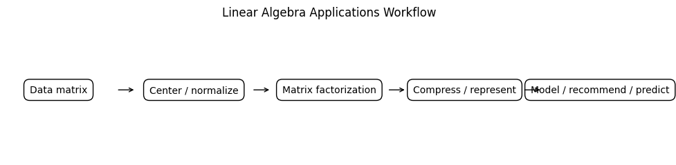
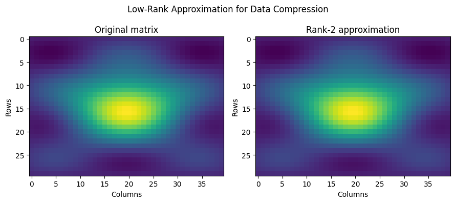
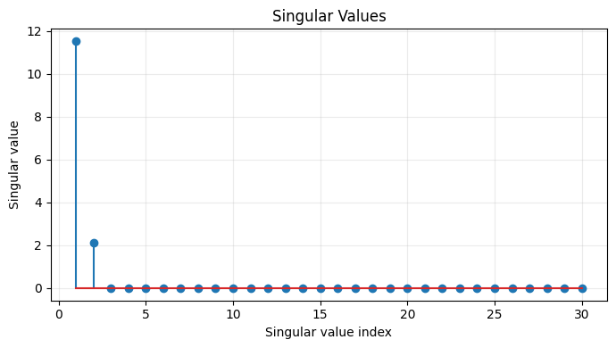
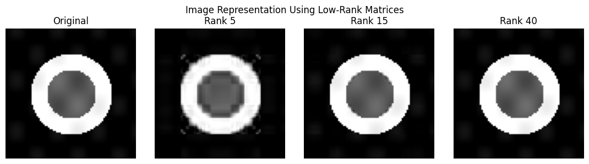
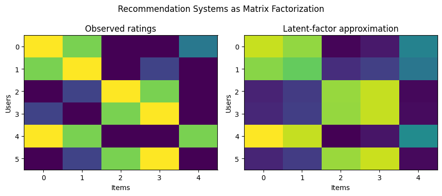
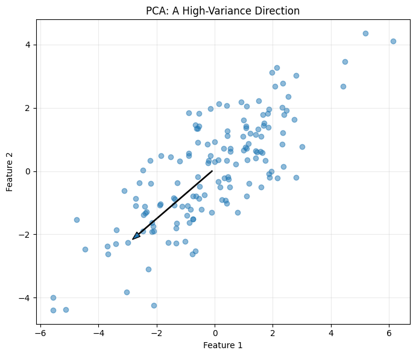
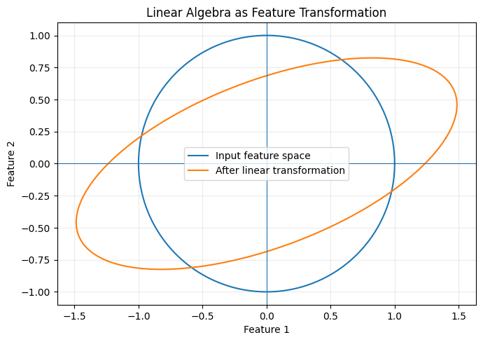

# :classical_building: Mathematics for IT Course - M.Tech. 1st Semester, IIIT Allahabad
## Unit 2: Eigen Analysis and Matrix Decomposition
* ### Current Topic: Linear Algebra Applications in Data Compression, Recommendation Systems, Image Representation, and Machine Learning
* #### Eigenvalues, eigenvectors, eigenspaces, characteristic equations, algebraic and geometric multiplicity, diagonalization, spectral decomposition, and Python implementation.
> **Prerequisites:** Vectors, matrices, matrix multiplication, transpose, and basic Python  
> **Tools:** NumPy, Matplotlib, and optionally scikit-learn


## 👥 Instructor Information
* **Edited by Instructor:** [Dr. Mohammed Javed](https://sites.google.com/site/mohammedjaved2016/)
* **Email:** javed@iiita.ac.in
* **Teaching Assistants:** Mr. Apurba Chakraborty (rsi2024005@iiita.ac.in)
---
## 🎯 1. Learning Objectives

After studying this material, you should be able to:

- explain how matrices represent real-world data;
- understand low-rank approximation as a basic compression technique;
- use SVD for data compression;
- represent images as matrices;
- explain recommendation systems using user-item matrices;
- understand matrix factorization and latent features;
- understand how linear algebra supports machine learning;
- explain the basic idea of PCA;
- implement these ideas using Python.

## 2. Why Linear Algebra Matters in Data Science

A large amount of modern data can be organized as matrices.

| Application | Matrix Representation |
|---|---|
| Spreadsheet/data table | Rows = observations, columns = features |
| Image | Rows × columns of pixel values |
| Recommendation system | Users × items |
| Text data | Documents × words |
| Neural-network layer | Weight matrix |
| Graph/network | Adjacency matrix |
| PCA | Covariance matrix / data matrix |

A general data matrix is

$$
X\in\mathbb{R}^{m\times n}.
$$

Linear algebra gives us tools to transform, compress, factorize, and analyze $(X)$.



---

# Part I — Data Compression

## 3. What Is Data Compression?

Data compression reduces the amount of information needed to store or transmit data.

### Lossless compression

The original data can be reconstructed exactly.

Examples include ZIP files and PNG images.

### Lossy compression

Some information is removed in exchange for smaller storage requirements.

Examples include JPEG-style image compression and approximate matrix representations.

Linear algebra is particularly useful for **lossy compression**.

## 4. Low-Rank Approximation

Instead of storing every element of a large matrix $(A)$, we may approximate it by a lower-rank matrix:

$$
A\approx A_k,
\qquad
\text{rank}(A_k)=k.
$$

The goal is to retain important information while reducing storage.



## 5. SVD and Compression

The Singular Value Decomposition is

$$
\boxed{A=U\Sigma V^T}.
$$

The singular values satisfy

$$
\sigma_1\geq\sigma_2\geq\cdots\geq0.
$$

A rank $(k)$ approximation is

$$
\boxed{A_k=U_k\Sigma_kV_k^T}.
$$

If the first few singular values are much larger than the remaining ones, a small $(k)$ can give a good approximation.



## 6. Python: Low-Rank Approximation

```python
import numpy as np

A = np.array([
    [5, 4, 3],
    [4, 4, 3],
    [3, 3, 2],
    [2, 2, 1]
], dtype=float)

U, s, Vt = np.linalg.svd(A, full_matrices=False)

k = 2
A_k = (U[:, :k] * s[:k]) @ Vt[:k, :]

print("Original matrix:")
print(A)

print("\nRank-k approximation:")
print(A_k)
```

## 7. Measuring Compression Error

A common error measure is the Frobenius norm:

$$
\boxed{
\|A-A_k\|_F=
\sqrt{\sum_{i,j}(a_{ij}-(a_k)_{ij})^2}.
}
$$

```python
error = np.linalg.norm(A - A_k, ord="fro")
print("Frobenius error:", error)

relative_error = (
    np.linalg.norm(A - A_k, ord="fro")
    / np.linalg.norm(A, ord="fro")
)
print("Relative error:", relative_error)
```

## 8. Storage Savings

An $(m\times n)$ matrix requires approximately

$$
mn
$$

numbers.

A rank $(k)$ SVD approximation requires approximately

$$
mk+k+nk=k(m+n+1)
$$

numbers.

When $(k\ll\min(m,n))$, the saving can be substantial.

---

# Part II — Image Representation

## 9. An Image Is a Matrix

A grayscale image can be represented as

$$
I\in\mathbb{R}^{m\times n}.
$$

Each matrix element represents a pixel intensity.

For an 8-bit grayscale image,

$$
0\leq I_{ij}\leq255.
$$

A color image usually has three channels:

$$
I\in\mathbb{R}^{m\times n\times3}.
$$

## 10. Image Compression Using SVD

For a grayscale image,

$$
I=U\Sigma V^T.
$$

Keeping only the first $(k)$ singular values gives

$$
\boxed{I_k=U_k\Sigma_kV_k^T}.
$$

A small $(k)$ can preserve broad structures while removing fine details.



## 11. Python Image Example

```python
import numpy as np
import matplotlib.pyplot as plt

x = np.linspace(-2, 2, 100)
y = np.linspace(-2, 2, 100)
X, Y = np.meshgrid(x, y)

image = np.exp(-(X**2 + Y**2))

U, s, Vt = np.linalg.svd(image, full_matrices=False)

ranks = [5, 15, 30]

fig, axes = plt.subplots(1, 4, figsize=(12, 3))

axes[0].imshow(image, cmap="gray")
axes[0].set_title("Original")
axes[0].axis("off")

for ax, k in zip(axes[1:], ranks):
    approximation = (U[:, :k] * s[:k]) @ Vt[:k, :]
    ax.imshow(approximation, cmap="gray")
    ax.set_title(f"Rank {k}")
    ax.axis("off")

plt.show()
```

The smaller the rank, the lower the storage requirement, but generally the greater the loss of detail.

---

# Part III — Recommendation Systems

## 12. What Is a Recommendation System?

Recommendation systems predict what a user might like.

Examples include:

- movies;
- songs;
- books;
- products;
- online courses;
- news articles.

A **user-item matrix** can store ratings:

$$
R=
\begin{bmatrix}
5&4&0&0\\
4&5&0&1\\
0&1&5&4\\
1&0&4&5
\end{bmatrix}.
$$

Rows represent users, columns represent items, and entries represent ratings.

A zero may mean that the user has not rated the item.

## 13. The Recommendation Problem

The matrix is usually incomplete:

$$
R=
\begin{bmatrix}
5&4&?&?\\
4&5&?&1\\
?&1&5&4\\
1&?&4&5
\end{bmatrix}.
$$

We want to estimate missing preferences.

One important approach is **matrix factorization**.

## 14. Matrix Factorization

We approximate

$$
\boxed{R\approx UV^T}.
$$

Here:

- $(U)$ represents users in a lower-dimensional latent space;
- $(V)$ represents items;
- the columns correspond to latent factors.

If

$$
U\in\mathbb{R}^{m\times k},
\qquad
V\in\mathbb{R}^{n\times k},
$$

then

$$
UV^T\in\mathbb{R}^{m\times n}.
$$



## 15. Latent Factors

A latent factor is an underlying characteristic that may not be explicitly recorded.

For movies, factors might approximately capture preferences for action, comedy, drama, science fiction, or romance.

A predicted preference can be modeled using a dot product:

$$
\boxed{\hat r_{ui}=u_i^Tv_j}.
$$

## 16. Simple SVD Recommendation Example

```python
import numpy as np

R = np.array([
    [5, 4, 0, 0, 2],
    [4, 5, 0, 1, 0],
    [0, 1, 5, 4, 0],
    [1, 0, 4, 5, 0],
    [5, 4, 0, 0, 4],
    [0, 1, 4, 5, 0]
], dtype=float)

U, s, Vt = np.linalg.svd(R, full_matrices=False)

k = 2
R_hat = (U[:, :k] * s[:k]) @ Vt[:k, :]

print("Original ratings:")
print(R)

print("\nLow-rank approximation:")
print(np.round(R_hat, 2))
```

**Important:** In real recommendation systems, missing ratings should normally not be treated as actual zero preferences. More advanced matrix-factorization algorithms optimize only over observed ratings.

## 17. Ranking Recommendations

```python
user = 0
predictions = R_hat[user]

ranking = np.argsort(predictions)[::-1]

print("Items ranked by predicted preference:")
print(ranking)
```

In practice, already-consumed items would usually be removed before producing recommendations.

---

# Part IV — Machine Learning

## 18. Linear Algebra in Machine Learning

Machine learning relies heavily on:

- vectors;
- matrices;
- matrix multiplication;
- dot products;
- norms;
- eigenvalues;
- eigenvectors;
- SVD;
- projections;
- transformations.

For example, a linear model is

$$
\boxed{\hat y=Xw+b}.
$$

Here $(X)$ is the feature matrix, $(w)$ contains model parameters, and $(b)$ is the bias.

## 19. Linear Regression

A least-squares problem seeks

$$
\min_w\|Xw-y\|_2^2.
$$

When appropriate, its analytical solution can be expressed as

$$
w=(X^TX)^{-1}X^Ty.
$$

In numerical code, however, it is usually better to solve the least-squares problem directly instead of explicitly computing an inverse.

```python
import numpy as np

x = np.array([1, 2, 3, 4, 5], dtype=float)
y = np.array([2, 4, 5, 8, 10], dtype=float)

X = np.column_stack([np.ones(len(x)), x])

w, residuals, rank, singular_values = np.linalg.lstsq(
    X, y, rcond=None
)

print("Intercept:", w[0])
print("Slope:", w[1])

y_pred = X @ w
print("Predictions:", y_pred)
```

## 20. Dot Products and Similarity

The dot product is

$$
\boxed{a^Tb=\sum_i a_ib_i}.
$$

It is fundamental in recommendation systems, information retrieval, neural networks, and classification.

```python
import numpy as np

a = np.array([1, 2, 3])
b = np.array([2, 1, 4])

print("Dot product:", a @ b)
```

## 21. Cosine Similarity

$$
\boxed{
\cos\theta=
\frac{a^Tb}{\|a\|\|b\|}
}
$$

```python
import numpy as np

a = np.array([1, 2, 3], dtype=float)
b = np.array([2, 1, 4], dtype=float)

similarity = (
    a @ b
    / (np.linalg.norm(a) * np.linalg.norm(b))
)

print("Cosine similarity:", similarity)
```

Cosine similarity is widely used for comparing text vectors and embeddings.

---

# Part V — PCA and Dimensionality Reduction

## 22. Why Reduce Dimensions?

Datasets may contain hundreds or thousands of features.

Some features can be redundant, correlated, or noisy.

Dimensionality reduction attempts to represent data with fewer variables while preserving important structure.

**Principal Component Analysis (PCA)** is one important example.

## 23. PCA Basic Idea

For centered data $(X_c)$, the covariance matrix is

$$
\boxed{
C=\frac{1}{n-1}X_c^TX_c.
}
$$

The principal directions are eigenvectors of $(C)$, and the corresponding eigenvalues describe variance along those directions.



## 24. PCA with NumPy

```python
import numpy as np

X = np.array([
    [2, 3],
    [3, 4],
    [4, 5],
    [5, 7],
    [6, 8]
], dtype=float)

X_centered = X - X.mean(axis=0)

C = np.cov(X_centered, rowvar=False)

eigenvalues, eigenvectors = np.linalg.eigh(C)

order = np.argsort(eigenvalues)[::-1]

eigenvalues = eigenvalues[order]
eigenvectors = eigenvectors[:, order]

print("Eigenvalues:")
print(eigenvalues)

print("\nPrincipal directions:")
print(eigenvectors)
```

## 25. Projection onto the First Principal Component

```python
principal_direction = eigenvectors[:, 0]

X_reduced = X_centered @ principal_direction

print("One-dimensional representation:")
print(X_reduced)
```

## 26. PCA with scikit-learn

```python
from sklearn.decomposition import PCA
import numpy as np

X = np.array([
    [2, 3],
    [3, 4],
    [4, 5],
    [5, 7],
    [6, 8]
], dtype=float)

pca = PCA(n_components=1)

X_reduced = pca.fit_transform(X)

print("Reduced data:")
print(X_reduced)

print("\nExplained variance ratio:")
print(pca.explained_variance_ratio_)
```

---

# Part VI — Linear Transformations in Machine Learning

## 27. Feature Transformations

A matrix can transform a vector:

$$
\boxed{y=Ax}.
$$

For example,

$$
A=
\begin{bmatrix}
1.4&0.5\\
0.2&0.8
\end{bmatrix}.
$$

This changes the coordinate representation of data.



Linear transformations are fundamental in feature engineering, dimensionality reduction, embeddings, computer vision, and neural networks.

## 28. Neural Networks and Matrices

A basic neural-network layer can be expressed as

$$
\boxed{z=Wx+b}.
$$

Then an activation function is applied:

$$
\boxed{a=f(z)}.
$$

For a batch of inputs:

$$
Z=XW^T+b.
$$

Thus, matrix multiplication allows large numbers of neural-network operations to be performed efficiently.

```python
import numpy as np

X = np.array([
    [1, 2, 3],
    [2, 1, 4],
    [3, 3, 2]
], dtype=float)

W = np.array([
    [0.5, 0.2, 0.1],
    [0.1, 0.4, 0.3]
])

b = np.array([0.1, 0.2])

Z = X @ W.T + b

A = np.maximum(0, Z)  # ReLU

print("Linear output:")
print(Z)

print("\nAfter ReLU:")
print(A)
```

---

# Part VII — A Unified View

## 29. Four Applications, One Mathematical Foundation

| Application | Matrix | Main Idea |
|---|---|---|
| Data compression | Data matrix | Low-rank approximation |
| Image representation | Pixel matrix | SVD / low-rank representation |
| Recommendation | User-item matrix | Matrix factorization |
| Machine learning | Feature matrix | Transformation, projection, optimization |

The common theme is

$$
\boxed{
\text{Represent data as matrices}
\rightarrow
\text{Transform or factorize}
\rightarrow
\text{Extract useful information}
}
$$

## 30. SVD as a Common Tool

$$
\boxed{A=U\Sigma V^T}
$$

can be interpreted as a sequence of coordinate transformations and scalings.

By keeping only the largest singular values, we obtain a lower-dimensional representation.

This explains why SVD appears in compression, image representation, recommendation systems, dimensionality reduction, noise reduction, and information retrieval.

## 31. Complete Mini Example

```python
import numpy as np

X = np.array([
    [5, 4, 3, 2],
    [4, 4, 3, 2],
    [3, 3, 2, 1],
    [2, 2, 1, 1],
    [5, 4, 3, 2]
], dtype=float)

U, s, Vt = np.linalg.svd(X, full_matrices=False)

print("Singular values:")
print(s)

k = 2

X_k = (U[:, :k] * s[:k]) @ Vt[:k, :]

print("\nOriginal:")
print(X)

print("\nRank-2 approximation:")
print(np.round(X_k, 2))

error = np.linalg.norm(X - X_k, ord="fro")
print("\nReconstruction error:")
print(error)
```

---

# Part VIII — Important Concepts

## 32. Rank

Rank is the number of linearly independent rows or columns of a matrix.

It measures the number of independent directions represented by the matrix.

## 33. Low Rank

A matrix is low rank when

$$
\text{rank}(A)\ll\min(m,n).
$$

Low-rank structure is useful because a large dataset can be represented with fewer parameters.

## 34. Singular Values

Large singular values correspond to important directions in the data.

Small singular values can correspond to small variations, noise, or less important information.

## 35. Latent Representation

A latent representation describes data using hidden or compressed features.

For example,

$$
R\approx UV^T.
$$

Instead of representing every user with thousands of item ratings, a user can be represented by a small latent vector.

## 36. Projection

Projection maps data onto a smaller subspace.

For a unit vector $(u)$,

$$
\boxed{
\text{proj}_u(x)=(x^Tu)u.
}
$$

Projection is fundamental to PCA and dimensionality reduction.

---

# Part IX — Practice Exercises

## 37. Conceptual Questions

1. What is a matrix representation of data?
2. Explain lossless and lossy compression.
3. What is a low-rank approximation?
4. What does SVD stand for?
5. Write the SVD of a matrix.
6. Why can SVD be used for compression?
7. How can an image be represented using a matrix?
8. What is a user-item matrix?
9. What is matrix factorization?
10. What is a latent factor?
11. What is PCA?
12. Why is centering important in PCA?
13. What do PCA eigenvalues represent?
14. What is a linear transformation?
15. Why is matrix multiplication important in neural networks?

## 38. Programming Exercises

### Exercise 1 — SVD

Create a $(5\times5)$ matrix and calculate its SVD using NumPy.

### Exercise 2 — Low-Rank Approximation

Construct rank-1, rank-2, and rank-3 approximations and compare reconstruction errors.

### Exercise 3 — Image Compression

Load a grayscale image and perform SVD compression with

```python
k = 5
k = 20
k = 50
```

Compare the results.

### Exercise 4 — Recommendation System

Create a user-item matrix and use a low-rank method to estimate missing preferences.

### Exercise 5 — PCA

Create a dataset with three features and reduce it to two principal components.

### Exercise 6 — Neural-Network Layer

Implement

$$
Z=XW^T+b
$$

using NumPy.

### Exercise 7 — Compression Ratio

For an $(m\times n)$ matrix, compare

$$
mn
$$

with

$$
k(m+n+1).
$$

Experiment with different values of $(k)$.

---

# Part X — Mini Project

## 39. Build a Linear Algebra Data-Science Toolkit

Create a Python program that reports:

1. matrix dimensions;
2. matrix rank;
3. SVD;
4. singular-value visualization;
5. rank-$(k)$ approximation;
6. reconstruction error;
7. PCA;
8. projection onto principal components.

```python
import numpy as np

def matrix_analysis(X, k=2):

    X = np.asarray(X, dtype=float)

    print("Shape:", X.shape)
    print("Rank:", np.linalg.matrix_rank(X))

    U, s, Vt = np.linalg.svd(X, full_matrices=False)

    print("\nSingular values:")
    print(s)

    k = min(k, len(s))

    X_k = (U[:, :k] * s[:k]) @ Vt[:k, :]

    error = np.linalg.norm(X - X_k, ord="fro")

    print("\nRank:", k)
    print("Reconstruction error:", error)

    return X_k


X = np.array([
    [5, 4, 3],
    [4, 4, 3],
    [3, 3, 2],
    [2, 2, 1]
])

X_approx = matrix_analysis(X, k=2)

print("\nApproximation:")
print(X_approx)
```

---

# 40. Summary

Linear algebra provides a mathematical language for representing and manipulating data.

### Data Compression

$$
\boxed{A\approx A_k}
$$

### SVD

$$
\boxed{A=U\Sigma V^T}
$$

and

$$
\boxed{A_k=U_k\Sigma_kV_k^T}.
$$

### Image Representation

$$
\boxed{I\in\mathbb{R}^{m\times n}}
$$

for a grayscale image.

### Recommendation Systems

$$
\boxed{R\approx UV^T}.
$$

### Machine Learning

$$
\boxed{\hat y=Xw+b}.
$$

### PCA

$$
\boxed{Cv=\lambda v}.
$$

### Neural Networks

$$
\boxed{Z=XW^T+b}.
$$

---

# 41. Key Takeaway

Many data-science problems can be expressed as operations on vectors and matrices:

$$
\boxed{
\text{Data}
\rightarrow
\text{Matrix Representation}
\rightarrow
\text{Linear Algebra}
\rightarrow
\text{Compact / Useful Representation}
\rightarrow
\text{Prediction or Decision}
}
$$

Understanding matrices, vector spaces, rank, projections, eigenvalues, eigenvectors, and SVD therefore provides an important mathematical foundation for **data science, artificial intelligence, machine learning, computer vision, recommendation systems, and data compression**.
