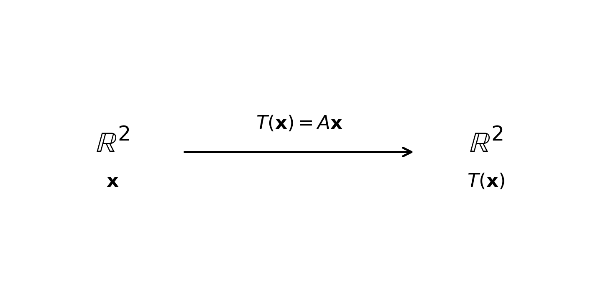
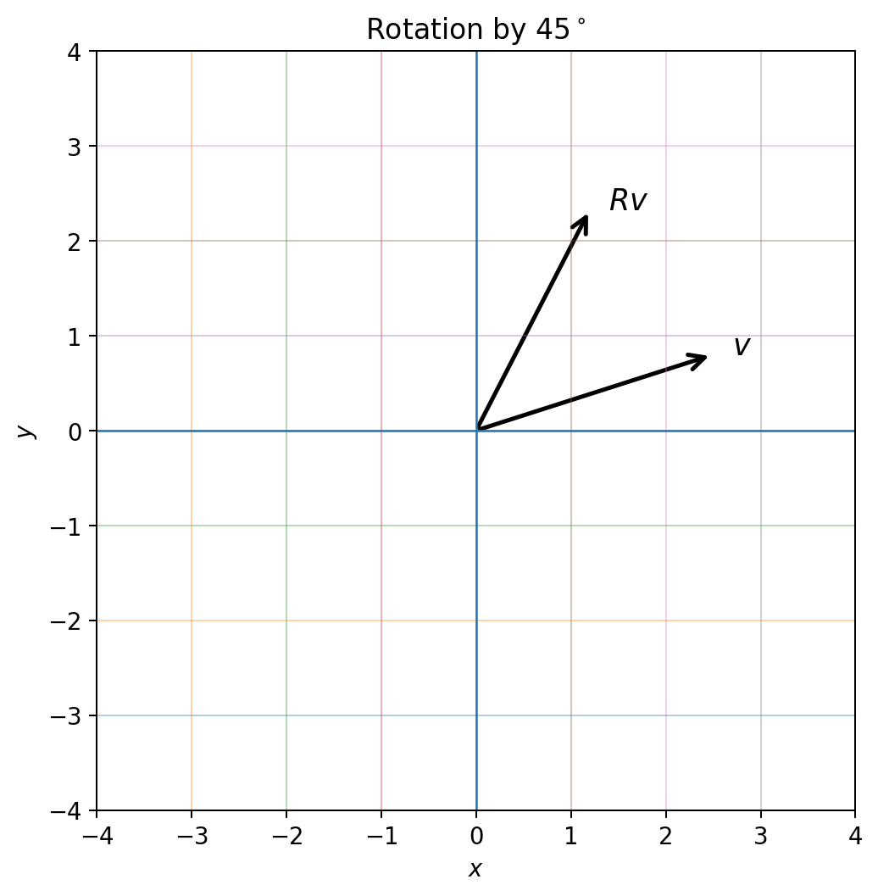
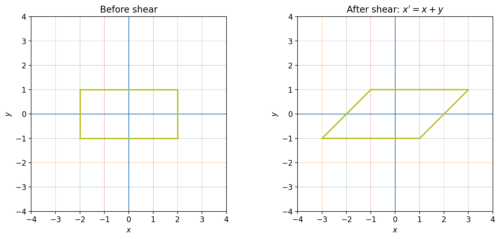
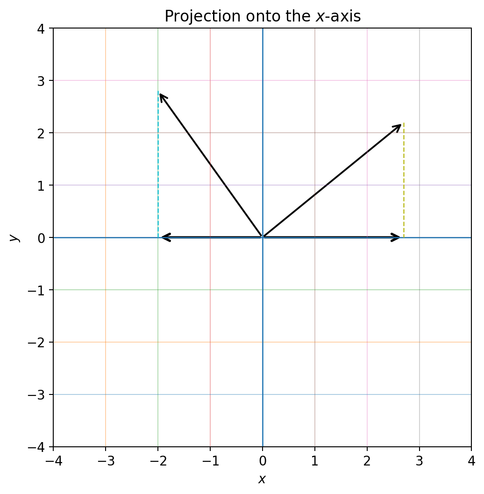
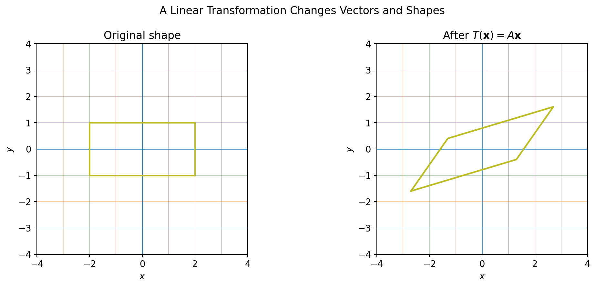
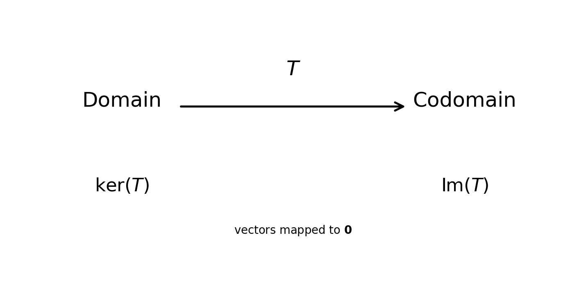
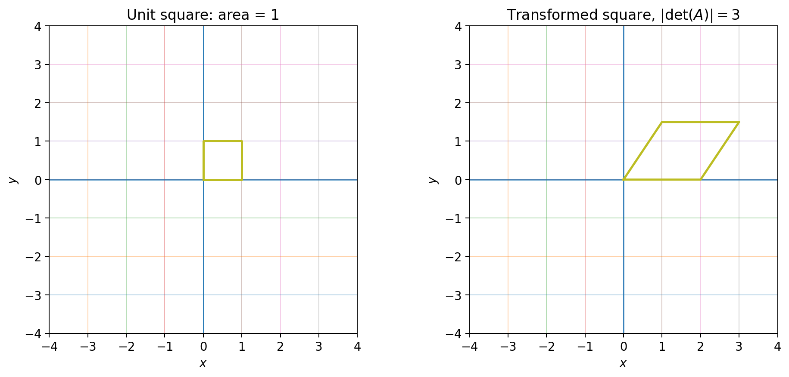
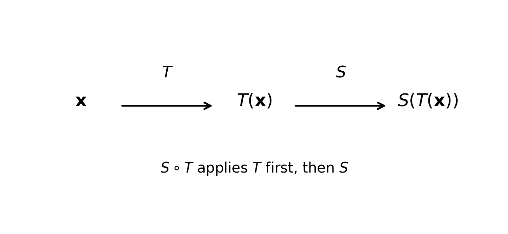

# :classical_building: Mathematics for IT Course - M.Tech. 1st Semester, IIIT Allahabad
## Unit 2: Eigen Analysis and Matrix Decomposition
* ### Current Topic: Linear Transformations — Reading Material with Python
* #### Python implementations and explanatory figures
---
## 👥 Instructor Information
* **Edited by Instructor:** [Dr. Mohammed Javed](https://sites.google.com/site/mohammedjaved2016/)
* **Email:** javed@iiita.ac.in
* **Teaching Assistants:** Mr. Apurba Chakraborty (rsi2024005@iiita.ac.in)
---
## 🎯 1. Learning Objectives

After studying this material, you should be able to:

- define a linear transformation precisely;
- test whether a function is linear;
- represent a linear transformation by a matrix;
- understand scaling, rotation, reflection, shear, and projection;
- compute the kernel (null space) and image (range);
- understand injective, surjective, and invertible transformations;
- use matrix composition to combine transformations;
- connect rank, nullity, determinant, and invertibility;
- implement these ideas using Python and NumPy.

---

## 2. What is a transformation?

A **transformation** is a function that maps vectors from one vector space to another:

\[
T:V\rightarrow W.
\]

For example,

\[
T:\mathbb{R}^2\rightarrow\mathbb{R}^2
\]

might map

\[
\begin{bmatrix}x\\y\end{bmatrix}
\]

to

\[
\begin{bmatrix}x+y\\2x-y\end{bmatrix}.
\]



A linear transformation is a special type of function whose behavior is compatible with vector addition and scalar multiplication.

---

## 3. Definition of a linear transformation

A function \(T:V\rightarrow W\) is **linear** if:

### Additivity

\[
T(\mathbf{u}+\mathbf{v})
=
T(\mathbf{u})+T(\mathbf{v}).
\]

### Homogeneity

For every scalar \(c\),

\[
T(c\mathbf{u})=cT(\mathbf{u}).
\]

Together,

\[
\boxed{
T(a\mathbf{u}+b\mathbf{v})
=
aT(\mathbf{u})+bT(\mathbf{v})
}
\]

for all vectors and scalars.

---

## 4. Examples of linear transformations

### 4.1 Scaling

\[
T(x,y)=(2x,3y)
\]

has matrix

\[
A=
\begin{bmatrix}
2&0\\
0&3
\end{bmatrix}.
\]

```python
import numpy as np

A = np.array([
    [2, 0],
    [0, 3]
])

x = np.array([1, 2])
y = A @ x

print("Original:", x)
print("Transformed:", y)
```

### 4.2 Rotation

A counterclockwise rotation through \(\theta\) is

\[
R_\theta=
\begin{bmatrix}
\cos\theta&-\sin\theta\\
\sin\theta&\cos\theta
\end{bmatrix}.
\]



```python
import numpy as np

theta = np.deg2rad(45)

R = np.array([
    [np.cos(theta), -np.sin(theta)],
    [np.sin(theta),  np.cos(theta)]
])

x = np.array([2, 1])
print(R @ x)
```

### 4.3 Reflection

Reflection about the \(x\)-axis:

\[
T(x,y)=(x,-y),
\qquad
A=
\begin{bmatrix}
1&0\\
0&-1
\end{bmatrix}.
\]

```python
import numpy as np

A = np.array([[1, 0], [0, -1]])
x = np.array([2, 3])

print(A @ x)
```

### 4.4 Shear

An \(x\)-direction shear is

\[
T(x,y)=(x+ky,y),
\qquad
A=
\begin{bmatrix}
1&k\\
0&1
\end{bmatrix}.
\]



```python
import numpy as np

A = np.array([[1, 1], [0, 1]])
x = np.array([2, 3])

print(A @ x)
```

### 4.5 Projection

Projection onto the \(x\)-axis:

\[
T(x,y)=(x,0),
\qquad
P=
\begin{bmatrix}
1&0\\
0&0
\end{bmatrix}.
\]



```python
import numpy as np

P = np.array([[1, 0], [0, 0]])
x = np.array([3, 4])

print(P @ x)
```

---

## 5. Matrix representation

Every linear transformation from \(\mathbb{R}^n\) to \(\mathbb{R}^m\) can be represented by an \(m\times n\) matrix:

\[
\boxed{T(\mathbf{x})=A\mathbf{x}}.
\]

For example,

\[
A=
\begin{bmatrix}
1&2\\
3&4
\end{bmatrix}
\]

and

\[
\mathbf{x}=
\begin{bmatrix}
5\\1
\end{bmatrix}
\]

give

\[
T(\mathbf{x})=
\begin{bmatrix}
7\\19
\end{bmatrix}.
\]

```python
import numpy as np

A = np.array([[1, 2], [3, 4]])
x = np.array([5, 1])

print(A @ x)
```

### Why does this work?

\[
A(\mathbf{u}+\mathbf{v})
=A\mathbf{u}+A\mathbf{v}
\]

and

\[
A(c\mathbf{u})=cA\mathbf{u}.
\]

Therefore matrix multiplication automatically satisfies linearity.

---

## 6. Geometric interpretation

Linear transformations can stretch, compress, rotate, reflect, shear, or project vectors.



A particularly useful property is

\[
\boxed{T(\mathbf{0})=\mathbf{0}}.
\]

If a transformation does not map zero to zero, it is not linear.

---

## 7. Testing whether a function is linear

Consider

\[
T(x,y)=(x+2,y-3).
\]

Since

\[
T(0,0)=(0,-3)\neq(0,0),
\]

it is **not linear**.

In contrast,

\[
T(x,y)=(x+2y,3x-y)
\]

is linear, with matrix

\[
A=
\begin{bmatrix}
1&2\\
3&-1
\end{bmatrix}.
\]

```python
import numpy as np

def T(x):
    return np.array([
        x[0] + 2*x[1],
        3*x[0] - x[1]
    ])

u = np.array([1, 2])
v = np.array([3, -1])
a, b = 2, -3

left = T(a*u + b*v)
right = a*T(u) + b*T(v)

print("Left :", left)
print("Right:", right)
print("Linear?", np.allclose(left, right))
```

---

## 8. Linear versus nonlinear transformations

For

\[
T(x,y)=(x^2,y),
\]

the squaring operation violates the linearity rules, so \(T\) is nonlinear.

Similarly,

\[
T(x)=3x+2
\]

is affine but not linear because

\[
T(0)=2\neq0.
\]

---

## 9. Standard basis and matrix columns

The standard basis of \(\mathbb{R}^2\) is

\[
\mathbf{e}_1=
\begin{bmatrix}1\\0\end{bmatrix},
\qquad
\mathbf{e}_2=
\begin{bmatrix}0\\1\end{bmatrix}.
\]

Since

\[
\mathbf{x}=x\mathbf{e}_1+y\mathbf{e}_2,
\]

linearity gives

\[
T(\mathbf{x})
=
xT(\mathbf{e}_1)+yT(\mathbf{e}_2).
\]

Therefore:

> **The columns of the matrix of a linear transformation are the images of the basis vectors.**

```python
import numpy as np

A = np.array([[1, 2], [3, 4]])
e1 = np.array([1, 0])
e2 = np.array([0, 1])

print("T(e1) =", A @ e1)
print("T(e2) =", A @ e2)
```

---

## 10. Kernel (null space)

The kernel is

\[
\boxed{
\ker(T)=\{\mathbf{x}:T(\mathbf{x})=\mathbf{0}\}
}.
\]

For \(T(\mathbf{x})=A\mathbf{x}\),

\[
\ker(T)=\{\mathbf{x}:A\mathbf{x}=0\}.
\]



Example:

\[
A=
\begin{bmatrix}
1&2\\
2&4
\end{bmatrix}.
\]

Solving \(A\mathbf{x}=0\) gives

\[
x+2y=0,
\]

so

\[
\ker(T)=
\left\{
t
\begin{bmatrix}
-2\\1
\end{bmatrix}:t\in\mathbb{R}
\right\}.
\]

### Python

```python
import sympy as sp

A = sp.Matrix([[1, 2], [2, 4]])

for vector in A.nullspace():
    print(vector)
```

---

## 11. Image (range)

The image is the set of all possible outputs:

\[
\boxed{
\operatorname{Im}(T)=\{T(\mathbf{x}):\mathbf{x}\in V\}
}.
\]

For a matrix transformation,

\[
\operatorname{Im}(T)=\operatorname{Col}(A).
\]

```python
import sympy as sp

A = sp.Matrix([[1, 2], [2, 4]])

for vector in A.columnspace():
    print(vector)
```

---

## 12. Rank and nullity

\[
\operatorname{rank}(T)=\dim(\operatorname{Im}(T))
\]

and

\[
\operatorname{nullity}(T)=\dim(\ker(T)).
\]

The Rank-Nullity Theorem is

\[
\boxed{
\dim(V)=\operatorname{rank}(T)+\operatorname{nullity}(T)
}.
\]

For an \(m\times n\) matrix,

\[
n=\operatorname{rank}(A)+\operatorname{nullity}(A).
\]

```python
import sympy as sp

A = sp.Matrix([[1, 2], [2, 4]])

rank = A.rank()
nullity = len(A.nullspace())

print("Rank:", rank)
print("Nullity:", nullity)
print("Rank + Nullity:", rank + nullity)
```

---

## 13. Injective, surjective, and invertible transformations

### Injective

\[
T(\mathbf{u})=T(\mathbf{v})\Rightarrow\mathbf{u}=\mathbf{v}.
\]

For a linear transformation,

\[
\boxed{
T\text{ is injective}\iff\ker(T)=\{\mathbf{0}\}
}.
\]

### Surjective

\[
\boxed{
T\text{ is surjective}\iff\operatorname{Im}(T)=W
}.
\]

### Invertible

For a square matrix,

\[
\boxed{
A\text{ invertible}\iff\det(A)\neq0
}.
\]

Equivalent conditions include:

- full rank;
- trivial kernel;
- linearly independent columns;
- injective transformation;
- surjective transformation.

```python
import numpy as np

A = np.array([[2, 1], [1, 3]], dtype=float)

if not np.isclose(np.linalg.det(A), 0):
    print("The transformation is invertible.")
    print(np.linalg.inv(A))
else:
    print("The transformation is not invertible.")
```

---

## 14. Determinant and geometric meaning

For

\[
A=
\begin{bmatrix}
a&b\\
c&d
\end{bmatrix},
\]

\[
\det(A)=ad-bc.
\]

For a 2D transformation, \(|\det(A)|\) is the area-scaling factor.



If

\[
\det(A)=0,
\]

the transformation collapses the plane into a lower-dimensional set and is not invertible.

---

## 15. Composition

If

\[
T(\mathbf{x})=A\mathbf{x}
\]

and

\[
S(\mathbf{x})=B\mathbf{x},
\]

then

\[
(S\circ T)(\mathbf{x})
=
B(A\mathbf{x})
=
(BA)\mathbf{x}.
\]

Thus,

\[
\boxed{[S\circ T]=BA}.
\]



Matrix multiplication is generally not commutative:

\[
AB\neq BA.
\]

```python
import numpy as np

A = np.array([[1, 1], [0, 1]])
B = np.array([[0, -1], [1, 0]])
x = np.array([2, 1])

print("A then B:", B @ A @ x)
print("B then A:", A @ B @ x)
```

---

## 16. Higher-dimensional transformations

Linear transformations also work in higher dimensions.

For

\[
A=
\begin{bmatrix}
1&2&3\\
4&5&6
\end{bmatrix},
\]

we have

\[
T:\mathbb{R}^3\rightarrow\mathbb{R}^2.
\]

```python
import numpy as np

A = np.array([[1, 2, 3], [4, 5, 6]])
x = np.array([1, 2, 3])

print(A @ x)
```

---

## 17. Solving systems using transformations

The system

\[
A\mathbf{x}=\mathbf{b}
\]

can be viewed as finding an input \(\mathbf{x}\) whose transformation equals \(\mathbf{b}\).

If \(A\) is invertible,

\[
\mathbf{x}=A^{-1}\mathbf{b}.
\]

```python
import numpy as np

A = np.array([[2, 1], [1, 3]], dtype=float)
b = np.array([5, 7], dtype=float)

x = np.linalg.solve(A, b)

print("Solution:", x)
print("Check:", A @ x)
```

---

## 18. Applications

Linear transformations are fundamental in:

- **Computer graphics:** rotation, scaling, reflection, projection, coordinate transformations.
- **Machine learning:** neural-network layers, embeddings, dimensionality reduction.
- **Data analytics:** feature transformations and coordinate changes.
- **Computer vision:** image transformations and camera models.
- **Engineering and physics:** coordinate systems and linear models.
- **Differential equations:** linear operators and linear systems.

---

## 19. Mini practical project

Experiment with the following matrices:

```python
import numpy as np

def investigate(A, x):
    A = np.asarray(A, dtype=float)
    x = np.asarray(x, dtype=float)

    y = A @ x

    print("Matrix A:\n", A)
    print("\nInput:", x)
    print("Output:", y)
    print("Rank:", np.linalg.matrix_rank(A))

    if A.shape[0] == A.shape[1]:
        print("Determinant:", np.linalg.det(A))

    return y

A = np.array([[1, 1], [0, 2]])
x = np.array([2, 1])

investigate(A, x)
```

Try:

```python
np.array([[2, 0], [0, 3]])
```

```python
np.array([[0, -1], [1, 0]])
```

```python
np.array([[1, 1], [0, 1]])
```

Observe the changes in rank, determinant, and output.

---

## 20. Common transformation matrices

### Scaling

\[
\begin{bmatrix}s_x&0\\0&s_y\end{bmatrix}
\]

### Rotation

\[
\begin{bmatrix}
\cos\theta&-\sin\theta\\
\sin\theta&\cos\theta
\end{bmatrix}
\]

### Reflection about \(x\)-axis

\[
\begin{bmatrix}1&0\\0&-1\end{bmatrix}
\]

### Reflection about \(y\)-axis

\[
\begin{bmatrix}-1&0\\0&1\end{bmatrix}
\]

### Projection onto \(x\)-axis

\[
\begin{bmatrix}1&0\\0&0\end{bmatrix}
\]

### Projection onto \(y\)-axis

\[
\begin{bmatrix}0&0\\0&1\end{bmatrix}
\]

### \(x\)-direction shear

\[
\begin{bmatrix}1&k\\0&1\end{bmatrix}
\]

### \(y\)-direction shear

\[
\begin{bmatrix}1&0\\k&1\end{bmatrix}
\]

---

## 21. Practice questions

1. Define a linear transformation.
2. State the two defining properties of linearity.
3. Why must \(T(0)=0\)?
4. Explain linear versus affine transformations.
5. Define kernel and image.
6. Explain rank and nullity.
7. State the Rank-Nullity Theorem.
8. Explain injective and surjective transformations.
9. When is a square matrix transformation invertible?
10. Why does transformation order matter?
11. Determine whether \(T(x,y)=(2x-y,3x+4y)\) is linear.
12. Find the matrix of \(T(x,y)=(x+3y,2x-y)\).
13. Find the kernel of \(\begin{bmatrix}1&2\\2&4\end{bmatrix}\).
14. Find its rank and nullity.
15. Determine whether \(\begin{bmatrix}2&1\\4&2\end{bmatrix}\) is invertible.
16. Write Python code to rotate a vector by \(90^\circ\).
17. Write Python code to project a vector onto the \(x\)-axis.
18. Implement a shear transformation and plot a square before and after.

---

## 22. Quick reference

| Concept | Key formula |
|---|---|
| Linearity | \(T(a\mathbf u+b\mathbf v)=aT(\mathbf u)+bT(\mathbf v)\) |
| Matrix transformation | \(T(\mathbf x)=A\mathbf x\) |
| Kernel | \(\ker(T)=\{\mathbf x:T(\mathbf x)=0\}\) |
| Image | \(\operatorname{Im}(T)=\{T(\mathbf x)\}\) |
| Rank | \(\dim(\operatorname{Im}(T))\) |
| Nullity | \(\dim(\ker(T))\) |
| Rank-Nullity | \(n=\operatorname{rank}+\operatorname{nullity}\) |
| Composition | \([S\circ T]=[S][T]\) |
| Inverse | \(A^{-1}A=AA^{-1}=I\) |
| Invertibility | \(\det(A)\neq0\) |

---

## 23. Python setup

```bash
pip install numpy matplotlib sympy
```

Then:

```python
import numpy as np
import matplotlib.pyplot as plt
import sympy as sp
```

---
## Conclusion

Linear transformations provide an important bridge between vector spaces and matrix computations. Once a transformation is represented by a matrix, geometric ideas such as rotation, scaling, projection, and shear can be studied using algebraic tools such as matrix multiplication, rank, nullity, and determinants.

This foundation is useful for later topics including eigenvalues and eigenvectors, change of basis, diagonalization, least squares, machine learning, computer graphics, and data analysis.

---
## ❓: CHALLENGING Questions - Check Your Understanding 
* ➡️ **[Q-01]**
* ➡️ 

---
## 📚 References 
* **[R-01]** Linear Algebra by Gilbert Strang, MIT Press
* **[R-02]** ChatGPT - for examples and codes

