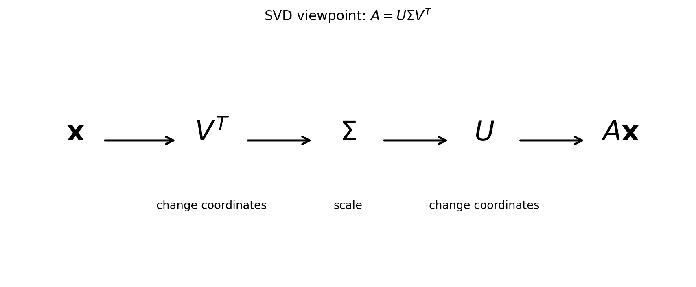
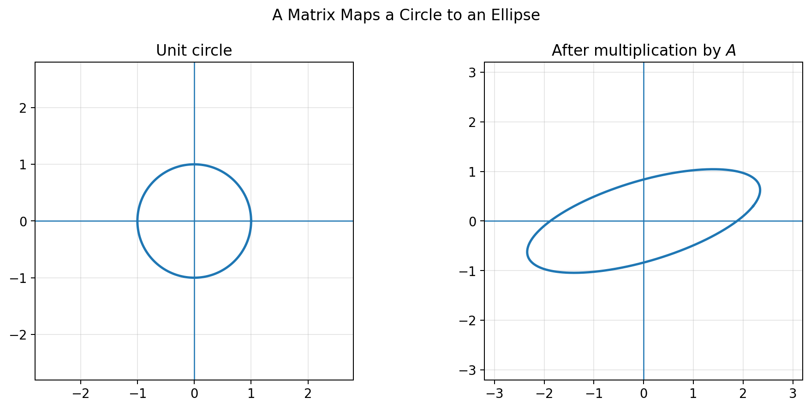
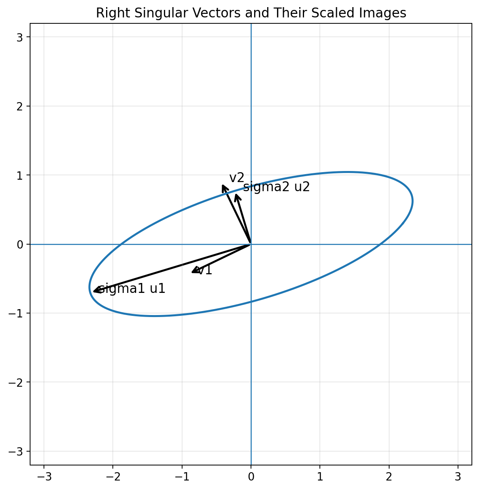
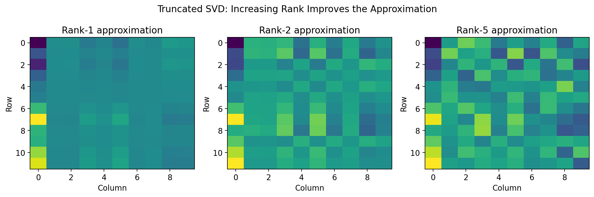
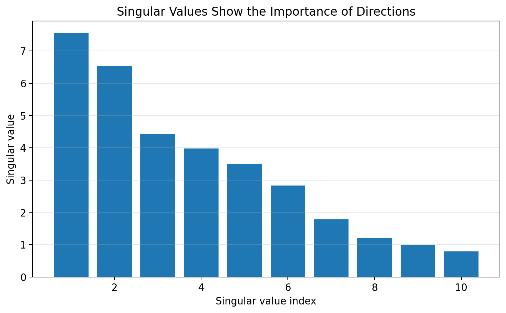
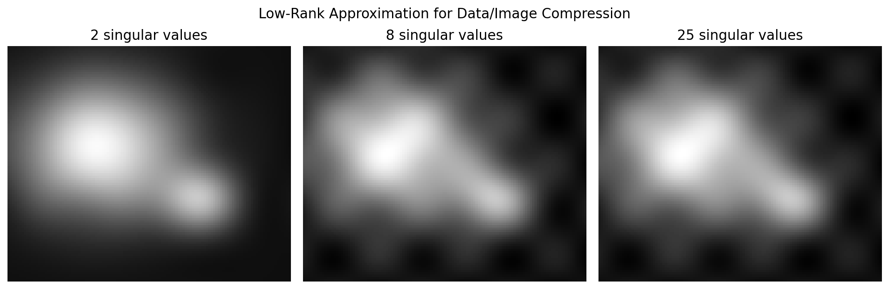
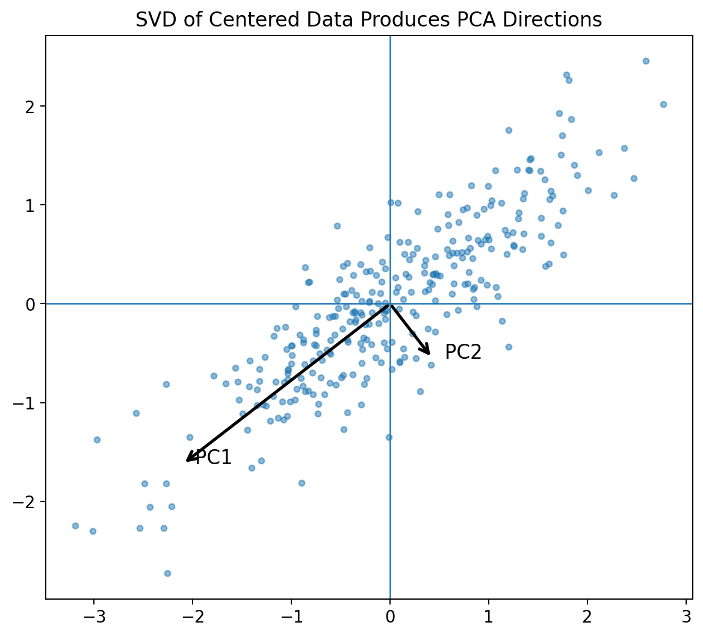
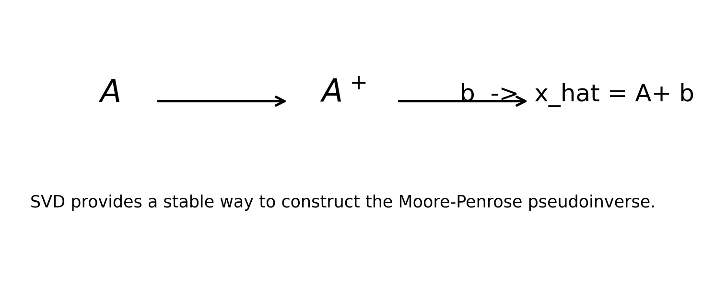

# :classical_building: Mathematics for IT Course - M.Tech. 1st Semester, IIIT Allahabad
## Unit 2: Eigen Analysis and Matrix Decomposition
* ### Current Topic: Singular Value Decomposition (SVD) — Reading Material with Python
* #### with mathematical explanations, Python implementations, and figures
---
## 👥 Instructor Information
* **Edited by Instructor:** [Dr. Mohammed Javed](https://sites.google.com/site/mohammedjaved2016/)
* **Email:** javed@iiita.ac.in
* **Teaching Assistants:** Mr. Apurba Chakraborty (rsi2024005@iiita.ac.in)
---
## 🎯 1. Learning Objectives

After studying this material, you should be able to:

- explain Singular Value Decomposition (SVD);
- write $(A=U\Sigma V^T)$;
- understand $(U,\Sigma,V^T)$;
- compute SVD using NumPy;
- interpret singular values geometrically;
- determine matrix rank using singular values;
- construct low-rank approximations;
- understand the SVD–PCA connection;
- compute the Moore–Penrose pseudoinverse;
- use SVD for least-squares problems;
- understand applications in data science, machine learning, and image compression.

---

## 2. Introduction

The **Singular Value Decomposition**, usually abbreviated as **SVD**, is one of the most important matrix factorizations in linear algebra.

For a real matrix

$$
A\in\mathbb{R}^{m\times n},
$$

the SVD is

$$
\boxed{A=U\Sigma V^T}
$$

where $(U)$ and $(V)$ are orthogonal matrices and $(\Sigma)$ contains the **singular values**.

The singular values are conventionally arranged as

$$
\sigma_1\geq\sigma_2\geq\cdots\geq\sigma_r>0.
$$

SVD separates a matrix transformation into three simpler operations:

1. a rotation/reflection;
2. a scaling;
3. another rotation/reflection.



---

## 3. Geometric intuition

For a $(2\times2)$ matrix $(A)$, consider the unit circle

$$
\|\mathbf{x}\|=1.
$$

When $(A)$ acts on the circle, the result is generally an ellipse.



The SVD explains this transformation:

$$
A\mathbf{x}=U\Sigma V^T\mathbf{x}.
$$

The operations occur from right to left:

$$
\mathbf{x}
\xrightarrow{V^T}
V^T\mathbf{x}
\xrightarrow{\Sigma}
\Sigma V^T\mathbf{x}
\xrightarrow{U}
U\Sigma V^T\mathbf{x}.
$$

Thus:

- $(V^T)$ changes the input coordinate system;
- $(\Sigma)$ stretches or compresses along perpendicular directions;
- $(U)$ changes the output coordinate system.

---

## 4. The SVD formula

For

$$
A\in\mathbb{R}^{m\times n},
$$

the full SVD is

$$
\boxed{A=U\Sigma V^T}.
$$

The dimensions are

$$
U\in\mathbb{R}^{m\times m},
\qquad
\Sigma\in\mathbb{R}^{m\times n},
\qquad
V\in\mathbb{R}^{n\times n}.
$$

Because $(U)$ and $(V)$ are orthogonal,

$$
U^TU=I,
\qquad
V^TV=I.
$$

Therefore,

$$
U^{-1}=U^T,
\qquad
V^{-1}=V^T.
$$

---

## 5. Singular values

The diagonal entries of $(\Sigma)$ are the **singular values**:

$$
\Sigma=
\begin{bmatrix}
\sigma_1&0&\cdots\\
0&\sigma_2&\cdots\\
\vdots&\vdots&\ddots
\end{bmatrix}.
$$

They satisfy

$$
\sigma_i\geq0.
$$

Usually,

$$
\boxed{\sigma_1\geq\sigma_2\geq\cdots\geq\sigma_r\geq0}.
$$

Singular values tell us how strongly the matrix stretches different directions.

If $(\mathbf v_i)$ is a right singular vector, then

$$
\boxed{A\mathbf v_i=\sigma_i\mathbf u_i}
$$

where $(\mathbf u_i)$ is the corresponding left singular vector.



---

## 6. Right and left singular vectors

The columns of $(V)$ are the **right singular vectors**:

$$
V=[\mathbf v_1\ \mathbf v_2\ \cdots].
$$

The columns of $(U)$ are the **left singular vectors**:

$$
U=[\mathbf u_1\ \mathbf u_2\ \cdots].
$$

The key relation is

$$
A\mathbf v_i=\sigma_i\mathbf u_i.
$$

---

## 7. Compact and reduced SVD

If

$$
\operatorname{rank}(A)=r,
$$

the compact SVD is

$$
\boxed{A=U_r\Sigma_rV_r^T}
$$

with

$$
U_r\in\mathbb{R}^{m\times r},
\quad
\Sigma_r\in\mathbb{R}^{r\times r},
\quad
V_r\in\mathbb{R}^{n\times r}.
$$

The reduced SVD uses $(k=\min(m,n))$ singular directions and is often convenient in numerical computing.

---

## 8. Computing SVD with NumPy

NumPy provides `numpy.linalg.svd`.

```python
import numpy as np

A = np.array([
    [3, 1],
    [1, 3]
], dtype=float)

U, S, Vt = np.linalg.svd(A)

print("U =")
print(U)

print("\nSingular values =")
print(S)

print("\nV^T =")
print(Vt)
```

NumPy returns the singular values as a one-dimensional array `S`, rather than returning $(\Sigma)$ directly.

---

## 9. Reconstructing the matrix

```python
import numpy as np

A = np.array([
    [3, 1],
    [1, 3]
], dtype=float)

U, S, Vt = np.linalg.svd(A)

Sigma = np.diag(S)

A_reconstructed = U @ Sigma @ Vt

print(A_reconstructed)
print(np.allclose(A, A_reconstructed))
```

For a reduced SVD, this is also convenient:

```python
A_reconstructed = (U * S) @ Vt
```

Expected verification:

```text
True
```

---

## 10. Why $(A^TA)$ appears in SVD

Starting with

$$
A=U\Sigma V^T,
$$

we obtain

$$
A^TA
=
V\Sigma^T\Sigma V^T.
$$

Therefore, the columns of $(V)$ are eigenvectors of $(A^TA)$, and

$$
\boxed{\lambda_i(A^TA)=\sigma_i^2}.
$$

Hence,

$$
\boxed{\sigma_i=\sqrt{\lambda_i}}.
$$

Similarly,

$$
AA^T=U\Sigma\Sigma^TU^T,
$$

so the columns of $(U)$ are eigenvectors of $(AA^T)$.

---

## 11. Verifying the eigenvalue connection in Python

```python
import numpy as np

A = np.array([
    [3, 1],
    [1, 3]
], dtype=float)

U, S, Vt = np.linalg.svd(A)

eigenvalues, eigenvectors = np.linalg.eigh(A.T @ A)

print("Singular values:")
print(S)

print("\nEigenvalues of A^T A:")
print(eigenvalues)

print("\nSquared singular values:")
print(S**2)
```

`np.linalg.eigh` returns eigenvalues in ascending order, while SVD usually lists singular values in descending order.

---

## 12. Rank from singular values

The rank is the number of nonzero singular values:

$$
\boxed{\operatorname{rank}(A)=\#\{i:\sigma_i>0\}}.
$$

Because floating-point arithmetic may produce very small values instead of exact zero, use a tolerance.

```python
import numpy as np

A = np.array([
    [1, 2],
    [2, 4]
], dtype=float)

U, S, Vt = np.linalg.svd(A)

tol = 1e-10
rank = np.sum(S > tol)

print("Singular values:", S)
print("Rank:", rank)
```

---

## 13. Spectral norm

The spectral norm is the largest singular value:

$$
\boxed{\|A\|_2=\sigma_1}.
$$

```python
import numpy as np

A = np.array([
    [3, 1],
    [1, 3]
], dtype=float)

S = np.linalg.svd(A, compute_uv=False)

print("Spectral norm:", S[0])
print(np.linalg.norm(A, 2))
```

---

## 14. Frobenius norm

The Frobenius norm is

$$
\|A\|_F
=
\sqrt{\sum_{i,j}a_{ij}^2}.
$$

Using singular values,

$$
\boxed{
\|A\|_F=
\sqrt{\sigma_1^2+\sigma_2^2+\cdots+\sigma_r^2}.
}
$$

```python
import numpy as np

A = np.array([
    [3, 1],
    [1, 3]
], dtype=float)

S = np.linalg.svd(A, compute_uv=False)

print(np.sqrt(np.sum(S**2)))
print(np.linalg.norm(A, "fro"))
```

---

## 15. Condition number

For a full-rank matrix,

$$
\boxed{
\kappa_2(A)=\frac{\sigma_{\max}}{\sigma_{\min}}.
}
$$

A large condition number indicates greater sensitivity to small perturbations.

```python
import numpy as np

A = np.array([
    [1, 1],
    [1, 1.001]
], dtype=float)

S = np.linalg.svd(A, compute_uv=False)

print("Singular values:", S)
print("Condition number:", S[0] / S[-1])
```

---

## 16. Low-rank approximation

SVD can be written in outer-product form:

$$
A=
\sigma_1\mathbf u_1\mathbf v_1^T+
\sigma_2\mathbf u_2\mathbf v_2^T+\cdots+
\sigma_r\mathbf u_r\mathbf v_r^T.
$$

A rank-$(k)$ approximation is

$$
\boxed{
A_k=
\sum_{i=1}^{k}
\sigma_i\mathbf u_i\mathbf v_i^T
}.
$$



---

## 17. Why truncated SVD works

The singular values are ordered:

$$
\sigma_1\geq\sigma_2\geq\cdots.
$$

Often, the first few singular values capture most of the important structure.



The truncated approximation

$$
A_k=U_k\Sigma_kV_k^T
$$

can therefore represent the main structure using substantially fewer parameters.

---

## 18. Eckart–Young theorem

The **Eckart–Young theorem** states that the truncated SVD gives the best rank-$(k)$ approximation under both the 2-norm and Frobenius norm.

For the spectral norm,

$$
\boxed{
\|A-A_k\|_2=\sigma_{k+1}.
}
$$

For the Frobenius norm,

$$
\boxed{
\|A-A_k\|_F
=
\sqrt{\sigma_{k+1}^2+\sigma_{k+2}^2+\cdots}.
}
$$

---

## 19. Python rank-$(k)$ approximation

```python
import numpy as np

def low_rank_approximation(A, k):
    U, S, Vt = np.linalg.svd(A, full_matrices=False)
    return (U[:, :k] * S[:k]) @ Vt[:k, :]

A = np.array([
    [3, 1, 2],
    [1, 3, 4],
    [2, 4, 8]
], dtype=float)

A1 = low_rank_approximation(A, 1)
A2 = low_rank_approximation(A, 2)

print("Rank-1 approximation:")
print(A1)

print("\nRank-2 approximation:")
print(A2)
```

---

## 20. Image compression

A grayscale image can be represented as a matrix

$$
A\in\mathbb{R}^{m\times n}.
$$

Its SVD is

$$
A=U\Sigma V^T.
$$

Keeping only the first $(k)$ singular values gives

$$
A_k=U_k\Sigma_kV_k^T.
$$



```python
import numpy as np
import matplotlib.pyplot as plt

A = np.random.rand(100, 100)

U, S, Vt = np.linalg.svd(A, full_matrices=False)

k = 10
A_k = (U[:, :k] * S[:k]) @ Vt[:k, :]

plt.imshow(A_k, cmap="gray")
plt.axis("off")
plt.show()
```

---

## 21. Compression and storage

An $(m\times n)$ matrix contains

$$
mn
$$

entries.

A rank-$(k)$ SVD representation stores approximately

$$
mk+k+nk
$$

numbers:

$$
\boxed{k(m+n+1)}.
$$

When

$$
k\ll\min(m,n),
$$

this can provide substantial compression.

---

## 22. SVD and PCA

SVD is closely connected to **Principal Component Analysis (PCA)**.

For centered data $(X)$,

$$
X=U\Sigma V^T.
$$

The rows/columns of $(V^T)$, depending on the data convention, provide principal directions.

The singular values describe the amount of variation associated with these directions.



---

## 23. PCA using NumPy SVD

```python
import numpy as np

X = np.array([
    [2, 1],
    [3, 2],
    [4, 2],
    [5, 4],
    [6, 4]
], dtype=float)

X_centered = X - X.mean(axis=0)

U, S, Vt = np.linalg.svd(X_centered, full_matrices=False)

print("Principal directions:")
print(Vt)

print("\nSingular values:")
print(S)

variance = S**2
explained_variance_ratio = variance / variance.sum()

print("\nExplained variance ratio:")
print(explained_variance_ratio)
```

The explained variance ratio is

$$
\boxed{
\text{EVR}_i=
\frac{\sigma_i^2}{\sum_j\sigma_j^2}.
}
$$

---

## 24. Moore–Penrose pseudoinverse

For a square invertible matrix,

$$
A^{-1}
$$

is the inverse.

For rectangular or singular matrices, the **Moore–Penrose pseudoinverse** $(A^+)$ is useful.

If

$$
A=U\Sigma V^T,
$$

then

$$
\boxed{
A^+=V\Sigma^+U^T.
}
$$

The nonzero singular values in $(\Sigma)$ are replaced by their reciprocals.



---

## 25. Computing the pseudoinverse

NumPy provides:

```python
np.linalg.pinv(A)
```

Example:

```python
import numpy as np

A = np.array([
    [2, 1],
    [1, 2],
    [0, 1]
], dtype=float)

A_pinv = np.linalg.pinv(A)

print("Pseudoinverse:")
print(A_pinv)

print(np.allclose(A @ A_pinv @ A, A))
```

---

## 26. Least-squares solution

For an inconsistent system

$$
A\mathbf{x}=\mathbf b,
$$

we can find the least-squares solution minimizing

$$
\|A\mathbf{x}-\mathbf b\|_2.
$$

Using the pseudoinverse,

$$
\boxed{\hat{\mathbf{x}}=A^+\mathbf b}.
$$

```python
import numpy as np

A = np.array([
    [1, 1],
    [1, 2],
    [1, 3]
], dtype=float)

b = np.array([2, 2.8, 3.7])

x_hat = np.linalg.pinv(A) @ b

print("Least-squares solution:")
print(x_hat)

print("\nPredictions:")
print(A @ x_hat)
```

---

## 27. SVD from eigen-decomposition

SVD can be understood using the eigen-decomposition of $(A^TA)$.

Find

$$
A^TA\mathbf v_i=\lambda_i\mathbf v_i.
$$

Then

$$
\sigma_i=\sqrt{\lambda_i}.
$$

For nonzero $(\sigma_i)$,

$$
\mathbf u_i=\frac{A\mathbf v_i}{\sigma_i}.
$$

### Python

```python
import numpy as np

A = np.array([
    [3, 1],
    [1, 3]
], dtype=float)

eigenvalues, V = np.linalg.eigh(A.T @ A)

idx = np.argsort(eigenvalues)[::-1]
eigenvalues = eigenvalues[idx]
V = V[:, idx]

singular_values = np.sqrt(np.maximum(eigenvalues, 0))

U = np.zeros((A.shape[0], len(singular_values)))

for i, sigma in enumerate(singular_values):
    if sigma > 1e-12:
        U[:, i] = (A @ V[:, i]) / sigma

print("Singular values:")
print(singular_values)

print("\nU:")
print(U)

print("\nV:")
print(V)
```

For numerical work, prefer a direct SVD implementation such as `np.linalg.svd`, since explicitly forming $(A^TA)$ can worsen conditioning.

---

## 28. A reusable SVD analysis function

```python
import numpy as np

def analyze_svd(A, tolerance=1e-10):
    A = np.asarray(A, dtype=float)

    U, S, Vt = np.linalg.svd(A, full_matrices=False)

    rank = np.sum(S > tolerance)
    spectral_norm = S[0]
    frobenius_norm = np.sqrt(np.sum(S**2))

    print("Shape:", A.shape)
    print("Rank:", rank)
    print("Singular values:", S)
    print("Spectral norm:", spectral_norm)
    print("Frobenius norm:", frobenius_norm)

    return U, S, Vt

A = np.array([
    [3, 1, 2],
    [1, 3, 4],
    [2, 4, 8]
], dtype=float)

U, S, Vt = analyze_svd(A)
```

---

## 29. Important properties

For

$$
A=U\Sigma V^T,
$$

we have:

### Orthogonality

$$
U^TU=I,
\qquad
V^TV=I.
$$

### Singular values

$$
\sigma_i\geq0.
$$

### Eigenvalue connection

$$
\sigma_i^2=\lambda_i(A^TA).
$$

### Rank

$$
\operatorname{rank}(A)
=
\text{number of nonzero singular values}.
$$

### Spectral norm

$$
\|A\|_2=\sigma_1.
$$

### Frobenius norm

$$
\|A\|_F^2=\sum_i\sigma_i^2.
$$

### Condition number

$$
\kappa_2(A)=\frac{\sigma_1}{\sigma_r}.
$$

### Pseudoinverse

$$
A^+=V\Sigma^+U^T.
$$

---

## 30. SVD and the geometry of a matrix

For

$$
A\mathbf{x}=U\Sigma V^T\mathbf{x},
$$

think of the transformation as:

1. $(V^T)$: rotate/reflect the input coordinate system;
2. $(\Sigma)$: stretch/compress along perpendicular directions;
3. $(U)$: rotate/reflect into the final coordinate system.

This provides a powerful geometric interpretation of an arbitrary matrix.

---

## 31. Applications

SVD is used in:

### Machine learning

- PCA
- dimensionality reduction
- recommender systems
- latent semantic analysis
- feature extraction

### Data science

- noise reduction
- matrix approximation
- compression
- covariance analysis

### Computer vision

- image compression
- image denoising
- feature extraction
- geometric analysis

### Numerical computing

- least-squares problems
- pseudoinverse computation
- ill-conditioned systems
- low-rank approximation

---

## 32. Worked example

Consider

$$
A=
\begin{bmatrix}
3&0\\
0&2
\end{bmatrix}.
$$

The singular values are

$$
\sigma_1=3,\qquad\sigma_2=2.
$$

A valid SVD is

$$
A=
I
\begin{bmatrix}
3&0\\
0&2
\end{bmatrix}
I^T.
$$

The transformation stretches the $(x)$-direction by $(3)$ and the $(y)$-direction by $(2)$.

```python
import numpy as np

A = np.array([
    [3, 0],
    [0, 2]
], dtype=float)

U, S, Vt = np.linalg.svd(A)

print("U:")
print(U)

print("\nSingular values:")
print(S)

print("\nV^T:")
print(Vt)

Sigma = np.diag(S)
A_reconstructed = U @ Sigma @ Vt

print("\nReconstructed A:")
print(A_reconstructed)

print("\nCorrect?", np.allclose(A, A_reconstructed))
```

---

## 33. Numerical considerations

Although $(A^TA)$ can theoretically be used to derive SVD, forming it explicitly can worsen numerical conditioning.

For practical numerical work, prefer:

```python
np.linalg.svd(A)
```

Use a tolerance when estimating rank:

```python
tol = 1e-10
rank = np.sum(S > tol)
```

---

## 34. Practice questions

### Conceptual

1. Define Singular Value Decomposition.
2. Write $(A=U\Sigma V^T)$ and describe each factor.
3. What are singular values?
4. What is a right singular vector?
5. What is a left singular vector?
6. Explain the relation between SVD and $(A^TA)$.
7. How are singular values related to eigenvalues?
8. How can SVD determine matrix rank?
9. What is a low-rank approximation?
10. State the Eckart–Young theorem.
11. Explain the connection between SVD and PCA.
12. What is the Moore–Penrose pseudoinverse?
13. How can SVD solve least-squares problems?
14. What does a large condition number indicate?

### Computational

15. Compute the SVD of

$$
A=
\begin{bmatrix}
3&1\\
1&3
\end{bmatrix}.
$$

16. Reconstruct $(A)$ from $(U,\Sigma,V^T)$.

17. Find the singular values of

$$
A=
\begin{bmatrix}
1&2\\
2&4
\end{bmatrix}.
$$

18. Determine its rank.

19. Construct a rank-1 approximation.

20. Compute the spectral norm using SVD.

21. Compute the Frobenius norm using singular values.

22. Compute a pseudoinverse using Python.

23. Solve an overdetermined system using the pseudoinverse.

24. Perform PCA on centered data using SVD.

---

## 35. Quick reference

| Concept | Formula / idea |
|---|---|
| SVD | $(A=U\Sigma V^T)$ |
| Orthogonality | $(U^TU=I,\;V^TV=I)$ |
| Singular values | $(\sigma_i\geq0)$ |
| Right singular vectors | Columns of $(V)$ |
| Left singular vectors | Columns of $(U)$ |
| Key relation | $(A\mathbf v_i=\sigma_i\mathbf u_i)$ |
| Eigenvalue connection | $(\sigma_i^2=\lambda_i(A^TA))$ |
| Rank | Number of nonzero singular values |
| Spectral norm | $(\|A\|_2=\sigma_1)$ |
| Frobenius norm | $(\|A\|_F=\sqrt{\sum_i\sigma_i^2})$ |
| Condition number | $(\kappa_2=\sigma_{\max}/\sigma_{\min})$ |
| Rank-$(k)$ approximation | $(A_k=U_k\Sigma_kV_k^T)$ |
| Pseudoinverse | $(A^+=V\Sigma^+U^T)$ |
| Least squares | $(\hat x=A^+b)$ |
| PCA | SVD of centered data |

---

## 36. Python setup

```bash
pip install numpy matplotlib sympy
```

Then:

```python
import numpy as np
import matplotlib.pyplot as plt
import sympy as sp
```

---

## 37. Figures included

The `figures/` directory contains:

1. `01_svd_pipeline.png` — SVD as three sequential operations.
2. `02_circle_to_ellipse.png` — matrix mapping a unit circle to an ellipse.
3. `03_singular_vectors.png` — singular vectors and their scaled images.
4. `04_rank_k_approximation.png` — truncated SVD at different ranks.
5. `05_singular_values.png` — visualization of singular-value magnitudes.
6. `06_low_rank_compression.png` — low-rank approximation for image/data compression.
7. `07_svd_pca.png` — SVD directions and PCA.
8. `08_pseudoinverse.png` — SVD-based pseudoinverse concept.

---

## 38. Suggested GitHub folder structure

```text
svd_reading_material/
│
├── singular_value_decomposition.md
│
└── figures/
    ├── 01_svd_pipeline.png
    ├── 02_circle_to_ellipse.png
    ├── 03_singular_vectors.png
    ├── 04_rank_k_approximation.png
    ├── 05_singular_values.png
    ├── 06_low_rank_compression.png
    ├── 07_svd_pca.png
    └── 08_pseudoinverse.png
```

The Markdown uses relative paths such as:

```markdown

```

so the folder can be uploaded directly to GitHub and the figures will render automatically.

---

## Conclusion

Singular Value Decomposition is a fundamental tool for understanding matrices algebraically and geometrically.

The central factorization

$$
\boxed{A=U\Sigma V^T}
$$

separates a matrix into orthogonal transformations and scaling. The singular values reveal the most important directions and magnitudes of the transformation.

SVD connects several major concepts:

$$
\boxed{
\text{SVD}
\rightarrow
\text{Rank}
\rightarrow
\text{Low-rank approximation}
\rightarrow
\text{PCA}
\rightarrow
\text{Pseudoinverse}
\rightarrow
\text{Least squares}
}
$$

Because of these connections, SVD is one of the most useful tools in linear algebra, numerical computing, machine learning, data analytics, computer vision, and scientific computing.


## ❓: CHALLENGING Questions - Check Your Understanding 
* ➡️ **[Q-01]**
* ➡️ 

---
## 📚 References 
* **[R-01]** Linear Algebra by Gilbert Strang, MIT Press
* **[R-02]** ChatGPT - for examples and codes
