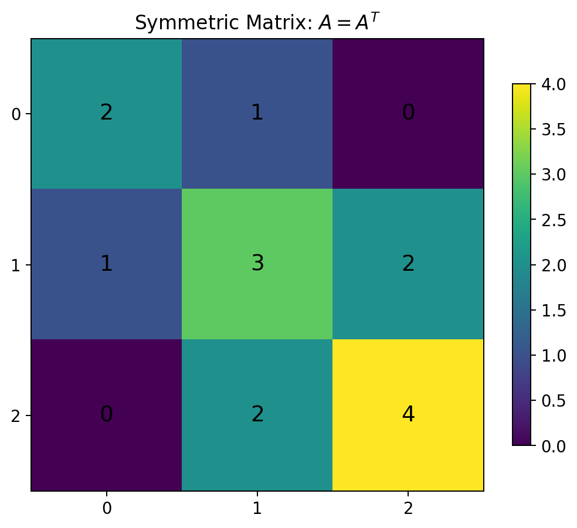
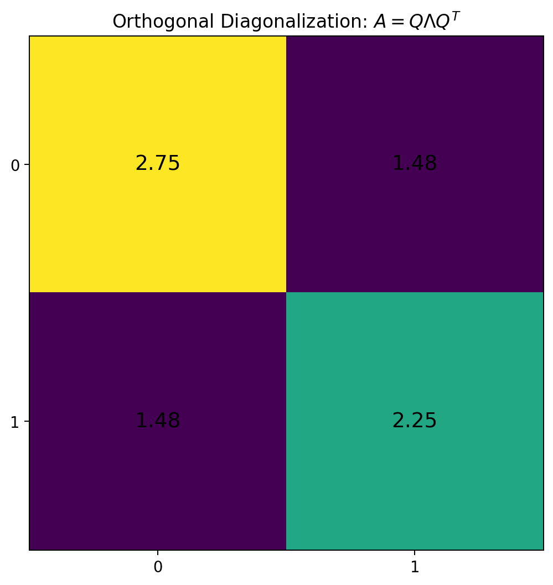
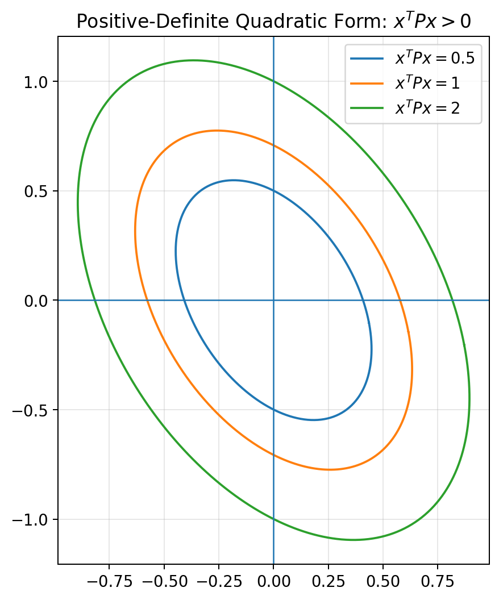
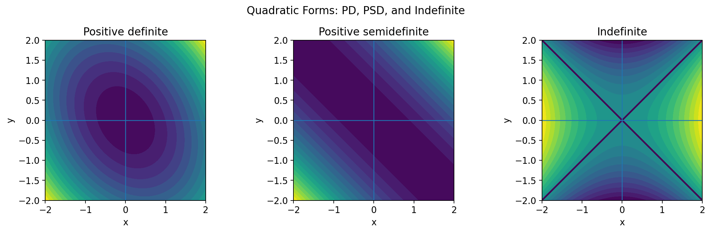
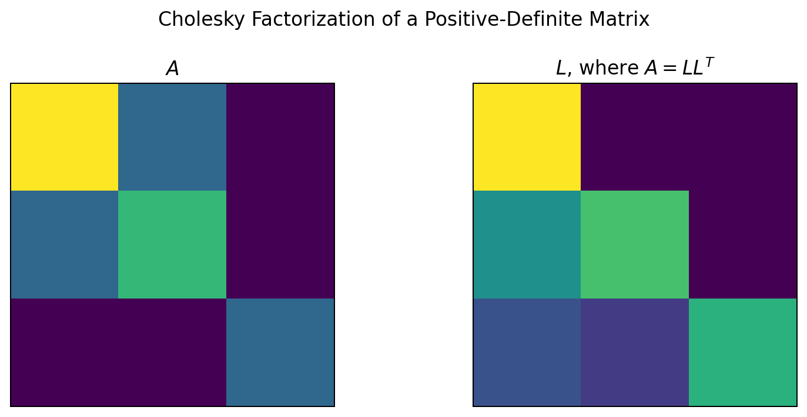
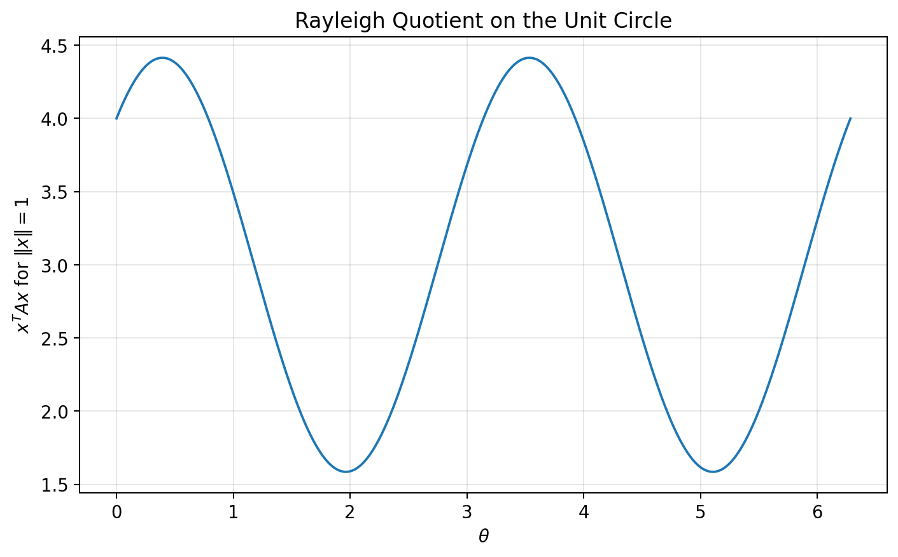
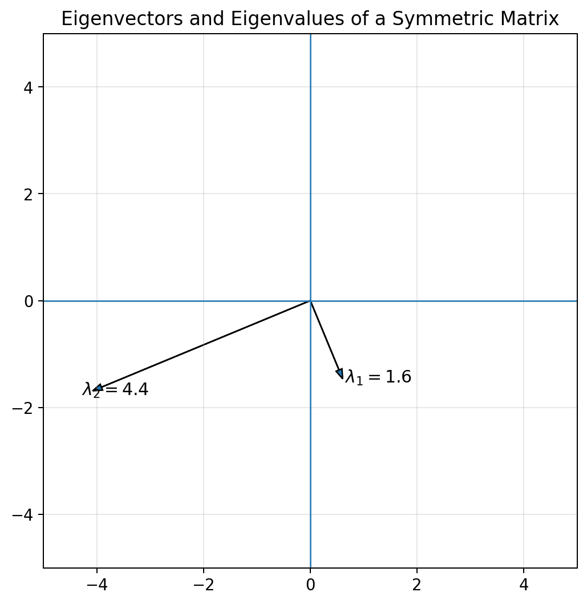

# :classical_building: Mathematics for IT Course - M.Tech. 1st Semester, IIIT Allahabad
## Unit 2: Eigen Analysis and Matrix Decomposition
* ### Current Topic: Symmetric Matrices, Positive Definite Matrices, and Similar Matrices
* #### Definitions, properties, geometric interpretation, eigenvalues, quadratic forms, matrix similarity, diagonalization, and Python implementation.
---
## 👥 Instructor Information
* **Edited by Instructor:** [Dr. Mohammed Javed](https://sites.google.com/site/mohammedjaved2016/)
* **Email:** javed@iiita.ac.in
* **Teaching Assistants:** Mr. Apurba Chakraborty (rsi2024005@iiita.ac.in)
---
## 🎯 1. Learning Objectives

After studying this material, you should be able to:

- define and identify symmetric matrices;
- explain positive definite, positive semidefinite, and indefinite matrices;
- evaluate quadratic forms such as $(x^TAx)$;
- understand the relationship between positive definiteness and eigenvalues;
- apply Sylvester's criterion;
- explain Cholesky factorization;
- understand why symmetric matrices have real eigenvalues;
- explain orthogonal diagonalization;
- define similar matrices;
- identify quantities that are preserved under similarity;
- use Python/NumPy to test and explore these concepts;
- connect these ideas to optimization, statistics, machine learning, and numerical methods.

---

# Part I — Symmetric Matrices

## 2. Definition of a Symmetric Matrix

A square matrix $(A)$ is **symmetric** if

$$
\boxed{A=A^T}
$$

where $(A^T)$ denotes the transpose of $(A)$.

If

$$
A=[a_{ij}],
$$

then symmetry means

$$
\boxed{a_{ij}=a_{ji}}
$$

for every $(i,j)$.

For example,

$$
A=
\begin{bmatrix}
2&1&0\\
1&3&2\\
0&2&4
\end{bmatrix}
$$

is symmetric because its entries mirror each other across the main diagonal.



---

## 3. Examples

### Symmetric

$$
A=
\begin{bmatrix}
1&2&3\\
2&4&5\\
3&5&6
\end{bmatrix}.
$$

### Not symmetric

$$
B=
\begin{bmatrix}
1&2\\
3&4
\end{bmatrix}
$$

because

$$
b_{12}=2\neq3=b_{21}.
$$

---

## 4. Testing Symmetry in Python

```python
import numpy as np

A = np.array([
    [1, 2, 3],
    [2, 4, 5],
    [3, 5, 6]
], dtype=float)

print(np.array_equal(A, A.T))
```

Output:

```text
True
```

For floating-point matrices, use a tolerance:

```python
print(np.allclose(A, A.T))
```

This is usually preferable in numerical computations.

---

## 5. Constructing a Symmetric Matrix

Any square matrix $(B)$ can be used to construct a symmetric matrix:

$$
\boxed{
A=B+B^T.
}
$$

For example:

```python
import numpy as np

B = np.array([
    [1, 2, 3],
    [4, 5, 6],
    [7, 8, 9]
], dtype=float)

A = B + B.T

print(A)
print("Symmetric:", np.allclose(A, A.T))
```

Another common construction is

$$
\boxed{
A=B^TB.
}
$$

This matrix is always symmetric and positive semidefinite.

---

# Part II — Properties of Symmetric Matrices

## 6. Real Eigenvalues

A fundamental theorem states:

> **Every real symmetric matrix has only real eigenvalues.**

If

$$
A=A^T,
$$

then every eigenvalue $(\lambda)$ of $(A)$ satisfies

$$
\lambda\in\mathbb R.
$$

This is extremely useful in numerical linear algebra.

---

## 7. Orthogonal Eigenvectors

Eigenvectors corresponding to distinct eigenvalues of a real symmetric matrix are orthogonal.

Suppose

$$
A\mathbf v_1=\lambda_1\mathbf v_1
$$

and

$$
A\mathbf v_2=\lambda_2\mathbf v_2
$$

with

$$
\lambda_1\neq\lambda_2.
$$

Then

$$
\boxed{
\mathbf v_1^T\mathbf v_2=0.
}
$$

---

## 8. Spectral Theorem

The **spectral theorem** says that every real symmetric matrix can be orthogonally diagonalized.

There exists an orthogonal matrix $(Q)$ such that

$$
\boxed{
A=Q\Lambda Q^T
}
$$

where

$$
Q^TQ=QQ^T=I
$$

and

$$
\Lambda=
\begin{bmatrix}
\lambda_1&0&\cdots&0\\
0&\lambda_2&\cdots&0\\
\vdots&\vdots&\ddots&\vdots\\
0&0&\cdots&\lambda_n
\end{bmatrix}.
$$



This is one of the most important results in linear algebra.

---

## 9. Eigenvalue Computation in Python

```python
import numpy as np

A = np.array([
    [4, 1],
    [1, 2]
], dtype=float)

eigenvalues, eigenvectors = np.linalg.eigh(A)

print("Eigenvalues:")
print(eigenvalues)

print("\nEigenvectors:")
print(eigenvectors)
```

For symmetric matrices, prefer

```python
np.linalg.eigh(A)
```

instead of the general

```python
np.linalg.eig(A)
```

because `eigh` is specifically designed for Hermitian/symmetric matrices and provides numerical advantages.

---

# Part III — Quadratic Forms

## 10. Definition of a Quadratic Form

For a symmetric matrix $(A)$ and vector $(x)$, the expression

$$
\boxed{
x^TAx
}
$$

is called a **quadratic form**.

For

$$
A=
\begin{bmatrix}
a&b\\
b&c
\end{bmatrix},
\qquad
x=
\begin{bmatrix}
x_1\\
x_2
\end{bmatrix},
$$

we get

$$
x^TAx=
ax_1^2+2bx_1x_2+cx_2^2.
$$

Quadratic forms are central to the definition of positive definite matrices.

---

## 11. Python Implementation

```python
import numpy as np

A = np.array([
    [3, 1],
    [1, 2]
], dtype=float)

x = np.array([2, 3], dtype=float)

value = x.T @ A @ x

print("x^T A x =", value)
```

---

# Part IV — Positive Definite Matrices

## 12. Definition of Positive Definite Matrix

A symmetric matrix $(A)$ is **positive definite** if

$$
\boxed{
x^TAx>0
}
$$

for every nonzero vector

$$
x\neq0.
$$

We write

$$
\boxed{
A\succ0.
}
$$

The strict inequality is important.

---

## 13. Example

Consider

$$
A=
\begin{bmatrix}
2&0\\
0&3
\end{bmatrix}.
$$

For

$$
x=
\begin{bmatrix}
x_1\\
x_2
\end{bmatrix},
$$

we have

$$
x^TAx=
2x_1^2+3x_2^2.
$$

For every $(x\neq0)$,

$$
2x_1^2+3x_2^2>0.
$$

Therefore,

$$
\boxed{A\succ0.}
$$

---

## 14. Geometric Interpretation

The quadratic form

$$
x^TAx
$$

defines level curves

$$
x^TAx=c.
$$

For a positive definite matrix, these level curves are ellipses in two dimensions.



This is important in optimization because the contours of a strictly convex quadratic function are ellipses/ellipsoids.

---

# Part V — Positive Semidefinite and Indefinite Matrices

## 15. Positive Semidefinite

A symmetric matrix $(A)$ is **positive semidefinite** if

$$
\boxed{
x^TAx\geq0
}
$$

for all $(x)$.

We write

$$
\boxed{
A\succeq0.
}
$$

Unlike positive definite matrices, a positive semidefinite matrix may satisfy

$$
x^TAx=0
$$

for some nonzero $(x)$.

---

## 16. Indefinite Matrix

A symmetric matrix is **indefinite** if its quadratic form takes both positive and negative values.

That is, there exist $(x)$ and $(y)$ such that

$$
x^TAx>0
$$

and

$$
y^TAy<0.
$$



---

## 17. Classification Summary

| Type | Condition |
|---|---|
| Positive definite | $(x^TAx>0)$ for all $(x\neq0)$ |
| Positive semidefinite | $(x^TAx\geq0)$ for all $(x)$ |
| Negative definite | $(x^TAx<0)$ for all $(x\neq0)$ |
| Negative semidefinite | $(x^TAx\leq0)$ for all $(x)$ |
| Indefinite | Both positive and negative values occur |

---

# Part VI — Positive Definiteness and Eigenvalues

## 18. Eigenvalue Characterization

For a real symmetric matrix $(A)$,

$$
\boxed{
A\succ0
\iff
\lambda_i>0
\quad\text{for all }i.
}
$$

Similarly,

$$
\boxed{
A\succeq0
\iff
\lambda_i\geq0
\quad\text{for all }i.
}
$$

And

$$
\boxed{
A\prec0
\iff
\lambda_i<0
\quad\text{for all }i.
}
$$

Therefore, eigenvalues provide a convenient computational test.

---

## 19. Checking Positive Definiteness Using Eigenvalues

```python
import numpy as np

A = np.array([
    [4, 1],
    [1, 3]
], dtype=float)

eigenvalues = np.linalg.eigvalsh(A)

print("Eigenvalues:", eigenvalues)

if np.all(eigenvalues > 0):
    print("A is positive definite.")
elif np.all(eigenvalues >= 0):
    print("A is positive semidefinite.")
else:
    print("A is not positive semidefinite.")
```

Use `eigvalsh` for symmetric matrices when only eigenvalues are needed.

---

# Part VII — Sylvester's Criterion

## 20. Sylvester's Criterion

A symmetric matrix is positive definite if and only if all its **leading principal minors** are positive.

For

$$
A=
\begin{bmatrix}
a&b\\
b&c
\end{bmatrix},
$$

positive definiteness requires

$$
a>0
$$

and

$$
\det(A)>0.
$$

For a $(3\times3)$ matrix,

$$
A=
\begin{bmatrix}
a&b&c\\
b&d&e\\
c&e&f
\end{bmatrix},
$$

we require

$$
a>0,
$$

$$
\begin{vmatrix}
a&b\\
b&d
\end{vmatrix}>0,
$$

and

$$
\det(A)>0.
$$

---

## 21. Python Implementation of Sylvester's Criterion

```python
import numpy as np

def is_positive_definite_sylvester(A, tol=1e-12):
    A = np.asarray(A, dtype=float)

    if not np.allclose(A, A.T):
        return False

    n = A.shape[0]

    for k in range(1, n + 1):
        minor = A[:k, :k]
        if np.linalg.det(minor) <= tol:
            return False

    return True


A = np.array([
    [4, 1],
    [1, 3]
], dtype=float)

print(is_positive_definite_sylvester(A))
```

---

# Part VIII — Cholesky Factorization

## 22. Cholesky Theorem

A real symmetric matrix $(A)$ is positive definite if and only if it has a Cholesky factorization

$$
\boxed{
A=LL^T
}
$$

where $(L)$ is lower triangular with positive diagonal entries.



---

## 23. Python Cholesky

```python
import numpy as np

A = np.array([
    [4, 2],
    [2, 3]
], dtype=float)

L = np.linalg.cholesky(A)

print("L:")
print(L)

print("\nReconstructed A:")
print(L @ L.T)
```

If `np.linalg.cholesky` raises an error, the matrix is not numerically positive definite.

---

# Part IX — Positive Definite Matrices in Optimization

## 24. Quadratic Optimization

Consider

$$
f(x)=\frac12x^TAx-b^Tx+c.
$$

The gradient is

$$
\nabla f(x)=Ax-b
$$

when $(A)$ is symmetric.

The Hessian is

$$
\boxed{
\nabla^2 f(x)=A.
}
$$

If

$$
A\succ0,
$$

then $(f(x))$ is strictly convex and has a unique global minimizer.

The minimizer satisfies

$$
Ax=b.
$$

Therefore, positive definite matrices are fundamental in:

- convex optimization;
- least squares;
- Newton's method;
- machine learning;
- statistics;
- covariance modeling.

---

## 25. Python Example: Positive-Definite Quadratic Optimization

```python
import numpy as np

A = np.array([
    [4, 1],
    [1, 3]
], dtype=float)

b = np.array([1, 2], dtype=float)

# Solve Ax = b
x_star = np.linalg.solve(A, b)

print("Minimizer:", x_star)

# Verify gradient is approximately zero
gradient = A @ x_star - b

print("Gradient:", gradient)
```

---

# Part X — Similar Matrices

## 26. Definition of Similar Matrices

Two square matrices $(A)$ and $(B)$ are **similar** if there exists an invertible matrix $(S)$ such that

$$
\boxed{
B=S^{-1}AS.
}
$$

Equivalently,

$$
\boxed{
A=SBS^{-1}.
}
$$

Similarity means that the matrices represent the same linear transformation under different bases.

---

## 27. Interpretation of Similarity

A matrix is a coordinate representation of a linear transformation.

If we change the basis, the numerical matrix changes.

Similarity describes this change of representation.

Thus:

> **Similar matrices can look different but represent the same underlying linear transformation in different coordinate systems.**

---

## 28. Example of Similar Matrices

Let

$$
A=
\begin{bmatrix}
2&1\\
0&3
\end{bmatrix}
$$

and

$$
S=
\begin{bmatrix}
1&1\\
1&2
\end{bmatrix}.
$$

Define

$$
B=S^{-1}AS.
$$

Then $(A)$ and $(B)$ are similar.

### Python

```python
import numpy as np

A = np.array([
    [2, 1],
    [0, 3]
], dtype=float)

S = np.array([
    [1, 1],
    [1, 2]
], dtype=float)

B = np.linalg.inv(S) @ A @ S

print("A:")
print(A)

print("\nB:")
print(B)
```

---

# Part XI — Properties Preserved by Similarity

## 29. Eigenvalues

Similar matrices have the same eigenvalues.

If

$$
B=S^{-1}AS,
$$

then

$$
\boxed{
\text{eig}(A)=\text{eig}(B).
}
$$

This is one of the most important properties of similarity.

---

## 30. Characteristic Polynomial

Similar matrices have the same characteristic polynomial:

$$
\boxed{
\det(\lambda I-A)=
\det(\lambda I-B).
}
$$

Therefore, they have the same:

- eigenvalues;
- algebraic multiplicities;
- characteristic polynomial.

---

## 31. Trace

Similarity preserves trace:

$$
\boxed{
\text{tr}(A)=\text{tr}(B).
}
$$

This follows from the cyclic property of trace:

$$
\text{tr}(S^{-1}AS) =
\text{tr}(ASS^{-1}) =
\text{tr}(A).
$$

---

## 32. Determinant

Similarity also preserves determinant:

$$
\boxed{
\det(B)=\det(A).
}
$$

Indeed,

$$
\det(S^{-1}AS)=
\det(S^{-1})\det(A)\det(S)=
\det(A).
$$

---

## 33. Rank

Similarity preserves rank:

$$
\boxed{
\text{rank}(A)=
\text{rank}(B).
}
$$

---

## 34. Summary of Similarity Invariants

If

$$
B=S^{-1}AS,
$$

then $(A)$ and $(B)$ have the same:

- eigenvalues;
- characteristic polynomial;
- trace;
- determinant;
- rank;
- minimal polynomial;
- algebraic and geometric multiplicity structure.

However, not every matrix property is preserved.

For example, **symmetry is not generally preserved by arbitrary similarity transformations**.

---

# Part XII — Similarity and Diagonalization

## 35. Diagonalization

A matrix $(A)$ is diagonalizable if there exists an invertible matrix $(P)$ such that

$$
\boxed{
A=PDP^{-1}
}
$$

where $(D)$ is diagonal.

This means that $(A)$ is similar to a diagonal matrix.

The diagonal entries of $(D)$ are eigenvalues of $(A)$.

---

## 36. Example

Suppose

$$
A=
\begin{bmatrix}
2&1\\
0&3
\end{bmatrix}.
$$

Its eigenvalues are

$$
\lambda_1=2,
\qquad
\lambda_2=3.
$$

Since the eigenvalues are distinct, $(A)$ is diagonalizable.

Therefore,

$$
A=PDP^{-1}.
$$

---

## 37. Python Diagonalization Concept

NumPy can compute eigenvalues and eigenvectors:

```python
import numpy as np

A = np.array([
    [2, 1],
    [0, 3]
], dtype=float)

eigenvalues, P = np.linalg.eig(A)

D = np.diag(eigenvalues)

A_reconstructed = P @ D @ np.linalg.inv(P)

print("Eigenvalues:")
print(eigenvalues)

print("\nD:")
print(D)

print("\nReconstructed A:")
print(A_reconstructed)
```

Due to floating-point arithmetic, the reconstructed matrix may contain tiny numerical errors.

Use:

```python
np.allclose(A, A_reconstructed)
```

to test equality numerically.

---

# Part XIII — Symmetric Matrices and Orthogonal Similarity

## 38. Orthogonal Similarity

If $(Q)$ is orthogonal,

$$
Q^TQ=I,
$$

then

$$
\boxed{
B=Q^TAQ
}
$$

is an orthogonal similarity transformation.

For symmetric matrices, the spectral theorem gives

$$
\boxed{
A=Q\Lambda Q^T.
}
$$

Therefore,

$$
\boxed{
Q^TAQ=\Lambda.
}
$$

The matrix is reduced to diagonal form using an orthogonal change of basis.

---

## 39. Why Orthogonal Diagonalization is Special

For a general diagonalization,

$$
A=PDP^{-1}.
$$

For a symmetric matrix,

$$
\boxed{
A=QDQ^T
}
$$

with

$$
Q^T=Q^{-1}.
$$

This is numerically attractive because orthogonal transformations preserve Euclidean lengths:

$$
\|Qx\|_2=\|x\|_2.
$$

They also preserve angles and inner products.

---

# Part XIV — Rayleigh Quotient

## 40. Definition

For nonzero $(x)$, the Rayleigh quotient is

$$
\boxed{
R_A(x)=\frac{x^TAx}{x^Tx}.
}
$$

If $(x)$ is a unit vector,

$$
x^Tx=1,
$$

then

$$
R_A(x)=x^TAx.
$$



For a symmetric matrix, the Rayleigh quotient satisfies

$$
\boxed{
\lambda_{\min}
\leq
R_A(x)
\leq
\lambda_{\max}.
}
$$

Moreover,

$$
\lambda_{\max}
=
\max_{x\neq0}
\frac{x^TAx}{x^Tx}.
$$

And

$$
\lambda_{\min}=
\min_{x\neq0}
\frac{x^TAx}{x^Tx}.
$$

---

## 41. Python Rayleigh Quotient

```python
import numpy as np

A = np.array([
    [4, 1],
    [1, 2]
], dtype=float)

x = np.array([1, 2], dtype=float)

rayleigh = (
    x.T @ A @ x
) / (
    x.T @ x
)

print("Rayleigh quotient:", rayleigh)
```

---

# Part XV — Numerical Tests in Python

## 42. A General Matrix Classification Function

```python
import numpy as np

def classify_symmetric_matrix(A, tol=1e-10):

    A = np.asarray(A, dtype=float)

    if A.ndim != 2 or A.shape[0] != A.shape[1]:
        return "Not square"

    if not np.allclose(A, A.T, atol=tol):
        return "Not symmetric"

    eigenvalues = np.linalg.eigvalsh(A)

    if np.all(eigenvalues > tol):
        return "Positive definite"

    if np.all(eigenvalues >= -tol):
        return "Positive semidefinite"

    if np.all(eigenvalues < -tol):
        return "Negative definite"

    if np.all(eigenvalues <= tol):
        return "Negative semidefinite"

    return "Indefinite"


A = np.array([
    [4, 1],
    [1, 3]
])

print(classify_symmetric_matrix(A))
```

---

# 43. Testing Similarity Numerically

Suppose

$$
B=S^{-1}AS.
$$

We can verify the relationship in Python:

```python
import numpy as np

A = np.array([
    [2, 1],
    [0, 3]
], dtype=float)

S = np.array([
    [1, 1],
    [1, 2]
], dtype=float)

B = np.linalg.inv(S) @ A @ S

# Check similarity relation
B_check = np.linalg.inv(S) @ A @ S

print(np.allclose(B, B_check))

# Compare eigenvalues
eig_A = np.linalg.eigvals(A)
eig_B = np.linalg.eigvals(B)

print("Eigenvalues A:", eig_A)
print("Eigenvalues B:", eig_B)

print("Same eigenvalues:",
      np.allclose(
          np.sort(eig_A),
          np.sort(eig_B)
      ))
```

---

# Part XVI — Relationship Between the Three Concepts

## 44. Symmetric → Eigenvalues → Positive Definiteness

These concepts are closely connected.

For a real symmetric matrix,

$$
A=A^T,
$$

the spectral theorem gives

$$
A=Q\Lambda Q^T.
$$

For any vector $(x)$, let

$$
y=Q^Tx.
$$

Then

$$
x^TAx=
x^TQ\Lambda Q^Tx=
y^T\Lambda y.
$$

Therefore,

$$
x^TAx=
\sum_i\lambda_i y_i^2.
$$

This immediately explains why:

$$
\boxed{
A\succ0
\iff
\lambda_i>0\;\forall i.
}
$$

---

## 45. Geometric Picture

The eigenvectors of a symmetric matrix define orthogonal directions.

The corresponding eigenvalues determine scaling along those directions.

For a positive definite matrix, every eigenvalue is positive, so there is no direction along which the quadratic form becomes negative.



---

# Part XVII — Important Theorems

## 46. Theorem 1: Spectral Theorem

If $(A)$ is a real symmetric matrix, then there exists an orthogonal matrix $(Q)$ and diagonal matrix $(\Lambda)$ such that

$$
\boxed{
A=Q\Lambda Q^T.
}
$$

---

## 47. Theorem 2: Positive Definiteness

For a real symmetric matrix $(A)$,

$$
\boxed{
A\succ0
\iff
\lambda_{\min}(A)>0.
}
$$

---

## 48. Theorem 3: Cholesky

A real symmetric matrix is positive definite if and only if it admits a Cholesky factorization

$$
\boxed{
A=LL^T.
}
$$

---

## 49. Theorem 4: Sylvester's Criterion

A real symmetric matrix is positive definite if and only if all leading principal minors are positive.

---

## 50. Theorem 5: Similarity Invariance

If

$$
B=S^{-1}AS
$$

for invertible $(S)$, then $(A)$ and $(B)$ have the same eigenvalues, characteristic polynomial, determinant, trace, and rank.

---

# Part XVIII — Applications

## 51. Applications of Symmetric Matrices

Symmetric matrices occur naturally in:

- covariance matrices;
- graph adjacency matrices for undirected graphs;
- Hessian matrices;
- Gram matrices;
- kernel matrices;
- physical models;
- quadratic optimization.

---

## 52. Applications of Positive Definite Matrices

Positive definite matrices are important in:

- convex optimization;
- least-squares problems;
- covariance matrices;
- Gaussian distributions;
- Newton's method;
- kernel methods;
- numerical optimization;
- stability analysis.

---

## 53. Applications of Similar Matrices

Similarity is important for:

- change of basis;
- diagonalization;
- eigenvalue analysis;
- matrix powers;
- differential equations;
- dynamical systems;
- canonical forms.

---

# Part XIX — Matrix Powers Using Diagonalization

## 54. Why Diagonalization Helps

If

$$
A=PDP^{-1},
$$

then

$$
A^k=PD^kP^{-1}.
$$

Since $(D)$ is diagonal,

$$
D^k=
\begin{bmatrix}
\lambda_1^k&0&\cdots\\
0&\lambda_2^k&\cdots\\
\vdots&\vdots&\ddots
\end{bmatrix}.
$$

This can make matrix powers much easier to calculate.

### Python

```python
import numpy as np

A = np.array([
    [2, 1],
    [0, 3]
], dtype=float)

k = 10

eigenvalues, P = np.linalg.eig(A)
D = np.diag(eigenvalues)

A_power = P @ np.linalg.matrix_power(D, k) @ np.linalg.inv(P)

print("A^k:")
print(A_power)

print("\nDirect computation:")
print(np.linalg.matrix_power(A, k))
```

---

# Part XX — Important Python Functions

## 55. Quick Reference

```python
import numpy as np

# Transpose
A.T

# Check symmetry
np.allclose(A, A.T)

# Eigenvalues/eigenvectors of general matrix
np.linalg.eig(A)

# Eigenvalues/eigenvectors of symmetric matrix
np.linalg.eigh(A)

# Eigenvalues only for symmetric matrix
np.linalg.eigvalsh(A)

# Determinant
np.linalg.det(A)

# Trace
np.trace(A)

# Rank
np.linalg.matrix_rank(A)

# Solve Ax=b
np.linalg.solve(A, b)

# Cholesky
np.linalg.cholesky(A)

# Matrix inverse
np.linalg.inv(A)

# Matrix power
np.linalg.matrix_power(A, k)

# Test positive definiteness
np.all(np.linalg.eigvalsh(A) > 0)
```

---

# Part XXI — Comparison Table

## 56. Symmetric, Positive Definite, and Similar Matrices

| Concept | Definition | Main Property |
|---|---|---|
| Symmetric | $(A=A^T)$ | Real eigenvalues |
| Positive definite | $(x^TAx>0)$ for $(x\neq0)$ | All eigenvalues positive |
| Positive semidefinite | $(x^TAx\geq0)$ | All eigenvalues nonnegative |
| Indefinite | Quadratic form has both signs | Positive and negative eigenvalues |
| Similar | $(B=S^{-1}AS)$ | Same eigenvalues |
| Orthogonally similar | $(B=Q^TAQ)$ | $(Q^TQ=I)$ |
| Diagonalizable | $(A=PDP^{-1})$ | Similar to diagonal matrix |

---

# 57. Symmetric vs Positive Definite

It is important not to confuse these properties.

A matrix can be symmetric without being positive definite:

$$
A=
\begin{bmatrix}
1&0\\
0&-1
\end{bmatrix}.
$$

It is symmetric, but

$$
x^TAx=x_1^2-x_2^2
$$

can be positive or negative.

Therefore,

$$
\boxed{
\text{symmetric}\not\Rightarrow\text{positive definite}.
}
$$

However, positive definiteness is normally defined for symmetric matrices in this context.

---

# 58. Positive Definite Does Not Mean Diagonal

For example,

$$
A=
\begin{bmatrix}
4&1\\
1&3
\end{bmatrix}
$$

is positive definite even though it is not diagonal.

Its eigenvalue decomposition gives a diagonal representation:

$$
A=Q\Lambda Q^T.
$$

Thus, diagonalization reveals the principal directions of the quadratic form.

---

# Part XXII — Practice Questions

## 59. Conceptual Questions

1. Define a symmetric matrix.
2. What condition must the entries of a symmetric matrix satisfy?
3. State the spectral theorem.
4. Why are eigenvalues of real symmetric matrices real?
5. What is a quadratic form?
6. Define positive definite matrix.
7. Distinguish positive definite and positive semidefinite matrices.
8. What is an indefinite matrix?
9. State the eigenvalue test for positive definiteness.
10. State Sylvester's criterion.
11. What is Cholesky factorization?
12. Define similar matrices.
13. Which quantities are preserved under similarity?
14. Explain the relationship between similarity and change of basis.
15. What is orthogonal diagonalization?
16. Define the Rayleigh quotient.
17. Why are positive definite matrices important in optimization?

---

## 60. Computational Questions

1. Determine whether

$$
A=
\begin{bmatrix}
2&1\\
1&2
\end{bmatrix}
$$

is symmetric.

2. Determine whether the matrix above is positive definite.

3. Compute the eigenvalues of

$$
A=
\begin{bmatrix}
4&1\\
1&3
\end{bmatrix}.
$$

4. Verify numerically that a symmetric matrix has real eigenvalues.

5. Construct a symmetric matrix from a random matrix using

$$
A=B+B^T.
$$

6. Construct a positive semidefinite matrix using

$$
A=B^TB.
$$

7. Implement Sylvester's criterion.

8. Compute the Cholesky factor of a positive definite matrix.

9. Construct two similar matrices and verify that their eigenvalues are equal.

10. Verify that similarity preserves determinant and trace.

11. Diagonalize a matrix with distinct eigenvalues.

12. Compute the Rayleigh quotient for several vectors.

13. Numerically verify

$$
\lambda_{\min}
\leq
R_A(x)
\leq
\lambda_{\max}.
$$

14. Explore what happens to a quadratic form when one eigenvalue becomes negative.

---

# 61. Mini Project

## Positive Definiteness Explorer

Create a Python program that:

1. accepts a square matrix;
2. checks whether it is symmetric;
3. computes eigenvalues;
4. classifies it as positive definite, positive semidefinite, negative definite, negative semidefinite, or indefinite;
5. attempts Cholesky factorization;
6. displays the quadratic form;
7. plots two-dimensional quadratic-form contours for $(2\times2)$ matrices.

A starting point:

```python
import numpy as np

def analyze_matrix(A):

    A = np.asarray(A, dtype=float)

    print("Matrix:")
    print(A)

    print("\nSymmetric:",
          np.allclose(A, A.T))

    if np.allclose(A, A.T):

        eigenvalues = np.linalg.eigvalsh(A)

        print("\nEigenvalues:")
        print(eigenvalues)

        if np.all(eigenvalues > 0):
            print("Positive definite")

        elif np.all(eigenvalues >= 0):
            print("Positive semidefinite")

        elif np.all(eigenvalues < 0):
            print("Negative definite")

        elif np.all(eigenvalues <= 0):
            print("Negative semidefinite")

        else:
            print("Indefinite")

        try:
            L = np.linalg.cholesky(A)
            print("\nCholesky factor:")
            print(L)
        except np.linalg.LinAlgError:
            print("\nNo Cholesky factorization.")

    else:
        print("\nPositive-definiteness classification")
        print("is not being applied because A is not symmetric.")


A = np.array([
    [4, 1],
    [1, 3]
])

analyze_matrix(A)
```

---

# 62. Key Takeaways

### Symmetric matrix

$$
\boxed{A=A^T}
$$

### Positive definite matrix

$$
\boxed{x^TAx>0\quad\forall x\neq0}
$$

### Positive semidefinite matrix

$$
\boxed{x^TAx\geq0\quad\forall x}
$$

### Eigenvalue test

$$
\boxed{A\succ0\iff\lambda_i>0\;\forall i}
$$

### Spectral theorem

$$
\boxed{A=Q\Lambda Q^T}
$$

for every real symmetric matrix.

### Cholesky factorization

$$
\boxed{A=LL^T}
$$

for positive definite $(A)$.

### Similar matrices

$$
\boxed{B=S^{-1}AS}
$$

have the same eigenvalues, determinant, trace, rank, and characteristic polynomial.

---

# 63. Final Perspective

Symmetric matrices occupy a special position in linear algebra because their structure leads to unusually strong theoretical and computational properties.

The chain

$$
\boxed{
A=A^T
\Rightarrow
A=Q\Lambda Q^T
}
$$

gives orthogonal eigenvectors and real eigenvalues.

Positive definiteness adds another layer:

$$
\boxed{
A\succ0
\iff
\lambda_i>0
}
$$

and gives the equivalent Cholesky representation

$$
\boxed{
A=LL^T.
}
$$

Similarity provides a different but complementary viewpoint:

$$
\boxed{
B=S^{-1}AS.
}
$$

It tells us that two different-looking matrices may represent the same linear transformation in different coordinate systems.

Together, these ideas are foundational for:

- optimization;
- statistics;
- machine learning;
- numerical linear algebra;
- differential equations;
- data science;
- covariance analysis;
- eigenvalue algorithms;
- quadratic programming.

Understanding these three concepts provides a strong bridge from elementary matrix algebra to advanced applications of linear algebra.


## ❓: CHALLENGING Questions - Check Your Understanding 
* ➡️ **[Q-01]**
* ➡️ 

---
## 📚 References 
* **[R-01]** Linear Algebra by Gilbert Strang, MIT Press
* **[R-02]** ChatGPT - for examples and codes
