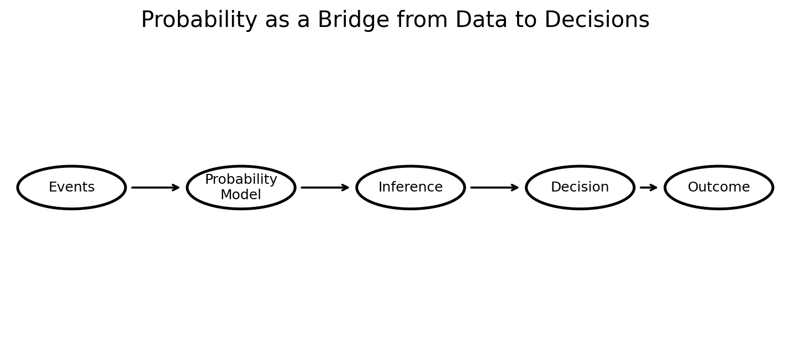
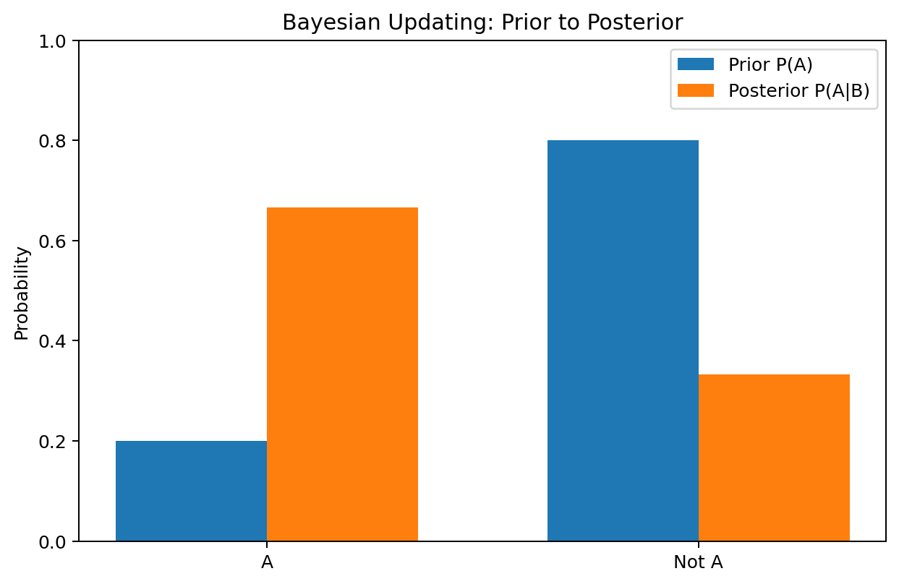
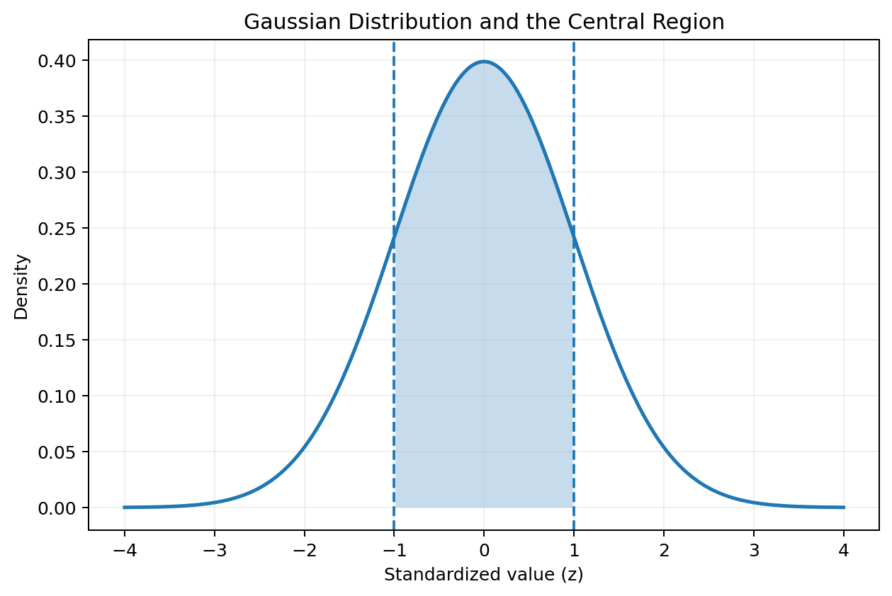
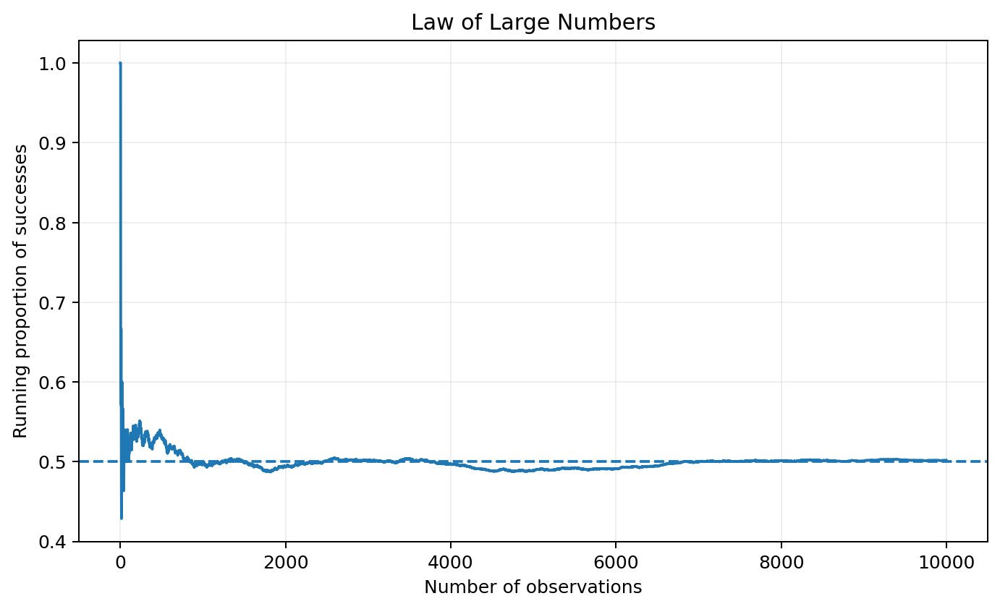
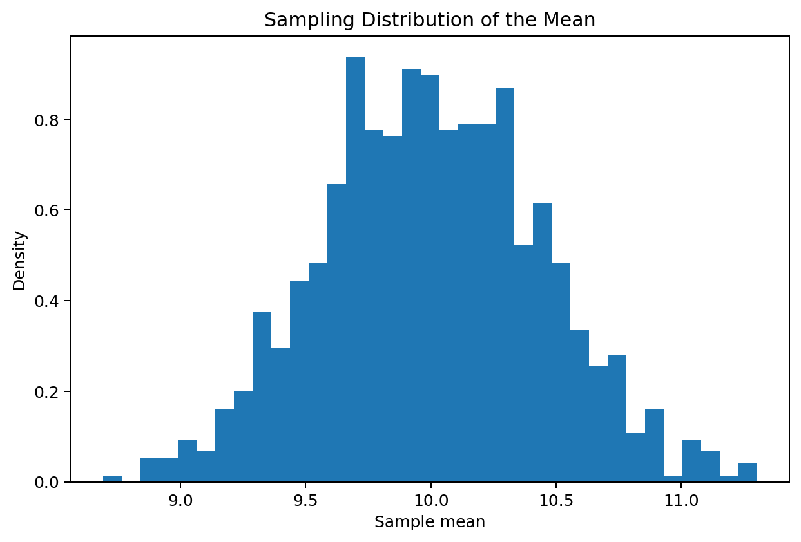
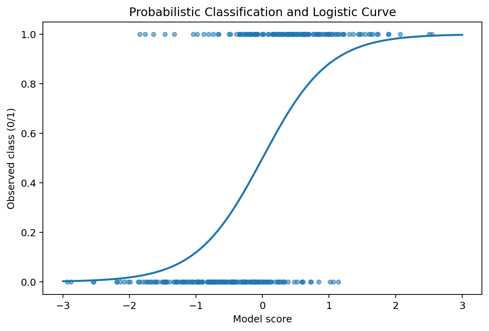
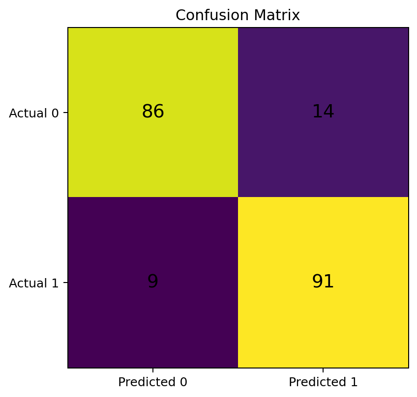
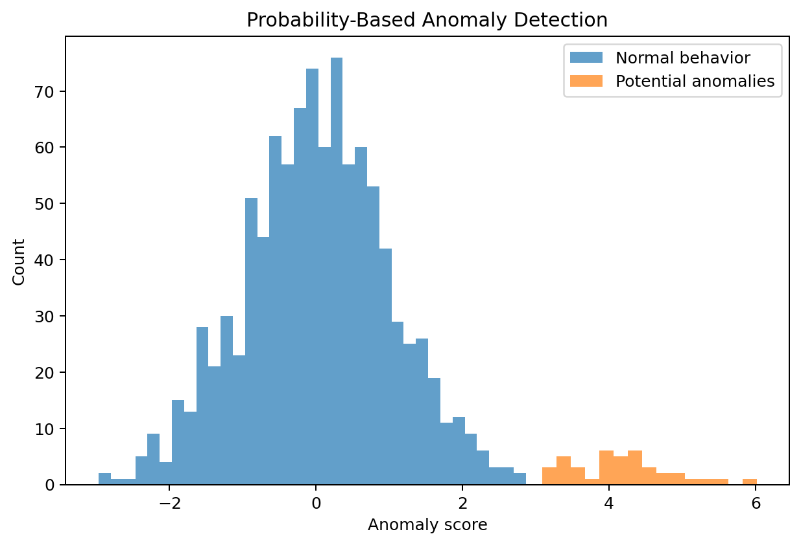
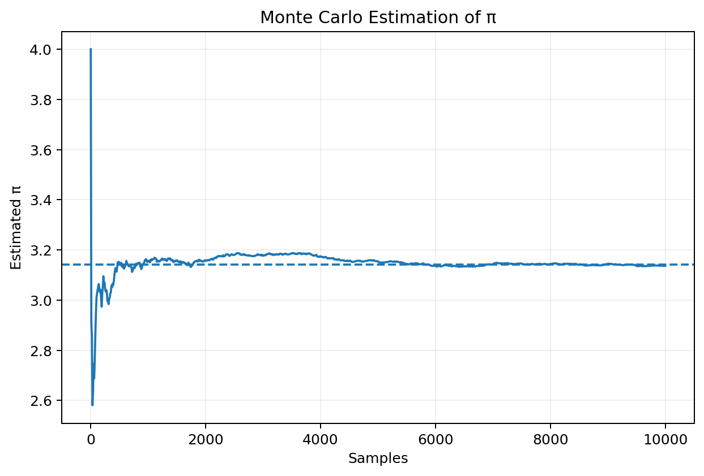
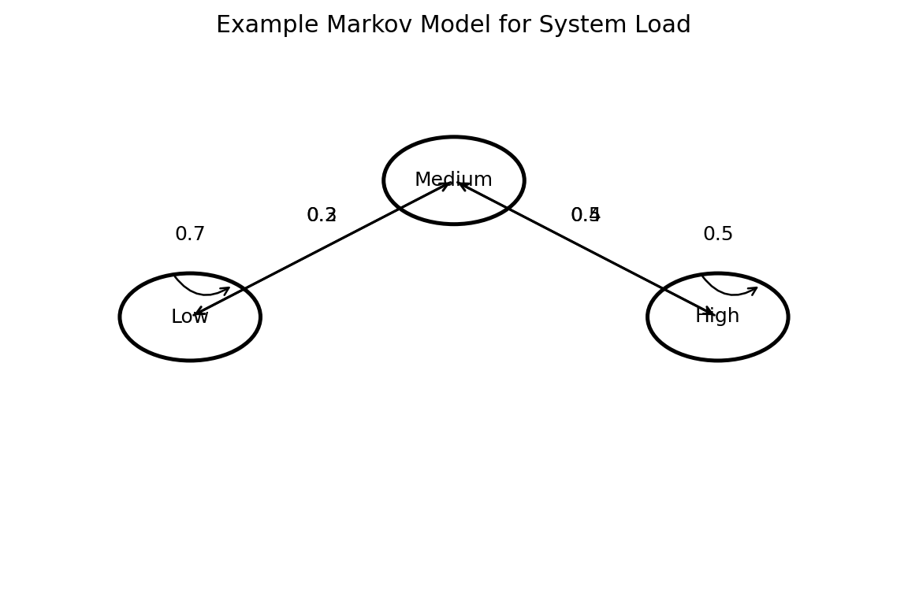

# :classical_building: Mathematics for IT Course - M.Tech. 1st Semester, IIIT Allahabad
## Unit 3: Probability and Random Variable
### Current Topic: Applications of Probability in Information Technology, AI and Data Analytics
#### Reading material on how probability provides the mathematical foundation for uncertainty, prediction, inference, machine learning, information technology, and data analytics
---
## 👥 Instructor Information
* **Edited by Instructor:** [Dr. Mohammed Javed](https://sites.google.com/site/mohammedjaved2016/)
* **Email:** javed@iiita.ac.in
* **Teaching Assistants:** Mr. Apurba Chakraborty (rsi2024005@iiita.ac.in)
---
## Learning Objectives

After completing this chapter, you should be able to:

- explain why probability is important in Information Technology;
- distinguish probability, statistics, and uncertainty;
- represent uncertain events mathematically;
- use conditional probability and Bayes' theorem;
- understand random variables and probability distributions;
- explain how probability supports AI and machine learning;
- interpret probabilistic predictions;
- implement probability concepts in Python;
- understand sampling, estimation, and Monte Carlo simulation;
- use probability for classification and anomaly detection;
- understand uncertainty in data analytics;
- recognize applications in cybersecurity, networks, databases, recommendation systems, and AI.

---

# 1. Introduction

Information Technology (IT), Artificial Intelligence (AI), and Data Analytics all deal with **uncertainty**.

Examples include:

- Will a user click an advertisement?
- Is an email spam?
- Will a server fail?
- Is a network packet malicious?
- What is the probability that a customer will leave?
- What is the probability that a transaction is fraudulent?
- How confident is an AI model in its prediction?
- How likely is a particular event given observed data?

Probability provides a formal language for answering such questions.

A useful conceptual pipeline is:

$$
\boxed{
\text{Data}
\rightarrow
\text{Probability Model}
\rightarrow
\text{Inference}
\rightarrow
\text{Prediction}
\rightarrow
\text{Decision}
}
$$



Probability is therefore not simply a theoretical topic. It is an essential tool for designing reliable systems and making decisions from incomplete or noisy information.

---

# 2. Why Probability Matters in IT

Computer systems rarely operate in perfectly predictable environments.

A network may experience:

- random packet arrivals;
- variable latency;
- packet loss;
- failures;
- changing traffic patterns.

A cloud service may have:

- unpredictable workloads;
- uncertain resource demand;
- hardware failures;
- variable response times.

Cybersecurity systems face:

- uncertain attacker behavior;
- noisy signals;
- false positives;
- false negatives.

Probability allows these situations to be modeled mathematically.

---

# 3. Probability and Uncertainty

Suppose an event $(A)$ represents:

> A server becomes unavailable during the next hour.

Its probability is:

$$
P(A).
$$

The value lies between 0 and 1:

$$
\boxed{
0\le P(A)\le1.
}
$$

Interpretation:

- $(P(A)=0)$: impossible under the model;
- $(P(A)=1)$: certain under the model;
- $(P(A)=0.5)$: equal probability of occurrence and non-occurrence.

Probability can also be expressed as a percentage.

For example:

$$
P(A)=0.02=2\%.
$$

---

# 4. Sample Spaces and Events

A **sample space** is the set of possible outcomes.

For example, if a system status is represented by:

$$
\{\text{Healthy},\text{Failed}\},
$$

then:

$$
\Omega=
\{\text{Healthy},\text{Failed}\}.
$$

An **event** is a subset of the sample space.

For example:

$$
A=\{\text{Failed}\}.
$$

Events can be:

- simple;
- compound;
- mutually exclusive;
- independent;
- dependent.

These concepts form the basis for probability-based reasoning.

---

# 5. Basic Probability Rules

For an event $(A)$:

$$
0\le P(A)\le1.
$$

The probability of the sample space is:

$$
\boxed{
P(\Omega)=1.
}
$$

The probability of the empty event is:

$$
\boxed{
P(\varnothing)=0.
}
$$

For the complement:

$$
\boxed{
P(A^c)=1-P(A).
}
$$

For two events:

$$
\boxed{
P(A\cup B)=P(A)+P(B)-P(A\cap B).
}
$$

---

# 6. Conditional Probability

Suppose we want the probability of $(A)$ given that $(B)$ has occurred.

This is written:

$$
\boxed{
P(A\mid B)
}
$$

and is defined by:

$$
\boxed{
P(A\mid B) = \frac{P(A\cap B)}{P(B)}
}
$$

when $(P(B)>0)$.

Conditional probability is fundamental in:

- diagnosis;
- spam detection;
- recommendation systems;
- fraud detection;
- machine learning;
- cybersecurity.

---

# 7. Example: Conditional Probability in Cybersecurity

Suppose:

- 5% of network connections are malicious;
- a security detector flags 90% of malicious connections;
- the detector also flags 10% of normal connections.

Let:

$$
M=\text{malicious}
$$

and:

$$
F=\text{flagged}.
$$

Then:

$$
P(M)=0.05
$$

$$
P(F\mid M)=0.90
$$

$$
P(F\mid M^c)=0.10.
$$

The important question is:

$$
P(M\mid F)?
$$

This is not simply 90%.

Bayes' theorem is required.

---

# 8. Bayes' Theorem

Bayes' theorem is:

$$
\boxed{
P(A\mid B)=\frac{P(B\mid A)P(A)}{P(B)}
}
$$

The denominator can be expanded using the law of total probability.

For a binary case:

$$
P(B)=P(B\mid A)P(A)
+
P(B\mid A^c)P(A^c).
$$

Therefore:

$$
\boxed{
P(A\mid B)=\frac{P(B\mid A)P(A)}{P(B\mid A)P(A)+P(B\mid A^c)P(A^c)}
}
$$

---

# 9. Bayesian Updating

Bayesian reasoning updates an initial belief using evidence.

The basic structure is:

$$
\boxed{
\text{Posterior}
\propto
\text{Likelihood}
\times
\text{Prior}
}
$$

where:

- **Prior** = belief before observing new evidence;
- **Likelihood** = probability of the evidence under a hypothesis;
- **Posterior** = updated belief after observing evidence.



This idea is central to:

- Bayesian machine learning;
- medical diagnosis;
- spam filtering;
- fraud detection;
- intelligent systems;
- sensor fusion.

---

# 10. Python: Bayes' Theorem

```python
def bayes_theorem(prior, likelihood, false_positive):
    p_evidence = (
        likelihood * prior
        + false_positive * (1 - prior)
    )

    posterior = (
        likelihood * prior
        / p_evidence
    )

    return posterior


posterior = bayes_theorem(
    prior=0.05,
    likelihood=0.90,
    false_positive=0.10
)

print("P(Malicious | Flagged) =", posterior)
```

---

# 11. Independence

Two events $(A)$ and $(B)$ are independent if:

$$
\boxed{
P(A\cap B)=P(A)P(B).
}
$$

Equivalently:

$$
\boxed{
P(A\mid B)=P(A).
}
$$

Independence is useful when modeling systems in which one event does not influence another.

Examples might include:

- independent random experiments;
- independent samples under appropriate assumptions;
- certain component failures;
- independent noise terms.

However, independence should not be assumed without justification.

---

# 12. Random Variables

A **random variable** maps outcomes of a random experiment to numerical values.

For example:

$$
X=\text{number of failed login attempts in one hour}.
$$

Then $(X)$ might take values:

$$
0,1,2,3,\ldots
$$

Random variables can be:

- discrete;
- continuous.

---

# 13. Discrete Random Variables

A discrete random variable takes countable values.

Examples:

- number of packets received;
- number of users online;
- number of system failures;
- number of fraudulent transactions.

A **probability mass function (PMF)** is:

$$
\boxed{
P(X=x).
}
$$

It must satisfy:

$$
P(X=x)\ge0
$$

and:

$$
\sum_xP(X=x)=1.
$$

---

# 14. Continuous Random Variables

A continuous random variable can take values from intervals.

Examples:

- network latency;
- CPU response time;
- file-transfer time;
- model prediction error.

A continuous random variable is described by a **probability density function (PDF)**:

$$
f_X(x).
$$

Probabilities are obtained by integration:

$$
\boxed{
P(a\le X\le b)=\int_a^b f_X(x)\,dx.
}
$$

For a continuous variable:

$$
P(X=x)=0
$$

for an individual exact point.

---

# 15. Cumulative Distribution Function

The **CDF** is:

$$
\boxed{
F_X(x)=P(X\le x).
}
$$

It works for both discrete and continuous random variables.

The CDF is useful for answering questions such as:

> What is the probability that network latency is at most 100 ms?

That is:

$$
P(X\le100).
$$

---

# 16. Gaussian Distribution

The Gaussian or normal distribution is widely used in statistics and data analytics.

Its density is:

$$
\boxed{
f(x)=
\frac{1}{\sigma\sqrt{2\pi}}
e^{-\frac{(x-\mu)^2}{2\sigma^2}}.
}
$$

Parameters:

- $(\mu)$ = mean;
- $(\sigma)$ = standard deviation.

For a standard normal variable:

$$
Z\sim N(0,1).
$$



The Gaussian distribution appears frequently because of the Central Limit Theorem and because many measurement errors can be approximately modeled using it.

---

# 17. Expectation

The **expected value** represents a probability-weighted average.

For a discrete variable:

$$
\boxed{
E[X]=\sum_xxP(X=x).
}
$$

For a continuous variable:

$$
\boxed{
E[X]=\int_{-\infty}^{\infty}xf_X(x)\,dx.
}
$$

Expected values are used in:

- cost analysis;
- risk analysis;
- decision theory;
- machine learning;
- resource planning.

---

# 18. Variance

Variance measures the spread around the mean.

$$
\boxed{
\operatorname{Var}(X)=E[(X-E[X])^2].
}
$$

Equivalent form:

$$
\boxed{
\operatorname{Var}(X)=E[X^2]-(E[X])^2.
}
$$

The standard deviation is:

$$
\boxed{
\sigma_X=\sqrt{\operatorname{Var}(X)}.
}
$$

In data analytics, variance is important for understanding uncertainty and variability.

---

# 19. Python: Simulating a Probability Distribution

```python
import numpy as np
import matplotlib.pyplot as plt

rng = np.random.default_rng(42)

data = rng.normal(
    loc=50,
    scale=10,
    size=5000
)

print("Mean:", np.mean(data))
print("Variance:", np.var(data))
print("Standard deviation:", np.std(data))

plt.hist(data, bins=40, density=True)
plt.xlabel("Value")
plt.ylabel("Density")
plt.title("Simulated Gaussian Data")
plt.show()
```

---

# 20. Law of Large Numbers

The Law of Large Numbers states, informally, that averages of many independent observations tend to approach the expected value.

Suppose:

$$
X_1,X_2,\ldots,X_n
$$

are independent observations with expected value:

$$
E[X]=\mu.
$$

Then the sample mean:

$$
\bar X_n=
\frac1n\sum_{i=1}^nX_i
$$

approaches:

$$
\mu
$$

as $(n)$ becomes large under standard assumptions.



This principle explains why probability estimates based on large datasets can become more stable.

---

# 21. Central Limit Theorem

The Central Limit Theorem is one of the most important results in statistics.

Under standard conditions, the distribution of a suitably normalized sample mean becomes approximately Gaussian as sample size increases.

If:

$$
E[X]=\mu
$$

and:

$$
\operatorname{Var}(X)=\sigma^2,
$$

then approximately:

$$
\boxed{
\bar X
\approx
N\left(
\mu,\frac{\sigma^2}{n}
\right)
}
$$

for sufficiently large $(n)$.



The theorem provides a foundation for:

- confidence intervals;
- hypothesis testing;
- estimation;
- statistical inference;
- many data analytics techniques.

---

# 22. Sampling and Data Analytics

A dataset is often only a sample from a much larger population.

For example:

- a sample of users from all users;
- a sample of transactions from all transactions;
- a sample of images from all possible images.

Probability helps quantify how much uncertainty exists when using a sample to infer properties of the population.

Important concepts include:

- population;
- sample;
- sampling distribution;
- estimator;
- bias;
- variance;
- confidence interval.

---

# 23. Probability in Machine Learning

Many machine-learning systems are fundamentally probabilistic.

Examples:

### Classification

Predict:

$$
P(Y=k\mid X=x).
$$

### Regression

Estimate:

$$
P(Y\mid X=x).
$$

### Generative modeling

Learn:

$$
P(X)
$$

or:

$$
P(X,Y).
$$

### Bayesian modeling

Infer:

$$
P(\theta\mid D).
$$

where:

- $(\theta)$ = model parameters;
- $(D)$ = observed data.

---

# 24. Probabilistic Classification

Instead of simply predicting:

$$
\text{Class}=1,
$$

a classifier may produce:

$$
P(Y=1\mid X)=0.92.
$$

This means the model estimates a 92% probability for class 1 under its model.

Probabilistic outputs are valuable because they communicate uncertainty.



---

# 25. Logistic Regression

Logistic regression models the probability of a binary outcome.

A common form is:

$$
\boxed{
P(Y=1\mid X)=\frac{1}{1+e^{-(\beta_0+\beta_1x_1+\cdots+\beta_px_p)}}
}
$$

The output lies between 0 and 1.

This makes logistic regression useful for:

- spam detection;
- fraud prediction;
- customer churn;
- medical classification;
- click prediction.

---

# 26. Python: Probabilistic Classification

```python
import numpy as np
import matplotlib.pyplot as plt

x = np.linspace(-5, 5, 200)

probability = 1 / (1 + np.exp(-x))

plt.plot(x, probability)
plt.xlabel("Model score")
plt.ylabel("P(Y = 1 | X)")
plt.title("Logistic Probability Function")
plt.grid(alpha=0.2)
plt.show()
```

---

# 27. Classification Thresholds

A probability model may output:

$$
P(Y=1\mid X)=0.7.
$$

A classification threshold can then be selected.

For threshold $(0.5)$:

$$
0.7>0.5
$$

so the predicted class is 1.

But the threshold does not have to be 0.5.

In fraud detection, for example, it may be preferable to lower the threshold to catch more suspicious transactions.

This creates a trade-off between:

- false positives;
- false negatives.

---

# 28. Confusion Matrix

A confusion matrix summarizes classification results.

| | Predicted Negative | Predicted Positive |
|---|---:|---:|
| **Actual Negative** | True Negative | False Positive |
| **Actual Positive** | False Negative | True Positive |



From these values we can calculate:

### Accuracy

$$
\boxed{
\frac{TP+TN}{TP+TN+FP+FN}
}
$$

### Precision

$$
\boxed{
\frac{TP}{TP+FP}
}
$$

### Recall

$$
\boxed{
\frac{TP}{TP+FN}
}
$$

These measures help evaluate probabilistic classifiers after a decision threshold is applied.

---

# 29. Probability in Spam Detection

Suppose:

$$
S=\text{message is spam}
$$

and:

$$
W=\text{message contains a particular word}.
$$

A Bayesian spam filter may estimate:

$$
P(S\mid W).
$$

Using multiple features:

$$
P(S\mid W_1,W_2,\ldots,W_n).
$$

This illustrates how probability transforms observed features into a prediction.

---

# 30. Probability in Recommendation Systems

Recommendation systems often estimate probabilities such as:

$$
P(\text{click}\mid\text{user,item,context}).
$$

For example:

$$
P(\text{watch}\mid\text{user history,movie})=0.73.
$$

The system can rank candidate items by predicted probability.

Applications include:

- video recommendations;
- online shopping;
- advertisements;
- news feeds;
- music recommendations.

---

# 31. Probability in Search Engines

Search systems estimate relevance and uncertainty.

A simplified model might estimate:

$$
P(\text{relevant}\mid\text{query,document}).
$$

Documents can then be ranked by predicted relevance.

Modern search systems combine many signals:

- text similarity;
- user behavior;
- document quality;
- context;
- freshness;
- learned ranking models.

Probability provides a natural framework for combining uncertain evidence.

---

# 32. Probability in Natural Language Processing

Language models assign probabilities to sequences of tokens.

For a sequence:

$$
w_1,w_2,\ldots,w_n,
$$

the chain rule gives:

$$
\boxed{
P(w_1,\ldots,w_n)=\prod_{i=1}^{n}P(w_i\mid w_1,\ldots,w_{i-1}).
}
$$

This is fundamental to probabilistic language modeling.

A model may estimate:

$$
P(\text{next word}\mid\text{previous context}).
$$

Probability is therefore central to predictive language systems.

---

# 33. Probability in Computer Vision

Computer vision systems often estimate:

$$
P(Y\mid X)
$$

where:

- $(X)$ = image;
- $(Y)$ = object or class.

For example:

$$
P(\text{cat}\mid\text{image})=0.94.
$$

The model may produce a probability distribution across many possible classes.

This supports:

- object detection;
- image classification;
- face recognition;
- medical image analysis;
- autonomous systems.

---

# 34. Probability in Neural Networks

Neural networks often produce scores that can be converted into probabilities.

For multi-class classification, the **softmax** function is:

$$
\boxed{
P(Y=k\mid X)=\frac{e^{z_k}}{\sum_j e^{z_j}}.
}
$$

The resulting values satisfy:

$$
0\le P(Y=k\mid X)\le1
$$

and:

$$
\sum_kP(Y=k\mid X)=1.
$$

---

# 35. Cross-Entropy Loss

For classification, a common probabilistic loss is cross-entropy.

For one observation:

$$
\boxed{
L=-\sum_k y_k\log(\hat p_k)
}
$$

where:

- $(y_k)$ = true class indicator;
- $(\hat p_k)$ = predicted probability.

The model is rewarded for assigning high probability to the correct class.

Thus probability is directly embedded in the training objective.

---

# 36. Maximum Likelihood Estimation

Suppose observed data are:

$$
D=\{x_1,x_2,\ldots,x_n\}.
$$

A model has parameter \(\theta\).

The likelihood is:

$$
\boxed{
L(\theta\mid D)=\prod_{i=1}^{n}p(x_i\mid\theta).
}
$$

Maximum likelihood estimation chooses:

$$
\boxed{
\hat\theta = \arg\max_\theta L(\theta\mid D).
}
$$

In practice, the log-likelihood is often maximized:

$$
\boxed{
\hat\theta = \arg\max_\theta\sum_i\log p(x_i\mid\theta).
}
$$

Maximum likelihood is fundamental to statistical modeling and machine learning.

---

# 37. Python: Maximum Likelihood for a Bernoulli Probability

Suppose we observe:

```python
data = [1, 1, 0, 1, 0, 1, 1, 1]
```

For a Bernoulli distribution, the likelihood parameter is \(p\).

The MLE is simply the observed proportion of successes.

```python
import numpy as np

data = np.array([1, 1, 0, 1, 0, 1, 1, 1])

p_hat = np.mean(data)

print("Estimated probability:", p_hat)
```

Output:

```text
Estimated probability: 0.75
```

---

# 38. Bayesian Inference

Bayesian inference treats parameters as uncertain quantities.

The central equation is:

$$
\boxed{
P(\theta\mid D)
\propto
P(D\mid\theta)P(\theta)
}
$$

where:

- $(P(\theta))$ = prior;
- $(P(D\mid\theta))$ = likelihood;
- $(P(\theta\mid D))$ = posterior.

Bayesian methods are useful when:

- data are limited;
- prior knowledge is available;
- uncertainty in parameters matters;
- sequential updating is required.

---

# 39. Probability in Decision Making

Suppose an AI system predicts that an event has probability:

$$
P(A)=0.8.
$$

Whether the system should act depends not only on the probability but also on the consequences.

Suppose:

- gain from correct action = 10;
- loss from incorrect action = 30.

Expected utility can be written:

$$
EU(\text{action}) = \sum_sP(s\mid x)U(\text{action},s).
$$

Thus:

$$
\boxed{
\text{Probability}+\text{Utility}
\rightarrow
\text{Decision}.
}
$$

This is a foundation of decision theory.

---

# 40. Probability in Risk Analysis

Risk can be represented as:

$$
\boxed{
\text{Risk} = \text{Probability of event}\times\text{Impact}.
}
$$

For example:

$$
P(\text{failure})=0.02
$$

and:

$$
\text{impact}=\$100,000.
$$

Expected loss:

$$
0.02(100000)=\$2,000.
$$

This idea is useful in:

- cybersecurity;
- cloud reliability;
- financial analytics;
- project planning;
- insurance;
- safety engineering.

---

# 41. Probability in Cybersecurity

Probability is used in:

- intrusion detection;
- malware classification;
- spam detection;
- fraud detection;
- anomaly detection;
- password attack modeling;
- security risk assessment.

A security system might estimate:

$$
P(\text{attack}\mid\text{observed behavior}).
$$

A high probability can trigger an alert.

---

# 42. Anomaly Detection

Suppose normal system behavior has a known distribution.

An observation far from the expected distribution may be considered anomalous.

For example:

$$
P(X=x\mid\text{normal})
$$

can be very small for unusual observations.



A probabilistic anomaly detector may use:

$$
\boxed{
-\log P(X)
}
$$

as an anomaly score.

Lower probability corresponds to a larger score.

---

# 43. Python: Simple Anomaly Score

```python
import numpy as np

x = np.array([0.2, 0.4, 0.1, 0.3, 5.5])

mu = np.mean(x)
sigma = np.std(x)

z = np.abs((x - mu) / sigma)

print("Values:", x)
print("Standardized anomaly scores:", z)
```

Large standardized scores indicate observations that are far from the sample mean.

In production systems, robust methods and carefully validated probability models are usually preferable.

---

# 44. Probability in Network Reliability

Consider a network with components that can fail.

If components are independent:

$$
P(A\cap B)=P(A)P(B).
$$

For two components both required to work:

$$
P(\text{system works})=P(A)P(B).
$$

If:

$$
P(A)=0.99
$$

and:

$$
P(B)=0.98,
$$

then:

$$
P(\text{system works})=0.99(0.98)=0.9702.
$$

Thus system reliability is approximately 97.02%.

---

# 45. Redundancy and Reliability

Suppose either of two independent servers can provide service.

The system fails only if both servers fail.

If:

$$
P(F_1)=p_1
$$

and:

$$
P(F_2)=p_2,
$$

then:

$$
P(\text{failure})=p_1p_2.
$$

Therefore:

$$
\boxed{
P(\text{success})=1-p_1p_2.
}
$$

Redundancy can therefore greatly improve reliability.

---

# 46. Python: Reliability of Redundant Components

```python
p_fail_1 = 0.02
p_fail_2 = 0.03

system_failure = p_fail_1 * p_fail_2
system_success = 1 - system_failure

print("System failure probability:", system_failure)
print("System reliability:", system_success)
```

---

# 47. Probability in Data Quality

Data are often:

- missing;
- noisy;
- duplicated;
- incorrectly labeled;
- sampled unevenly.

Probability can help model missingness.

For example:

$$
P(M=1\mid X)
$$

can represent the probability that a value is missing given other observed variables.

This supports:

- missing-data analysis;
- imputation;
- uncertainty-aware analytics.

---

# 48. Probability in A/B Testing

Suppose two website designs are compared:

- Design A;
- Design B.

Let:

$$
p_A
$$

be the conversion probability for A and:

$$
p_B
$$

for B.

Observed conversion rates provide estimates:

$$
\hat p_A,\qquad \hat p_B.
$$

Probability and statistical inference help determine whether observed differences are likely to reflect genuine performance differences rather than random variation.

---

# 49. Probability in Forecasting

A point forecast gives one value:

$$
\hat y=100.
$$

A probabilistic forecast gives a distribution:

$$
P(Y\mid X).
$$

For example:

$$
Y\sim N(100,15^2).
$$

Then the forecast communicates both:

- expected value;
- uncertainty.

This is often much more useful for decision-making.

---

# 50. Prediction Intervals

Suppose:

$$
Y\sim N(\mu,\sigma^2).
$$

An approximate 95% interval is:

$$
\boxed{
\mu\pm1.96\sigma
}
$$

under the normal model.

For example:

$$
\mu=100,\quad\sigma=10.
$$

Then:

$$
100\pm19.6.
$$

So an approximate interval is:

$$
[80.4,119.6].
$$

The exact interpretation depends on whether the interval is a confidence interval, prediction interval, or Bayesian credible interval.

---

# 51. Monte Carlo Simulation

Monte Carlo methods use random sampling to approximate probabilities, expectations, and integrals.

General structure:

1. generate random samples;
2. calculate a quantity for each sample;
3. average the results;
4. study convergence and uncertainty.

For example:

$$
E[g(X)]
\approx
\frac1N\sum_{i=1}^Ng(X_i).
$$

---

# 52. Estimating π With Monte Carlo

Randomly sample points in the square:

$$
[-1,1]\times[-1,1].
$$

The area of the square is:

$$
4.
$$

The area of the unit circle is:

$$
\pi.
$$

Therefore:

$$
\frac{\text{points inside circle}}
{\text{total points}}
\approx
\frac{\pi}{4}.
$$

Thus:

$$
\boxed{
\pi
\approx
4\frac{N_{\text{inside}}}{N}.
}
$$



---

# 53. Python: Monte Carlo Estimation

```python
import numpy as np

rng = np.random.default_rng(42)

N = 100_000

points = rng.uniform(-1, 1, size=(N, 2))

inside = (
    points[:, 0]**2 +
    points[:, 1]**2
) <= 1

pi_estimate = 4 * np.mean(inside)

print("Estimated pi:", pi_estimate)
print("Actual pi:", np.pi)
```

Increasing \(N\) generally improves the estimate.

---

# 54. Probability in Markov Models

A Markov model assumes that the next state depends on the current state according to transition probabilities.

For states:

$$
S_1,S_2,\ldots,S_n,
$$

the transition probability is:

$$
\boxed{
P_{ij}=P(X_{t+1}=S_j\mid X_t=S_i).
}
$$

The transition matrix is:

$$
P=
\begin{bmatrix}
P_{11}&P_{12}&\cdots\\
P_{21}&P_{22}&\cdots\\
\vdots&\vdots&\ddots
\end{bmatrix}.
$$



Applications include:

- system reliability;
- user behavior;
- web navigation;
- natural language;
- recommendation systems;
- queueing;
- finance.

---

# 55. Python: Markov Chain Simulation

```python
import numpy as np

states = ["Low", "Medium", "High"]

P = np.array([
    [0.7, 0.3, 0.0],
    [0.2, 0.4, 0.4],
    [0.0, 0.5, 0.5]
])

rng = np.random.default_rng(42)

state = 0

history = []

for _ in range(20):
    history.append(states[state])
    state = rng.choice(
        len(states),
        p=P[state]
    )

print(history)
```

---

# 56. Probability in Time-Series Analytics

Time-series data often contain uncertainty.

Examples:

- server traffic;
- stock prices;
- CPU utilization;
- sensor measurements;
- website visits;
- energy consumption.

A probabilistic model can represent:

$$
P(X_t\mid X_{t-1},X_{t-2},\ldots).
$$

This supports forecasting and anomaly detection.

---

# 57. Probability in Feature Engineering

Features can themselves be probabilistic.

Examples:

$$
P(\text{customer churn}\mid\text{features})
$$

$$
P(\text{fraud}\mid\text{transaction})
$$

$$
P(\text{click}\mid\text{advertisement})
$$

These probability estimates can become new features for downstream models.

---

# 58. Probability Calibration

A classifier is **calibrated** if among predictions assigned probability approximately \(p\), the corresponding event occurs approximately \(p\) of the time.

For example:

Among 1,000 predictions with probability 0.8, roughly 800 should be positive if the model is well calibrated.

Calibration matters in:

- medical AI;
- risk scoring;
- fraud detection;
- financial decisions;
- safety-critical systems.

A model can have good accuracy but poor probability calibration.

---

# 59. Expected Value in AI Decisions

Suppose an AI model predicts:

$$
P(\text{fraud}\mid x)=0.1.
$$

Suppose:

- rejecting a legitimate transaction costs 5;
- allowing fraud costs 100.

Expected cost of allowing:

$$
0.1(100)=10.
$$

Expected cost of rejecting:

$$
0.9(5)=4.5.
$$

Under these assumptions, rejecting may have lower expected cost.

This illustrates why **decision thresholds should depend on costs**, not just accuracy.

---

# 60. Probability and Information Theory

Probability is also the foundation of information theory.

For an event with probability $(p)$, information content can be defined as:

$$
\boxed{
I(x)=-\log_2 p(x).
}
$$

Rare events contain more information.

For a discrete random variable:

$$
\boxed{
H(X)=-\sum_xp(x)\log_2p(x)
}
$$

is the **Shannon entropy**.

Entropy measures uncertainty in a probability distribution.

Applications include:

- data compression;
- communication systems;
- decision trees;
- machine learning;
- cybersecurity.

---

# 61. Entropy and Decision Trees

Decision-tree algorithms often use entropy:

$$
H(Y)=-\sum_yp(y)\log_2p(y).
$$

A feature can reduce uncertainty.

The information gain is:

$$
\boxed{
IG=H(Y)-H(Y\mid X).
}
$$

Thus probability directly supports feature selection and tree construction.

---

# 62. Probability in Data Compression

Suppose symbols have probabilities:

$$
P(A)=0.7,\quad
P(B)=0.2,\quad
P(C)=0.1.
$$

A compression algorithm can assign shorter codes to more probable symbols.

Probability helps determine how much information is contained in each symbol.

This is the basis for methods such as:

- Huffman coding;
- arithmetic coding;
- entropy coding.

---

# 63. Probability in Cloud Computing

Cloud systems face uncertain workloads.

Suppose:

$$
X=\text{number of requests per second}.
$$

We may model:

$$
P(X=x).
$$

This supports:

- capacity planning;
- auto-scaling;
- SLA analysis;
- resource allocation;
- queueing analysis.

For example, a cloud platform might scale up when:

$$
P(X>\text{capacity})
$$

becomes too high.

---

# 64. Probability in Database Systems

Database systems use probabilistic reasoning in areas such as:

- query optimization;
- cardinality estimation;
- uncertain data;
- anomaly detection;
- approximate query processing.

A query optimizer may estimate the expected number of rows produced by an operation.

Incorrect estimates can result in poor execution plans.

---

# 65. Probability in Distributed Systems

Distributed systems contain uncertainty caused by:

- network delays;
- packet loss;
- machine failures;
- asynchronous execution;
- partial failures.

Probability can be used to model:

$$
P(\text{node failure})
$$

or:

$$
P(\text{request exceeds latency threshold}).
$$

This helps engineers design systems with appropriate redundancy and capacity.

---

# 66. Probability in Reliability Engineering

Let:

$$
T=\text{time to failure}.
$$

Then:

$$
P(T>t)
$$

is the reliability function.

The reliability function is:

$$
\boxed{
R(t)=P(T>t).
}
$$

The failure probability by time $(t)$ is:

$$
\boxed{
F(t)=1-R(t).
}
$$

These concepts are useful for:

- hardware;
- cloud infrastructure;
- storage systems;
- networking equipment;
- software reliability.

---

# 67. Probability in AI Model Uncertainty

AI systems can be uncertain because:

### Aleatoric uncertainty

Uncertainty inherent in the data.

Examples:

- noisy sensors;
- ambiguous images;
- inconsistent human labels.

### Epistemic uncertainty

Uncertainty caused by limited knowledge or limited training data.

Examples:

- unfamiliar input;
- insufficient training examples;
- distribution shift.

Understanding these forms of uncertainty is important for trustworthy AI.

---

# 68. Probability and Out-of-Distribution Detection

A model trained on one distribution may receive unfamiliar data.

Let:

$$
X\sim P_{\text{train}}
$$

during training.

At deployment, data may instead come from:

$$
P_{\text{test}}.
$$

If:

$$
P_{\text{test}}\ne P_{\text{train}},
$$

performance can degrade.

Probability-based methods can help identify unusual or low-density observations.

---

# 69. Probability in Privacy

Probability also appears in privacy-preserving systems.

For example, randomized mechanisms may introduce controlled randomness so that individual data values are difficult to infer.

Differential privacy uses probability distributions over algorithm outputs.

At a high level, the goal is to limit how much the output changes when one individual's data is changed.

---

# 70. Probability in Generative AI

Generative AI models often represent probability distributions over possible outputs.

A simplified formulation is:

$$
P(X)
$$

or:

$$
P(Y\mid X).
$$

For sequence generation:

$$
P(x_1,\ldots,x_n)=\prod_iP(x_i\mid x_{<i}).
$$

Sampling from these distributions allows models to generate varied outputs.

Probability is therefore central to modern generative modeling.

---

# 71. Python Libraries for Probability and Data Analytics

Important Python tools include:

### NumPy

Random sampling and numerical computation.

```python
import numpy as np
```

### SciPy

Probability distributions and statistical functions.

```python
from scipy import stats
```

### pandas

Data manipulation and analysis.

```python
import pandas as pd
```

### Matplotlib

Visualization.

```python
import matplotlib.pyplot as plt
```

### scikit-learn

Machine learning and probabilistic classification tools.

```python
from sklearn.model_selection import train_test_split
from sklearn.linear_model import LogisticRegression
```

---

# 72. Python: Working With Probability Distributions

```python
from scipy import stats

# Gaussian distribution
normal = stats.norm(loc=50, scale=10)

# Probability that X <= 60
p = normal.cdf(60)

# Probability that X > 60
tail = 1 - normal.cdf(60)

# 95% central interval
interval = normal.interval(0.95)

print("P(X <= 60):", p)
print("P(X > 60):", tail)
print("95% interval:", interval)
```

This is useful when analyzing real datasets.

---

# 73. Python: Bayes Using Counts

Bayesian reasoning can also be understood through a frequency table.

```python
import pandas as pd

data = pd.DataFrame({
    "malicious": [True, True, False, False, False],
    "flagged":   [True, False, True, False, False]
})

# P(malicious | flagged)
flagged = data[data["flagged"]]

posterior = flagged["malicious"].mean()

print("Estimated P(malicious | flagged):", posterior)
```

Working with observed counts often makes conditional probability intuitive.

---

# 74. Probability in Exploratory Data Analysis

Data analytics often begins by examining distributions.

For a variable \(X\), analysts may estimate:

- mean;
- variance;
- quantiles;
- empirical probability;
- histogram;
- CDF;
- correlations.

For example:

$$
\hat P(X>100)=\frac{\#\{x_i>100\}}{n}.
$$

This is an empirical probability estimate.

---

# 75. Empirical Probability in Python

```python
import numpy as np

rng = np.random.default_rng(42)

latency = rng.normal(
    loc=100,
    scale=20,
    size=10_000
)

probability = np.mean(latency > 130)

print("Estimated P(latency > 130 ms):",
      probability)
```

This estimates the probability that latency exceeds 130 ms.

---

# 76. Probability and Correlation

Correlation measures linear association.

For random variables $(X)$ and $(Y)$:

$$
\boxed{
\rho_{XY}=\frac{\operatorname{Cov}(X,Y)}{\sigma_X\sigma_Y}.
}
$$

Important:

$$
\boxed{
\text{Correlation does not imply causation.}
}
$$

Also:

$$
\boxed{
\text{Uncorrelated does not always mean independent.}
}
$$

Independence is a stronger condition.

---

# 77. Probability and Missing Data

Suppose a dataset contains a missing-value indicator:

$$
M=
\begin{cases}
1,&\text{value missing}\\
0,&\text{value observed}.
\end{cases}
$$

We can study:

$$
P(M=1\mid X).
$$

This can reveal whether missingness depends on other variables.

Understanding the probability mechanism behind missing data is important for valid analysis.

---

# 78. Probability and Imbalanced Data

Suppose only 0.1% of transactions are fraudulent.

Then:

$$
P(\text{fraud})=0.001.
$$

A classifier that predicts "not fraud" for every transaction has 99.9% accuracy but is useless for fraud detection.

Probability helps reveal the underlying class imbalance.

Metrics such as:

- precision;
- recall;
- specificity;
- ROC-AUC;
- precision-recall curves

are often more informative.

---

# 79. Base-Rate Effects

The previous example demonstrates the importance of **base rates**.

A rare event can remain unlikely even after positive evidence.

In general:

$$
P(A\mid B)
$$

depends on both:

$$
P(B\mid A)
$$

and:

$$
P(A).
$$

This is one reason Bayes' theorem is so important in AI and data analytics.

---

# 80. Practical Example: Fraud Detection

Suppose:

$$
P(F)=0.01.
$$

A fraud detector has:

$$
P(A\mid F)=0.95
$$

and:

$$
P(A\mid F^c)=0.05.
$$

Then:

$$
P(F\mid A)=\frac{P(A\mid F)P(F)}{P(A\mid F)P(F)+P(A\mid F^c)P(F^c)}.
$$

Python:

```python
prior = 0.01
sensitivity = 0.95
false_positive = 0.05

p_alert = (
    sensitivity * prior
    + false_positive * (1 - prior)
)

p_fraud_given_alert = (
    sensitivity * prior
    / p_alert
)

print(p_fraud_given_alert)
```

This demonstrates why a high-quality detector can still produce many false alarms when the target event is rare.

---

# 81. Probability in Model Evaluation

A probabilistic model should be evaluated from several perspectives:

### Discrimination

Can it distinguish classes?

### Calibration

Do predicted probabilities correspond to observed frequencies?

### Sharpness

Does the model provide informative predictions rather than always predicting values near the base rate?

### Robustness

Does performance remain reasonable under changing conditions?

A single accuracy number is rarely sufficient.

---

# 82. Common Mistakes

### Mistake 1: Confusing probability with certainty

A probability of 0.9 does not mean an event must occur.

### Mistake 2: Ignoring base rates

Always consider prior probability.

### Mistake 3: Confusing $(P(A\mid B))$ and $(P(B\mid A))$

They are generally different.

### Mistake 4: Assuming independence

Independence is an assumption that should be justified.

### Mistake 5: Treating model probability as absolute truth

Predicted probabilities depend on the model and data.

### Mistake 6: Ignoring sampling bias

A large biased dataset can still produce misleading conclusions.

### Mistake 7: Confusing correlation with causation

Association alone does not establish a causal relationship.

---

# 83. A General Workflow for Probability-Based Analytics

A useful workflow is:

### Step 1 — Define the event

What uncertain event are you studying?

### Step 2 — Identify the random variable

What quantity varies?

### Step 3 — Collect data

Obtain representative observations.

### Step 4 — Explore distributions

Use:

- histograms;
- empirical CDFs;
- summary statistics.

### Step 5 — Select a probability model

Possible choices include:

- Bernoulli;
- Binomial;
- Poisson;
- Gaussian;
- Exponential;
- categorical;
- mixture models.

### Step 6 — Estimate parameters

Use:

- sample statistics;
- maximum likelihood;
- Bayesian inference.

### Step 7 — Quantify uncertainty

Calculate:

- probabilities;
- intervals;
- variance;
- predictive distributions.

### Step 8 — Make decisions

Combine probability with costs, benefits, or utility.

### Step 9 — Validate

Check assumptions and compare predictions with observed data.

---

# 84. Mini Project: Server Failure Prediction

Suppose we have:

- CPU utilization;
- memory utilization;
- request rate;
- previous failures;
- temperature;
- failure indicator.

Goal:

$$
P(\text{failure within 1 hour}\mid X).
$$

A simple approach is logistic regression.

```python
import pandas as pd
from sklearn.model_selection import train_test_split
from sklearn.linear_model import LogisticRegression
from sklearn.metrics import classification_report

data = pd.read_csv("server_data.csv")

X = data[
    [
        "cpu_utilization",
        "memory_utilization",
        "request_rate",
        "temperature"
    ]
]

y = data["failure"]

X_train, X_test, y_train, y_test = train_test_split(
    X,
    y,
    test_size=0.2,
    random_state=42
)

model = LogisticRegression(max_iter=1000)

model.fit(X_train, y_train)

probabilities = model.predict_proba(X_test)[:, 1]

predictions = (probabilities >= 0.5).astype(int)

print(classification_report(y_test, predictions))
```

The output probability can be used for risk-aware capacity planning.

---

# 85. Mini Project: Customer Churn Probability

A business may estimate:

$$
P(\text{churn}\mid X).
$$

Possible features:

- number of support calls;
- subscription age;
- monthly cost;
- usage frequency;
- payment history.

The predicted probability can be used to prioritize customer-retention actions.

The important principle is:

> Probability estimates can be more useful than only predicting a yes/no label.

---

# 86. Mini Project: Network Anomaly Detection

Suppose normal network traffic has features:

- packet count;
- average packet size;
- connection duration;
- destination count.

A probability model can estimate:

$$
P(X\mid\text{normal}).
$$

A low likelihood can indicate unusual behavior.

Possible workflow:

```text
Network Data
     ↓
Feature Extraction
     ↓
Probability Model
     ↓
Likelihood / Anomaly Score
     ↓
Threshold
     ↓
Security Alert
```

---

# 87. Summary of Applications

| Area | Example probability application |
|---|---|
| IT infrastructure | Failure probability |
| Cloud computing | Workload forecasting |
| Computer networks | Packet loss and latency |
| Cybersecurity | Attack probability |
| Spam filtering | \(P(\text{spam}\mid\text{features})\) |
| Fraud detection | Fraud probability |
| AI classification | Class probabilities |
| Generative AI | Probability of outputs |
| NLP | Next-token probabilities |
| Computer vision | Class/object probabilities |
| Recommendation | Click/watch probability |
| Search | Relevance probability |
| Data analytics | Sampling uncertainty |
| Forecasting | Predictive distributions |
| Reliability | Failure and survival probabilities |
| Decision systems | Expected utility |
| Information theory | Entropy |
| Simulation | Monte Carlo estimation |

---

# 88. Key Formulas

### Complement

$$
\boxed{
P(A^c)=1-P(A)
}
$$

### Union

$$
\boxed{
P(A\cup B)=P(A)+P(B)-P(A\cap B)
}
$$

### Conditional probability

$$
\boxed{
P(A\mid B)=\frac{P(A\cap B)}{P(B)}
}
$$

### Bayes' theorem

$$
\boxed{
P(A\mid B)=\frac{P(B\mid A)P(A)}{P(B)}
}
$$

### Independence

$$
\boxed{
P(A\cap B)=P(A)P(B)
}
$$

### Expected value

$$
\boxed{
E[X]=\sum_xxP(X=x)
}
$$

for discrete $(X)$.

### Variance

$$
\boxed{
\operatorname{Var}(X)=E[X^2]-(E[X])^2
}
$$

### CDF

$$
\boxed{
F_X(x)=P(X\le x)
}
$$

### Gaussian density

$$
\boxed{
f(x)=
\frac{1}{\sigma\sqrt{2\pi}}
e^{-\frac{(x-\mu)^2}{2\sigma^2}}
}
$$

### Logistic probability

$$
\boxed{
P(Y=1\mid X)=\frac{1}{1+e^{-z}}
}
$$

### Entropy

$$
\boxed{
H(X)=-\sum_xp(x)\log_2p(x)
}
$$

### Monte Carlo expectation

$$
\boxed{
E[g(X)]
\approx
\frac1N\sum_{i=1}^Ng(X_i)
}
$$

---

# 89. Practice Questions

1. Why is probability important in Information Technology?
2. Define a sample space and event.
3. Explain conditional probability.
4. Distinguish $(P(A\mid B))$ from $(P(B\mid A))$.
5. State Bayes' theorem.
6. What does independence mean?
7. Give three examples of probability applications in cybersecurity.
8. Explain the difference between a PMF and PDF.
9. What is a CDF?
10. Explain the Law of Large Numbers.
11. Explain the Central Limit Theorem.
12. Why is probability useful in machine learning?
13. What does $(P(Y=k\mid X))$ represent in classification?
14. Explain the difference between accuracy and probability calibration.
15. What is maximum likelihood estimation?
16. Explain Bayesian updating.
17. What is Monte Carlo simulation?
18. Estimate $(\pi)$ using random sampling in Python.
19. Explain how probability is used in recommendation systems.
20. Explain probability-based anomaly detection.
21. What is entropy?
22. How does probability support decision-making?
23. Explain the base-rate effect using a fraud-detection example.
24. Why does correlation not imply causation?
25. Build a Python model that predicts the probability of a binary event.

---

# 90. Suggested Python Exercises

### Exercise 1 — Coin Toss Simulation

Simulate 10,000 coin tosses and plot the running proportion of heads.

### Exercise 2 — Dice Probability

Estimate:

$$
P(\text{sum}\ge10)
$$

using simulation.

### Exercise 3 — Bayes' Theorem

Implement a function that calculates:

$$
P(A\mid B).
$$

### Exercise 4 — Gaussian Data

Generate Gaussian data and calculate:

- mean;
- variance;
- standard deviation;
- empirical probabilities.

### Exercise 5 — Central Limit Theorem

Generate repeated samples and plot their sample means.

### Exercise 6 — Classification

Train a logistic regression model and examine:

```python
model.predict_proba(X)
```

### Exercise 7 — Monte Carlo

Estimate an integral using random samples.

### Exercise 8 — Markov Chain

Simulate a user moving between:

```text
Home → Search → Product → Purchase
```

with specified transition probabilities.

### Exercise 9 — Anomaly Detection

Generate normal and anomalous observations and compare their probability or z-score.

### Exercise 10 — Expected Cost

Create a decision problem with two possible actions and calculate expected cost using predicted probabilities.

---

# 91. Final Perspective

Probability is one of the most important mathematical foundations of modern computing.

In **Information Technology**, it helps model:

$$
\text{failure, latency, traffic, reliability, security}
$$

In **Artificial Intelligence**, it supports:

$$
\text{prediction, classification, inference, generation, decision-making}
$$

In **Data Analytics**, it provides:

$$
\text{sampling, estimation, uncertainty, forecasting, risk analysis}
$$

The central idea is simple:

> **When the future is uncertain, probability provides a mathematical framework for representing what might happen and how strongly we should believe it.**

The combination:

$$
\boxed{
\text{Probability}
+
\text{Statistics}
+
\text{Computing}
+
\text{Data}
}
$$

forms a foundation for modern data-driven technology.

---

