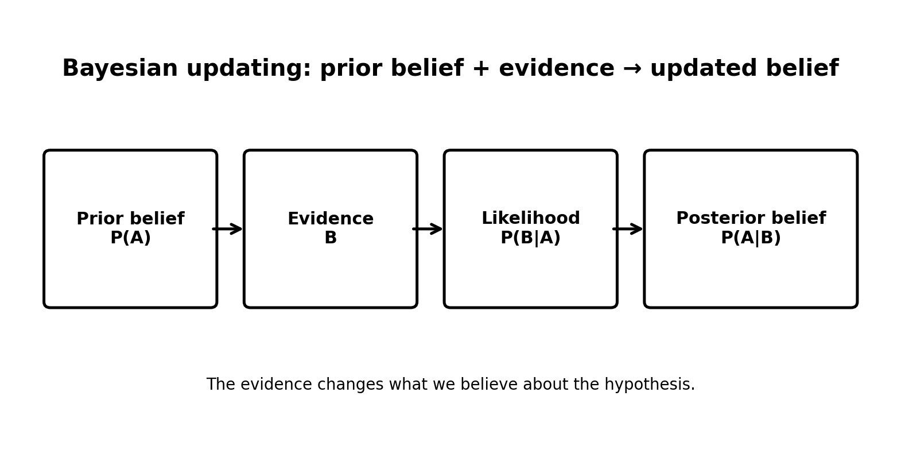
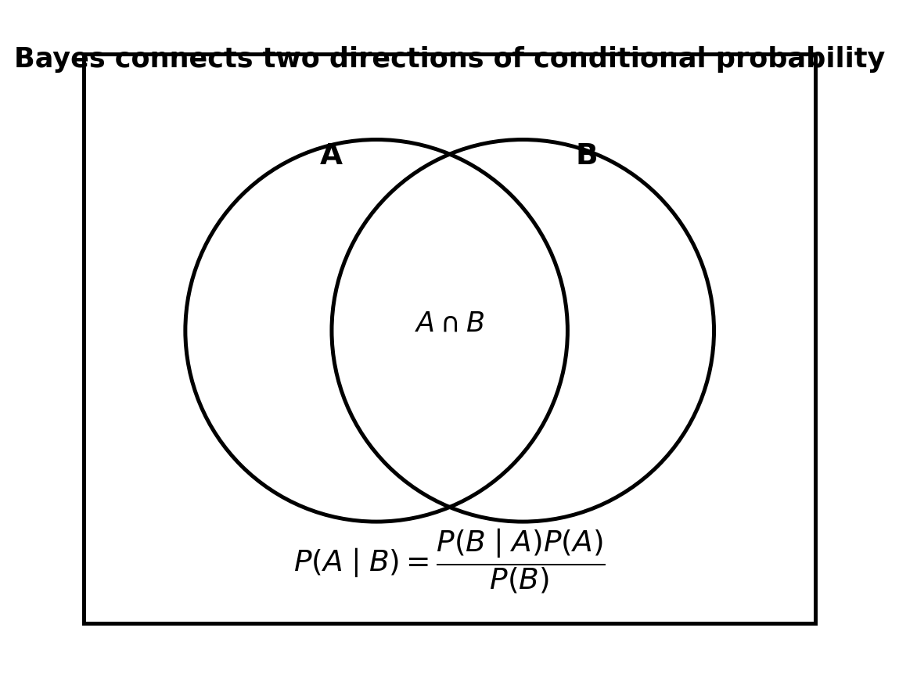
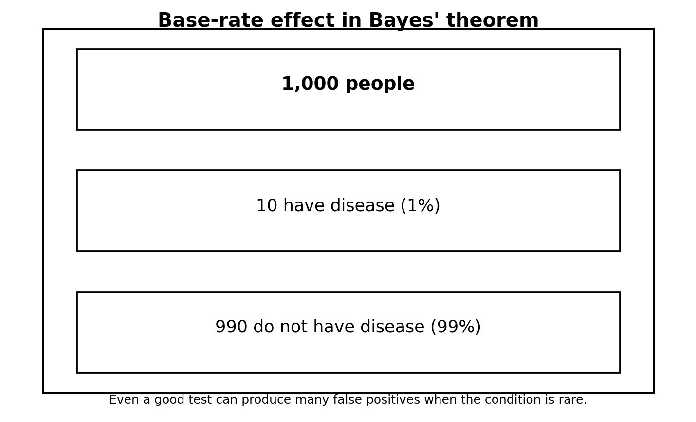
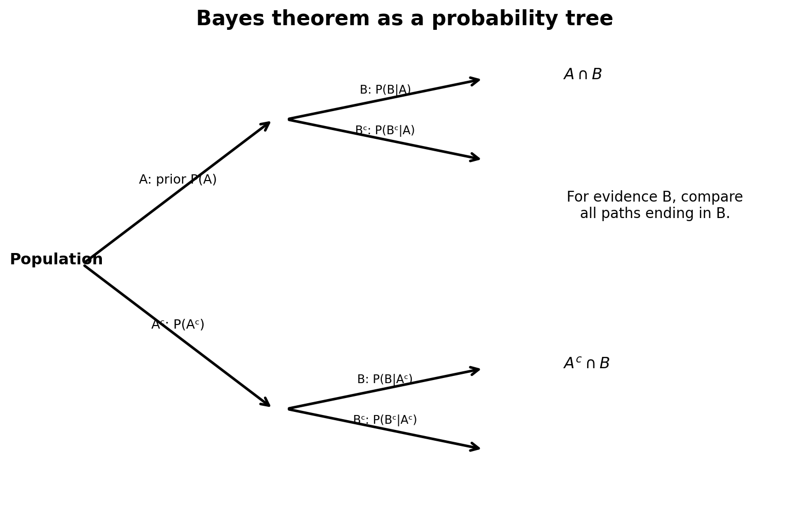
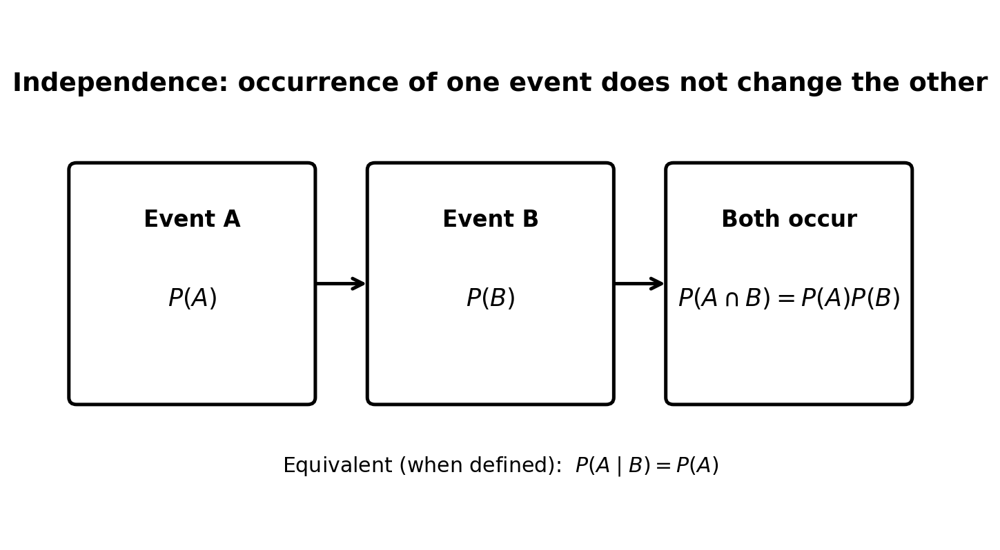
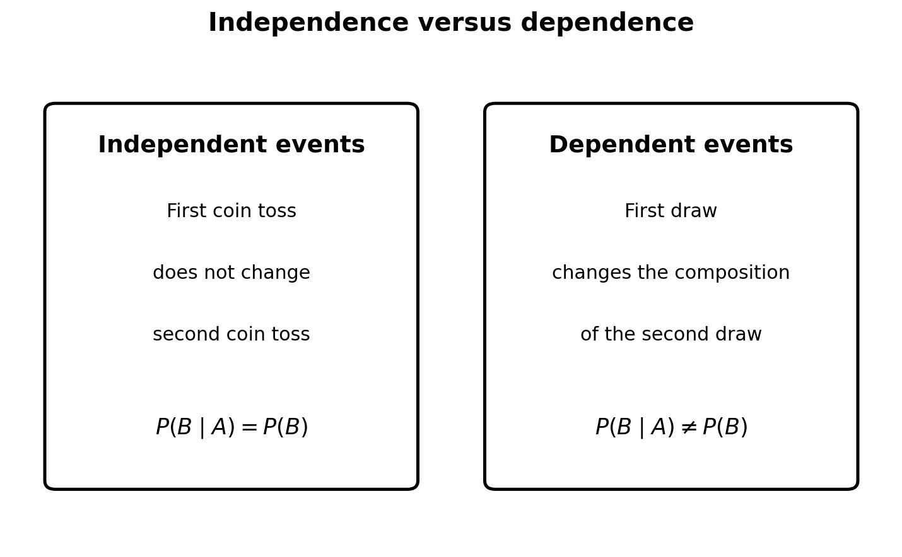

# :classical_building: Mathematics for IT Course - M.Tech. 1st Semester, IIIT Allahabad
## Unit 3: Probability and Random Variables
### Current Topic: Bayes’ Theorem and Independence of Events - intuitive explanations, mathematical derivations, worked examples, figures, and Python implementations
---
## 👥 Instructor Information
* **Edited by Instructor:** [Dr. Mohammed Javed](https://sites.google.com/site/mohammedjaved2016/)
* **Email:** javed@iiita.ac.in
* **Teaching Assistants:** Mr. Apurba Chakraborty (rsi2024005@iiita.ac.in)
---
## Learning objectives

After studying this material, you should be able to:

- explain Bayes’ theorem intuitively and mathematically;
- distinguish $(P(A\mid B))$ from $(P(B\mid A))$;
- identify prior, likelihood, evidence, and posterior probabilities;
- apply the law of total probability;
- solve Bayes problems using tables and probability trees;
- explain independent and dependent events;
- test independence mathematically;
- understand why mutually exclusive events are generally not independent;
- implement Bayes’ theorem and independence tests in Python;
- verify theoretical results through simulation.

---

# Part I — Bayes’ Theorem

## 1. Why Bayes’ theorem?

Suppose a medical test is positive. We may want to know:

> What is the probability that the person actually has the disease?

A common mistake is to use the test's sensitivity directly:

$$
P(+\mid D).
$$

But the question asks for:

$$
P(D\mid +).
$$

These are different probabilities.

Bayes’ theorem provides a systematic way to reverse the direction of conditional probability.

---

## 2. Conditional probability reminder

For $(P(B)>0)$,

$$
P(A\mid B)=\frac{P(A\cap B)}{P(B)}.
$$

Similarly,

$$
P(B\mid A)=\frac{P(A\cap B)}{P(A)}.
$$

Both expressions describe the same intersection, but they condition on different events.

---

## 3. Derivation of Bayes’ theorem

From conditional probability:

$$
P(A\cap B)=P(A\mid B)P(B).
$$

Also:

$$
P(A\cap B)=P(B\mid A)P(A).
$$

Equating the two:

$$
P(A\mid B)P(B)=P(B\mid A)P(A).
$$

Assuming $(P(B)>0)$:

$$
\boxed{
P(A\mid B)=
\frac{P(B\mid A)P(A)}{P(B)}
}
$$

This is **Bayes’ theorem**.


---

## 4. Intuition behind Bayes’ theorem

Bayes’ theorem answers:

> After observing evidence $(B)$, how should our belief about hypothesis $(A)$ change?

The four important quantities are:

### Prior

$$
P(A)
$$

The probability assigned to the hypothesis before seeing the new evidence.

### Likelihood

$$
P(B\mid A)
$$

How likely the observed evidence is if the hypothesis is true.

### Evidence

$$
P(B)
$$

The overall probability of observing the evidence.

### Posterior

$$
P(A\mid B)
$$

The updated probability of the hypothesis after observing the evidence.



A useful conceptual form is:

$$
\text{Posterior}
\propto
\text{Likelihood}\times\text{Prior}.
$$

---

## 5. Bayes’ theorem using a Venn diagram

The intersection $(A\cap B)$ is the key connection between the two conditional probabilities.



We can write:

$$
P(A\mid B) = \frac{P(A\cap B)}{P(B)}
$$

and:

$$
P(A\cap B)=P(B\mid A)P(A).
$$

Substitution gives:

$$
P(A\mid B) = \frac{P(B\mid A)P(A)}{P(B)}.
$$

---

## 6. Bayes’ theorem and the law of total probability

Often $(P(B))$ is not directly known.

Suppose $(A)$ and $(A^c)$ partition the sample space. Then:

\[
P(B) = P(B\mid A)P(A) + P(B\mid A^c)P(A^c).
\]

Therefore:

$$
\boxed{
P(A\mid B) = \frac{P(B\mid A)P(A)}{P(B\mid A)P(A)+P(B\mid A^c)P(A^c)}
}
$$

This form is extremely useful for diagnostic-test problems.

---

## 7. Worked example: medical diagnosis

Suppose:

- 1% of a population has a disease;
- the test is positive for 95% of people with the disease;
- 5% of people without the disease also test positive.

Let:

$$
D=\text{disease},
\qquad
+=\text{positive test}.
$$

Given:

$$
P(D)=0.01,
$$

$$
P(+\mid D)=0.95,
$$

$$
P(+\mid D^c)=0.05.
$$

We want:

$$
P(D\mid +).
$$

First calculate the probability of a positive result:

$$
P(+) = P(+\mid D)P(D) + P(+\mid D^c)P(D^c).
$$

Thus:

$$
P(+) = (0.95)(0.01)+(0.05)(0.99) = 0.059
$$

Now apply Bayes’ theorem:

$$
P(D\mid +) = \frac{(0.95)(0.01)}{0.059} \approx0.161.
$$

So:

$$
\boxed{P(D\mid +)\approx16.1\%}
$$

This result may initially seem surprising because the test has a 95% true-positive rate. The reason is the **base rate**: the disease is rare.

---

## 8. Base-rate interpretation

Imagine 1,000 people.

- 10 have the disease.
- 990 do not.

Among the 10 people with disease, approximately 9.5 test positive.

Among the 990 without disease, approximately 49.5 test positive.

So there are roughly:

$$
9.5+49.5=59
$$

positive tests, but only about 9.5 are true positives.

Hence:

$$
\frac{9.5}{59}\approx16.1\%.
$$



This is one of the most important practical lessons of Bayes’ theorem.

---

## 9. Python implementation of Bayes’ theorem

```python
def bayes_theorem(prior, likelihood, evidence):
    """
    Calculate P(A | B) using Bayes' theorem.

    prior      = P(A)
    likelihood = P(B | A)
    evidence   = P(B)
    """
    if evidence <= 0:
        raise ValueError("Evidence probability must be positive.")

    return likelihood * prior / evidence


prior = 0.01
likelihood = 0.95
evidence = 0.059

posterior = bayes_theorem(prior, likelihood, evidence)

print("Posterior probability:", posterior)
print("Percentage:", posterior * 100)
```

Expected result:

```text
Posterior probability: 0.1610169491525424
Percentage: 16.10169491525424
```

---

## 10. Python implementation using total probability

Instead of supplying $(P(B))$, we can calculate it.

```python
def bayes_with_total_probability(
    prior,
    probability_evidence_given_A,
    probability_evidence_given_not_A
):
    p_not_A = 1 - prior

    evidence = (
        probability_evidence_given_A * prior
        + probability_evidence_given_not_A * p_not_A
    )

    posterior = (
        probability_evidence_given_A * prior
        / evidence
    )

    return posterior


posterior = bayes_with_total_probability(
    prior=0.01,
    probability_evidence_given_A=0.95,
    probability_evidence_given_not_A=0.05
)

print("P(Disease | Positive) =", posterior)
print("Percentage =", posterior * 100)
```

---

## 11. Bayes’ theorem with a probability tree

Bayesian reasoning can also be visualized using a tree.



The path probability is obtained by multiplying the branch probabilities.

For example:

$$
P(A\cap B)=P(A)P(B\mid A).
$$

To calculate $(P(A\mid B))$, compare the probability of the $(A\cap B)$ path with the total probability of all paths that end in $(B)$.

---

## 12. Python simulation of Bayes’ theorem

```python
import numpy as np

rng = np.random.default_rng(42)

n = 1_000_000

# Disease status
disease = rng.random(n) < 0.01

# Test result
positive = np.where(
    disease,
    rng.random(n) < 0.95,
    rng.random(n) < 0.05
)

# Estimate P(Disease | Positive)
posterior_estimate = disease[positive].mean()

print("Simulated posterior:", posterior_estimate)
```

Because simulation is random, the result will vary slightly, but with a large $(n)$ it should be close to 0.161.

---

## 13. Common Bayes’ theorem mistakes

### Mistake 1: Confusing $(P(A\mid B))$ and $(P(B\mid A))$

These are generally different.

### Mistake 2: Ignoring the base rate

A highly accurate test can still have a relatively low positive predictive value when the condition is rare.

### Mistake 3: Forgetting the complement

If:

$$
P(A)=0.01,
$$

then:

$$
P(A^c)=0.99.
$$

### Mistake 4: Forgetting all routes to the evidence

When calculating $(P(B))$, include every mutually exclusive route through which $(B)$ can occur.

---

# Part II — Independence of Events

## 14. What is independence?

Events $(A)$ and $(B)$ are independent if the occurrence of one event does not change the probability of the other.

If $(P(B)>0)$:

$$
\boxed{
P(A\mid B)=P(A)
}
$$

Equivalently:

$$
\boxed{
P(A\cap B)=P(A)P(B)
}
$$



---

## 15. Example: two coin tosses

Consider two fair coin tosses.

Let:

- $(A)$: first toss is heads;
- $(B)$: second toss is heads.

Then:

$$
P(A)=\frac12
$$

and:

$$
P(B)=\frac12.
$$

The probability that both occur is:

$$
P(A\cap B)=\frac14.
$$

Also:

$$
P(A)P(B) = \frac12\cdot\frac12 = \frac14.
$$

Therefore:

$$
P(A\cap B)=P(A)P(B),
$$

so $(A)$ and $(B)$ are independent.

---

## 16. Conditional-probability view of independence

If $(A)$ and $(B)$ are independent:

$$
P(A\mid B)=P(A).
$$

Similarly:

$$
P(B\mid A)=P(B).
$$

In words:

> Knowing that $(B)$ occurred gives no additional information about the probability of $(A)$.

This is often the most intuitive interpretation.

---

## 17. Example: dependent events

Suppose a box contains 3 red and 2 blue balls.

Two balls are drawn **without replacement**.

Let:

- $(A)$: first ball is red;
- $(B)$: second ball is red.

Then:

$$
P(B)=\frac35.
$$

But if $(A)$ occurred, one red ball has been removed:

$$
P(B\mid A)=\frac24=\frac12.
$$

Since:

$$
\frac12\neq\frac35,
$$

the events are dependent.



---

## 18. Sampling with replacement

Now suppose the red ball is replaced after the first draw.

Then:

$$
P(B)=\frac35
$$

and:

$$
P(B\mid A)=\frac35.
$$

Therefore:

$$
P(B\mid A)=P(B),
$$

so the events are independent.

This illustrates a general principle:

- **with replacement** often produces independence;
- **without replacement** often produces dependence.

The word "often" matters: independence depends on the actual probability model.

---

## 19. Independence versus mutual exclusivity

These concepts are not the same.

### Mutually exclusive events

Events $(A)$ and $(B)$ are mutually exclusive if they cannot happen together:

$$
A\cap B=\varnothing.
$$

Thus:

$$
P(A\cap B)=0.
$$

### Independent events

Events are independent if:

$$
P(A\cap B)=P(A)P(B).
$$

If two events are both mutually exclusive and independent, then:

$$
0=P(A)P(B).
$$

Therefore, at least one of them must have probability zero.

So, for ordinary nonzero-probability events:

> **Mutually exclusive events are not independent.**

---

## 20. Python: checking independence

For a finite probability distribution:

```python
def event_probability(event, probabilities):
    return sum(probabilities[x] for x in event)


def are_independent(A, B, probabilities, tolerance=1e-12):
    p_A = event_probability(A, probabilities)
    p_B = event_probability(B, probabilities)
    p_A_and_B = event_probability(A & B, probabilities)

    return abs(p_A_and_B - p_A * p_B) < tolerance
```

### Example: two coin tosses

```python
probabilities = {
    "HH": 1/4,
    "HT": 1/4,
    "TH": 1/4,
    "TT": 1/4
}

A = {"HH", "HT"}  # first toss is H
B = {"HH", "TH"}  # second toss is H

print(are_independent(A, B, probabilities))
```

Output:

```text
True
```

---

## 21. Python: comparing conditional and unconditional probabilities

A direct test for independence is:

$$
P(B\mid A)=P(B).
$$

```python
def conditional_probability(A, B, probabilities):
    p_A = event_probability(A, probabilities)

    if p_A == 0:
        raise ValueError("Conditioning event has probability zero.")

    return event_probability(A & B, probabilities) / p_A


p_B = event_probability(B, probabilities)
p_B_given_A = conditional_probability(A, B, probabilities)

print("P(B) =", p_B)
print("P(B | A) =", p_B_given_A)
print("Independent:", abs(p_B - p_B_given_A) < 1e-12)
```

---

## 22. Python simulation: independent coin tosses

```python
import numpy as np

rng = np.random.default_rng(42)

n = 1_000_000

first = rng.integers(0, 2, size=n)
second = rng.integers(0, 2, size=n)

A = first == 1
B = second == 1

p_B = B.mean()
p_B_given_A = B[A].mean()

print("Estimated P(B):", p_B)
print("Estimated P(B | A):", p_B_given_A)
```

The two values should be close to \(0.5\).

---

## 23. Python simulation: dependent draws

```python
import random

def draw_without_replacement():
    box = ["R"] * 3 + ["B"] * 2
    first = random.choice(box)
    box.remove(first)
    second = random.choice(box)
    return first, second


trials = 100_000
first_red = 0
second_red_after_first_red = 0
second_red_total = 0

for _ in range(trials):
    first, second = draw_without_replacement()

    if first == "R":
        first_red += 1
        if second == "R":
            second_red_after_first_red += 1

    if second == "R":
        second_red_total += 1

p_second_red = second_red_total / trials
p_second_red_given_first_red = (
    second_red_after_first_red / first_red
)

print("P(second red) =", p_second_red)
print("P(second red | first red) =", p_second_red_given_first_red)
```

The results should be close to:

$$
P(B)=\frac35=0.6
$$

and:

$$
P(B\mid A)=\frac12=0.5.
$$

The difference demonstrates dependence.

---

## 24. Pairwise and mutual independence

For more than two events, independence becomes more subtle.

Events $(A,B,C)$ are **pairwise independent** if:

$$
P(A\cap B)=P(A)P(B),
$$

$$
P(A\cap C)=P(A)P(C),
$$

and:

$$
P(B\cap C)=P(B)P(C).
$$

But this does not necessarily guarantee **mutual independence**.

For mutual independence, we also need:

$$
P(A\cap B\cap C) = P(A)P(B)P(C).
$$

Therefore:

> Pairwise independence is weaker than mutual independence.

---

## 25. Useful identities

### Bayes’ theorem

$$
\boxed{
P(A\mid B)=
\frac{P(B\mid A)P(A)}{P(B)}
}
$$

### Total probability

$$
\boxed{
P(B)=\sum_iP(B\mid A_i)P(A_i)
}
$$

### Independence

$$
\boxed{
P(A\cap B)=P(A)P(B)
}
$$

### Conditional form of independence

$$
\boxed{
P(A\mid B)=P(A)
}
$$

when $(P(B)>0)$

### Complement of an independent event

If $(A)$ and $(B)$ are independent, then the following pairs are also independent:

$$
A^c,B
$$

$$
A,B^c
$$

$$
A^c,B^c.
$$

---

## 26. Bayes versus independence

These concepts are related but answer different questions.

### Bayes’ theorem

Bayes asks:

> How should evidence $(B)$ update our belief about $(A)$?

It relates:

$$
P(A\mid B)
$$

to:

$$
P(B\mid A).
$$

### Independence

Independence asks:

> Does knowing $(B)$ change the probability of $(A)$?

If not:

$$
P(A\mid B)=P(A).
$$

Thus, independence can be viewed as a special situation in which the evidence provides no probabilistic information about the event.

---

## 27. Problem-solving checklist

When solving a Bayes problem:

1. Define the hypothesis $(A)$.
2. Define the evidence $(B)$.
3. Identify the prior $(P(A))$.
4. Identify the likelihood $(P(B\mid A))$.
5. Calculate $(P(B))$, often using total probability.
6. Apply Bayes’ theorem.
7. Check that the posterior lies between 0 and 1.

When checking independence:

1. Identify $(A)$ and $(B)$.
2. Calculate $(P(A))$ and $(P(B))$.
3. Calculate $(P(A\cap B))$.
4. Compare $(P(A\cap B))$ with $(P(A)P(B))$.
5. Alternatively compare $(P(A\mid B))$ with $(P(A))$.
6. State clearly whether the events are independent.

---

## 28. Common mistakes

- Confusing $(P(A\mid B))$ with $(P(B\mid A))$.
- Ignoring the prior probability in Bayes’ theorem.
- Ignoring the base rate of a rare event.
- Forgetting the complement when computing total evidence.
- Assuming that a high-quality test automatically produces a high posterior probability.
- Treating mutually exclusive events as independent.
- Assuming events are independent merely because they look unrelated.
- Forgetting that sampling without replacement changes later probabilities.
- Checking only one branch of a multi-stage probability tree.

---

## 29. Summary

### Bayes’ theorem

Bayes’ theorem provides a mathematical framework for updating beliefs after observing evidence:

$$
P(A\mid B) = \frac{P(B\mid A)P(A)}{P(B)}.
$$

Its four major components are:

- prior;
- likelihood;
- evidence;
- posterior.

### Independence

Two events are independent when the occurrence of one does not alter the probability of the other:

$$
P(A\cap B)=P(A)P(B).
$$

Equivalently, when defined:

$$
P(A\mid B)=P(A).
$$

### Big picture

Bayesian updating tells us **how evidence changes beliefs**.

Independence tells us **when evidence does not change beliefs**.

---

# Practice Questions

1. State Bayes’ theorem.
2. Derive Bayes’ theorem from the definition of conditional probability.
3. Explain prior, likelihood, evidence, and posterior.
4. Why is $(P(A\mid B))$ different from $(P(B\mid A))$?
5. A disease affects 2% of a population. A test has sensitivity 95% and false-positive rate 4%. Find the probability of disease given a positive result.
6. Implement the previous problem in Python.
7. Simulate the diagnostic-test problem using NumPy.
8. Define independent events.
9. Show that independent events satisfy $(P(A\cap B)=P(A)P(B))$.
10. Explain independence using conditional probability.
11. Give an example of independent events.
12. Give an example of dependent events.
13. Explain why drawing two balls without replacement generally produces dependent events.
14. Explain why mutually exclusive events with nonzero probabilities cannot be independent.
15. Distinguish pairwise independence from mutual independence.
16. Write Python code to test independence for finite events.
17. Simulate two independent coin tosses and compare $(P(B))$ with $(P(B\mid A))$.
18. Simulate sampling without replacement and demonstrate dependence.

---
## ❓: CHALLENGING Questions - Check Your Understanding 
* ➡️ **[Q-01]**
* ➡️ 

---
## 📚 References 
* **[R-01]** Linear Algebra by Gilbert Strang, MIT Press
* **[R-02]** ChatGPT - for examples and codes
