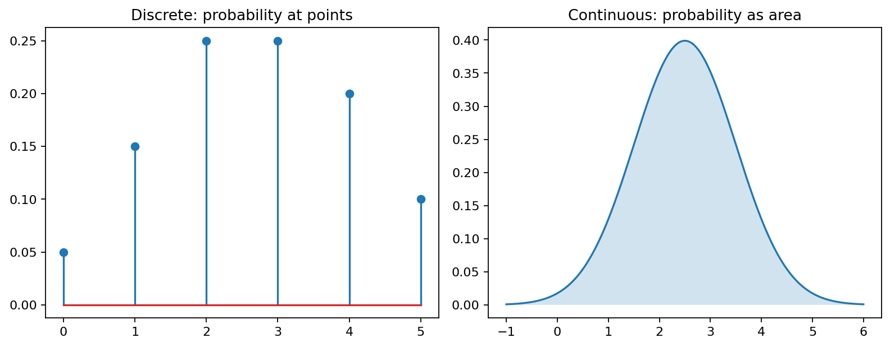
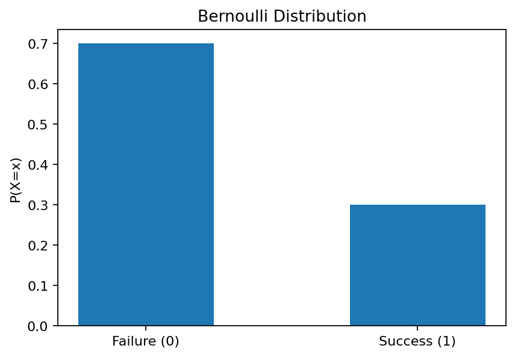
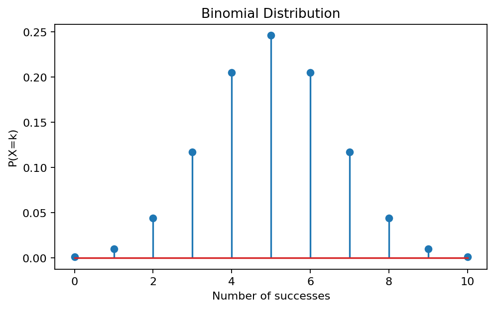
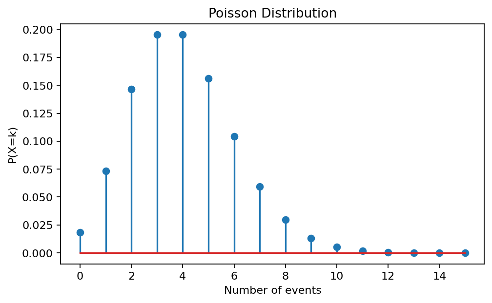
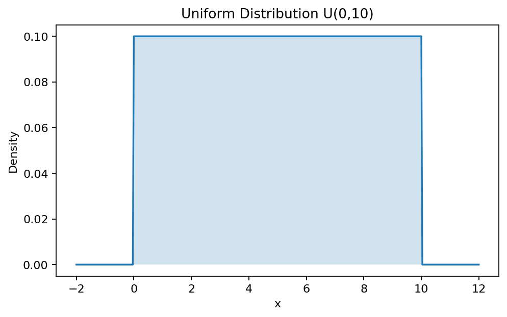
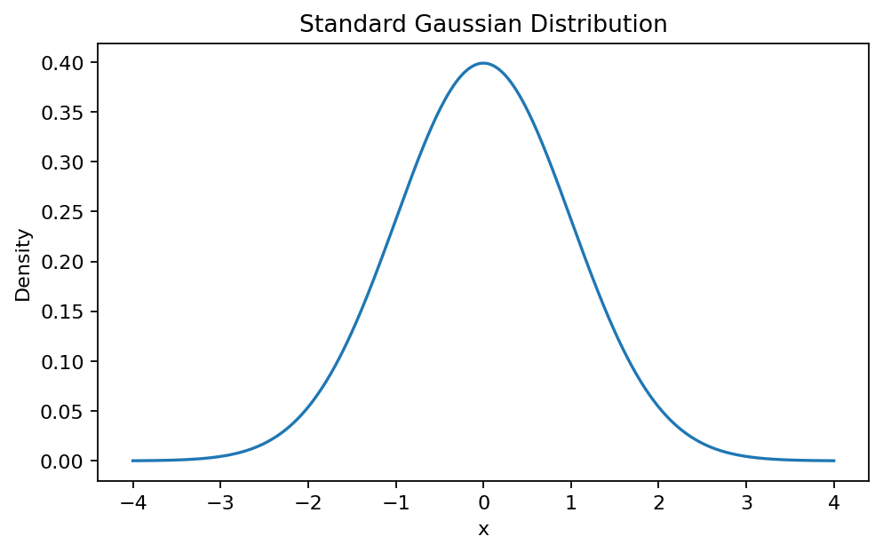
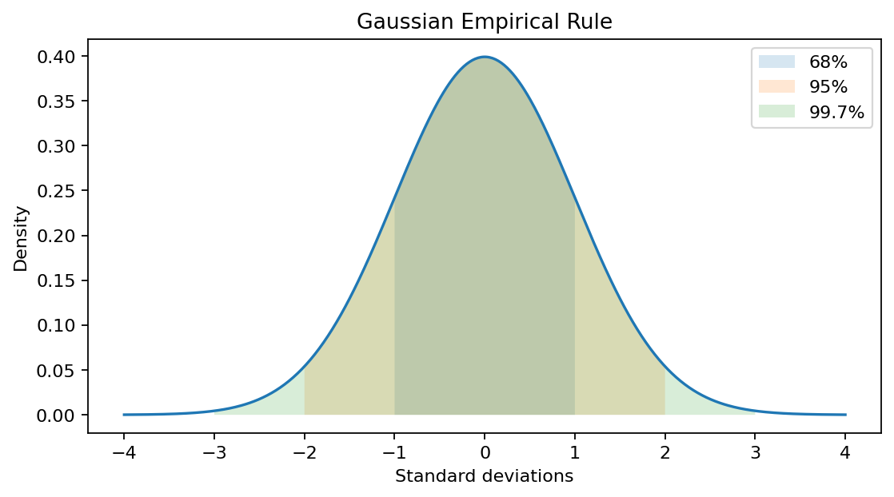
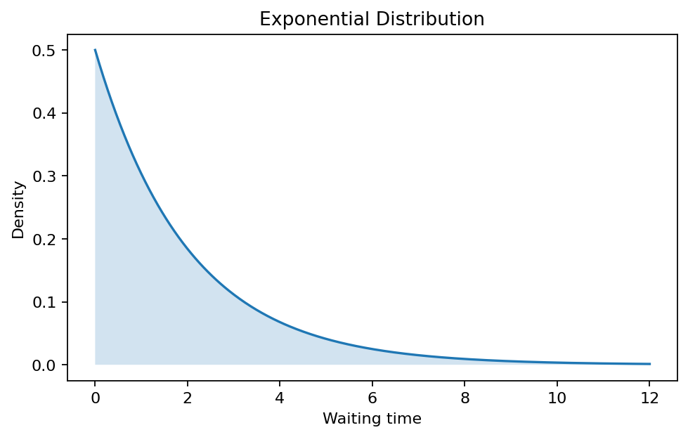

# :classical_building: Mathematics for IT Course - M.Tech. 1st Semester, IIIT Allahabad
## Unit 3: Probability and Random Variables
### Current Topic: Common Probability Distributions - Bernoulli, Binomial, Poisson, Uniform, Gaussian and Exponential Distributions
#### Introduces six fundamental probability distributions, their assumptions, formulas, properties, applications, visual intuition, and Python implementations.
---
## 👥 Instructor Information
* **Edited by Instructor:** [Dr. Mohammed Javed](https://sites.google.com/site/mohammedjaved2016/)
* **Email:** javed@iiita.ac.in
* **Teaching Assistants:** Mr. Apurba Chakraborty (rsi2024005@iiita.ac.in)
---
## 🎯 Learning objectives

You will learn to:
- distinguish discrete and continuous distributions;
- identify the appropriate distribution for a modeling problem;
- calculate PMFs and PDFs;
- understand parameters, expectation, and variance;
- simulate distributions with NumPy;
- calculate probabilities with SciPy;
- understand relationships among Bernoulli, Binomial, Poisson, and Exponential models.

---

## 1. Discrete and continuous distributions

A probability distribution describes how probability is assigned to values of a random variable.

**Discrete variables** take countable values, such as the number of successes or calls.

**Continuous variables** can take any value in an interval, such as waiting time or height.



### PMF

For a discrete random variable:

$$
p_X(x)=P(X=x)
$$

and:

$$
p_X(x)\ge0,\qquad \sum_xp_X(x)=1.
$$

### PDF

For a continuous random variable:

$$
\int_{-\infty}^{\infty}f_X(x)dx=1
$$

and:

$$
P(a\le X\le b)=\int_a^b f_X(x)dx.
$$

Importantly:

$$
P(X=x)=0
$$

for an individual point of a continuous distribution.

---

# 2. Bernoulli Distribution

The Bernoulli distribution models **one experiment with two outcomes**.

$$
X=
\begin{cases}
1 & \text{success}\\
0 & \text{failure}
\end{cases}
$$

If the probability of success is $(p)$, then:

$$
P(X=1)=p,\qquad P(X=0)=1-p.
$$

### PMF

$$
\boxed{P(X=x)=p^x(1-p)^{1-x}}
$$



### Applications

- coin toss;
- defective/non-defective item;
- spam/not-spam email;
- fraud/not-fraud transaction;
- pass/fail test.

### Mean and variance

$$
\boxed{E[X]=p}
$$

$$
\boxed{Var(X)=p(1-p)}
$$

### Python

```python
import numpy as np
import matplotlib.pyplot as plt

p = 0.3
x = np.array([0, 1])
pmf = np.array([1-p, p])

plt.bar(x, pmf, width=0.5)
plt.xticks([0, 1])
plt.xlabel("Outcome")
plt.ylabel("Probability")
plt.title("Bernoulli Distribution")
plt.show()
```

Simulation:

```python
rng = np.random.default_rng(42)
samples = rng.binomial(1, 0.3, 10000)
print(samples.mean())
```

---

# 3. Binomial Distribution

The Binomial distribution counts the number of successes in $(n)$ independent Bernoulli trials, each having success probability $(p)$.

$$
\boxed{X\sim Binomial(n,p)}
$$

### PMF

$$
\boxed{
P(X=k)={n\choose k}p^k(1-p)^{n-k}
}
$$

where:

$$
{n\choose k}=\frac{n!}{k!(n-k)!}.
$$



### Mean and variance

$$
\boxed{E[X]=np}
$$

$$
\boxed{Var(X)=np(1-p)}
$$

### Example

If a player makes a free throw with probability $(p=0.8)$ and takes 10 shots:

$$
X\sim Binomial(10,0.8).
$$

### Python

```python
from scipy.stats import binom

probability = binom.pmf(8, n=10, p=0.8)
print(probability)
```

---

# 4. Bernoulli versus Binomial

| Bernoulli | Binomial |
|---|---|
| One trial | $(n)$ trials |
| Two outcomes | Counts successes |
| Values 0 or 1 | Values 0 through $(n)$ |
| Parameter $(p)$ | Parameters $(n,p)$ |
| Mean $(p)$ | Mean $(np)$ |
| Variance $(p(1-p))$ | Variance $(np(1-p))$ |

A Bernoulli distribution is a special case:

$$
\boxed{Bernoulli(p)=Binomial(1,p)}
$$

---

# 5. Poisson Distribution

The Poisson distribution models the **number of events in a fixed interval**.

Examples:

- calls per minute;
- customers per hour;
- defects per meter;
- website requests per second.

If the expected number of events is $(\lambda)$:

$$
X\sim Poisson(\lambda).
$$

### PMF

$$
\boxed{
P(X=k)=\frac{e^{-\lambda}\lambda^k}{k!}
}
$$



### Mean and variance

$$
\boxed{E[X]=\lambda}
$$

$$
\boxed{Var(X)=\lambda}
$$

### Example

If a help desk receives 4 calls per hour:

$$
X\sim Poisson(4).
$$

The probability of exactly 3 calls is:

```python
from scipy.stats import poisson
print(poisson.pmf(3, mu=4))
```

---

# 6. Binomial-Poisson approximation

When $(n)$ is large, $(p)$ is small, and $(np=\lambda)$:

$$
\boxed{Binomial(n,p)\approx Poisson(np)}
$$

Example:

$$
n=1000,\quad p=0.004,\quad np=4.
$$

Thus:

$$
Binomial(1000,0.004)\approx Poisson(4).
$$

---

# 7. Uniform Distribution

The continuous Uniform distribution has constant density on an interval.

$$
X\sim Uniform(a,b)
$$

with:

$$
\boxed{
f(x)=
\begin{cases}
\frac1{b-a},&a\le x\le b\\
0,&\text{otherwise}
\end{cases}}
$$



### Mean and variance

$$
\boxed{E[X]=\frac{a+b}{2}}
$$

$$
\boxed{Var(X)=\frac{(b-a)^2}{12}}
$$

### Python

```python
import numpy as np
import matplotlib.pyplot as plt

a, b = 0, 10
x = np.linspace(-2, 12, 500)
pdf = np.where((x >= a) & (x <= b), 1/(b-a), 0)

plt.plot(x, pdf)
plt.fill_between(x, pdf, alpha=0.2)
plt.xlabel("x")
plt.ylabel("Density")
plt.title("Uniform Distribution")
plt.show()
```

---

# 8. Gaussian / Normal Distribution

The Gaussian, or Normal, distribution is a central model for continuous measurements and naturally occurring variation.

$$
\boxed{X\sim N(\mu,\sigma^2)}
$$

### PDF

$$
\boxed{
f(x)=
\frac{1}{\sigma\sqrt{2\pi}}
e^{-\frac{(x-\mu)^2}{2\sigma^2}}
}
$$



The curve is bell-shaped and symmetric about $(\mu)$.

### Standard Normal

When:

$$
\mu=0,\qquad\sigma=1,
$$

we have:

$$
X\sim N(0,1).
$$

### z-score

$$
\boxed{z=\frac{x-\mu}{\sigma}}
$$

Example: if \(x=85\), \(\mu=70\), and \(\sigma=10\):

$$
z=1.5.
$$

### Python

```python
from scipy.stats import norm

print(norm.pdf(0, loc=0, scale=1))
print(norm.cdf(1.5))
```

---

# 9. The 68–95–99.7 Rule

For a Gaussian distribution, approximately:

- 68% of values fall within $(1\sigma)$ of the mean;
- 95% fall within $(2\sigma)$;
- 99.7% fall within $(3\sigma)$.



This is also called the **empirical rule**.

---

# 10. Exponential Distribution

The Exponential distribution models **waiting time between events** in a Poisson process.

If the event rate is $(\lambda)$:

$$
X\sim Exponential(\lambda).
$$

### PDF

$$
\boxed{f(x)=\lambda e^{-\lambda x}},\qquad x\ge0
$$



### CDF and survival probability

$$
\boxed{F(x)=1-e^{-\lambda x}}
$$

$$
\boxed{P(X>t)=e^{-\lambda t}}
$$

### Mean and variance

$$
\boxed{E[X]=\frac1\lambda}
$$

$$
\boxed{Var(X)=\frac1{\lambda^2}}
$$

### Example

At rate $(\lambda=2)$ customers/minute:

$$
E[X]=0.5\text{ minutes}.
$$

### Python

```python
from scipy.stats import expon

rate = 2
print(expon.sf(1, scale=1/rate))
```

> **Important:** NumPy/SciPy use `scale = 1 / lambda`.

---

# 11. Memoryless Property

The Exponential distribution satisfies:

$$
\boxed{
P(X>s+t\mid X>s)=P(X>t)
}
$$

So the remaining waiting time does not depend on how long you have already waited.

---

# 12. Poisson and Exponential Connection

For a Poisson process with rate $(\lambda)$:

- **Poisson** models the number of events in an interval.
- **Exponential** models the waiting time between events.

Thus:

$$
\boxed{\text{Poisson counts} \longleftrightarrow \text{Exponential waiting times}}
$$

---

# 13. Choosing a Distribution

| Situation | Distribution |
|---|---|
| One binary experiment | Bernoulli |
| Number of successes in fixed independent trials | Binomial |
| Number of events in an interval | Poisson |
| Equal likelihood over an interval | Uniform |
| Bell-shaped continuous variation | Gaussian |
| Waiting time between events | Exponential |

---

# 14. Mean and Variance Summary

| Distribution | Mean | Variance |
|---|---:|---:|
| Bernoulli($(p)$) | $(p)$ | $(p(1-p))$ |
| Binomial($(n,p)$) | $(np)$ | $(np(1-p))$ |
| Poisson($(\lambda)$) | $(\lambda)$ | $(\lambda)$ |
| Uniform($(a,b)$) | $((a+b)/2)$ | $((b-a)^2/12)$ |
| Gaussian($(\mu,\sigma^2)$) | $(\mu)$ | $(\sigma^2)$ |
| Exponential($(\lambda)$) | $(1/\lambda)$ | $(1/\lambda^2)$ |

---

# 15. Python Simulation

```python
import numpy as np

rng = np.random.default_rng(42)

bernoulli_samples = rng.binomial(1, 0.3, 1000)
binomial_samples = rng.binomial(10, 0.5, 1000)
poisson_samples = rng.poisson(4, 1000)
uniform_samples = rng.uniform(0, 10, 1000)
gaussian_samples = rng.normal(0, 1, 1000)
exponential_samples = rng.exponential(2, 1000)
```

The Exponential sampler's `2` is a **scale**, corresponding to rate:

$$
\lambda=1/2.
$$

---

# 16. SciPy Reference

```python
from scipy.stats import bernoulli, binom, poisson
from scipy.stats import uniform, norm, expon

print(bernoulli.pmf(1, 0.3))
print(binom.pmf(5, n=10, p=0.5))
print(poisson.pmf(3, mu=4))
print(uniform.pdf(5, loc=0, scale=10))
print(norm.pdf(0, loc=0, scale=1))
print(expon.pdf(2, scale=2))
```

---

# 17. Common Mistakes

1. Treating a PDF value as a probability. For continuous variables, probability is an area.
2. Using Binomial when trials are not independent or the success probability is not constant.
3. Treating Poisson $(\lambda)$ as a probability rather than an expected count/rate.
4. Confusing Exponential rate and scale.
5. Assuming every real dataset is Gaussian without checking the model.

---

# 18. Practice Questions

1. Define a probability distribution.
2. Distinguish discrete and continuous variables.
3. Give three applications of Bernoulli trials.
4. Derive the Bernoulli mean and variance.
5. Explain how Binomial is built from Bernoulli trials.
6. Calculate $(P(X=3))$ for $(X\sim Binomial(10,0.4))$.
7. When is Poisson appropriate?
8. Calculate $(P(X=2))$ for $(X\sim Poisson(3))$.
9. Explain the Poisson approximation to Binomial.
10. Find the mean and variance of $(Uniform(2,8))$.
11. Explain the 68–95–99.7 rule.
12. Calculate the z-score for $(x=85,\mu=70,\sigma=10)$.
13. Define the Exponential distribution.
14. Explain the Poisson-Exponential relationship.
15. Explain the memoryless property.
16. Simulate all six distributions in Python.
17. Plot their empirical distributions.
18. Compare simulated and theoretical means and variances.

---

# 19. Summary

- **Bernoulli:** one binary trial.
- **Binomial:** number of successes in fixed Bernoulli trials.
- **Poisson:** number of events in an interval.
- **Uniform:** constant density over an interval.
- **Gaussian:** symmetric bell-shaped continuous variation.
- **Exponential:** waiting time between events.

The most important modeling skill is to select a distribution whose assumptions match the process that generated the data.

---
## ❓: CHALLENGING Questions - Check Your Understanding 
* ➡️ **[Q-01]**
* ➡️ 

---
## 📚 References 
* **[R-01]** Linear Algebra by Gilbert Strang, MIT Press
* **[R-02]** AI Tools for examples and codes
