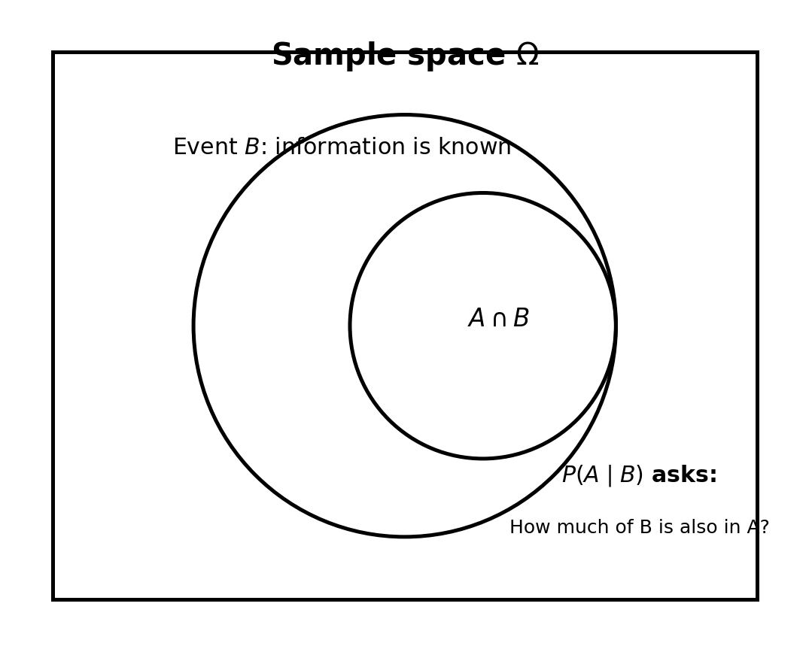
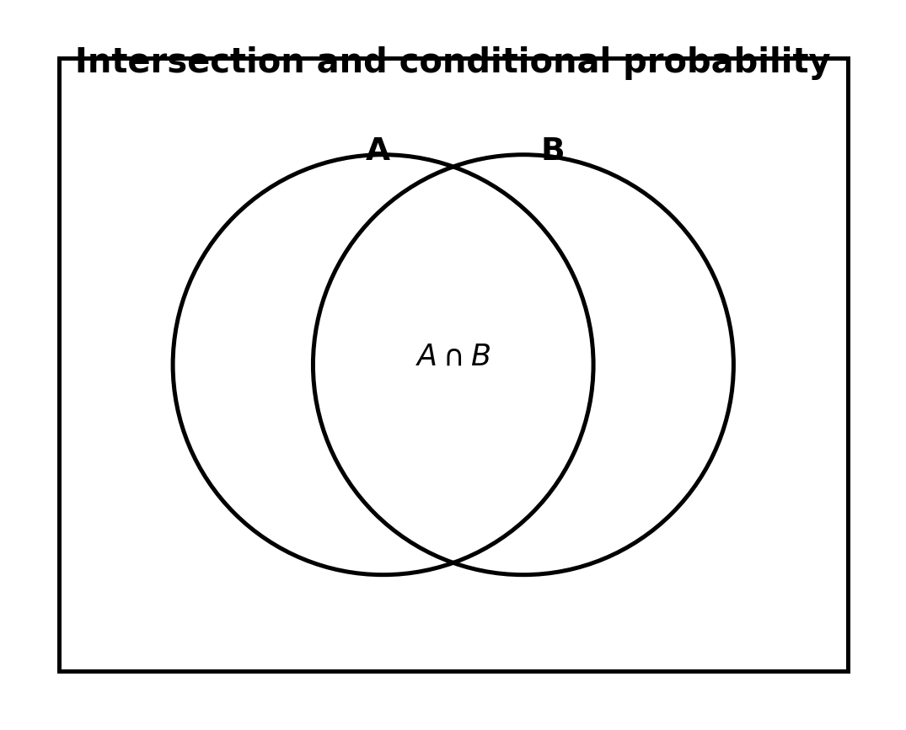
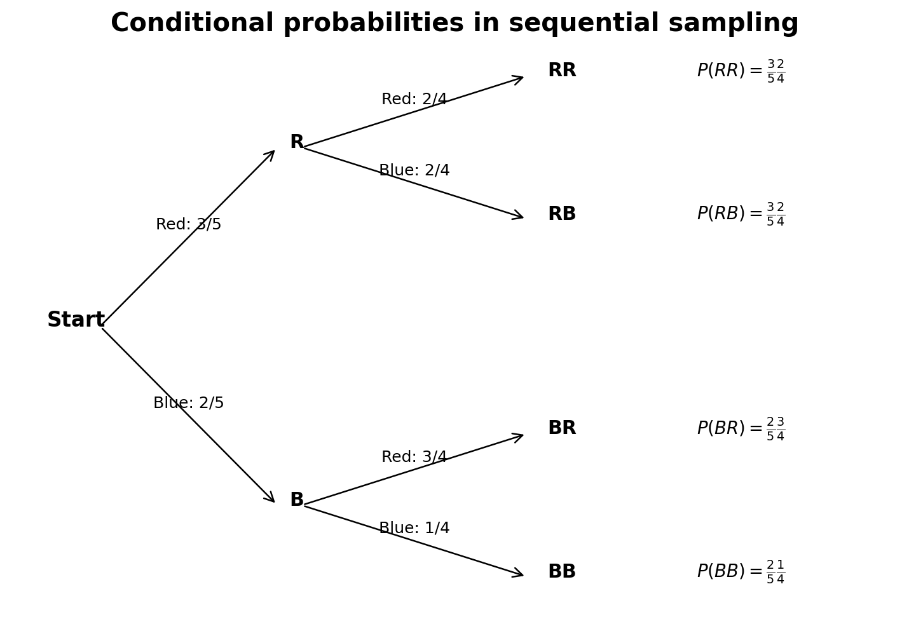
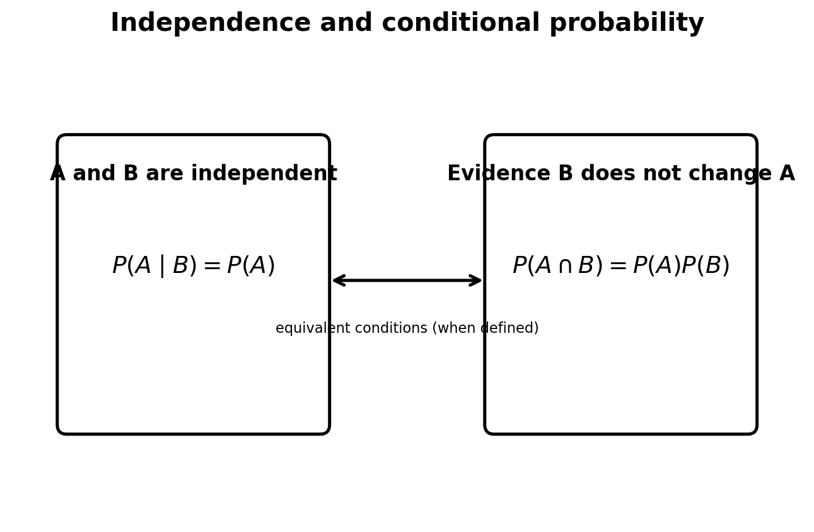
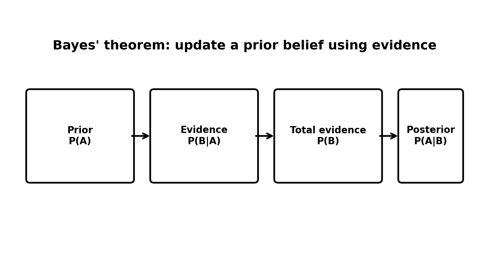

# :classical_building: Mathematics for IT Course - M.Tech. 1st Semester, IIIT Allahabad
## Unit 1: Linear Algebra and Matrix Theory
### Current Topic: Conditional Probability - explanations, formulas, figures, examples, and Python implementations
---
## 👥 Instructor Information
* **Edited by Instructor:** [Dr. Mohammed Javed](https://sites.google.com/site/mohammedjaved2016/)
* **Email:** javed@iiita.ac.in
* **Teaching Assistants:** Mr. Apurba Chakraborty (rsi2024005@iiita.ac.in)
---
## Learning objectives

You should be able to:

- explain conditional probability;
- calculate $(P(A\mid B))$;
- interpret conditional probability with Venn diagrams;
- distinguish $(P(A\mid B))$ from $(P(B\mid A))$;
- use the multiplication rule;
- identify independent events;
- solve sequential probability problems;
- use the law of total probability and Bayes' theorem;
- implement the concepts in Python and verify them by simulation.

---

## 1. Why conditional probability?

Ordinary probability asks how likely event $(A)$ is.

Conditional probability asks how likely $(A)$ is **when we already know that $(B)$ occurred**.

For a standard 52-card deck, if $(K)$ means "king" and $(F)$ means "face card":

$$
P(K)=\frac{4}{52}
$$

but, given that the card is a face card,

$$
P(K\mid F)=\frac{4}{12}=\frac13.
$$

The additional information changes the probability.

---

## 2. Definition

For events $(A)$ and $(B)$, where $(P(B)>0)$,

$$
\boxed{P(A\mid B)=\frac{P(A\cap B)}{P(B)}}
$$

---

## 3. Intuition: the sample space gets smaller

Once $(B)$ is known to have occurred, we restrict our attention to $(B)$.



We then ask: what fraction of $(B)$ is also in $(A)$?

---

## 4. Venn diagram interpretation

The intersection $(A\cap B)$ contains outcomes where both events occur.



Thus:

$$
P(A\mid B)=
\frac{P(A\cap B)}{P(B)}.
$$

---

## 5. Example: rolling a die

Let

$$
\Omega=\{1,2,3,4,5,6\},
\quad A=\{2,4,6\},
\quad B=\{4,5,6\}.
$$

Then

$$
A\cap B=\{4,6\}.
$$

So:

$$
P(A\cap B)=\frac26=\frac13,
\qquad
P(B)=\frac36=\frac12.
$$

Therefore:

$$
P(A\mid B)=\frac{1/3}{1/2}=\frac23.
$$

Once we know the result is greater than 3, the possible results are only $(\{4,5,6\})$, and two of these are even.

---

## 6. $(P(A\mid B))$ is not generally $(P(B\mid A))$

In general:

$$
P(A\mid B)\neq P(B\mid A).
$$

For example, let:

$$
A=\{2,4,6\},\qquad B=\{2,3,4,5,6\}.
$$

Then:

$$
P(A\mid B)=\frac35,
\qquad
P(B\mid A)=1.
$$

The order of the condition matters.

---

## 7. Multiplication rule

From the definition:

$$
\boxed{P(A\cap B)=P(A\mid B)P(B)}
$$

and:

$$
\boxed{P(A\cap B)=P(B\mid A)P(A)}.
$$

---

## 8. Sequential experiments

Conditional probability is especially important when experiments happen in stages.

Suppose a box contains 3 red balls and 2 blue balls. Two balls are selected without replacement.



For example:

$$
P(R_1)=\frac35,
\qquad
P(R_2\mid R_1)=\frac24.
$$

Therefore:

$$
P(R_1\cap R_2) = \frac35\cdot\frac24 = \frac3{10}.
$$

---

## 9. Python implementation

For a finite equally likely sample space:

```python
def conditional_probability(A, B, sample_space):
    """Calculate P(A | B)."""
    if not B.issubset(sample_space):
        raise ValueError("B must be a subset of the sample space.")

    if len(B) == 0:
        raise ValueError("Conditioning event B cannot be empty.")

    return len(A & B) / len(B)


omega = {1, 2, 3, 4, 5, 6}
A = {2, 4, 6}
B = {4, 5, 6}

print("P(A | B) =", conditional_probability(A, B, omega))
```

Expected result:

```text
P(A | B) = 0.6666666666666666
```

---

## 10. General finite probability distribution

```python
def event_probability(event, probabilities):
    return sum(probabilities[x] for x in event)


def conditional_probability(A, B, probabilities):
    p_intersection = event_probability(A & B, probabilities)
    p_B = event_probability(B, probabilities)

    if p_B == 0:
        raise ValueError("P(B) must be greater than zero.")

    return p_intersection / p_B


probabilities = {i: 1/6 for i in range(1, 7)}

A = {2, 4, 6}
B = {4, 5, 6}

print(conditional_probability(A, B, probabilities))
```

---

## 11. Independence

Events $(A)$ and $(B)$ are independent if knowing that one occurred does not change the probability of the other.

When $(P(B)>0)$:

$$
\boxed{P(A\mid B)=P(A)}
$$

An equivalent condition is:

$$
\boxed{P(A\cap B)=P(A)P(B)}.
$$



### Example: two coin tosses

Let $(A)$ mean "first toss is heads" and $(B)$ mean "second toss is heads."

Then:

$$
P(A)=P(B)=\frac12,
$$

and:

$$
P(A\cap B)=\frac14=P(A)P(B).
$$

Therefore $(A)$ and $(B)$ are independent.

---

## 12. Python: checking independence

```python
def event_probability(event, probabilities):
    return sum(probabilities[x] for x in event)


def is_independent(A, B, probabilities):
    p_A = event_probability(A, probabilities)
    p_B = event_probability(B, probabilities)
    p_A_and_B = event_probability(A & B, probabilities)

    return abs(p_A_and_B - p_A * p_B) < 1e-12


probabilities = {
    "HH": 1/4,
    "HT": 1/4,
    "TH": 1/4,
    "TT": 1/4
}

A = {"HH", "HT"}
B = {"HH", "TH"}

print(is_independent(A, B, probabilities))
```

---

## 13. Law of total probability

If $(B_1,\ldots,B_n)$ form a partition of the sample space:

$$
\boxed{
P(A)=\sum_i P(A\mid B_i)P(B_i)
}
$$

For two complementary events:

$$
P(A)=P(A\mid B)P(B)+P(A\mid B^c)P(B^c).
$$

---

## 14. Bayes' theorem

Bayes' theorem reverses conditional probability:

$$
\boxed{
P(A\mid B)=
\frac{P(B\mid A)P(A)}{P(B)}
}
$$




### Terminology

- **Prior:** $(P(A))$
- **Likelihood:** $(P(B\mid A))$
- **Evidence:** $(P(B))$
- **Posterior:** $(P(A\mid B))$

---

## 15. Bayes example

Suppose:

$$
P(D)=0.01,
$$

$$
P(+\mid D)=0.95,
$$

and:

$$
P(+\mid D^c)=0.05.
$$

First:

$$
P(+) = (0.95)(0.01)+(0.05)(0.99).
$$

Then:

$$
P(D\mid +) = \frac{(0.95)(0.01)} {(0.95)(0.01)+(0.05)(0.99)} \approx0.161
$$

Thus the posterior probability is approximately **16.1%**.

---

## 16. Python: Bayes' theorem

```python
prior = 0.01
sensitivity = 0.95
false_positive_rate = 0.05

p_positive = (
    sensitivity * prior
    + false_positive_rate * (1 - prior)
)

posterior = sensitivity * prior / p_positive

print("P(Disease | Positive) =", posterior)
print("Percentage =", posterior * 100)
```

---

## 17. Simulation of Bayes' theorem

```python
import numpy as np

rng = np.random.default_rng(42)
n = 1_000_000

disease = rng.random(n) < 0.01

positive = np.where(
    disease,
    rng.random(n) < 0.95,
    rng.random(n) < 0.05
)

posterior_estimate = disease[positive].mean()

print("Simulated posterior:", posterior_estimate)
```

With a large $(n)$, the simulated result should be close to the theoretical result.

---

## 18. Sampling without replacement

Suppose a box contains 5 red and 3 blue balls.

$$
P(R_1)=\frac58.
$$

After a red first draw:

$$
P(R_2\mid R_1)=\frac47.
$$

Therefore:

$$
P(R_1\cap R_2) = \frac58\cdot\frac47 = \frac5{14}.
$$

### Python simulation

```python
import random

def draw_two_balls():
    box = ["R"] * 5 + ["B"] * 3
    return random.sample(box, 2)


trials = 100_000
both_red = 0

for _ in range(trials):
    first, second = draw_two_balls()

    if first == "R" and second == "R":
        both_red += 1

experimental = both_red / trials
theoretical = (5 / 8) * (4 / 7)

print("Experimental:", experimental)
print("Theoretical:", theoretical)
```

---

## 19. Contingency-table example

Suppose:

| | Passed | Failed | Total |
|---|---:|---:|---:|
| Group A | 45 | 5 | 50 |
| Group B | 30 | 20 | 50 |
| Total | 75 | 25 | 100 |

Then:

$$
P(\text{Pass}\mid A)=\frac{45}{50}=0.9
$$

while:

$$
P(A\mid\text{Pass})=\frac{45}{75}=0.6.
$$

### Python

```python
passed_A = 45
total_A = 50
passed_total = 75

p_pass_given_A = passed_A / total_A
p_A_given_pass = passed_A / passed_total

print("P(Pass | A) =", p_pass_given_A)
print("P(A | Pass) =", p_A_given_pass)
```

---

## 20. Important identities

### Conditional probability

$$
P(A\mid B)=\frac{P(A\cap B)}{P(B)}
$$

### Multiplication rule

$$
P(A\cap B)=P(A\mid B)P(B)
$$

### Independence

$$
P(A\cap B)=P(A)P(B)
$$

### Complement

$$
P(A^c\mid B)=1-P(A\mid B)
$$

### Total probability

$$
P(A)=\sum_iP(A\mid B_i)P(B_i)
$$

### Bayes' theorem

$$
P(A\mid B)=
\frac{P(B\mid A)P(A)}{P(B)}.
$$

---

## 21. Problem-solving strategy

1. Define the events.
2. Identify the condition.
3. Find the intersection.
4. Apply the conditional-probability formula.
5. Check that the answer is between 0 and 1.
6. Consider independence or Bayes' theorem where appropriate.
7. Use a probability tree for multi-stage problems.

---

## 22. Common mistakes

### Mistake 1: Reversing the condition

Do not assume:

$$
P(A\mid B)=P(B\mid A).
$$

### Mistake 2: Wrong denominator

For $(P(A\mid B))$, the denominator is $(P(B))$.

### Mistake 3: Ignoring $(P(B)=0)$

The standard definition requires $(P(B)>0)$.

### Mistake 4: Assuming independence

Independence must be justified mathematically.

### Mistake 5: Ignoring changing probabilities

In sampling without replacement, later probabilities can change.

---

## 23. Summary

Conditional probability describes probability after receiving additional information.

The central formula is:

$$
P(A\mid B)=\frac{P(A\cap B)}{P(B)}.
$$

Key ideas:

- Conditioning restricts the effective sample space.
- $(P(A\mid B))$ and $(P(B\mid A))$ are generally different.
- The multiplication rule connects conditional and joint probabilities.
- Independence means conditioning does not change probability.
- Probability trees are useful for multi-stage experiments.
- The law of total probability combines probabilities over a partition.
- Bayes' theorem reverses conditional probabilities and supports probabilistic updating.
- Python sets, dictionaries, random simulation, and NumPy can implement these concepts.

---

## 24. Practice questions

1. Define conditional probability.
2. State the formula for $(P(A\mid B))$.
3. Why must $(P(B)>0)$?
4. Explain conditional probability as a restricted sample space.
5. A fair die is rolled. Find $(P(\text{even}\mid\text{greater than 3}))$.
6. Give an example where $(P(A\mid B)\neq P(B\mid A))$.
7. State the multiplication rule.
8. Explain independent versus mutually exclusive events.
9. Explain why sampling without replacement creates conditional probabilities.
10. State the law of total probability.
11. State Bayes' theorem and explain prior, likelihood, evidence, and posterior.
12. Implement conditional probability using Python sets.
13. Simulate two-ball draws without replacement.
14. Write Python code to check whether two finite events are independent.
15. Simulate a diagnostic test and compare empirical and theoretical posterior probabilities.

---
## ❓: CHALLENGING Questions - Check Your Understanding 
* ➡️ **[Q-01]**
* ➡️ 

---
## 📚 References 
* **[R-01]** Linear Algebra by Gilbert Strang, MIT Press
* **[R-02]** ChatGPT - for examples and codes
