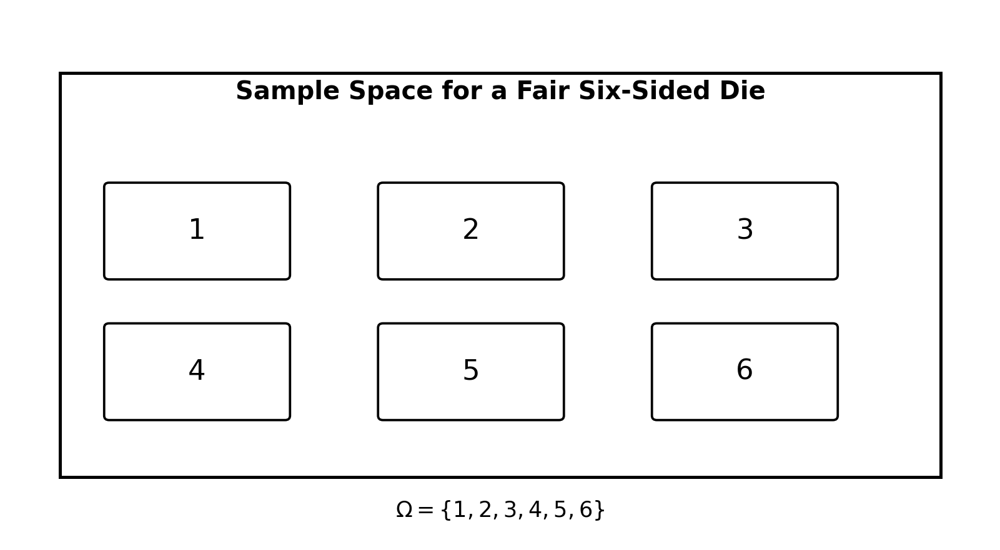
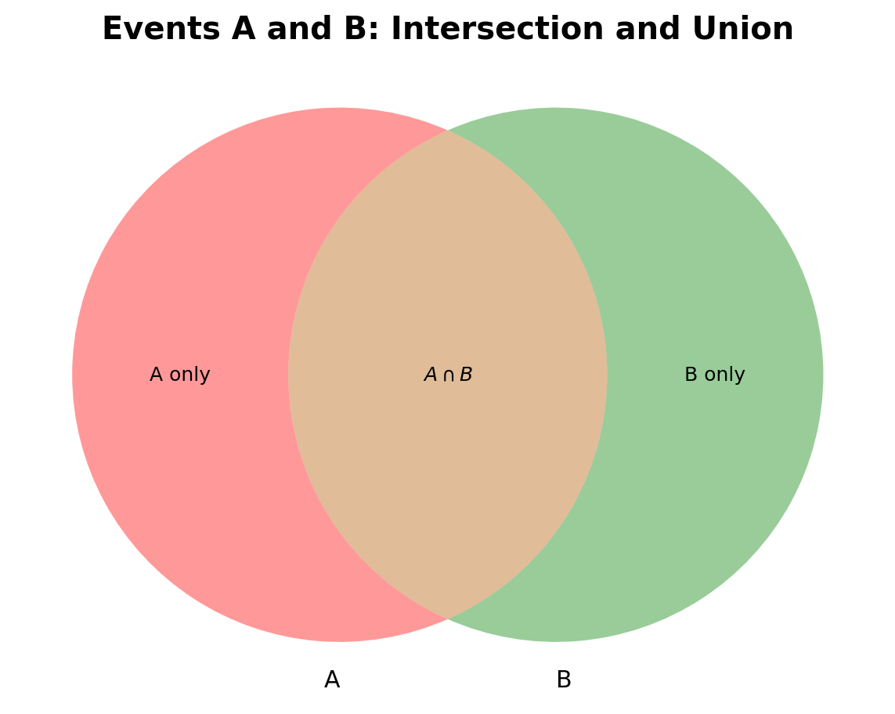
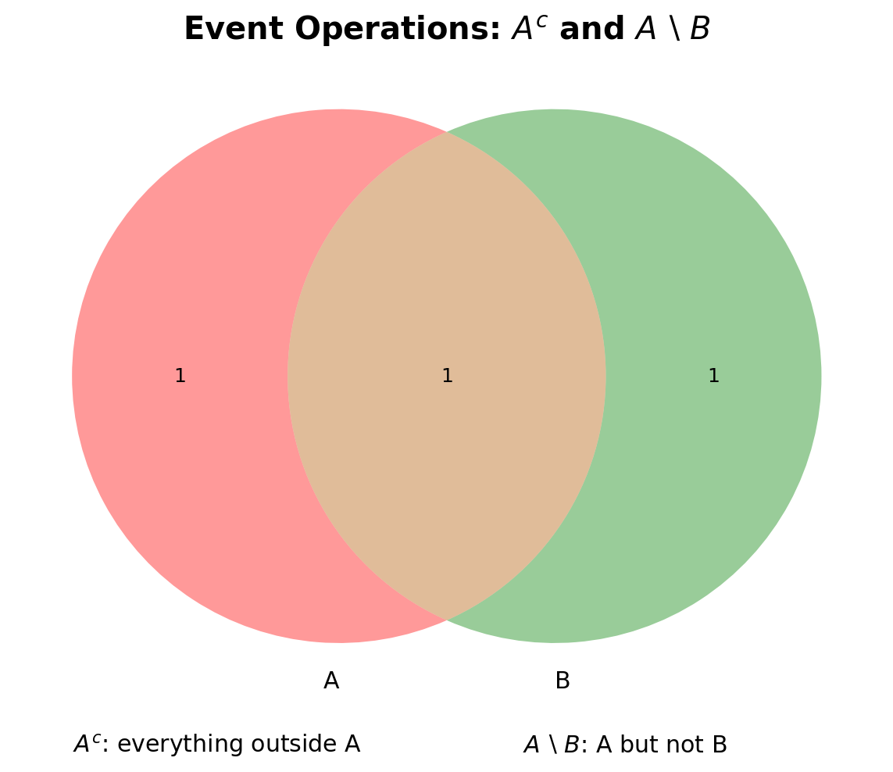
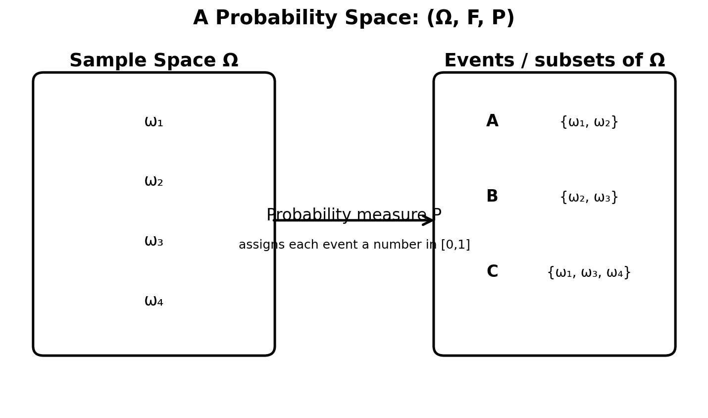
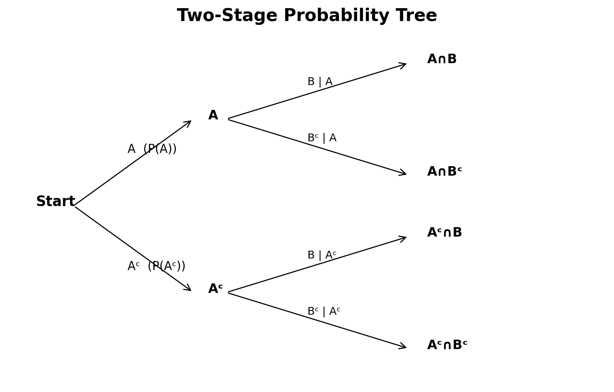

# :classical_building: Mathematics for IT Course - M.Tech. 1st Semester, IIIT Allahabad
## Unit 1: Linear Algebra and Matrix Theory
### Current Topic: Events and Probability Spaces - intuitive explanations, figures, examples, and Python implementations
---
## 👥 Instructor Information
* **Edited by Instructor:** [Dr. Mohammed Javed](https://sites.google.com/site/mohammedjaved2016/)
* **Email:** javed@iiita.ac.in
* **Teaching Assistants:** Mr. Apurba Chakraborty (rsi2024005@iiita.ac.in)
---
## Learning objectives

After studying this material, you should be able to:

- explain a random experiment, outcome, and sample space;
- distinguish between an event and an outcome;
- construct a probability space $(\Omega,\mathcal F,P)$;
- perform event operations such as union, intersection, complement, and difference;
- use the axioms of probability;
- calculate probabilities of equally likely events;
- understand mutually exclusive and exhaustive events;
- implement basic probability concepts in Python;
- simulate random experiments and compare theoretical and experimental probabilities.

---

## 1. Introduction

Probability provides a mathematical language for describing **uncertainty**.

Examples of uncertain experiments include:

- tossing a coin;
- rolling a die;
- selecting a card from a deck;
- measuring tomorrow's rainfall;
- observing whether a machine fails during a day.

A probability model does not predict exactly what will happen in one trial. Instead, it assigns numbers between 0 and 1 to events, representing how plausible those events are.

The basic building blocks are:

1. **Random experiment**
2. **Outcome**
3. **Sample space**
4. **Event**
5. **Probability measure**

---

## 2. Random experiment

A **random experiment** is a process that has a well-defined set of possible outcomes, but whose exact outcome cannot be known with certainty in advance.

### Examples

| Experiment | Possible outcomes |
|---|---|
| Toss a coin | Head, Tail |
| Roll a die | 1, 2, 3, 4, 5, 6 |
| Draw one card | Any of the 52 cards |
| Inspect a bulb | Working, Defective |

The experiment should be repeatable under essentially the same conditions.

---

## 3. Outcome

An **outcome** is one possible result of a random experiment.

For a die roll:

$$
\omega \in \{1,2,3,4,5,6\}
$$

Here, $(\omega=4)$ means that the observed outcome is 4.

It is important to distinguish:

- **Outcome:** one possible result, such as 4.
- **Event:** a collection of outcomes, such as getting an even number.

---

## 4. Sample space

The **sample space**, denoted by $(\Omega)$, is the set of **all possible outcomes** of an experiment.

### Example: one die

$$
\Omega=\{1,2,3,4,5,6\}
$$

The following figure visualizes the six possible outcomes.



### Example: coin toss

For one coin toss:

$$
\Omega=\{H,T\}
$$

For two coin tosses:

$$
\Omega=\{HH,HT,TH,TT\}
$$

The sample space must be chosen carefully so that all outcomes relevant to the experiment are represented.

---

## 5. Event

An **event** is a subset of the sample space.

If

$$
\Omega=\{1,2,3,4,5,6\},
$$

then:

- $(A=\{2,4,6\})$: getting an even number;
- $(B=\{1,2,3\})$: getting a number less than 4;
- $(C=\{6\})$: getting a 6.

Since each event is a subset of $(\Omega)$,

$$
A\subseteq\Omega.
$$

### Event versus outcome

The outcome 4 is a single element:

$$
4\in\Omega.
$$

The event "even number" is a set:

$$
\{2,4,6\}\subseteq\Omega.
$$

Thus, in set notation:

- use $(\in)$ for an outcome belonging to an event;
- use $(\subseteq)$ for an event being contained in the sample space.

---

## 6. Types of events

### 6.1 Simple event

A **simple event** contains exactly one outcome.

Example:

$$
A=\{6\}
$$

when rolling a die.

### 6.2 Compound event

A **compound event** contains more than one outcome.

Example:

$$
B=\{2,4,6\}.
$$

### 6.3 Certain event

The entire sample space is a certain event:

$$
P(\Omega)=1.
$$

### 6.4 Impossible event

The empty set is an impossible event:

$$
\varnothing.
$$

Therefore,

$$
P(\varnothing)=0.
$$

### 6.5 Complementary event

The complement of $(A)$, written $(A^c)$, contains all outcomes in $(\Omega)$ that are not in $(A)$.

$$
A^c=\Omega\setminus A.
$$

For

$$
\Omega=\{1,2,3,4,5,6\}, \quad A=\{2,4,6\},
$$

we have

$$
A^c=\{1,3,5\}.
$$

---

## 7. Set operations on events

Events behave like sets, so standard set operations can be used.

### 7.1 Union

The union $(A\cup B)$ means **A or B or both**.

$$
A\cup B=\{\omega:\omega\in A\text{ or }\omega\in B\}.
$$

### 7.2 Intersection

The intersection $(A\cap B)$ means **A and B occur together**.

$$
A\cap B=\{\omega:\omega\in A\text{ and }\omega\in B\}.
$$



### 7.3 Complement

$$
A^c=\Omega\setminus A.
$$

It means that $(A)$ does not occur.

### 7.4 Difference

$$
A\setminus B
$$

contains outcomes that are in $(A)$ but not in $(B)$.



---

## 8. De Morgan's laws

Two important identities are:

$$
(A\cup B)^c=A^c\cap B^c
$$

and

$$
(A\cap B)^c=A^c\cup B^c.
$$

These laws are useful for simplifying probability expressions.

For example:

$$
P((A\cup B)^c)=P(A^c\cap B^c).
$$

---

## 9. Mutually exclusive events

Two events $(A)$ and $(B)$ are **mutually exclusive** if they cannot happen simultaneously.

Mathematically:

$$
A\cap B=\varnothing.
$$

For a single die roll:

$$
A=\{1,3,5\}, \quad B=\{2,4,6\}.
$$

Then

$$
A\cap B=\varnothing.
$$

For mutually exclusive events,

$$
P(A\cup B)=P(A)+P(B).
$$

---

## 10. Exhaustive events

A collection of events is **exhaustive** if together they cover the entire sample space.

For example:

$$
A=\{\text{even}\}, \qquad B=\{\text{odd}\}.
$$

Then

$$
A\cup B=\Omega.
$$

If events are both mutually exclusive and exhaustive, exactly one of them occurs in every trial.

---

## 11. Probability

Probability assigns a number between 0 and 1 to an event.

$$
0\leq P(A)\leq 1.
$$

Interpretation:

- $(P(A)=0)$: impossible;
- $(P(A)=1)$: certain;
- values between 0 and 1: varying degrees of likelihood.

For equally likely finite outcomes:

$$
P(A)=\frac{|A|}{|\Omega|}.
$$

### Example

For a fair die, let

$$
A=\{2,4,6\}.
$$

There are 3 favorable outcomes and 6 total outcomes:

$$
P(A)=\frac{3}{6}=\frac12.
$$

---

## 12. Probability axioms

A probability measure $(P)$ satisfies the following axioms.

### Axiom 1: Non-negativity

For every event $(A)$,

$$
P(A)\geq0.
$$

### Axiom 2: Normalization

$$
P(\Omega)=1.
$$

### Axiom 3: Countable additivity

For pairwise disjoint events $(A_1,A_2,\ldots)$,

$$
P\left(\bigcup_{i=1}^{\infty}A_i\right) = \sum_{i=1}^{\infty}P(A_i).
$$

For finite mutually exclusive events:

$$
P(A_1\cup A_2\cup\cdots\cup A_n) = \sum_{i=1}^{n}P(A_i).
$$

These axioms form the mathematical foundation of probability.

---

## 13. The probability space

A **probability space** is commonly represented as

$$
(\Omega,\mathcal F,P).
$$

It consists of:

### 13.1 Sample space $(\Omega)$

The set of all possible outcomes.

### 13.2 Event collection $(\mathcal F)$

A collection of subsets of $(\Omega)$ called the **sigma-algebra** (or $(\sigma)$-algebra).

It contains the events to which we assign probabilities.

For a finite sample space, it is often convenient to take

$$
\mathcal F=2^\Omega,
$$

the power set of $(\Omega)$.

### 13.3 Probability measure $(P)$

A function

$$
P:\mathcal F\rightarrow[0,1]
$$

that satisfies the probability axioms.



---

## 14. Sigma-algebra

A collection $(\mathcal F)$ is a sigma-algebra on $(\Omega)$ if:

1. $(\Omega\in\mathcal F)$;
2. if $(A\in\mathcal F)$, then $(A^c\in\mathcal F)$;
3. if $(A_1,A_2,\ldots\in\mathcal F)$, then

$$
   \bigcup_{i=1}^{\infty}A_i\in\mathcal F.
 $$

It follows that $(\varnothing\in\mathcal F)$, and that sigma-algebras are also closed under countable intersections and set differences.

### Why do we need $(\mathcal F)$?

For elementary finite probability problems, we often use all subsets of $(\Omega)$, so the sigma-algebra can seem unnecessary.

For more advanced probability—especially continuous random variables and measure theory—we cannot always assign probabilities consistently to every conceivable subset. The sigma-algebra specifies which subsets are treated as measurable events.

---

## 15. Constructing a finite probability space

Suppose a fair die is rolled.

### Step 1: Define the sample space

$$
\Omega=\{1,2,3,4,5,6\}.
$$

### Step 2: Choose the event collection

For a finite elementary model:

$$
\mathcal F=2^\Omega.
$$

### Step 3: Assign probabilities

For a fair die:

$$
P(\{i\})=\frac16
$$

for each $(i\in\Omega)$.

For an event $(A)$:

$$
P(A)=\frac{|A|}{6}.
$$

Thus,

$$
P(\{2,4,6\})=\frac36=\frac12.
$$

---

## 16. Important probability rules

### Complement rule

$$
P(A^c)=1-P(A).
$$

### Addition rule

For any two events:

$$
P(A\cup B) = P(A)+P(B)-P(A\cap B).
$$

If $(A)$ and $(B)$ are mutually exclusive:

$$
P(A\cup B)=P(A)+P(B).
$$

### Bounds

$$
0\leq P(A)\leq1.
$$

If $(A\subseteq B)$, then:

$$
P(A)\leq P(B).
$$

---

## 17. Conditional probability

Although conditional probability is developed more fully in later topics, it naturally extends the idea of probability spaces.

For events $(A)$ and $(B)$, with $(P(B)>0)$:

$$
P(A\mid B)=\frac{P(A\cap B)}{P(B)}.
$$

It means the probability of $(A)$ **given that $(B)$ has occurred**.

Rearranging:

$$
P(A\cap B)=P(A\mid B)P(B).
$$

---

## 18. Independence

Events $(A)$ and $(B)$ are independent if knowing that one occurs does not change the probability of the other.

The mathematical condition is:

$$
P(A\cap B)=P(A)P(B).
$$

Equivalently, when $(P(B)>0)$:

$$
P(A\mid B)=P(A).
$$

### Important distinction

**Mutually exclusive** and **independent** do not mean the same thing.

If $(A)$ and $(B)$ are mutually exclusive and both have positive probability, then

$$
P(A\cap B)=0,
$$

but

$$
P(A)P(B)>0.
$$

Therefore they cannot be independent.

---

## 19. Probability trees

A probability tree is useful when an experiment occurs in stages.

For example, suppose an experiment first determines whether $(A)$ occurs, then determines whether $(B)$ occurs.



The probability of a path is obtained by multiplying the probabilities along that path.

For example:

$$
P(A\cap B)=P(A)P(B\mid A).
$$

This idea is central to conditional probability and Bayes' theorem.

---

# 20. Python implementation

The examples below use standard Python and NumPy. No specialized probability library is required for the basic concepts.

## 20.1 Representing a sample space

```python
# Sample space for one die roll
omega = {1, 2, 3, 4, 5, 6}

print("Sample space:", omega)
print("Number of outcomes:", len(omega))
```

Output:

```text
Sample space: {1, 2, 3, 4, 5, 6}
Number of outcomes: 6
```

---

## 20.2 Representing events

```python
omega = {1, 2, 3, 4, 5, 6}

even = {2, 4, 6}
prime = {2, 3, 5}

print("Even event:", even)
print("Prime event:", prime)
```

---

## 20.3 Union, intersection, complement, and difference

Python sets directly support the required operations.

```python
omega = {1, 2, 3, 4, 5, 6}

A = {2, 4, 6}       # even
B = {1, 2, 3}       # less than 4

union = A | B
intersection = A & B
complement_A = omega - A
difference = A - B

print("A ∪ B =", union)
print("A ∩ B =", intersection)
print("A^c =", complement_A)
print("A \\ B =", difference)
```

---

## 20.4 Probability of an event

For equally likely outcomes:

```python
def probability(event, sample_space):
    return len(event) / len(sample_space)

omega = {1, 2, 3, 4, 5, 6}
A = {2, 4, 6}

print("P(A) =", probability(A, omega))
```

Output:

```text
P(A) = 0.5
```

---

## 20.5 Checking whether an event is valid

An event must be a subset of the sample space.

```python
def is_event(event, sample_space):
    return event.issubset(sample_space)

omega = {1, 2, 3, 4, 5, 6}

A = {2, 4, 6}
B = {7}

print(is_event(A, omega))  # True
print(is_event(B, omega))  # False
```

---

## 20.6 Checking mutually exclusive events

```python
def are_mutually_exclusive(A, B):
    return A.isdisjoint(B)

A = {1, 3, 5}
B = {2, 4, 6}

print(are_mutually_exclusive(A, B))
```

Output:

```text
True
```

---

## 20.7 Checking whether events are exhaustive

```python
def are_exhaustive(events, sample_space):
    combined = set().union(*events)
    return combined == sample_space

omega = {1, 2, 3, 4, 5, 6}

odd = {1, 3, 5}
even = {2, 4, 6}

print(are_exhaustive([odd, even], omega))
```

Output:

```text
True
```

---

## 20.8 General finite probability space

For a non-uniform finite probability space, each outcome can have its own probability.

```python
omega = {"A", "B", "C"}

probabilities = {
    "A": 0.2,
    "B": 0.5,
    "C": 0.3
}

def event_probability(event, probabilities):
    return sum(probabilities[x] for x in event)

event = {"A", "C"}

print("P(event) =", event_probability(event, probabilities))
```

Output:

```text
P(event) = 0.5
```

---

## 20.9 Validating a finite probability distribution

A valid discrete probability distribution must have non-negative probabilities whose sum is 1.

```python
def validate_probability_distribution(probabilities):
    if any(p < 0 for p in probabilities.values()):
        return False

    return abs(sum(probabilities.values()) - 1) < 1e-12


valid = {"A": 0.2, "B": 0.5, "C": 0.3}
invalid = {"A": 0.2, "B": 0.5, "C": 0.5}

print(validate_probability_distribution(valid))
print(validate_probability_distribution(invalid))
```

Output:

```text
True
False
```

---

## 20.10 Simulating a die

Theoretical probability can be compared with experimental probability.

```python
import random

trials = 100_000
even_count = 0

for _ in range(trials):
    roll = random.randint(1, 6)

    if roll % 2 == 0:
        even_count += 1

experimental_probability = even_count / trials

print("Experimental P(even):", experimental_probability)
print("Theoretical P(even):", 3 / 6)
```

As the number of trials becomes large, the experimental probability tends to approach the theoretical probability. This is an illustration of the **law of large numbers**.

---

## 20.11 Simulation using NumPy

NumPy makes large simulations concise and efficient.

```python
import numpy as np

trials = 100_000

rolls = np.random.randint(1, 7, size=trials)

experimental_probability = np.mean(rolls % 2 == 0)

print("Experimental P(even):", experimental_probability)
print("Theoretical P(even):", 0.5)
```

---

## 20.12 Conditional probability in Python

For finite equally likely sample spaces:

```python
def conditional_probability(A, B, sample_space):
    intersection = A & B

    p_A_and_B = len(intersection) / len(sample_space)
    p_B = len(B) / len(sample_space)

    if p_B == 0:
        raise ValueError("P(B) must be greater than zero.")

    return p_A_and_B / p_B


omega = {1, 2, 3, 4, 5, 6}

A = {2, 4, 6}  # even
B = {4, 5, 6}  # greater than 3

print("P(A | B) =", conditional_probability(A, B, omega))
```

Here,

\[
A\cap B=\{4,6\},
\]

so:

\[
P(A\mid B)=\frac{2/6}{3/6}=\frac23.
\]

---

## 20.13 Checking independence

For equally likely finite sample spaces:

```python
def is_independent(A, B, sample_space):
    p_A = len(A) / len(sample_space)
    p_B = len(B) / len(sample_space)
    p_A_and_B = len(A & B) / len(sample_space)

    return abs(p_A_and_B - p_A * p_B) < 1e-12


omega = {1, 2, 3, 4, 5, 6}

A = {2, 4, 6}
B = {1, 2, 3}

print(is_independent(A, B, omega))
```

---

# 21. Complete example: a die probability space

Let's combine the concepts.

Suppose a fair die is rolled.

$$
\Omega=\{1,2,3,4,5,6\}.
$$

Define:

$$
A=\{2,4,6\}
$$

for an even result, and

$$
B=\{4,5,6\}
$$

for a result greater than 3.

Then:

### Union

$$
A\cup B=\{2,4,5,6\}.
$$

Therefore:

$$
P(A\cup B)=\frac46=\frac23.
$$

### Intersection

$$
A\cap B=\{4,6\}.
$$

Therefore:

$$
P(A\cap B)=\frac26=\frac13.
$$

### Complement of A

$$
A^c=\{1,3,5\}.
$$

Therefore:

$$
P(A^c)=\frac36=\frac12.
$$

### Conditional probability

$$
P(A\mid B)=\frac{P(A\cap B)}{P(B)}
=\frac{1/3}{1/2}
=\frac23.
$$

Python:

```python
omega = {1, 2, 3, 4, 5, 6}

A = {2, 4, 6}
B = {4, 5, 6}

def P(event):
    return len(event) / len(omega)

print("P(A) =", P(A))
print("P(B) =", P(B))
print("P(A ∪ B) =", P(A | B))
print("P(A ∩ B) =", P(A & B))
print("P(A^c) =", P(omega - A))
print("P(A | B) =", P(A & B) / P(B))
```

---

# 22. Common mistakes

### Mistake 1: Confusing an outcome with an event

Incorrect:

$$
4=\{4\}.
$$

These are different mathematical objects. The first is an outcome; the second is a one-outcome event.

### Mistake 2: Forgetting the overlap in the addition rule

Incorrect:

$$
P(A\cup B)=P(A)+P(B)
$$

for arbitrary events.

Correct:

$$
P(A\cup B)=P(A)+P(B)-P(A\cap B).
$$

### Mistake 3: Assuming mutually exclusive means independent

They are different concepts.

### Mistake 4: Using probabilities outside the interval [0, 1]

A probability cannot be negative or greater than 1.

### Mistake 5: Using an incomplete sample space

If an outcome is possible but omitted from $(\Omega)$, the probability model is incomplete.

---

# 23. Summary

The central ideas are:

- A **random experiment** has uncertain outcomes.
- An **outcome** is one possible result.
- The **sample space** $(\Omega)$ contains all possible outcomes.
- An **event** is a subset of the sample space.
- A **probability measure** assigns values from 0 to 1 to events.
- A **probability space** is written as:

$$
  (\Omega, \mathcal F,P)
$$
  
- Event operations include:

$$
  A\cup B,\quad A\cap B,\quad A^c,\quad A\setminus B.
$$

- Mutually exclusive events satisfy:

$$
  A\cap B=\varnothing.
$$

- For equally likely finite outcomes:

$$
  P(A)=\frac{|A|}{|\Omega|}.
$$

- The complement rule is:

$$
  P(A^c)=1-P(A).
$$

- The general addition rule is:

$$
  P(A\cup B)=P(A)+P(B)-P(A\cap B).
$$

- Conditional probability is:

$$
  P(A\mid B)=\frac{P(A\cap B)}{P(B)}.
$$

- Independence is characterized by:

$$
  P(A\cap B)=P(A)P(B).
$$

---

# 24. Practice questions

1. Define a random experiment and give two examples.
2. What is the difference between an outcome and an event?
3. Construct the sample space for two coin tosses.
4. For a die roll, write the event corresponding to obtaining a prime number.
5. Find the complement of the event "getting an odd number."
6. Explain the difference between $(A\cup B)$ and $(A\cap B)$.
7. What does it mean for two events to be mutually exclusive?
8. State the three probability axioms.
9. Explain the components of a probability space $((\Omega,\mathcal F,P))$.
10. A fair die is rolled. Find the probability of obtaining a number greater than 4.
11. A fair die is rolled. Let $(A=\{2,4,6\})$ and $(B=\{3,4,5,6\})$. Find $(P(A\cup B))$.
12. Use Python to simulate 1,000,000 die rolls and estimate $(P(\text{even}))$.
13. Use Python sets to verify De Morgan's law for two finite events.
14. Construct a finite non-uniform probability space in Python and verify that its probabilities sum to 1.
15. Give an example of two mutually exclusive events and explain why they cannot be independent when both have positive probability.

---
## ❓: CHALLENGING Questions - Check Your Understanding 
* ➡️ **[Q-01]**
* ➡️ 

---
## 📚 References 
* **[R-01]** Linear Algebra by Gilbert Strang, MIT Press
* **[R-02]** ChatGPT - for examples and codes


