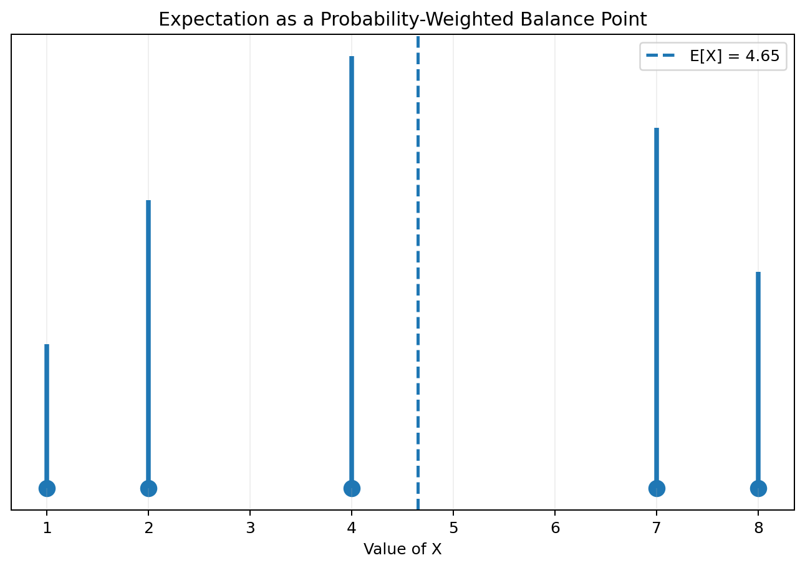
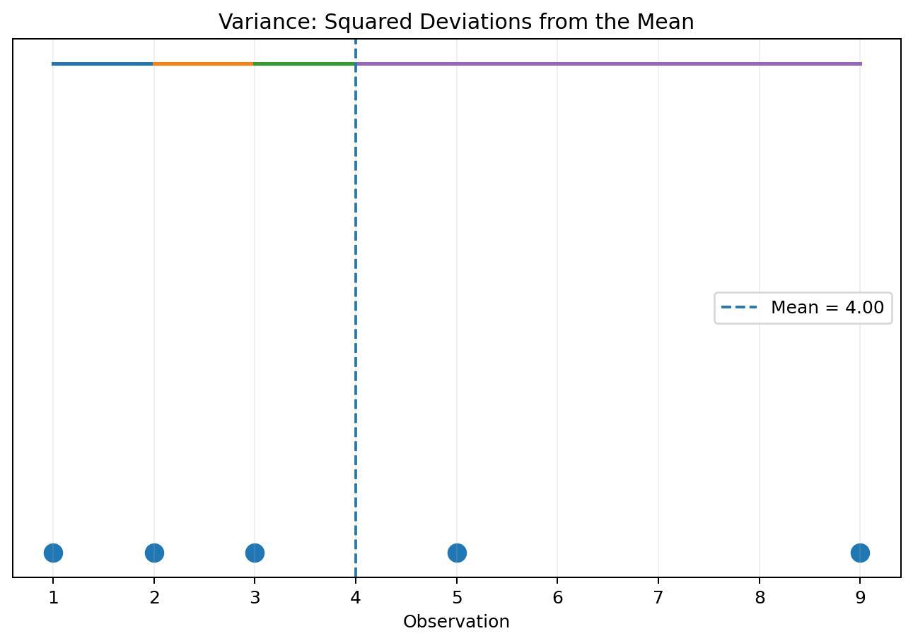
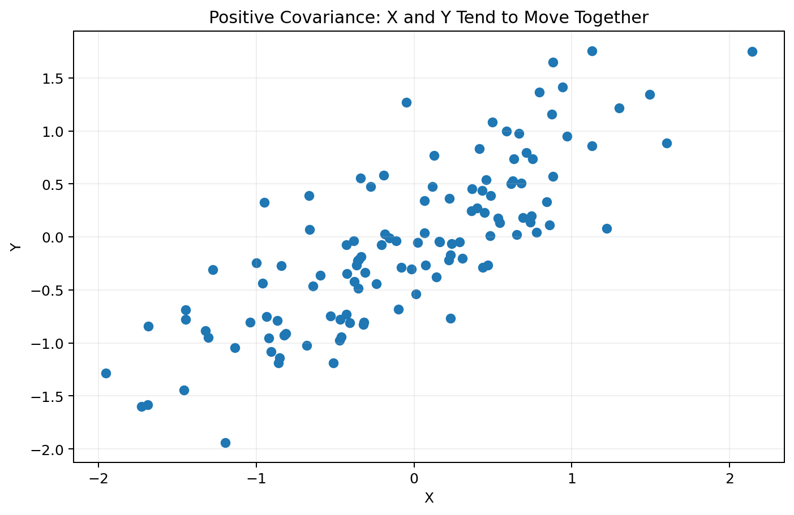
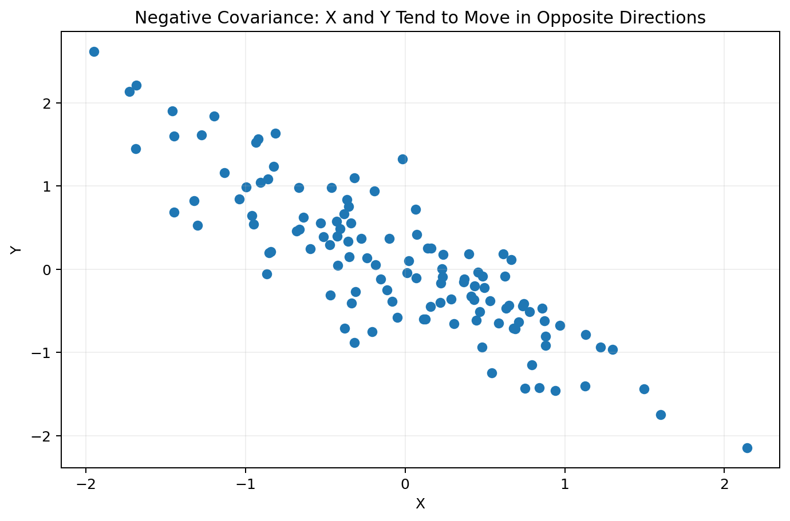
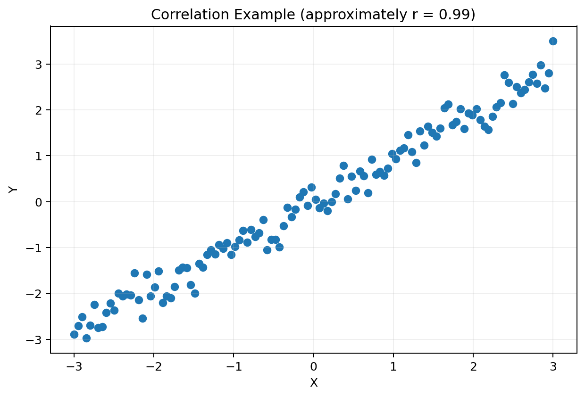
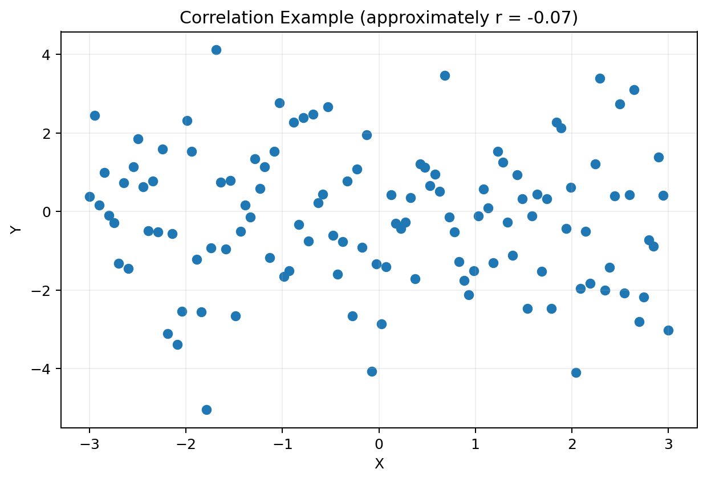
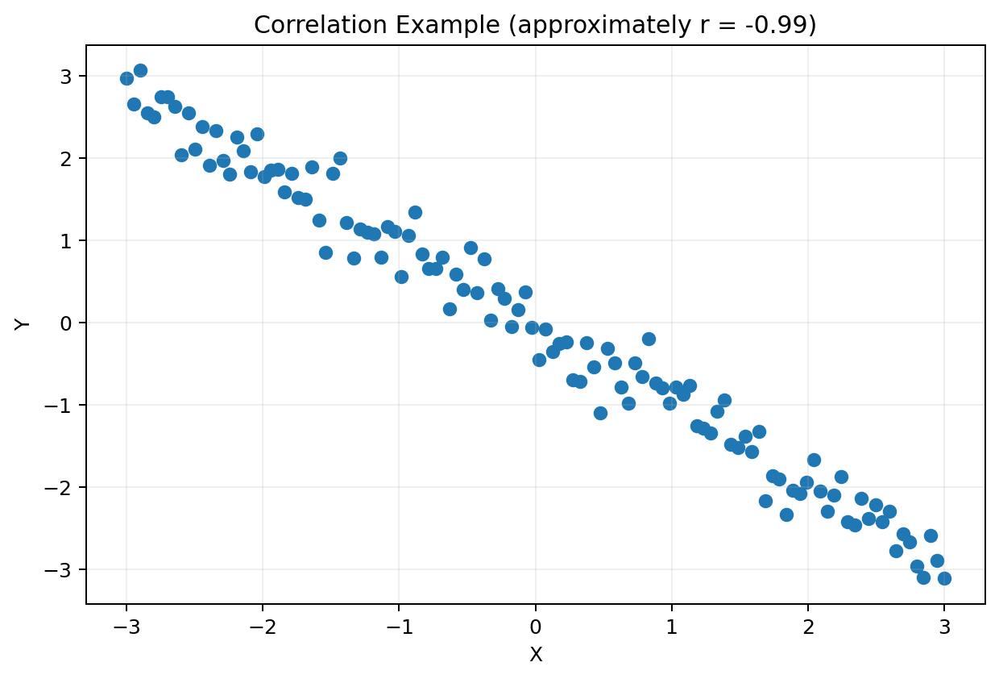
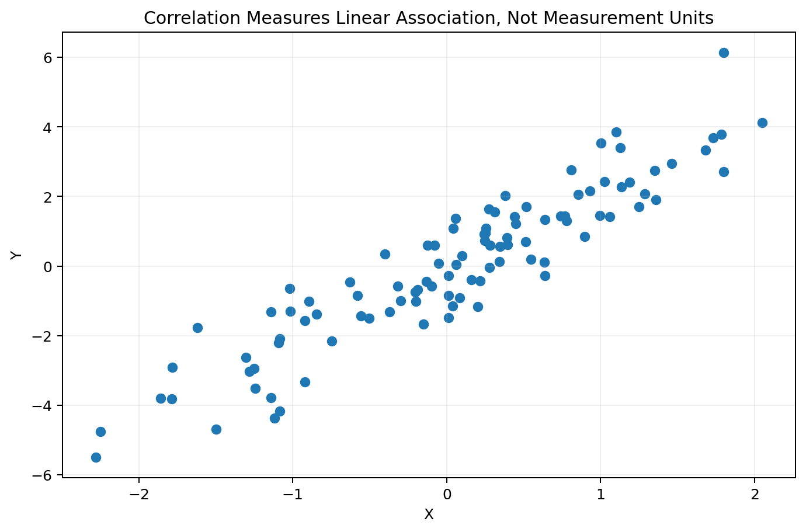

# Expectation, Variance, Covariance and Correlation

> A GitHub-ready reading material with mathematical definitions, intuition, worked examples, Python implementations, visualizations, and practice questions.

---

## Learning objectives

After studying this material, you should be able to:

- explain the meaning of expectation;
- calculate the expectation of discrete random variables;
- understand variance as a measure of spread;
- calculate population and sample variance;
- interpret covariance between two random variables;
- distinguish positive, negative, and zero covariance;
- understand Pearson correlation;
- distinguish covariance from correlation;
- calculate these quantities using Python;
- visualize relationships using scatter plots;
- understand important limitations such as correlation not implying causation.

---

# 1. Introduction

Expectation, variance, covariance, and correlation are fundamental tools in probability and statistics.

They answer four closely related questions:

| Quantity | Main question |
|---|---|
| **Expectation** | What is the average or long-run value? |
| **Variance** | How much does one variable vary around its mean? |
| **Covariance** | How do two variables vary together? |
| **Correlation** | How strong and in what direction is their linear relationship? |

These concepts are closely connected.

---

# 2. Expectation

The **expectation** or **expected value** of a random variable is its probability-weighted average.

It is commonly denoted by:

\[
E[X]
\]

or:

\[
\mu_X.
\]

For a discrete random variable:

\[
\boxed{
E[X]=\sum_x xP(X=x)
}
\]

For a continuous random variable with PDF \(f_X(x)\):

\[
\boxed{
E[X]=\int_{-\infty}^{\infty}x f_X(x)\,dx
}
\]

Expectation can be interpreted as the long-run average value obtained if the random experiment is repeated many times.

---

# 3. Intuition: expectation as a balance point

Consider a random variable with:

| \(X\) | \(P(X=x)\) |
|---:|---:|
| 1 | 0.10 |
| 2 | 0.20 |
| 4 | 0.30 |
| 7 | 0.25 |
| 8 | 0.15 |

Then:

\[
E[X]
=
1(0.10)+2(0.20)+4(0.30)+7(0.25)+8(0.15)
\]

\[
=4.85.
\]

So:

\[
\boxed{E[X]=4.85}
\]

The expected value does **not** have to be one of the possible values of \(X\).



---

# 4. Python implementation of expectation

```python
import numpy as np

x = np.array([1, 2, 4, 7, 8])
p = np.array([0.10, 0.20, 0.30, 0.25, 0.15])

# Check that this is a valid PMF
print("Sum of probabilities:", p.sum())

expected_value = np.sum(x * p)

print("E[X] =", expected_value)
```

Output:

```text
Sum of probabilities: 1.0
E[X] = 4.85
```

---

# 5. Expectation of a function of a random variable

Sometimes we need:

\[
E[g(X)]
\]

rather than \(E[X]\).

For a discrete random variable:

\[
\boxed{
E[g(X)]
=
\sum_xg(x)P(X=x)
}
\]

For example:

\[
g(X)=X^2.
\]

Then:

\[
E[X^2]
=
\sum_xx^2P(X=x).
\]

This quantity is particularly important when calculating variance.

---

# 6. Linearity of expectation

One of the most useful properties is:

\[
\boxed{
E[aX+b]=aE[X]+b
}
\]

More generally:

\[
\boxed{
E[aX+bY+c]
=
aE[X]+bE[Y]+c
}
\]

Importantly, **linearity of expectation does not require independence**.

For random variables \(X\) and \(Y\):

\[
E[X+Y]=E[X]+E[Y].
\]

This is true whether \(X\) and \(Y\) are independent or dependent.

---

# 7. Variance

Expectation describes the center of a distribution, but it does not describe how widely values are spread around that center.

**Variance** measures average squared deviation from the mean.

Let:

\[
\mu=E[X].
\]

Then:

\[
\boxed{
Var(X)=E[(X-\mu)^2]
}
\]

For a discrete random variable:

\[
\boxed{
Var(X)=
\sum_x(x-\mu)^2P(X=x)
}
\]

The square is important because positive and negative deviations should not cancel.

---

# 8. Alternative formula for variance

Expanding the square gives:

\[
Var(X)
=
E[X^2]-2E[X]E[X]+E[X]^2.
\]

Therefore:

\[
\boxed{
Var(X)=E[X^2]-[E[X]]^2
}
\]

This is often the easiest formula for manual calculations.

---

# 9. Example of variance

Suppose:

| \(X\) | \(P(X=x)\) |
|---:|---:|
| 1 | 0.10 |
| 2 | 0.20 |
| 4 | 0.30 |
| 7 | 0.25 |
| 8 | 0.15 |

We already found:

\[
E[X]=4.85.
\]

Calculate:

\[
E[X^2]
=
1^2(0.10)+2^2(0.20)+4^2(0.30)+7^2(0.25)+8^2(0.15)
\]

\[
=28.85.
\]

Therefore:

\[
Var(X)
=
28.85-(4.85)^2
\]

\[
\boxed{Var(X)=5.3275}.
\]



---

# 10. Standard deviation

Variance is measured in squared units.

If \(X\) is measured in meters, variance is measured in:

\[
m^2.
\]

The **standard deviation** returns to the original measurement units:

\[
\boxed{
\sigma_X=\sqrt{Var(X)}
}
\]

For the previous example:

\[
\sigma_X=\sqrt{5.3275}\approx2.308.
\]

---

# 11. Python: variance and standard deviation

```python
import numpy as np

x = np.array([1, 2, 4, 7, 8])
p = np.array([0.10, 0.20, 0.30, 0.25, 0.15])

mean = np.sum(x * p)
variance = np.sum((x - mean)**2 * p)
std = np.sqrt(variance)

print("Mean =", mean)
print("Variance =", variance)
print("Standard deviation =", std)
```

---

# 12. Population variance versus sample variance

There is an important distinction between a **population** and a **sample**.

For a population of \(N\) observations:

\[
\boxed{
\sigma^2=
\frac{1}{N}
\sum_{i=1}^{N}(x_i-\mu)^2
}
\]

For a sample of \(n\) observations:

\[
\boxed{
s^2=
\frac{1}{n-1}
\sum_{i=1}^{n}(x_i-\bar{x})^2
}
\]

The \(n-1\) denominator is called **Bessel's correction** and provides an unbiased estimator of the population variance under standard assumptions.

---

# 13. Python: population and sample variance

```python
import numpy as np

data = np.array([4, 5, 6, 8, 10, 12])

population_variance = np.var(data)
sample_variance = np.var(data, ddof=1)

population_std = np.std(data)
sample_std = np.std(data, ddof=1)

print("Population variance:", population_variance)
print("Sample variance:", sample_variance)

print("Population standard deviation:", population_std)
print("Sample standard deviation:", sample_std)
```

Notice:

```python
np.var(data)
```

uses \(n\), while:

```python
np.var(data, ddof=1)
```

uses \(n-1\).

---

# 14. Interactive idea: variance and standard deviation

A useful way to understand variance is to move observations farther from or closer to the mean.

The farther observations move from the mean, the larger their squared deviations become.

The key relationship is:

\[
\boxed{
Var(X)=E[(X-E[X])^2]
}
\]

This is why an extreme observation can have a substantial effect on variance.

---

# 15. Covariance

Variance describes the variability of one random variable.

**Covariance** describes how two random variables vary together.

For random variables \(X\) and \(Y\):

\[
\boxed{
Cov(X,Y)
=
E[(X-E[X])(Y-E[Y])]
}
\]

Let:

\[
\mu_X=E[X],
\qquad
\mu_Y=E[Y].
\]

Then:

\[
Cov(X,Y)
=
E[(X-\mu_X)(Y-\mu_Y)].
\]

---

# 16. Understanding covariance

Consider deviations from the means.

### Same direction

If:

\[
X-\mu_X>0
\]

and:

\[
Y-\mu_Y>0,
\]

their product is positive.

Likewise, if both deviations are negative, their product is also positive.

Therefore, observations moving in the same direction contribute positively to covariance.

### Opposite directions

If one deviation is positive and the other negative:

\[
(X-\mu_X)(Y-\mu_Y)<0.
\]

This contributes negatively to covariance.





---

# 17. Covariance formula using expectations

Expanding the definition gives:

\[
Cov(X,Y)
=
E[XY]-E[X]E[Y].
\]

Therefore:

\[
\boxed{
Cov(X,Y)=E[XY]-E[X]E[Y]
}
\]

This is often convenient for calculations.

---

# 18. Interpreting covariance

The sign of covariance is important:

| Covariance | Interpretation |
|---|---|
| \(Cov(X,Y)>0\) | X and Y tend to increase/decrease together |
| \(Cov(X,Y)<0\) | X and Y tend to move in opposite directions |
| \(Cov(X,Y)\approx0\) | Little linear co-movement |

However, covariance magnitude depends on the measurement units.

For example, covariance between:

- height in centimeters and weight in kilograms;
- height in meters and weight in kilograms

will have different numerical values.

This makes covariance difficult to compare across datasets with different scales.

---

# 19. Python: covariance

```python
import numpy as np

x = np.array([1, 2, 3, 4, 5])
y = np.array([2, 4, 5, 8, 10])

covariance_matrix = np.cov(x, y, ddof=1)

print(covariance_matrix)

cov_xy = covariance_matrix[0, 1]

print("Sample covariance:", cov_xy)
```

For a population-style covariance calculation:

```python
cov_population = np.mean(
    (x - np.mean(x)) * (y - np.mean(y))
)

print("Population covariance:", cov_population)
```

---

# 20. Covariance matrix

For several random variables, covariance can be organized into a **covariance matrix**.

For three variables:

\[
X_1,X_2,X_3,
\]

the covariance matrix is:

\[
\boxed{
\Sigma=
\begin{bmatrix}
Var(X_1)&Cov(X_1,X_2)&Cov(X_1,X_3)\\
Cov(X_2,X_1)&Var(X_2)&Cov(X_2,X_3)\\
Cov(X_3,X_1)&Cov(X_3,X_2)&Var(X_3)
\end{bmatrix}
}
\]

Important properties:

- diagonal entries are variances;
- off-diagonal entries are covariances;
- the matrix is symmetric;
- covariance matrices are positive semidefinite.

Python:

```python
import numpy as np

data = np.array([
    [1, 10, 100],
    [2, 12, 110],
    [3, 14, 120],
    [4, 16, 130],
    [5, 18, 140]
])

cov_matrix = np.cov(data, rowvar=False, ddof=1)

print(cov_matrix)
```

---

# 21. Correlation

Covariance tells us the direction of co-movement, but its numerical value depends on units.

**Correlation** standardizes covariance.

The Pearson correlation coefficient is:

\[
\boxed{
\rho_{X,Y}
=
\frac{Cov(X,Y)}
{\sigma_X\sigma_Y}
}
\]

For a sample:

\[
\boxed{
r=
\frac{s_{XY}}{s_Xs_Y}
}
\]

where \(s_{XY}\) is sample covariance and \(s_X,s_Y\) are sample standard deviations.

---

# 22. Range of correlation

Pearson correlation always lies between:

\[
\boxed{-1\leq\rho\leq1}
\]

Interpretation:

- \(\rho=1\): perfect positive linear relationship;
- \(\rho=-1\): perfect negative linear relationship;
- \(\rho=0\): no linear correlation;
- values close to \(1\): strong positive linear association;
- values close to \(-1\): strong negative linear association.







---

# 23. Covariance versus correlation

| Property | Covariance | Correlation |
|---|---|---|
| Measures | Joint variation | Standardized linear association |
| Range | Unbounded | \([-1,1]\) |
| Units | Product of units | Unitless |
| Scale-dependent | Yes | No |
| Sign | Direction of co-movement | Direction of linear association |
| Easy to compare across datasets | Less so | More so |

Correlation can be viewed as a standardized version of covariance.

---

# 24. Python: correlation

Using NumPy:

```python
import numpy as np

x = np.array([1, 2, 3, 4, 5])
y = np.array([2, 4, 5, 8, 10])

correlation_matrix = np.corrcoef(x, y)

print(correlation_matrix)

r = correlation_matrix[0, 1]

print("Correlation:", r)
```

Using SciPy:

```python
from scipy.stats import pearsonr

r, p_value = pearsonr(x, y)

print("Correlation:", r)
print("p-value:", p_value)
```

---

# 25. Correlation is scale-invariant

Suppose:

\[
Y=2X+\epsilon.
\]

Changing the units of \(X\) or \(Y\) changes covariance, but Pearson correlation remains unchanged under positive linear rescaling.

For example, changing height from meters to centimeters changes numerical covariance but does not change the correlation.



---

# 26. Expectation, variance, covariance, and correlation together

These quantities can be viewed as a progression:

\[
\boxed{
\text{Expectation}
\rightarrow
\text{Variance}
\rightarrow
\text{Covariance}
\rightarrow
\text{Correlation}
}
\]

### Expectation

Describes the center:

\[
E[X].
\]

### Variance

Describes the spread of one variable:

\[
Var(X)=E[(X-E[X])^2].
\]

### Covariance

Describes joint variation:

\[
Cov(X,Y)
=
E[(X-E[X])(Y-E[Y])].
\]

### Correlation

Standardizes covariance:

\[
Corr(X,Y)
=
\frac{Cov(X,Y)}
{\sqrt{Var(X)Var(Y)}}.
\]

---

# 27. Important relationships

## Variance is covariance with itself

\[
\boxed{
Cov(X,X)=Var(X)
}
\]

because:

\[
Cov(X,X)
=
E[(X-E[X])^2].
\]

---

## Independent variables have zero covariance

If \(X\) and \(Y\) are independent:

\[
E[XY]=E[X]E[Y].
\]

Therefore:

\[
\boxed{
Cov(X,Y)=0
}
\]

and, provided the variances are positive:

\[
\boxed{
Corr(X,Y)=0.
}
\]

---

## Zero covariance does not necessarily mean independence

The converse is generally false:

\[
Cov(X,Y)=0
\]

does **not** imply that \(X\) and \(Y\) are independent.

A classic example is:

\[
X\sim Uniform(-1,1)
\]

and:

\[
Y=X^2.
\]

The relationship is clearly deterministic, so \(X\) and \(Y\) are not independent. Yet their covariance is zero because of symmetry.

This is an important distinction:

\[
\boxed{
\text{Independence} \Rightarrow \text{Zero covariance}
}
\]

but generally:

\[
\boxed{
\text{Zero covariance} \not\Rightarrow \text{Independence}.
}
\]

---

# 28. Variance of a sum

For two random variables:

\[
\boxed{
Var(X+Y)
=
Var(X)+Var(Y)+2Cov(X,Y)
}
\]

Similarly:

\[
\boxed{
Var(X-Y)
=
Var(X)+Var(Y)-2Cov(X,Y)
}
\]

If \(X\) and \(Y\) are independent:

\[
Cov(X,Y)=0.
\]

Therefore:

\[
\boxed{
Var(X+Y)=Var(X)+Var(Y)
}
\]

This is one reason independence is especially useful in probability and statistics.

---

# 29. General variance formula

For constants \(a,b\):

\[
\boxed{
Var(aX+bY)
=
a^2Var(X)+b^2Var(Y)+2abCov(X,Y)
}
\]

If \(X\) and \(Y\) are independent:

\[
\boxed{
Var(aX+bY)
=
a^2Var(X)+b^2Var(Y).
}
\]

---

# 30. Python: verifying covariance and variance relationships

```python
import numpy as np

x = np.array([1, 2, 3, 4, 5])
y = np.array([2, 4, 5, 8, 10])

var_x = np.var(x, ddof=1)
var_y = np.var(y, ddof=1)

cov_xy = np.cov(x, y, ddof=1)[0, 1]

left = np.var(x + y, ddof=1)
right = var_x + var_y + 2 * cov_xy

print("Var(X + Y) =", left)
print("Formula =", right)
```

The two values should agree up to floating-point rounding.

---

# 31. Simulation: expectation approaches the mean

The law of large numbers explains why sample averages tend to approach the expected value.

```python
import numpy as np
import matplotlib.pyplot as plt

rng = np.random.default_rng(42)

sample = rng.normal(loc=10, scale=2, size=5000)

running_mean = np.cumsum(sample) / np.arange(1, len(sample) + 1)

plt.plot(running_mean)
plt.axhline(10, linestyle="--", label="Theoretical mean = 10")

plt.xlabel("Number of observations")
plt.ylabel("Running mean")
plt.title("Sample Mean Approaches the Expected Value")
plt.legend()
plt.grid(alpha=0.2)
plt.show()
```

---

# 32. Simulation: covariance and correlation

We can simulate correlated variables using:

\[
Y=\rho X+\epsilon.
\]

```python
import numpy as np
import matplotlib.pyplot as plt

rng = np.random.default_rng(42)

n = 5000
rho = 0.8

x = rng.normal(size=n)
noise = rng.normal(size=n)

y = rho * x + np.sqrt(1 - rho**2) * noise

r = np.corrcoef(x, y)[0, 1]

print("Empirical correlation:", r)

plt.scatter(x, y, alpha=0.3)
plt.xlabel("X")
plt.ylabel("Y")
plt.title("Simulated Correlated Random Variables")
plt.show()
```

The empirical correlation should be close to the target value \(0.8\).

---

# 33. A complete Python example

The following program calculates all four concepts for a pair of variables.

```python
import numpy as np

x = np.array([10, 12, 15, 18, 20])
y = np.array([8, 11, 14, 17, 21])

# Expectation / sample mean
mean_x = np.mean(x)
mean_y = np.mean(y)

# Sample variance
var_x = np.var(x, ddof=1)
var_y = np.var(y, ddof=1)

# Sample covariance
cov_xy = np.cov(x, y, ddof=1)[0, 1]

# Pearson correlation
corr_xy = np.corrcoef(x, y)[0, 1]

print("Mean X:", mean_x)
print("Mean Y:", mean_y)

print("Variance X:", var_x)
print("Variance Y:", var_y)

print("Covariance:", cov_xy)
print("Correlation:", corr_xy)
```

---

# 34. Using pandas

For real datasets, Pandas provides convenient functions.

```python
import pandas as pd

df = pd.DataFrame({
    "hours_studied": [2, 4, 5, 6, 8, 10],
    "exam_score": [55, 62, 68, 72, 85, 92]
})

print("Means:")
print(df.mean())

print("\nVariances:")
print(df.var())

print("\nCovariance:")
print(df.cov())

print("\nCorrelation:")
print(df.corr())
```

---

# 35. Visualizing covariance and correlation

Scatter plots are useful for examining the relationship between two numerical variables.

```python
import matplotlib.pyplot as plt

plt.scatter(df["hours_studied"], df["exam_score"])

plt.xlabel("Hours Studied")
plt.ylabel("Exam Score")
plt.title("Study Time vs Exam Score")
plt.grid(alpha=0.2)

plt.show()
```

A scatter plot should be considered alongside numerical measures rather than as a replacement for them.

---

# 36. Correlation does not imply causation

A high correlation between two variables does not establish that one variable causes the other.

For example, two variables can be correlated because:

1. one causes the other;
2. the second causes the first;
3. both are influenced by a third variable;
4. the relationship is coincidental;
5. the data contain selection or measurement bias.

Therefore:

\[
\boxed{
\text{Correlation} \neq \text{Causation}
}
\]

Correlation is evidence of statistical association, not by itself evidence of a causal mechanism.

---

# 37. Limitations of Pearson correlation

Pearson correlation measures **linear association**.

A nonlinear relationship can have a correlation close to zero.

For example, if:

\[
Y=X^2
\]

and \(X\) is symmetrically distributed around zero, Pearson correlation can be close to zero even though \(Y\) is completely determined by \(X\).

Therefore, always inspect the data visually when possible.

---

# 38. Outliers and correlation

Correlation can be strongly affected by outliers.

A single extreme observation can:

- increase correlation;
- decrease correlation;
- reverse the apparent relationship.

For this reason, a scatter plot is often useful before interpreting a correlation coefficient.

---

# 39. Summary table

| Concept | Formula | Interpretation |
|---|---|---|
| Expectation | \(E[X]\) | Long-run average |
| Variance | \(E[(X-\mu)^2]\) | Spread around mean |
| Standard deviation | \(\sqrt{Var(X)}\) | Spread in original units |
| Covariance | \(E[(X-\mu_X)(Y-\mu_Y)]\) | Joint variation |
| Correlation | \(\frac{Cov(X,Y)}{\sigma_X\sigma_Y}\) | Standardized linear association |

---

# 40. Key formulas at a glance

### Expectation

\[
\boxed{
E[X]=\sum_xxP(X=x)
}
\]

for discrete \(X\).

### Variance

\[
\boxed{
Var(X)=E[(X-E[X])^2]
}
\]

and:

\[
\boxed{
Var(X)=E[X^2]-[E[X]]^2
}
\]

### Standard deviation

\[
\boxed{
\sigma_X=\sqrt{Var(X)}
}
\]

### Covariance

\[
\boxed{
Cov(X,Y)=E[(X-E[X])(Y-E[Y])]
}
\]

or:

\[
\boxed{
Cov(X,Y)=E[XY]-E[X]E[Y]
}
\]

### Correlation

\[
\boxed{
Corr(X,Y)
=
\frac{Cov(X,Y)}
{\sqrt{Var(X)Var(Y)}}
}
\]

### Variance of a sum

\[
\boxed{
Var(X+Y)
=
Var(X)+Var(Y)+2Cov(X,Y)
}
\]

---

# 41. Common mistakes

### Mistake 1: Confusing expectation with the most likely value

The expected value is a weighted average. It is not necessarily the mode or even a possible outcome.

### Mistake 2: Forgetting to square deviations

Variance uses:

\[
(X-\mu)^2.
\]

Without squaring, positive and negative deviations can cancel.

### Mistake 3: Confusing sample and population variance

Use:

```python
np.var(x)
```

for population-style variance and:

```python
np.var(x, ddof=1)
```

for sample variance.

### Mistake 4: Treating covariance as standardized

Covariance depends on measurement units. Correlation is standardized.

### Mistake 5: Assuming zero correlation means independence

This is generally false.

### Mistake 6: Assuming correlation proves causation

Correlation describes association, not necessarily causal influence.

---

# 42. Practice questions

1. Define expectation in your own words.
2. Calculate \(E[X]\) for a discrete random variable with a given PMF.
3. Explain why expected value does not need to be a possible outcome.
4. Derive the alternative variance formula:
   \[
   Var(X)=E[X^2]-[E[X]]^2.
   \]
5. Calculate the variance and standard deviation of a fair die.
6. Explain the difference between population and sample variance.
7. Define covariance.
8. Explain what positive covariance means.
9. Explain what negative covariance means.
10. Why does covariance depend on measurement units?
11. Define Pearson correlation.
12. Why is correlation restricted to \([-1,1]\)?
13. Explain the difference between covariance and correlation.
14. Prove that \(Cov(X,X)=Var(X)\).
15. Explain why independence implies zero covariance.
16. Give an example showing that zero covariance does not necessarily imply independence.
17. Derive:
   \[
   Var(X+Y)=Var(X)+Var(Y)+2Cov(X,Y).
   \]
18. Write Python code to calculate expectation from a PMF.
19. Write Python code to calculate population and sample variance.
20. Write Python code to calculate covariance.
21. Write Python code to calculate Pearson correlation.
22. Simulate two correlated random variables and verify their correlation numerically.
23. Create scatter plots illustrating strong positive, weak, and strong negative correlation.
24. Explain why correlation does not imply causation.

---

# 43. Figures included

The `figures/` directory contains:

1. `01_expectation_balance_point.png` — expectation as a probability-weighted balance point.
2. `02_variance_deviations.png` — deviations from the mean and variance intuition.
3. `03_positive_covariance.png` — positive covariance.
4. `04_negative_covariance.png` — negative covariance.
5. `05_strong_positive_correlation.png` — strong positive correlation.
6. `06_near_zero_correlation.png` — near-zero linear correlation.
7. `07_strong_negative_correlation.png` — strong negative correlation.
8. `08_correlation_scale_invariance.png` — correlation and measurement scale.

---

# 44. Suggested GitHub repository structure

```text
expectation-variance-covariance-correlation/
│
├── expectation_variance_covariance_correlation.md
│
└── figures/
    ├── 01_expectation_balance_point.png
    ├── 02_variance_deviations.png
    ├── 03_positive_covariance.png
    ├── 04_negative_covariance.png
    ├── 05_strong_positive_correlation.png
    ├── 06_near_zero_correlation.png
    ├── 07_strong_negative_correlation.png
    └── 08_correlation_scale_invariance.png
```

The Markdown uses relative image references such as:

```markdown

```

Therefore, keep the `figures/` directory beside the Markdown file when uploading the material to GitHub.

---

# 45. Final takeaway

Expectation tells us **where a random variable is centered**.

Variance tells us **how much it spreads around its center**.

Covariance tells us **how two variables vary together**.

Correlation tells us **the direction and strength of their linear association on a standardized scale**.

Together, these four concepts form an important foundation for probability, statistics, data science, machine learning, and statistical modeling.
