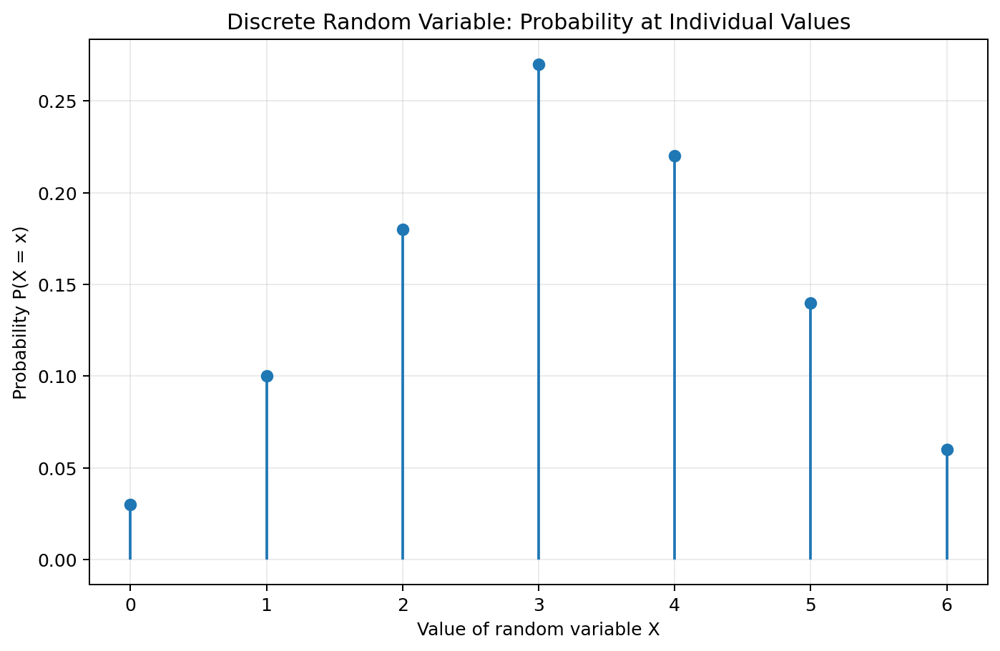
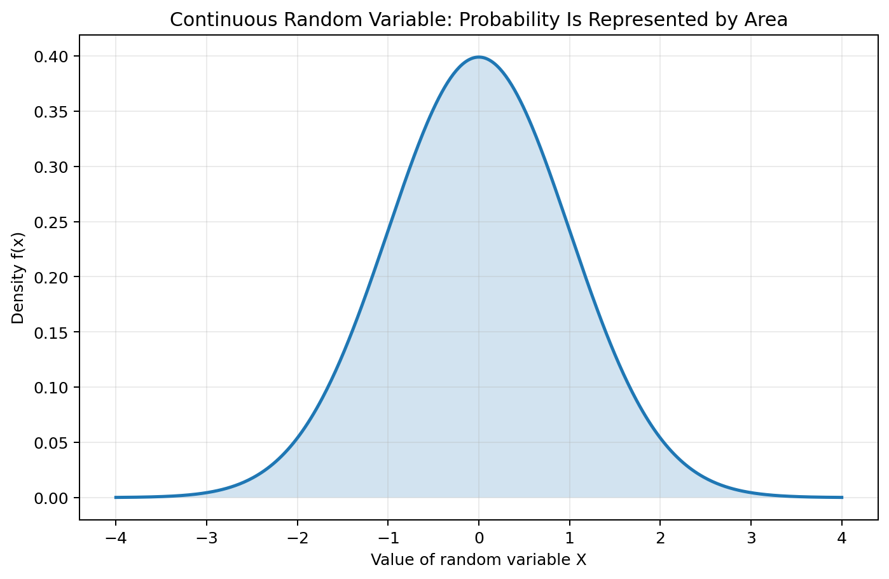
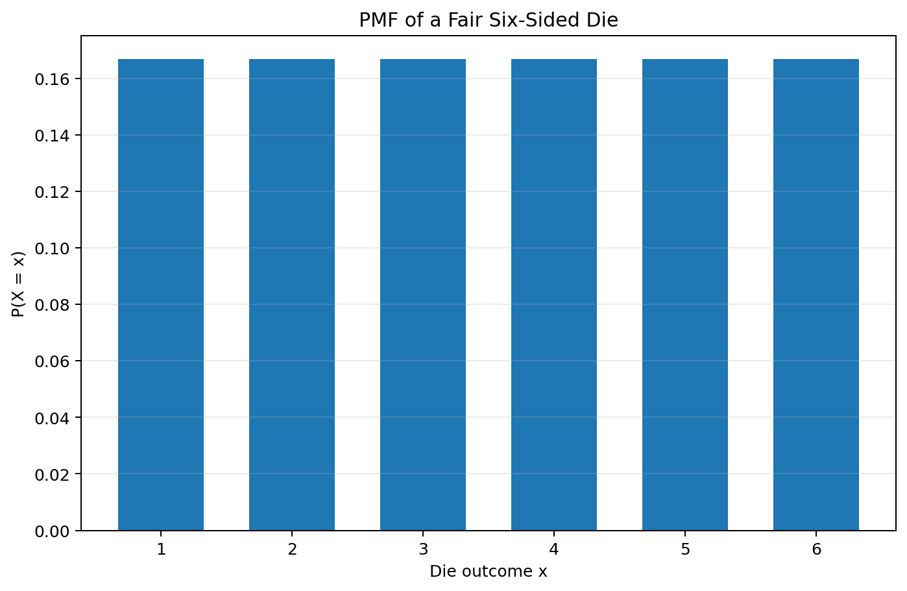
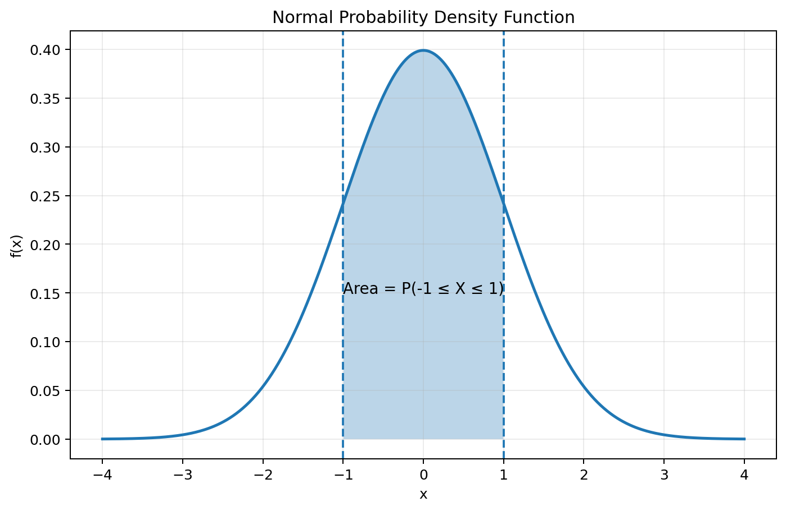
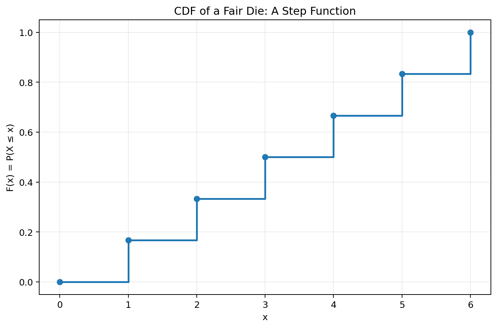
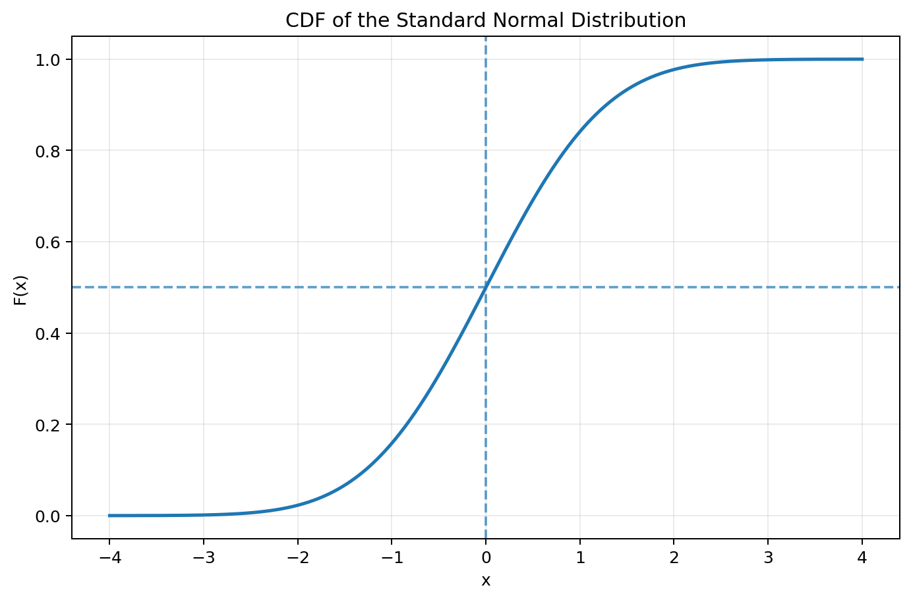
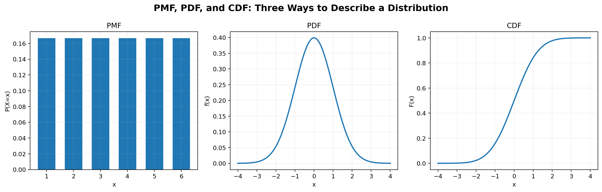
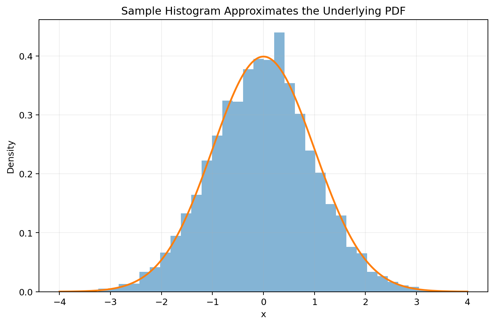

# :classical_building: Mathematics for IT Course - M.Tech. 1st Semester, IIIT Allahabad
## Unit 3: Probability and Random Variables
### Current Topic: Random Variables and Probability Distributions 
#### Covering discrete and continuous random variables, probability mass functions (PMFs), probability density functions (PDFs), cumulative distribution functions (CDFs), examples, mathematical properties, Python implementations, and simulations
---
## 👥 Instructor Information
* **Edited by Instructor:** [Dr. Mohammed Javed](https://sites.google.com/site/mohammedjaved2016/)
* **Email:** javed@iiita.ac.in
* **Teaching Assistants:** Mr. Apurba Chakraborty (rsi2024005@iiita.ac.in)
---

## 1. Learning objectives

After studying this material, you should be able to:

- define a random variable;
- distinguish discrete and continuous random variables;
- understand probability distributions;
- construct and interpret a probability mass function (PMF);
- construct and interpret a probability density function (PDF);
- construct and interpret a cumulative distribution function (CDF);
- calculate probabilities from PMFs, PDFs, and CDFs;
- compute expectation and variance;
- implement distributions in Python;
- simulate random variables and compare empirical results with theoretical distributions.

---

# 2. Introduction to random variables

A **random variable** is a numerical function that assigns a number to each outcome of a random experiment.

The notation is usually:

$$
X:\Omega\rightarrow\mathbb{R}
$$

where:

- $(\Omega)$ is the sample space;
- $(X)$ is the random variable;
- $(X(\omega))$ is the numerical value assigned to outcome $(\omega)$.

A random variable does not necessarily mean that the variable itself is "random" in the everyday sense. Rather, its value is determined by the outcome of a random experiment.

### Example: Tossing a coin

Suppose a coin is tossed three times.

The sample space is:

$$
\Omega =
\{HHH,HHT,HTH,HTT,THH,THT,TTH,TTT\}.
$$

Define $(X)$ as:

> the number of heads obtained.

Then:

| Outcome | $(X)$ |
|---|---:|
| HHH | 3 |
| HHT | 2 |
| HTH | 2 |
| HTT | 1 |
| THH | 2 |
| THT | 1 |
| TTH | 1 |
| TTT | 0 |

Therefore, $(X)$ can take values:

$$
X\in\{0,1,2,3\}.
$$

---

# 3. Random variables and probability distributions

A **probability distribution** describes how probability is assigned to the possible values of a random variable.

There are two fundamental types:

1. **Discrete random variables**
2. **Continuous random variables**





The distinction is important because probabilities are represented differently.

| Feature | Discrete | Continuous |
|---|---|---|
| Possible values | Countable | Usually an interval or collection of intervals |
| Main function | PMF | PDF |
| Probability at a point | Can be positive | Always 0 |
| Probability over interval | Sum of probabilities | Area under density |
| Typical example | Number of defective items | Height, time, temperature |

---

# Part I — Discrete Random Variables

# 4. Discrete random variables

A random variable $(X)$ is **discrete** if its possible values form a finite or countably infinite set.

Examples include:

- number of heads in 10 coin tosses;
- number of customers arriving in one minute;
- number of defective products;
- number of emails received in an hour;
- number shown on a die.

A discrete random variable can be represented by a **probability mass function**.

---

# 5. Probability Mass Function (PMF)

For a discrete random variable $(X)$, its probability mass function is:

$$
\boxed{p_X(x)=P(X=x)}
$$

The PMF gives the probability that $(X)$ takes the specific value $(x)$.

A valid PMF must satisfy:

$$
p_X(x)\geq 0
$$

for every $(x)$, and:

$$
\boxed{\sum_x p_X(x)=1}.
$$

---

# 6. Example: fair die

Let $(X)$ be the number obtained when a fair six-sided die is rolled.

Then:

$$
X\in\{1,2,3,4,5,6\}
$$

and:

$$
P(X=x)=\frac16.
$$



The PMF is:

| $(x)$ | $(P(X=x))$ |
|---:|---:|
| 1 | \(1/6\) |
| 2 | \(1/6\) |
| 3 | \(1/6\) |
| 4 | \(1/6\) |
| 5 | \(1/6\) |
| 6 | \(1/6\) |

For example:

$$
P(X=4)=\frac16.
$$

---

# 7. Calculating probabilities from a PMF

Suppose:

$$
P(X=0)=0.1,
$$

$$
P(X=1)=0.3,
$$

$$
P(X=2)=0.4,
$$

$$
P(X=3)=0.2.
$$

Then:

$$
P(X\leq2) = P(X=0)+P(X=1)+P(X=2)
$$

$$
=0.1+0.3+0.4=0.8.
$$

Similarly:

$$
P(X>1)=P(X=2)+P(X=3)=0.6.
$$

---

# 8. Python: implementing a discrete PMF

```python
import numpy as np
import matplotlib.pyplot as plt

x = np.array([0, 1, 2, 3])
pmf = np.array([0.1, 0.3, 0.4, 0.2])

print("Sum of probabilities:", pmf.sum())

plt.bar(x, pmf)
plt.xlabel("x")
plt.ylabel("P(X = x)")
plt.title("Discrete Probability Mass Function")
plt.show()
```

The sum should be:

```text
Sum of probabilities: 1.0
```

---

# 9. Expected value of a discrete random variable

The expected value, or mean, of a discrete random variable is:

$$
\boxed{
E[X]=\sum_x xP(X=x)
}
$$

For the previous example:

$$
E[X] = 0(0.1)+1(0.3)+2(0.4)+3(0.2)
$$

$$
=1.7.
$$

The expected value does not have to be one of the values that \(X\) can actually take.

---

# 10. Python: expectation

```python
import numpy as np

x = np.array([0, 1, 2, 3])
pmf = np.array([0.1, 0.3, 0.4, 0.2])

expected_value = np.sum(x * pmf)

print("E[X] =", expected_value)
```

Output:

```text
E[X] = 1.7
```

---

# 11. Variance of a discrete random variable

Variance measures the spread of a random variable around its mean.

The definition is:

$$
\boxed{
Var(X)=E[(X-E[X])^2]
}
$$

For a discrete random variable:

$$
Var(X) = \sum_x (x-\mu)^2P(X=x),
$$

where:

$$
\mu=E[X].
$$

An equivalent computational formula is:

$$
\boxed{
Var(X)=E[X^2]-(E[X])^2
}
$$

where:

$$
E[X^2]=\sum_xx^2P(X=x).
$$

---

# 12. Python: variance and standard deviation

```python
import numpy as np

x = np.array([0, 1, 2, 3])
pmf = np.array([0.1, 0.3, 0.4, 0.2])

mean = np.sum(x * pmf)
variance = np.sum((x - mean)**2 * pmf)
std = np.sqrt(variance)

print("Mean =", mean)
print("Variance =", variance)
print("Standard deviation =", std)
```

---

# Part II — Continuous Random Variables

# 13. Continuous random variables

A random variable is **continuous** when it can take values across a continuum.

Examples include:

- height;
- weight;
- temperature;
- time;
- distance;
- voltage;
- measurement error.

For a continuous random variable, the probability of one exact point is:

$$
\boxed{P(X=x)=0}.
$$

This does **not** mean that continuous random variables have no probabilities.

Instead, probabilities are assigned to **intervals**.

---

# 14. Probability Density Function (PDF)

A continuous random variable $(X)$ can be described by a probability density function $(f_X(x))$.

The PDF must satisfy:

$$
f_X(x)\geq0
$$

and:

$$
\boxed{
\int_{-\infty}^{\infty}f_X(x)\,dx=1
}
$$

The probability that $(X)$ falls between $(a)$ and $(b)$ is:

$$
\boxed{P(a\leq X\leq b) = \int_a^b f_X(x)\,dx }
$$

Thus, **probability is area under the PDF**.


---

# 15. Important difference: PMF versus PDF

For a discrete random variable:

$$
P(X=x)
$$

can be positive.

For a continuous random variable:

$$
P(X=x)=0.
$$

For example, if $(X)$ represents the height of a randomly selected person, the probability of exactly:

$$
X=170.000000\ldots\text{ cm}
$$

is modeled as zero.

Instead, we calculate probabilities such as:

$$
P(169\leq X\leq171).
$$

---

# 16. Example: uniform distribution

Suppose:

$$
X\sim Uniform(0,10).
$$

Its PDF is:

$$
f_X(x)=
\begin{cases}
\frac1{10},&0\leq x\leq10,\\
0,&\text{otherwise}.
\end{cases}
$$

What is:

$$
P(2\leq X\leq5)?
$$

The interval length is \(5-2=3\), so:

$$
P(2\leq X\leq5) = \int_2^5\frac1{10}\,dx=\frac3{10}.
$$

Therefore:

$$
\boxed{P(2\leq X\leq5)=0.3}
$$

---

# 17. Python: uniform distribution

```python
import numpy as np
import matplotlib.pyplot as plt

x = np.linspace(-1, 11, 500)

pdf = np.where(
    (x >= 0) & (x <= 10),
    1/10,
    0
)

plt.plot(x, pdf)
plt.xlabel("x")
plt.ylabel("f(x)")
plt.title("Uniform(0, 10) PDF")
plt.grid(alpha=0.25)
plt.show()
```

---

# Part III — Normal Distribution

# 18. Normal distribution

The normal distribution is one of the most important continuous probability distributions.

It is described by two parameters:

- mean $(\mu)$;
- standard deviation $(\sigma>0)$.

We write:

$$
X\sim N(\mu,\sigma^2).
$$

Its PDF is:

$$
\boxed{
f(x)=\frac{1}{\sigma\sqrt{2\pi}}e^{-\frac12\left(\frac{x-\mu}{\sigma}\right)^2}}
$$

The standard normal distribution has:

$$
\mu=0,\qquad\sigma=1.
$$



---

# 19. Probability under a normal curve

For a continuous random variable, the probability of an interval is the area under the curve.

For the standard normal distribution:

$$
P(-1\leq X\leq1)\approx0.6827.
$$


The total area under the normal curve is:

$$
1.
$$

---

# 20. Python: normal distribution using SciPy

```python
from scipy.stats import norm

# P(-1 <= X <= 1)
probability = norm.cdf(1) - norm.cdf(-1)

print(probability)
```

Expected result:

```text
0.682689492137086
```

We can also calculate:

```python
# P(X <= 1)
print(norm.cdf(1))

# P(X > 1)
print(1 - norm.cdf(1))

# 95th percentile
print(norm.ppf(0.95))
```

---

# Part IV — Cumulative Distribution Functions

# 21. Cumulative Distribution Function (CDF)

The cumulative distribution function of a random variable $(X)$ is:

$$
\boxed{
F_X(x)=P(X\leq x)
}
$$

The CDF works for **both discrete and continuous random variables**.

It has the properties:

$$
0\leq F_X(x)\leq1
$$

and:

$$
F_X(x)
$$

is non-decreasing.

Also:

$$
\lim_{x\to-\infty}F_X(x)=0
$$

and:

$$
\lim_{x\to\infty}F_X(x)=1.
$$

---

# 22. CDF of a discrete random variable

For a discrete random variable:

$$
F_X(x)=\sum_{t\leq x}P(X=t).
$$

For a fair die:

$$
F_X(1)=\frac16,
$$

$$
F_X(2)=\frac26,
$$

$$
F_X(3)=\frac36,
$$

and so on.

The CDF is a **step function**.



---

# 23. Python: discrete CDF

```python
import numpy as np
import matplotlib.pyplot as plt

x = np.arange(1, 7)
pmf = np.ones(6) / 6

cdf = np.cumsum(pmf)

plt.step(x, cdf, where="post")
plt.scatter(x, cdf)

plt.xlabel("x")
plt.ylabel("F(x)")
plt.title("CDF of a Fair Die")
plt.grid(alpha=0.25)
plt.show()
```

---

# 24. CDF of a continuous random variable

For a continuous random variable:

$$
\boxed{
F_X(x)=\int_{-\infty}^{x}f_X(t)\,dt
}
$$

Thus the CDF is the accumulated area under the PDF.

For a continuous distribution, if the PDF is differentiable:

$$
\boxed{
f_X(x)=F_X'(x)
}
$$

and:

$$
\boxed{
F_X(x)=\int_{-\infty}^{x}f_X(t)\,dt
}
$$

---

# 25. Normal distribution CDF

The standard normal CDF is:

$$
\Phi(x)=P(Z\leq x).
$$

It has an S-shaped curve.



For example:

$$
\Phi(0)=0.5.
$$

This follows from symmetry: half of the normal distribution lies below its mean.

---

# 26. Python: normal CDF

```python
import numpy as np
import matplotlib.pyplot as plt
from scipy.stats import norm

x = np.linspace(-4, 4, 500)
cdf = norm.cdf(x)

plt.plot(x, cdf)
plt.xlabel("x")
plt.ylabel("F(x)")
plt.title("Standard Normal CDF")
plt.grid(alpha=0.25)
plt.show()
```

---

# 27. Computing interval probabilities using the CDF

The CDF provides a very convenient way to calculate interval probabilities.

For any random variable:

$$
P(a < X\leq b) = F(b)-F(a)
$$

For a continuous random variable:

$$
P(a\leq X\leq b)=F(b)-F(a)
$$

because:

$$
P(X=a)=P(X=b)=0.
$$

### Example

If:

$$
X\sim N(100,15^2),
$$

then:

$$
P(85\leq X\leq115) = F(115)-F(85).
$$

Python:

```python
from scipy.stats import norm

mu = 100
sigma = 15

probability = (
    norm.cdf(115, loc=mu, scale=sigma)
    - norm.cdf(85, loc=mu, scale=sigma)
)

print(probability)
```

---

# Part V — PMF, PDF, and CDF Together

# 28. PMF vs PDF vs CDF

These three functions describe probability distributions in different ways.



| Concept | Discrete | Continuous |
|---|---|---|
| PMF | $(P(X=x))$ | Not normally used |
| PDF | Not normally used | $(f(x))$ |
| CDF | $(P(X\leq x))$ | $(P(X\leq x))$ |
| Point probability | Can be $(>0)$ | Always 0 |
| Interval probability | Sum of PMF values | Integral of PDF |
| CDF calculation | Cumulative sum | Integral |

---

# 29. Important formulas

## Discrete PMF

$$
\boxed{p(x)=P(X=x)}
$$

with:

$$
p(x)\geq0
$$

and:

$$
\sum_xp(x)=1.
$$

## Continuous PDF

$$
\boxed{P(a\leq X\leq b)=\int_a^bf(x)\,dx}
$$

with:

$$
f(x)\geq0
$$

and:

$$
\int_{-\infty}^{\infty}f(x)\,dx=1.
$$

## CDF

$$
\boxed{F(x)=P(X\leq x)}
$$

## Discrete CDF

$$
\boxed{
F(x)=\sum_{t\leq x}P(X=t)
}
$$

## Continuous CDF

$$
\boxed{
F(x)=\int_{-\infty}^{x}f(t)\,dt
}
$$

---

# Part VI — Expectation and Variance

# 30. Expected value

For a discrete random variable:

$$
\boxed{
E[X]=\sum_xxp(x)
}
$$

For a continuous random variable:

$$
\boxed{
E[X]=\int_{-\infty}^{\infty}xf(x)\,dx
}
$$

The expected value represents the long-run average value in repeated experiments.

---

# 31. Variance

Variance measures the spread:

$$
\boxed{
Var(X)=E[(X-\mu)^2]
}
$$

where:

$$
\mu=E[X].
$$

The equivalent formula is:

$$
\boxed{
Var(X)=E[X^2]-[E(X)]^2
}
$$

Standard deviation is:

$$
\boxed{
\sigma=\sqrt{Var(X)}
}
$$

---

# 32. Python: expectation and variance with SciPy

For a normal distribution:

```python
from scipy.stats import norm

mu = 100
sigma = 15

mean = norm.mean(loc=mu, scale=sigma)
variance = norm.var(loc=mu, scale=sigma)
std = norm.std(loc=mu, scale=sigma)

print("Mean:", mean)
print("Variance:", variance)
print("Standard deviation:", std)
```

---

# Part VII — Simulation

# 33. Why simulate probability distributions?

Simulation helps us understand the connection between:

- theoretical probability;
- random samples;
- empirical frequencies;
- PMFs;
- PDFs;
- CDFs.

As the number of observations becomes large, empirical results tend to approach theoretical probabilities.

---

# 34. Simulating a discrete random variable

```python
import numpy as np
import matplotlib.pyplot as plt

rng = np.random.default_rng(42)

n = 100_000

# Fair die
sample = rng.integers(1, 7, size=n)

values, counts = np.unique(sample, return_counts=True)
empirical_pmf = counts / n

for value, probability in zip(values, empirical_pmf):
    print(value, probability)

plt.bar(values, empirical_pmf)
plt.xlabel("Outcome")
plt.ylabel("Empirical probability")
plt.title("Simulated PMF of a Fair Die")
plt.show()
```

Each empirical probability should be close to:

$$
\frac16\approx0.1667.
$$

---

# 35. Simulating a continuous random variable

```python
import numpy as np
import matplotlib.pyplot as plt

rng = np.random.default_rng(42)

sample = rng.normal(loc=0, scale=1, size=10_000)

plt.hist(sample, bins=40, density=True, alpha=0.6)

x = np.linspace(-4, 4, 500)
pdf = 1 / np.sqrt(2 * np.pi) * np.exp(-x**2 / 2)

plt.plot(x, pdf, linewidth=2)

plt.xlabel("x")
plt.ylabel("Density")
plt.title("Normal Sample and Theoretical PDF")
plt.show()
```



The histogram approximates the underlying density as the sample size increases.

---

# 36. Empirical CDF

An empirical CDF can be calculated from simulated observations.

```python
import numpy as np
import matplotlib.pyplot as plt

rng = np.random.default_rng(42)

sample = np.sort(rng.normal(size=10_000))

ecdf = np.arange(1, len(sample) + 1) / len(sample)

plt.plot(sample, ecdf)
plt.xlabel("x")
plt.ylabel("Empirical CDF")
plt.title("Empirical CDF of Normal Samples")
plt.grid(alpha=0.25)
plt.show()
```

---

# 37. Python implementation without SciPy

The main ideas can also be implemented directly with NumPy.

### Discrete expectation

```python
import numpy as np

x = np.array([1, 2, 3, 4, 5, 6])
p = np.ones(6) / 6

mean = np.sum(x * p)

print("E[X] =", mean)
```

### Discrete variance

```python
variance = np.sum((x - mean)**2 * p)

print("Var(X) =", variance)
```

### Normal PDF

```python
import numpy as np

def normal_pdf(x, mu=0, sigma=1):
    return (
        1 / (sigma * np.sqrt(2 * np.pi))
        * np.exp(-0.5 * ((x - mu) / sigma)**2)
    )

x = np.linspace(-4, 4, 500)

pdf = normal_pdf(x)

print(pdf[:5])
```

---

# 38. A useful Python distribution workflow

A common workflow is:

```python
import numpy as np
import matplotlib.pyplot as plt
from scipy.stats import norm

# 1. Define distribution
mu = 50
sigma = 10

# 2. Create x-values
x = np.linspace(10, 90, 500)

# 3. Calculate PDF
pdf = norm.pdf(x, loc=mu, scale=sigma)

# 4. Calculate CDF
cdf = norm.cdf(x, loc=mu, scale=sigma)

# 5. Plot PDF
plt.plot(x, pdf)
plt.xlabel("x")
plt.ylabel("PDF")
plt.title("Normal Distribution PDF")
plt.show()

# 6. Calculate probability
p = norm.cdf(60, loc=mu, scale=sigma) - \
    norm.cdf(40, loc=mu, scale=sigma)

print("P(40 <= X <= 60) =", p)
```

---

# 39. Practical interpretation

Suppose:

$$
X=\text{delivery time in minutes}.
$$

If delivery time is modeled as a continuous random variable:

- the **PDF** tells us where observations are more concentrated;
- the **CDF** tells us the probability of finishing by a given time;
- an interval probability tells us the chance that delivery takes between two times;
- the **mean** gives the long-run average delivery time;
- the **variance** describes the variability of delivery times.

For example:

$$
F(30)=P(X\leq30)
$$

means:

> the probability that delivery takes at most 30 minutes.

---

# 40. Common mistakes

### Mistake 1: Treating a PDF as a probability

For a continuous random variable:

$$
f(x)
$$

is a density, not generally a probability.

The probability comes from an area:

$$
P(a\leq X\leq b)=\int_a^bf(x)\,dx.
$$

### Mistake 2: Assuming \(P(X=x)>0\) for a continuous variable

For a continuous random variable:

$$
P(X=x)=0.
$$

### Mistake 3: Forgetting that a PMF must sum to 1

$$
\sum_xP(X=x)=1.
$$

### Mistake 4: Forgetting that a PDF must integrate to 1

$$
\int_{-\infty}^{\infty}f(x)\,dx=1.
$$

### Mistake 5: Confusing PDF and CDF

PDF:

$$
f(x)
$$

describes density.

CDF:

$$
F(x)=P(X\leq x)
$$

describes accumulated probability.

### Mistake 6: Thinking the mean must be a possible outcome

The expected value can lie between possible values.

---

# 41. Summary table

| Concept | Definition | Main use |
|---|---|---|
| Random variable | Numerical mapping from outcomes | Represents random outcomes numerically |
| Discrete RV | Countable possible values | Counts |
| Continuous RV | Continuum of possible values | Measurements |
| PMF | $(P(X=x))$ | Discrete probabilities |
| PDF | $(f(x))$ | Continuous probability density |
| CDF | $(P(X\leq x))$ | Cumulative probability |
| Mean | $(E[X])$ | Center/long-run average |
| Variance | $(Var(X))$ | Spread |
| Standard deviation | $(\sqrt{Var(X)})$ | Spread in original units |

---

# 42. Key takeaways

1. A random variable assigns numerical values to outcomes.
2. Discrete random variables have countable possible values.
3. Continuous random variables can take values across intervals.
4. A PMF gives probabilities at individual discrete values.
5. A PDF gives density, not point probability.
6. Probability for a continuous interval is an area under the PDF.
7. A CDF gives $(P(X\leq x))$.
8. The CDF applies to both discrete and continuous distributions.
9. Expected value describes the long-run average.
10. Variance and standard deviation describe variability.
11. Simulation helps connect theoretical distributions with observed data.
12. Python with NumPy, Matplotlib, and SciPy provides practical tools for implementing these concepts.

---

# 43. Practice questions

1. Define a random variable.
2. Give three examples of discrete random variables.
3. Give three examples of continuous random variables.
4. What is a PMF?
5. State the two conditions that a valid PMF must satisfy.
6. What is a PDF?
7. Why is $(P(X=x)=0)$ for a continuous random variable?
8. Explain why probability is represented by area under a PDF.
9. Define the CDF.
10. Explain the difference between PMF, PDF, and CDF.
11. Construct the PMF for the number of heads obtained in three fair coin tosses.
12. Calculate the expected value of a fair six-sided die.
13. Calculate the variance of a fair six-sided die.
14. For $(X\sim Uniform(0,10))$, calculate $(P(2\leq X\leq5))$.
15. For $(X\sim N(0,1))$, calculate $(P(-1\leq X\leq1))$.
16. Write Python code to plot a PMF.
17. Write Python code to calculate a CDF from a PMF.
18. Write Python code to plot a normal PDF.
19. Write Python code to calculate a normal CDF.
20. Simulate 100,000 die rolls and compare empirical and theoretical probabilities.
21. Generate 10,000 normal random values and compare their histogram with the theoretical PDF.
22. Generate and plot an empirical CDF for simulated normal data.

---
## ❓: CHALLENGING Questions - Check Your Understanding 
* ➡️ **[Q-01]**
* ➡️ 

---
## 📚 References 
* **[R-01]** Linear Algebra by Gilbert Strang, MIT Press
* **[R-02]** AI Tools for examples and codes
