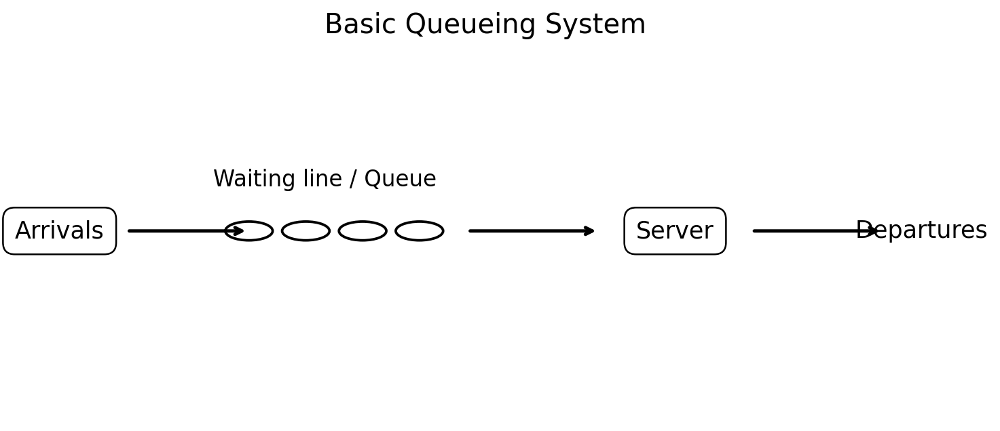
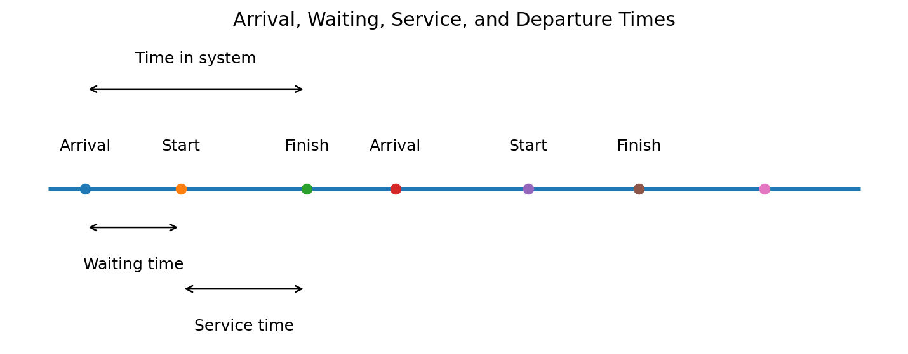
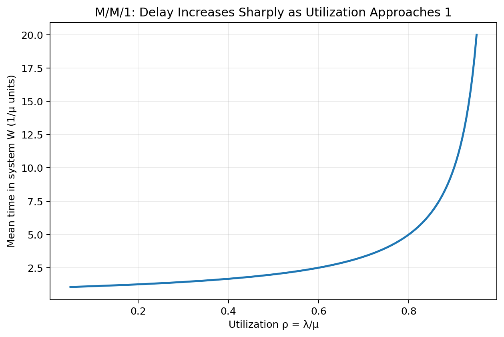
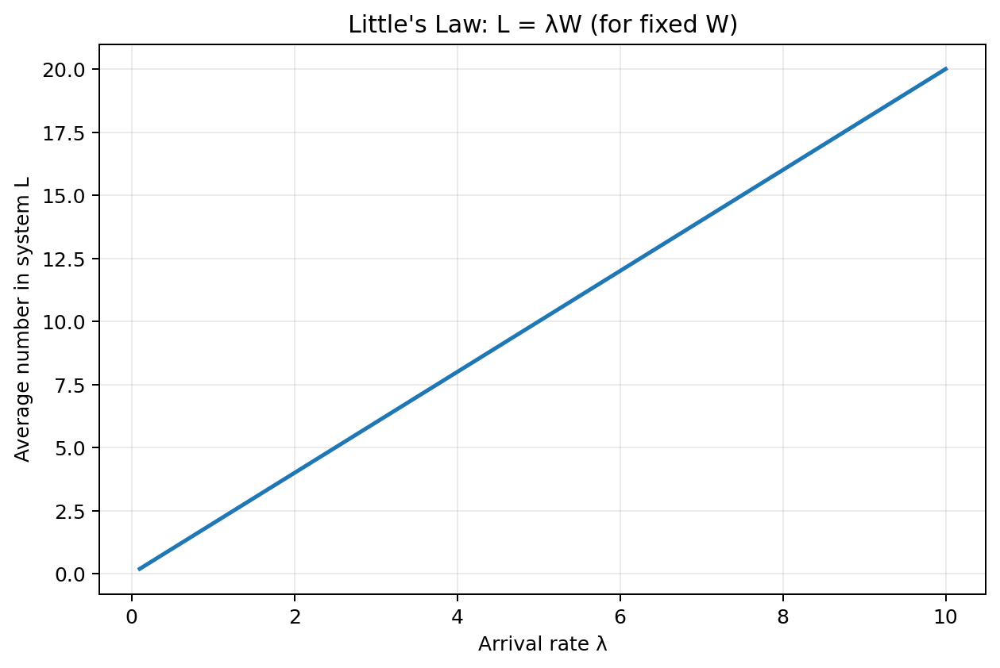
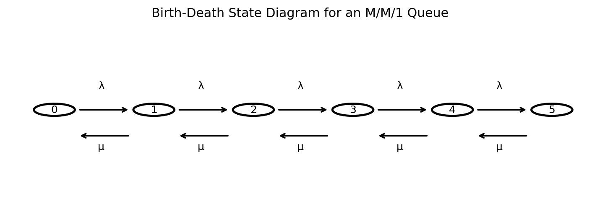
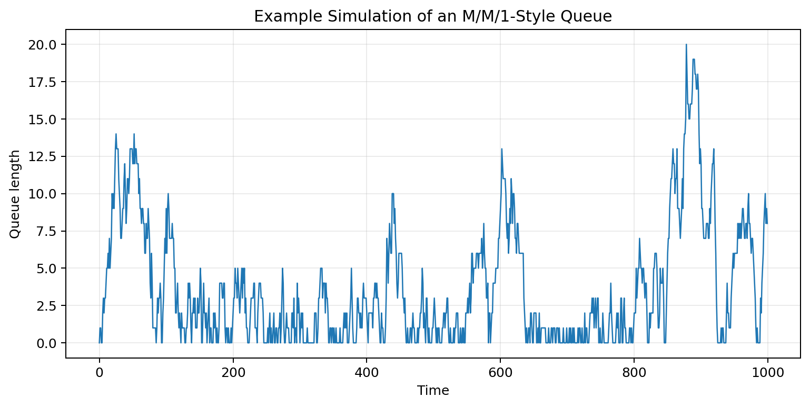
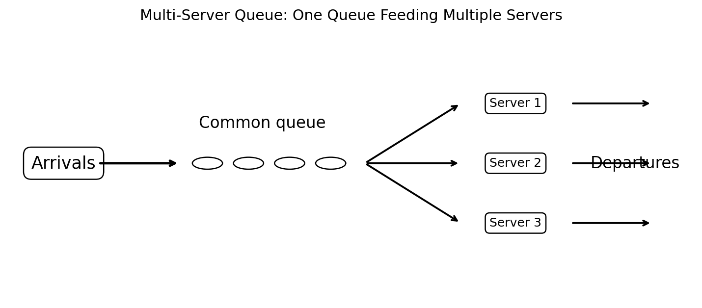
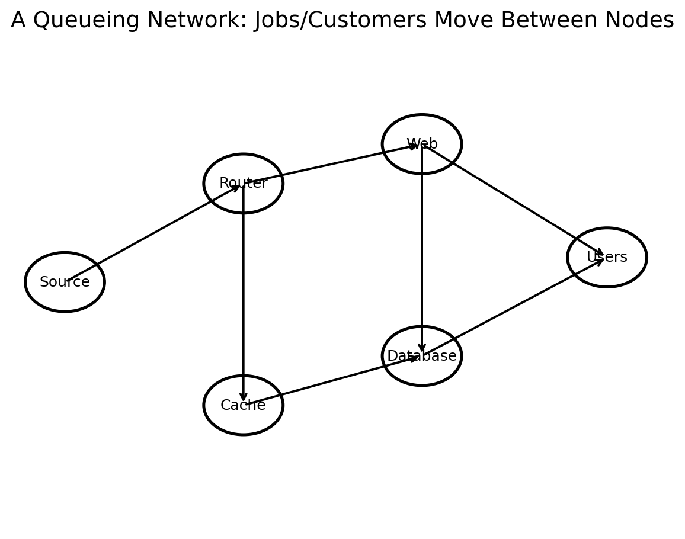
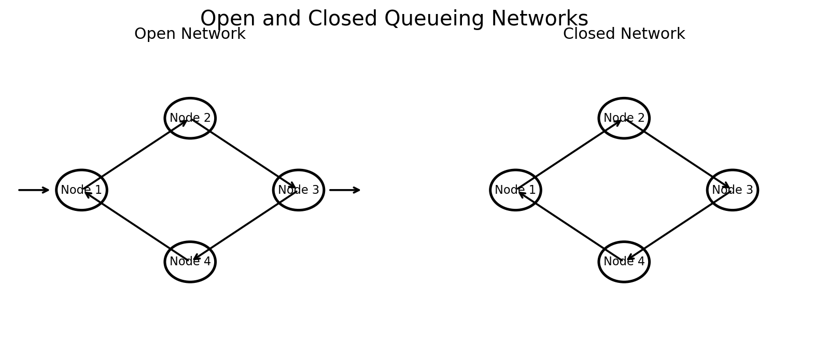

# :classical_building: Mathematics for IT Course - M.Tech. 1st Semester, IIIT Allahabad
## Unit 4: Stochastic Processes and Random Models
* ### Current Topic: Introduction to Queueing and Network Models  
* #### Introducing queueing systems, basic queueing terminology, performance measures, classical queueing models, Little's Law, utilization, multi-server systems, queue disciplines, and queueing networks.
---
## 👥 Instructor Information
* **Edited by Instructor:** [Dr. Mohammed Javed](https://sites.google.com/site/mohammedjaved2016/)
* **Email:** javed@iiita.ac.in
* **Teaching Assistants:** Mr. Apurba Chakraborty (rsi2024005@iiita.ac.in)
---
## 🎯 Learning Objectives

After studying this chapter, you should be able to:

- explain the purpose of queueing theory;
- identify arrivals, queues, servers, and departures;
- distinguish arrival rate from service rate;
- calculate utilization;
- explain waiting time, service time, and time in system;
- use Little's Law;
- describe common queueing disciplines;
- understand the basic M/M/1 and M/M/c models;
- explain why high utilization can cause large delays;
- understand open and closed queueing networks;
- model networks as collections of interacting service stations;
- simulate a simple queueing system in Python;
- identify applications of queueing and network models.

---

# 1. Introduction

A **queue** forms whenever demand for a service temporarily exceeds the available service capacity.

Examples include:

- customers waiting at a bank;
- vehicles waiting at a toll plaza;
- packets waiting in a router;
- jobs waiting for a CPU;
- patients waiting for treatment;
- requests waiting for a web server;
- products waiting for inspection;
- calls waiting in a call center.

Queueing theory provides mathematical tools for understanding such systems.

A basic queue contains:

1. an **arrival process**;
2. a **waiting line**;
3. one or more **servers**;
4. a **departure process**.



The central questions are:

- How long do customers wait?
- How many customers are in the system?
- How busy are the servers?
- How much capacity is required?
- What happens when demand increases?
- How should resources be allocated?

---

# 2. Queueing Theory and Queueing Models

**Queueing theory** is the mathematical study of waiting lines.

A **queueing model** specifies assumptions about:

- how customers arrive;
- how customers are served;
- the number of servers;
- the queue capacity;
- the order in which customers are served;
- whether customers can leave without service;
- whether the system is open or closed.

A queueing model is therefore a simplified mathematical representation of a real service system.

---

# 3. Basic Components of a Queue

A queueing system can be described using several components.

## 3.1 Arrival process

The arrival process describes when customers or jobs enter the system.

The **arrival rate** is usually denoted by:

$$
\boxed{\lambda}
$$

and represents the average number of arrivals per unit time.

For example:

$$
\lambda=10\text{ customers/hour}.
$$

---

## 3.2 Service process

The service process describes how long it takes to serve a customer.

The **service rate** is usually denoted by:

$$
\boxed{\mu}
$$

and represents the average service capacity of one server.

For example:

$$
\mu=12\text{ customers/hour}.
$$

The corresponding average service time is:

$$
\boxed{
E[S]=\frac1\mu.
}
$$

---

## 3.3 Number of servers

A system may have:

- one server;
- multiple parallel servers;
- servers arranged sequentially;
- a network of service stations.

For example:

- one ATM → single-server system;
- supermarket checkout → multi-server system;
- CPU cluster → multiple-server system.

---

## 3.4 Queue capacity

The queue can be:

- infinite;
- finite;
- effectively infinite.

A finite-capacity queue may reject customers when it is full.

---

## 3.5 Queue discipline

The **queue discipline** determines who is served next.

Common disciplines include:

- First-In, First-Out (FIFO);
- Last-In, First-Out (LIFO);
- priority scheduling;
- shortest processing time;
- processor sharing;
- random order of service.

---

# 4. Arrival, Waiting, Service, and Departure

Suppose a customer arrives at time $(A)$, begins service at $(B)$, and finishes at $(D)$.

Then:

### Waiting time

$$
\boxed{
W_q=B-A
}
$$

### Service time

$$
\boxed{
S=D-B
}
$$

### Time in system

$$
\boxed{
W=D-A
}
$$

Therefore:

$$
\boxed{
W=W_q+S.
}
$$



These simple quantities are among the most important performance measures in queueing theory.

---

# 5. Queue Length

Let:

$$
L_q
$$

denote the average number of customers waiting in the queue.

Let:

$$
L
$$

denote the average number of customers in the entire system, including those currently being served.

Therefore:

$$
\boxed{
L=L_q+\text{average number in service}.
}
$$

For a single server, the average number in service is closely related to utilization.

---

# 6. Utilization

For a single server:

$$
\boxed{
\rho=\frac{\lambda}{\mu}.
}
$$

The quantity $(\rho)$ is called **utilization**.

Interpretation:

- $(\rho=0.30)$: server is lightly loaded;
- $(\rho=0.70)$: moderately loaded;
- $(\rho=0.90)$: heavily loaded;
- $(\rho\to1)$: system approaches saturation.

For many basic stable single-server models:

$$
\boxed{
\rho<1.
}
$$

If:

$$
\rho\ge1,
$$

the long-run queue generally cannot remain stable under the simplest assumptions.

---

# 7. Why High Utilization Causes Delay

It may seem attractive to operate a server at nearly 100% utilization.

However, random arrivals and random service times create variability.

When utilization approaches one, there is little spare capacity to absorb fluctuations.

For an M/M/1 queue:

$$
\boxed{
W=\frac{1}{\mu-\lambda}
}
$$

and:

$$
\boxed{
W_q=\frac{\lambda}{\mu(\mu-\lambda)}.
}
$$

Equivalently:

$$
\boxed{
W=\frac{1}{\mu(1-\rho)}.
}
$$

As:

$$
\rho\to1,
$$

the waiting time becomes very large.



This is a central insight of queueing theory:

> High utilization is efficient in terms of resource usage, but it can be extremely expensive in terms of waiting time.

---

# 8. Little's Law

One of the most useful results in queueing theory is **Little's Law**.

Under suitable long-run stability conditions:

$$
\boxed{
L=\lambda W.
}
$$

where:

- $(L)$ = average number of customers in the system;
- $(\lambda)$ = average arrival rate;
- $(W)$ = average time spent in the system.

Similarly:

$$
\boxed{
L_q=\lambda W_q.
}
$$

Little's Law is remarkably general.

It does not require a particular distribution such as exponential arrivals or service times.



---

# 9. Example of Little's Law

Suppose:

$$
\lambda=20\text{ customers/hour}
$$

and the average time in the system is:

$$
W=0.25\text{ hour}.
$$

Then:

$$
L=\lambda W.
$$

Therefore:

$$
L=20(0.25)=5.
$$

So the average number of customers in the system is:

$$
\boxed{5}.
$$

---

# 10. Queueing Notation

A widely used notation is **Kendall's notation**:

$$
\boxed{
A/S/c
}
$$

where:

- $(A)$ describes the arrival-time distribution;
- $(S)$ describes the service-time distribution;
- $(c)$ is the number of servers.

Examples:

$$
M/M/1
$$

$$
M/M/c
$$

$$
M/G/1
$$

$$
G/G/1
$$

The notation can be extended with additional parameters describing capacity and queue discipline.

---

# 11. Meaning of "M" in Queueing Models

In Kendall notation, $(M)$ traditionally means **Markovian**.

In common queueing models:

- $(M)$ arrivals correspond to a Poisson arrival process;
- $(M)$ service corresponds to exponentially distributed service times.

Thus:

$$
M/M/1
$$

means:

- Poisson arrivals;
- exponential service times;
- one server.

---

# 12. Poisson Arrivals

If arrivals follow a Poisson process with rate $(\lambda)$, then the number of arrivals in a time interval $(t)$ has distribution:

$$
\boxed{
P(N(t)=k)=
e^{-\lambda t}
\frac{(\lambda t)^k}{k!}.
}
$$

The mean number of arrivals is:

$$
E[N(t)]=\lambda t.
$$

The interarrival times are exponentially distributed:

$$
T\sim\text{Exponential}(\lambda).
$$

---

# 13. Exponential Service Times

If service time $(S)$ is exponential with rate $(\mu)$:

$$
\boxed{
f_S(s)=\mu e^{-\mu s},
\quad s\ge0.
}
$$

The expected service time is:

$$
\boxed{
E[S]=\frac1\mu.
}
$$

The exponential distribution has the memoryless property:

$$
P(S>s+t\mid S>s)=P(S>t).
$$

This property makes exponential service mathematically convenient.

---

# 14. The M/M/1 Queue

The **M/M/1** queue is the classic introductory queueing model.

It assumes:

- Poisson arrivals;
- exponential service times;
- one server;
- typically an unlimited waiting room;
- FIFO service in the standard interpretation.

Its utilization is:

$$
\boxed{
\rho=\frac{\lambda}{\mu}.
}
$$

For stability:

$$
\boxed{
\rho<1.
}
$$

---

# 15. M/M/1 Steady-State Probabilities

Let:

$$
P_n
$$

be the long-run probability of having $(n)$ customers in the system.

For M/M/1:

$$
\boxed{
P_n=(1-\rho)\rho^n,
\quad n=0,1,2,\ldots
}
$$

Therefore:

$$
P_0=1-\rho.
$$

The probability of having at least $(n)$ customers is:

$$
\boxed{
P(N\ge n)=\rho^n.
}
$$

---

# 16. M/M/1 State Diagram

The queue length can be represented as a birth-death process.

An arrival changes:

$$
n\to n+1
$$

at rate $(\lambda)$.

A service completion changes:

$$
n\to n-1
$$

at rate $(\mu)$, provided $(n>0)$.



This connection makes queueing theory closely related to Markov chains and stochastic processes.

---

# 17. M/M/1 Performance Measures

For a stable M/M/1 queue:

### Average number in system

$$
\boxed{
L=\frac{\rho}{1-\rho}
}
$$

### Average number waiting

$$
\boxed{
L_q=\frac{\rho^2}{1-\rho}
}
$$

### Average time in system

$$
\boxed{
W=\frac{1}{\mu-\lambda}
}
$$

### Average waiting time

$$
\boxed{
W_q=\frac{\rho}{\mu-\lambda}
}
$$

These quantities satisfy Little's Law.

---

# 18. Example: M/M/1 Queue

Suppose:

$$
\lambda=8\text{ customers/hour}
$$

and:

$$
\mu=10\text{ customers/hour}.
$$

Then:

$$
\rho=\frac8{10}=0.8.
$$

The average number in the system is:

$$
L=\frac{0.8}{1-0.8}=4.
$$

The average time in the system is:

$$
W=\frac1{10-8}=0.5\text{ hour}.
$$

Thus:

$$
W=30\text{ minutes}.
$$

Notice how a service capacity only 25% greater than the arrival rate can still produce substantial waiting.

---

# 19. Python: M/M/1 Performance Measures

```python
def mm1_metrics(lam, mu):
    if lam >= mu:
        raise ValueError("The M/M/1 queue is unstable when λ >= μ.")

    rho = lam / mu

    L = rho / (1 - rho)
    Lq = rho**2 / (1 - rho)

    W = 1 / (mu - lam)
    Wq = rho / (mu - lam)

    return {
        "utilization": rho,
        "L": L,
        "Lq": Lq,
        "W": W,
        "Wq": Wq
    }


metrics = mm1_metrics(8, 10)

for key, value in metrics.items():
    print(key, "=", value)
```

---

# 20. Simulating a Queue in Python

A simple discrete-time simulation can illustrate how queue length evolves.

```python
import numpy as np
import matplotlib.pyplot as plt

rng = np.random.default_rng(42)

lam = 0.8
mu = 1.0

dt = 0.01
T = 100

queue = 0
history = []

for _ in range(int(T / dt)):

    # Arrival
    if rng.random() < lam * dt:
        queue += 1

    # Service completion
    if queue > 0 and rng.random() < mu * dt:
        queue -= 1

    history.append(queue)

plt.plot(np.arange(len(history)) * dt, history)
plt.xlabel("Time")
plt.ylabel("Queue length")
plt.title("Simulated Queue Length")
plt.show()
```



This simulation is only an approximation of continuous-time M/M/1 dynamics, but it is useful for intuition.

---

# 21. Multi-Server Queues

Many real systems have several parallel servers.

Examples:

- bank counters;
- call-center agents;
- checkout counters;
- hospital treatment rooms;
- cloud-computing workers.

An $(M/M/c)$ model has:

- Poisson arrivals;
- exponential service times;
- $(c)$ identical parallel servers.



The total service capacity is approximately:

$$
c\mu.
$$

A basic stability condition is:

$$
\boxed{
\lambda<c\mu.
}
$$

---

# 22. Queue Discipline

The queue discipline can strongly affect performance.

## FIFO

**First-In, First-Out**

The first customer to arrive is served first.

Common in:

- ordinary service counters;
- many computer queues;
- network packet buffers.

## LIFO

**Last-In, First-Out**

The newest customer is served first.

This can occur naturally in:

- stacks;
- some computational tasks.

## Priority Queue

Customers are assigned different priorities.

Examples:

- emergency patients;
- high-priority network packets;
- critical computer jobs.

---

# 23. Preemptive and Non-Preemptive Priority

In a **preemptive** priority queue, a higher-priority customer can interrupt a lower-priority job.

In a **non-preemptive** priority queue, service continues until the current customer is finished.

These policies can produce significantly different waiting-time distributions.

---

# 24. Finite-Capacity Queues

Suppose a system can contain at most $(K)$ customers.

Then:

$$
N(t)\le K.
$$

When the system is full, a new arrival may:

- be rejected;
- be blocked;
- be lost;
- retry later.

Examples:

- limited parking;
- finite telephone lines;
- finite server buffers;
- limited hospital beds.

Finite capacity makes **blocking probability** an important performance measure.

---

# 25. Queueing Networks

A **queueing network** consists of multiple service stations connected together.

A customer may:

1. arrive at one node;
2. wait for service;
3. receive service;
4. move to another node;
5. eventually leave the network.



Examples include:

- computer networks;
- manufacturing systems;
- hospital workflows;
- transportation systems;
- cloud applications.

---

# 26. Open Queueing Networks

An **open queueing network** has external arrivals and departures.

Customers enter from outside and eventually leave.

For example:

$$
\text{Users}
\rightarrow
\text{Web Server}
\rightarrow
\text{Database}
\rightarrow
\text{Response}.
$$

The number of customers in the network can vary over time.

---

# 27. Closed Queueing Networks

In a **closed queueing network**, the number of customers circulating through the network is fixed.

There are no external arrivals or departures during normal operation.

For example, a computer system may have a fixed number of jobs repeatedly cycling between:

- CPU;
- disk;
- memory;
- network.



---

# 28. Routing in Queueing Networks

After service at node $(i)$, a customer may move to node $(j)$.

Define:

$$
p_{ij}=
P(\text{next node}=j\mid\text{current node}=i).
$$

The matrix:

$$
P=[p_{ij}]
$$

is called a **routing matrix**.

Each row must satisfy:

$$
\boxed{
\sum_jp_{ij}=1
}
$$

when every completed job must move somewhere.

---

# 29. Traffic Equations

For an open network, let:

$$
\gamma_i
$$

be the total arrival rate to node $(i)$.

Let:

$$
e_i
$$

be the external arrival rate to node $(i)$.

Then:

$$
\boxed{
\gamma_i=
e_i+\sum_j\gamma_jp_{ji}.
}
$$

In vector form:

$$
\boxed{
\gamma=e+\gamma P.
}
$$

Depending on row/column convention, the equivalent matrix equation may be written differently.

Solving these **traffic equations** gives the effective arrival rate at each node.

---

# 30. Example of Network Traffic Equations

Suppose there are two nodes.

External arrival rates:

$$
e_1=5,\qquad e_2=2.
$$

Suppose:

$$
p_{12}=0.2
$$

and:

$$
p_{21}=0.1.
$$

Then:

$$
\gamma_1=5+0.1\gamma_2
$$

and:

$$
\gamma_2=2+0.2\gamma_1.
$$

These equations can be solved simultaneously to obtain the effective arrival rate at each node.

---

# 31. Python: Solving Traffic Equations

Using the row-vector convention:

$$
\gamma=e+\gamma P.
$$

Rearrange:

$$
\gamma(I-P)=e.
$$

```python
import numpy as np

P = np.array([
    [0.0, 0.2],
    [0.1, 0.0]
])

e = np.array([5.0, 2.0])

gamma = e @ np.linalg.inv(
    np.eye(2) - P
)

print("Effective arrival rates:")
print(gamma)
```

A numerically preferable implementation uses `np.linalg.solve`:

```python
gamma = np.linalg.solve(
    (np.eye(2) - P).T,
    e
)

print(gamma)
```

---

# 32. Stability of Queueing Networks

A queueing network is stable only if the workload entering each service station can be handled by its capacity.

For node $(i)$:

$$
\boxed{
\gamma_i<c_i\mu_i
}
$$

for a simple $(M/M/c_i)$-style station.

For a single-server node:

$$
\boxed{
\gamma_i<\mu_i.
}
$$

If demand persistently exceeds service capacity, queues can grow without bound.

---

# 33. Bottlenecks

A **bottleneck** is a resource whose capacity limits the overall performance of the system.

Suppose:

| Node | Arrival rate | Service capacity | Utilization |
|---|---:|---:|---:|
| CPU | 8 | 10 | 0.80 |
| Database | 7 | 8 | 0.875 |
| Network | 5 | 12 | 0.417 |

The database is the most heavily utilized node.

It may therefore become the system bottleneck.

Bottleneck identification is a major reason for using queueing network models.

---

# 34. Tandem Queues

A simple queueing network can have sequential stations:

$$
\text{Queue 1}
\rightarrow
\text{Server 1}
\rightarrow
\text{Queue 2}
\rightarrow
\text{Server 2}
\rightarrow
\text{Departure}.
$$

This is called a **tandem queue**.

Applications include:

- manufacturing assembly lines;
- data-processing pipelines;
- communication systems;
- hospital workflows.

A bottleneck at one station can cause congestion throughout the network.

---

# 35. Queueing Networks in Computer Systems

Consider a web application:

$$
\text{Users}
\rightarrow
\text{Web Server}
\rightarrow
\text{Application Server}
\rightarrow
\text{Database}.
$$

Each component can be modeled as a service station.

The system's response time depends on:

- arrival rate;
- service capacity;
- queueing delay;
- routing;
- contention for resources.

This is why queueing models are useful in performance engineering.

---

# 36. Queueing Networks in Manufacturing

A manufacturing system may look like:

$$
\text{Raw Material}
\rightarrow
\text{Machining}
\rightarrow
\text{Assembly}
\rightarrow
\text{Inspection}
\rightarrow
\text{Shipping}.
$$

Each stage may have:

- different service times;
- multiple machines;
- finite buffers;
- machine failures;
- priority rules.

Queueing network models help estimate:

- throughput;
- work-in-process inventory;
- bottlenecks;
- lead times;
- machine utilization.

---

# 37. Queueing Networks in Healthcare

A simplified healthcare network may be:

$$
\text{Registration}
\rightarrow
\text{Triage}
\rightarrow
\text{Doctor}
\rightarrow
\text{Laboratory}
\rightarrow
\text{Discharge}.
$$

Patients may take different routes depending on their condition.

For example:

$$
\text{Doctor}
\rightarrow
\text{Discharge}
$$

or:

$$
\text{Doctor}
\rightarrow
\text{Laboratory}
\rightarrow
\text{Doctor}.
$$

This creates routing and feedback.

---

# 38. Queueing and Network Models: Key Performance Measures

Important metrics include:

### Arrival rate

$$
\lambda
$$

### Service rate

$$
\mu
$$

### Utilization

$$
\rho=\frac{\lambda}{\mu}
$$

for a single server.

### Average queue length

$$
L_q
$$

### Average system size

$$
L
$$

### Average waiting time

$$
W_q
$$

### Average time in system

$$
W
$$

### Throughput

Average number of completed jobs per unit time.

### Blocking probability

Probability that an arriving job cannot enter because capacity is full.

---

# 39. Throughput

**Throughput** is the rate at which work is completed.

For a stable system, long-run throughput often equals the long-run external arrival rate.

For example:

$$
\lambda=100\text{ requests/second}
$$

and a stable system processing all requests has approximately:

$$
\text{throughput}=100\text{ requests/second}.
$$

In a bottlenecked system, throughput may be constrained by the bottleneck capacity.

---

# 40. Response Time

For a computer system:

$$
\boxed{
\text{Response time}=
\text{queueing delay}
+
\text{service time}.
}
$$

A system may have fast servers but poor response time if the queueing delay is large.

This distinction is critical when designing:

- APIs;
- websites;
- databases;
- cloud infrastructure;
- distributed systems.

---

# 41. Variability Matters

Two systems can have the same average arrival and service rates but very different waiting times.

Why?

Because **variability** matters.

Variability can occur in:

- interarrival times;
- service times;
- routing;
- workloads;
- failures;
- customer behavior.

Queueing theory therefore studies not only averages but also probability distributions.

---

# 42. The Effect of Variability

Consider two service systems with the same average service time.

System A:

$$
S=1\text{ minute}
$$

for every customer.

System B:

service times vary substantially around the same mean.

System B may experience longer queues because bursts of long services temporarily reduce capacity.

This is why queueing theory cannot usually be reduced to:

$$
\text{arrival rate} \quad\text{vs.}\quad \text{average service rate}.
$$

---

# 43. Stability Versus Performance

A system can be mathematically stable but still provide unacceptable service.

For example:

$$
\rho=0.95
$$

is less than one, so a basic M/M/1 queue is stable.

But:

$$
W=\frac{1}{\mu(1-\rho)}
$$

can be very large.

Therefore:

> **Stability is necessary, but not sufficient, for good performance.**

A practical design may target utilization significantly below 100%.

---

# 44. Queueing and Capacity Planning

Queueing models can help answer:

- How many servers are needed?
- What happens if demand grows by 20%?
- What service rate is required?
- How much buffer capacity should be provided?
- Which station should be upgraded?
- What is the expected response time?

For example, if:

$$
\lambda=90
$$

and a server can process:

$$
\mu=100,
$$

then:

$$
\rho=0.9.
$$

If demand rises to 98:

$$
\rho=0.98.
$$

The system is still technically stable in the basic model, but delay may increase dramatically.

---

# 45. Queueing and Network Models: A Unified View

A queueing system can be viewed as a stochastic dynamical system:

$$
\boxed{
\text{Arrivals}
\rightarrow
\text{State}
\rightarrow
\text{Service}
\rightarrow
\text{Routing}
\rightarrow
\text{New State}.
}
$$

The state might contain:

- number of jobs at each node;
- server status;
- customer classes;
- resource availability.

The network evolves randomly over time.

---

# 46. Connection With Markov Chains

Many queueing models can be represented as Markov chains.

For an M/M/1 queue, the state is simply:

$$
N(t)=\text{number of customers in the system}.
$$

The process moves between neighboring states:

$$
0\leftrightarrow1\leftrightarrow2\leftrightarrow3\leftrightarrow\cdots
$$

with arrival transitions at rate $(\lambda)$ and service transitions at rate $(\mu)$.

Thus queueing theory and Markov-chain theory are closely connected.

---

# 47. Connection With Stochastic Processes

Queue lengths are stochastic processes because they evolve randomly over time.

Examples include:

$$
N(t)
$$

for the number of customers, and:

$$
D(t)
$$

for the number of departures.

Other processes can describe:

- arrivals;
- service completions;
- workload;
- inventory;
- network traffic.

Queueing theory is therefore an important application of stochastic-process theory.

---

# 48. Python: A Simple Queueing Network Representation

A basic network can be represented using a routing matrix.

```python
import numpy as np

# Routing probabilities
P = np.array([
    [0.0, 0.4, 0.0],
    [0.0, 0.0, 0.3],
    [0.0, 0.0, 0.0]
])

external = np.array([10.0, 5.0, 2.0])

# Solve gamma = external + gamma P
gamma = np.linalg.solve(
    (np.eye(3) - P).T,
    external
)

print("Node arrival rates:")
for i, rate in enumerate(gamma, start=1):
    print(f"Node {i}: {rate:.2f}")
```

This provides the effective arrival rate at each node before service-capacity calculations.

---

# 49. Example: Checking Network Stability

Suppose:

```python
service_rates = np.array([15.0, 12.0, 20.0])
```

and the effective arrival rates are:

```python
arrival_rates = np.array([10.0, 9.0, 5.0])
```

Then:

```python
utilization = arrival_rates / service_rates

for i, rho in enumerate(utilization, start=1):
    print(f"Node {i}: utilization = {rho:.3f}")
```

A node with utilization close to 1 deserves special attention.

---

# 50. Practical Modeling Workflow

A useful workflow for a queueing problem is:

### Step 1 — Identify customers/jobs

What is waiting?

### Step 2 — Identify arrivals

Where do customers come from?

### Step 3 — Estimate arrival rate

Estimate:

$$
\lambda.
$$

### Step 4 — Identify servers

What resources provide service?

### Step 5 — Estimate service rate

Estimate:

$$
\mu.
$$

### Step 6 — Identify queue discipline

FIFO? Priority? Processor sharing?

### Step 7 — Identify routing

Where does a completed job go next?

### Step 8 — Select a model

For example:

$$
M/M/1,\quad M/M/c,\quad G/G/1
$$

or a queueing network.

### Step 9 — Calculate performance

Estimate:

- utilization;
- queue length;
- waiting time;
- throughput;
- blocking.

### Step 10 — Validate

Compare the model with real observations or simulation.

---

# 51. Analytical Models Versus Simulation

There are two major approaches.

## Analytical modeling

Use mathematical formulas.

Advantages:

- fast;
- provides insight;
- often gives exact results under assumptions.

Limitations:

- requires simplifying assumptions;
- complex systems may not have closed-form formulas.

## Simulation

Build a computational model and imitate system behavior.

Advantages:

- handles complex routing;
- can include realistic distributions;
- supports detailed scenarios.

Limitations:

- requires computational effort;
- results contain simulation uncertainty;
- model validation is important.

A strong practical approach often combines both.

---

# 52. Monte Carlo Simulation of a Queue

A simulation can estimate quantities such as:

$$
\hat L=
\frac1T\int_0^T N(t)\,dt.
$$

Similarly:

$$
\hat W=
\frac1N\sum_{i=1}^{N}W_i.
$$

By running many arrivals and long simulation periods, estimates become more reliable.

Simulation is particularly useful when:

- arrivals are non-Poisson;
- service times are complicated;
- routing is complex;
- servers can fail;
- priorities are present;
- capacity is finite.

---

# 53. Common Applications

Queueing and network models are used in:

### Telecommunications

- packet routing;
- call centers;
- bandwidth allocation.

### Computing

- CPU scheduling;
- server capacity;
- cloud infrastructure;
- database systems.

### Manufacturing

- production lines;
- machine utilization;
- inventory buffers.

### Healthcare

- emergency departments;
- operating rooms;
- laboratory services.

### Transportation

- airports;
- traffic intersections;
- toll booths;
- public transit.

### Retail

- checkout counters;
- customer service;
- online order processing.

---

# 54. Common Modeling Mistakes

### Mistake 1: Ignoring variability

Average arrival and service rates alone may not predict delay accurately.

### Mistake 2: Assuming 100% utilization is ideal

High utilization can create severe waiting.

### Mistake 3: Ignoring routing

In networks, jobs may visit several nodes.

### Mistake 4: Ignoring capacity constraints

Finite buffers can cause blocking or lost customers.

### Mistake 5: Confusing queue length and system size

$(L_q)$ excludes the customer currently in service.

$(L)$ includes customers waiting and in service.

### Mistake 6: Using an unstable model

For a basic M/M/1 system, $(\lambda\ge\mu)$ means the steady-state formulas do not apply.

---

# 55. Key Formulas at a Glance

### Utilization

$$
\boxed{
\rho=\frac{\lambda}{\mu}
}
$$

for one server.

### Little's Law

$$
\boxed{
L=\lambda W
}
$$

### Queue version

$$
\boxed{
L_q=\lambda W_q
}
$$

### M/M/1 stability

$$
\boxed{
\lambda<\mu
}
$$

### M/M/1 average number in system

$$
\boxed{
L=\frac{\rho}{1-\rho}
}
$$

### M/M/1 average number in queue

$$
\boxed{
L_q=\frac{\rho^2}{1-\rho}
}
$$

### M/M/1 average time in system

$$
\boxed{
W=\frac{1}{\mu-\lambda}
}
$$

### M/M/1 average waiting time

$$
\boxed{
W_q=\frac{\rho}{\mu-\lambda}
}
$$

### M/M/c stability

$$
\boxed{
\lambda<c\mu
}
$$

### Network traffic equation

Using the row-vector convention:

$$
\boxed{
\gamma=e+\gamma P
}
$$

or:

$$
\boxed{
\gamma(I-P)=e.
}
$$

---

# 56. Summary

Queueing theory studies systems in which customers, jobs, packets, or other entities compete for service.

The fundamental structure is:

$$
\boxed{
\text{Arrival}
\rightarrow
\text{Queue}
\rightarrow
\text{Service}
\rightarrow
\text{Departure}.
}
$$

Important quantities include:

$$
\lambda,\quad\mu,\quad\rho,\quad L_q,\quad L,\quad W_q,\quad W.
$$

The most important introductory relationship is:

$$
\boxed{
L=\lambda W.
}
$$

For a basic M/M/1 queue:

$$
\boxed{
\rho=\frac{\lambda}{\mu}
}
$$

and stability requires:

$$
\boxed{
\rho<1.
}
$$

As utilization approaches one, waiting times can increase sharply.

When several service stations interact, a **queueing network** provides a natural framework for representing the flow of jobs between nodes.

These ideas form the foundation for more advanced topics including:

- birth-death processes;
- M/M/c queues;
- finite-capacity queues;
- priority queues;
- Jackson networks;
- closed queueing networks;
- product-form solutions;
- queueing networks in computer systems;
- performance engineering;
- stochastic simulation.

---

# 57. Practice Questions

1. What is a queueing system?
2. Define arrival rate and service rate.
3. Explain the difference between $(L_q)$ and $(L)$.
4. Explain the difference between $(W_q)$ and $(W)$.
5. Define utilization.
6. Why must a basic M/M/1 queue satisfy $(\lambda<\mu)$?
7. State Little's Law.
8. A system receives 30 jobs/hour and has an average time in system of 6 minutes. Find $(L)$.
9. Explain FIFO, LIFO, and priority scheduling.
10. What assumptions define an M/M/1 queue?
11. Derive the M/M/1 utilization.
12. Calculate $(L,L_q,W,W_q)$ for $(\lambda=8,\mu=10)$.
13. Explain why delay rises rapidly near full utilization.
14. What is an M/M/c queue?
15. Explain open and closed queueing networks.
16. What is a routing matrix?
17. Write the traffic equations for a two-node network.
18. Explain the concept of a bottleneck.
19. Simulate an M/M/1-style queue in Python.
20. Compare analytical and simulation-based queueing analysis.
21. Give three applications of queueing networks in computer systems.
22. Give three applications in manufacturing or healthcare.
23. Explain why variability affects waiting time.
24. Explain the connection between queueing models and Markov chains.
25. Design a simple queueing network for a web application.

---
## ❓: CHALLENGING Questions - Check Your Understanding 
* ➡️ **[Q-01]**
* ➡️ 

---
## 📚 References 
* **[R-01]** Linear Algebra by Gilbert Strang, MIT Press
* **[R-02]** ChatGPT - for examples and codes
