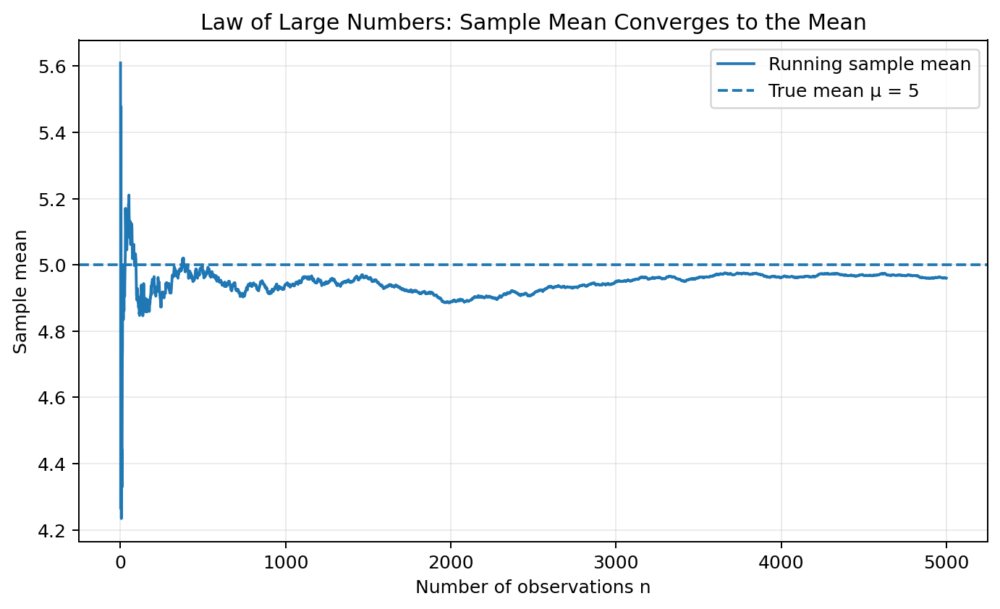
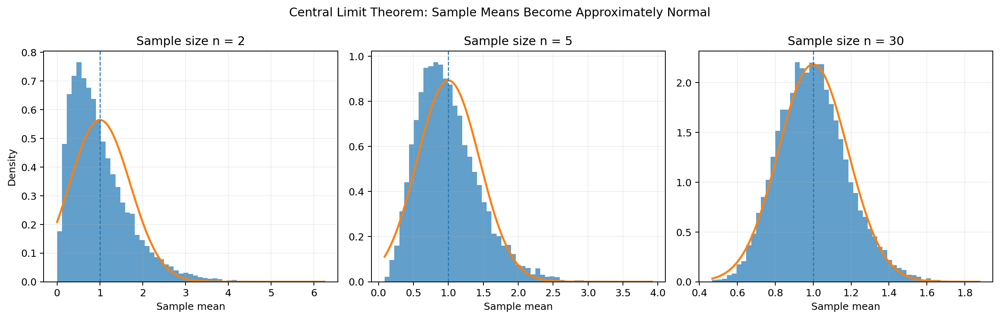
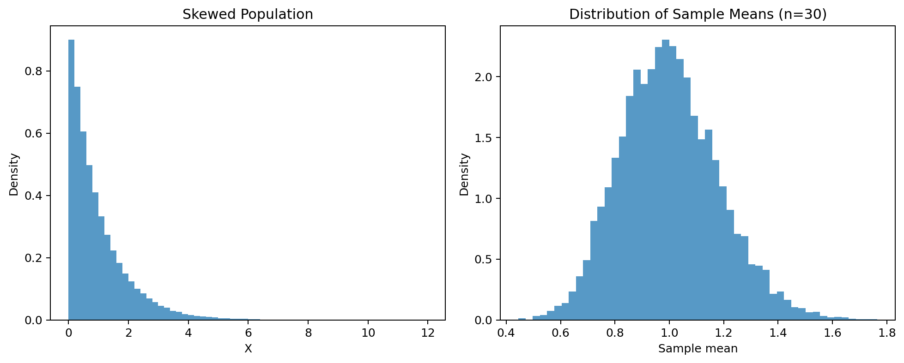
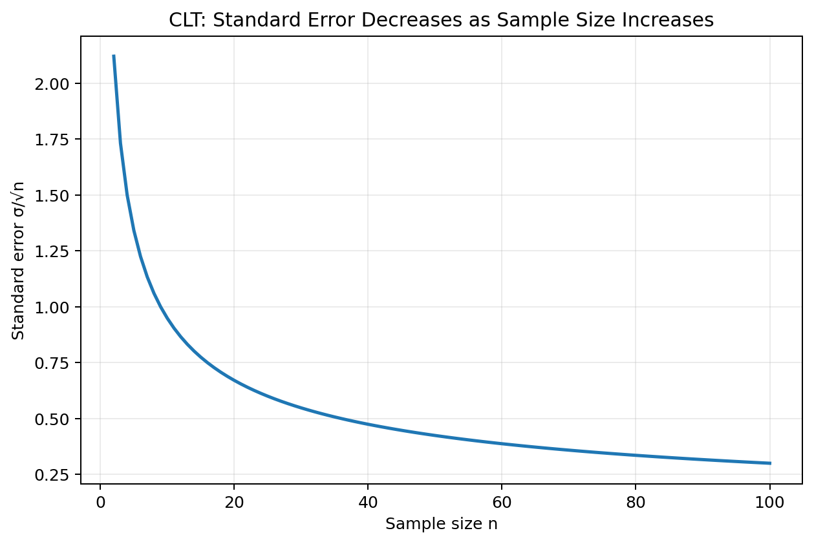

# Limit Theorems: Law of Large Numbers and Central Limit Theorem

> A GitHub-ready reading material on two foundational results of probability and statistics: the **Law of Large Numbers (LLN)** and the **Central Limit Theorem (CLT)**.

## Learning Objectives

After studying this chapter, you should be able to:

- explain why sample averages become stable as sample size increases;
- distinguish the Law of Large Numbers from the Central Limit Theorem;
- understand convergence in probability and almost sure convergence at an intuitive level;
- state the classical Central Limit Theorem;
- explain the role of the standard error;
- use Python to demonstrate LLN and CLT through simulation;
- understand why the Normal distribution appears so frequently in statistics.

---

# 1. Why Limit Theorems Matter

Probability often deals with random outcomes whose exact values are unpredictable.

For example:

- the result of a coin toss is uncertain;
- the number of customers arriving in an hour varies;
- measurements contain random variation;
- a sample mean changes from sample to sample.

Yet, when we observe **many independent observations**, remarkably stable patterns appear.

Two of the most important mathematical results explaining this behavior are:

1. **Law of Large Numbers (LLN)** — explains why averages stabilize.
2. **Central Limit Theorem (CLT)** — explains the approximate Normal shape of the distribution of averages and sums.

These theorems form much of the theoretical foundation of statistical inference.

---

# 2. Basic Setup

Suppose:

\[
X_1,X_2,\ldots,X_n
\]

are independent and identically distributed (i.i.d.) random variables.

Let:

\[
E[X_i]=\mu
\]

and:

\[
Var(X_i)=\sigma^2<\infty.
\]

The sample mean is:

\[
\boxed{
\bar X_n=\frac{1}{n}\sum_{i=1}^{n}X_i
}
\]

The two limit theorems tell us different things about what happens as \(n\) becomes large.

---

# 3. Law of Large Numbers

The **Law of Large Numbers** states, informally:

> As the number of observations becomes very large, the sample average tends to get closer to the population mean.

Mathematically, under appropriate assumptions:

\[
\boxed{
\bar X_n\to\mu
}
\]

as:

\[
n\to\infty.
\]



The graph shows a simulated running average moving around at first and becoming increasingly close to the true mean.

---

# 4. Intuition Behind the LLN

Imagine repeatedly rolling a fair six-sided die.

The expected value is:

\[
E[X]=\frac{1+2+3+4+5+6}{6}=3.5.
\]

For a small number of rolls, the average can be far from 3.5.

For example:

\[
\frac{1+6}{2}=3.5
\]

but another two-roll result might be:

\[
\frac{2+6}{2}=4.
\]

As more rolls are observed, unusually high and unusually low values tend to balance each other.

The average becomes more stable around:

\[
\mu=3.5.
\]

---

# 5. LLN Example: Coin Tosses

Suppose:

\[
X_i=
\begin{cases}
1 & \text{heads}\\
0 & \text{tails}
\end{cases}
\]

for a fair coin.

Then:

\[
E[X_i]=0.5.
\]

The sample mean:

\[
\bar X_n=\frac{X_1+\cdots+X_n}{n}
\]

is exactly the observed proportion of heads.

The LLN says:

\[
\boxed{\bar X_n\to0.5}
\]

as \(n\) becomes large.

---

# 6. LLN Simulation with Python

```python
import numpy as np
import matplotlib.pyplot as plt

rng = np.random.default_rng(42)

n = 5000
flips = rng.binomial(1, 0.5, n)

running_mean = np.cumsum(flips) / np.arange(1, n + 1)

plt.plot(running_mean)
plt.axhline(0.5, linestyle="--", label="True probability = 0.5")
plt.xlabel("Number of tosses")
plt.ylabel("Proportion of heads")
plt.title("Law of Large Numbers")
plt.legend()
plt.show()
```

The running proportion fluctuates substantially at first, but settles closer to 0.5 as the number of tosses increases.

---

# 7. LLN with a Non-Binary Random Variable

The LLN is not restricted to coin tosses.

Suppose:

\[
X_i\sim N(5,4).
\]

Then:

\[
E[X_i]=5.
\]

As \(n\) increases:

\[
\bar X_n\to5.
\]


Python:

```python
rng = np.random.default_rng(42)

x = rng.normal(5, 2, 5000)
running_mean = np.cumsum(x) / np.arange(1, len(x) + 1)

plt.plot(running_mean)
plt.axhline(5, linestyle="--", label="True mean")
plt.xlabel("n")
plt.ylabel("Sample mean")
plt.legend()
plt.show()
```

---

# 8. Weak and Strong Law of Large Numbers

There are different mathematical versions of the LLN.

## Weak Law of Large Numbers

The weak law states:

\[
\boxed{
\bar X_n\xrightarrow{P}\mu
}
\]

The notation means **convergence in probability**.

For every \(\epsilon>0\):

\[
P(|\bar X_n-\mu|>\epsilon)\to0.
\]

In words:

> The probability that the sample mean differs substantially from the true mean approaches zero.

## Strong Law of Large Numbers

The strong law states:

\[
\boxed{
\bar X_n\xrightarrow{a.s.}\mu
}
\]

This means **almost sure convergence**.

The strong law provides a stronger form of convergence than the weak law under the standard assumptions.

For introductory statistics, the key intuition is simply:

\[
\boxed{\text{More observations} \Rightarrow \text{more stable averages}}
\]

---

# 9. What the LLN Does NOT Say

The LLN does **not** mean that individual observations become predictable.

For example, if a fair coin is tossed 10,000 times, the next toss is still approximately:

\[
P(H)=0.5.
\]

The LLN concerns the **average or proportion**, not the certainty of individual outcomes.

It also does not mean that the sample average must move monotonically toward the population mean. It can move away from the mean many times before eventually stabilizing.

---

# 10. Central Limit Theorem

The **Central Limit Theorem** is one of the most important results in statistics.

Under standard assumptions:

\[
X_1,\ldots,X_n
\]

are i.i.d. with:

\[
E[X_i]=\mu
\]

and:

\[
Var(X_i)=\sigma^2<\infty.
\]

Then:

\[
\boxed{
\frac{\bar X_n-\mu}{\sigma/\sqrt n}
\xrightarrow{d}
N(0,1)
}
\]

as:

\[
n\to\infty.
\]

Equivalently, for sufficiently large \(n\):

\[
\boxed{
\bar X_n\approx N\left(\mu,\frac{\sigma^2}{n}\right)
}
\]



The important point is that the **distribution of sample means** becomes approximately Normal, even when the original population is not Normal.

---

# 11. The Central Limit Theorem Intuition

Suppose the population is strongly right-skewed, such as an Exponential distribution.

A single observation from that population is not Normally distributed.

But now:

1. Draw a random sample of size \(n\).
2. Calculate its mean.
3. Repeat this thousands of times.
4. Plot all the sample means.

As \(n\) increases, the histogram of sample means becomes increasingly bell-shaped.



This is the key idea behind the CLT.

---

# 12. Standard Error

The standard deviation of the sampling distribution of the sample mean is:

\[
\boxed{
SE(\bar X)=\frac{\sigma}{\sqrt n}
}
\]

This is called the **standard error of the mean**.

As \(n\) increases:

\[
SE(\bar X)\downarrow.
\]



For example, if:

\[
\sigma=10,
\]

then:

| \(n\) | Standard error |
|---:|---:|
| 1 | 10 |
| 4 | 5 |
| 25 | 2 |
| 100 | 1 |
| 400 | 0.5 |

Notice that increasing the sample size by a factor of 4 cuts the standard error in half.

---

# 13. Why Does the Square Root Appear?

For independent observations:

\[
Var(X_1+\cdots+X_n)=n\sigma^2.
\]

Therefore:

\[
Var(\bar X_n)
=
Var\left(\frac{X_1+\cdots+X_n}{n}\right).
\]

So:

\[
Var(\bar X_n)
=
\frac{n\sigma^2}{n^2}
=
\frac{\sigma^2}{n}.
\]

Hence:

\[
\boxed{
SD(\bar X_n)=\frac{\sigma}{\sqrt n}
}
\]

This is the mathematical reason the standard error decreases at the rate \(1/\sqrt n\).

---

# 14. CLT Simulation in Python

The following example starts with an Exponential population, which is strongly skewed.

```python
import numpy as np
import matplotlib.pyplot as plt

rng = np.random.default_rng(42)

sample_size = 30
number_of_samples = 10000

samples = rng.exponential(
    scale=1,
    size=(number_of_samples, sample_size)
)

sample_means = samples.mean(axis=1)

plt.hist(sample_means, bins=50, density=True)
plt.xlabel("Sample mean")
plt.ylabel("Density")
plt.title("Sampling Distribution of the Mean")
plt.show()
```

Even though the population is skewed, the distribution of the sample means is approximately bell-shaped.

---

# 15. CLT for Different Sample Sizes

```python
import numpy as np
import matplotlib.pyplot as plt

rng = np.random.default_rng(42)

sample_sizes = [2, 5, 30]

for n in sample_sizes:

    samples = rng.exponential(
        scale=1,
        size=(10000, n)
    )

    means = samples.mean(axis=1)

    plt.figure()
    plt.hist(means, bins=50, density=True)
    plt.xlabel("Sample mean")
    plt.ylabel("Density")
    plt.title(f"Sampling Distribution, n={n}")
    plt.show()
```

As \(n\) grows, the sampling distribution becomes increasingly Normal.

---

# 16. LLN versus CLT

The LLN and CLT are related, but they answer different questions.

| Law of Large Numbers | Central Limit Theorem |
|---|---|
| Focuses on sample average | Focuses on distribution of sample average |
| Says average approaches \(\mu\) | Says standardized average becomes Normal |
| About convergence | About distribution/shape |
| Explains consistency | Enables statistical inference |
| Does not specify Normality | Specifically gives Normal approximation |

A useful summary:

\[
\boxed{
LLN:\quad \bar X_n\to\mu
}
\]

while:

\[
\boxed{
CLT:\quad
\frac{\bar X_n-\mu}{\sigma/\sqrt n}
\Rightarrow N(0,1)
}
\]

---

# 17. LLN and CLT Together

The two theorems can be understood as describing different aspects of increasing sample size.

### LLN

As \(n\) increases:

\[
\bar X_n\rightarrow\mu.
\]

So the sampling distribution becomes concentrated around the true mean.

### CLT

At the same time, after suitable standardization:

\[
\frac{\bar X_n-\mu}{\sigma/\sqrt n}
\]

has an approximately Normal distribution.

Thus:

- **LLN tells us where the sample mean goes.**
- **CLT tells us how the sample mean varies around that location.**

---

# 18. Example: Average Exam Score

Suppose exam scores have:

\[
\mu=70,\qquad\sigma=12.
\]

A random sample of:

\[
n=36
\]

students is selected.

The standard error is:

\[
SE=\frac{12}{\sqrt{36}}=2.
\]

By the CLT:

\[
\bar X\approx N(70,2^2).
\]

Suppose we want:

\[
P(\bar X>74).
\]

Standardize:

\[
z=\frac{74-70}{2}=2.
\]

Therefore:

\[
P(\bar X>74)\approx P(Z>2).
\]

Python:

```python
from scipy.stats import norm

mu = 70
sigma = 12
n = 36

se = sigma / np.sqrt(n)

z = (74 - mu) / se

probability = norm.sf(z)

print("Standard error:", se)
print("z-score:", z)
print("Probability:", probability)
```

---

# 19. CLT for Sums

The CLT can also be written for sums.

Let:

\[
S_n=X_1+\cdots+X_n.
\]

Then:

\[
\boxed{
\frac{S_n-n\mu}{\sigma\sqrt n}
\xrightarrow{d}N(0,1)
}
\]

For large \(n\):

\[
\boxed{
S_n\approx N(n\mu,n\sigma^2)
}
\]

The sample-mean version follows because:

\[
\bar X_n=\frac{S_n}{n}.
\]

---

# 20. CLT and the Normal Approximation

The CLT is one reason the Normal distribution is used so extensively in statistics.

For large samples:

\[
\bar X\approx N\left(\mu,\frac{\sigma^2}{n}\right).
\]

This approximation supports:

- confidence intervals;
- hypothesis tests;
- standard errors;
- statistical estimation;
- approximate probability calculations.

---

# 21. When Does the CLT Work?

The classical CLT requires conditions such as:

1. observations are independent;
2. observations come from the same distribution in the classical i.i.d. form;
3. the population has finite variance.

How large \(n\) needs to be depends on the population.

### Approximately symmetric population

A relatively modest sample size may be enough.

### Strongly skewed population

A larger sample may be needed.

### Heavy-tailed population

The Normal approximation may require special care, and the classical finite-variance CLT may not apply.

Therefore, **"CLT works for \(n\ge30\)" is only a rule of thumb, not a universal theorem.**

---

# 22. LLN and CLT in Data Science

These theorems appear throughout data science and machine learning.

### Sampling

Large samples produce stable estimates.

### A/B testing

Sample proportions and averages become more predictable with larger sample sizes.

### Monte Carlo methods

Repeated random simulations can approximate expected values.

### Statistical inference

The CLT provides approximate sampling distributions used in inference.

### Machine learning

Many algorithms and theoretical results rely on averages, empirical distributions, or sums of independent contributions.

---

# 23. Monte Carlo Example

Suppose we want to estimate:

\[
E[X]
\]

using simulation.

Generate \(n\) observations and calculate:

\[
\hat\mu_n=\frac1n\sum_{i=1}^nX_i.
\]

The LLN tells us:

\[
\hat\mu_n\to E[X].
\]

Python:

```python
import numpy as np

rng = np.random.default_rng(42)

samples = rng.exponential(scale=2, size=100000)

estimate = samples.mean()

print("Estimated mean:", estimate)
print("Theoretical mean:", 2)
```

The estimate should be close to 2 when the sample is sufficiently large.

---

# 24. Visual Summary

The overall picture is:

```text
Random observations
        |
        v
X1, X2, X3, ..., Xn
        |
        v
     Sample mean
        |
        +------------------------+
        |                        |
        v                        v
       LLN                      CLT
        |                        |
        v                        v
Mean approaches μ       Standardized mean
                        becomes approximately
                        Normal
```

---

# 25. Important Formulas

### Sample mean

\[
\boxed{
\bar X_n=\frac{1}{n}\sum_{i=1}^{n}X_i
}
\]

### Law of Large Numbers

\[
\boxed{
\bar X_n\to\mu
}
\]

### Standard error

\[
\boxed{
SE(\bar X)=\frac{\sigma}{\sqrt n}
}
\]

### Central Limit Theorem

\[
\boxed{
\frac{\bar X_n-\mu}{\sigma/\sqrt n}
\Rightarrow N(0,1)
}
\]

### Equivalent approximate distribution

\[
\boxed{
\bar X_n\approx N\left(\mu,\frac{\sigma^2}{n}\right)
}
\]

### CLT for sums

\[
\boxed{
\frac{S_n-n\mu}{\sigma\sqrt n}
\Rightarrow N(0,1)
}
\]

---

# 26. Common Misconceptions

### Misconception 1: LLN says the next observation becomes predictable.

**False.** Individual observations can remain completely random.

### Misconception 2: CLT says the population becomes Normal.

**False.** The **sampling distribution of the mean** becomes approximately Normal.

### Misconception 3: \(n=30\) always guarantees the CLT.

**False.** The required sample size depends on the population distribution and its properties.

### Misconception 4: More data makes the standard deviation of individual observations smaller.

**False.** The population standard deviation \(\sigma\) does not change simply because we collect more observations.

What decreases is the standard error:

\[
\frac{\sigma}{\sqrt n}.
\]

### Misconception 5: LLN and CLT are the same theorem.

**False.** LLN concerns convergence of averages; CLT concerns the shape and scaling of their sampling distribution.

---

# 27. Practice Questions

1. State the Law of Large Numbers in your own words.
2. What does \(\bar X_n\to\mu\) mean intuitively?
3. Explain the difference between weak and strong LLN.
4. Why does the sample average of repeated coin tosses approach 0.5?
5. State the classical Central Limit Theorem.
6. What is the standard error of the sample mean?
7. Why does the standard error decrease as \(1/\sqrt n\)?
8. Explain why the CLT can apply to a skewed population.
9. What is the difference between the LLN and CLT?
10. If \(\sigma=20\) and \(n=100\), calculate the standard error.
11. If \(\mu=50,\sigma=10,n=25\), describe the approximate distribution of \(\bar X\).
12. Write Python code to demonstrate the LLN.
13. Write Python code to demonstrate the CLT.
14. Simulate an Exponential population and compare its shape with the sampling distribution of its mean.
15. Explain why \(n=30\) should not be treated as a universal CLT rule.

---

# 28. Figures Included

The `figures/` directory contains:

1. `01_lln_convergence.png` — running sample mean converging toward the population mean.
2. `02_lln_bernoulli.png` — observed success proportion converging toward the Bernoulli probability.
3. `03_clt_sample_means.png` — sample means becoming approximately Normal as sample size increases.
4. `04_standard_error.png` — standard error decreasing as \(1/\sqrt n\).
5. `05_population_vs_sampling_distribution.png` — skewed population versus the sampling distribution of sample means.

All figures are generated specifically for this reading material and use relative paths so that GitHub can render them automatically.

---

# 29. GitHub Repository Structure

```text
limit-theorems/
│
├── limit_theorems_lln_clt.md
│
└── figures/
    ├── 01_lln_convergence.png
    ├── 02_lln_bernoulli.png
    ├── 03_clt_sample_means.png
    ├── 04_standard_error.png
    └── 05_population_vs_sampling_distribution.png
```

The Markdown uses paths such as:

```markdown

```

Therefore, upload the Markdown file and the `figures` directory together to GitHub.

---

# 30. Final Takeaway

The two limit theorems provide two complementary ideas:

\[
\boxed{
\text{LLN: Large samples make averages stable.}
}
\]

and:

\[
\boxed{
\text{CLT: Large samples make standardized averages approximately Normal.}
}
\]

The LLN explains **convergence toward the true mean**, while the CLT explains **the distribution of the remaining random variation around that mean**.

Together, they provide the conceptual bridge from probability to statistical inference.
