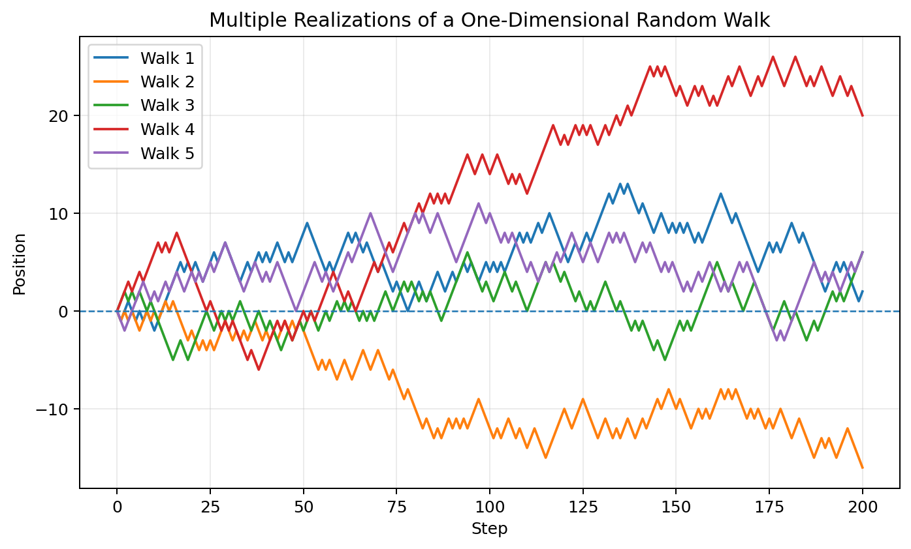
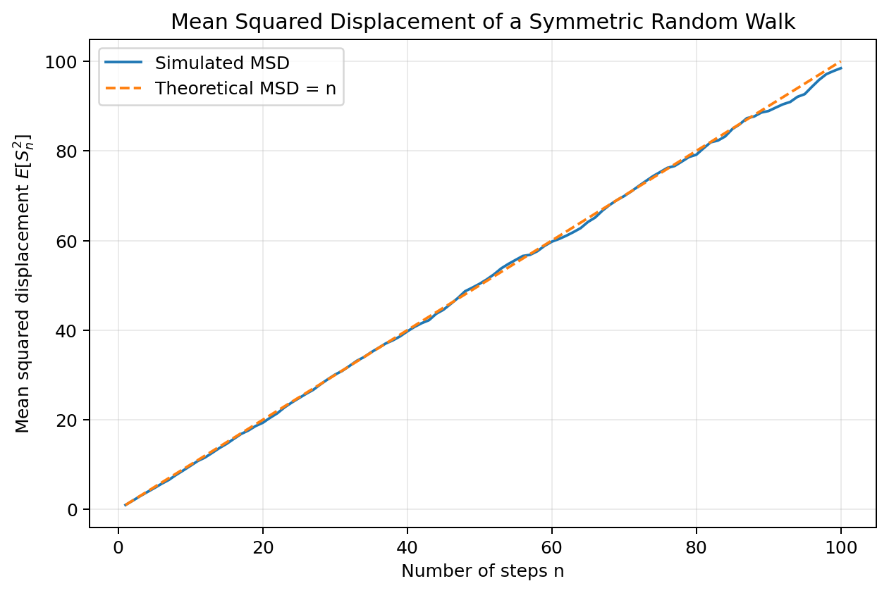
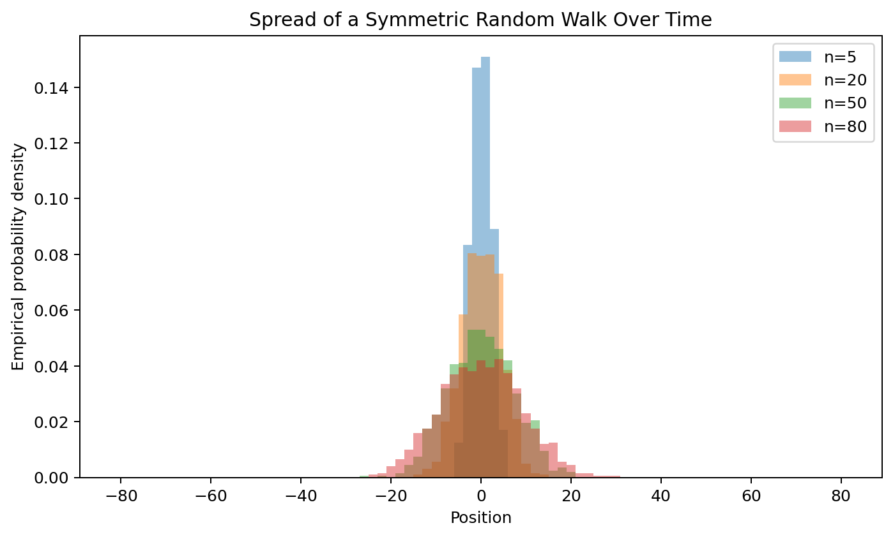
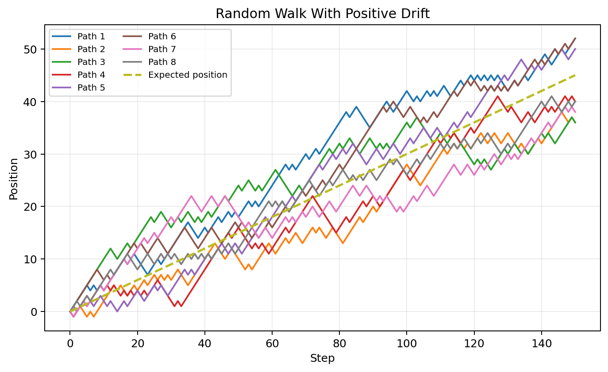
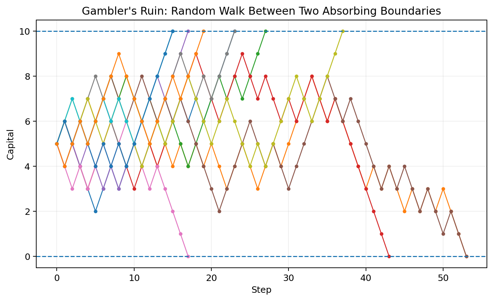
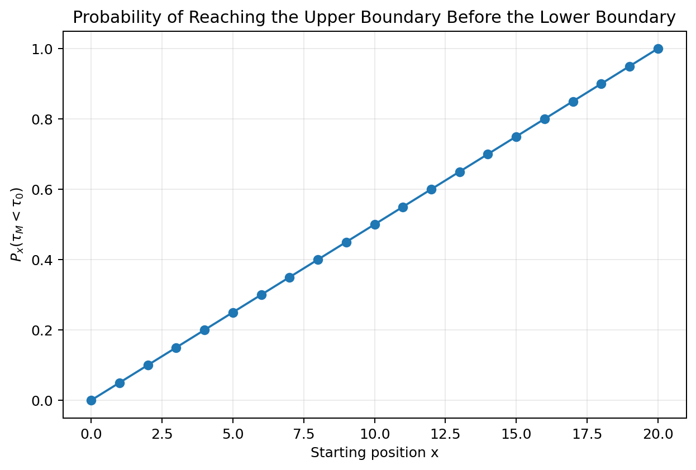
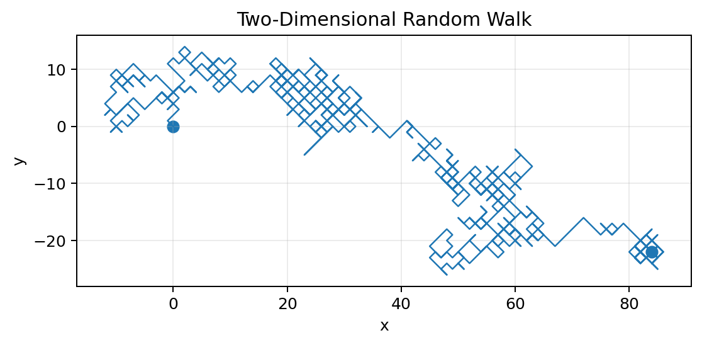
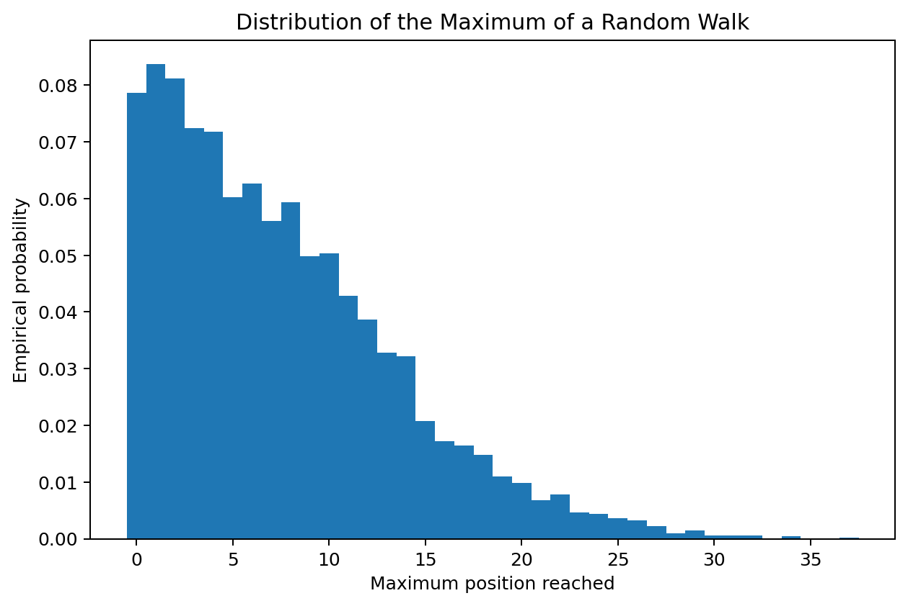

# :classical_building: Mathematics for IT Course - M.Tech. 1st Semester, IIIT Allahabad
## Unit 4: Stochastic Processes and Random Models
* ### Current Topic: Random Walks and Their Applications
* #### Random walks, their mathematical foundations, important properties, hitting times, gambler's ruin, multidimensional random walks, random walks with drift, and applications in probability, statistics, physics, computer science, and finance.
---
## 👥 Instructor Information
* **Edited by Instructor:** [Dr. Mohammed Javed](https://sites.google.com/site/mohammedjaved2016/)
* **Email:** javed@iiita.ac.in
* **Teaching Assistants:** Mr. Apurba Chakraborty (rsi2024005@iiita.ac.in)
---
## 🎯 Learning Objectives

After studying this chapter, you should be able to:

- explain what a random walk is;
- construct and simulate a one-dimensional random walk;
- distinguish symmetric random walks from biased random walks;
- derive the mean and variance of a random walk;
- understand the relationship between random walks and diffusion;
- analyze hitting times and first-passage problems;
- explain the gambler's ruin problem;
- understand recurrence and transience at an introductory level;
- simulate two-dimensional random walks;
- identify practical applications of random walks;
- implement random-walk models using Python.

---

# 1. Introduction

A **random walk** is a mathematical model for movement produced by a sequence of random steps.

A simple one-dimensional random walk can be written as:

$$
S_n=X_1+X_2+\cdots+X_n,
$$

where the increments $(X_1,X_2,\ldots)$ are random variables.

For the classical symmetric random walk:

$$
P(X_i=+1)=\frac12
$$

and:

$$
P(X_i=-1)=\frac12.
$$

The process starts at:

$$
S_0=0.
$$

At every step, it moves one unit either to the right or to the left.



The important point is that the individual steps are random, but the collection of steps produces patterns that can be studied mathematically.

---

# 2. The Basic One-Dimensional Random Walk

Let:

$$
X_i=
\begin{cases}
+1,&\text{with probability }p,\\
-1,&\text{with probability }1-p.
\end{cases}
$$

Then:

$$
\boxed{
S_n=\sum_{i=1}^{n}X_i
}
$$

is a random walk.

When:

$$
p=\frac12,
$$

we call it a **symmetric random walk**.

When:

$$
p\ne\frac12,
$$

we call it a **biased** or **drifted random walk**.

---

# 3. Random Walk as a Stochastic Process

The sequence:

$$
S_0,S_1,S_2,\ldots
$$

is a stochastic process.

The update equation is:

$$
\boxed{
S_{n+1}=S_n+X_{n+1}.
}
$$

For a symmetric random walk:

$$
S_{n+1}=
\begin{cases}
S_n+1,&\frac12,\\
S_n-1,&\frac12.
\end{cases}
$$

Thus, a random walk is one of the simplest examples of a discrete-time stochastic process.

---

# 4. Simulating a Random Walk in Python

```python
import numpy as np
import matplotlib.pyplot as plt

rng = np.random.default_rng(42)

n = 200

steps = rng.choice([-1, 1], size=n)
position = np.concatenate([[0], np.cumsum(steps)])

plt.plot(position)
plt.axhline(0, linestyle="--")
plt.xlabel("Step")
plt.ylabel("Position")
plt.title("A Simple Random Walk")
plt.show()
```

The code:

1. generates random steps;
2. computes cumulative sums;
3. obtains the position after each step;
4. plots the path.

---

# 5. Why Random Walks Are Important

Random walks are important because they provide simple models for complicated random phenomena.

They appear in:

- particle motion;
- diffusion;
- population movement;
- financial models;
- search algorithms;
- network analysis;
- queueing systems;
- genetics;
- statistical physics;
- reinforcement learning;
- Monte Carlo methods.

A surprisingly large number of stochastic models can be understood as extensions of the basic random walk.

---

# 6. Expected Value of a Random Walk

For:

$$
X_i\in\{-1,+1\}
$$

with:

$$
P(X_i=+1)=p,
$$

we have:

$$
E[X_i]=
(+1)p+(-1)(1-p).
$$

Therefore:

$$
E[X_i]=2p-1.
$$

Since:

$$
S_n=\sum_{i=1}^{n}X_i,
$$

linearity of expectation gives:

$$
E[S_n]=
\sum_{i=1}^{n}E[X_i].
$$

Hence:

$$
\boxed{
E[S_n]=n(2p-1).
}
$$

For the symmetric case $(p=1/2)$:

$$
\boxed{
E[S_n]=0.
}
$$

---

# 7. Variance of a Random Walk

For one step:

$$
X_i^2=1.
$$

Therefore:

$$
E[X_i^2]=1.
$$

The variance is:

$$
\text{Var}(X_i)=
E[X_i^2]-E[X_i]^2.
$$

Thus:

$$
\boxed{
\text{Var}(X_i)=1-(2p-1)^2=4p(1-p).
}
$$

If the steps are independent:

$$
\text{Var}(S_n)=
\sum_{i=1}^{n}\text{Var}(X_i).
$$

Therefore:

$$
\boxed{
\text{Var}(S_n)=4np(1-p).
}
$$

For a symmetric random walk:

$$
\boxed{
\text{Var}(S_n)=n.
}
$$

---

# 8. Standard Deviation and Typical Distance

For the symmetric random walk:

$$
\text{Var}(S_n)=n.
$$

Therefore:

$$
\boxed{
\text{SD}(S_n)=\sqrt n.
}
$$

This is a fundamental result.

After $(n)$ steps, the typical displacement from the starting point is of order:

$$
\boxed{\sqrt n}
$$

rather than $(n)$.

For example:

- 100 steps → typical displacement is about 10;
- 10,000 steps → typical displacement is about 100;
- 1,000,000 steps → typical displacement is about 1,000.

---

# 9. Mean Squared Displacement

For a symmetric random walk:

$$
E[S_n]=0
$$

and:

$$
\text{Var}(S_n)=n.
$$

Thus:

$$
E[S_n^2]=n.
$$

The quantity:

$$
\boxed{
E[S_n^2]
}
$$

is called the **mean squared displacement (MSD)** when the walk starts at zero.

It grows linearly with time:

$$
\boxed{
\text{MSD}\propto n.
}
$$



This linear growth is closely connected to diffusion.

---

# 10. Distribution of a Symmetric Random Walk

After $(n)$ steps, the final position must have the same parity as $(n)$.

For example, after 4 steps the possible positions are:

$$
-4,-2,0,2,4.
$$

The probability of being at position $(k)$ is:

$$
\boxed{
P(S_n=k)=
\binom{n}{(n+k)/2}
\left(\frac12\right)^n
}
$$

provided $(n+k)$ is even and $(|k|\le n)$.

Otherwise:

$$
P(S_n=k)=0.
$$

---

# 11. Connection to the Binomial Distribution

Let $(U)$ be the number of $(+1)$ steps.

Then:

$$
U\sim\operatorname{Binomial}\left(n,\frac12\right).
$$

The number of $(-1)$ steps is:

$$
n-U.
$$

Therefore:

$$
S_n=U-(n-U).
$$

So:

$$
\boxed{
S_n=2U-n.
}
$$

This gives a direct connection between random walks and the binomial distribution.

---

# 12. Distribution Spreading Over Time

As the number of steps increases, the probability distribution becomes more spread out.



The standard deviation grows as:

$$
\sqrt n.
$$

For large $(n)$, the distribution can be approximated by a Gaussian distribution.

This is one of the ways the **Central Limit Theorem** appears naturally in random walks.

---

# 13. Random Walk and the Central Limit Theorem

For independent increments with finite mean $(\mu)$ and variance $(\sigma^2)$:

$$
S_n=X_1+\cdots+X_n.
$$

The Central Limit Theorem states that:

$$
\boxed{
\frac{S_n-n\mu}{\sigma\sqrt n}
\Rightarrow N(0,1)
}
$$

as:

$$
n\to\infty.
$$

For a symmetric random walk:

$$
\mu=0,\qquad\sigma^2=1.
$$

Therefore:

$$
\boxed{
\frac{S_n}{\sqrt n}
\Rightarrow N(0,1).
}
$$

Thus, large random walks have approximately Gaussian position distributions after appropriate scaling.

---

# 14. Law of Large Numbers and Random Walks

The average increment is:

$$
\frac{S_n}{n}=
\frac{X_1+\cdots+X_n}{n}.
$$

By the Law of Large Numbers:

$$
\boxed{
\frac{S_n}{n}\to E[X_1]
}
$$

under standard assumptions.

For a symmetric random walk:

$$
\frac{S_n}{n}\to0.
$$

For a biased random walk:

$$
\frac{S_n}{n}\to2p-1.
$$

This quantity is the long-run average step and represents the **drift**.

---

# 15. Random Walk With Drift

If:

$$
p>\frac12,
$$

then:

$$
E[S_n]=n(2p-1)>0.
$$

The walk has a positive drift.

If:

$$
p<\frac12,
$$

it has a negative drift.



The expected path is:

$$
\boxed{
E[S_n]=n(2p-1).
}
$$

The random fluctuations around the expected path typically have size of order:

$$
\sqrt n.
$$

---

# 16. Python: Random Walk With Drift

```python
import numpy as np
import matplotlib.pyplot as plt

rng = np.random.default_rng(42)

n = 150
p = 0.65

steps = rng.choice([-1, 1], size=n, p=[1-p, p])
position = np.concatenate([[0], np.cumsum(steps)])

expected = (2*p - 1) * np.arange(n + 1)

plt.plot(position, label="Random walk")
plt.plot(expected, linestyle="--", label="Expected position")
plt.xlabel("Step")
plt.ylabel("Position")
plt.title("Random Walk With Drift")
plt.legend()
plt.show()
```

---

# 17. Hitting Times

A major question in random-walk theory is:

> When does the walk first reach a particular state?

Define the hitting time of state $(a)$:

$$
\boxed{
\tau_a=\inf\{n\ge0:S_n=a\}.
}
$$

This is called a **first-passage time** or **hitting time**.

Examples:

- time until a stock reaches a threshold;
- time until a particle reaches a boundary;
- time until a queue becomes empty;
- time until a gambler loses all capital.

---

# 18. First Return Time

For a walk starting at zero, the first return time is:

$$
\boxed{
\tau_0^+=
\inf\{n\ge1:S_n=0\}.
}
$$

For a one-dimensional symmetric random walk, the walk returns to zero with probability 1.

However, the expected return time is infinite.

This is an important and subtle property of one-dimensional random walks.

---

# 19. Gambler's Ruin Problem

Consider a gambler whose capital is:

$$
0,1,2,\ldots,M.
$$

At each round:

- capital increases by 1 with probability $(p)$;
- capital decreases by 1 with probability $(1-p)$.

The process stops when the gambler reaches either:

$$
0
$$

or:

$$
M.
$$

These are absorbing boundaries.



The central questions are:

1. What is the probability of reaching $(M)$ before 0?
2. What is the expected time until absorption?

---

# 20. Gambler's Ruin: Symmetric Case

For:

$$
p=\frac12,
$$

and starting at:

$$
X_0=x,
$$

the probability of reaching $(M)$ before 0 is:

$$
\boxed{
P_x(\tau_M<\tau_0)=\frac{x}{M}.
}
$$

For example, if:

$$
M=100,\qquad x=30,
$$

then:

$$
P_x(\tau_M<\tau_0)=0.30.
$$

So the gambler has a 30% chance of reaching the upper boundary first.

---

# 21. Hitting Probability as a Function of Starting Position

For a symmetric random walk between 0 and $(M)$:

$$
h(x)=P_x(\tau_M<\tau_0).
$$

The result:

$$
h(x)=\frac{x}{M}
$$

is linear.



Notice:

$$
h(0)=0
$$

and:

$$
h(M)=1.
$$

The probability varies smoothly between the two boundary conditions.

---

# 22. Gambler's Ruin: Biased Case

When:

$$
p\ne\frac12,
$$

the probability of reaching $(M)$ before 0 is:

$$
\boxed{
P_x(\tau_M<\tau_0)=
\frac{1-\left(\frac{1-p}{p}\right)^x}
{1-\left(\frac{1-p}{p}\right)^M}.
}
$$

When:

$$
p=\frac12,
$$

this formula reduces to:

$$
\frac{x}{M}.
$$

A small advantage in each round can therefore have a large effect on the long-run probability of reaching the upper boundary.

---

# 23. Expected Duration of Gambler's Ruin

For a symmetric walk with boundaries 0 and $(M)$, the expected duration starting at $(x)$ is:

$$
\boxed{
E_x[\tau]=x(M-x).
}
$$

For example, if:

$$
M=100,\qquad x=50,
$$

then:

$$
E_{50}[\tau]=50(50)=2500.
$$

This demonstrates that hitting-time problems can behave very differently from position problems.

---

# 24. Random Walks on Graphs

A random walk does not have to occur on a line.

Suppose a graph has vertices:

$$
V=\{v_1,v_2,\ldots,v_m\}.
$$

At each step, the walker chooses one of the neighboring vertices.

For an unweighted graph:

$$
P(i,j)=
\begin{cases}
1/\deg(i),&\text{if }i\sim j,\\
0,&\text{otherwise}.
\end{cases}
$$

This creates a Markov chain on the graph.

Graph random walks are fundamental in:

- network science;
- web algorithms;
- community detection;
- recommendation systems;
- graph embeddings.

---

# 25. Two-Dimensional Random Walk

A two-dimensional random walk can move:

- up;
- down;
- left;
- right.

For example:

$$
P(\Delta X,\Delta Y)=
\frac14
$$

for each of the four directions.



The walker may wander far from its starting point, but the typical displacement grows much more slowly than the number of steps.

---

# 26. Python: Two-Dimensional Random Walk

```python
import numpy as np
import matplotlib.pyplot as plt

rng = np.random.default_rng(42)

n = 1000

directions = np.array([
    [1, 0],
    [-1, 0],
    [0, 1],
    [0, -1]
])

steps = directions[
    rng.integers(0, 4, size=n)
]

position = np.vstack([
    np.zeros(2),
    np.cumsum(steps, axis=0)
])

plt.plot(position[:, 0], position[:, 1])
plt.scatter(position[0, 0], position[0, 1], label="Start")
plt.scatter(position[-1, 0], position[-1, 1], label="End")
plt.xlabel("x")
plt.ylabel("y")
plt.title("Two-Dimensional Random Walk")
plt.axis("equal")
plt.legend()
plt.show()
```

---

# 27. Random Walks and Diffusion

Random walks provide a microscopic model for diffusion.

Imagine a particle that randomly moves left or right.

At the microscopic level:

$$
S_{n+1}=S_n+X_{n+1}.
$$

At a macroscopic level, the probability density becomes smoother and spreads over time.

The diffusion equation is:

$$
\boxed{
\frac{\partial u}{\partial t}=
D\frac{\partial^2u}{\partial x^2}.
}
$$

The connection between random walks and diffusion is one of the foundational ideas of stochastic modeling.

---

# 28. Random Walk Maximum

Another important quantity is:

$$
M_n=\max_{0\le k\le n}S_k.
$$

It records the largest position reached by the walk.

Questions involving $(M_n)$ appear in:

- barrier crossing;
- finance;
- reliability;
- sequential testing;
- queueing;
- risk analysis.



---

# 29. Recurrence and Transience

A state is **recurrent** if the process returns to it with probability 1.

A state is **transient** if there is a positive probability that the process never returns.

For simple random walks:

- one-dimensional symmetric random walk → recurrent;
- two-dimensional symmetric random walk → recurrent;
- three-dimensional symmetric random walk → transient.

This difference is one of the most famous results in random-walk theory.

---

# 30. Why Dimension Matters

In one dimension, a random walker repeatedly crosses the same locations.

In two dimensions, there are more possible directions, but the walk still returns to the origin with probability 1.

In three dimensions and higher, the walker has enough space to escape.

Thus:

$$
\boxed{
\text{Recurrence depends strongly on dimension.}
}
$$

This phenomenon has connections to potential theory, electrical networks, and statistical physics.

---

# 31. Random Walk as a Markov Chain

A random walk is also a Markov chain.

For a one-dimensional symmetric random walk:

$$
P(i,i+1)=\frac12
$$

and:

$$
P(i,i-1)=\frac12.
$$

All other one-step transition probabilities are zero.

Thus:

$$
P(S_{n+1}=j\mid S_n=i,S_{n-1},\ldots)=
P(S_{n+1}=j\mid S_n=i).
$$

The Markov property follows naturally from the independent increments.

---

# 32. Random Walks and Martingales

For a symmetric random walk:

$$
E[S_{n+1}\mid S_n]=S_n.
$$

Therefore:

$$
\boxed{
S_n
}
$$

is a martingale with respect to its natural filtration.

This means that, given the current position, the conditional expected next position equals the current position.

Martingale theory provides powerful tools for studying:

- stopping times;
- gambling systems;
- fair games;
- financial models;
- stochastic processes.

---

# 33. Optional Stopping and Random Walks

The **optional stopping theorem** connects martingales and stopping times.

Under suitable technical conditions, if:

$$
S_n
$$

is a martingale and $(\tau)$ is a suitable stopping time, then:

$$
\boxed{
E[S_\tau]=E[S_0].
}
$$

This helps derive results for problems such as gambler's ruin.

However, the conditions matter. One should not apply optional stopping automatically to every unbounded stopping time.

---

# 34. Random Walks in Finance

A basic model for a price process is:

$$
P_{n+1}=P_n+\mu+\epsilon_{n+1},
$$

where:

- $(\mu)$ is a drift term;
- $(\epsilon_{n+1})$ is random noise.

A multiplicative model can instead be written:

$$
P_{n+1}=P_n e^{\mu+\sigma Z_{n+1}}.
$$

Random-walk ideas are useful for understanding:

- price changes;
- volatility;
- first-passage events;
- barrier options;
- risk models.

Real financial markets are more complicated than simple random walks, but random walks provide an important starting point.

---

# 35. Random Walks in Computer Science

Random walks are used in algorithms and data structures.

Examples include:

### PageRank

A random surfer moves between web pages.

### Graph search

A random walk can explore a network.

### Randomized algorithms

Randomness can help avoid worst-case deterministic behavior.

### Markov Chain Monte Carlo

A Markov chain is constructed so that its long-run distribution is the desired target distribution.

### Graph embeddings

Random-walk sequences can be used to learn representations of graph nodes.

---

# 36. Random Walks in Population Genetics

Random walks can model changes in genetic quantities.

For example, allele frequencies can fluctuate because of random sampling.

A simple model may represent:

$$
X_{n+1}=X_n+\text{random change}.
$$

More realistic population-genetic models include:

- Wright-Fisher processes;
- Moran processes;
- branching processes.

These models use random movement in state space to represent biological uncertainty.

---

# 37. Random Walks in Statistical Physics

Random walks help model:

- molecular motion;
- diffusion;
- polymers;
- particle transport;
- thermal fluctuations.

A random walk is often used as a microscopic model of a particle repeatedly receiving random kicks.

When the number of steps becomes large, continuum approximations lead to diffusion equations and Brownian motion.

---

# 38. Python: Many Random Walks

Simulating many paths provides a better view of the distribution than a single path.

```python
import numpy as np
import matplotlib.pyplot as plt

rng = np.random.default_rng(42)

n_walks = 100
n_steps = 300

steps = rng.choice(
    [-1, 1],
    size=(n_walks, n_steps)
)

positions = np.cumsum(steps, axis=1)

for i in range(n_walks):
    plt.plot(
        np.arange(1, n_steps + 1),
        positions[i],
        alpha=0.15
    )

plt.xlabel("Step")
plt.ylabel("Position")
plt.title("Many Simulated Random Walks")
plt.show()
```

---

# 39. Python: Compare Simulation With Theory

For a symmetric random walk:

$$
E[S_n^2]=n.
$$

We can verify this experimentally.

```python
import numpy as np
import matplotlib.pyplot as plt

rng = np.random.default_rng(42)

n_walks = 3000
n_steps = 100

steps = rng.choice(
    [-1, 1],
    size=(n_walks, n_steps)
)

positions = np.cumsum(steps, axis=1)

msd = np.mean(positions**2, axis=0)

n = np.arange(1, n_steps + 1)

plt.plot(n, msd, label="Simulation")
plt.plot(n, n, linestyle="--", label="Theory: E[S_n²] = n")

plt.xlabel("Step n")
plt.ylabel("Mean squared displacement")
plt.title("Random Walk: Simulation vs Theory")
plt.legend()
plt.show()
```

---

# 40. Random Walks and Monte Carlo Simulation

Random walks can also be used for numerical estimation.

For example, a random walk can explore a state space and generate samples.

This idea is central to **Markov Chain Monte Carlo (MCMC)**.

A random-walk Metropolis algorithm proposes:

$$
Y=X+\epsilon
$$

where:

$$
\epsilon\sim N(0,\sigma^2).
$$

The proposal is then accepted or rejected according to a probability designed to make the desired target distribution stationary.

---

# 41. Random Walk Metropolis: Conceptual Python Example

```python
import numpy as np

rng = np.random.default_rng(42)

n = 10000
x = 0.0
samples = []

for _ in range(n):
    proposal = x + rng.normal(0, 1)

    # Standard normal target density ratio
    ratio = np.exp(
        -0.5 * (proposal**2 - x**2)
    )

    acceptance = min(1, ratio)

    if rng.random() < acceptance:
        x = proposal

    samples.append(x)

samples = np.array(samples)

print("Estimated mean:", samples.mean())
print("Estimated variance:", samples.var())
```

For a sufficiently long and well-tuned chain, the samples approximately follow a standard normal distribution.

---

# 42. Random Walks and Search

Suppose an agent needs to explore an unknown environment.

A random walk can provide a simple exploration strategy.

At each time step:

$$
X_{n+1}=X_n+\Delta_n.
$$

The random direction prevents the agent from following a deterministic path.

Applications include:

- exploration algorithms;
- robotics;
- network exploration;
- search problems;
- optimization heuristics.

More advanced algorithms modify the random walk to improve efficiency.

---

# 43. Random Walks and Queueing

Suppose $(Q_n)$ is the number of customers in a queue.

A simplified model might be:

$$
Q_{n+1}=Q_n+A_n-D_n,
$$

where:

- $(A_n)$ is the number of arrivals;
- $(D_n)$ is the number of departures.

In a very simple model, the queue length can behave like a random walk with reflecting or absorbing boundaries.

This gives a connection between random walks and queueing theory.

---

# 44. Boundaries and Constrained Random Walks

Real systems often have restrictions.

Examples:

- a bank balance cannot fall below zero;
- a queue length cannot be negative;
- a population cannot be negative;
- an inventory level may have a maximum capacity.

A random walk with boundaries can therefore be modeled using:

- absorbing boundaries;
- reflecting boundaries;
- partially reflecting boundaries;
- state-dependent transition probabilities.

The boundary behavior can dramatically change the long-run properties of the process.

---

# 45. Random Walk With a Reflecting Boundary

Suppose the position cannot become negative.

At position 0:

- a proposed step to $(-1)$ is reflected back;
- or the walker remains at 0.

This creates a constrained random walk.

Such models are useful for:

- queue lengths;
- inventory;
- storage systems;
- population models.

---

# 46. Important Quantities in Random-Walk Analysis

When analyzing a random walk, common quantities include:

### Position

$$
S_n.
$$

### Maximum

$$
M_n=\max_{k\le n}S_k.
$$

### Minimum

$$
m_n=\min_{k\le n}S_k.
$$

### Hitting time

$$
\tau_a=\inf\{n:S_n=a\}.
$$

### First return time

$$
\tau_0^+=\inf\{n\ge1:S_n=0\}.
$$

### Displacement

$$
S_n-S_0.
$$

### Mean squared displacement

$$
E[(S_n-S_0)^2].
$$

These quantities provide different perspectives on the behavior of the walk.

---

# 47. Summary of Symmetric Random Walk Properties

For:

$$
S_n=X_1+\cdots+X_n
$$

with:

$$
P(X_i=+1)=P(X_i=-1)=\frac12,
$$

we have:

### Mean

$$
\boxed{
E[S_n]=0
}
$$

### Variance

$$
\boxed{
\operatorname{Var}(S_n)=n
}
$$

### Standard deviation

$$
\boxed{
\operatorname{SD}(S_n)=\sqrt n
}
$$

### Mean squared displacement

$$
\boxed{
E[S_n^2]=n
}
$$

### Scaled limiting distribution

$$
\boxed{
\frac{S_n}{\sqrt n}\Rightarrow N(0,1)
}
$$

These formulas are among the most important results for the basic random walk.

---

# 48. Common Misconceptions

### Misconception 1: A random walk has no structure.

False.

Individual steps are random, but quantities such as mean, variance, hitting probabilities, and long-run behavior can be analyzed precisely.

### Misconception 2: A symmetric random walk stays near zero.

Not necessarily.

Its expected position is zero, but its typical displacement grows as:

$$
\sqrt n.
$$

### Misconception 3: Random walk means the position is uniformly distributed.

False.

The distribution depends on the number of steps and the step mechanism.

### Misconception 4: Positive drift means every path moves upward.

False.

A positive drift means the **expected** position increases. Individual paths can still move downward for long periods.

### Misconception 5: Hitting a target is guaranteed.

Not always.

The probability of hitting a target depends on dimension, drift, boundaries, and the target location.

---

# 49. Practice Questions

1. Define a random walk.
2. What is a symmetric random walk?
3. What is a biased random walk?
4. Derive $(E[S_n])$ for a random walk with $(P(X_i=1)=p)$.
5. Derive $(\operatorname{Var}(S_n))$.
6. Why does the standard deviation of a symmetric random walk grow as $(\sqrt n)$?
7. What is mean squared displacement?
8. Explain the relationship between a random walk and the binomial distribution.
9. Explain how the Central Limit Theorem applies to random walks.
10. Define a hitting time.
11. What is the gambler's ruin problem?
12. Derive the probability of reaching $(M)$ before 0 for a symmetric walk.
13. What changes when the random walk has drift?
14. Explain recurrence and transience.
15. Why does dimension matter for recurrence?
16. Simulate 100 random walks in Python.
17. Verify experimentally that $(E[S_n^2]\approx n)$.
18. Simulate a two-dimensional random walk.
19. Simulate a gambler's ruin process.
20. Estimate a hitting probability using Monte Carlo simulation.
21. Explain how random walks are used in finance.
22. Explain how random walks are used in graph algorithms.
23. Explain the connection between random walks and diffusion.
24. Explain why a symmetric random walk is a martingale.

---

# 50. Key Formulas at a Glance

For:

$$
X_i=
\begin{cases}
+1,&p\\
-1,&1-p
\end{cases}
$$

and:

$$
S_n=\sum_{i=1}^nX_i,
$$

the key formulas are:

### Mean

$$
\boxed{
E[S_n]=n(2p-1)
}
$$

### Variance

$$
\boxed{
\operatorname{Var}(S_n)=4np(1-p)
}
$$

### Symmetric walk

$$
\boxed{
E[S_n]=0,\qquad
\operatorname{Var}(S_n)=n
}
$$

### Standard deviation

$$
\boxed{
\operatorname{SD}(S_n)=\sqrt n
}
$$

### Mean squared displacement

$$
\boxed{
E[S_n^2]=n
}
$$

for the symmetric walk.

### Hitting probability, symmetric gambler's ruin

$$
\boxed{
P_x(\tau_M<\tau_0)=\frac{x}{M}
}
$$

### Hitting probability, biased gambler's ruin

$$
\boxed{
P_x(\tau_M<\tau_0)=
\frac{1-\left(\frac{1-p}{p}\right)^x}
{1-\left(\frac{1-p}{p}\right)^M}
}
$$

for $(p\ne1/2)$.

### Expected duration, symmetric gambler's ruin

$$
\boxed{
E_x[\tau]=x(M-x)
}
$$

---

# 51. Final Takeaway

A random walk is a simple model with a powerful mathematical structure.

Starting with:

$$
S_{n+1}=S_n+X_{n+1},
$$

we can study:

- expected position;
- variance;
- diffusion;
- hitting probabilities;
- first-passage times;
- recurrence;
- boundaries;
- long-run behavior;
- multidimensional movement.

The most important intuition is:

$$
\boxed{
\text{Random individual steps}
\quad\Longrightarrow\quad
\text{predictable statistical behavior}.
}
$$

For a symmetric random walk:

$$
\boxed{
\text{typical displacement}\sim\sqrt n,
}
$$

while for a walk with drift:

$$
\boxed{
E[S_n]\sim n(2p-1).
}
$$

Random walks therefore form a bridge between elementary probability and advanced topics such as Brownian motion, stochastic processes, Markov chains, diffusion equations, martingales, Monte Carlo methods, and financial mathematics.

---

---
## ❓: CHALLENGING Questions - Check Your Understanding 
* ➡️ **[Q-01]**
* ➡️ 

---
## 📚 References 
* **[R-01]** Linear Algebra by Gilbert Strang, MIT Press
* **[R-02]** ChatGPT - for examples and codes
