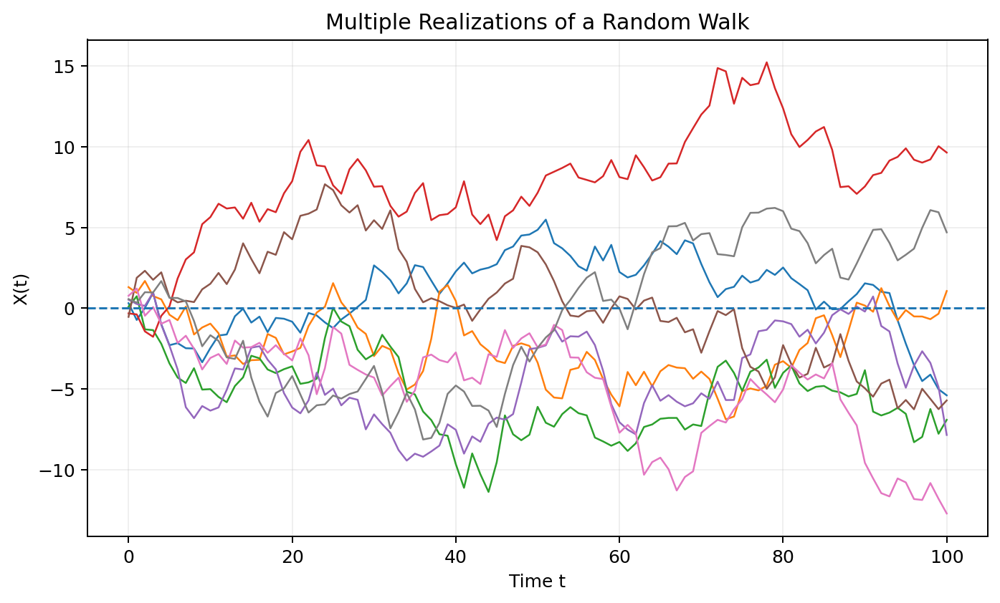
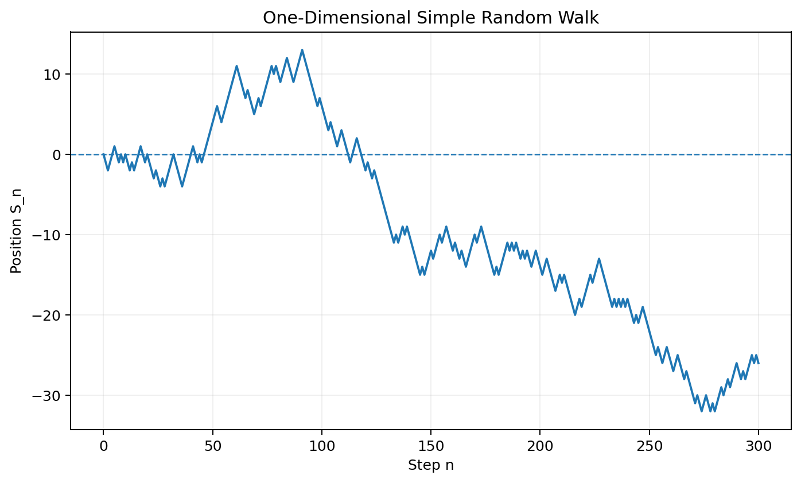
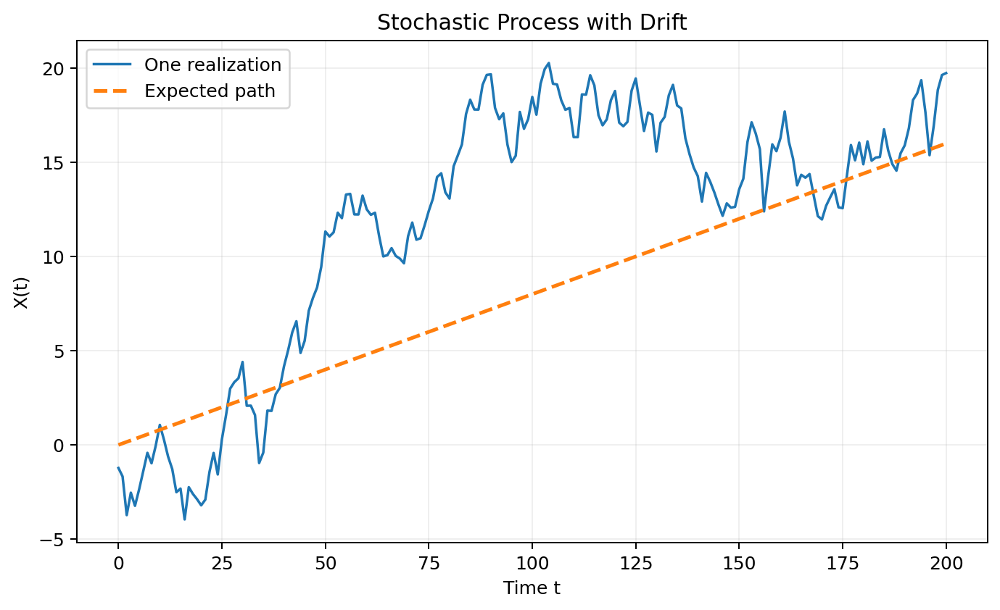
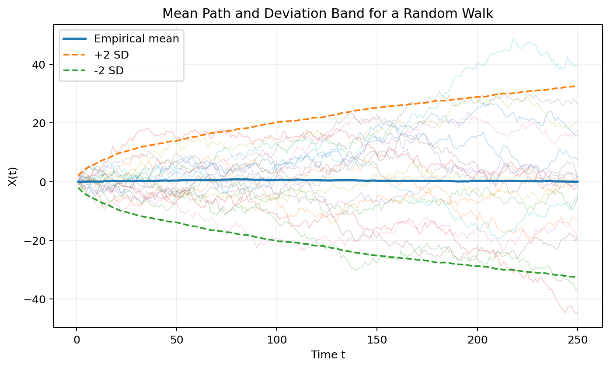
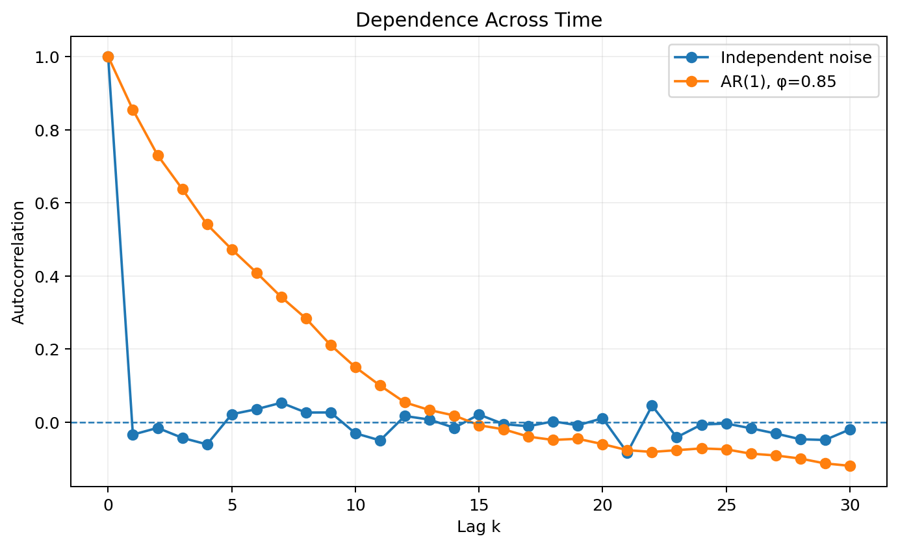
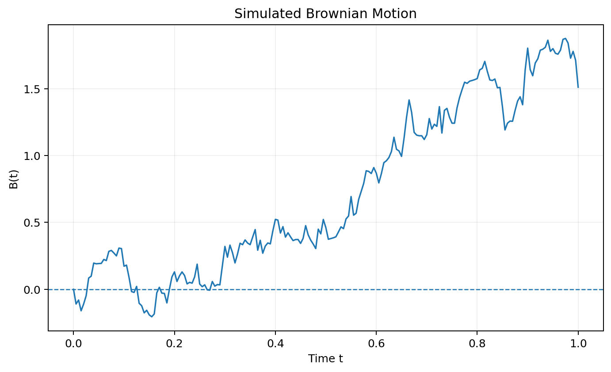
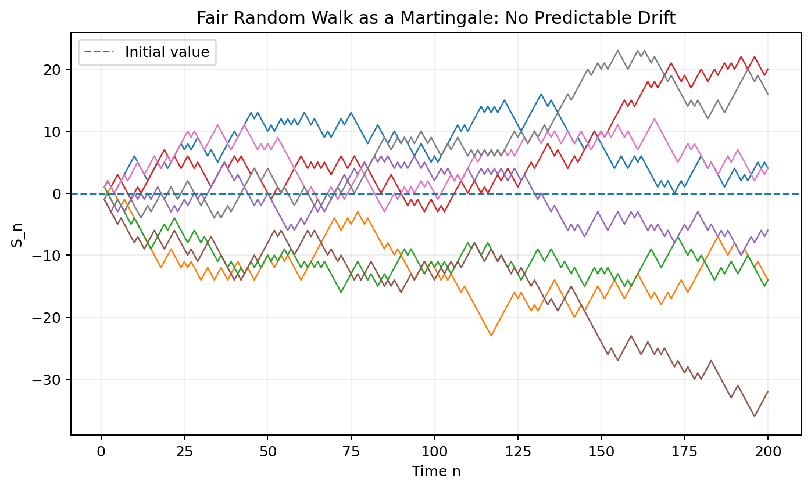
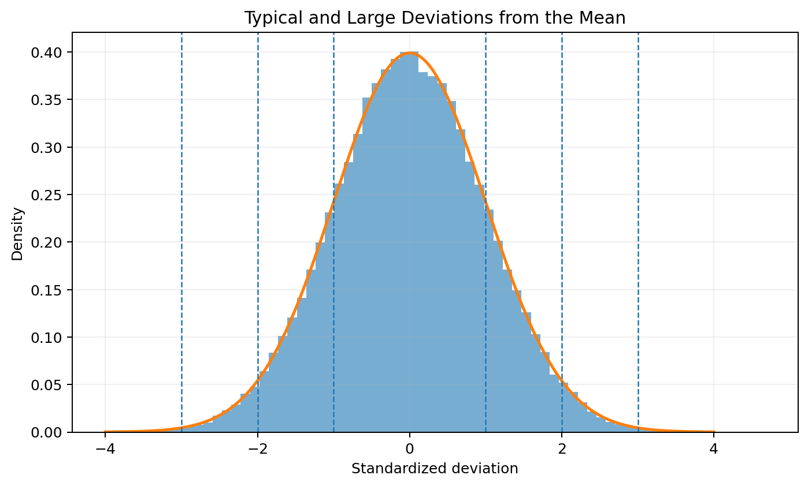

# :classical_building: Mathematics for IT Course - M.Tech. 1st Semester, IIIT Allahabad
## Unit 4: Stochastic Processes and Random Models
* ### Current Topic: Stochastic Processes and Deviations 
* #### introduction to stochastic processes, random walks, dependence across time, deviations from expected behavior, martingales, Brownian motion, and the basic ideas behind concentration and large deviations
---
## 👥 Instructor Information
* **Edited by Instructor:** [Dr. Mohammed Javed](https://sites.google.com/site/mohammedjaved2016/)
* **Email:** javed@iiita.ac.in
* **Teaching Assistants:** Mr. Apurba Chakraborty (rsi2024005@iiita.ac.in)
---
## 🎯 Learning Objectives
After completing this chapter, you should be able to:

- define a stochastic process and distinguish it from a single random variable;
- understand **time index**, **state space**, and **sample paths**;
- explain finite-dimensional distributions and dependence across time;
- understand random walks and Brownian motion;
- distinguish drift, fluctuation, and deviation;
- define variance and standard deviation of a process at a fixed time;
- understand autocovariance and autocorrelation;
- explain the basic idea of martingales;
- understand why large deviations are important;
- simulate basic stochastic processes using Python.

---

# 1. What Is a Stochastic Process?

A **stochastic process** is a collection of random variables indexed by time or another parameter.

We write:

\[
\boxed{\{X_t:t\in T\}}
\]

where:

- \(t\) is the index, often time;
- \(X_t\) is a random variable representing the state of the system at time \(t\);
- \(T\) is the index set.

For discrete time:

\[
X_0,X_1,X_2,\ldots
\]

For continuous time:

\[
\{X(t):t\ge0\}.
\]

The key idea is:

> A stochastic process describes how a random quantity evolves over time.

Examples include:

- daily stock prices;
- queue length at a service center;
- number of customers arriving by time \(t\);
- temperature measurements;
- signal noise;
- particle motion;
- population dynamics.

---

# 2. Random Variable vs. Stochastic Process

A random variable represents **one random quantity**.

A stochastic process represents **a sequence or collection of random quantities**.

For example:

\[
X=\text{tomorrow's temperature}
\]

is a random variable.

But:

\[
X_t=\text{temperature at time }t
\]

is a stochastic process.

A useful mental model is:

```text
Random variable:
        X
        |
        v
    One outcome

Stochastic process:
        X0 ---- X1 ---- X2 ---- X3 ---- ...
         |       |       |       |
       random  random  random  random
       state   state   state   state
```

---

# 3. Time and State Space

A stochastic process has two important components.

## Time index

The process can be indexed by:

- discrete time: \(t=0,1,2,\ldots\);
- continuous time: \(t\ge0\).

## State space

The possible values of \(X_t\).

Examples:

| Process | Time | State |
|---|---|---|
| Daily stock return | Discrete | Real numbers |
| Number of customers | Discrete | \(0,1,2,\ldots\) |
| Brownian motion | Continuous | Real numbers |
| Weather category | Discrete | Finite set |
| Queue length | Discrete | Nonnegative integers |

---

# 4. Realizations and Sample Paths

A stochastic process can produce many possible outcomes.

A **realization**, or **sample path**, is one particular outcome of the entire process.



The figure shows several possible paths generated by the same random mechanism.

For a fixed \(t\), \(X_t\) is a random variable.

After a particular realization is observed, the value at every time becomes a number.

Thus:

\[
\boxed{
\text{Process} \rightarrow \text{collection of possible sample paths}
}
\]

---

# 5. Example: Simple Random Walk

One of the most important stochastic processes is the **simple random walk**.

Let:

\[
Y_1,Y_2,\ldots
\]

be independent random variables with:

\[
P(Y_i=1)=P(Y_i=-1)=\frac12.
\]

Define:

\[
\boxed{
S_n=\sum_{i=1}^{n}Y_i
}
\]

with:

\[
S_0=0.
\]

At every step, the process moves:

- one unit to the right with probability \(1/2\);
- one unit to the left with probability \(1/2\).



---

# 6. Mean and Variance of a Random Walk

Since:

\[
E[Y_i]=0,
\]

we have:

\[
E[S_n]
=
\sum_{i=1}^{n}E[Y_i]
=
0.
\]

Therefore:

\[
\boxed{E[S_n]=0}
\]

For the variance:

\[
Var(Y_i)=1.
\]

Because the increments are independent:

\[
Var(S_n)=\sum_{i=1}^{n}Var(Y_i)=n.
\]

Therefore:

\[
\boxed{Var(S_n)=n}
\]

and:

\[
\boxed{SD(S_n)=\sqrt n}.
\]

So the typical size of the random walk's deviation from zero grows like \(\sqrt n\).

---

# 7. Python: Simulating a Random Walk

```python
import numpy as np
import matplotlib.pyplot as plt

rng = np.random.default_rng(42)

n = 300

steps = rng.choice([-1, 1], size=n)
walk = np.concatenate([[0], np.cumsum(steps)])

plt.plot(walk)
plt.axhline(0, linestyle="--")
plt.xlabel("Step")
plt.ylabel("Position")
plt.title("Simple Random Walk")
plt.show()
```

---

# 8. Expected Value of a Stochastic Process

For a process \(\{X_t\}\), its **mean function** is:

\[
\boxed{
m(t)=E[X_t]
}
\]

This tells us the expected value at each time.

For a random walk:

\[
m(n)=0.
\]

For a process with deterministic drift \(\mu\):

\[
X_t=\mu t+\text{random fluctuation},
\]

the expected path is:

\[
\boxed{
E[X_t]=\mu t.
}
\]



---

# 9. Deviations from the Mean

A useful way to study a stochastic process is to separate:

\[
\text{value}=
\text{expected value}+
\text{deviation}.
\]

Define the deviation:

\[
\boxed{
D_t=X_t-E[X_t].
}
\]

Then:

\[
E[D_t]=0.
\]

The deviation measures how far the process is from its expected value at a particular time.

For a process with mean \(m(t)\):

\[
\boxed{
D_t=X_t-m(t).
}
\]

---

# 10. Variability and Deviation

The variance at time \(t\) is:

\[
\boxed{
Var(X_t)=E[(X_t-E[X_t])^2].
}
\]

The standard deviation is:

\[
\boxed{
SD(X_t)=\sqrt{Var(X_t)}.
}
\]

A common visualization is an expected path surrounded by deviation bands.



The bands illustrate the increasing uncertainty around the expected path.

---

# 11. Mean, Variance, and Covariance Functions

For a stochastic process, the mean is not just one number.

### Mean function

\[
\boxed{
m(t)=E[X_t]
}
\]

### Variance function

\[
\boxed{
v(t)=Var(X_t)
}
\]

### Covariance function

For two times \(s\) and \(t\):

\[
\boxed{
C(s,t)=Cov(X_s,X_t)
}
\]

where:

\[
C(s,t)
=
E[(X_s-m(s))(X_t-m(t))].
\]

The covariance function describes how values at different times vary together.

---

# 12. Autocovariance and Autocorrelation

For a time series or stationary stochastic process, we often examine dependence based on the lag:

\[
k=|t-s|.
\]

The **autocovariance** describes covariance between observations separated by a lag.

The **autocorrelation** is the normalized version:

\[
\boxed{
\rho(k)=
\frac{Cov(X_t,X_{t+k})}
{\sqrt{Var(X_t)Var(X_{t+k})}}
}
\]

For a stationary process:

\[
\rho(k)
\]

depends only on \(k\).



A process with little dependence has autocorrelations near zero for nonzero lags.

A persistent process can retain substantial correlation over many time steps.

---

# 13. Independent Increments

A process has **independent increments** if changes over non-overlapping intervals are independent.

For example:

\[
X_{t_2}-X_{t_1}
\]

and:

\[
X_{t_4}-X_{t_3}
\]

are independent when the intervals do not overlap.

Independent increments are fundamental to:

- random walks;
- Poisson processes;
- Brownian motion;
- many models in finance and physics.

---

# 14. Stationarity

A stochastic process is **stationary** when its statistical properties do not change with time, under the relevant definition of stationarity.

For weak or second-order stationarity:

1. the mean is constant:

\[
E[X_t]=\mu;
\]

2. the variance is constant:

\[
Var(X_t)=\sigma^2;
\]

3. covariance depends only on the lag:

\[
Cov(X_t,X_{t+k})=\gamma(k).
\]

Stationarity is important because it allows us to model temporal dependence using a stable statistical structure.

---

# 15. Brownian Motion

**Brownian motion** is a fundamental continuous-time stochastic process.

A standard Brownian motion \(B(t)\) satisfies:

1. \(B(0)=0\);
2. it has independent increments;
3. for \(0\le s<t\):

\[
B(t)-B(s)\sim N(0,t-s);
\]

4. sample paths are continuous.

In particular:

\[
\boxed{
B(t)\sim N(0,t)
}
\]

so:

\[
E[B(t)]=0
\]

and:

\[
Var(B(t))=t.
\]



---

# 16. Brownian Motion and Random Walk

A random walk has discrete steps.

Brownian motion has continuous time.

A scaled random walk can converge to Brownian motion under an appropriate limiting procedure.

Conceptually:

\[
\boxed{
\text{many small random steps}
\longrightarrow
\text{continuous random motion}
}
\]

This connection is a central idea in probability theory.

---

# 17. Simulating Brownian Motion

For a small time interval \(\Delta t\):

\[
B(t+\Delta t)-B(t)
\sim N(0,\Delta t).
\]

Therefore:

```python
import numpy as np
import matplotlib.pyplot as plt

rng = np.random.default_rng(42)

T = 1
dt = 0.005

t = np.arange(0, T + dt, dt)

increments = rng.normal(
    0,
    np.sqrt(dt),
    size=len(t) - 1
)

B = np.concatenate([[0], np.cumsum(increments)])

plt.plot(t, B)
plt.xlabel("t")
plt.ylabel("B(t)")
plt.title("Simulated Brownian Motion")
plt.show()
```

---

# 18. Martingales

A **martingale** is a stochastic process whose conditional expected future value equals its current value.

Using a filtration \(\mathcal F_t\), the defining condition is:

\[
\boxed{
E[X_{t+1}\mid\mathcal F_t]=X_t.
}
\]

Informally:

> Given everything known so far, the best prediction of the next value is the current value.

A fair random walk is a classic example.



A martingale does not mean that the process stays constant.

It means that there is no predictable gain or loss based on the information currently available.

---

# 19. Deviations and Concentration

A central question in probability is:

> How likely is a random quantity to deviate substantially from its expected value?

For a random variable \(X\), we might study:

\[
P(|X-E[X]|\ge a).
\]

For a stochastic process, we may ask:

\[
P\left(
\sup_{0\le t\le T}|X_t-E[X_t]|\ge a
\right).
\]

These questions are part of **concentration inequalities**, **tail bounds**, and **large deviation theory**.

---

# 20. Chebyshev's Inequality

One of the simplest deviation bounds is Chebyshev's inequality.

For a random variable \(X\) with finite variance:

\[
\boxed{
P(|X-\mu|\ge k\sigma)\le\frac{1}{k^2}.
}
\]

For example, with \(k=2\):

\[
P(|X-\mu|\ge2\sigma)\le\frac14.
\]

The bound is general, although it may be conservative.

---

# 21. Markov's Inequality

For a nonnegative random variable \(X\):

\[
\boxed{
P(X\ge a)\le\frac{E[X]}{a}
}
\]

for \(a>0\).

Markov's inequality is often a starting point for deriving stronger probability bounds.

---

# 22. Large Deviations

The term **large deviation** refers broadly to an event in which a random quantity moves substantially away from its typical or expected behavior.

For sample means:

\[
\bar X_n=\frac1n\sum_{i=1}^{n}X_i,
\]

we may study:

\[
P(\bar X_n\ge\mu+\epsilon).
\]

As \(n\) grows, such events often become increasingly unlikely.

A typical large-deviation form is:

\[
\boxed{
P(\bar X_n\ge a)
\approx e^{-nI(a)}
}
\]

where \(I(a)\) is called a **rate function**.

The exact form of \(I(a)\) depends on the probability model.

---

# 23. Typical vs. Large Deviations

For a standardized Normal variable:

\[
Z\sim N(0,1),
\]

values close to zero are typical.

Values such as:

\[
|Z|>2
\]

are less common, while:

\[
|Z|>3
\]

are rarer.



This illustrates the basic intuition behind tail probabilities and deviations.

---

# 24. Concentration vs. Large Deviations

These ideas are closely related but should not be treated as identical.

### Concentration inequalities

Provide upper bounds such as:

\[
P(|X-E[X]|\ge t)\le B(t).
\]

Examples include:

- Markov's inequality;
- Chebyshev's inequality;
- Hoeffding's inequality;
- Chernoff bounds.

### Large deviation theory

Studies the **asymptotic exponential rate** at which rare-event probabilities decrease as a scale parameter, often \(n\), becomes large.

---

# 25. Hoeffding's Inequality

For independent bounded random variables:

\[
a_i\le X_i\le b_i,
\]

Hoeffding's inequality gives a useful bound on the deviation of the sample mean.

A simplified identical-bound version is:

\[
\boxed{
P(|\bar X_n-E[\bar X_n]|\ge\epsilon)
\le
2\exp\left(
-\frac{2n\epsilon^2}{(b-a)^2}
\right).
}
\]

This demonstrates an important principle:

\[
\boxed{
\text{Large deviations become exponentially less likely as }n\text{ increases.}
}
\]

---

# 26. Deviations of a Random Walk

For a simple symmetric random walk:

\[
S_n=\sum_{i=1}^{n}Y_i,
\]

where \(Y_i\in\{-1,+1\}\), we have:

\[
E[S_n]=0
\]

and:

\[
Var(S_n)=n.
\]

Therefore:

\[
SD(S_n)=\sqrt n.
\]

This means that a typical deviation is of order:

\[
\boxed{\sqrt n}.
\]

Equivalently:

\[
\frac{S_n}{\sqrt n}
\]

has a scale that remains approximately constant as \(n\) grows.

This is an important contrast:

- the random walk itself typically spreads like \(\sqrt n\);
- the average \(S_n/n\) tends toward zero.

---

# 27. Python: Simulating Deviations

```python
import numpy as np
import matplotlib.pyplot as plt

rng = np.random.default_rng(42)

n_paths = 1000
n = 250

steps = rng.normal(0, 1, size=(n_paths, n))
paths = np.cumsum(steps, axis=1)

mean_path = paths.mean(axis=0)
std_path = paths.std(axis=0)

t = np.arange(1, n + 1)

plt.plot(t, mean_path, label="Mean")
plt.plot(t, 2 * std_path, linestyle="--", label="+2 SD")
plt.plot(t, -2 * std_path, linestyle="--", label="-2 SD")

plt.xlabel("Time")
plt.ylabel("Value")
plt.title("Mean and Deviation Scale")
plt.legend()
plt.show()
```

---

# 28. A Process with Drift

Consider:

\[
X_t=\mu t+\sigma W_t,
\]

where \(W_t\) is standard Brownian motion.

Then:

\[
E[X_t]=\mu t
\]

and:

\[
Var(X_t)=\sigma^2t.
\]

Here:

- \(\mu t\) is the deterministic **drift**;
- \(\sigma W_t\) is the random **fluctuation**.

Thus:

\[
\boxed{
X_t=\text{drift}+\text{random deviation}.
}
\]

This model is a basic building block for continuous-time stochastic modeling.

---

# 29. Python: Drift Plus Noise

```python
import numpy as np
import matplotlib.pyplot as plt

rng = np.random.default_rng(42)

n = 200
mu = 0.08
sigma = 1

noise = rng.normal(0, sigma, n)
x = mu * np.arange(n) + np.cumsum(noise)

t = np.arange(n)

plt.plot(t, x, label="Realization")
plt.plot(t, mu * t, linestyle="--", label="Expected path")

plt.xlabel("Time")
plt.ylabel("X(t)")
plt.title("Stochastic Process with Drift")
plt.legend()
plt.show()
```

---

# 30. Applications of Stochastic Processes

Stochastic processes are used in many areas.

## Finance

- asset prices;
- interest rates;
- volatility;
- risk modeling.

## Engineering

- signal noise;
- reliability;
- communication systems;
- control systems.

## Operations Research

- queues;
- inventory;
- customer arrivals;
- service systems.

## Physics

- Brownian motion;
- particle movement;
- thermal fluctuations.

## Biology

- population dynamics;
- epidemics;
- genetic evolution.

## Machine Learning

- Markov models;
- stochastic optimization;
- sequential data;
- reinforcement learning.

---

# 31. Important Types of Stochastic Processes

| Process | Main idea |
|---|---|
| Random walk | Discrete random movement |
| Markov process | Future depends on present state through a Markov property |
| Poisson process | Random event arrivals |
| Brownian motion | Continuous random movement |
| Martingale | Conditional expected future equals current value |
| Stationary process | Statistical behavior stable under time shifts |
| Gaussian process | Every finite collection has a joint Gaussian distribution |

These categories can overlap. For example, Brownian motion is both a Gaussian process and a martingale.

---

# 32. Python: A Small Simulation Toolkit

The following functions can be reused for experiments.

```python
import numpy as np

def simple_random_walk(n, rng=None):
    if rng is None:
        rng = np.random.default_rng()
    steps = rng.choice([-1, 1], size=n)
    return np.concatenate([[0], np.cumsum(steps)])


def brownian_motion(T=1, dt=0.001, rng=None):
    if rng is None:
        rng = np.random.default_rng()

    t = np.arange(0, T + dt, dt)
    increments = rng.normal(
        0,
        np.sqrt(dt),
        size=len(t) - 1
    )

    path = np.concatenate([[0], np.cumsum(increments)])

    return t, path


def drifted_process(n, drift=0.05, noise_std=1, rng=None):
    if rng is None:
        rng = np.random.default_rng()

    noise = rng.normal(0, noise_std, size=n)
    t = np.arange(n)

    path = drift * t + np.cumsum(noise)

    return t, path
```

---

# 33. Conceptual Comparison

| Concept | Question it answers |
|---|---|
| Mean function | What is the expected value at time \(t\)? |
| Variance function | How much variability exists at time \(t\)? |
| Covariance | How do two times vary together? |
| Autocorrelation | How strongly are observations related across a lag? |
| Stationarity | Do statistical properties remain stable over time? |
| Drift | Is there a systematic directional component? |
| Deviation | How far is the process from its expected behavior? |
| Concentration | How unlikely are substantial deviations? |
| Large deviations | How rapidly do rare-event probabilities decay? |
| Martingale | Is there predictable conditional drift? |

---

# 34. Common Misconceptions

### Misconception 1: A stochastic process is just a random variable.

**False.**

A stochastic process is a collection of random variables indexed by time or another parameter.

### Misconception 2: Random means completely independent over time.

**False.**

A stochastic process can have strong temporal dependence.

### Misconception 3: Expected value is the path that must occur.

**False.**

The expected path is an average over possible outcomes. A single realization can deviate substantially from it.

### Misconception 4: A martingale has no randomness.

**False.**

Martingales can fluctuate substantially. Their defining feature is conditional expectation, not absence of randomness.

### Misconception 5: A deviation is always an error.

**False.**

A deviation can simply be the natural random fluctuation around an expected value.

---

# 35. Practice Questions

1. Define a stochastic process.
2. What is a sample path?
3. Explain the difference between discrete-time and continuous-time processes.
4. Define the state space of a process.
5. Construct a simple random walk mathematically.
6. Find \(E[S_n]\) for a symmetric random walk.
7. Find \(Var(S_n)\) for a symmetric random walk.
8. Why does the standard deviation of a random walk grow like \(\sqrt n\)?
9. Define the mean function of a stochastic process.
10. Define the covariance function.
11. What is autocorrelation?
12. Explain stationarity.
13. Define Brownian motion.
14. What is a martingale?
15. Explain the meaning of a deviation from the expected path.
16. State Chebyshev's inequality.
17. Explain the difference between concentration and large deviations.
18. Simulate a random walk in Python.
19. Simulate Brownian motion in Python.
20. Simulate a process with drift and compare it with its expected path.
21. Generate several realizations of a stochastic process and plot them.
22. Calculate and plot empirical autocorrelation for a simulated process.

---

# 36. Figures Included

The `figures/` directory contains:

1. `01_stochastic_process_realizations.png` — multiple realizations of a stochastic process.
2. `02_simple_random_walk.png` — one-dimensional random walk.
3. `03_mean_and_deviation_band.png` — mean path and deviation bands.
4. `04_brownian_motion.png` — simulated Brownian motion.
5. `05_autocorrelation.png` — comparison of independent and temporally dependent processes.
6. `06_martingale_random_walk.png` — fair random walk as a martingale.
7. `07_deviations_from_mean.png` — typical and large deviations.
8. `08_drifted_process.png` — stochastic process with drift and random fluctuations.

All figures are generated specifically for this chapter and referenced using relative paths so that GitHub can render them automatically.

---

# 37. Summary

A stochastic process models the evolution of a random quantity:

\[
\boxed{\{X_t:t\in T\}}
\]

Important concepts include:

- **sample paths** — individual realizations of a process;
- **mean function** — expected behavior over time;
- **variance** — magnitude of random fluctuation;
- **covariance and autocorrelation** — dependence across time;
- **random walks** — discrete random movement;
- **Brownian motion** — continuous random movement;
- **martingales** — processes with no predictable conditional drift;
- **deviations** — differences between observed and expected behavior;
- **concentration** — bounds on the probability of deviations;
- **large deviations** — study of rare events and their asymptotic probabilities.

The central intuition is:

\[
\boxed{
\text{Stochastic process}
=
\text{systematic behavior}
+
\text{random fluctuations}
}
\]

Understanding this decomposition is fundamental to probability, statistics, time-series analysis, finance, engineering, and data science.

---
## ❓: CHALLENGING Questions - Check Your Understanding 
* ➡️ **[Q-01]**
* ➡️ 

---
## 📚 References 
* **[R-01]** Linear Algebra by Gilbert Strang, MIT Press
* **[R-02]** ChatGPT - for examples and codes
