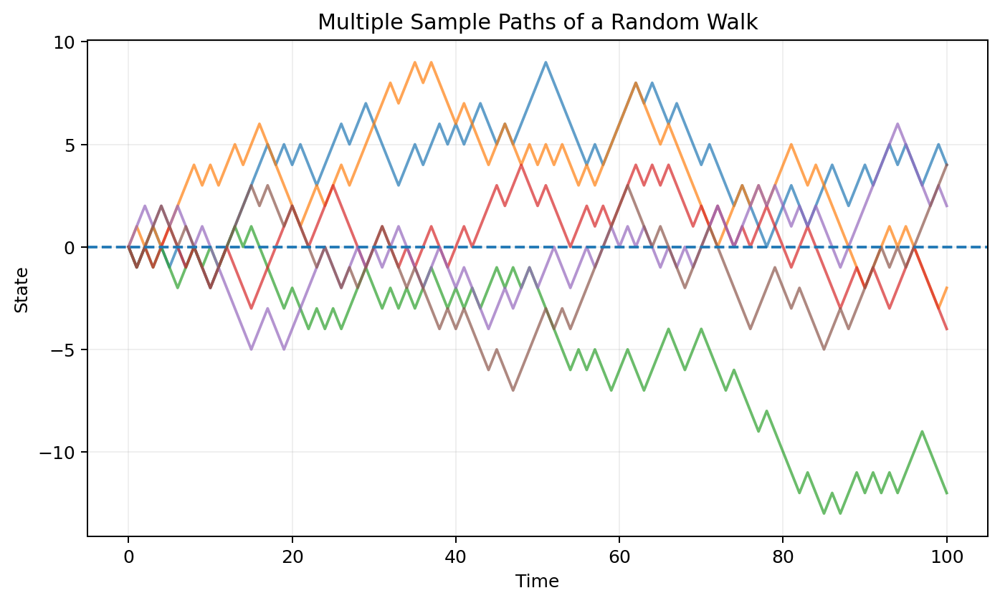
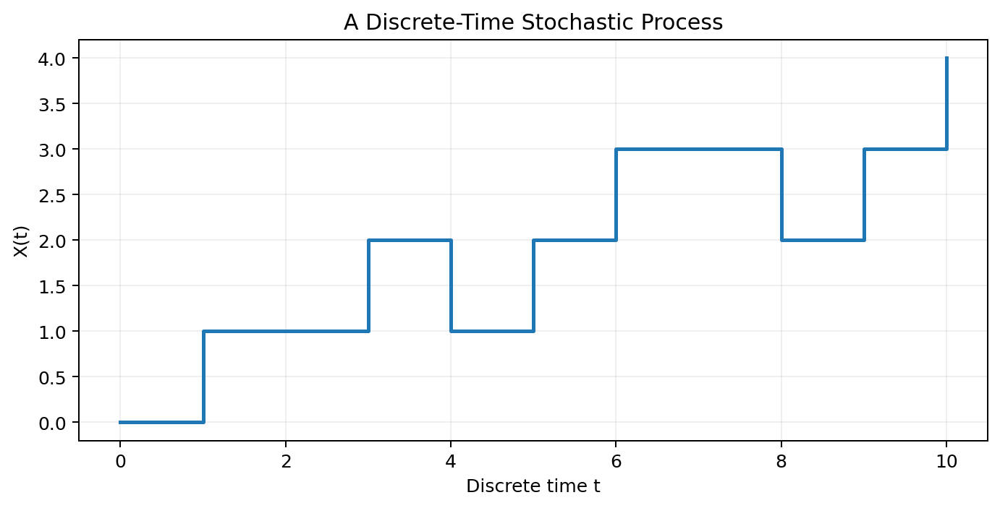
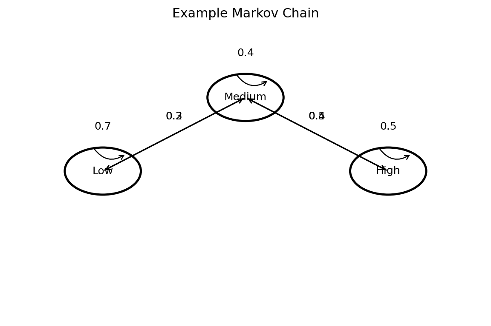
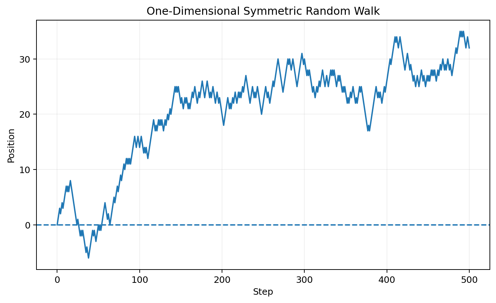
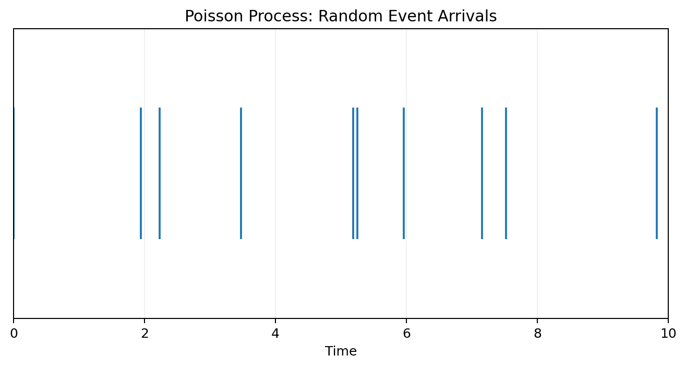
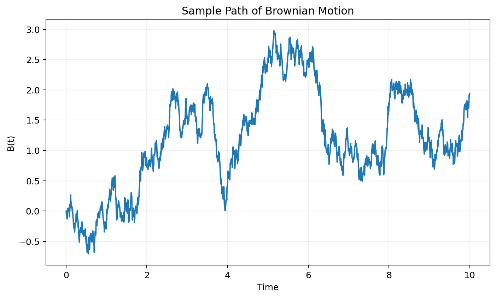
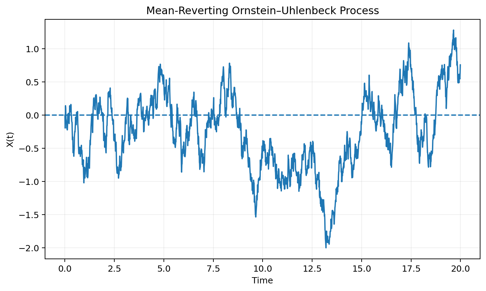
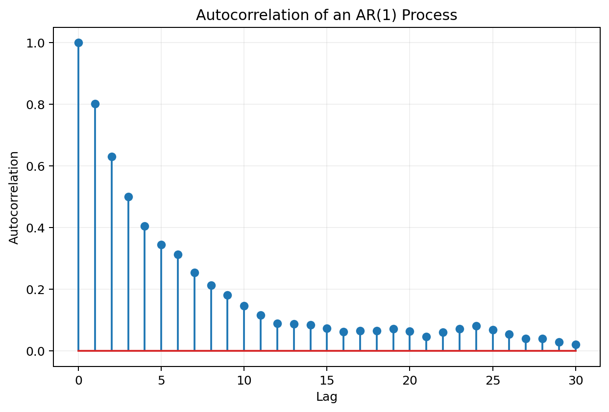
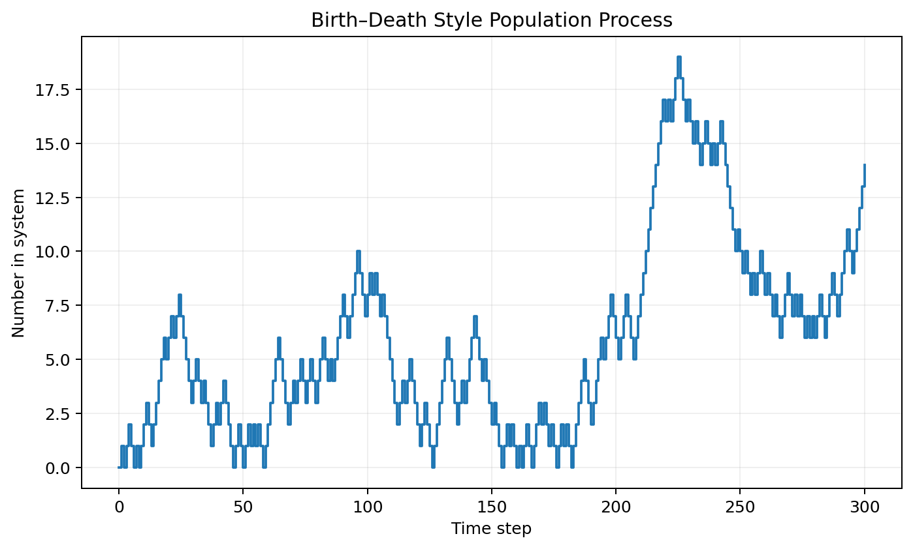
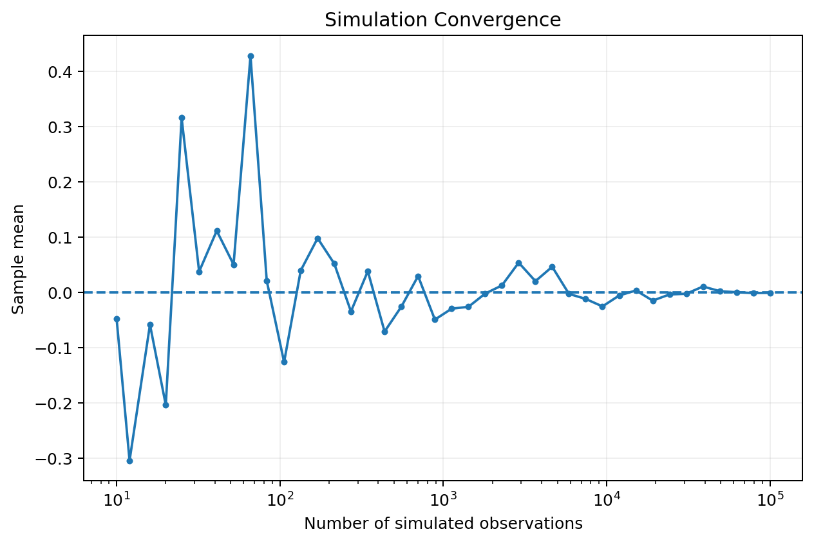

# :classical_building: Mathematics for IT Course - M.Tech. 1st Semester, IIIT Allahabad
## Unit 4: Stochastic Processes and Random Models
* ### Current Topic: Applications of Stochastic Processes and Random Models
* #### Introducing stochastic processes, random models, their mathematical structure, important classes, applications, and Python implementations.
---
## 👥 Instructor Information
* **Edited by Instructor:** [Dr. Mohammed Javed](https://sites.google.com/site/mohammedjaved2016/)
* **Email:** javed@iiita.ac.in
* **Teaching Assistants:** Mr. Apurba Chakraborty (rsi2024005@iiita.ac.in)
---
## 🎯 Learning Objectives

After studying this chapter, you should be able to:

- explain what a stochastic process is;
- distinguish deterministic and stochastic models;
- distinguish discrete-time and continuous-time processes;
- distinguish discrete-state and continuous-state processes;
- understand sample paths and finite-dimensional distributions;
- explain stationarity and dependence;
- understand random walks and Markov chains;
- understand Poisson processes and counting processes;
- introduce Brownian motion and diffusion models;
- understand autoregressive and moving-average models;
- explain mean reversion;
- understand birth-death processes;
- simulate stochastic processes using Python;
- interpret stochastic models in IT, AI, finance, engineering, and data analytics.

---

# 1. Introduction

Many real-world systems evolve over time, but their future behavior cannot be predicted with certainty.

Examples include:

- network traffic;
- stock prices;
- customer arrivals;
- machine failures;
- weather;
- sensor readings;
- website requests;
- population changes;
- queue lengths;
- user activity;
- financial returns.

A **stochastic process** provides a mathematical framework for describing such time-dependent randomness.

A useful conceptual representation is:

$$
\boxed{
\text{Randomness}
+
\text{Time}
\rightarrow
\text{Stochastic Process}
}
$$

A stochastic process is therefore a collection of random variables indexed by time.

---

# 2. Deterministic vs. Stochastic Models

A deterministic model gives the same future state whenever its initial conditions and inputs are the same.

For example:

$$
x_{t+1}=x_t+5.
$$

If:

$$
x_0=10,
$$

then:

$$
x_1=15,\quad
x_2=20,\quad
x_3=25.
$$

There is no randomness.

A stochastic model contains a random component:

$$
\boxed{
X_{t+1}=X_t+\epsilon_t.
}
$$

where:

$$
\epsilon_t
$$

is a random variable.

Different simulations can therefore produce different trajectories.

---

# 3. Definition of a Stochastic Process

A stochastic process is a collection:

$$
\boxed{
\{X_t:t\in T\}
}
$$

of random variables defined on a common probability space.

Here:

- $(t)$ = time index;
- $(X_t)$ = random state at time $(t)$;
- $(T)$ = index set.

For discrete time:

$$
T=\{0,1,2,\ldots\}.
$$

For continuous time:

$$
T=[0,\infty).
$$

A stochastic process can be viewed as a random function of time.

---

# 4. Sample Path

A **sample path** is one realization of a stochastic process.

If:

$$
\{X_t\}
$$

is a process, one simulation may generate:

$$
x_0,x_1,x_2,\ldots.
$$

Another simulation produces a different path.



This is one of the most important ideas in stochastic modeling:

> A stochastic process represents a probability distribution over possible trajectories, not just one trajectory.

---

# 5. Discrete-Time Processes

A discrete-time process is indexed by discrete values:

$$
t=0,1,2,\ldots
$$

Example:

$$
X_t=\text{number of users connected at time }t.
$$

A process might produce:

$$
5,7,6,8,10,9,\ldots
$$

at successive time points.



---

# 6. Continuous-Time Processes

A continuous-time process is indexed by real-valued time:

$$
t\ge0.
$$

Examples include:

- temperature;
- network voltage;
- stock-price models;
- physical motion;
- queueing systems.

A continuous-time process can change at any instant.

Examples include:

$$
X(t),\qquad t\ge0.
$$

---

# 7. Discrete-State and Continuous-State Processes

The state space can also be discrete or continuous.

### Discrete state

$$
X_t\in\{0,1,2,\ldots\}.
$$

Examples:

- number of customers;
- number of packets;
- number of failures.

### Continuous state

$$
X_t\in\mathbb R.
$$

Examples:

- temperature;
- voltage;
- stock price;
- sensor measurement.

This gives four common categories:

| Time | State | Example |
|---|---|---|
| Discrete | Discrete | Number of users per minute |
| Discrete | Continuous | Daily temperature |
| Continuous | Discrete | Number of customers in a queue |
| Continuous | Continuous | Sensor signal |

---

# 8. Random Models

A **random model** describes a system using random variables and probability distributions.

A general model can be written as:

$$
\boxed{
X_{t+1}=f(X_t,\epsilon_t)
}
$$

where:

- $(X_t)$ = current state;
- $(f)$ = system rule;
- $(\epsilon_t)$ = random input.

For example:

$$
X_{t+1}=0.8X_t+\epsilon_t.
$$

This model has both:

- a deterministic component $(0.8X_t)$;
- a random component $(\epsilon_t)$.

---

# 9. Why Stochastic Processes Matter

Stochastic processes are useful when the order and timing of observations matter.

Ordinary probability might ask:

> What is the probability that a server fails?

A stochastic-process model can ask:

> How does the probability of failure evolve over time?

Similarly:

- How does network traffic evolve?
- How does a queue length change?
- How does a stock price fluctuate?
- How does a user's activity change?
- How does a machine's condition deteriorate?

---

# 10. State of a Stochastic System

The **state** summarizes the information needed to describe the system at a particular time.

For example, in a queue:

$$
X_t=\text{number of customers in the system}.
$$

In a server:

$$
X_t=\text{system load}.
$$

In a machine:

$$
X_t=\text{operating condition}.
$$

The choice of state is crucial when building a stochastic model.

---

# 11. Transition Probabilities

A transition probability describes the probability of moving from one state to another.

For discrete states:

$$
\boxed{
P(X_{t+1}=j\mid X_t=i)
}
$$

is the probability of transitioning from state $(i)$ to state $(j)$.

Transition probabilities form the foundation of Markov models.

---

# 12. Markov Property

A stochastic process satisfies the **Markov property** if the future depends on the past only through the current state.

Mathematically:

$$
\boxed{
P(X_{t+1}\mid X_t,X_{t-1},\ldots,X_0)=
P(X_{t+1}\mid X_t)
}
$$

In words:

> Given the present state, the past provides no additional information about the immediate future.

This is called the **memoryless property** of the state representation.

---

# 13. Markov Chains

A discrete-time, discrete-state Markov process is commonly called a **Markov chain**.

For states:

$$
S_1,S_2,\ldots,S_n,
$$

the transition matrix is:

$$
P=
\begin{bmatrix}
p_{11}&p_{12}&\cdots&p_{1n}\\
p_{21}&p_{22}&\cdots&p_{2n}\\
\vdots&\vdots&\ddots&\vdots\\
p_{n1}&p_{n2}&\cdots&p_{nn}
\end{bmatrix}.
$$

Each row satisfies:

$$
\boxed{
\sum_jp_{ij}=1.
}
$$



---

# 14. Python: Simulating a Markov Chain

```python
import numpy as np

states = ["Low", "Medium", "High"]

P = np.array([
    [0.7, 0.3, 0.0],
    [0.2, 0.4, 0.4],
    [0.0, 0.5, 0.5]
])

rng = np.random.default_rng(42)

state = 0
history = []

for _ in range(30):
    history.append(states[state])
    state = rng.choice(
        len(states),
        p=P[state]
    )

print(history)
```

This could represent a simplified model of system load.

---

# 15. Random Walk

A random walk is one of the simplest stochastic processes.

For a one-dimensional symmetric random walk:

$$
\boxed{
X_{t+1}=X_t+\epsilon_{t+1}
}
$$

where:

$$
P(\epsilon_t=1)=\frac12
$$

and:

$$
P(\epsilon_t=-1)=\frac12.
$$

Thus the process moves one step upward or downward with equal probability.



---

# 16. Python: Random Walk

```python
import numpy as np
import matplotlib.pyplot as plt

rng = np.random.default_rng(42)

n = 1000

steps = rng.choice(
    [-1, 1],
    size=n
)

position = np.r_[
    0,
    np.cumsum(steps)
]

plt.plot(position)
plt.axhline(0, linestyle="--")
plt.xlabel("Step")
plt.ylabel("Position")
plt.title("Random Walk")
plt.show()
```

---

# 17. Properties of a Symmetric Random Walk

For a symmetric random walk starting at zero:

$$
E[X_n]=0.
$$

The variance is:

$$
\boxed{
\operatorname{Var}(X_n)=n.
}
$$

Therefore the typical spread grows approximately like:

$$
\sqrt n.
$$

This simple model provides intuition for more sophisticated stochastic processes.

---

# 18. Applications of Random Walks

Random walks are used in:

- finance;
- search algorithms;
- graph analysis;
- ranking algorithms;
- particle motion;
- population models;
- network modeling;
- reinforcement learning.

A random walk on a graph can also describe how an agent moves from node to node.

---

# 19. Poisson Process

A Poisson process models random arrivals over continuous time.

Let:

$$
N(t)
$$

be the number of events observed by time $(t)$.

For rate $(\lambda)$:

$$
\boxed{
N(t)\sim\text{Poisson}(\lambda t).
}
$$

The probability of $(k)$ arrivals is:

$$
\boxed{
P(N(t)=k)=
e^{-\lambda t}
\frac{(\lambda t)^k}{k!}.
}
$$



---

# 20. Interarrival Times

For a Poisson process, interarrival times are exponentially distributed.

If:

$$
T\sim\text{Exponential}(\lambda),
$$

then:

$$
\boxed{
f_T(t)=\lambda e^{-\lambda t},
\quad t\ge0.
}
$$

The expected interarrival time is:

$$
\boxed{
E[T]=\frac1\lambda.
}
$$

---

# 21. Python: Simulating a Poisson Process

```python
import numpy as np
import matplotlib.pyplot as plt

rng = np.random.default_rng(42)

rate = 2.0
interarrival = rng.exponential(
    scale=1/rate,
    size=1000
)

arrival_times = np.cumsum(interarrival)

arrival_times = arrival_times[
    arrival_times <= 10
]

plt.eventplot(arrival_times)
plt.xlabel("Time")
plt.title("Poisson Process Arrivals")
plt.show()
```

Applications include:

- web requests;
- phone calls;
- packets;
- customer arrivals;
- machine failures under suitable assumptions.

---

# 22. Counting Processes

A counting process $(N(t))$ records the number of events occurring by time $(t)$.

Properties typically include:

$$
N(0)=0
$$

and:

$$
N(t)\ge0.
$$

A counting process is non-decreasing:

$$
t_1<t_2
\Rightarrow
N(t_1)\le N(t_2).
$$

The Poisson process is one important example.

---

# 23. Brownian Motion

Brownian motion, also called a Wiener process, is a foundational continuous-time stochastic process.

A standard Brownian motion $(B(t))$ satisfies:

1. $(B(0)=0)$;
2. independent increments;
3. $(B(t)-B(s)\sim N(0,t-s))$ for $(t>s)$;
4. sample paths are continuous.

Thus:

$$
\boxed{
B(t)-B(s)\sim N(0,t-s).
}
$$



---

# 24. Brownian Motion Simulation

For a small time step $(\Delta t)$:

$$
\boxed{
B_{t+\Delta t}=
B_t+\sqrt{\Delta t}Z_t
}
$$

where:

$$
Z_t\sim N(0,1).
$$

Python:

```python
import numpy as np
import matplotlib.pyplot as plt

rng = np.random.default_rng(42)

T = 10
n = 5000
dt = T / n

increments = np.sqrt(dt) * rng.normal(
    size=n
)

B = np.r_[
    0,
    np.cumsum(increments)
]

time = np.linspace(0, T, n + 1)

plt.plot(time, B)
plt.xlabel("Time")
plt.ylabel("B(t)")
plt.title("Simulated Brownian Motion")
plt.show()
```

---

# 25. Brownian Motion and Diffusion

A generalized diffusion process can be represented as:

$$
\boxed{
dX_t=
\mu(X_t,t)\,dt
+
\sigma(X_t,t)\,dB_t.
}
$$

Here:

- $(\mu)$ = drift;
- $(\sigma)$ = volatility or diffusion coefficient;
- $(B_t)$ = Brownian motion.

This equation provides a foundation for many continuous-time random models.

---

# 26. Geometric Brownian Motion

A common model for a positive-valued quantity is:

$$
\boxed{
dS_t=\mu S_t\,dt+\sigma S_t\,dB_t.
}
$$

This is called geometric Brownian motion.

It has been used historically as a simplified model for asset prices.

A discrete simulation can use:

$$
S_{t+\Delta t}=
S_t
\exp
\left[
\left(\mu-\frac12\sigma^2\right)\Delta t
+
\sigma\sqrt{\Delta t}Z
\right].
$$

---

# 27. Python: Geometric Brownian Motion

```python
import numpy as np
import matplotlib.pyplot as plt

rng = np.random.default_rng(42)

S0 = 100
mu = 0.08
sigma = 0.2

T = 1
n = 252
dt = T / n

z = rng.normal(size=n)

increments = (
    (mu - 0.5 * sigma**2) * dt
    + sigma * np.sqrt(dt) * z
)

S = S0 * np.exp(
    np.r_[0, np.cumsum(increments)]
)

plt.plot(S)
plt.xlabel("Time step")
plt.ylabel("S(t)")
plt.title("Geometric Brownian Motion")
plt.show()
```

This is an illustrative model, not a guarantee of real-world market behavior.

---

# 28. Mean-Reverting Processes

Some systems tend to return toward a long-run average.

A simple model is:

$$
\boxed{
X_{t+1}=
X_t+\theta(\mu-X_t)\Delta t
+
\sigma\sqrt{\Delta t}Z_t.
}
$$

If:

$$
X_t>\mu,
$$

the drift term tends to pull $(X_t)$ downward.

If:

$$
X_t<\mu,
$$

the drift tends to pull it upward.

---

# 29. Ornstein-Uhlenbeck Process

The continuous-time version is:

$$
\boxed{
dX_t=
\theta(\mu-X_t)\,dt
+
\sigma\,dB_t.
}
$$

This is called the **Ornstein-Uhlenbeck process**.



It is useful for modeling:

- mean-reverting quantities;
- sensor processes;
- interest-rate models;
- physical systems;
- some financial variables.

---

# 30. Python: Ornstein-Uhlenbeck Simulation

```python
import numpy as np
import matplotlib.pyplot as plt

rng = np.random.default_rng(42)

theta = 1.0
mu = 0.0
sigma = 0.8

dt = 0.01
n = 3000

X = np.zeros(n)

for t in range(1, n):
    noise = rng.normal()

    X[t] = (
        X[t-1]
        + theta * (mu - X[t-1]) * dt
        + sigma * np.sqrt(dt) * noise
    )

plt.plot(np.arange(n) * dt, X)
plt.axhline(mu, linestyle="--")
plt.xlabel("Time")
plt.ylabel("X(t)")
plt.title("Ornstein-Uhlenbeck Process")
plt.show()
```

---

# 31. Autoregressive Models

A simple autoregressive model is AR(1):

$$
\boxed{
X_t=c+\phi X_{t-1}+\epsilon_t.
}
$$

where:

- $(c)$ = intercept;
- $(\phi)$ = autoregressive coefficient;
- $(\epsilon_t)$ = random error.

If:

$$
|\phi|<1,
$$

the process is stationary under standard assumptions.

---

# 32. Python: AR(1) Process

```python
import numpy as np
import matplotlib.pyplot as plt

rng = np.random.default_rng(42)

phi = 0.8
n = 1000

X = np.zeros(n)

for t in range(1, n):
    X[t] = (
        phi * X[t-1]
        + rng.normal()
    )

plt.plot(X)
plt.xlabel("Time")
plt.ylabel("X(t)")
plt.title("AR(1) Stochastic Process")
plt.show()
```

---

# 33. Autocorrelation

Stochastic observations may be dependent across time.

The autocorrelation at lag $(k)$ is:

$$
\boxed{
\rho(k)=
\operatorname{Corr}(X_t,X_{t-k}).
}
$$

If:

$$
\rho(k)\approx0,
$$

there is little linear dependence at lag $(k)$.

For an AR(1) process with parameter $(\phi)$, the theoretical autocorrelation is:

$$
\boxed{
\rho(k)=\phi^k
}
$$

under the standard stationary model.



---

# 34. Stationarity

Stationarity means that the statistical behavior of a process does not change over time in an appropriate sense.

A **strictly stationary** process satisfies:

$$
(X_{t_1},\ldots,X_{t_n})
\overset{d}{=}
(X_{t_1+h},\ldots,X_{t_n+h})
$$

for all suitable $(h)$.

A **weakly stationary** process generally requires:

1. constant mean;
2. constant finite variance;
3. covariance depending only on lag.

Stationarity is important in time-series modeling.

---

# 35. Why Stationarity Matters

Many statistical models assume stable relationships over time.

If a process has a changing mean:

$$
E[X_t]
$$

or changing variance:

$$
\operatorname{Var}(X_t),
$$

a stationary model may be inappropriate.

Examples of non-stationarity include:

- long-term growth;
- changing seasonal behavior;
- structural breaks;
- evolving variance.

---

# 36. White Noise

White noise is a basic random process.

A common model is:

$$
\boxed{
X_t=\epsilon_t
}
$$

where:

$$
E[\epsilon_t]=0
$$

and:

$$
\text{Cov}(\epsilon_t,\epsilon_s)=0
$$

for $(t\ne s)$.

Often:

$$
\epsilon_t\sim N(0,\sigma^2).
$$

White noise is frequently used as an innovation or error process.

---

# 37. Moving Average Models

An MA(q) process can be written:

$$
\boxed{
X_t=
\mu
+
\epsilon_t
+
\theta_1\epsilon_{t-1}
+\cdots+
\theta_q\epsilon_{t-q}.
}
$$

An MA process depends on current and previous random shocks.

AR and MA models can be combined into ARMA models.

---

# 38. ARMA Models

An ARMA(p,q) process combines:

- autoregressive terms;
- moving-average terms.

A simplified form is:

$$
X_t=
c+
\sum_{i=1}^{p}\phi_iX_{t-i}
+
\epsilon_t
+
\sum_{j=1}^{q}\theta_j\epsilon_{t-j}.
$$

ARMA models are useful for time-series forecasting when stationarity is reasonable.

---

# 39. Birth-Death Processes

A birth-death process is a continuous-time Markov process in which the state can:

- increase by one;
- decrease by one.

Examples:

- population growth;
- queue length;
- number of active processes;
- customers in a service system.



---

# 40. Python: Simple Birth-Death Simulation

```python
import numpy as np
import matplotlib.pyplot as plt

rng = np.random.default_rng(42)

state = 0
history = [state]

for _ in range(500):
    # Birth or arrival
    if state == 0 or rng.random() < 0.55:
        state += 1
    # Death or departure
    else:
        state -= 1

    history.append(state)

plt.step(
    range(len(history)),
    history,
    where="post"
)

plt.xlabel("Time step")
plt.ylabel("State")
plt.title("Birth-Death Style Process")
plt.show()
```

This is an educational simulation. Formal birth-death models specify explicit transition rates.

---

# 41. Queueing as a Stochastic Process

Let:

$$
Q(t)
$$

be the number of customers in a queue.

The queue length changes because of:

- arrivals;
- departures.

A simple representation is:

$$
\boxed{
Q(t)=
Q(0)+A(t)-D(t)
}
$$

where:

- $(A(t))$ = cumulative arrivals;
- $(D(t))$ = cumulative departures.

This is an example of how queueing systems can be modeled as stochastic processes.

---

# 42. Stochastic Processes in Computer Networks

Network traffic is inherently variable.

A process may represent:

$$
X_t=\text{number of packets during interval }t.
$$

Possible models include:

- Poisson processes;
- Markov chains;
- autoregressive models;
- queueing processes;
- self-similar or long-memory models.

These models support:

- capacity planning;
- latency prediction;
- anomaly detection;
- network reliability.

---

# 43. Stochastic Processes in AI

AI systems often process data sequentially.

Examples:

- speech;
- text;
- video;
- user behavior;
- sensor streams;
- robot trajectories.

A sequence can be represented as:

$$
X_1,X_2,\ldots,X_T.
$$

The dependence between observations is often essential.

Stochastic-process ideas therefore appear in:

- hidden Markov models;
- state-space models;
- time-series forecasting;
- reinforcement learning;
- sequential Bayesian inference.

---

# 44. Hidden Markov Models

In a Hidden Markov Model (HMM):

- the system has hidden states $(Z_t)$;
- observations $(X_t)$ are generated from those states.

The structure is:

$$
Z_1\rightarrow Z_2\rightarrow Z_3\rightarrow\cdots
$$

with observations:

$$
X_1,X_2,X_3,\ldots
$$

conditioned on the hidden states.

Applications include:

- speech recognition;
- sequence labeling;
- biological sequence analysis;
- activity recognition.

---

# 45. State-Space Models

A general state-space model has:

### State equation

$$
\boxed{
X_t=f(X_{t-1},U_t)
}
$$

### Observation equation

$$
\boxed{
Y_t=g(X_t,V_t)
}
$$

where $(U_t)$ and $(V_t)$ are random noise terms.

This separates:

- hidden system state;
- observed measurements.

State-space models are important in signal processing and tracking.

---

# 46. Kalman Filtering

The Kalman filter is a classic algorithm for estimating a hidden state from noisy observations.

A simplified model is:

$$
X_t=AX_{t-1}+W_t
$$

and:

$$
Y_t=CX_t+V_t.
$$

The algorithm alternates between:

1. prediction;
2. measurement update.

Applications include:

- robotics;
- navigation;
- sensor fusion;
- tracking;
- control systems.

---

# 47. Stochastic Processes in Reinforcement Learning

In reinforcement learning, an agent interacts with an environment.

A simplified transition model is:

$$
\boxed{
P(S_{t+1},R_{t+1}\mid S_t,A_t)
}
$$

where:

- $(S_t)$ = state;
- $(A_t)$ = action;
- $(R_t)$ = reward.

This creates a stochastic sequence of states and rewards.

Markov Decision Processes provide a formal framework for this setting.

---

# 48. Markov Decision Processes

An MDP is commonly defined by:

$$
(S,A,P,R,\gamma)
$$

where:

- $(S)$ = state space;
- $(A)$ = action space;
- $(P)$ = transition probabilities;
- $(R)$ = reward function;
- $(\gamma)$ = discount factor.

The transition model is:

$$
P(s'\mid s,a).
$$

The agent chooses actions to maximize expected cumulative reward.

---

# 49. Stochastic Processes in Data Analytics

Time-series analytics often begins with:

$$
\{X_t\}_{t=1}^T.
$$

Typical questions include:

- Is the process stationary?
- Is there autocorrelation?
- Is there seasonality?
- Is the variance changing?
- Can the future be predicted?
- Are there unusual observations?

Probability and stochastic-process models provide the mathematical foundation for answering these questions.

---

# 50. Simulation as a Modeling Tool

When an analytical solution is difficult, simulation can be used.

The general workflow is:

```text
Define Model
     ↓
Specify Random Variables
     ↓
Generate Random Inputs
     ↓
Simulate Process
     ↓
Collect Sample Paths
     ↓
Estimate Quantities
     ↓
Validate Model
```

Simulation is widely used in:

- engineering;
- finance;
- networking;
- operations research;
- AI;
- reliability analysis.

---

# 51. Monte Carlo Estimation

Suppose we want:

$$
E[g(X)].
$$

Generate independent samples:

$$
X_1,\ldots,X_N.
$$

Then:

$$
\boxed{
E[g(X)]
\approx
\frac1N
\sum_{i=1}^{N}g(X_i).
}
$$

The estimate generally becomes more stable as $(N)$ increases.



---

# 52. Python: Monte Carlo Expectation

Suppose:

$$
X\sim N(0,1)
$$

and we want:

$$
E[X^2].
$$

Theoretical result:

$$
E[X^2]=1.
$$

Simulation:

```python
import numpy as np

rng = np.random.default_rng(42)

N = 1_000_000

X = rng.normal(
    loc=0,
    scale=1,
    size=N
)

estimate = np.mean(X**2)

print("Estimated E[X^2]:", estimate)
```

The result should be close to 1.

---

# 53. Random Number Generation

Simulation depends on random-number generation.

NumPy provides:

```python
rng = np.random.default_rng(42)
```

The value `42` is a **seed**.

Using the same seed makes the simulation reproducible.

For example:

```python
rng = np.random.default_rng(42)

x = rng.normal(
    size=10
)
```

Reproducibility is important for:

- experiments;
- debugging;
- teaching;
- scientific computing.

---

# 54. Pseudorandom Numbers

Computers generally generate **pseudorandom** numbers using deterministic algorithms.

They are designed to have statistical properties resembling random samples.

For most simulations:

```python
np.random.default_rng()
```

is a convenient generator.

For cryptographic applications, use appropriate cryptographic randomness rather than ordinary simulation generators.

---

# 55. Expectations of Stochastic Processes

For a stochastic process $(X_t)$, the mean function is:

$$
\boxed{
m_X(t)=E[X_t].
}
$$

The variance function is:

$$
\boxed{
v_X(t)=\text{Var}(X_t).
}
$$

The covariance function is:

$$
\boxed{
C_X(s,t)=
\text{Cov}(X_s,X_t).
}
$$

These functions describe important statistical properties of a process.

---

# 56. Autocovariance Function

For a stationary process, covariance depends only on the lag.

Let:

$$
h=t-s.
$$

Then:

$$
\boxed{
\gamma(h)=
\text{Cov}(X_t,X_{t-h}).
}
$$

The autocorrelation function is:

$$
\boxed{
\rho(h)=
\frac{\gamma(h)}{\gamma(0)}.
}
$$

These quantities are fundamental in time-series analysis.

---

# 57. Independent vs. Uncorrelated

Two random variables can be independent.

Then:

$$
P(X,Y)=P(X)P(Y).
$$

Independence generally implies zero covariance when moments exist:

$$
\text{Cov}(X,Y)=0.
$$

However:

$$
\boxed{
\text{Cov}(X,Y)=0
\not\Rightarrow
X,Y\text{ are independent}
}
$$

in general.

This distinction is important when building stochastic models.

---

# 58. White Noise vs. Random Walk

These two processes are often confused.

### White noise

$$
X_t=\epsilon_t
$$

has little or no serial dependence.

### Random walk

$$
X_t=X_{t-1}+\epsilon_t.
$$

The random walk accumulates shocks and is typically non-stationary.

Thus:

$$
\boxed{
\text{White noise} \ne \text{Random walk}
}
$$

---

# 59. Random Walk and Non-Stationarity

For:

$$
X_t=X_{t-1}+\epsilon_t,
$$

with:

$$
X_0=0
$$

and independent zero-mean noise:

$$
E[X_t]=0
$$

but:

$$
\text{Var}(X_t)=t\sigma^2.
$$

The variance changes with time.

Therefore the standard random walk is not weakly stationary.

---

# 60. First Differences

For a random walk:

$$
X_t=X_{t-1}+\epsilon_t,
$$

the first difference is:

$$
\boxed{
\Delta X_t=
X_t-X_{t-1}
=
\epsilon_t.
}
$$

If the noise is stationary, differencing can transform a non-stationary process into a stationary series.

This is one reason differencing is important in time-series analysis.

---

# 61. Forecasting a Stochastic Process

Suppose we observe:

$$
X_1,\ldots,X_t.
$$

A forecast can be written:

$$
\boxed{
E[X_{t+h}\mid X_1,\ldots,X_t].
}
$$

This is a conditional expectation.

A probabilistic forecast can provide not only:

$$
\hat X_{t+h}
$$

but also an uncertainty distribution:

$$
P(X_{t+h}\mid X_1,\ldots,X_t).
$$

---

# 62. Point Forecast vs. Probabilistic Forecast

A point forecast:

$$
\hat X_{t+1}=100.
$$

A probabilistic forecast may say:

$$
X_{t+1}\sim N(100,10^2).
$$

The second statement communicates uncertainty.

This is especially important when decisions depend on risk.

---

# 63. Stochastic Models in Reliability

Let:

$$
T=\text{time to system failure}.
$$

The survival probability is:

$$
\boxed{
S(t)=P(T>t).
}
$$

The failure distribution is:

$$
F(t)=P(T\le t).
$$

The two satisfy:

$$
\boxed{
S(t)=1-F(t).
}
$$

Stochastic reliability models are used for:

- servers;
- hardware;
- networks;
- industrial machines;
- software systems.

---

# 64. Hazard Rate

The hazard rate describes the instantaneous failure rate conditional on survival.

For a continuous lifetime variable:

$$
\boxed{
h(t)=
\frac{f(t)}{S(t)}
}
$$

where:

- $(f(t))$ = density;
- $(S(t))$ = survival function.

Hazard models are useful for reliability and survival analysis.

---

# 65. Stochastic Processes in Queueing

A queue can be modeled through a process:

$$
Q(t).
$$

Possible state changes:

$$
Q\rightarrow Q+1
$$

when an arrival occurs, and:

$$
Q\rightarrow Q-1
$$

when a service completion occurs.

This connects stochastic processes to:

- queueing theory;
- network capacity;
- server provisioning;
- call centers;
- cloud computing.

---

# 66. Stochastic Processes in Inventory

Let:

$$
I_t=\text{inventory level at time }t.
$$

Demand can be modeled as a random variable:

$$
D_t.
$$

Then:

$$
\boxed{
I_{t+1}=
I_t+\text{replenishment}_t-D_t.
}
$$

Uncertain demand makes inventory a stochastic process.

This supports:

- safety stock calculations;
- service-level analysis;
- supply-chain planning.

---

# 67. Stochastic Processes in Population Models

Let:

$$
X_t=\text{population at time }t.
$$

A stochastic population model may be:

$$
X_{t+1}=X_t+B_t-D_t
$$

where:

- $(B_t)$ = births;
- $(D_t)$ = deaths.

Both can be random.

Such models are useful when population counts are small or random effects are significant.

---

# 68. Stochastic Differential Equations

A stochastic differential equation (SDE) includes random noise.

General form:

$$
\boxed{
dX_t=
\mu(X_t,t)dt
+
\sigma(X_t,t)dB_t.
}
$$

The first term describes systematic change.

The second term describes random fluctuations.

SDEs are used in:

- finance;
- physics;
- biology;
- control;
- signal processing.

---

# 69. Euler-Maruyama Method

A simple numerical method for:

$$
dX_t=\mu(X_t,t)dt+\sigma(X_t,t)dB_t
$$

is:

$$
\boxed{
X_{t+\Delta t}=
X_t
+
\mu(X_t,t)\Delta t
+
\sigma(X_t,t)\sqrt{\Delta t}Z_t.
}
$$

where:

$$
Z_t\sim N(0,1).
$$

This is the stochastic analogue of the Euler numerical method.

---

# 70. Python: Euler-Maruyama

```python
import numpy as np
import matplotlib.pyplot as plt

rng = np.random.default_rng(42)

theta = 1.0
mu = 2.0
sigma = 0.5

dt = 0.01
n = 2000

X = np.zeros(n)
X[0] = 0

for i in range(1, n):
    z = rng.normal()

    X[i] = (
        X[i-1]
        + theta * (mu - X[i-1]) * dt
        + sigma * np.sqrt(dt) * z
    )

plt.plot(np.arange(n) * dt, X)
plt.axhline(mu, linestyle="--")
plt.xlabel("Time")
plt.ylabel("X(t)")
plt.title("Euler-Maruyama Simulation")
plt.show()
```

---

# 71. Model Validation

A stochastic model should not be accepted simply because it produces plausible-looking plots.

Validation should compare:

- empirical mean;
- variance;
- autocorrelation;
- distribution;
- event frequencies;
- extreme values;
- forecasting performance.

The model should be tested against real observations whenever possible.

---

# 72. Simulation vs. Analytical Models

### Analytical model

Uses mathematical formulas to derive results.

Advantages:

- exact when assumptions hold;
- efficient;
- interpretable.

### Simulation model

Generates sample paths numerically.

Advantages:

- flexible;
- handles complicated systems;
- useful when analytical solutions are difficult.

In practice, both approaches can complement each other.

---

# 73. Common Modeling Assumptions

Common assumptions include:

- independence;
- stationarity;
- normality;
- Markov property;
- Poisson arrivals;
- exponential waiting times;
- constant rates;
- linear relationships.

These assumptions simplify analysis but may not always hold.

A good model should make assumptions explicit.

---

# 74. Common Mistakes

### Mistake 1: Confusing randomness with lack of structure

A stochastic process can have strong mathematical structure.

### Mistake 2: Assuming independence

Time-series observations are often dependent.

### Mistake 3: Ignoring stationarity

Many time-series models require stable statistical behavior.

### Mistake 4: Treating a sample path as the process

One trajectory is only one realization.

### Mistake 5: Using simulation without validation

A simulation can be precise about the wrong model.

### Mistake 6: Choosing a model only because it is mathematically convenient

Model choice should be guided by data and system knowledge.

---

# 75. Python Toolkit

Useful libraries include:

```python
import numpy as np
import pandas as pd
import matplotlib.pyplot as plt
from scipy import stats
```

For time-series and statistical modeling:

```python
import statsmodels.api as sm
```

For machine learning:

```python
from sklearn.model_selection import train_test_split
```

NumPy is especially useful for:

- random sampling;
- vectorized simulation;
- numerical calculations.

---

# 76. Reusable Simulation Function

A reusable random-walk simulator:

```python
import numpy as np

def random_walk(n_steps, seed=None):
    rng = np.random.default_rng(seed)

    steps = rng.choice(
        [-1, 1],
        size=n_steps
    )

    return np.r_[
        0,
        np.cumsum(steps)
    ]


path = random_walk(
    n_steps=1000,
    seed=42
)

print(path[:10])
```

Writing simulations as functions makes experiments easier to reproduce.

---

# 77. Multiple Sample Paths

Instead of simulating one path:

```python
paths = []

for _ in range(100):
    paths.append(
        random_walk(500)
    )
```

We can study:

- average trajectory;
- variance;
- probability of reaching a threshold;
- distribution at a particular time.

This illustrates the distinction between a process and a realization.

---

# 78. Estimating Probability From Simulations

Suppose we want:

$$
P(X_T>10).
$$

Simulate many paths and count how many satisfy the condition.

```python
import numpy as np

rng = np.random.default_rng(42)

n_simulations = 10_000
n_steps = 100

final_positions = []

for _ in range(n_simulations):
    steps = rng.choice(
        [-1, 1],
        size=n_steps
    )

    final_positions.append(
        np.sum(steps)
    )

final_positions = np.array(final_positions)

probability = np.mean(
    final_positions > 10
)

print("Estimated probability:", probability)
```

---

# 79. Confidence in Simulation Estimates

If:

$$
\hat p
$$

is estimated from $(N)$ independent Bernoulli simulation outcomes, a rough standard error is:

$$
\boxed{
SE(\hat p)
\approx
\sqrt{\frac{\hat p(1-\hat p)}{N}}.
}
$$

Thus more simulations generally reduce Monte Carlo error.

This is different from model uncertainty: increasing simulation count does not fix an incorrect model.

---

# 80. Stochastic Processes and Big Data

Large-scale data often arrive as streams:

- click events;
- IoT sensors;
- transactions;
- logs;
- network packets.

Stochastic-process models can help identify:

- normal behavior;
- trends;
- dependence;
- anomalies;
- future states.

This makes stochastic modeling highly relevant to modern data engineering and analytics.

---

# 81. Stochastic Processes in IoT

An IoT device can produce:

$$
X_t=\text{sensor reading at time }t.
$$

The process may contain:

- measurement noise;
- drift;
- seasonal patterns;
- sudden changes.

Models can be used for:

- filtering;
- forecasting;
- anomaly detection;
- predictive maintenance.

---

# 82. Predictive Maintenance

Suppose:

$$
X_t
$$

represents vibration measurements from a machine.

A stochastic model can estimate:

$$
P(\text{failure within }30\text{ days}\mid X_{1:t}).
$$

This supports proactive maintenance.

The workflow may be:

```text
Sensor Data
     ↓
Feature Extraction
     ↓
Stochastic Model
     ↓
Failure Probability
     ↓
Maintenance Decision
```

---

# 83. Stochastic Processes and Anomaly Detection

A time-series anomaly is an observation that is unlikely under the assumed process.

For example:

$$
P(X_t\mid X_{t-1},X_{t-2},\ldots)
$$

may be unusually small.

A likelihood-based anomaly score can be:

$$
\boxed{
A_t=-\log P(X_t\mid\text{history}).
}
$$

Large values indicate surprising observations.

---

# 84. Stochastic Processes and Forecasting

Forecasting a stochastic process requires acknowledging uncertainty.

Instead of:

$$
X_{t+1}=100,
$$

we may estimate:

$$
X_{t+1}\sim P(\cdot\mid X_{1:t}).
$$

This allows:

- prediction intervals;
- risk estimates;
- probability of threshold crossing;
- scenario analysis.

---

# 85. Threshold Crossing

A useful stochastic-process question is:

> What is the probability that the process reaches a threshold before a specified time?

For example:

$$
P\left(
\max_{0\le t\le T}X_t\ge a
\right).
$$

Applications include:

- financial risk;
- server overload;
- queue overflow;
- temperature limits;
- battery failure.

These problems can often be solved analytically for simple models or approximately through simulation.

---

# 86. Random Models and Decision Making

A stochastic model can produce:

$$
P(\text{event}\mid\text{data}).
$$

A decision then combines probability with consequences.

For action $(a)$:

$$
\boxed{
EU(a)
=
E[U(a,S)\mid\text{data}]
}
$$

where $(S)$ is the uncertain state.

Thus:

$$
\boxed{
\text{Stochastic model}
\rightarrow
\text{Probability}
\rightarrow
\text{Expected utility}
\rightarrow
\text{Decision}
}
$$

---

# 87. A General Workflow for Building a Random Model

### Step 1 — Define the system

What is being modeled?

### Step 2 — Define the state

What variables summarize the system?

### Step 3 — Define time

Is time discrete or continuous?

### Step 4 — Identify randomness

Where does uncertainty enter?

### Step 5 — Choose a model

Possible choices:

- random walk;
- Markov chain;
- Poisson process;
- AR model;
- state-space model;
- diffusion;
- birth-death process.

### Step 6 — Estimate parameters

Use historical data or domain knowledge.

### Step 7 — Simulate

Generate sample paths.

### Step 8 — Validate

Compare model behavior with observed data.

### Step 9 — Use the model

Forecast, optimize, detect anomalies, or quantify risk.

---

# 88. Mini Project: Network Traffic Model

Model the number of requests arriving at a server.

Assume a Poisson arrival process.

```python
import numpy as np
import matplotlib.pyplot as plt

rng = np.random.default_rng(42)

rate = 5
T = 60

counts = rng.poisson(
    lam=rate,
    size=T
)

plt.plot(counts, marker="o")
plt.axhline(rate, linestyle="--")
plt.xlabel("Minute")
plt.ylabel("Requests")
plt.title("Simulated Server Request Counts")
plt.show()
```

Questions to investigate:

1. What is the average number of requests?
2. What is the variance?
3. How often does demand exceed 10 requests per minute?
4. Is a Poisson model reasonable for real traffic?

---

# 89. Mini Project: User Activity as a Markov Chain

Suppose a user can be in:

```text
Inactive
Active
Highly Active
```

Define a transition matrix:

$$
P=
\begin{bmatrix}
0.7&0.3&0\\
0.2&0.5&0.3\\
0.1&0.4&0.5
\end{bmatrix}.
$$

Simulate user states over 100 days.

Questions:

- What state is most common?
- What is the long-run distribution?
- How sensitive are results to transition probabilities?

---

# 90. Mini Project: Sensor Data

Generate an Ornstein-Uhlenbeck process and treat it as a sensor.

Tasks:

1. simulate 5,000 observations;
2. plot the process;
3. calculate the sample mean;
4. calculate the sample variance;
5. calculate autocorrelation;
6. detect unusually large observations.

This exercise demonstrates:

- stochastic dynamics;
- mean reversion;
- dependence;
- simulation;
- anomaly detection.

---

# 91. Mini Project: Random Walk Risk

Simulate 10,000 random walks.

Estimate:

$$
P(X_{100}>20).
$$

Then repeat for:

$$
n=100,\quad500,\quad1000.
$$

Compare how the distribution changes.

This helps build intuition for:

- variance growth;
- simulation;
- probability estimation;
- random trajectories.

---

# 92. Key Concepts at a Glance

| Concept | Main idea |
|---|---|
| Stochastic process | Random variables indexed by time |
| Sample path | One realization of a process |
| Random walk | Random increments over time |
| Markov chain | Future depends on current state |
| Poisson process | Random event arrivals |
| Brownian motion | Continuous-time random fluctuations |
| Diffusion | Drift + random noise |
| AR(1) | Current value depends on previous value |
| Stationarity | Stable statistical behavior |
| White noise | Uncorrelated random innovations |
| Birth-death process | State changes by ±1 |
| State-space model | Hidden state plus observations |
| Simulation | Numerical generation of sample paths |
| Monte Carlo | Probability estimation through random sampling |

---

# 93. Key Formulas

### Stochastic process

$$
\boxed{
\{X_t:t\in T\}
}
$$

### Markov property

$$
\boxed{
P(X_{t+1}\mid X_t,X_{t-1},\ldots)=
P(X_{t+1}\mid X_t)
}
$$

### Random walk

$$
\boxed{
X_{t+1}=X_t+\epsilon_{t+1}
}
$$

### Poisson process

$$
\boxed{
N(t)\sim\operatorname{Poisson}(\lambda t)
}
$$

### Poisson probability

$$
\boxed{
P(N(t)=k)=
e^{-\lambda t}
\frac{(\lambda t)^k}{k!}
}
$$

### Brownian increment

$$
\boxed{
B(t)-B(s)\sim N(0,t-s)
}
$$

### Diffusion

$$
\boxed{
dX_t=\mu(X_t,t)dt+\sigma(X_t,t)dB_t
}
$$

### AR(1)

$$
\boxed{
X_t=c+\phi X_{t-1}+\epsilon_t
}
$$

### Autocorrelation

$$
\boxed{
\rho(k)=\operatorname{Corr}(X_t,X_{t-k})
}
$$

### Monte Carlo expectation

$$
\boxed{
E[g(X)]
\approx
\frac1N\sum_{i=1}^Ng(X_i)
}
$$

### Survival function

$$
\boxed{
S(t)=P(T>t)
}
$$

### Hazard rate

$$
\boxed{
h(t)=\frac{f(t)}{S(t)}
}
$$

---

# 94. Practice Questions

1. Define a stochastic process.
2. What is a sample path?
3. Explain the difference between deterministic and stochastic models.
4. Distinguish discrete-time and continuous-time processes.
5. Distinguish discrete-state and continuous-state processes.
6. Explain the Markov property.
7. What is a transition probability?
8. Explain a random walk.
9. What is a Poisson process?
10. What is an interarrival time?
11. Explain Brownian motion.
12. What is a diffusion process?
13. Explain mean reversion.
14. What is an AR(1) process?
15. What is stationarity?
16. What is autocorrelation?
17. Explain white noise.
18. Distinguish white noise and a random walk.
19. What is a birth-death process?
20. Explain a state-space model.
21. What is a hidden Markov model?
22. How are stochastic processes used in AI?
23. How are stochastic processes used in network modeling?
24. Explain Monte Carlo simulation.
25. Why is model validation necessary?

---

# 95. Python Exercises

### Exercise 1 — Random Walk

Simulate 10 random-walk paths and plot them together.

### Exercise 2 — Random Walk Probability

Estimate:

$$
P(X_{100}>20).
$$

### Exercise 3 — Markov Chain

Create a three-state Markov chain and estimate its long-run state frequencies.

### Exercise 4 — Poisson Process

Simulate network requests for one hour.

### Exercise 5 — Brownian Motion

Generate five Brownian-motion sample paths.

### Exercise 6 — Ornstein-Uhlenbeck

Simulate a mean-reverting process for several parameter values.

### Exercise 7 — AR(1)

Compare:

$$
\phi=0.2,\quad0.8,\quad0.99.
$$

Study their autocorrelation.

### Exercise 8 — Monte Carlo

Estimate an expected value using 100, 1,000, and 100,000 samples.

### Exercise 9 — Anomaly Detection

Inject unusual observations into a stochastic time series and detect them.

### Exercise 10 — Queue Process

Simulate arrivals and departures and track queue length over time.

---

# 96. Final Perspective

A stochastic process provides a mathematical language for systems that evolve under uncertainty.

The central idea is:

$$
\boxed{
\text{State at time }t
+
\text{Randomness}
\rightarrow
\text{State at future time}
}
$$

Different assumptions lead to different models:

$$
\boxed{
\begin{array}{c}
\text{Random Walk}\\
\text{Markov Chain}\\
\text{Poisson Process}\\
\text{Brownian Motion}\\
\text{AR/MA Models}\\
\text{State-Space Models}\\
\text{Birth-Death Processes}\\
\text{Diffusion Models}
\end{array}
}
$$

These models form a bridge between probability theory and practical applications.

They are useful in:

- Information Technology;
- Artificial Intelligence;
- Data Analytics;
- cybersecurity;
- networking;
- cloud computing;
- finance;
- engineering;
- operations research;
- IoT;
- reliability;
- robotics.

The most important practical lesson is:

> **A stochastic model is not simply a random simulation. It is a structured representation of how uncertainty evolves over time.**

Good stochastic modeling combines:

$$
\boxed{
\text{Probability}
+
\text{Data}
+
\text{Domain Knowledge}
+
\text{Simulation}
+
\text{Validation}
}
$$

---
## 📚 References 
* **[R-01]** Linear Algebra by Gilbert Strang, MIT Press
* **[R-02]** AI Tools for examples and codes

